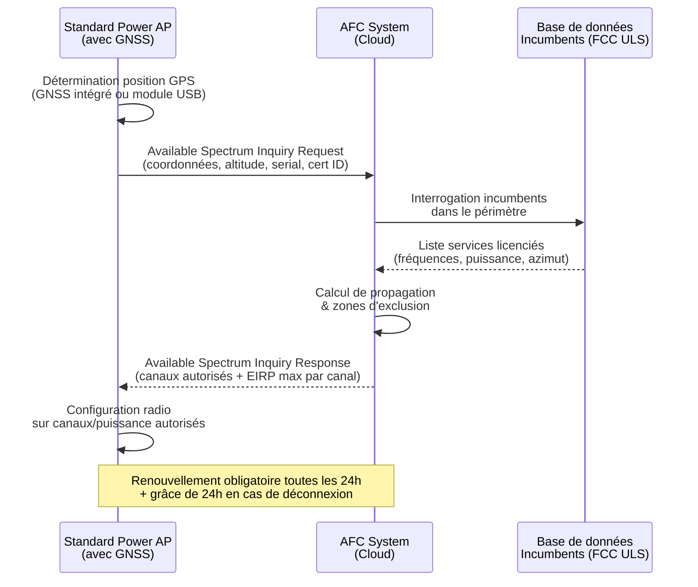
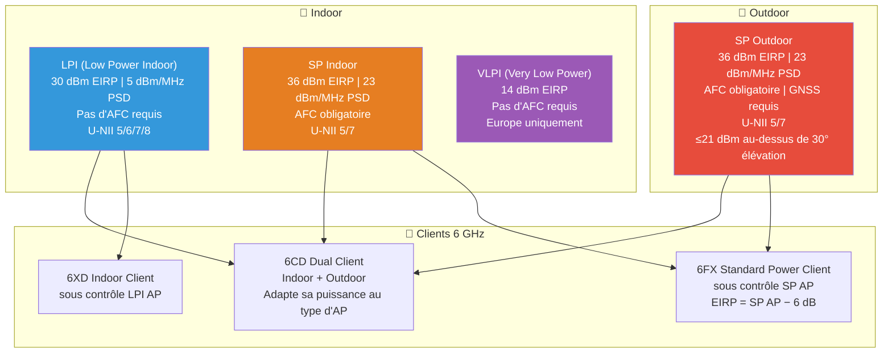

## Pourquoi l'AFC est nécessaire

La bande 6 GHz (5 925–7 125 MHz) représente 1 200 MHz de spectre — plus du double des bandes 2,4 et 5 GHz combinées. Ouverte aux réseaux Wi-Fi sans licence par la FCC en avril 2020 (ET Docket No. 18-295), elle a été qualifiée de « plus grande extension de spectre Wi-Fi depuis 1997 ». Mais ce spectre n'est pas vide : des services licenciés — liaisons micro-ondes point-à-point (Fixed Service), stations terriennes satellite (Fixed Satellite Service), et communications de sécurité publique — y opèrent depuis des décennies.

Le risque d'interférence avec ces **incumbents** a conduit les régulateurs à imposer un mécanisme de coordination intelligent : l'**Automated Frequency Coordination (AFC)**. Contrairement au DFS (Dynamic Frequency Selection) utilisé en 5 GHz pour protéger les radars — qui provoquait des changements de canal imprévisibles et des faux positifs perturbant l'expérience utilisateur — l'AFC offre une coordination **proactive et pré-calculée**, basée sur la localisation géographique de l'AP et une base de données centralisée des incumbents.

## Architecture technique de l'AFC

Le fonctionnement de l'AFC repose sur un échange structuré entre trois acteurs :

### Le protocole AFC en détail

La communication entre l'AP et le système AFC utilise **HTTPS (HTTP/1.1 + TLS 1.2)** avec des messages JSON standardisés. Le format d'URL suit la structure `$BASE_URL/$METHOD`, tel que défini dans la spécification Wi-Fi Alliance *AFC System to AFC Device Interface Specification v1.5*.

Les ciphersuites obligatoires sont :
- `TLS_ECDHE_ECDSA_WITH_AES_128_GCM_SHA256`
- `TLS_ECDHE_RSA_WITH_AES_128_GCM_SHA256`

Une **requête type** (Available Spectrum Inquiry Request) contient :
- **Device descriptor** : numéro de série, identifiant de certification (ex. : `US_47_CFR_PART_15_SUBPART_E`)
- **Location** : coordonnées (ellipse avec axes majeur/mineur et orientation), altitude (AGL ou AMSL), incertitude verticale, indication indoor/outdoor
- **Inquired frequency ranges** : bandes demandées (ex. : 5 925–6 425 MHz pour U-NII-5)
- **Inquired channels** : classes opérationnelles globales et CFI (Channel Frequency Index)

La **réponse** (Available Spectrum Inquiry Response) fournit :
- Les plages de fréquences autorisées avec **PSD max** (Power Spectral Density) par segment
- Les canaux disponibles avec **EIRP max** par canal (résolution de 3 dB, plage 21–36 dBm)
- Un horodatage d'expiration (`availabilityExpireTime`)

### Standards et spécifications

| Organisme | Document | Objet |
|---|---|---|
| **FCC** | 47 CFR Part 15 Subpart E | Règles d'opération unlicensed 6 GHz (Report & Order, avril 2020) |
| **WInnForum** | WINNF-TS-1014 v1.4.0 | Functional Requirements for the U.S. 6 GHz Band under AFC |
| **WInnForum** | WINNF-TS-3007 v1.1.0 | AFC System to SPD Interface Technical Specification |
| **Wi-Fi Alliance** | AFC SDI Spec v1.5 | AFC System to AFC Device Interface |
| **ETSI** | EN 303 687 | Conditions techniques WAS/RLAN dans la bande 5 945–6 425 MHz (Europe) |
| **IEEE** | 802.11ax-2021 | Amendment Wi-Fi 6E pour l'opération 6 GHz |
| **TIP** | Open AFC Software | Implémentation open source (adoptée par WBA, Wi-Fi Alliance, Broadcom) |

## Classes de puissance et types d'appareils

L'un des aspects les plus structurants de la réglementation 6 GHz est la distinction entre classes de puissance. Chaque classe a des contraintes différentes en termes d'EIRP, de PSD, et d'obligation AFC :

**Low Power Indoor (LPI)** — Classe la plus répandue aujourd'hui :
- EIRP max : **30 dBm** (à 320 MHz), 24 dBm (à 80 MHz), 18 dBm (à 20 MHz)
- PSD max : **5 dBm/MHz**
- Opération : **indoor uniquement**, toutes les bandes U-NII (5–8)
- AFC : **non requis**
- Contraintes : antennes intégrées, pas d'étanchéité, pas d'alimentation batterie

**Standard Power (SP)** — Le game-changer activé par l'AFC :
- EIRP max : **36 dBm** (quelle que soit la largeur de canal)
- PSD max : **23 dBm/MHz**
- Opération : **indoor et outdoor**, bandes U-NII-5 (5 925–6 425 MHz) et U-NII-7 (6 525–6 875 MHz)
- AFC : **obligatoire**
- Contrainte outdoor : EIRP ≤ 21 dBm au-dessus de 30° d'élévation (protection satellite)

**Very Low Power Indoor (VLPI)** — Autorisé en Europe :
- Puissance très réduite pour environnements denses
- AFC : **non requis**
- Adopté par l'ETSI (ECC Decision (20)01)

Le gain entre LPI et SP est significatif : **+6 dB d'EIRP** et **+18 dB/MHz de PSD**, soit un gain de puissance d'un facteur ~4 en EIRP et ~60 en densité spectrale. Pour un opérateur B2B, cela se traduit par une portée extérieure accrue, la possibilité d'utiliser des antennes directionnelles externes, et une couverture campus complète en 6 GHz.

## AFC Systems certifiés et écosystème constructeur

### Les 7 AFC Systems approuvés par la FCC (février 2024)

La FCC a accordé l'approbation opérationnelle à sept systèmes AFC le 24 février 2024, marquant le déverrouillage effectif du Standard Power :

1. **Broadcom** (basé sur Open AFC / TIP)
2. **Comsearch** (offre commerciale, filiale de CommScope)
3. **Federated Wireless** (pionnier du CBRS, offre commerciale)
4. **Qualcomm** (offre commerciale)
5. **Sony** (R&D)
6. **Wi-Fi Alliance** (basé sur Open AFC / TIP)
7. **Wireless Broadband Alliance** (basé sur Open AFC / TIP)

L'**Open AFC Software**, projet open source opéré par le Telecom Infra Project (TIP), est devenu l'implémentation la plus populaire — adoptée par trois des sept opérateurs approuvés (WBA, Wi-Fi Alliance, Broadcom). Le WBA note que les approches non-profit et commerciales coexisteront à terme.

### Support constructeurs

**Cisco** a été parmi les premiers à obtenir la certification Standard Power FCC pour ses AP Wi-Fi 6E :
- Catalyst CW9163E (outdoor, GPS intégré, SP par défaut)
- Catalyst CW9166D1, CW9166I, CW9162I, CW9164I
- Catalyst C9136I, IW9167I (Heavy Duty)
- Meraki MR57
- Support : Cisco IOS XE 17.12.3 (Catalyst) / R30.7 (Meraki)
- Module GNSS USB : CW-ACC-GPS1=

**HPE Aruba** supporte l'AFC sur ses AP Wi-Fi 6E et Wi-Fi 7, avec intégration dans Aruba Central.

**Extreme Networks** a validé ses AP Standard Power via le programme Wi-Fi Alliance AFC DUT Compliance.

**Ubiquiti** supporte l'AFC sur le UniFi Enterprise E7 AP (Wi-Fi 7), avec configuration transparente et géolocalisation via l'app mobile.

**ASUS** propose l'AFC sur le GS-BE18000 (premier routeur consumer avec AFC), nécessitant un smartphone pour la géolocalisation GPS.

## Enjeux pour un opérateur B2B comme Wifirst

Pour un opérateur réseau B2B spécialisé dans la connectivité d'établissements (hôtels, résidences étudiantes, entreprises, santé), l'AFC représente un changement de paradigme :

**Couverture campus et outdoor** — Jusqu'ici, le Wi-Fi 6E outdoor était impossible en 6 GHz. Avec l'AFC et le Standard Power, Wifirst peut déployer des AP outdoor 6 GHz sur les campus, cours d'hôtel, terrasses de résidences, avec une puissance de 36 dBm EIRP — comparable au 5 GHz outdoor classique.

**Densification haute capacité** — Les canaux 6 GHz de 160 et 320 MHz (Wi-Fi 7) en Standard Power permettent des débits théoriques considérablement supérieurs au LPI, avec une meilleure pénétration et portée.

**Antennes directionnelles** — Le Standard Power autorise les antennes détachables et directionnelles, jusque-là interdites en LPI. Cela ouvre des scénarios de couverture ciblée (couloirs, halls, zones événementielles).

**Coexistence 5G NR-U** — Dans la bande 6 GHz, le Wi-Fi n'est pas seul : le 3GPP a identifié cette bande pour le 5G NR-U (New Radio Unlicensed). L'AFC établit un cadre de coexistence avec les incumbents, mais la coordination Wi-Fi/NR-U reste un sujet ouvert — des études académiques (arXiv, 2025) montrent que la coexistence est techniquement faisable mais nécessite des mécanismes supplémentaires.

## Situation réglementaire mondiale

La carte mondiale de l'AFC en 2026 montre une adoption à plusieurs vitesses :

**AFC opérationnel :**
- 🇺🇸 **États-Unis** : 7 AFC Systems approuvés (fév. 2024), pleinement opérationnel
- 🇨🇦 **Canada** : ISED a défini les règles SP, AFC actif

**Cadres AFC en cours :**
- 🇸🇦 **Arabie Saoudite** (CST) : bande complète 5 925–7 125 MHz ouverte, framework AFC proposé
- 🇨🇴 **Colombie** : framework AFC en consultation

**Évaluation en cours :**
- 🇦🇺 Australie, 🇧🇷 Brésil, 🇰🇷 Corée du Sud

**Europe — le cas particulier :**
- **Lower 6 GHz (5 945–6 425 MHz)** : ouvert au Wi-Fi en LPI et VLPI via ECC Decision (20)01 / ETSI EN 303 687
- **Upper 6 GHz (6 425–7 125 MHz)** : bataille en cours entre Wi-Fi et IMT (5G/6G). Le RSPG a reconnu le besoin de spectre mid-band pour l'IMT-2030, mais la Wi-Fi Alliance et des coalitions industrielles (notamment allemandes) militent pour l'ouverture au Wi-Fi. La CEPT étudie les conditions de coexistence, avec des recommandations attendues en 2026.
- **Standard Power en Europe** : pas encore défini. Le UK (Ofcom) a proposé le SP avec AFC pour le lower 6 GHz en 2025.

Au total, **62 pays** ont ouvert tout ou partie de la bande 6 GHz au Wi-Fi (Wi-Fi Alliance, 2025).

## Limites et défis de l'AFC

L'AFC résout élégamment le problème de coexistence avec les incumbents, mais il n'est pas sans frictions :

**Géolocalisation indoor** — Les AP indoor nécessitent un module GNSS USB (ex. : Cisco CW-ACC-GPS1=) avec une visibilité ciel. En pratique, tous les AP n'ont pas besoin d'un module : Cisco recommande un GNSS aux coins du bâtiment (anchor points), les AP centraux utilisant la propagation de géolocalisation filaire ou sans-fil. Mais la précision diminue avec la distance, et le système doit garantir un intervalle de confiance de 95 %.

**Latence au démarrage** — L'AP doit obtenir un fix GPS et interroger l'AFC avant de pouvoir émettre en Standard Power. Cela peut prendre plusieurs minutes au boot, durant lesquelles l'AP fonctionne en LPI ou reste silencieux en 6 GHz.

**Dépendance cloud** — L'AFC est un service cloud. En cas de perte de connectivité internet, l'AP dispose d'une grâce de 24 heures avant de devoir cesser l'émission SP ou rétrograder en LPI. Pour des sites critiques, cette dépendance cloud est un point d'attention.

**Vendor lock-in partiel** — Les AP doivent utiliser un AFC provider certifié FCC. Le choix est limité à 7 opérateurs, et la portabilité entre providers n'est pas triviale.

**Fragmentation réglementaire** — Chaque pays avance à son rythme. Un opérateur international doit gérer des configurations radio différentes par géographie : SP+AFC aux US, LPI/VLPI en Europe, pas de 6 GHz dans certaines régions. L'absence de Standard Power en Europe est un frein majeur pour les déploiements outdoor 6 GHz sur le continent.

**Coût d'implémentation** — Module GNSS USB (~50–100 $/unité), antenne GPS externe si nécessaire, licence DNA Essentials (Cisco) ou équivalent. Pour un déploiement de 500 AP, le surcoût GNSS seul représente 10 000–25 000 $, hors modules redondants.

## Ce que l'avenir réserve

L'AFC est le dernier verrou qui empêchait l'exploitation complète du spectre 6 GHz. Avec les 7 systèmes opérationnels aux États-Unis, le Wi-Fi 6E et le Wi-Fi 7 peuvent enfin exploiter le Standard Power en intérieur et en extérieur. Le projet Open AFC (TIP) démocratise l'accès en offrant une implémentation open source conforme aux exigences FCC et WInnForum (WINNF-TS-1014 v1.4.0).

Pour l'Europe, l'enjeu des prochains mois est double : l'ouverture potentielle de l'upper 6 GHz au Wi-Fi, et l'adoption d'un cadre Standard Power avec AFC similaire à celui de la FCC. Si Wifirst et les opérateurs européens veulent tirer pleinement parti du 6 GHz outdoor, c'est cette évolution réglementaire qu'il faut surveiller de près.

---

**Sources :**
- FCC, *Unlicensed Use of the 6 GHz Band*, Report & Order, ET Docket No. 18-295 (avril 2020)
- FCC, *47 CFR Part 15 Subpart E*
- WInnForum, *WINNF-TS-1014 v1.4.0 — Functional Requirements for the U.S. 6 GHz Band under AFC*
- WInnForum, *WINNF-TS-3007 v1.1.0 — AFC System to SPD Interface*
- Wi-Fi Alliance, *AFC System to AFC Device Interface Specification v1.5*
- Wi-Fi Alliance, *Regulations Enabling 6 GHz Wi-Fi* (2025)
- ETSI, *EN 303 687 — WAS/RLAN 5 945–6 425 MHz*
- IEEE 802.11ax-2021
- Cisco, *Automated Frequency Coordination (AFC) FAQ*
- Cisco, *6-GHz Unlicensed Spectrum Regulations and Deployment Options White Paper*
- WBA, *Annual Industry Report 2025*
- TIP, *Open AFC Software Project*
- RCR Wireless News, *Where does 6 GHz AFC adoption stand?* (2025)
- Ofcom, *Expanding Access to the 6 GHz Band* (2025)
- RSPG, *Draft Opinion on Upper 6 GHz* (2025)
