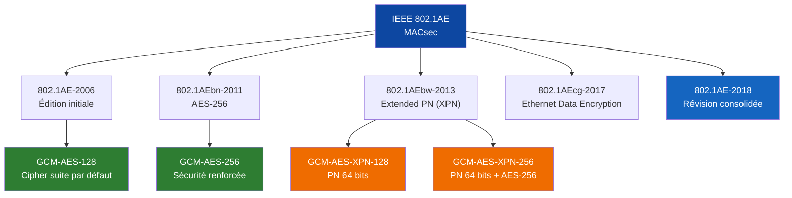
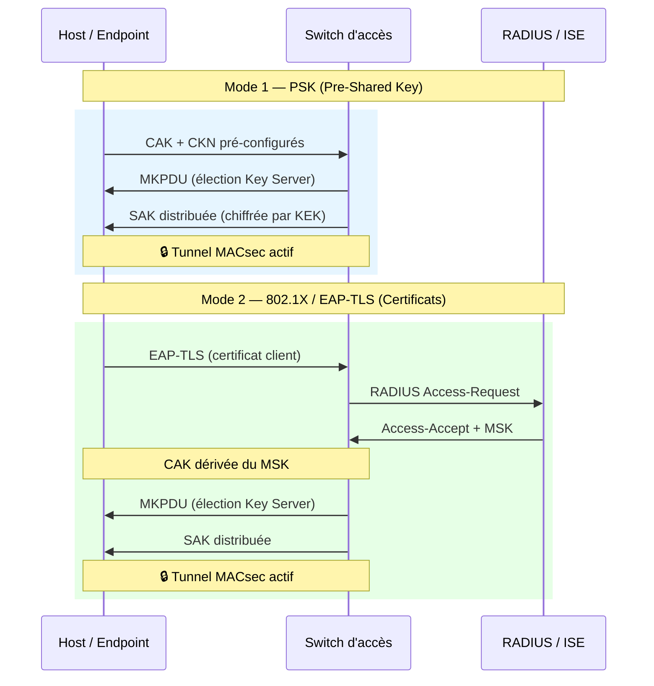

## L'angle mort de la sécurité réseau

Chiffrer les données en transit est devenu un réflexe. TLS protège les flux applicatifs, IPsec sécurise les tunnels entre sites. Mais entre le poste de travail et le switch d'accès, entre deux équipements réseau sur un même campus, le trafic circule **en clair sur le câble Ethernet**. ARP, DHCP, LLDP, STP — tous ces protocoles fondamentaux voyagent sans aucune protection. Un simple tap passif sur un brin cuivre ou fibre suffit à intercepter l'intégralité du trafic Layer 2.

C'est précisément cet angle mort que comble **MACsec** (IEEE 802.1AE) : le chiffrement natif de la couche liaison, hop par hop, à débit ligne, avec une latence inférieure à 3 microsecondes.

Pour un opérateur B2B comme Wifirst, qui déploie et opère l'infrastructure LAN et Wi-Fi de ses clients, MACsec représente un levier stratégique de différenciation : garantir l'intégrité et la confidentialité du trafic dès la première trame Ethernet.

## Anatomie de MACsec : ce que protège IEEE 802.1AE

MACsec opère à la **couche 2 du modèle OSI** — directement sur les trames Ethernet. Contrairement à IPsec (Layer 3) ou TLS (Layer 4+), il chiffre **tout** ce qui passe sur le lien physique, y compris les protocoles que les couches supérieures ne peuvent pas protéger.

### Ce que MACsec chiffre (et ce qu'IPsec ne peut pas)

| Protocole | MACsec (L2) | IPsec (L3) | TLS (L4+) |
|-----------|:-----------:|:----------:|:---------:|
| ARP | ✅ | ❌ | ❌ |
| DHCP | ✅ | ❌ | ❌ |
| LLDP / CDP | ✅ | ❌ | ❌ |
| STP / RSTP | ✅ | ❌ | ❌ |
| Trafic IP unicast | ✅ | ✅ | ✅ |
| DNS (non-DoH) | ✅ | ✅ | ❌ |
| Trafic multicast L2 | ✅ | Partiel | ❌ |

### Structure d'une trame MACsec

Une trame Ethernet protégée par MACsec conserve les adresses MAC source et destination **en clair** (nécessaire pour le forwarding L2), mais ajoute deux éléments critiques :

```
┌──────────┬──────────┬──────────┬────────────────────┬──────────┐
│ MAC Dst  │ MAC Src  │ SecTAG   │   Données chiffrées│   ICV    │
│ (6 oct)  │ (6 oct)  │(8-16 oct)│   (Secure Data)    │ (16 oct) │
└──────────┴──────────┴──────────┴────────────────────┴──────────┘
```

- **SecTAG** (Security Tag) : contient l'EtherType 0x88E5, le numéro de paquet (PN), et l'identifiant du Secure Channel (SCI). Le PN empêche les attaques par rejeu.
- **ICV** (Integrity Check Value) : 16 octets de vérification d'intégrité calculés par GCM-AES. Garantit que la trame n'a pas été altérée.

L'overhead total est de **32 octets** (8 SecTAG + 16 ICV + 8 SCI optionnel), ce qui impose d'ajuster le MTU des interfaces (typiquement de 1514 à 1546 octets).

### Les cipher suites disponibles



L'extension **XPN** (Extended Packet Numbering) est cruciale pour les liens haut débit : avec un PN sur 32 bits, une liaison 100 Gbps épuise l'espace de numérotation en environ **34 secondes**, forçant une rotation de clé (SAK) permanente. Le PN 64 bits repousse cette limite à **plusieurs milliers d'années**.

## MKA : le cerveau de la négociation

MACsec chiffre les trames — mais il faut d'abord que les deux extrémités s'accordent sur les clés. C'est le rôle du protocole **MKA** (MACsec Key Agreement), défini dans **IEEE 802.1X-2020**.

### La hiérarchie des clés

MKA repose sur une architecture à trois niveaux de clés :

| Clé | Rôle | Durée de vie |
|-----|------|-------------|
| **CAK** (Connectivity Association Key) | Clé maître — source de toute la chaîne | Longue (configurée ou dérivée de 802.1X) |
| **CKN** (CAK Name) | Identifiant de la CAK — permet aux pairs de se reconnaître | Liée à la CAK |
| **SAK** (Secure Association Key) | Clé de chiffrement effective des trames | Courte (rotation périodique) |

La SAK est **générée par le Key Server** (élu parmi les pairs MKA) et distribuée chiffrée via les MKPDU (MKA Protocol Data Units) encapsulées dans des trames EAPoL.

### Deux modes de déploiement



**Mode PSK** : la CAK est configurée manuellement sur chaque équipement. Simple à déployer pour les liens switch-to-switch (infrastructure backbone). Inconvénient : pas de révocation individuelle, rotation manuelle.

**Mode 802.1X / EAP-TLS** : la CAK est dérivée dynamiquement du MSK (Master Session Key) produit par l'authentification EAP-TLS. Chaque session produit une CAK unique. Idéal pour les accès host-to-switch avec gestion centralisée via RADIUS/ISE. C'est le mode recommandé pour les déploiements à grande échelle.

## Performance : le chiffrement invisible

L'argument massue de MACsec face à IPsec réside dans ses performances. Implémenté dans le **silicium** (ASIC ou PHY), le chiffrement/déchiffrement s'effectue au niveau hardware, sans passer par le CPU de l'équipement réseau.

### Chiffres clés

| Métrique | MACsec (hardware) | IPsec (software) | IPsec (hardware) |
|----------|:-----------------:|:-----------------:|:-----------------:|
| Latence ajoutée | **1-3 µs** | 50-200 µs | 10-50 µs |
| Débit | Line-rate (100G+) | Variable | Jusqu'à 100G |
| Overhead par trame | 32 octets | 50-70 octets | 50-70 octets |
| Impact CPU | **Zéro** | Élevé | Faible |
| Protocoles protégés | Tout L2+ | IP uniquement | IP uniquement |

Ces performances sont possibles grâce à l'intégration directe dans les ASICs réseau. Les principaux fondeurs proposent des blocs MACsec intégrés :

- **Broadcom** : famille Memory limitationsche (BCM56870+) avec MACsec line-rate jusqu'à 400G
- **Marvell** : PHY Ethernet avec moteur MACsec intégré (séries 88X7120, 88E2110)
- **Intel/Altera** : IP MACsec pour FPGA (Agilex, Stratix 10) — déploiements télécom et défense
- **Renesas** : MACsec pour Ethernet embarqué (automotive, industriel)
- **Rambus** : IP cores MACsec sous licence pour intégration SoC

Le support Linux est également mature : le sous-système MACsec du kernel permet le chiffrement software (via `ip macsec`) et le **hardware offloading** vers les PHY compatibles (patchs Bootlin/Microchip upstreamés depuis 2020).

## Scénarios de déploiement pour un opérateur B2B

### 1. Infrastructure backbone (Switch-to-Switch)

Le cas d'usage le plus immédiat : chiffrer les liens inter-switches au sein d'un campus ou d'un datacenter.

**Configuration type** : Mode PSK entre paires de switches. Chaque lien trunk dispose de sa propre CAK/CKN. Le trafic VLAN tagged est chiffré de bout en bout sur le segment L2.

**Bénéfice opérateur** : protection contre l'interception physique sur les chemins de câblage partagés (faux plafonds, gaines techniques accessibles). Particulièrement pertinent dans les environnements multi-tenant (hôtels, résidences, coworkings) où Wifirst opère l'infrastructure pour le compte du propriétaire.

### 2. Accès sécurisé (Host-to-Switch)

MACsec entre le poste de travail et le switch d'accès, couplé à 802.1X/EAP-TLS.

**Configuration type** : Le supplicant 802.1X du poste (Windows, macOS, Linux supportent MACsec nativement) négocie une session EAP-TLS avec le serveur RADIUS. La CAK dérivée active automatiquement le chiffrement MACsec sur le port.

**Bénéfice** : chaque poste dispose d'un tunnel chiffré dédié vers le réseau. Élimine les risques d'ARP spoofing, DHCP starvation, et VLAN hopping sur le segment d'accès.

### 3. WAN MACsec (Site-to-Site)

Extension de MACsec sur des liens WAN point-à-point (dark fiber, DWDM, circuits opérateur).

**Configuration type** : MACsec entre routeurs de bordure avec XPN (Extended Packet Numbering) pour les liens haut débit. Cisco (ASR 1000, Catalyst 8000), Juniper (MX Series), et Arista supportent ce mode.

**Avantage vs IPsec** : pas de fragmentation, pas de réassemblage, pas de gestion de tunnel. Le chiffrement est transparent pour toutes les couches supérieures.

### 4. Conformité réglementaire

MACsec répond directement à plusieurs exigences réglementaires :

- **NIS2** (Directive EU, applicable depuis octobre 2024) : exige le chiffrement des communications réseau pour les entités essentielles et importantes. MACsec couvre le chiffrement L2 que NIS2 ne précise pas mais que les audits vérifient.
- **PCI-DSS v4.0** : requiert le chiffrement des données de cartes en transit sur les réseaux internes. MACsec protège l'intégralité du trafic L2, pas seulement les flux identifiés.
- **RGPD** (Article 32) : mesures techniques appropriées pour la sécurité des données personnelles. Le chiffrement en transit fait partie des mesures recommandées par la CNIL.

## MACsec vs IPsec vs TLS : choisir la bonne couche

Le choix entre ces trois technologies n'est pas exclusif — elles se complètent :

| Critère | MACsec | IPsec | TLS |
|---------|--------|-------|-----|
| **Couche OSI** | 2 (Liaison) | 3 (Réseau) | 4+ (Transport) |
| **Portée** | Hop-by-hop (lien L2) | End-to-end (tunnel IP) | End-to-end (session) |
| **Traverse un routeur** | ❌ | ✅ | ✅ |
| **Protège ARP/DHCP** | ✅ | ❌ | ❌ |
| **Transparence applicative** | Totale | Totale | Partielle |
| **Complexité déploiement** | Faible (PSK) / Moyenne (802.1X) | Élevée | Faible (côté client) |
| **Cas d'usage principal** | LAN / Campus / DC | VPN site-to-site | Applications web/API |

**La recommandation architecturale** : MACsec pour le LAN (là où le trafic est physiquement accessible), IPsec pour les interconnexions WAN multi-hop, TLS pour les flux applicatifs. Les trois couches ensemble forment une défense en profondeur complète.

## Limites et défis

MACsec n'est pas une solution universelle. Plusieurs contraintes doivent être prises en compte :

**Hop-by-hop, pas end-to-end** : chaque équipement intermédiaire déchiffre et re-chiffre la trame. Si un switch est compromis, le trafic est exposé à ce point. C'est le compromis fondamental de MACsec — il protège le câble, pas l'équipement.

**Visibilité réseau réduite** : le chiffrement L2 rend impossible le deep packet inspection (DPI) sur les liens protégés. Les outils de monitoring doivent être positionnés aux points de déchiffrement (le switch lui-même) ou utiliser des copies en clair (SPAN/mirror post-déchiffrement).

**Interopérabilité multi-vendeur** : bien que le standard soit clair, les implémentations varient. La négociation MKA entre équipements de constructeurs différents (Cisco ↔ Juniper, par exemple) peut nécessiter des ajustements (cipher suite, priorité Key Server, fallback policy).

**Coût matériel** : tous les switches ne supportent pas MACsec. Les gammes entry-level en sont souvent dépourvues. Le support hardware MACsec est standard sur les gammes datacenter et campus (Cisco Catalyst 9000, Juniper EX/QFX, Arista 7000), mais représente un critère de sélection à l'achat.

## MACsec et Zero Trust : la convergence

L'article précédent sur le ZTNA posait la question de la fin du VPN d'entreprise. MACsec s'inscrit naturellement dans cette architecture Zero Trust en apportant une brique que ZTNA seul ne couvre pas : la **sécurité du plan de données L2**.

Dans un modèle Zero Trust complet :
- **ZTNA** vérifie l'identité et le contexte avant d'autoriser l'accès (plan de contrôle)
- **802.1X** authentifie le device sur le port réseau (plan d'accès)
- **MACsec** chiffre toutes les communications sur le segment L2 (plan de données)
- **MKA + EAP-TLS** lie le chiffrement à l'identité cryptographique du device (certificat)

Cette combinaison élimine la confiance implicite accordée au réseau local — exactement ce que le modèle Zero Trust exige.

## Perspectives : MACsec dans le réseau de demain

Plusieurs évolutions renforcent la pertinence de MACsec pour les années à venir :

**MACsec à 800G et au-delà** : les ASICs de nouvelle génération (Broadcom Memory limitationsche 5, Cisco Silicon One) intègrent MACsec line-rate à 800 Gbps. L'overhead de chiffrement devient invisible même sur les liens les plus rapides.

**Automotive Ethernet** : MACsec s'impose comme le standard de sécurité pour les réseaux embarqués véhiculaires (IEEE 802.1AE appliqué à 100BASE-T1, 1000BASE-T1). Renesas, NXP et Marvell intègrent des moteurs MACsec dans leurs PHY automotive.

**Convergence IT/OT** : dans les environnements industriels soumis à NIS2, MACsec protège les communications entre automates (PLC) et systèmes SCADA sans modification applicative — un avantage décisif sur IPsec qui nécessite une pile IP complète sur chaque équipement.

**Cloud interconnect** : les opérateurs cloud (AWS Direct Connect, Azure ExpressRoute, Google Cloud Interconnect) commencent à proposer MACsec sur les ports de peering dédiés, offrant un chiffrement L2 natif entre le datacenter client et le cloud provider.

## Conclusion : le chaînon manquant

MACsec comble un vide dans la chaîne de sécurité réseau que ni TLS ni IPsec ne peuvent adresser. En chiffrant au plus près du médium physique, avec un impact de performance quasi nul, il transforme chaque lien Ethernet en canal sécurisé.

Pour un opérateur B2B qui conçoit, déploie et opère l'infrastructure réseau de ses clients, MACsec n'est pas un luxe — c'est un **différenciateur technique**. Dans un contexte réglementaire durci (NIS2, PCI-DSS v4.0) et une architecture Zero Trust qui exige le chiffrement à chaque couche, IEEE 802.1AE est le standard qui transforme le « réseau local de confiance » en un concept véritablement sécurisé.

---

**Sources et références** :
- IEEE 802.1AE-2018 — MAC Security (MACsec), ieee802.org
- IEEE 802.1X-2020 — Port-Based Network Access Control (MKA), ieee802.org
- IEEE 802.1AEbw-2013 — Extended Packet Numbering (XPN)
- Cisco — Configuring MACsec Encryption (Catalyst 9000, ASR 1000)
- Juniper Networks — Understanding MACsec, juniper.net
- Red Hat Developer — MACsec: a different solution to encrypt network traffic
- Bootlin — Network traffic encryption in Linux using MACsec and hardware offloading
- Renesas — MACsec and CANsec: Layer 2 Security for High Performance Networks
- Rambus — MACsec Explained: Securing Data in Motion
- Directive NIS2 (UE) 2022/2555 — Sécurité des réseaux et systèmes d'information
- PCI-DSS v4.0 — Payment Card Industry Data Security Standard
