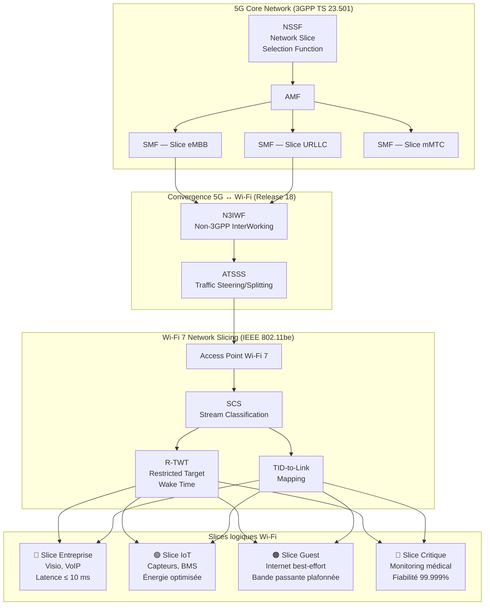
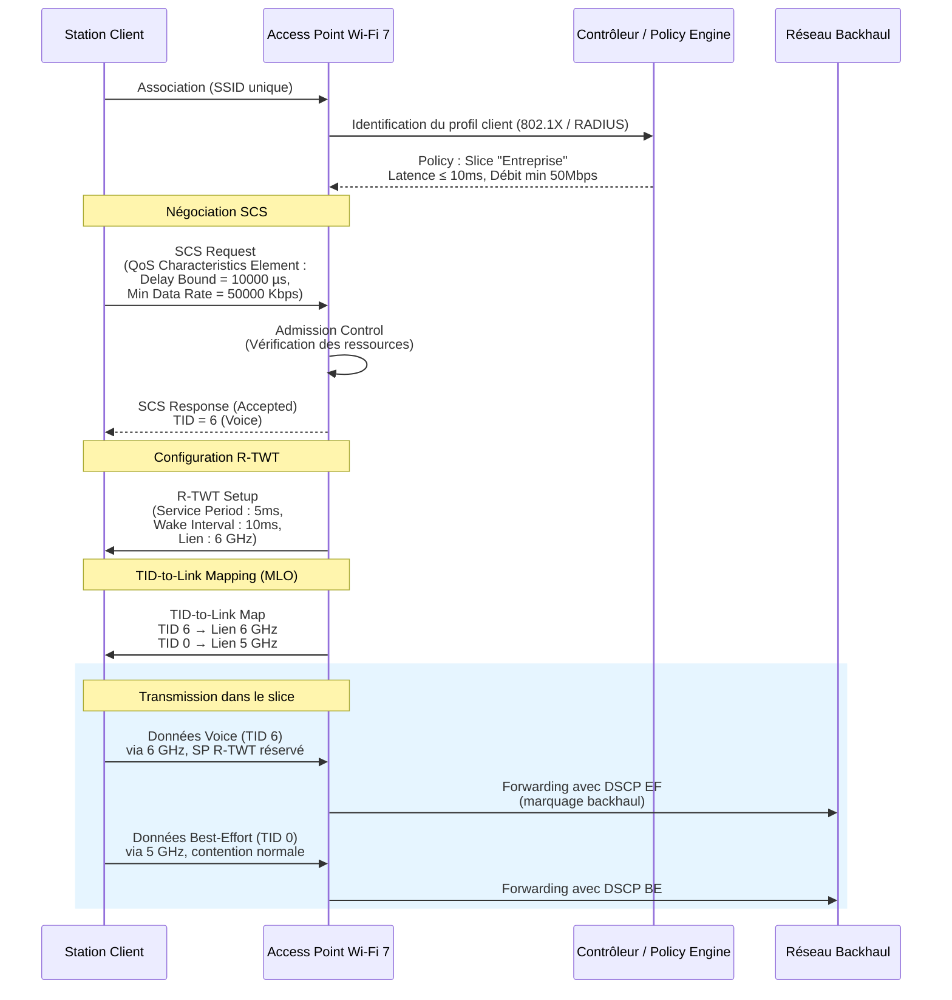

## Le problème : un modèle SSID qui a atteint ses limites

Depuis vingt ans, la segmentation réseau en Wi-Fi repose sur un principe simple : **un SSID par usage**. Un SSID « Corporate » pour les collaborateurs, un « Guest » pour les visiteurs, un « IoT » pour les capteurs. Ce modèle, calqué sur les VLANs filaires, a le mérite de la lisibilité. Mais il a un coût technique considérable que les opérateurs B2B comme Wifirst connaissent bien.

Chaque SSID supplémentaire génère son propre **beacon frame** (trame balise), diffusé 10 fois par seconde sur chaque bande radio. Avec 4 SSIDs sur un AP tri-bande, ce sont **120 beacons par seconde** qui consomment du temps d'antenne (airtime) — une ressource finie et partagée. Dans les environnements haute densité (hôtels, campus, hôpitaux), cet overhead devient un véritable goulot d'étranglement. Pire : les beacons sont transmis au débit le plus bas (Basic Rate), maximisant leur impact sur l'airtime disponible.

Au-delà de l'overhead radio, le modèle multi-SSID souffre d'un défaut structurel : **il ne garantit rien au niveau applicatif**. Un flux de visioconférence critique et un téléchargement de mise à jour logicielle partagent le même SSID « Corporate » sans aucune différenciation. Le QoS historique (WMM, basé sur IEEE 802.11e) classe le trafic en 4 catégories statiques — Voice, Video, Best Effort, Background — mais ne comprend rien aux exigences de latence, de jitter ou de fiabilité d'une application spécifique.

C'est précisément ce que le **Network Slicing Wi-Fi** vient résoudre.

## Du 5G au Wi-Fi : généalogie du Network Slicing

Le concept de Network Slicing n'est pas né dans le monde Wi-Fi. Il a été formalisé par le **3GPP** dans les spécifications de la 5G, notamment dans le document **TS 23.501** (« System Architecture for the 5G System »). L'idée fondatrice : permettre à un opérateur de créer, sur une infrastructure physique unique, **plusieurs réseaux logiques isolés**, chacun optimisé pour un type de service — le tout identifié par un **S-NSSAI** (Single Network Slice Selection Assistance Information).

Un slice 5G « eMBB » (enhanced Mobile Broadband) sera optimisé pour le débit. Un slice « URLLC » (Ultra-Reliable Low-Latency Communication) garantira une latence inférieure à 1 ms. Un slice « mMTC » (massive Machine Type Communication) sera dimensionné pour des millions de capteurs IoT à faible consommation. Le document **3GPP TS 28.530** (« Management and Orchestration of Networks and Network Slicing ») définit le cycle de vie complet de ces slices : préparation, commissionnement, opération, décommissionnement.

La convergence 5G/Wi-Fi, décrite dans **3GPP TS 23.501 Release 18** via le mécanisme **ATSSS** (Access Traffic Steering, Switching and Splitting) et l'interface **N3IWF** (Non-3GPP InterWorking Function), a naturellement posé la question : **comment transposer ce paradigme au Wi-Fi ?**

La réponse est venue avec **IEEE 802.11be** (Wi-Fi 7).

## Les briques techniques du slicing Wi-Fi 7

IEEE 802.11be introduit trois mécanismes complémentaires qui, combinés, permettent de construire un véritable slicing au niveau radio.

### Stream Classification Service (SCS) avec QoS Characteristics

Le **SCS** (Stream Classification Service), initialement défini dans IEEE 802.11aa puis considérablement enrichi dans 802.11be, permet à une station (STA) de demander à l'AP de **classifier un flux applicatif spécifique** selon des critères fins : adresse IP source/destination, port, DSCP, protocole.

La grande nouveauté de 802.11be est l'ajout du **QoS Characteristics Element**, qui permet à la STA de spécifier des exigences quantitatives pour chaque flux :

- **Minimum Service Interval** et **Maximum Service Interval** (en µs)
- **Minimum Data Rate** (en Kbps)
- **Delay Bound** (latence maximale tolérée, en µs)
- **MSDU Lifetime** (durée de vie maximale d'un paquet)
- **Service Start Time** / **Service Start Time LinkID**

L'AP peut **accepter ou rejeter** la demande SCS en fonction de ses ressources disponibles, créant ainsi un mécanisme d'**admission control** — fondamental pour garantir des SLAs.

Comme le souligne une discussion technique du groupe TGbe de l'IEEE : *« AP can reject SCS stream, if it does not have resources to classify the traffic or if it cannot meet the latency and other QoS Characteristics element parameters »* (IEEE 802.11 TGbe mailing list).

### Restricted Target Wake Time (R-TWT)

Le **R-TWT** est l'évolution déterministe du TWT (Target Wake Time) introduit avec Wi-Fi 6. Là où le TWT standard était un mécanisme d'économie d'énergie basé sur la négociation, le R-TWT est un **mécanisme d'allocation temporelle stricte**.

Le principe : l'AP définit des **Service Periods** (SP) réservés dans le temps, pendant lesquels **seules les stations autorisées** peuvent transmettre. C'est l'équivalent radio d'un circuit dédié — une rupture fondamentale avec le modèle CSMA/CA best-effort du Wi-Fi classique.

Les caractéristiques techniques du R-TWT :
- **Accès protégé** : les stations non R-TWT ne peuvent pas transmettre pendant un SP réservé
- **Granularité temporelle** : les SP peuvent être définis avec une précision de 256 µs
- **Périodicité configurable** : de quelques millisecondes à plusieurs secondes
- **Association SCS ↔ R-TWT** : un flux classifié via SCS peut être associé à un SP R-TWT spécifique

### TID-to-Link Mapping (MLO)

Dans un contexte **Multi-Link Operation** (MLO), le **TID-to-Link Mapping** permet d'assigner chaque catégorie de trafic (identifiée par son Traffic Identifier, TID 0-7) à un lien radio spécifique. Combiné avec le SCS et le R-TWT, ce mécanisme permet de :

- Diriger les flux critiques (voix, temps-réel) vers le lien 6 GHz (moins encombré, canaux plus larges)
- Router le trafic IoT basse consommation sur le lien 2.4 GHz (meilleure portée, moindre consommation)
- Réserver le lien 5 GHz pour le trafic bulk (téléchargements, mises à jour)

Le résultat : **un seul SSID, multiples comportements radio**, chacun taillé pour un profil applicatif.

## Architecture d'un slice Wi-Fi en pratique

Comment ces briques s'assemblent-elles concrètement ? Voici le flux complet, de l'association du client à la transmission différenciée.

Le point crucial est la **continuité de la politique QoS du client radio jusqu'au backhaul**. L'AP Wi-Fi 7 ne se contente pas de prioriser le trafic sur le segment radio : il marque les paquets (DSCP) pour que les switches et routeurs en aval poursuivent le traitement différencié. C'est la chaîne complète — du terminal au data center — qui constitue le véritable « slice ».

## Comparaison : VLAN/SSID multiples vs Network Slicing Wi-Fi

| Critère | Modèle SSID/VLAN | Network Slicing Wi-Fi 7 |
|---|---|---|
| **Nombre de segments** | Limité (4-8 SSIDs max recommandés) | Théoriquement illimité (par flux) |
| **Overhead radio** | Élevé (1 beacon/SSID/bande/100ms) | Minimal (1 seul SSID) |
| **Granularité QoS** | 4 catégories WMM statiques | Par flux applicatif (SCS) |
| **Garantie de latence** | Aucune (best-effort) | Oui (R-TWT + Delay Bound) |
| **Isolation** | Par SSID (L2) | Par policy + SP temporel |
| **Overhead management** | Faible (config statique) | Plus élevé (négociation dynamique) |
| **Convergence 5G** | Aucune | Native (ATSSS, N3IWF) |
| **Adaptation dynamique** | Non (re-provisioning requis) | Oui (SCS renégociable) |

## Ce que font les constructeurs

### Cisco : Application Hosting et Wireless TSN

Cisco a été le premier à exposer le concept de slicing Wi-Fi dans sa gamme **Catalyst 9100/9166** avec la notion d'**Application Hosting on AP** — la capacité d'exécuter des conteneurs directement sur l'AP pour de la classification locale. Leur présentation Cisco Live 2024 (IBOEWN-2031, « The Inner Workings of QoS for Modern Wireless Networks ») détaille l'implémentation de SCS et R-TWT avec une approche orientée **Wireless TSN** (Time-Sensitive Networking) pour les cas industriels.

### Aruba (HPE) : Air Slice

Aruba commercialise sous le nom **Air Slice** sa technologie de segmentation réseau avancée, disponible sur les AP **série 630/650**. Air Slice combine le tunnel GRE par rôle utilisateur, le marquage DSCP dynamique et l'intégration avec **Aruba Central** pour du policy enforcement centralisé. Avec Wi-Fi 7, Aruba prévoit l'intégration native du SCS et R-TWT dans Air Slice.

### Juniper Mist : SLE et microservices AI

Juniper Mist adopte une approche data-driven avec ses **Service Level Expectations (SLE)**. Plutôt que de configurer des slices statiques, Mist utilise l'IA (Marvis) pour monitorer en continu les SLAs de chaque « slice » et ajuster dynamiquement les paramètres radio. L'intégration avec leur fabric **EVPN-VXLAN** assure la continuité du slicing du wireless au datacenter.

### Qualcomm et MediaTek : le silicium

Côté chipsets, **Qualcomm** (FastConnect 7900, Networking Pro 1220) et **MediaTek** (Filogic 880/860) supportent les trois briques fondamentales — SCS, R-TWT et TID-to-Link Mapping — dans leur hardware. Le support R-TWT en particulier nécessite une gestion fine de l'horloge et du scheduling au niveau du MAC, imposant une implémentation silicium.

## Cas d'usage B2B : où le slicing change la donne

### Hôtellerie : PMS, Guest Wi-Fi, IPTV sur un seul SSID

Un hôtel typique opère 3-4 SSIDs : Corporate (PMS/back-office), Guest (accès Internet client), IPTV (Chromecast/Apple TV), IoT (serrures, thermostats). Avec le Network Slicing, un **unique SSID** suffit. Le PMS est classifié avec un Delay Bound strict et routé sur le 6 GHz. Le Guest est en best-effort sur le 5 GHz. L'IPTV bénéficie d'un débit minimum garanti. Les serrures IoT utilisent le 2.4 GHz avec un TWT étendu pour maximiser la durée de batterie.

Résultat : **réduction de 60-70% de l'overhead beacon**, amélioration de la capacité globale, et des SLAs différenciés sans complexité de provisioning.

### Santé : IoMT et monitoring patient

L'**Internet of Medical Things** (IoMT) impose des exigences de fiabilité proches du URLLC 5G. Un moniteur cardiaque ne peut tolérer ni perte de paquet ni latence excessive. Le slicing Wi-Fi permet d'isoler ces flux critiques dans des Service Periods R-TWT dédiés, avec un Delay Bound de quelques millisecondes, tout en partageant l'infrastructure avec le Wi-Fi patient et le réseau administratif.

### Industrie 4.0 : convergence OT/IT

Le **Wireless TSN** (Time-Sensitive Networking) sur Wi-Fi 7, rendu possible par le R-TWT, ouvre la porte à des cas d'usage industriels qui étaient jusqu'ici l'apanage du filaire : commande de robots, synchronisation de chaînes de production, contrôle qualité en temps réel. Le slicing permet de faire coexister le trafic OT (Operational Technology) déterministe et le trafic IT (monitoring, analytics) sur la même infrastructure radio.

## Perspectives : 802.11bn et au-delà

Le groupe de travail **IEEE 802.11bn** (Wi-Fi 8, « Ultra-High Reliability ») prévoit d'aller encore plus loin dans le slicing avec :

- **Coordinated Spatial Reuse (Co-SR)** : coordination inter-AP pour garantir les SLAs de chaque slice à l'échelle d'un déploiement complet
- **Multi-AP Coordination (MAPC)** : scheduling coordonné entre APs pour les slices critiques nécessitant une couverture sans faille
- **Enhanced R-TWT** : granularité temporelle sub-256 µs pour les cas TSN les plus exigeants

La convergence avec le 3GPP se poursuit avec **Release 19** et le concept de **Network Slice as a Service (NSaaS)**, où un opérateur Wi-Fi pourra exposer ses slices via une API standardisée — un slice Wi-Fi devenant interchangeable avec un slice 5G du point de vue de l'orchestrateur.

## Ce qu'il faut retenir

Le Network Slicing Wi-Fi n'est pas un buzzword marketing. C'est une **refonte architecturale** de la façon dont le trafic est géré sur le segment radio, portée par trois mécanismes IEEE standardisés (SCS, R-TWT, TID-to-Link Mapping) et une convergence profonde avec l'écosystème 3GPP.

Pour un opérateur B2B comme Wifirst, les implications sont majeures : la capacité à **garantir des SLAs différenciés par application sur une infrastructure Wi-Fi partagée** — exactement ce que le marché entreprise demande depuis des années. Le modèle « un SSID par usage » touche à sa fin. L'ère du slicing intelligent commence.

---

**Sources et références :**
- IEEE 802.11be-2024, « Enhancements for Extremely High Throughput (EHT) »
- 3GPP TS 23.501, « System Architecture for the 5G System » (Release 18)
- 3GPP TS 28.530, « Management and Orchestration of Networks and Network Slicing »
- IETF RFC 9543, « A Framework for Network Slices in Networks Built from IETF Technologies »
- Cisco Live 2024, IBOEWN-2031, « The Inner Workings of QoS for Modern Wireless Networks »
- Wi-Fi Alliance, « Wi-Fi 7 Technology Overview », 2024
- IEEE 802.11 TGbe mailing list, discussions SCS/QoS Characteristics
- Devopedia, « IEEE 802.11be », 2024
