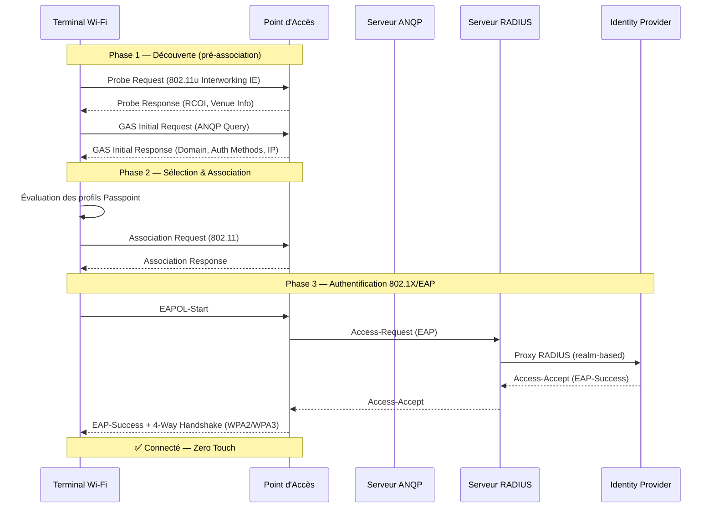
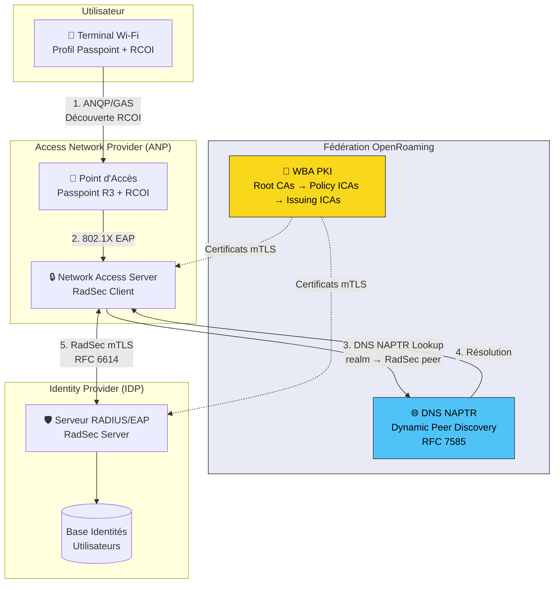

Imaginez : vous arrivez dans un aéroport à l'étranger, votre smartphone se connecte automatiquement au Wi-Fi local — sans portail captif, sans mot de passe, sans friction. Exactement comme votre téléphone bascule entre les antennes 4G/5G d'un opérateur à l'autre. Cette vision, longtemps restée un rêve pour le Wi-Fi, est aujourd'hui une réalité grâce à **Passpoint** et **OpenRoaming**.

Avec plus de **250 millions de hotspots Wi-Fi** déployés dans le monde (source : Cisco, 2020), l'accès sans fil est omniprésent. Mais l'expérience utilisateur reste souvent désastreuse : portails captifs non sécurisés, formulaires d'inscription à chaque lieu, connexions HTTP en clair, et zéro roaming entre réseaux. Pour un opérateur B2B comme Wifirst, qui gère des milliers de sites clients (hôtels, résidences, coworkings), cette fragmentation est un problème technique *et* commercial.

Passpoint et OpenRoaming changent la donne. Voici comment.

## IEEE 802.11u : Les fondations du Wi-Fi intelligent

Avant Passpoint, un terminal Wi-Fi ne pouvait découvrir un réseau qu'en lisant son **SSID** — un simple nom, sans aucune information sur les services disponibles, les méthodes d'authentification, ou l'opérateur derrière le réseau. C'est comme choisir un restaurant uniquement sur son enseigne, sans pouvoir consulter le menu.

L'amendement **IEEE 802.11u** (ratifié en 2011) a introduit deux mécanismes fondamentaux qui ont transformé la découverte réseau Wi-Fi :

### ANQP — Access Network Query Protocol

ANQP est un protocole de requête/réponse qui permet à un terminal d'interroger un point d'accès (AP) **avant toute association**. Les informations disponibles via ANQP incluent :

- **Nom de domaine de l'opérateur** — identifiant global et unique du réseau
- **Partenaires de roaming** — liste des Roaming Consortium OIs (RCOI) supportés
- **Méthodes d'authentification** — types de credentials acceptés (EAP-TLS, EAP-SIM, etc.)
- **Disponibilité IP** — IPv4, IPv6, ou dual-stack
- **Informations de venue** — type de lieu (aéroport, hôtel, campus, etc.)

### GAS — Generic Advertisement Service

GAS est le mécanisme de transport défini par 802.11u pour encapsuler les échanges ANQP. Il fonctionne en **pré-association** : le terminal envoie des GAS Initial Request/Response frames directement à l'AP, sans être connecté au réseau. C'est une conversation Layer 2 pure, avant toute attribution d'adresse IP.

Ce mécanisme élimine complètement le besoin de portails captifs. Le terminal sait **avant de se connecter** si le réseau est compatible avec ses credentials.

## Passpoint : L'évolution en trois releases

La Wi-Fi Alliance a capitalisé sur IEEE 802.11u pour créer **Passpoint**, un programme de certification qui standardise l'expérience de connexion automatique.

### Release 1 (2012) — La découverte automatique

La première release a posé les fondations :

- **Découverte réseau** via ANQP/GAS en pré-association
- **Sélection automatique** basée sur les RCOI et le domaine de l'opérateur
- **Authentification 802.1X** avec EAP-TLS, EAP-TTLS, EAP-SIM/AKA
- **Chiffrement obligatoire** — WPA2-Enterprise minimum (fini le Wi-Fi ouvert)

Le support est quasi-universel : tous les smartphones modernes (y compris les iPhones, bien qu'Apple n'ait jamais formellement certifié ses appareils) supportent Passpoint R1.

### Release 2 (2014) — L'inscription en ligne

R2 a ajouté l'**Online Sign-Up (OSU)**, permettant aux nouveaux utilisateurs de créer un compte et provisionner des credentials Passpoint directement au point d'accès. Cela nécessitait un SSID séparé (ouvert ou **OSEN** — OSU Server-only Authenticated L2 Encryption Network) pour le processus d'inscription. La Wi-Fi Alliance a depuis déprécié OSU (juin 2023) au profit de mécanismes plus modernes.

### Release 3 (2019) — Le socle d'OpenRoaming

R3 a apporté les éléments clés pour le roaming à grande échelle :

- **Termes de service** — notification et acceptation des conditions d'utilisation
- **Venue URL** — informations contextuelles sur le lieu
- **Support des RCOI étendus** — identifiants 36 bits (OUI-36) permettant d'encoder des politiques dans l'identifiant même
- **Intégration native avec OpenRoaming** — le cadre technique pour la fédération mondiale

## OpenRoaming : La fédération mondiale du Wi-Fi

### De Cisco à la WBA

En mars 2020, **Cisco a fait don de son initiative OpenRoaming** à la Wireless Broadband Alliance (WBA). L'idée : créer pour le Wi-Fi commercial ce qu'**eduroam** (RFC 7593) a réalisé pour le monde académique — une fédération de roaming transparent qui gère déjà plus de **7,5 milliards d'authentifications par an** dans plus de 100 pays (source : GÉANT, 2024).

OpenRoaming a rapidement dépassé le **million de hotspots** dans le monde en 2022, soit seulement 18 mois après son lancement officiel. Selon le **WBA Industry Report 2025**, 81% des répondants planifient un déploiement OpenRoaming, soit une hausse de 18,9% par rapport à 2024.

### Architecture : ANP + IDP

Le modèle OpenRoaming repose sur deux types d'acteurs fédérés :

- **ANP (Access Network Provider)** — l'opérateur du réseau Wi-Fi (ex : Wifirst, Boingo, un hôtel). Il configure les RCOI OpenRoaming sur ses APs et route les requêtes d'authentification.
- **IDP (Identity Provider)** — l'entité qui authentifie l'utilisateur final. Samsung et Google sont des IdP natifs : OpenRoaming est activé par défaut sur tous les **Samsung Galaxy depuis le S9** et les **Google Pixel sous Android 11+** (source : Enea, 2025).

### RCOI : L'identifiant intelligent

Les **Roaming Consortium Organization Identifiers (RCOI)** sont au cœur du mécanisme de sélection. OpenRoaming utilise des identifiants OUI-36 (5 octets / 36 bits) où :

- Les **24 bits de poids faible** identifient le consortium (OpenRoaming)
- Les **12 bits de poids fort** encodent les **Closed Access Group (CAG) policies**

Deux RCOI de base définissent le modèle économique :

| RCOI | Modèle | Description |
|------|--------|-------------|
| **5A-03-BA** | Settlement-Free | Wi-Fi gratuit — l'ANP offre l'accès sans facturation à l'IdP |
| **BA-A2-D0** | Settled | Wi-Fi payant — l'ANP facture l'IdP pour le service |

Les 12 bits de CAG permettent de définir des politiques granulaires :

- **Level of Assurance (LoA)** — niveau de vérification de l'identité (ISO/IEC 29115)
- **Quality of Service (QoS)** — tiers de service (bronze, silver, gold)
- **Privacy** — politique de gestion des données personnelles
- **ID-Type** — type d'identifiant accepté (email, SIM, certificat)

### PKI WBA : La chaîne de confiance

La sécurité d'OpenRoaming repose sur une **Infrastructure à Clés Publiques (PKI)** gérée par la WBA. La hiérarchie des certificats suit un modèle à trois niveaux :

**Root CAs** (2 racines opérationnelles) :
- `wba-root0` — CN=openroaming.org, O=Cisco Systems (historique, issu du don initial)
- `wba-root1` — CN=openroaming.org, O=Wireless Broadband Alliance (nouvelle racine WBA)

**Policy Intermediate CAs** :
- `wba-policy0` / `wba-policy0a` — Singapore (WBA WRIX ECC Policy ICA-01)
- `wba-policy1` — San Mateo, CA (WBA WRIX ECC Policy ICA-2)

**Issuing Intermediate CAs** (délivrent les certificats aux ANP et IdP) :
- `cisco-issuing0` / `cisco-issuing1` — Cisco Systems
- `google-issuing0` / `google-issuing1` — Google
- `wba-issuing0` / `wba-issuing1` — WBA directement

Source : WBA PKI Repository (wballiance.com, mis à jour septembre 2025).

### RadSec + Dynamic Peer Discovery : Le routage intelligent

Le protocole **RadSec** (RADIUS over TLS, RFC 6614) remplace le RADIUS UDP traditionnel par du **RADIUS encapsulé dans TLS**. Tous les échanges entre ANP et IdP sont chiffrés et mutuellement authentifiés via les certificats WBA (mTLS).

Le **Dynamic Peer Discovery** (RFC 7585) est le mécanisme qui permet à un ANP de trouver automatiquement le serveur RADIUS d'un IdP, sans configuration manuelle bilatérale. Le processus :

1. L'ANP extrait le **realm** de l'identité EAP externe (ex : `@samsung.openroaming.net`)
2. Il effectue un **DNS NAPTR lookup** sur ce realm
3. Le record NAPTR retourne l'adresse du serveur RadSec de l'IdP
4. L'ANP établit une connexion **mTLS** avec ce serveur, validant le certificat contre la PKI WBA
5. L'authentification EAP est relayée de bout en bout

Ce mécanisme transforme le modèle de roaming de **N×M** (chaque ANP doit configurer une relation avec chaque IdP) en **N+M** (chaque acteur n'a qu'une seule interface avec la fédération).

## Authentification & Sécurité

### Méthodes EAP supportées

OpenRoaming supporte plusieurs méthodes EAP selon le type d'IdP :

- **EAP-TLS** (RFC 5216) — authentification par certificat client. Le plus sécurisé, utilisé par les IdP d'entreprise.
- **EAP-TTLS** (RFC 5281) — tunnel TLS avec authentification interne (MSCHAPv2, PAP). Utilisé par Samsung et Google pour l'authentification basée sur les comptes.
- **EAP-SIM / EAP-AKA / EAP-AKA'** — authentification basée SIM pour les opérateurs mobiles (3GPP TS 24.234). Permet le **Wi-Fi offloading** cellulaire.

### Sécurité vs portail captif

La différence de sécurité entre OpenRoaming et un portail captif classique est radicale :

| Critère | Portail captif | OpenRoaming/Passpoint |
|---------|---------------|----------------------|
| Chiffrement L2 | ❌ Open/OWE au mieux | ✅ WPA2/WPA3-Enterprise |
| Authentification mutuelle | ❌ Aucune | ✅ EAP + certificats serveur |
| Protection rogue AP | ❌ Vulnérable | ✅ Validation certificat RADIUS |
| Credentials en clair | ⚠️ Souvent (HTTP) | ✅ Tunnel EAP chiffré |
| Interception MITM | ❌ Triviale | ✅ mTLS bout en bout |
| Automatisation | ❌ Manuelle | ✅ Zero-touch |

Avec un portail captif, un attaquant peut créer un faux AP avec le même SSID et intercepter tout le trafic. Avec Passpoint, le terminal **valide le certificat du serveur RADIUS** avant d'envoyer ses credentials — un rogue AP ne pourra pas présenter un certificat valide signé par la PKI WBA.

## OpenRoaming vs eduroam vs Portail captif

### eduroam : Le pionnier du roaming fédéré

**eduroam** (education roaming), documenté dans le RFC 7593, est le modèle qui a inspiré OpenRoaming. Déployé dans **plus de 100 pays**, il a traité **7,5 milliards d'authentifications en 2023** (source : GÉANT). Son architecture repose sur une hiérarchie RADIUS nationale et internationale gérée par les NREN (National Research and Education Networks).

Limitations d'eduroam :
- **Scope restreint** — réservé aux institutions de recherche et d'éducation
- **RADIUS UDP classique** — pas de RadSec obligatoire (en cours de migration)
- **Configuration manuelle** des peers RADIUS entre institutions
- **Pas de modèle settled** — pas de facturation entre opérateurs

### La convergence

La bonne nouvelle : eduroam et OpenRoaming convergent. Les outils de l'eduroam Operations Team permettent déjà aux IdP et SP eduroam de participer à OpenRoaming en tant qu'IdP/ANP (source : eduroam.org, 2022). Un AP peut diffuser simultanément les RCOI eduroam (`00-1B-C5-04-60`) et OpenRoaming.

### Tableau comparatif

| Critère | Portail captif | eduroam | OpenRoaming |
|---------|---------------|---------|-------------|
| Sécurité | ❌ Faible | ✅ Forte (EAP) | ✅ Forte (EAP + mTLS) |
| UX | ❌ Friction max | ✅ Automatique | ✅ Automatique |
| Scope | 🌍 Universel | 🎓 Académique | 🌍 Universel |
| Scaling | ✅ Simple | ⚠️ Config manuelle | ✅ DPD automatique |
| Settlement | N/A | ❌ Non | ✅ Oui |
| IdP natifs | N/A | Institutions | Samsung, Google, opérateurs |
| Hotspots | 250M+ | ~100K | 1M+ (et croissant) |

## Implications pour les opérateurs B2B

Pour un opérateur réseau B2B comme Wifirst, OpenRoaming représente une opportunité stratégique sur plusieurs axes :

### Hôtellerie & Résidences

L'hôtellerie est le cas d'usage idéal. Aujourd'hui, chaque hôtel impose son propre portail captif avec un code de chambre. Avec OpenRoaming, un voyageur équipé d'un Samsung ou Pixel se connecte **automatiquement** au Wi-Fi de l'hôtel, comme il le ferait sur un réseau cellulaire. L'ANP (Wifirst) route l'authentification vers l'IdP (Samsung/Google) via RadSec, et l'utilisateur est connecté en quelques secondes — chiffré, authentifié, sans intervention.

### Événementiel & Lieux publics

Les grands événements (conférences, festivals, stades) génèrent une densité d'utilisateurs qui met à rude épreuve les portails captifs. OpenRoaming élimine le goulot d'étranglement de l'inscription manuelle. Des déploiements existent déjà au **London Stadium**, à la **Fira Barcelona Gran Via**, et au **festival BottleRock** de Live Nation.

### Coworking & Bureaux multi-tenants

Dans un immeuble de bureaux partagés, OpenRoaming permet un Wi-Fi unifié où chaque entreprise reste IdP de ses propres employés. Pas besoin de SSID dédié par tenant — le RCOI et le realm EAP gèrent le routing.

### Intégration Wi-Fi 6E / Wi-Fi 7

OpenRoaming s'intègre naturellement avec les nouvelles générations Wi-Fi. La bande 6 GHz (Wi-Fi 6E) en Europe requiert une **AFC (Automated Frequency Coordination)** et des mécanismes de confiance — Passpoint fournit ce cadre. Avec Wi-Fi 7 et le **MLO (Multi-Link Operation)**, le QoS par RCOI prend tout son sens pour différencier les flux critiques.

## Ce qui vient ensuite

L'IETF travaille actuellement sur la formalisation du protocole OpenRoaming (draft-tomas-openroaming, dernière version juillet 2024). Les évolutions attendues incluent :

- **RADIUS/TLS 1.3** — migration vers TLS 1.3 pour les échanges RadSec
- **Support IoT élargi** — Airties a déjà réalisé un PoC pour l'onboarding automatique de devices Wi-Fi résidentiels via OpenRoaming
- **Interworking 5G/Wi-Fi** — convergence des identités cellulaires et Wi-Fi via EAP-AKA' et les profils Passpoint PLMN
- **Settled model à grande échelle** — clearing financier entre ANP et IdP via les attributs RADIUS WBA (WBA-Financial-Clearing-Provider, WBA-Data-Clearing-Provider)

Le Wi-Fi est en train de rattraper son retard sur le cellulaire en matière de roaming. Pour les opérateurs B2B qui gèrent des milliers de sites, OpenRoaming n'est pas une option — c'est le **standard de facto** du Wi-Fi professionnel de demain.

---

**Sources & Références**

- IEEE 802.11u-2011 — Interworking with External Networks
- Wi-Fi Alliance — Passpoint Certification (R1/R2/R3)
- IETF draft-tomas-openroaming-03 — WBA OpenRoaming Wireless Federation (juillet 2024)
- RFC 7593 — The eduroam Architecture for Network Roaming (septembre 2015)
- RFC 6614 — Transport Layer Security (TLS) Encryption for RADIUS (RadSec)
- RFC 7585 — Dynamic Peer Discovery for RADIUS/TLS and RADIUS/DTLS
- WBA PKI Repository — wballiance.com/openroaming/pki-repository/
- WBA Industry Report 2025 — 81% planning OpenRoaming deployments
- GÉANT — eduroam hits 7.5 billion authentications in 2023
- Cisco — OpenRoaming donation to WBA (mars 2020)
- Enea — OpenRoaming: Samsung Galaxy S9+, Google Pixel Android 11+ (2025)
