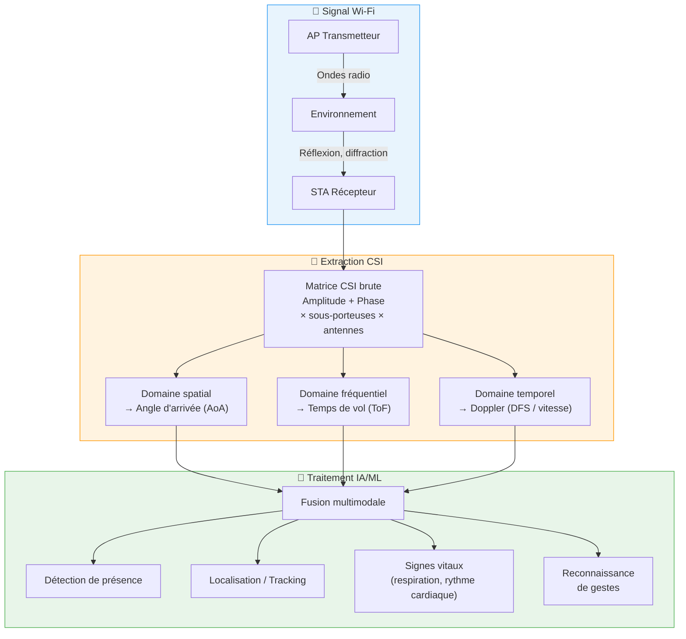
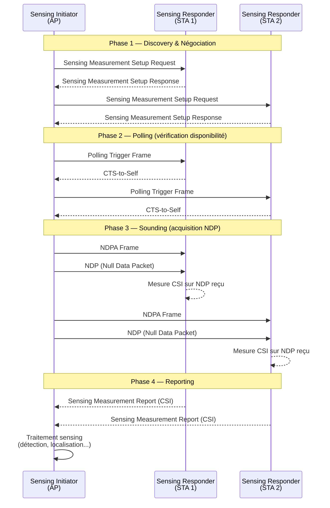

Chaque signal Wi-Fi qui traverse une pièce interagit avec son environnement : il rebondit sur les murs, traverse le mobilier, se diffracte autour des personnes. Jusqu'ici, ces interactions étaient traitées comme du bruit. Avec **IEEE 802.11bf**, publié en septembre 2025, elles deviennent de l'information exploitable. Votre infrastructure Wi-Fi existante peut désormais détecter la présence, le mouvement, et même la respiration — sans caméra, sans capteur dédié, sans wearable.

Pour un opérateur B2B comme Wifirst, qui déploie des milliers d'AP en hôtellerie, résidences et bureaux, c'est un changement de paradigme : le réseau de connectivité devient un réseau de perception.

## Du RSSI au CSI : la révolution des données canal

### RSSI — le signal brut

Historiquement, la détection Wi-Fi reposait sur le **RSSI** (Received Signal Strength Indicator) : une valeur scalaire unique représentant la puissance globale du signal reçu. Simple à obtenir, le RSSI est cependant trop grossier pour du sensing fiable — il fluctue avec la température, l'humidité, et ne discrimine pas les trajets multiples (multipath).

### CSI — la vision haute définition

Le **CSI** (Channel State Information) change la donne. Au lieu d'une seule valeur, le CSI fournit l'amplitude **et** la phase du signal sur **chaque sous-porteuse OFDM**, pour **chaque paire d'antennes TX/RX**. Avec un canal Wi-Fi 7 de 320 MHz, cela représente plus de 3000 sous-porteuses, chacune capturant une vue différente de l'environnement.

Concrètement, quand une personne traverse une pièce, elle modifie les trajets de propagation du signal. Ces modifications se traduisent par des variations dans la matrice CSI — variations qu'on peut analyser pour extraire :

- **Angle d'arrivée (AoA)** via le domaine spatial (MIMO)
- **Temps de vol (ToF)** via le domaine fréquentiel
- **Décalage Doppler (DFS)** via le domaine temporel — qui révèle la vitesse de déplacement

Cette richesse d'information permet une résolution spatiale centimétrique et une sensibilité suffisante pour capter les micro-mouvements thoraciques liés à la respiration.

## IEEE 802.11bf : anatomie du standard

### Genèse et timeline

Le **Task Group bf (TGbf)** a été formé en septembre 2020 au sein de l'IEEE 802.11 Working Group, avec un mandat clair : créer un amendement au standard Wi-Fi pour supporter nativement les applications de sensing, sans dégrader les performances de communication.

Après quatre années de travaux impliquant Huawei, Intel, Qualcomm, Broadcom et de nombreux contributeurs académiques, le standard **IEEE 802.11bf-2025** a été officiellement publié en **septembre 2025**. Il couvre 228 pages de spécifications MAC et PHY.

### Périmètre technique

L'amendement 802.11bf définit des modifications sur deux fronts :

- **Bandes sub-7 GHz** (2.4, 5 et 6 GHz) : sensing bistatique et multistatique via les PHY HE (Wi-Fi 6) et EHT (Wi-Fi 7)
- **Bandes 60 GHz** : sensing DMG (Directional Multi-Gigabit) et EDMG pour des applications haute résolution

### Architecture : Sensing Initiator et Responder

Le protocole 802.11bf introduit deux rôles fondamentaux :

- **Sensing Initiator** : la station (généralement l'AP) qui déclenche et coordonne la session de mesure
- **Sensing Responder** : la ou les stations qui participent à la mesure (clients Wi-Fi, autres AP)

Une session de sensing se déroule en **quatre phases** distinctes :

**Phase 1 — Discovery & Négociation** : L'initiateur et les répondeurs échangent leurs capacités de sensing lors de l'association. Un *Sensing Measurement Setup* établit les paramètres opérationnels de la session (bande, type de mesure, intervalle).

**Phase 2 — Polling** : L'AP envoie des Trigger Frames pour vérifier que les STAs sont prêtes. Celles-ci répondent par des CTS-to-Self, garantissant que le canal est réservé pour la mesure.

**Phase 3 — Sounding** : C'est le cœur du processus. L'AP transmet un **NDPA** (Null Data Packet Announcement) suivi d'un **NDP** (Null Data Packet). Les répondeurs mesurent le CSI sur ce NDP reçu. Ce mécanisme réutilise astucieusement le sounding déjà présent dans 802.11ac/ax pour le beamforming.

**Phase 4 — Reporting** : Les répondeurs renvoient leurs mesures CSI à l'initiateur, qui les agrège pour exécuter les algorithmes de sensing.

### Trigger-Based vs Non-Trigger-Based

Le standard définit deux modes de mesure :

- **Trigger-Based (TB)** : L'AP coordonne les STAs via des Trigger Frames pour des mesures uplink synchronisées. Idéal pour les environnements denses (hôtels, bureaux).
- **Non-Trigger-Based (NTB)** : Mesures downlink initiées directement par l'AP sans polling. Plus simple, adapté aux déploiements légers.

### Sensing by Proxy (SBP)

Innovation majeure : un client peut **déléguer** une demande de sensing à l'AP. Le client (SBP Initiator) envoie une requête à l'AP (SBP Responder), qui coordonne ensuite les mesures avec d'autres STAs pour le compte du client. Cela permet à des appareils à faible capacité (IoT, smartphones) de bénéficier du sensing sans charge de calcul locale.

## Cas d'usage B2B : ce que ça change pour le terrain

### Hôtellerie — occupation intelligente des chambres

Un opérateur hôtelier équipé en Wi-Fi 7 peut déployer le sensing sur l'infrastructure existante pour :

- **Détection de présence en chambre** sans capteur PIR additionnel (économies CAPEX significatives)
- **Gestion énergétique** : couper la climatisation/chauffage quand la chambre est vide, avec une granularité bien supérieure au détecteur de porte
- **Housekeeping optimisé** : alerte en temps réel quand un client quitte la chambre

### Bureaux — smart building sans IoT dédié

- **Taux d'occupation des salles de réunion** en temps réel, sans caméra (conformité RGPD native)
- **Comptage de personnes** par zone pour optimiser les espaces de travail
- **Détection d'intrusion** hors horaires, avec alertes automatiques

### Résidences étudiantes — bien-être et sécurité

- **Détection de chute** pour les résidents vulnérables
- **Monitoring de présence** pour la sécurité incendie (savoir si un bâtiment est occupé)
- **Détection de respiration anormale** dans les cas critiques (apnée du sommeil)

## Écosystème industriel et chipsets

### Les pionniers du sensing Wi-Fi

**Cognitive Systems** (acquis par Qualcomm) a été l'un des premiers à commercialiser le Wi-Fi Motion — un logiciel de détection de mouvement intégré aux routeurs mesh. Leur technologie, déployée chez plusieurs ISP nord-américains, analyse le CSI en temps réel pour détecter le mouvement dans chaque pièce couverte par le réseau mesh.

**Origin Wireless**, spin-off de l'Université du Maryland, a développé la technologie **AI SENSING℠** basée sur le CSI. Leurs solutions couvrent la détection de mouvement (Hex Home), le monitoring de santé, et la localisation indoor. Origin fournit notamment des SDK pour les fabricants de routeurs et d'AP entreprise.

### Chipsets compatibles

L'adoption du standard 802.11bf dépend directement du support par les fondeurs de chipsets Wi-Fi :

- **Qualcomm** : intégration native du sensing dans les plateformes Wi-Fi 7 (Networking Pro Series). L'acquisition de Cognitive Systems en 2021 a accéléré leur roadmap sensing.
- **Broadcom** : support CSI dans les chipsets BCM47xx et BCM43xx pour AP entreprise. Broadcom est contributeur actif au TGbf.
- **Intel** : contributeur majeur au standard via ses équipes de recherche. Support prévu dans les prochaines générations de chipsets client AX/BE.
- **MediaTek** : intégration du sensing dans la gamme Filogic pour les routeurs grand public et CPE opérateur.

### Wi-Fi Alliance : programme de certification

La **Wi-Fi Alliance** a annoncé le développement d'un programme **Wi-Fi CERTIFIED Sensing**, destiné à garantir l'interopérabilité entre équipements de différents constructeurs. Ce programme s'appuie sur les spécifications 802.11bf et devrait être lancé courant 2026, avec des tests couvrant la détection de présence et le motion sensing comme cas d'usage de référence.

## Limites et défis techniques

### Précision vs environnement réel

Le Wi-Fi sensing fonctionne remarquablement en laboratoire, mais l'environnement réel pose des défis :

- **Multipath complexe** : dans un hall d'hôtel avec du mobilier métallique, les réflexions parasites peuvent générer des faux positifs
- **Calibration** : chaque environnement a une "signature" CSI différente. Un AP repositionné nécessite une recalibration
- **Interférences inter-BSS** : dans les déploiements denses (immeubles), le sensing d'un AP peut être perturbé par les transmissions d'AP voisins

### Privacy et RGPD

Le Wi-Fi sensing ne capture pas d'images — c'est son avantage majeur face aux caméras. Cependant :

- La **détection de présence** reste une donnée personnelle au sens du RGPD quand elle est associée à un identifiant (chambre, bureau)
- Le **monitoring de signes vitaux** constitue une donnée de santé (catégorie spéciale RGPD, article 9)
- Un cadre de **consentement** et de **minimisation des données** est indispensable

La bonne nouvelle : contrairement aux systèmes vidéo, le sensing Wi-Fi est intrinsèquement **non-identifiant** au niveau du signal. Il détecte "une présence" sans associer de visage ni d'identité. C'est un atout considérable pour la conformité.

### Coexistence sensing/communication

Le standard 802.11bf a été conçu pour **minimiser l'impact sur les communications**. Les phases de sounding réutilisent les NDP existants du beamforming, et le scheduling des mesures est intégré au mécanisme OFDMA du Wi-Fi 6/7. Néanmoins, dans les réseaux très chargés, le overhead du sensing (polling + sounding + reporting) peut consommer jusqu'à 5-10 % du temps d'antenne.

## Convergence avec Wi-Fi 7, Wi-Fi 8 et 5G

### Wi-Fi 7 (802.11be) — le terreau idéal

Le Wi-Fi 7 offre le socle parfait pour le sensing :

- **320 MHz de bande passante** en 6 GHz → 3000+ sous-porteuses CSI → résolution spatiale centimétrique
- **Multi-Link Operation (MLO)** → sensing simultané sur plusieurs bandes pour une robustesse accrue
- **16 flux spatiaux MIMO** → diversité angulaire maximale

### Wi-Fi 8 (802.11bn) — sensing natif

Le futur Wi-Fi 8, actuellement en cours de standardisation, intègre le sensing comme **fonctionnalité de première classe**. Les discussions au sein du TGbn portent sur le sensing coordonné multi-AP, la réduction du overhead, et l'intégration avec les mécanismes de machine learning distribué.

### 5G/6G et ISAC

L'**Integrated Sensing and Communication (ISAC)** est identifié par l'UIT comme un scénario d'usage clé pour la 6G (IMT-2030). Wi-Fi sensing et cellular sensing sont complémentaires : le Wi-Fi excelle en indoor, le cellulaire en outdoor. La convergence des deux promet une couverture de sensing ubiquitaire.

## Ce qu'il faut retenir

IEEE 802.11bf transforme le réseau Wi-Fi d'un simple tuyau de données en une **plateforme de perception ambiante**. Pour les opérateurs réseau B2B, c'est une opportunité stratégique majeure :

- **Zéro CAPEX additionnel** sur le hardware sensing — l'infrastructure AP existante (Wi-Fi 6E/7) supporte le protocole
- **Nouveaux services à valeur ajoutée** : occupation, sécurité, bien-être — facturables en sus de la connectivité
- **Conformité RGPD facilitée** par rapport aux alternatives vidéo
- **Différenciation concurrentielle** face aux opérateurs qui ne proposent que du débit

Le standard est publié, les chipsets arrivent, les cas d'usage sont concrets. Le Wi-Fi ne se contente plus de connecter — il observe, comprend et anticipe.

---

**Sources et références**

- IEEE 802.11bf-2025 — *Enhancements for Wireless LAN Sensing*, IEEE Standards Association, sept. 2025
- IEEE 802.11-2020 — *Wireless LAN MAC and PHY Specifications*
- T. Ropitault, S. Blandino, A. Sahoo, N. Golmie — *IEEE 802.11bf WLAN Sensing Procedure: Enabling the Widespread Adoption of WiFi Sensing*, IEEE Communications Standards Magazine, 2023 (NIST)
- R. Du, H. Hua et al. — *An Overview on IEEE 802.11bf: WLAN Sensing*, IEEE Journal, 2024 (arXiv:2310.17661)
- Wi-Fi Alliance — *Explore All Technologies*, wi-fi.org
- Cognitive Systems — *WiFi Motion Technology*, cognitivesystems.com
- Origin Wireless — *AI SENSING℠ Platform*, originwirelessai.com
- IEEE 802.11 Working Group — *Task Group BF Update*, ieee802.org/11/Reports/tgbf_update.htm
