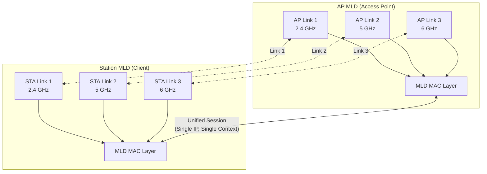
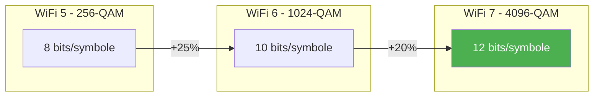

Le WiFi 7 (IEEE 802.11be) représente une évolution majeure des réseaux sans fil, introduisant des technologies qui redéfinissent les performances et la fiabilité. Parmi ces innovations, **Multi-Link Operation (MLO)** se distingue comme la fonctionnalité phare, permettant une agrégation de bandes fréquences sans précédent. Cet article propose une analyse technique approfondie du standard 802.11be et de ses mécanismes clés.

## Architecture Multi-Link Operation (MLO)

MLO constitue la pierre angulaire du WiFi 7. Contrairement aux générations précédentes où un client se connectait à une seule bande à la fois, MLO permet à un **Multi-Link Device (MLD)** d'établir des connexions simultanées sur les bandes 2.4 GHz, 5 GHz et 6 GHz.

### Principe de fonctionnement

L'architecture MLO repose sur une abstraction logique au niveau MAC. Un AP MLD (Access Point Multi-Link Device) et un non-AP MLD (station cliente) négocient leurs capacités via des **Multi-Link Information Elements** échangés dans les trames Beacon et Association Request/Response.

Le schéma ci-dessus illustre comment MLO unifie plusieurs liens physiques sous une seule session logique. Le client conserve une adresse IP unique et un contexte de sécurité partagé, tout en bénéficiant de la bande passante agrégée de plusieurs liens.

### Modes d'opération MLO

Le standard 802.11be définit plusieurs modes d'opération, chacun adapté à des contraintes matérielles et applicatives différentes :

| Mode | Description | Support AP | Support STA |
|------|-------------|------------|-------------|
| **MLSR** | Multi-Link Single Radio - Un seul radio bascule entre les liens | Obligatoire | Obligatoire |
| **EMLSR** | Enhanced MLSR - Commutation rapide avec écoute simultanée | Obligatoire | Optionnel |
| **STR** | Simultaneous Transmit/Receive - Tx/Rx simultanés sur tous les liens | Obligatoire | Optionnel |

Le mode **STR (Simultaneous Transmit/Receive)** offre les meilleures performances. Dans ce mode, chaque lien opère de manière totalement indépendante, permettant des transmissions et réceptions concurrentes sans synchronisation.

### Performances mesurées

Les tests réalisés par Cisco avec un AP CW9178I et une station STR Qualcomm 7800 démontrent l'impact significatif de MLO :

- **WiFi 7 STR MLO** : 747 Mbps (moyenne sur 1 minute)
- **WiFi 6 (802.11ax)** : 506 Mbps (même configuration)
- **Gain** : +47% de throughput

Cette amélioration provient de l'utilisation simultanée des bandes 2.4 GHz (20 MHz) et 5 GHz (40 MHz), le trafic étant réparti dynamiquement selon la congestion de chaque lien.

## 4096-QAM : Densité spectrale maximale

La modulation 4096-QAM (ou 4K-QAM) constitue une évolution significative par rapport au 1024-QAM du WiFi 6. Chaque symbole transporte désormais **12 bits** au lieu de 10, soit une augmentation théorique de 20% du débit.

### Comparaison des modulations

Cette densité accrue a un coût : le 4K-QAM nécessite un rapport signal/bruit (SNR) supérieur d'environ 6 dB par rapport au 1024-QAM. En pratique, cela limite son utilisation aux environnements à courte portée avec une excellente qualité de signal.

### Débits théoriques maximaux (MCS 13, 4096-QAM 5/6)

| Largeur de canal | Guard Interval 0.8µs | Guard Interval 3.2µs |
|------------------|---------------------|---------------------|
| 20 MHz | 172 Mbps | 146 Mbps |
| 40 MHz | 344 Mbps | 293 Mbps |
| 80 MHz | 721 Mbps | 613 Mbps |
| 160 MHz | 1,441 Mbps | 1,225 Mbps |
| 320 MHz | 2,882 Mbps | 2,450 Mbps |

Avec 8 flux spatiaux (MIMO 8x8), le débit théorique maximal atteint **23 Gbps** sur un canal 320 MHz. Ces chiffres restent théoriques ; en conditions réelles, les débits sont significativement inférieurs.

## Canaux 320 MHz et spectre 6 GHz

Le WiFi 7 double la largeur de canal maximale, passant de 160 MHz (WiFi 6) à **320 MHz**. Cette extension s'appuie principalement sur la bande 6 GHz (5.925-7.125 GHz), qui offre 1.2 GHz de spectre continu.

### Disponibilité réglementaire

La bande 6 GHz fait l'objet de réglementations spécifiques selon les régions :

- **États-Unis (FCC)** : 1.2 GHz disponibles (U-NII-5 à U-NII-8)
- **Europe (ETSI)** : 500 MHz initialement, extension progressive prévue
- **Japon** : En cours d'évaluation réglementaire

Les canaux 320 MHz sont configurables en mode contigu (320 MHz) ou non-contigu (160+160 MHz), offrant une flexibilité d'adaptation aux contraintes spectrales locales.

## Preamble Puncturing : Efficacité spectrale intelligente

Le **Preamble Puncturing** représente une innovation majeure pour la gestion des interférences. Dans les générations précédentes, une interférence sur une portion du canal large (80/160 MHz) forçait la réduction de la largeur totale du canal.

Avec le puncturing, le système peut "perforer" les sous-canaux de 20 MHz affectés par des interférences tout en continuant à utiliser le reste du spectre. Cette fonctionnalité est **obligatoire** pour la certification WiFi 7.

### Exemple concret

Considérons un canal 80 MHz composé de quatre sous-canaux de 20 MHz :

- **Sans puncturing** : Si le sous-canal 2 subit une interférence radar (DFS), tout le canal 80 MHz devient inutilisable. Le système bascule sur un canal 40 ou 20 MHz.
- **Avec puncturing** : Le sous-canal 2 est désactivé, mais les sous-canaux 1, 3 et 4 restent actifs. Le système conserve 60 MHz de bande passante effective.

Cette approche améliore significativement la résilience et l'efficacité spectrale dans les environnements denses.

## Enhanced Resource Units (MRU)

Le WiFi 7 fait évoluer le mécanisme OFDMA introduit par le WiFi 6 avec les **Multiple Resource Units (MRU)**. Désormais, un utilisateur unique peut se voir attribuer plusieurs Resource Units non contiguës.

### Comparaison WiFi 6 vs WiFi 7

| Caractéristique | WiFi 6 (802.11ax) | WiFi 7 (802.11be) |
|-----------------|-------------------|-------------------|
| Attribution RU | 1 RU contigu par utilisateur | Multiple RU non-contiguës |
| Tailles RU | 26, 52, 106, 242, 484, 996 tons | Identiques + nouvelles combinaisons |
| Flexibilité | Limitée | Élevée |
| Efficacité spectrale | Bonne | Optimale |

Cette flexibilité permet au scheduler de l'AP d'optimiser l'allocation des ressources radio en fonction des besoins de chaque client et de l'état du spectre.

## Implications pour les déploiements entreprise

L'adoption du WiFi 7 en environnement professionnel nécessite une réflexion sur plusieurs aspects :

### Infrastructure

- **Points d'accès** : Les AP WiFi 7 doivent supporter les trois bandes (2.4/5/6 GHz) pour exploiter pleinement MLO
- **Switches** : Prévoir des ports 2.5 GbE ou 5 GbE minimum pour éviter les goulots d'étranglement
- **Contrôleurs** : Mise à jour firmware requise (ex: Cisco IOS XE 17.15.2+)

### Clients

La pénétration des clients WiFi 7 reste progressive :
- **Android 13+** : Support natif WiFi 7
- **Windows 11** : Support depuis build 26063.1
- **Linux 6.5+** : Support MLO complet (drivers Intel)
- **iOS/macOS** : Support annoncé pour les futures générations

### Cas d'usage prioritaires

| Application | Bénéfice WiFi 7 principal |
|-------------|--------------------------|
| Vidéoconférence | Latence réduite via MLO |
| Streaming 4K/8K | Throughput agrégé |
| VR/AR | Latence + fiabilité |
| IoT dense | MRU + efficacité spectrale |
| Environnements haute densité | Preamble puncturing |

## Certification WiFi Alliance

La Wi-Fi Alliance a lancé le programme **WiFi CERTIFIED 7** en janvier 2024. Les fonctionnalités obligatoires pour la certification incluent :

- Multi-Link Operation (MLO)
- Preamble Puncturing
- Multiple Resource Units (MRU)

Les fonctionnalités optionnelles comprennent :
- 4096-QAM
- Canaux 320 MHz
- Mode STR pour les stations

## Conclusion

Le WiFi 7 marque une rupture architecturale avec l'introduction de MLO, qui transcende le paradigme "une connexion, une bande". Les gains de performance mesurés (+47% en conditions réelles selon Cisco) valident l'approche multi-lien.

Pour les opérateurs réseau comme Wifirst, cette évolution ouvre des perspectives significatives : meilleure qualité de service dans les environnements denses (hôtellerie, résidences étudiantes), support natif des applications temps réel, et optimisation de l'efficacité spectrale.

L'écosystème client se structure progressivement, avec un support OS mature et des chipsets (Qualcomm, MediaTek, Intel, Broadcom) désormais disponibles. La transition vers le WiFi 7 peut s'envisager dès maintenant pour les déploiements neufs, avec une rétrocompatibilité totale assurant la cohabitation avec le parc WiFi 6 existant.

---

**Sources et références :**
- IEEE 802.11be-2024 Standard (publié juillet 2025)
- Cisco Meraki Technical Guide - WiFi 7
- Wi-Fi Alliance - WiFi CERTIFIED 7 Program
- MediaTek MLO Whitepaper
- Qualcomm WiFi 7 Reference Architecture
