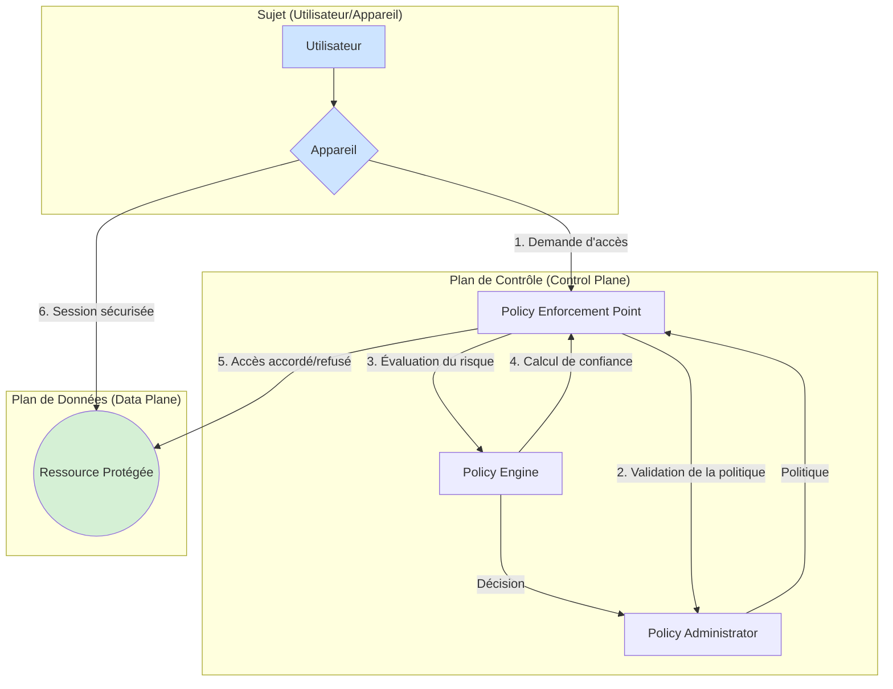
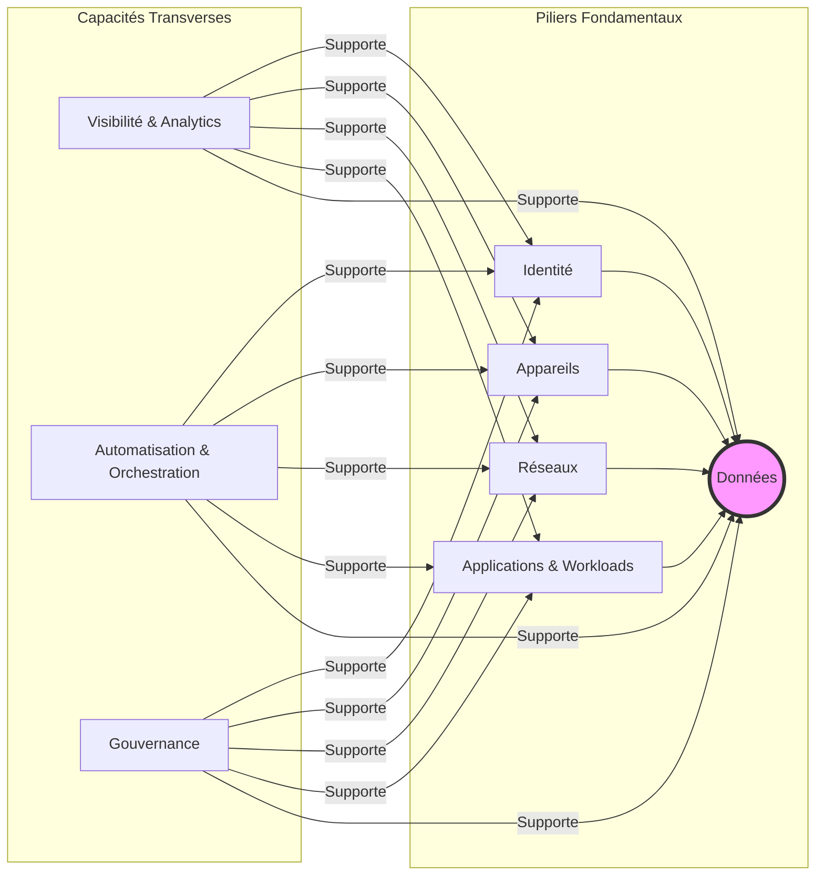

Le monde de la cybersécurité est en constante ébullition, mais rarement une directive d'urgence n'a eu un écho aussi retentissant que celle émise par la CISA (Cybersecurity and Infrastructure Security Agency) américaine en janvier 2024. La directive ED 24-01, ordonnant aux agences fédérales de déconnecter leurs VPN Ivanti Connect Secure, a mis en lumière une vérité de plus en plus difficile à ignorer : le VPN d'entreprise, pilier de l'accès distant depuis des décennies, est en crise profonde. L'exploitation massive des failles CVE-2024-21887 et CVE-2023-46805 par des groupes de cyber-espionnage n'était pas un incident isolé, mais le symptôme d'une faiblesse architecturale fondamentale. Le modèle du "château fort" (castle-and-moat), où un périmètre bien défendu protège un intérieur de confiance, ne tient plus à l'ère du cloud, du SaaS et du travail hybride. Une fois le pont-levis du VPN franchi, l'attaquant bénéficie souvent d'un accès latéral étendu au réseau interne, une aubaine pour la reconnaissance et le déploiement de ransomwares. Face à cette réalité, une nouvelle philosophie s'impose : le Zero Trust. Ce n'est plus un concept marketing, mais une stratégie de sécurité indispensable, dont le Zero Trust Network Access (ZTNA) est l'incarnation la plus directe pour les accès. Alors, le ZTNA est-il réellement sur le point de signer la fin du VPN ?

## Du périmètre à la confiance zéro : une révolution conceptuelle

Pour comprendre l'ampleur du changement, il faut revenir aux fondements du réseau d'entreprise. Le modèle traditionnel reposait sur une binarité simple : le réseau local (LAN) était une zone de confiance, et tout ce qui se trouvait à l'extérieur (Internet) était hostile. Les firewalls agissaient comme des remparts, et le VPN (Virtual Private Network) comme un tunnel sécurisé et chiffré permettant à un utilisateur distant de se "téléporter" à l'intérieur de ces remparts. Une fois authentifié, l'utilisateur était considéré comme "de confiance" et son appareil se voyait attribuer une adresse IP sur le LAN, avec un accès souvent très large aux ressources internes.

Ce modèle a volé en éclats avec la transformation numérique :
*   **Adoption du Cloud** : Les applications et les données ne résident plus uniquement dans le datacenter de l'entreprise. Elles sont sur AWS, Azure, Google Cloud, et des centaines d'applications SaaS.
*   **Mobilité et Télétravail** : Les utilisateurs se connectent depuis n'importe où, sur des réseaux non maîtrisés (Wi-Fi public, 4G/5G), avec une flotte d'appareils hétérogènes (PC, Mac, smartphones, tablettes).
*   **Sophistication des attaques** : Les attaquants ciblent désormais les identités et exploitent la confiance implicite accordée par les VPN pour se déplacer latéralement sur le réseau.

C'est dans ce contexte qu'est né le concept de Zero Trust, popularisé par Google dès 2011 avec son initiative interne "BeyondCorp". Face à des attaques sophistiquées, Google a pris une décision radicale : supprimer le besoin de VPN pour ses 100 000+ employés en considérant leur réseau d'entreprise comme aussi peu fiable qu'Internet. L'accès aux applications n'est plus déterminé par le réseau d'origine de l'utilisateur, mais par une évaluation continue et dynamique de l'identité de l'utilisateur et de la posture de sécurité de son appareil.

### Le NIST SP 800-207 : La formalisation du Zero Trust

Ce qui était une initiative interne est devenu un standard de l'industrie avec la publication du document **NIST SP 800-207 "Zero Trust Architecture"** en août 2020. Ce document ne décrit pas un produit, mais un ensemble de principes et de composants logiques. Le cœur de l'architecture Zero Trust du NIST repose sur trois éléments :

1.  **Policy Engine (PE)** : Le cerveau de la décision. C'est lui qui évalue en temps réel les signaux contextuels (identité de l'utilisateur, type et santé de l'appareil, localisation, heure, ressource demandée) pour accorder ou refuser l'accès.
2.  **Policy Administrator (PA)** : Le gestionnaire de politiques. Il est responsable de la création, de la mise à jour et de la distribution des politiques de sécurité au Policy Enforcement Point. Il communique avec le PE pour prendre ses décisions.
3.  **Policy Enforcement Point (PEP)** : Le garde-frontière. C'est un composant (agent logiciel, proxy, gateway) placé juste devant la ressource à protéger. Il intercepte toutes les tentatives d'accès, les transmet au PE/PA pour décision, puis applique la décision en bloquant ou en autorisant la connexion.

L'extension **NIST SP 800-207A**, publiée en septembre 2023, adapte ces principes aux architectures modernes cloud-natives et multi-cloud, prouvant la pertinence continue de ce modèle.

## ZTNA 1.0 vs ZTNA 2.0 : De la promesse à la réalité

Le marché a rapidement adopté le terme ZTNA pour commercialiser des solutions censées remplacer le VPN. Cependant, les premières implémentations, souvent qualifiées de "ZTNA 1.0", n'étaient qu'une amélioration incrémentale. Comme le souligne l'analyse de Palo Alto Networks, une véritable stratégie Zero Trust exige une approche plus rigoureuse, qualifiée de "ZTNA 2.0".

### Les limites du ZTNA 1.0

Le ZTNA 1.0 se contente souvent de reproduire le flux du VPN, mais en limitant l'accès à une application spécifique plutôt qu'à un segment réseau.

*   **Vérifier puis faire confiance ("Verify, then trust")** : L'authentification et la vérification de la posture de l'appareil n'ont lieu qu'au moment de la connexion. Une fois la session établie, la confiance est implicitement maintenue, ouvrant la porte à des attaques si l'appareil est compromis en cours de session.
*   **Accès au "moindre privilège" imparfait** : Bien que plus granulaire qu'un VPN, l'accès est souvent accordé à des applications entières, sans distinction des actions possibles (lecture, écriture, suppression) ou des données manipulées.
*   **Absence d'inspection du trafic** : Le trafic à l'intérieur du tunnel applicatif n'est que rarement inspecté en profondeur. Cela rend invisibles les malwares, les mouvements latéraux entre applications ou les tentatives d'exfiltration de données.
*   **Support applicatif limité** : Le ZTNA 1.0 est souvent efficace pour les applications web modernes, mais peine à gérer les applications "legacy", les protocoles non-standards (SSH, RDP) ou les flux client-serveur complexes.

### Les principes du ZTNA 2.0

Le ZTNA 2.0 incarne une application stricte des principes du NIST :

*   **Vérification continue ("Never trust, always verify")** : L'identité, la posture de l'appareil et le contexte sont réévalués en permanence, à chaque requête. Toute déviation (ex: un logiciel malveillant détecté par l'EDR) peut entraîner la révocation immédiate de la session.
*   **Accès au "moindre privilège" strict** : L'accès est défini au niveau de la sous-application et de la donnée. Un utilisateur peut être autorisé à consulter une facture dans l'ERP, mais pas à la modifier.
*   **Inspection profonde et continue du trafic** : Tout le trafic, y compris au sein des sessions autorisées, est inspecté pour bloquer les menaces zero-day, les malwares et les transferts de données sensibles non autorisés. C'est l'équivalent d'un "firewall de nouvelle génération" pour chaque connexion applicative.
*   **Protection de toutes les applications et données** : Une solution ZTNA 2.0 doit unifier la politique de sécurité pour toutes les ressources, qu'elles soient web, client-serveur, on-premise, dans le cloud, en TCP ou en UDP.

## Le CISA Zero Trust Maturity Model : Votre feuille de route

Pour aider les organisations à passer de la théorie à la pratique, la CISA a publié son **Zero Trust Maturity Model v2.0** en avril 2023. Ce modèle n'est pas une checklist, mais un guide stratégique pour évaluer sa maturité et planifier sa migration. Il est structuré autour de **5 piliers fondamentaux** et **3 capacités transverses**.

### Les 5 Piliers du Zero Trust

1.  **Identité (Identity)** : Concerne l'authentification et l'autorisation des utilisateurs, humains ou non (comptes de service). L'objectif est de passer d'une simple authentification par mot de passe à une authentification forte (MFA), adaptative et basée sur le risque.
2.  **Appareils (Devices)** : Se concentre sur la connaissance et la gestion de la flotte d'appareils (PC, serveurs, mobiles, IoT). L'objectif est de passer d'un simple inventaire à une visibilité en temps réel de la conformité et de la sécurité de chaque appareil (patchs, EDR, chiffrement).
3.  **Réseaux (Networks)** : Vise à segmenter le réseau pour limiter les mouvements latéraux. L'objectif est de passer de grands réseaux "plats" à une microsegmentation dynamique où chaque ressource est isolée par défaut.
4.  **Applications & Workloads** : Traite de la sécurisation des applications elles-mêmes, de leur développement à leur exécution. L'objectif est de sécuriser l'accès aux applications (via ZTNA), de scanner leurs vulnérabilités et de contrôler les flux entre elles.
5.  **Données (Data)** : Le pilier central. L'objectif est de connaître, classifier, chiffrer et contrôler l'accès à la donnée elle-même, où qu'elle se trouve (en transit, au repos, en cours d'utilisation).

Pour chaque pilier, le modèle définit 4 niveaux de maturité (Traditional, Initial, Advanced, Optimal), permettant à une organisation de s'auto-évaluer et de définir des objectifs réalistes.

## Le ZTNA sur le réseau campus : Le Zero Trust commence en local

Une erreur commune est de penser que le Zero Trust ne concerne que l'accès distant. En réalité, les principes s'appliquent avec encore plus de pertinence au sein même du réseau local (LAN et Wi-Fi). Pour un opérateur comme Wifirst, c'est un enjeu crucial : comment garantir que la confiance n'est jamais implicite, même pour un utilisateur connecté en Wi-Fi dans les locaux de l'entreprise ?

C'est ici que les technologies de contrôle d'accès réseau (NAC) deviennent la pierre angulaire du ZTNA on-premise.

### 802.1X et WPA3-Enterprise : La fondation de l'identité

Le premier principe du Zero Trust est de toujours identifier et authentifier. Sur un réseau sans-fil, la norme **WPA3-Enterprise** combinée au protocole **802.1X** constitue le standard d'excellence. Chaque utilisateur ou appareil doit présenter un certificat ou des identifiants valides (via un serveur RADIUS comme FreeRADIUS, Cisco ISE ou Aruba ClearPass) pour ne serait-ce qu'obtenir une connectivité. Fini les clés Wi-Fi partagées (PSK) qui ne permettent aucune traçabilité.

### NAC et posture de l'appareil : La barrière de conformité

Une fois authentifié, l'appareil est-il pour autant digne de confiance ? Le **Network Access Control (NAC)** intervient comme le Policy Engine du réseau local. Il peut interroger l'appareil pour vérifier sa conformité avant de lui accorder un accès :
*   Le système d'exploitation est-il à jour ?
*   Un agent EDR (Endpoint Detection and Response) est-il actif ?
*   Le disque est-il chiffré ?
*   Aucune vulnérabilité critique n'est-elle détectée ?

Des solutions comme **Cisco ISE, Aruba ClearPass ou Fortinet FortiNAC** sont des plateformes matures pour implémenter ces contrôles de posture.

### Microsegmentation et VLANs dynamiques : Le moindre privilège en action

Si l'identité et la posture sont valides, le NAC peut appliquer le principe du moindre privilège via la **microsegmentation**. Plutôt que de connecter l'utilisateur au VLAN "Employés" par défaut, le NAC va dynamiquement assigner l'appareil à un VLAN spécifique en fonction de son profil.
*   Un développeur sera placé sur un VLAN lui donnant accès aux serveurs de développement.
*   Un invité sera sur un VLAN isolé, avec un accès Internet uniquement.
*   Un appareil IoT (caméra, capteur) sera sur un VLAN dédié, autorisé à communiquer uniquement avec son serveur de gestion.

Cette assignation dynamique de VLANs est une forme de Policy Enforcement Point (PEP) distribué au niveau des commutateurs et des points d'accès Wi-Fi, empêchant drastiquement les mouvements latéraux en cas de compromission d'un poste.

## Défis opérationnels et migration progressive

La transition vers une architecture Zero Trust est un marathon, pas un sprint. Les chiffres de Gartner le confirment : si 63% des organisations ont entamé une démarche en 2024, Gartner prédit que seulement **10% auront un programme mature et mesurable d'ici 2026**.

Les principaux défis sont :
*   **La Visibilité** : On ne peut pas sécuriser ce que l'on ne voit pas. La première étape, souvent la plus longue, est de cartographier l'ensemble des flux, des applications et des dépendances.
*   **Les applications "legacy"** : De nombreuses applications critiques n'ont pas été conçues pour des mécanismes d'authentification modernes, rendant leur intégration complexe.
*   **La complexité opérationnelle** : Un projet ZTNA réussi nécessite l'intégration de multiples briques technologiques (IAM, EDR, NAC, CASB, SASE) et la collaboration étroite entre les équipes réseau, sécurité, et applicatives.
*   **L'expérience utilisateur** : Des contrôles de sécurité trop stricts ou mal configurés peuvent nuire à la productivité. L'adhésion des utilisateurs est clé.

La meilleure approche est progressive et itérative. Commencez par un cas d'usage à fort impact et à risque élevé, comme le remplacement du VPN pour les développeurs ayant accès à des environnements de production, ou la sécurisation de l'accès à une application SaaS critique. Utilisez le CISA Maturity Model pour guider vos efforts, pilier par pilier.

## Conclusion : Le début de la fin pour le VPN

Alors, le ZTNA sonne-t-il le glas du VPN d'entreprise ? La réponse est un oui nuancé. Le VPN, en tant que technologie de tunnel chiffré point-à-point, ne disparaîtra pas demain. Il conservera des cas d'usage spécifiques. Cependant, en tant que principal outil d'accès distant et symbole de la sécurité périmétrique, son règne touche à sa fin.

Le ZTNA, guidé par la philosophie Zero Trust, n'est pas simplement un remplacement technologique, c'est un changement de paradigme fondamental. Il déplace le focus de la protection du réseau vers la protection de la donnée, en s'appuyant sur l'identité et le contexte. Il répond nativement aux exigences d'un monde informatique distribué, hybride et mobile. La question n'est plus de savoir *si* les entreprises doivent migrer vers le ZTNA, mais *comment* et à quel rythme. Pour les opérateurs et les DSI, ignorer cette transition n'est plus une option ; c'est s'exposer à la prochaine directive d'urgence qui, cette fois, pourrait les concerner directement.
