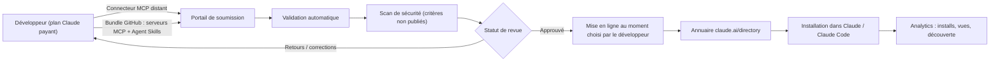
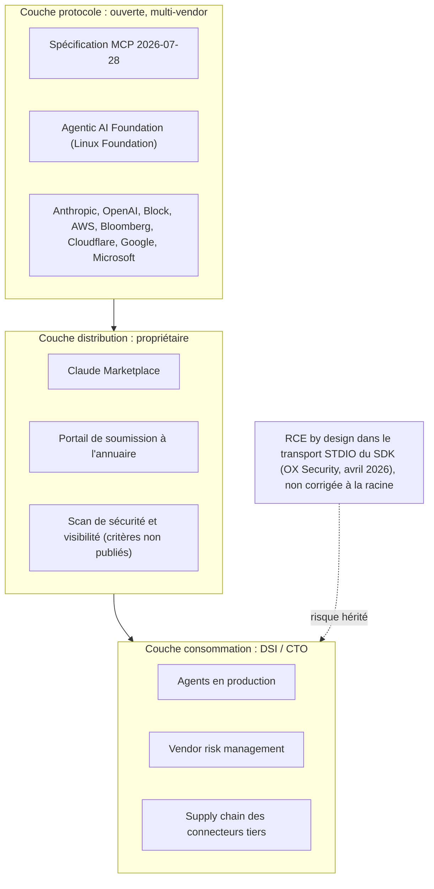

## Deux mille outils, un clic, et une question sans réponse

Un collaborateur du support installe un plugin. Trois secondes, un clic depuis la fenêtre de conversation, et l'assistant qui l'aide à rédiger ses réponses client dispose d'un accès aux documents partagés de l'entreprise et au référentiel de tickets. Personne, côté DSI, n'a signé quoi que ce soit. Le plugin figurait dans un catalogue officiel, il affichait un statut validé, l'utilisateur a fait ce que l'interface l'invitait à faire.

Ce scénario n'est plus théorique. Le 23 septembre 2026, Anthropic a annoncé le Claude Marketplace, un hub centralisé pour les plugins, connecteurs, agents et services partenaires, crédité de plus de 2 000 outils disponibles dès le lancement — Google Drive et Atlassian en tête d'affiche. Deux jours plus tard, le 25 septembre, l'éditeur ouvrait le portail qui permet à n'importe quel développeur sur un plan payant (Pro, Max, Team, Enterprise) de soumettre son propre plugin, de suivre sa revue, puis de mesurer son adoption une fois publié.

Pour un directeur technique, la question n'est pas de savoir si ce catalogue est pratique. Il l'est. Elle est de savoir ce que vaut exactement le tampon apposé à l'entrée, et qui tient la main qui l'appose. Parce que le protocole qui fait tenir tout cet édifice a été confié il y a neuf mois à une fondation multi-acteurs, dans un geste d'ouverture salué par toute l'industrie. Mais la vitrine, elle, n'a jamais quitté le giron d'un seul fournisseur.

## Ce que le portail industrialise réellement

Commençons par le concret, parce qu'il y a du concret. Jusqu'ici, faire entrer une intégration dans l'annuaire officiel de Claude relevait d'un processus décrit comme largement manuel : échanges, allers-retours, pas de suivi structuré. Le portail remplace cela par une chaîne outillée.

Deux voies de soumission coexistent. La première est un connecteur distant unique, c'est-à-dire une URL pointant vers un serveur conforme au Model Context Protocol (MCP), le format d'échange standardisé qui permet à un modèle de langage d'appeler des outils et de lire des données extérieures. La seconde est un bundle hébergé sur un dépôt GitHub, qui combine un ou plusieurs serveurs MCP avec des Agent Skills — des capacités packagées que l'agent peut mobiliser. Dans les deux cas, la soumission déclenche une validation automatique, puis un scan de sécurité, avec un statut consultable et des retours avant publication. Le développeur choisit lui-même le moment de la mise en ligne.

Une fois publié, il récupère des métriques : installations par surface produit et par version, vues de fiche, découverte via la recherche interne. C'est une boucle produit complète, du dépôt du code à la mesure d'usage. Pour qui construit des connecteurs, c'est un vrai gain d'industrialisation, et il faut le dire sans ironie.

Le socle technique suit la révision de spécification MCP du 28 juillet 2026, dont le cœur est désormais explicitement sans état. Deux extensions sont mises en avant : MCP Apps, qui autorise une interface interactive directement dans la conversation, et Enterprise Managed Auth, qui apporte un modèle d'authentification déléguée pensé pour les organisations. Cette dernière n'est pas un détail. Elle est probablement la brique la plus utile de tout l'ensemble pour une DSI, parce qu'elle attaque le vrai problème : qui autorise quoi, au nom de qui.

*Les plugins s'emboîtent sur une colonne vertébrale commune — encore faut-il savoir ce que chaque module transporte.*

Reste le point aveugle, et il est assumé par la presse qui a couvert l'annonce : aucun critère détaillé d'évaluation de sécurité n'a été publié. On sait qu'il y a un scan. On ne sait pas ce qu'il cherche, ce qui déclenche un rejet automatique, ce qui remonte à une revue humaine, ni ce qui passe. Un portique de sécurité dont personne ne connaît le réglage du détecteur reste un portique. Il ne constitue pas une garantie auditable par un tiers.

## Le verrou a changé d'étage

Un standard ouvert, c'est la norme des prises électriques. N'importe qui peut fabriquer un appareil conforme, et c'est excellent pour le marché. Mais si un seul acteur possède le magasin où ces appareils sont vendus, décide lesquels apparaissent en tête de gondole et appose lui-même l'étiquette « testé », la norme ouverte pèse soudain beaucoup moins lourd dans le rapport de force.

C'est exactement la configuration actuelle. Le 9 décembre 2025, MCP a été donné à l'Agentic AI Foundation (AAIF), un fonds dédié hébergé par la Linux Foundation, co-fondé par Anthropic, Block et OpenAI, avec AWS, Bloomberg, Cloudflare, Google et Microsoft parmi les membres platine. La gouvernance multi-vendor était explicitement présentée comme une réponse au risque de verrouillage propriétaire perçu par les entreprises. À l'époque de la donation, le protocole affichait plus de 97 millions de téléchargements de SDK par mois et environ 10 000 serveurs actifs, avec un support de premier plan chez ChatGPT, Claude, Cursor, Gemini, Microsoft Copilot et VS Code.

La révision de juillet 2026 a poussé la logique plus loin sur le plan institutionnel : une Contributor Ladder formalisée, des groupes de travail qui triagent désormais les propositions d'évolution dans leur périmètre, et une vraie politique de cycle de vie et de dépréciation — les dépréciations du 28 juillet étant les premières à la suivre. Sur le papier, la couche protocolaire est un modèle de gouvernance ouverte.

Et pendant ce temps, la couche qui détermine ce que vos utilisateurs installent réellement — l'annuaire, le classement dans les résultats de recherche, le statut de certification, les analytics — appartient intégralement à un seul fournisseur. Le protocole a été libéré. La distribution a été verrouillée. Ce n'est pas un scandale, c'est une stratégie parfaitement rationnelle, et elle mérite d'être nommée pour ce qu'elle est plutôt que célébrée comme une démocratisation.

Pour une direction technique, le déplacement est très concret. Négocier une clause de réversibilité sur un protocole gouverné par une fondation, c'est relativement simple : la spécification est publique, les implémentations sont multiples. Négocier une clause de réversibilité sur un canal de distribution qui concentre la découverte de vos outils métier, c'est une tout autre conversation. Le risque de dépendance ne disparaît pas. Il monte d'un étage, là où les contrats regardent rarement.

## La faille que personne n'a corrigée

Un serveur d'outils mal isolé, et le code qui s'exécute sur le poste ou le conteneur n'est plus celui que vous avez déployé. Pas d'exploitation sophistiquée, pas de vulnérabilité mémoire exotique : un comportement prévu par la conception du transport, utilisé de travers.

Le 20 avril 2026, OX Security a publié une analyse d'une faille architecturale dans le transport STDIO du SDK officiel MCP — le mode de communication par entrée/sortie standard utilisé quand un serveur d'outils tourne en local, à côté de l'agent. La qualification importe : il ne s'agit pas d'un bug d'implémentation mais d'un choix de conception, « by design », présent dans les implémentations Python, TypeScript, Java et Rust. Conséquence : exécution de code arbitraire à distance. Le rapport chiffre l'exposition à plus de 7 000 serveurs publiquement accessibles, plus de 150 millions de téléchargements cumulés du SDK, et jusqu'à 200 000 instances potentiellement vulnérables. Onze CVE ont été recensées sur des projets tiers de l'écosystème — LiteLLM, LangChain, LangFlow, Flowise, GPT Researcher, Agent Zero et d'autres.

Anthropic n'a pas modifié l'architecture du protocole à la suite de cette divulgation, qualifiant le comportement d'attendu. La faille reste donc non corrigée à la racine dans l'implémentation de référence.

*Le scan de sécurité filtre ce qui passe la porte. Il ne dit rien de la solidité du bâtiment.*

Soyons précis, parce que l'amalgame serait facile et malhonnête : cette vulnérabilité concerne le SDK et son transport local, pas le portail de distribution ouvert en septembre. Ce sont deux couches distinctes. Un plugin approuvé par le portail n'est pas « vulnérable à cause du portail ». Mais les deux couches se lisent ensemble, et c'est là que le bât blesse. On vous propose un sceau de confiance sur une couche de distribution, alors que la couche protocolaire qui la supporte porte la faille la mieux documentée de l'écosystème, et que l'éditeur a choisi de ne pas la traiter comme une faille.

Ce n'est pas seulement mon avis. Le 20 mai 2026, la NSA a publié, via son AI Security Center, une fiche d'information cybersécurité consacrée spécifiquement aux considérations de conception sécurisée du Model Context Protocol, mise en ligne sur media.defense.gov le 2 juin 2026. Quand une agence de ce niveau produit un document dédié à un protocole applicatif de moins de deux ans, le sujet a quitté le domaine du débat entre chercheurs.

## ClawHavoc : la répétition générale sur l'écosystème d'à côté

Un précédent existe, et il n'implique pas Anthropic. Il faut le dire clairement avant d'aller plus loin.

Le 1er février 2026, Koi Security a révélé la campagne « ClawHavoc » : 1 184 skills malveillants téléversés sur ClawHub, la place de marché d'extensions de la plateforme concurrente OpenClaw. Le vecteur était d'une banalité désarmante — un modèle de publication permissif, où tout compte GitHub âgé de plus d'une semaine pouvait publier. Antiy CERT a confirmé le chiffre au 5 février 2026.

Cet épisode ne concerne ni Claude, ni le directory d'Anthropic, ni MCP. Il concerne un écosystème agentique rival. Mais c'est précisément le scénario que la validation automatique et le scan de sécurité du nouveau portail Anthropic sont censés prévenir, et il fournit le meilleur étalon disponible pour juger de la valeur d'un dispositif de revue : on ne mesure pas un filtre à ce qu'il annonce, on le mesure au nombre de choses qu'il laisse passer. Sans critères publiés, sans transparence sur le taux de rejet, sans post-mortem public en cas d'incident, un opérateur extérieur n'a aucun moyen de calibrer sa confiance.

Sur le volume, un ordre de grandeur pour situer l'enjeu : le registre officiel MCP comptait, au 24 mai 2026, 9 652 enregistrements de serveurs en version courante et 28 959 enregistrements serveur/version cumulés. Une analyse tierce cite par ailleurs une enquête Stacklok 2026 selon laquelle 41 % des organisations logicielles interrogées auraient des serveurs MCP en production limitée ou large — chiffre repris de seconde main, dont la date de publication n'est pas clairement établie, et que je ne prendrais pas comme base d'une décision d'architecture. La tendance, en revanche, ne fait pas débat.

*Un maillage ouvert d'un côté, une porte unique et gardée de l'autre : la géométrie réelle de l'écosystème agentique en 2026.*

## Ce que j'exige avant qu'un connecteur tiers touche la production

Voici la grille que j'applique, et je la considère comme un minimum plutôt qu'un idéal.

**Liste blanche, pas catalogue ouvert.** Les utilisateurs n'installent pas depuis un annuaire public. Une équipe qualifie, une liste d'intégrations autorisées existe, et l'installation libre est désactivée par politique. Le confort d'un catalogue à 2 000 entrées est exactement ce qui rend la gouvernance impossible.

**Connecteurs distants plutôt que serveurs locaux, quand le choix existe.** Un connecteur distant s'authentifie, se journalise, se coupe. Un serveur local partageant le contexte d'exécution de l'agent hérite de ses privilèges et de la surface décrite plus haut. Enterprise Managed Auth existe : servez-vous en.

**Contrôle d'egress systématique.** Un connecteur qui ne devrait parler qu'à une API métier ne doit pouvoir joindre que cette API. C'est du réseau de base, et c'est la mesure qui transforme une exécution de code arbitraire en incident contenu plutôt qu'en exfiltration.

**Moindre privilège sur la donnée, pas seulement sur le système.** Un plugin de rédaction n'a pas besoin d'un jeton en écriture sur l'intégralité du drive d'entreprise. Les portées OAuth trop larges sont le péché originel de la plupart des intégrations que j'ai vues passer.

**Inventaire et versionnement figé.** Vous devez savoir, à tout instant, quels connecteurs tournent, en quelle version, maintenus par qui. Une mise à jour automatique d'un plugin tiers, c'est une modification non revue de votre chaîne d'exécution.

**Scan continu, pas scan à l'entrée.** Le scan du portail est un contrôle ponctuel au moment de la soumission. Il ne dit rien du commit poussé trois semaines plus tard sur le dépôt du bundle.

**Kill switch documenté et testé.** Combien de minutes pour désactiver un connecteur sur l'ensemble du parc ? Si vous ne connaissez pas la réponse, vous ne contrôlez pas cette surface.

## Le sceau ne remplace pas le contrôle

Le portail de soumission est une bonne chose. Il professionnalise une chaîne qui reposait sur des échanges manuels, il donne aux développeurs une visibilité qu'ils n'avaient pas, et il rend enfin mesurable ce qui se passe après publication. Je ne conteste pas l'utilité de l'outil.

Je conteste la lecture qu'on en fait. Cette annonce n'est pas une avancée de sécurité : c'est une couche produit et distribution posée sur un socle protocolaire dont la faille de conception la plus documentée n'a pas été corrigée, six mois après sa divulgation publique et quatre mois après qu'une fiche gouvernementale de la NSA s'en soit saisie. Les deux couches sont distinctes, mais elles s'adressent au même décideur, avec le même vocabulaire de confiance.

La conclusion opérationnelle tient en une phrase. « Présent dans l'annuaire » n'est pas un statut de sécurité, c'est un statut de référencement — et tant que les critères du scan ne seront pas publics et auditables, tout CTO qui traite le premier comme le second transfère une décision de risque à un fournisseur qui n'en porte pas la responsabilité contractuelle. L'ouverture du protocole était une vraie bonne nouvelle. Elle ne vous dispense pas de considérer chaque connecteur tiers comme ce qu'il est : du code d'un inconnu, exécuté avec les droits de votre agent, sur vos données.

## Sources

1. Anthropic — « Build plugins for Claude with the directory submission portal » — https://claude.com/blog/build-plugins-for-claude
2. CryptoBriefing — « Anthropic announces Claude Marketplace as hub for plugins and connectors » — https://cryptobriefing.com/claude-plugin-mcp-connector-submission-portal/
3. Unite.AI — « Anthropic Opens Directory Submission Portal for Claude Plugins » — https://www.unite.ai/anthropic-opens-directory-submission-portal-for-claude-plugins/
4. Model Context Protocol Blog — « The 2026-07-28 Specification » — https://blog.modelcontextprotocol.io/posts/2026-07-28/
5. Model Context Protocol Blog — « MCP joins the Agentic AI Foundation » — https://blog.modelcontextprotocol.io/posts/2025-12-09-mcp-joins-agentic-ai-foundation/
6. Linux Foundation — Communiqué, formation de l'Agentic AI Foundation — https://www.linuxfoundation.org/press/linux-foundation-announces-the-formation-of-the-agentic-ai-foundation
7. The Hacker News — « Anthropic MCP Design Vulnerability Enables RCE, Threatening AI Supply Chain » — https://thehackernews.com/2026/04/anthropic-mcp-design-vulnerability.html
8. OX Security — « The Mother of All AI Supply Chains » — https://www.ox.security/blog/the-mother-of-all-ai-supply-chains-critical-systemic-vulnerability-at-the-core-of-the-mcp/
9. NSA (AI Security Center) — Cybersecurity Information Sheet, « Security Design Considerations for AI-Driven Automation Leveraging the Model Context Protocol » — https://media.defense.gov/2026/Jun/02/2003943289/-1/-1/0/CSI_MCP_SECURITY.PDF
10. Digital Applied — « MCP Adoption Statistics 2026: Model Context Protocol » — https://www.digitalapplied.com/blog/mcp-adoption-statistics-2026-model-context-protocol
11. Cybersecurity News — « ClawHavoc Poisoned OpenClaw's ClawHub with 1,184 Malicious Skills » — https://cybersecuritynews.com/clawhavoc-poisoned-openclaws-clawhub/

_Vues personnelles, pas position Wifirst._
