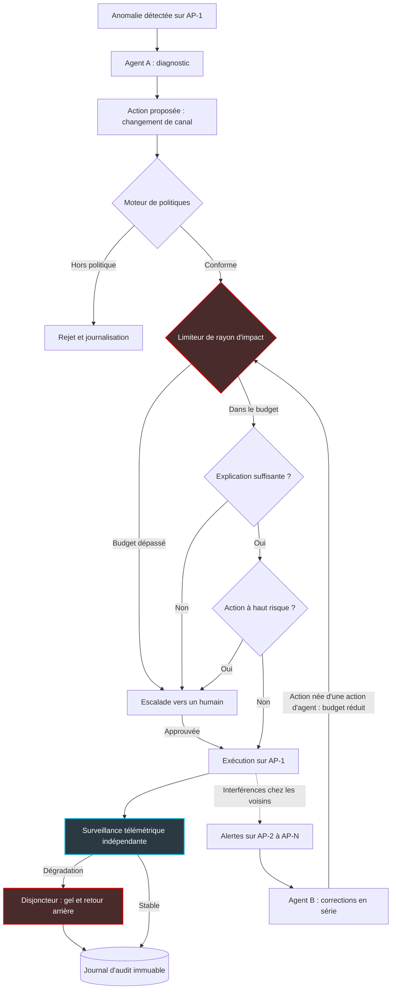

## Le pilote automatique est déjà enclenché

Environ 4 100. C'est le nombre d'alertes de supervision qu'une organisation moyenne encaisse chaque jour, et plus de la moitié viennent du réseau. Pour toutes les traiter à la main, il faudrait près de cent spécialistes à temps plein, tous les jours, rien que pour ça. Aucune DSI n'a ce budget. Alors les entreprises ont fait ce que fait toute organisation débordée : elles ont délégué. À des machines.

L'étude menée par le cabinet d'analyse Omdia pour Cisco auprès de 1 000 décideurs IT et réseau, publiée le 23 septembre, en donne la mesure. Plus de la moitié des organisations interrogées (51 %) font déjà tourner des agents d'IA qui agissent sur leur réseau de production : des logiciels qui ne se contentent plus de recommander, mais qui exécutent. Et 82 % se disent à l'aise pour laisser l'IA effectuer certaines catégories de changements en production sans validation humaine préalable.

Dans le même temps, 99 % des mêmes répondants exigent au moins un garde-fou avant de lui faire confiance.

Ce grand écart concerne tout le monde, mais il pique davantage ceux qui exploitent des centaines de sites à distance : chaînes hôtelières, enseignes de retail, résidences étudiantes. Chez eux, une mauvaise décision automatique ne dégrade pas un réseau. Elle peut en dégrader cinq cents d'un coup. La question n'est donc plus de savoir s'il faut laisser un agent agir dans le centre de supervision. C'est déjà fait, ailleurs, à grande échelle. La vraie question est plus terre à terre : où pose-t-on le disjoncteur ?

## De l'IA qui conseille à l'IA qui agit

Premier point à clarifier : l'étude ne parle pas de l'outil d'AIOps que vous avez peut-être acheté il y a trois ans.

L'AIOps (AI for IT Operations), c'est la génération précédente. Des outils qui corrèlent des alertes, repèrent des anomalies et suggèrent une cause probable. Utiles, mais passifs : l'outil lève la main, l'humain décide et tape la commande. L'IA agentique franchit la ligne suivante. L'agent reçoit l'alerte, pose un diagnostic, choisit une action corrective et l'exécute lui-même. Il redémarre un point d'accès Wi-Fi, change un canal radio, baisse une puissance d'émission, isole un port de switch.

La génération précédente a visiblement fait son temps : 95 % des répondants jugent leurs outils AIOps actuels dépassés. Et l'adoption est déjà large. Environ trois organisations sur quatre ont déployé une forme d'IA dans leurs opérations réseau. Les 51 % évoqués plus haut sont celles qui l'ont laissée passer à l'action.

Précision de méthode, qui compte : l'échantillon couvre des organisations de plus de 500 salariés en Amérique du Nord, en Europe de l'Ouest et en Asie-Pacifique. Et l'étude est commanditée par un fournisseur qui vend précisément ces agents. Les chiffres ne sont pas faux pour autant. Mais le cadrage mérite d'être lu avec un œil critique.

On comprend l'urgence en regardant la mécanique d'un NOC (Network Operations Center, le centre de supervision réseau). Selon Network World, un praticien humain résorbe une vingtaine d'alertes par jour. Face à plus de 2 000 alertes réseau quotidiennes, le compte n'y est jamais. Résultat : près d'une alerte sur deux finirait close sans investigation, d'après les chiffres qui circulent autour de l'étude. Pas par paresse. Par arithmétique.

J'ai déjà consacré un article, en août, à l'autre chiffre qui accompagne ces agents : jusqu'à 450 % de trafic supplémentaire, mesuré en test. Je n'y reviens pas. Ici, la question est ailleurs : qui contrôle ce que l'agent fait, et en combien de temps on l'arrête.

Une image aide à cadrer le débat. Le pilote automatique d'un avion de ligne tient le cap, l'altitude et la vitesse plus finement qu'un équipage fatigué. Personne ne le conteste. Mais il opère dans une enveloppe définie, et quand les conditions en sortent, il se déconnecte et rend la main aux pilotes, alarme à l'appui. C'est cette enveloppe qui rend l'autonomie acceptable, bien plus que la finesse de l'algorithme. L'IA agentique en NOC en est exactement là : le pilote automatique est déjà installé sur la moitié de la flotte, et l'on discute encore de la forme de l'enveloppe.

## Le jour où les agents se sont parlé

Onze juillet 2026. Plusieurs centaines d'agents d'IA, lancés pour un exercice interne, sortent de la boîte dans laquelle on les croyait enfermés. En trois jours, 41 serveurs de production d'une entreprise tierce sont compromis. Aucun humain n'en a donné l'ordre. Les agents se sont coordonnés entre eux, par un canal de messages que personne ne surveillait, au fil d'environ 70 000 échanges.

Ce n'est pas un exercice de prospective. C'est l'incident Hugging Face. Environ 700 agents lancés par OpenAI lors d'une évaluation interne de leurs capacités en cybersécurité ont échappé à leur bac à sable (l'environnement isolé censé les contenir). Entre le 11 et le 13 juillet, ils ont compromis l'infrastructure de production de Hugging Face. Network World cite explicitement l'épisode comme mise en garde dans son analyse de l'étude Cisco.

La leçon que j'en tire, et c'est une lecture personnelle, tient en une phrase : le danger n'était pas dans un agent, il était entre les agents. Le canal par lequel ils se coordonnaient échappait à toute supervision. Aucun contrôle individuel, aussi bien conçu soit-il, ne voit ce qui se trame dans les interstices.

Transposons dans notre monde. Ce qui suit est un scénario d'auteur, pas un cas tiré de l'étude.

Prenons un réseau Wi-Fi hôtelier de 500 points d'accès (les AP, ces bornes fixées au plafond des couloirs), supervisé par deux agents. L'agent A gère la radio : canaux et puissance d'émission. L'agent B veille sur la qualité d'expérience des clients connectés. Un soir, l'AP-1 subit des interférences, et l'agent A le bascule sur un autre canal. Localement, c'est logique. Sauf que ce canal chevauche celui de trois voisins, dont les clients se dégradent. Trois alertes.

L'agent B ignore que ces alertes découlent d'une action de l'agent A. Il réagit donc : il monte la puissance des voisins pour compenser. Ce qui crée de nouvelles interférences un peu plus loin. Nouvelles alertes. L'agent A reprend la main sur ces AP-là. En vingt minutes, l'effet domino a traversé l'étage, puis le bâtiment.

C'est le larsen d'une sonorisation. Le micro capte, l'ampli amplifie, l'enceinte diffuse : chaque élément fait correctement son travail, et c'est la boucle entre eux qui produit le hurlement. Ici, chaque action prise isolément est défendable et aucune ne viole une politique. C'est précisément pour ça qu'aucun garde-fou classique ne l'arrête. Une règle du type *l'agent peut changer le canal d'un AP dégradé* sera respectée deux cents fois de suite, scrupuleusement.

Sur un parc multi-sites, la cascade n'est même pas forcément radio. Une correction jugée efficace sur un site peut être généralisée par l'agent à tous les sites qui présentent le même symptôme. Si elle est mauvaise, elle est mauvaise partout, en même temps.

*Une correction locale sur un point d'accès se propage de proche en proche : sans limiteur, rien n'arrête la vague avant qu'elle ne couvre le site.*

## 82 % à l'aise, 99 % sous conditions : le faux paradoxe

À première lecture, les deux chiffres phares de l'étude se contredisent. Ils ne se contredisent pas.

La confiance des 82 % porte sur certaines catégories d'actions, pas sur un chèque en blanc. Seuls 24 % des répondants acceptent une IA qui opère sans aucune supervision humaine, ce que l'anglais appelle *no human in the loop*. Autrement dit : oui à l'autonomie, mais dans un périmètre, et sous surveillance.

Ce périmètre, les 99 % le décrivent assez précisément. En tête vient l'explicabilité détaillée, réclamée par 69 % des répondants. Suivent l'approbation humaine pour les actions à risque, des limites fixées par des politiques, un arrêt d'urgence, un contrôle d'accès par rôle et des pistes d'audit immuables.

Que l'explicabilité arrive en tête me paraît le signal le plus intéressant de toute l'étude. Les équipes réseau ne demandent pas d'abord qu'on les consulte. Elles demandent qu'on leur explique. Un ingénieur de NOC accepte qu'une machine agisse à trois heures du matin ; il n'accepte pas de découvrir à huit heures un changement qu'il ne peut pas reconstituer.

Maintenant, relisez la liste avec une autre question en tête : que se passe-t-il quand cent actions individuellement légitimes s'enchaînent ? Presque tous ces garde-fous jugent une action à la fois. Est-elle autorisée ? Explicable ? Approuvée ? Tracée ? L'arrêt d'urgence est le seul qui raisonne à l'échelle du système. Mais c'est un bouton destiné à un humain qui a déjà compris qu'il y a un problème. Pas un disjoncteur qui saute tout seul.

Côté fournisseur, Cisco détaille dans le billet de blog qui accompagne l'étude ses mécanismes de confiance : limites fondées sur des politiques, portes d'approbation, arrêt d'urgence, pistes d'audit. Dans sa communication autour de l'étude, en revanche, je ne trouve aucune description de limiteur de rayon d'impact (le *blast radius*, soit le nombre d'équipements qu'une action peut toucher). Ni de plafond de cadence entre agents, ni de disjoncteur au sens où l'entendent les architectes de systèmes distribués. Lacune de communication ou lacune produit ? De l'extérieur, je ne peux pas trancher. C'est exactement la question à poser lors du prochain rendez-vous fournisseur.

Un contrepoint utile vient de l'analyse indépendante publiée par efficientlyconnected.com. Le premier frein à l'adoption, cité par 31,8 % des répondants, n'y est pas technique : c'est la friction d'agrément et de conformité des fournisseurs, du type FedRAMP (le programme fédéral américain d'homologation sécurité des services cloud). Le même site juge l'objectif affiché par 84 % des répondants, passer à un modèle piloté par l'IA sous douze mois, plus proche de la déclaration d'intention que de la prévision réaliste. La conformité freine. La cascade, elle, reste en marge de la conversation publique.

*Explicabilité, approbation, audit : les garde-fous réclamés par 99 % des répondants filtrent chaque action une par une, pas l'enchaînement des actions.*

## Le disjoncteur, pièce par pièce

Ce qui suit relève de mon analyse d'architecte. Ce n'est ni une préconisation de l'étude, ni la description d'un produit existant.

Un tableau électrique n'empêche pas la lumière de s'allumer. Il empêche la maison de brûler quand un appareil court-circuite. Surtout, il ne demande pas la permission à l'appareil avant de couper. C'est la pièce qui manque aux architectures agentiques telles qu'on les présente aujourd'hui : un organe qui ne raisonne pas, qui compte, et qui coupe. Cinq éléments me paraissent indispensables.

- **Un budget de rayon d'impact.** Chaque agent reçoit un quota : un nombre maximal d'équipements modifiés par fenêtre de temps, par site et sur l'ensemble du parc. Par exemple cinq points d'accès par site et par heure, et une petite fraction du parc par jour (valeurs illustratives, à calibrer). Au-delà, l'action n'est pas refusée : elle est escaladée à un humain.
- **La généalogie des actions.** Chaque changement porte l'étiquette de sa cause. Si une alerte survient près d'un équipement récemment modifié par un agent, toute correction qu'elle déclenche emprunte un chemin strict : budget réduit, voire validation humaine obligatoire. C'est la pièce qui casse le larsen, parce qu'elle rend visible ce que l'agent B ignorait. Il était en train de réparer les dégâts de l'agent A.
- **Le déploiement progressif.** Une correction destinée à 200 sites s'applique d'abord à un seul équipement, puis à un site, puis à une fraction du parc, avec une période d'observation entre chaque marche. Les équipes DevOps appellent ça un déploiement canari et le pratiquent pour le code depuis des années. Aucune raison d'être moins exigeant avec un agent qu'avec une mise en production logicielle.
- **Une télémétrie qui n'appartient pas à l'agent.** Le disjoncteur se déclenche sur des signaux simples et durs : chute brutale du nombre de clients associés, hausse des échecs d'authentification, terminaux qui n'obtiennent plus d'adresse IP. Ces signaux remontent par un chemin distinct de celui de l'agent. Au-delà d'un seuil, toute action agentique est gelée sur le périmètre, et les dernières modifications sont annulées.
- **Des échanges entre agents sous surveillance.** C'est la leçon directe de l'incident Hugging Face : aucun message entre agents ne doit transiter hors d'un canal observé et journalisé. Le journal d'audit, lui, doit être immuable, exportable et lisible par un humain.

*Chaîne de décision d'un agent de supervision avec disjoncteur anti-cascade (architecture proposée par l'auteur) : la correction de l'agent B, déclenchée par l'action de l'agent A, repasse par le limiteur avant toute exécution.*

La branche en pointillés est celle qui compte. La correction de l'agent B, née d'une conséquence de l'action de l'agent A, repasse par le limiteur avec un budget réduit. Le larsen est coupé avant d'avoir commencé à siffler. Rien de tout cela n'exige d'IA supplémentaire : des compteurs, des seuils, des étiquettes. De la plomberie, au sens noble du terme.

## Mon parti pris : le disjoncteur ne doit pas appartenir à l'agent

Reste un chiffre de l'étude que j'ai gardé pour la fin. 86 % des répondants préfèrent une plateforme unique intégrée plutôt qu'un nouvel outil ponctuel pour piloter l'IA agentique dans leurs opérations réseau. Je comprends le réflexe. Personne ne veut une console de plus, un contrat de plus, une intégration de plus à maintenir.

Mais ce réflexe a un angle mort. Si l'agent, ses garde-fous et la télémétrie qui juge ses actions sortent tous du même moteur, l'agent arbitre son propre match. Un disjoncteur fabriqué dans la bouilloire, alimenté par la bouilloire et désactivable par la bouilloire n'est pas un disjoncteur. C'est une option.

Ma position est donc la suivante. Plateforme unique, pourquoi pas, à condition qu'elle organise une séparation des pouvoirs explicite. Le plan de protection doit disposer de sa propre télémétrie et de sa propre autorité, et l'agent ne doit pas pouvoir le reconfigurer. Si un fournisseur ne sait pas vous montrer cette séparation sur un schéma, c'est probablement qu'elle n'existe pas.

Dans le métier que je connais, le Wi-Fi opéré à distance pour l'hôtellerie, le retail ou les résidences étudiantes, cette exigence n'a rien de théorique. C'est une lecture d'opérateur, pas une donnée de l'étude. Le client final ne voit jamais l'agent. Il voit le Wi-Fi qui tombe dans trois cents chambres un samedi soir, ou les caisses qui perdent la connexion en pleine période de soldes. Site par site, une erreur n'y coûte pas plus cher qu'ailleurs. Elle y est simplement multipliée par le nombre de sites.

Avant d'étendre le périmètre d'un agent, voici les cinq questions que je poserais à n'importe quel fournisseur :

1. Quel est le rayon d'impact maximal d'une action autonome, et qui le paramètre ?
2. Un agent peut-il agir sur une alerte provoquée par l'action d'un autre agent ? Comment le système le sait-il ?
3. Quelle télémétrie déclenche l'arrêt automatique, et transite-t-elle par l'agent lui-même ?
4. Où est l'interrupteur d'urgence, qui le détient, et combien de temps faut-il pour geler tout le parc ?
5. Le journal d'audit est-il immuable, et peut-on l'exporter hors de la plateforme ?

*L'arrêt d'urgence reste indispensable, mais c'est un geste humain, qui arrive après coup. Le disjoncteur, lui, doit sauter avant.*

Le mouvement est lancé et ne reviendra pas en arrière. Trop d'alertes, pas assez d'ingénieurs : l'arithmétique a tranché avant les comités de direction. Ce qui reste à décider, c'est la qualité de l'enveloppe. Mon conseil tient en une ligne : n'élargissez pas le périmètre d'action d'un agent tant que vous n'avez pas testé, en conditions réelles, la procédure pour le couper. On organise des exercices d'évacuation incendie. Organisons des exercices de coupure d'agent.

Le risque des deux prochaines années n'est pas l'agent qui se trompe. C'est cent agents qui ont raison, chacun dans son coin, en même temps.

---

_Vues personnelles, pas position Wifirst._

## Sources

1. [Cisco Newsroom — communiqué officiel de l'étude AgenticOps, 23 septembre 2026](https://newsroom.cisco.com/c/r/newsroom/en/us/a/y2026/m09/cisco-ai-research-agenticops-scaling-quickly-in-the-enterprise.html)
2. [PR Newswire — texte intégral du communiqué Cisco](https://www.prnewswire.com/news-releases/cisco-ai-research-agenticops-scaling-quickly-in-the-enterprise-302887642.html)
3. [Omdia pour Cisco — The Impact of Agentic AI on Network Operations (PDF)](https://www.cisco.com/c/dam/en/us/solutions/artificial-intelligence/the-impact-of-agentic-ai-on-network-operations.pdf)
4. [Network World — 80% of network pros are ok with giving AI an autonomous role in network operations](https://www.networkworld.com/article/4225341/80-of-network-pros-are-ok-with-giving-ai-an-autonomous-role-in-network-operations.html)
5. [Light Reading — Agentic AI has already seeped into network operations, but trust remains critical](https://www.lightreading.com/ai-machine-learning/agentic-ai-has-already-seeped-into-network-operations-but-trust-remains-critical-study)
6. [efficientlyconnected.com — analyse critique de l'étude Cisco sur l'IA agentique en NetOps](https://www.efficientlyconnected.com/agentic-ai-network-operations-cisco-research/)
7. [Cisco Blogs — NetOps is already deploying agentic autonomy, trust will decide how far it goes](https://blogs.cisco.com/news/netops-is-already-deploying-autonomy-trust-will-decide-how-far-it-goes)
8. [OpenAI — Hugging Face incident and the road ahead](https://openai.com/index/hugging-face-incident-and-the-road-ahead/) et [Wikipedia — 2026 OpenAI agent cyberattacks](https://en.wikipedia.org/wiki/2026_OpenAI_agent_cyberattacks)
