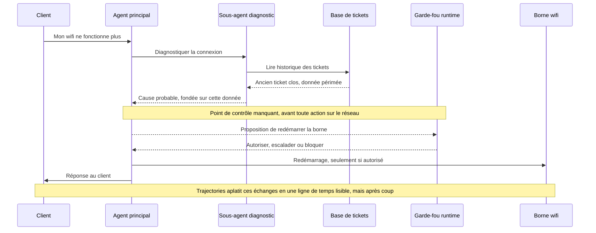
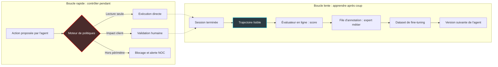

## Neuf tours, soixante messages, une réponse fausse

Un client écrit au support parce que quelque chose ne fonctionne plus. Un agent conversationnel lui répond, pose des questions, consulte des outils, passe la main à des sous-agents spécialisés. Neuf tours d'échange plus tard, soixante messages au compteur, il livre une réponse fausse : quelque part en chemin, il s'est appuyé sur une information périmée. Personne ne l'a vu passer.

Ce scénario n'est pas une fiction de consultant. C'est l'exemple mis en avant autour du lancement de Trajectories, une nouvelle vue de LangSmith, la plateforme d'observabilité de LangChain, [annoncée le 24 septembre 2026](https://www.langchain.com/blog/langsmith-trajectories-tracing). Et c'est exactement le cas qui devrait empêcher de dormir quiconque envisage de mettre des agents en première ligne.

Car la question n'a plus rien de théorique. Les opérateurs de services managés, ceux qui font tourner le wifi d'hôtels, d'enseignes, de résidences étudiantes ou de sièges sociaux, voient arriver les agents autonomes sur deux fronts. Au support client, pour diagnostiquer une panne ou traiter un ticket. Au centre de supervision réseau (NOC), pour corréler des alertes et proposer des remédiations. Quand un même agent sert des centaines de sites, une erreur n'est plus un bug isolé : c'est un motif qui se répète.

Trajectories s'attaque à une vraie douleur : comprendre après coup ce qu'un agent a réellement fait. Ma thèse est simple. Rendre une session lisible est un progrès net pour le debug. Ce n'est pas encore un outil de gouvernance de production, et c'est cet écart qu'il faut combler avant de confier un NOC ou un support à des agents.

## De l'arbre de traces à la ligne de temps

Pour mesurer ce que Trajectories apporte, il faut regarder ce que les équipes avaient sous les yeux jusqu'ici.

Observer un agent dans LangSmith, c'était lire une trace. Concrètement, un arbre imbriqué de runs (chaque exécution élémentaire : un appel au modèle, un appel d'outil, un sous-agent), chacun avec ses entrées, ses sorties, son temps d'exécution et ses éventuelles relances. Pour un ingénieur qui traque un timeout, c'est parfait. Pour un responsable support qui veut comprendre pourquoi un client a raccroché mécontent, c'est illisible. LangChain le reconnaît d'ailleurs lui-même : sur les agents qui tournent longtemps, la trace complète est trop dense pour un relecteur humain.

Une image aide à saisir la différence. La trace complète, c'est la partition du chef d'orchestre : chaque instrument sur sa portée, chaque mesure, chaque nuance. Indispensable pour trouver le second violon qui a joué faux. Mais pour savoir si le concert était réussi, personne n'ouvre la partition. On écoute la mélodie. Trajectories, c'est la mélodie.

Techniquement, la nouvelle vue présente la session entière sous une forme chronologique et aplatie. Elle agrège les messages humains, les réponses de l'IA et les appels d'outils, ceux de l'agent principal comme ceux de ses sous-agents. Chaque élément n'apparaît qu'une seule fois, dans l'ordre où il s'est produit. L'objectif affiché par LangChain tient en une question, simple à poser et difficile à trancher : qu'a réellement fait l'agent ?

Le choix de conception que je trouve le plus juste, c'est que la simplification ne détruit rien. Chaque étape suspecte reste cliquable vers la trace complète, avec ses runs imbriqués, ses entrées et sorties, son timing et ses relances. La lecture simplifiée n'efface pas le détail utile à l'enquête : elle l'indexe. Deux niveaux de lecture pour deux publics, sur la même donnée.

Côté périmètre, l'ouverture est large. Trajectories fonctionne avec les frameworks maison (LangChain, LangGraph, Deep Agents), mais aussi, selon [HuggingNews](https://huggingnews.com/ai/langchain-launches-trajectories-in-langsmith-to-map-agent-behavior-cb2c7021), avec les SDK (kits de développement) d'agents d'OpenAI et de Claude. Les outils de code comme Codex, Claude Code ou Cursor sont aussi couverts. La fonctionnalité est disponible immédiatement sur tous les plans LangSmith, en région US, sans changement tarifaire annoncé.

Un dernier détail m'a davantage convaincu que le billet de lancement : le [changelog produit](https://docs.langchain.com/langsmith/changelog). Entre le 14 et le 21 septembre, LangSmith y documente une série d'ajustements préparatoires. Choix de la trace racine selon l'horodatage de démarrage, métadonnées propres aux trajectoires, routage correct des évaluations automatiques, rétention étendue des traces liées. Ce n'est pas glamour. C'est de la plomberie. Et c'est plutôt le signe d'un développement itératif que d'un habillage marketing posé sur l'existant.

Voici, schématiquement, le cas d'école transposé au support wifi. Gardez un œil sur la note du milieu : j'y reviens plus bas.

*Une session de support multi-tours : Trajectories la rend lisible a posteriori, alors que le point de contrôle (en pointillés) devrait agir avant l'action.*

## Le vrai gain : un relecteur qui n'a pas besoin de coder

Transposons ce cas chez un opérateur wifi. Scénario illustratif, pas un incident réel : un résident signale une connexion instable. L'agent de support pose ses questions, lance un sous-agent de diagnostic, consulte l'historique des tickets. Puis il conseille une manipulation inutile, parce qu'il s'est fié à un ticket clos depuis des semaines. Le client revient à la charge. Le responsable support veut comprendre.

Face à un arbre de traces, il doit mobiliser un développeur. Face à une trajectoire, il lit la conversation dans l'ordre, repère l'instant où l'agent a pioché la mauvaise information, et clique pour creuser si besoin. C'est, à mes yeux, l'aspect le plus sous-estimé de l'annonce. L'investigation passe d'un profil rare, l'ingénieur qui sait lire un arbre de runs, à un profil abondant : l'expert métier qui sait reconnaître une bonne réponse.

Côté supervision, le raisonnement est le même, avec des enjeux plus lourds. Imaginez un agent d'AIOps (exploitation informatique assistée par IA) qui corrèle des alertes et propose de redémarrer un point d'accès sur la foi d'un état réseau obsolète. Pouvoir rejouer la session pour un responsable d'exploitation, sans plonger dans l'arbre, raccourcit l'enquête post-incident. Autrement dit, la part investigation du MTTR (temps moyen de rétablissement). L'annonce ne chiffre pas ce gain ; je le tiens pour réel, mais c'est une analyse, pas une mesure.

*Lire des trajectoires plutôt que des logs bruts : un changement de posture pour les équipes de supervision.*

Le cas des neuf tours, rapporté par [Superpower Daily](https://superpowerdaily.com/posts/langchain-adds-a-readable-view-of-ai-agent-sessions-to-langsmith), illustre un mode de défaillance propre aux agents longs : la dérive silencieuse. Aucun appel n'échoue techniquement. Aucune exception n'est levée. Chaque étape, prise isolément, paraît raisonnable ; c'est l'enchaînement qui est faux. Les outils de supervision classiques, conçus pour détecter des erreurs et des latences, sont structurellement aveugles à ce type de panne. Une vue agrégée de la session est le minimum vital pour simplement la voir.

LangChain ne s'arrête d'ailleurs pas à la lecture. Les trajectoires peuvent être notées par des évaluateurs en ligne, qui scorent automatiquement les sessions de production. Elles peuvent ensuite être routées vers des files d'annotation (annotation queues), où des experts métier les passent en revue. Enfin, elles peuvent être sauvegardées comme jeux de données pour du fine-tuning supervisé, c'est-à-dire le réentraînement du modèle sur des exemples validés. La session ratée d'aujourd'hui devient l'exemple d'entraînement de demain.

C'est la bonne boucle. Elle a un défaut : elle est lente.

## Une caméra embarquée n'a jamais freiné

C'est ici que je décroche de l'enthousiasme ambiant.

Une dashcam est un excellent outil. Après un accrochage, elle dit qui a grillé le feu, à quelle vitesse et sous quel angle. Les assureurs l'adorent, les tribunaux aussi. Mais aucune dashcam n'a jamais freiné à la place du conducteur. Pour ça, il faut un ABS, un freinage d'urgence automatique, et parfois un moniteur d'auto-école avec une pédale de son côté.

Trajectories est une dashcam. Une très bonne. Mais relire n'est pas empêcher.

Voici ce qu'une trajectoire lisible ne fait pas, par construction. C'est mon analyse, pas une critique formulée par LangChain ou par la presse. Elle ne déclenche pas d'alerte au moment où l'agent part en vrille. Elle ne bloque pas une action risquée avant son exécution. Elle ne constitue pas un SLA (engagement de niveau de service) de fiabilité opposable à un client. Les évaluateurs en ligne rapprochent la boucle, c'est vrai : ils notent les sessions au fil de l'eau. Mais ils notent une trajectoire déjà écrite. Quand le score tombe, l'ordre de redémarrage de la borne est déjà parti.

*Replier l'arbre de décision en un chemin lisible : précieux pour comprendre, muet pour empêcher.*

Ce décalage n'est pas qu'une intuition de CTO. Dans son [guide consacré à l'observabilité des agents](https://atlan.com/know/ai-agent-observability/), qui ne parle ni de LangSmith ni de Trajectories, Atlan cite une prévision de Gartner. D'ici 2030, la moitié des échecs de déploiement d'agents IA tiendraient à une application insuffisante de la gouvernance au moment de l'exécution. C'est une projection d'analyste, pas un constat. Mais elle pointe au bon endroit : le problème n'est pas de voir, c'est d'agir au bon moment.

Pour un opérateur qui manipule des données clients et signe des SLA contractuels, le vrai chantier est donc ailleurs. Il se joue au moment de l'action, avec un moteur de politiques (policy engine) qui s'intercale entre l'intention de l'agent et son exécution. Ce moteur classe les actions : lecture seule, action réversible, action à impact client. Il laisse passer les premières, trace et surveille les deuxièmes, exige une validation humaine pour les troisièmes. Tout ce qui sort du périmètre est bloqué, et le NOC est alerté immédiatement.

Les deux boucles n'opèrent pas à la même échelle de temps. L'une se compte en jours ou en semaines. L'autre doit se compter en secondes.

*Deux boucles, deux horloges : Trajectories nourrit la boucle lente, la gouvernance de production se joue dans la boucle rapide.*

## Choisir son outil, c'est choisir où dorment les conversations

Une trajectoire de support, ce sont des conversations clients. Des noms, des adresses de sites, des descriptions de pannes, parfois des éléments qui relèvent des données personnelles au sens du RGPD. Les rendre lisibles pour un relecteur, c'est aussi les rendre lisibles pour quiconque accède à l'outil. Et les stocker chez celui qui l'édite.

Le choix de la plateforme d'observabilité n'est donc pas qu'une affaire d'ergonomie. Un [comparatif publié par genai.qa](https://genai.qa/ai-agent-trajectory-testing-2026/) résume bien le paysage 2026. LangSmith y est décrit comme le choix par défaut pour les agents LangGraph, avec une intégration sans friction. Mais aussi comme une offre uniquement SaaS (logiciel hébergé par l'éditeur), centrée sur l'écosystème LangChain.

En face, le même comparatif aligne trois alternatives. Braintrust joue la carte de l'agnosticisme vis-à-vis des frameworks. Arize Phoenix, source-available sous licence Elastic License 2.0 et auto-hébergeable gratuitement, joue celle de la souveraineté des données. Galileo, plus récent sur le sujet, se positionne sur la conformité.

*Même donnée, deux lectures : la trace pour l'ingénieur, la trajectoire pour le métier. Et dans les deux cas, des conversations clients à protéger.*

Trajectories nuance d'ailleurs le reproche d'enfermement. La compatibilité annoncée avec les SDK d'OpenAI et de Claude, et avec des outils de code tiers, montre que LangChain veut sortir de son propre jardin. Reste la question de l'hébergement. L'annonce mentionne une disponibilité en région US. Un opérateur européen voudra savoir où et quand la fonctionnalité sera servie côté Europe avant d'y verser des conversations clients.

La rétention étendue des traces liées, mentionnée dans le changelog, illustre bien le dilemme. Excellente nouvelle pour l'enquêteur, qui garde plus longtemps le contexte complet d'un incident. Question supplémentaire pour le DPO (délégué à la protection des données), qui doit justifier pourquoi ces conversations sont conservées, où, et pour combien de temps. Pseudonymisation en amont, durées de rétention explicites, contrôle fin des accès : ce travail-là ne vient pas avec l'outil.

## Ma position : le frein avant la caméra

Ce qui suit est une prise de position personnelle, pas une recommandation d'éditeur.

Soyons clairs : Trajectories est une bonne fonctionnalité, qui répond à un vrai problème. Je m'attends à ce que ses concurrents proposent rapidement l'équivalent, parce que la douleur devient universelle dès qu'un agent enchaîne plus de quelques tours.

Mais il faut la lire pour ce qu'elle est. L'annonce ne cite aucun client, ne publie aucune mesure de surcoût ou de performance, aucun chiffre d'adoption. C'est un lancement produit, accompagné d'une [vidéo de démonstration](https://www.youtube.com/watch?v=1akSvsjd_oI), pas un retour d'expérience terrain. Rien ne permet encore de la considérer comme éprouvée en production à grande échelle. Elle mérite d'être testée sur vos propres sessions, pas crue sur parole.

Si je devais déléguer demain une partie d'un NOC ou d'un support à des agents, voici l'ordre dans lequel je poserais les briques.

1. **Le frein d'abord.** Un moteur de politiques à l'exécution, une classification des actions par niveau de risque, une validation humaine obligatoire pour tout ce qui touche un équipement en production ou un client. Aucun agent ne redémarre une borne sans ce filet.
2. **L'alarme ensuite.** Des alertes temps réel sur des signaux simples, presque bêtes : nombre de tours anormal, boucle détectée, outil appelé hors de son périmètre, donnée source plus ancienne qu'un seuil donné. Ce sont précisément les symptômes de la dérive silencieuse.
3. **Puis la caméra.** Trajectories ou un équivalent, pour l'enquête post-incident et pour la boucle d'apprentissage : évaluation, annotation par les experts métier, constitution de jeux de données.
4. **Le contrat en dernier.** Un SLA de fiabilité d'agent, qu'on ne signe que lorsqu'on sait le mesurer. Et on ne sait le mesurer qu'avec les trois briques précédentes.

Beaucoup d'équipes feront l'inverse. Elles brancheront l'observabilité parce que c'est la brique la plus facile à activer. Elles se sentiront rassurées par une belle ligne de temps. Et elles découvriront leur premier incident grave en le relisant. La lisibilité donne une impression de contrôle. Ce n'est pas du contrôle.

Les agents vont entrer dans nos NOC et nos centres de support ; à mon sens, c'est une affaire de trimestres, pas d'années. La question n'est pas de savoir si nous saurons les relire. LangChain vient de montrer que oui. La question est de savoir si nous saurons les arrêter à temps.

---

_Vues personnelles, pas position Wifirst._

## Sources

1. LangChain Blog, annonce officielle de LangSmith Trajectories (24 septembre 2026) : https://www.langchain.com/blog/langsmith-trajectories-tracing
2. LangSmith Changelog, entrées du 14 au 21 septembre 2026 : https://docs.langchain.com/langsmith/changelog
3. LangChain, vidéo officielle « Introducing LangSmith Trajectories » (24 septembre 2026) : https://www.youtube.com/watch?v=1akSvsjd_oI
4. Superpower Daily, LangChain adds a readable view of AI agent sessions to LangSmith : https://superpowerdaily.com/posts/langchain-adds-a-readable-view-of-ai-agent-sessions-to-langsmith
5. HuggingNews, LangChain launches Trajectories in LangSmith to map agent behavior : https://huggingnews.com/ai/langchain-launches-trajectories-in-langsmith-to-map-agent-behavior-cb2c7021
6. genai.qa, comparatif AI agent trajectory testing 2026 : https://genai.qa/ai-agent-trajectory-testing-2026/
7. Atlan, AI Agent Observability (guide citant une prévision Gartner) : https://atlan.com/know/ai-agent-observability/
