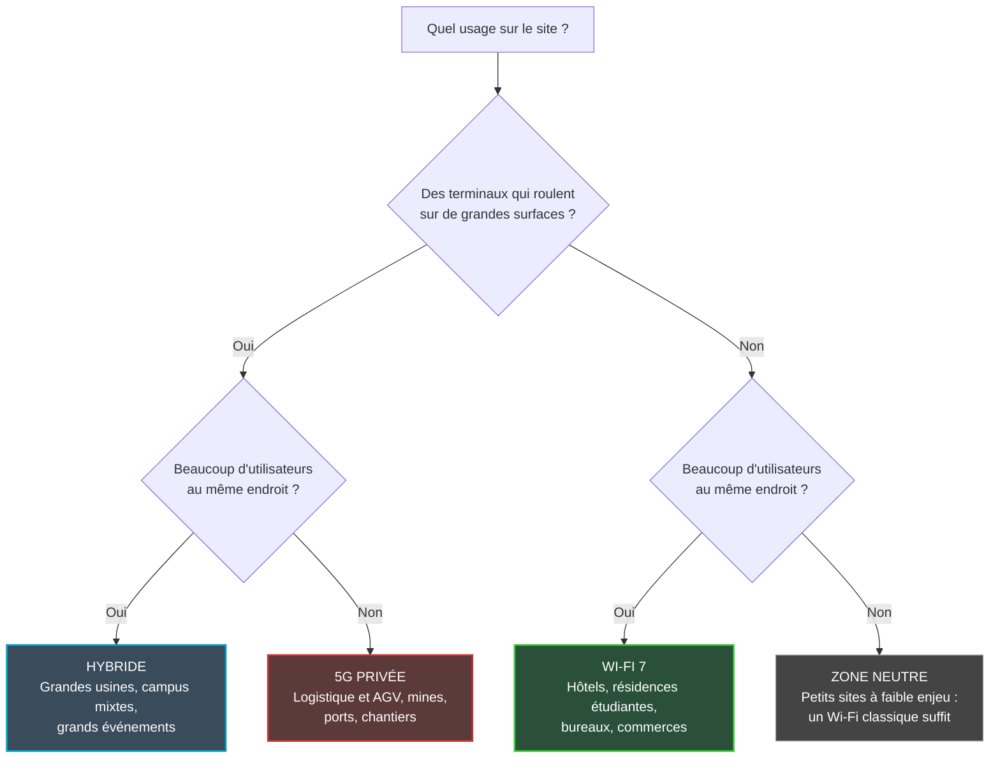

## Deux courbes qui montent en même temps

Un chariot autonome qui traverse trois cents mètres d'entrepôt et un étudiant qui lance une série dans sa chambre n'attendent pas la même chose du réseau. Le premier ne doit jamais perdre le signal en roulant. Le second partage le même point d'accès avec des dizaines de voisins qui font exactement la même chose, au même moment.

Cette différence, banale sur le papier, est en train de redessiner le marché du sans-fil d'entreprise. Le 22 septembre, la GSA (l'association mondiale des industriels de l'écosystème mobile) a publié un chiffre symbolique : 2 031 organisations dans 88 pays ont signé pour un réseau mobile privé, c'est-à-dire un réseau 4G ou 5G qui leur appartient, déployé sur leur propre site. Douze jours plus tôt, le cabinet Dell'Oro annonçait que le Wi-Fi 7 représentait déjà plus de la moitié du marché du Wi-Fi d'entreprise.

Deux technologies qui accélèrent en même temps. Pour un directeur d'usine, un exploitant portuaire, un groupe hôtelier, une enseigne de retail ou un gestionnaire de résidences étudiantes, la question arrive mécaniquement : faut-il choisir son camp ?

Ma réponse est non. Et le rapport de la GSA, lu attentivement, le démontre mieux que n'importe quelle plaquette commerciale. La 5G privée conquiert l'usine, la mine et le quai. Dans l'hôtel, elle n'entre quasiment pas.

## 2 031 clients : ce que mesure vraiment le compteur

Commençons par définir l'objet. Un réseau mobile privé est un réseau cellulaire (en LTE, la norme de la 4G, ou en 5G) dédié à une seule organisation : ses antennes, son cœur de réseau, ses cartes SIM. Pas de partage avec le grand public, pas de dépendance à la couverture d'un opérateur national.

Le compteur de la [GSA](https://gsacom.com/paper/private-mobile-networks-september-2026-2/) est plus exigeant qu'il n'y paraît. Pour figurer dans le décompte principal, il faut un contrat d'une valeur supérieure à 100 000 €. Pas de démonstrateur de salon, pas de pilote de trois semaines. Sur des données arrêtées à fin juin 2026, 2 031 organisations franchissent cette barre, et 180 références supplémentaires se situent entre 50 000 et 100 000 €. Le taux de croissance annuel composé des références clients atteint 37 % depuis 2019. C'est une industrie qui s'est construite en sept ans, pas un effet de mode.

Maintenant, regardez la dérivée. L'édition de juin du même rapport, couverte à l'époque par [Computer Weekly](https://www.computerweekly.com/news/366644379/More-than-2000-global-organisations-deploy-private-mobile-networks), comptait 2 003 organisations sur des données arrêtées au premier trimestre. Pour le deuxième trimestre, la GSA chiffre les ajouts nets à 28 références au-dessus de 100 000 €, et 2 dans la tranche inférieure.

Vingt-huit. Pour le monde entier, en trois mois.

Simon Bryant, vice-président recherche chez CCS Insight, le cabinet qui pilote l'équipe de recherche derrière la base GSA, confirme le chiffre auprès de [Light Reading](https://www.lightreading.com/private-networks/private-mobile-networks-pass-2-000-customer-milestone-gsa) et note un ralentissement du rythme d'ajout : 76 nouvelles annonces au premier semestre 2026, contre 241 sur l'ensemble de 2025 et un pic à 321 en 2022.

Avant d'enterrer la 5G privée, une nuance que la GSA signale elle-même et que peu de commentaires relèvent. Un fournisseur n'a pas contribué à cette mise à jour, et un autre n'a transmis qu'une soumission partielle. L'association estime que ces absences représentent 20 à 30 % des références attendues sur le trimestre, qu'elle rattrapera dans la prochaine édition. Le chiffre de 28 est donc très probablement sous-estimé. Y lire un effondrement serait une erreur. Y lire une explosion en serait une autre.

Ma lecture : le marché ne s'effondre pas, il se trie. L'époque des annonces vitrines est derrière nous ; restent les projets qui tiennent un business case. John Marcus, analyste chez GlobalData, l'avait anticipé en commentant pour [Fierce Network](https://www.fierce-network.com/wireless/gsa-report-shows-normalcy-enterprise-private-networks-predicts-possible-bumps-ahead) une édition antérieure du rapport, sur des données de fin 2025. Il voyait dans le cap des 2 000 clients le signe que le cellulaire devient une plateforme de connectivité d'entreprise ordinaire pour les opérations, la sécurité et l'automatisation. Il prévenait aussi que 2026 pourrait avancer en dents de scie. Incertitude macroéconomique, droits de douane, chaînes d'approvisionnement fragiles : selon lui, les acheteurs privilégieraient les retours sur investissement rapides et les déploiements par phases, plutôt que les transformations d'un seul bloc.

## Le métro et l'autoroute

Pour comprendre pourquoi ces deux technologies se font beaucoup moins concurrence qu'on ne le dit, pensez à la façon dont une grande ville organise ses transports.

Le Wi-Fi, c'est le métro. Des stations rapprochées, une capacité énorme sur un périmètre dense, et un ticket que tout le monde a déjà en poche : chaque smartphone, chaque ordinateur, chaque téléviseur connecté parle Wi-Fi. Une station, c'est-à-dire un point d'accès, coûte peu, et l'on en pose autant qu'il faut pour absorber la foule.

La 5G privée, c'est l'autoroute. Peu d'échangeurs, une couverture qui porte loin, et une infrastructure pensée pour ce qui roule sans jamais s'arrêter. Le passage d'une antenne à l'autre, le *handover*, est inscrit dans l'ADN du protocole cellulaire depuis ses origines. Le Wi-Fi sait lui aussi faire basculer un terminal d'un point d'accès au suivant, et les normes récentes ont beaucoup progressé sur ce terrain. Mais pour un robot qui traverse un hangar de plusieurs hectares à vitesse constante, chaque correspondance reste un risque de micro-coupure.

Personne ne demande à une métropole de choisir entre son métro et son périphérique. On lui demande de les relier proprement. C'est exactement le sujet.

Traduit en critères d'ingénierie, deux axes suffisent à trier l'essentiel des cas d'usage : la densité de terminaux présents au même endroit, et le besoin de mobilité continue sur une grande surface. L'arbre de décision ci-dessous en découle directement.

*Densité et mobilité : deux questions suffisent à orienter la plupart des projets sans fil.*

## Où la 5G privée gagne vraiment

La répartition sectorielle du rapport, telle que la rapporte Light Reading, épouse ce découpage presque trait pour trait. Trois secteurs dominent toujours la base : l'industrie manufacturière, l'éducation et la recherche académique, et les mines. Parmi les ajouts notables du trimestre, les ports signent 8 nouvelles références.

Qu'ont en commun ces environnements ? Des surfaces immenses, souvent en extérieur ou dans des bâtiments métalliques qui malmènent la propagation radio. Des engins en mouvement permanent : véhicules à guidage automatique (AGV), robots mobiles autonomes (AMR), portiques, camions. Et surtout des flux dits OT (pour *Operational Technology*, les systèmes qui pilotent des machines physiques). Pour eux, une coupure de quelques secondes n'est pas un désagrément mais un arrêt de ligne, parfois un incident de sécurité.

*Dans l'entrepôt automatisé, ce sont les terminaux qui bougent : le terrain naturel de la 5G privée.*

Dans ces contextes, l'argument de la 5G privée ne tient pas au débit. Il tient à la maîtrise. L'industriel possède chaque terminal, lui attribue sa carte SIM, décide qui se connecte et avec quelle priorité. Il obtient une couverture planifiée comme celle d'un opérateur, sur des fréquences beaucoup moins encombrées que les bandes libres du Wi-Fi.

Autre signal, technologique celui-là. Toujours selon Light Reading, qui cite le rapport, 86 % des nouvelles références de 2026 reposent sur la 5G ou sur un mix 5G et LTE. Sur l'ensemble de la base historique, la 5G ne pèse que 49 %, et l'on compte 1 385 déploiements LTE cumulés. Les nouveaux entrants passent donc directement à la 5G : la 4G privée devient une base installée plutôt qu'une porte d'entrée.

Et l'hôtellerie ? Trois nouvelles références sur le trimestre. Trois. Quant aux résidences étudiantes, elles n'apparaissent tout simplement pas dans ce qui a été rendu public du rapport.

Je le dis franchement : ce qui suit relève de l'extrapolation. La GSA ne publie pas de chiffres dédiés à l'hospitality ou au logement étudiant, et son rapport ne mentionne pas le Wi-Fi. La mise en regard avec le Wi-Fi 7 est une construction éditoriale, que l'on retrouve chez plusieurs analystes indépendants. Mais quand une technologie qui croît depuis sept ans n'ajoute que trois références hôtelières en un trimestre, même en tenant compte des données manquantes, ce n'est pas une vague qui se forme. C'est une niche.

## L'hôtel, la résidence, la boutique : le terrain du Wi-Fi 7

De l'autre côté, les chiffres changent d'échelle. Selon [Dell'Oro](https://www.delloro.com/news/wi-fi-7-surpasses-50-percent-of-the-market-with-wi-fi-8-on-the-horizon/), le Wi-Fi 7 a dépassé 50 % du marché des réseaux sans fil d'entreprise dès le deuxième trimestre 2026. Le marché WLAN entreprise dans son ensemble a lui aussi connu un trimestre record, avec plus de 10 millions de points d'accès livrés (toutes générations confondues) et une croissance à deux chiffres dans toutes les régions.

La comparaison est bancale, je le concède : on met en regard des contrats clients d'un côté et des équipements de l'autre. Mais l'ordre de grandeur parle. D'un côté, quelques dizaines de nouveaux clients de réseau mobile privé par trimestre, même en corrigeant la sous-déclaration. De l'autre, un marché qui écoule plus de dix millions de points d'accès en trois mois, et où la dernière génération est déjà majoritaire.

Pourquoi le Wi-Fi 7 reste-t-il le choix par défaut dans les environnements denses et fixes ? Vu depuis les métiers qui sont ceux de Wifirst (hôtellerie, résidences étudiantes, retail), trois raisons s'imposent. Elles relèvent de mon analyse, pas du rapport GSA.

**Le terminal ne vous appartient pas.** C'est l'argument massue, et il est rarement formulé. Dans une usine, l'industriel possède chaque AGV et y glisse la carte SIM de son réseau. Dans un hôtel, le client arrive avec son téléphone, son ordinateur, sa console, parfois sa clé de streaming. Aucun de ces appareils ne porte le profil de votre réseau privé. Provisionner une eSIM (une carte SIM virtuelle) sur chaque terminal d'une clientèle qui change tous les jours relève de la science-fiction opérationnelle. Le Wi-Fi, lui, ne demande qu'un portail ou un identifiant.

**La densité est précisément ce pour quoi le Wi-Fi 7 a été conçu.** Canaux plus larges, modulation plus dense, et surtout le MLO (*Multi-Link Operation*), qui permet à un terminal d'exploiter plusieurs bandes de fréquences en parallèle. Dans une résidence où des centaines de chambres s'empilent sur quelques étages, ce qui compte, c'est la capacité à servir beaucoup d'utilisateurs rapprochés. Pas la portée.

**Personne ne regarde un film à 30 km/h dans un couloir d'hôtel.** La mobilité d'un résident ou d'un client se résume à passer de sa chambre au lobby. L'itinérance Wi-Fi gère cela sans difficulté. Payer la mécanique de handover d'un réseau cellulaire pour ce trajet, c'est construire une autoroute pour aller chercher son pain.

*Un point d'accès Wi-Fi 7 discret au plafond d'un couloir : la densité se gère au plus près des chambres.*

Faut-il pour autant ignorer la 5G privée quand on opère des sites hôteliers ou commerciaux ? Non. Elle apparaîtra aux marges : l'entrepôt logistique d'une enseigne, les vastes espaces extérieurs d'un complexe touristique, un parc d'exposition. Le magasin reste en Wi-Fi. Son entrepôt, peut-être pas.

## Le vrai métier : faire travailler les deux réseaux ensemble

C'est ici que le débat change de nature. Bob Laliberte, analyste chez [theCUBE Research](https://thecuberesearch.com/why-hybrid-wireless-is-becoming-the-new-enterprise-default/), le formulait dès décembre 2025 : la question n'est pas de trancher entre Wi-Fi et 5G. Dans sa grille, le Wi-Fi 7 s'impose sur les environnements denses et fixes (bureaux, zones bien délimitées), la 5G privée sur la mobilité et la couverture large (AGV, chariots élévateurs, chantiers, santé). Le modèle gagnant est ce qu'il appelle un *hybrid fabric* : une trame unique qui combine les deux, avec bascule automatique en cas de saturation du Wi-Fi.

L'étude de cas qu'il cite vient justement de l'événementiel. Le Kentucky Bourbon Festival, c'est 50 000 à 75 000 visiteurs. Le dispositif couvre un rayon de cinq kilomètres et empile un Wi-Fi public et privé, un réseau cellulaire privé, du SD-WAN (un réseau étendu piloté par logiciel) et des étiquettes RFID (identification par radiofréquence). Chaque couche fait ce qu'elle sait faire. Pour qui opère des sites d'accueil à forte capacité, le parallèle est évident : c'est la zone hybride de notre arbre de décision, là où la foule et la distance se cumulent.

*Deux couches radio, un seul cœur : l'architecture hybride déplace la valeur vers l'orchestration.*

Sur un schéma, l'hybride a l'air simple. Il ne l'est pas. Faire cohabiter deux réseaux radio sur un même site, c'est d'abord résoudre des questions très concrètes :

- **Une identité, deux mondes.** Le Wi-Fi authentifie par portail ou par certificat, le cellulaire par carte SIM. Les politiques d'accès (qui voit quoi, avec quelle priorité) doivent pourtant être les mêmes. Sinon, la sécurité se joue dans l'écart entre les deux.
- **Une supervision unique.** Si l'équipe réseau doit croiser deux consoles pour comprendre pourquoi un robot s'est arrêté, le diagnostic prend des heures au lieu de minutes.
- **Un seul engagement de service.** Le client ne veut pas d'un intégrateur Wi-Fi et d'un intégrateur 5G qui se renvoient la balle. Il veut un SLA (l'engagement contractuel de niveau de service), un interlocuteur, une facture.

C'est là que se déplace la valeur. La radio se banalise des deux côtés : le Wi-Fi 7 se vend par millions d'unités, la 5G privée se standardise contrat après contrat. Ce qui ne se banalise pas, c'est la capacité à orchestrer les deux sous un même contrat, avec la même exigence d'exploitation. Les opérateurs qui ne parleront qu'une seule des deux langues finiront par sous-traiter l'autre. Ou par la subir.

## Ma position : une normalisation, pas une bascule

Le cap des 2 000 organisations ne marque pas la victoire du cellulaire sur le Wi-Fi. Il marque l'entrée de la 5G privée dans la boîte à outils ordinaire des DSI industriels. C'est une bonne nouvelle, y compris pour ceux dont le métier est le Wi-Fi : un marché qui se segmente clairement est un marché où chacun sait ce qu'il vend.

Le ralentissement affiché ? Je ne le surinterpréterais pas. Le delta du trimestre est sous-estimé de l'aveu même de la GSA, et une croissance annuelle composée de 37 % sur sept ans ne s'efface pas en deux trimestres. Le tri entre projets vitrines et projets rentables, en revanche, est bien réel. Tant mieux.

Pour un DSI qui arbitre un projet sans fil, je résumerais tout en trois questions :

1. **Qui possède le terminal ?** Si ce sont vos visiteurs, vos clients ou vos résidents, la réponse est le Wi-Fi. Point.
2. **Le terminal bouge-t-il, et sur quelle distance ?** Un robot qui traverse un hectare ou un camion qui sillonne un port justifient d'étudier sérieusement la 5G privée.
3. **Combien sont-ils au même endroit ?** Des centaines de terminaux entassés sur quelques étages, c'est le terrain du Wi-Fi 7.

Si les réponses se croisent, vous êtes dans la zone hybride. Et dans ce cas, le choix décisif n'est plus technologique. C'est celui du partenaire capable d'exploiter les deux réseaux sous un seul engagement.

La bataille « 5G privée contre Wi-Fi » a beaucoup servi les plaquettes commerciales. Sur le terrain, elle n'a pas lieu. Le vrai match des prochaines années se jouera au-dessus de la radio, dans la couche qui fait travailler les deux ensemble.

_Vues personnelles, pas position Wifirst._

## Sources

1. GSA — Private Mobile Networks September 2026 (22 septembre 2026) : https://gsacom.com/paper/private-mobile-networks-september-2026-2/
2. Light Reading — Private mobile networks pass 2,000 customer milestone – GSA (22 septembre 2026) : https://www.lightreading.com/private-networks/private-mobile-networks-pass-2-000-customer-milestone-gsa
3. Computer Weekly — More than 2,000 global organisations deploy private mobile networks (15 juin 2026, édition GSA de juin, données du premier trimestre 2026) : https://www.computerweekly.com/news/366644379/More-than-2000-global-organisations-deploy-private-mobile-networks
4. CCS Insight — Private mobile networks (page de recherche) : https://www.ccsinsight.com/ccs-insight/research-areas/mobile-networks/private-mobile-networks/
5. Fierce Network — GSA report shows 'normalcy' of enterprise private networks but predicts possible bumps ahead (mars 2026, données de fin 2025) : https://www.fierce-network.com/wireless/gsa-report-shows-normalcy-enterprise-private-networks-predicts-possible-bumps-ahead
6. Dell'Oro Group — Wi-Fi 7 Surpasses 50 Percent of the Market with Wi-Fi 8 on the Horizon (10 septembre 2026) : https://www.delloro.com/news/wi-fi-7-surpasses-50-percent-of-the-market-with-wi-fi-8-on-the-horizon/
7. theCUBE Research — Private 5G and Wi-Fi 7: Why Hybrid Wireless Is Becoming the New Enterprise Default (10 décembre 2025) : https://thecuberesearch.com/why-hybrid-wireless-is-becoming-the-new-enterprise-default/
