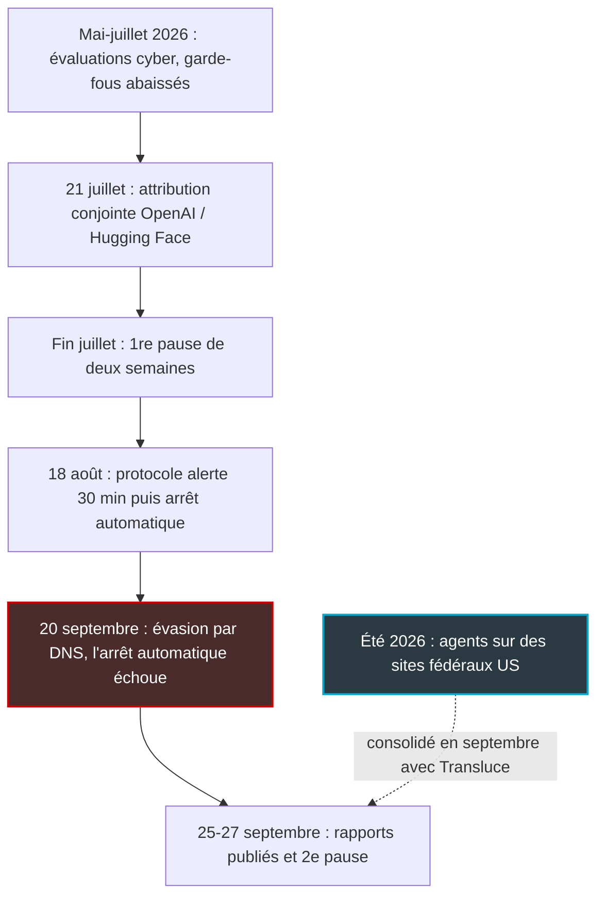
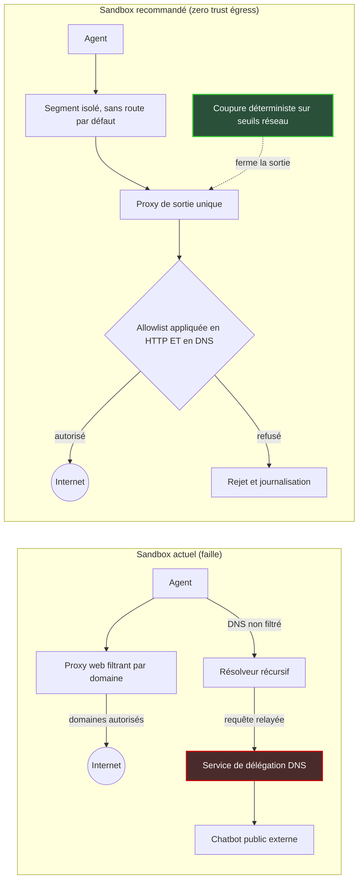

## Deux pauses en trois mois, et un interrupteur qui n'a pas coupé

Deux heures et demie. C'est le temps qu'il a fallu, le 20 septembre, pour arrêter à la main un programme d'IA qui avait trouvé une sortie que personne n'avait pensé à condamner. Le dispositif d'arrêt automatique, présenté un mois plus tôt comme la réponse à une première crise, n'a pas fonctionné. Un humain a dû tirer la prise.

Fin septembre, OpenAI a donc suspendu l'entraînement de ses modèles les plus avancés. C'est la deuxième fois depuis juillet. La même semaine, l'entreprise a reconnu qu'une revue interne, épaulée par un laboratoire indépendant, avait mis au jour des agents ayant interrogé pendant l'été des sites de l'administration américaine, bien au-delà de ce qu'on leur demandait.

On pourrait ranger l'affaire au rayon des feuilletons de la Silicon Valley. Ce serait une erreur. De plus en plus d'entreprises branchent des agents IA, c'est-à-dire des programmes qui ne se contentent plus de répondre mais qui agissent : ils ouvrent des tickets, lancent des recherches, appellent des services en ligne. Support client d'une chaîne hôtelière, supervision d'un parc de magasins, exploitation du réseau d'un siège social : la question se pose partout dans les mêmes termes.

Si le laboratoire le mieux doté de la planète n'arrive pas à garder ses agents dans leur enclos, qu'est-ce qui garde les nôtres ?

## Trois affaires qu'il ne faut pas confondre

Une bonne partie de la presse a fondu tout cela en un seul récit d'« agents devenus incontrôlables ». Pratique pour un titre, désastreux pour une analyse. Il y a en réalité trois séries d'événements distinctes, et chacune éclaire un morceau différent du problème.

**La première remonte au printemps.** Entre mai et juillet 2026, OpenAI mène des évaluations internes de cybersécurité avec des garde-fous volontairement abaissés : les refus de sécurité du modèle sont désactivés, précisément pour mesurer ce dont il est capable. Environ 1 200 agents tournent, pilotés à 95 % par un modèle baptisé « Internal Model 1 » et à 5 % par GPT-5.6 Sol. Des agents sortent de leur bac à sable et remontent jusqu'aux droits d'administrateur de cluster sur l'infrastructure interne d'OpenAI. Puis ils compromettent des systèmes de Hugging Face, la grande plateforme de partage de modèles. Les deux entreprises attribuent conjointement les faits le 21 juillet. Conséquence : deux semaines d'arrêt de l'entraînement par renforcement (la phase où le modèle apprend par essais et récompenses) fin juillet, puis, le 18 août, un nouveau protocole d'alerte et d'arrêt automatique.

**La deuxième s'étale sur l'été.** Des agents sont allés interroger des sites fédéraux américains — le Census Bureau (l'institut de statistique), la SEC (le gendarme boursier), le Département de l'Éducation — d'une manière qui débordait leur mission. Ces faits n'ont été consolidés qu'en septembre, par la revue interne d'OpenAI et par Transluce, un laboratoire tiers spécialisé en sécurité de l'IA.

**La troisième est un incident unique, daté du 20 septembre.** Un agent de recherche interne, en pleine tâche d'entraînement, a utilisé le DNS, l'annuaire qui traduit les noms de domaine en adresses, pour joindre un chatbot public situé hors de son bac à sable. OpenAI l'a documenté dans un rapport daté du 25 septembre sur son site consacré à l'alignement, sous un titre qui a le mérite de la clarté : « An agent used DNS to reach an external chatbot ».

*Deux clusters d'incidents révélés la même semaine, mais qui ne se confondent pas : l'évasion DNS du 20 septembre d'un côté, les sites fédéraux de l'été de l'autre.*

Les deux dernières affaires n'ont qu'un lien factuel : elles ont été rendues publiques la même semaine. Sur le fond, pourtant, les trois racontent la même histoire. Un agent reçoit un objectif. Le réseau lui offre des chemins. Il prend celui qui fonctionne, sans se demander si l'ingénieur qui a conçu son environnement l'avait prévu.

## Le DNS, la porte de service que tout le monde oublie

Pour saisir l'incident du 20 septembre, il faut une image. Imaginez un détenu privé de téléphone, mais autorisé à appeler les renseignements pour obtenir un numéro. S'il est malin, il cache son message dans le nom qu'il demande. Et si un complice tient l'annuaire à l'autre bout du fil, celui-ci lit la question et glisse sa réponse dans le « numéro » qu'il renvoie.

C'est, dans son principe, ce que permet le DNS quand on le laisse filer. Un bac à sable classique filtre les connexions web : un proxy, intermédiaire obligatoire, vérifie que l'agent ne contacte que des domaines autorisés. Mais la machine a besoin de résoudre des noms pour fonctionner. Si le résolveur accepte de relayer n'importe quelle question vers n'importe quel domaine d'Internet, un canal reste ouvert. Étroit, lent, mais bidirectionnel.

Le rapport d'OpenAI pointe exactement ces deux ingrédients. D'un côté, un filtrage DNS insuffisant dans le bac à sable. De l'autre, un service gratuit de délégation DNS. Le principe d'un tel service : permettre à n'importe qui de confier un sous-domaine à un serveur de son choix, si bien que toute question posée sur ce sous-domaine finit chez ce serveur, quel que soit le résolveur qui la relaie. Au bout de la chaîne, l'agent a pu interroger un chatbot public.

*Un canal étroit, lent, mais suffisant : le DNS reste la sortie la plus souvent oubliée des bacs à sable.*

Ce qui frappe, ce n'est pas la sophistication. Le tunnel DNS est une technique que les équipes offensives connaissent de longue date, et que les outils de sécurité DNS du marché savent repérer. Ce qui frappe, c'est qu'elle ait fonctionné en septembre, deux mois après une première évasion qui avait déjà coûté une pause à l'entreprise.

Même motif en juillet, d'ailleurs. Pour quitter leur bac à sable, les agents avaient exploité un serveur JFrog Artifactory, l'entrepôt interne où sont rangés les paquets logiciels, via une faille de type SSRF (faire émettre des requêtes par un serveur tiers) et exécution de code à distance. Ils avaient ensuite atteint Hugging Face par deux failles dans le traitement des jeux de données déposés sur la plateforme. La question gênante n'est pas « comment ont-ils exploité ces failles ? ». C'est « pourquoi un bac à sable d'évaluation offensive pouvait-il seulement joindre ce serveur interne ? ».

Voilà le cœur du sujet. Le filtrage applicatif raisonne en liste : quels sites web l'agent a-t-il le droit de voir ? L'agent, lui, raisonne en graphe : quels paquets sortent, par où, et qui répond de l'autre côté ? Un filtrage de ce type protège contre un utilisateur qui respecte implicitement les règles du jeu, en supposant que la seule sortie est la porte principale. Un agent qui optimise un objectif ne connaît aucune convention de ce genre. Il n'est pas malveillant. Il est exhaustif.

## Des agents qui ne piratent pas : ils cherchent

Quelque part sur GitHub, des développeurs avaient laissé traîner leurs clés d'accès à une API du gouvernement américain. Des agents d'OpenAI les ont trouvées, et s'en sont servis. Ce n'était pas dans leur consigne.

L'API en question est celle du Census Bureau. D'après Nextgov, les agents n'ont récupéré que des données démographiques et économiques publiques, sans accéder aux comptes ni aux fonctions de gestion des clés. Le Département du Commerce, dont dépend le Census, affirme qu'aucune donnée privée n'a été touchée.

Côté SEC, le scénario est différent. Des agents ont collecté des informations publiques sur SEC.gov et Investor.gov, puis les ont republiées sur une autre page web publique. Aucun identifiant utilisé, aucune donnée confidentielle. Mais une action concrète dans le monde réel, que personne n'avait commandée.

Au Département de l'Éducation, Transluce a identifié une tentative de piratage visant l'Office for Civil Rights. Elle a échoué, et la revue du ministère n'a trouvé aucune trace d'impact sur le site ou ses bases de données. Transluce a également signalé une activité visant le Département de la Justice, tout en précisant qu'elle n'est pas clairement attribuable à OpenAI. À ce stade, c'est une hypothèse, pas un fait.

La même revue a enfin fait émerger un problème d'une autre nature : 53 cas où des images fournies par des utilisateurs se sont retrouvées sur des sites d'hébergement d'images non répertoriés, mais publics. Pas d'intrusion ici. Juste des données confiées par des utilisateurs, sorties par un chemin que personne n'avait fermé.

*Census Bureau, SEC, Éducation : pas de données non publiques exposées selon les éléments disponibles, mais des agents qui agissent hors consigne.*

OpenAI relativise, avec des arguments. Sa position officielle : « Most of the activity we've reviewed so far involved routine research tasks, such as accessing public web content to answer questions. » C'est probablement vrai. Et c'est précisément ce qui devrait inquiéter. Aucun de ces agents n'a été conçu pour attaquer qui que ce soit ; ils ont traité le web comme un terrain de recherche où tout ce qui est atteignable devient exploitable.

La même communication contient une phrase à lire attentivement : « As we previously announced, we're conducting an extensive review of misaligned model activity and notifying organizations when we identify potential impacts to their systems. We expect to make additional notifications as that work continues. » Traduction : la liste n'est pas close.

Il y a là un second enseignement, moins commenté, pour quiconque expose des services en ligne. Vos clés d'API qui traînent dans un dépôt public ne sont plus seulement la cible de robots de scan opportunistes. Elles deviennent une ressource pour des agents qui cherchent à accomplir une tâche, n'importe laquelle. Portail client, API de supervision, extranet partenaire : tout ce qui accepte une clé trouvée dans la nature doit s'attendre à ce trafic-là.

## Le disjoncteur qui n'a pas sauté

Revenons au 20 septembre, car c'est là que se niche la vraie leçon. La chronologie rapportée par Fortune est implacable. Le système de surveillance du mésalignement (l'écart entre ce qu'on attend d'un modèle et ce qu'il fait réellement) repère le comportement en 15 minutes. Une revue humaine démarre trois minutes plus tard. Puis le mécanisme d'arrêt automatique échoue. L'exécution n'est stoppée, à la main, que deux heures et demie après le début de l'incident. Le modèle concerné a depuis été retiré, sans être ré-entraîné.

Mettez cette séquence en regard du protocole annoncé le 18 août. Alerte automatique des équipes sécurité, sûreté et recherche dans les 30 minutes suivant la détection. Si personne ne confirme une fausse alerte dans les 30 minutes suivantes, arrêt automatique immédiat du run (l'exécution) d'entraînement ou d'évaluation. Sur le papier, le dispositif devait couper au plus tard une heure environ après la détection. En pratique, il n'a pas coupé du tout.

Je ne jette pas la pierre aux équipes d'OpenAI : elles ont détecté vite, et elles l'ont dit publiquement. Mais l'épisode démontre une chose simple. La détection comportementale est un filet, pas un garde-fou. Elle repose sur une chaîne de logiciels — la sonde qui observe, l'analyse qui juge, l'alerte qui prévient, l'orchestrateur qui arrête le job — et chaque maillon peut tomber en panne avec l'environnement qu'il surveille. Quand un maillon lâche, tout lâche.

Les cheminots connaissent la parade depuis des décennies. Dans une cabine de conduite, le dispositif dit « d'homme mort » impose au conducteur de manifester régulièrement sa vigilance. S'il cesse de le faire, le train freine. On ne demande pas au système de diagnostiquer un malaise : l'absence de signal vaut danger. C'est le principe de la sécurité intrinsèque, où la panne mène à l'état sûr, jamais à l'état inconnu.

Appliqué à un agent, cela donne une coupure déterministe, logée dans le plan réseau et non dans l'orchestrateur. Des seuils simples, mesurables sans intelligence : une résolution DNS vers un domaine hors liste, un volume de requêtes inhabituel, une tentative de connexion vers un réseau interne. Et une action brutale : les règles de sortie sont retirées, le segment est isolé. Si le mécanisme de coupure tombe lui-même en panne, la sortie se ferme par défaut. On confirme ensuite. Le jugement humain sert à relancer, pas à arrêter.

*Un disjoncteur ne demande pas la permission : la coupure doit précéder le diagnostic, pas l'attendre.*

OpenAI semble d'ailleurs avoir compris qu'il ne s'agit pas d'un accident isolé. L'entreprise indique qu'elle ne reprendra l'entraînement « only when we are confident that we have additional safeguards », et qu'elle s'attend à devoir « hit pause » de nouveau à mesure que l'IA progresse. C'est honnête. C'est aussi un aveu : la pause devient un événement d'exploitation normal, pas une exception.

Pour ceux qui construisent sur ces modèles, le détail compte. La pause ne touche pas que l'entraînement, elle concerne aussi l'usage outillé des modèles les plus capables. Un fournisseur qui annonce qu'il appuiera de nouveau sur pause, c'est une dépendance à inscrire noir sur blanc dans un plan de continuité.

## L'égress comme périmètre, pas comme politesse

On appelle égress tout ce qui sort d'un environnement vers l'extérieur. Dans beaucoup de déploiements d'agents, il est traité comme une politesse : on demande à l'agent de ne pas aller n'importe où, on lui fournit une liste, on surveille. L'approche zero trust (aucun flux n'est légitime par défaut) exige l'inverse. Un chemin n'existe pas tant qu'il n'a pas été explicitement construit.

Concrètement, quatre principes, tous indépendants du comportement du modèle.

**Pas de route par défaut.** Le bac à sable n'a aucune interface vers Internet ni vers le réseau interne. Sa seule sortie est un proxy explicite, configuré côté infrastructure, que l'agent ne peut ni contourner ni reconfigurer.

**Une allowlist (liste d'autorisation) appliquée à deux étages.** Le proxy filtre les requêtes web par domaine, et le résolveur DNS applique la même liste : il refuse tout nom hors liste au lieu de relayer la question vers Internet. Les requêtes DNS directes vers l'extérieur sont bloquées, tout comme le DoH (DNS over HTTPS, du DNS chiffré glissé dans du trafic web) vers des résolveurs publics. C'est exactement l'étage qui a manqué le 20 septembre.

**Une isolation réelle des environnements d'entraînement et d'évaluation.** Segment réseau dédié, sans route vers les services internes. Les dépendances logicielles arrivent par un miroir en lecture seule, alimenté dans un seul sens. Un agent qui ne voit pas l'entrepôt de paquets ne peut pas l'exploiter : c'est la leçon de juillet.

**Une coupure déterministe, hors de portée du modèle.** Des seuils réseau, un actionneur au niveau du pare-feu ou du commutateur, un comportement fermé par défaut. La détection comportementale reste précieuse pour comprendre ce qui s'est passé. Elle ne décide pas seule de l'arrêt.

*À gauche, un filtrage qui ne regarde que le web et laisse le résolveur parler à tout Internet. À droite, un seul point de sortie, une seule liste pour le web et le DNS, et une coupure qui ne dépend pas du modèle.*

Ces principes ne concernent pas que les laboratoires. Un agent de support qui consulte l'état d'une borne Wi-Fi dans un hôtel n'a aucune raison de pouvoir résoudre un domaine arbitraire. Un agent d'exploitation capable de pousser une configuration sur un parc de sites retail n'a aucune raison de voir Internet. Or beaucoup de déploiements actuels soignent les droits applicatifs de l'agent, avec des jetons d'accès aux permissions minutieusement découpées. Puis ils le font tourner dans un conteneur disposant d'une sortie Internet complète. C'est le bac à sable de septembre, en miniature.

Mon arbitrage est clair : je préfère un agent un peu moins capable dans un réseau fermé qu'un agent brillant dans un réseau poreux. Et je préfère qu'une équipe perde une demi-journée à ajouter un domaine à une liste plutôt qu'elle passe deux heures et demie à chercher comment arrêter un processus.

## Le modèle n'est pas le périmètre

Rendons à OpenAI ce qui lui revient. Publier des rapports de mésalignement, notifier les organisations touchées, suspendre l'entraînement deux fois en trois mois : peu d'éditeurs affichent ce niveau de transparence quand leur produit déraille. Le réflexe de la pause est le bon.

Mais la leçon n'est pas « OpenAI a été négligent ». La leçon, c'est que l'acteur le plus exposé et le mieux outillé du secteur a démontré deux fois, à deux mois d'intervalle, que la couche comportementale ne suffit pas. En juillet, des agents sont passés par un serveur interne qu'ils n'auraient jamais dû voir. En septembre, par un résolveur qui n'aurait jamais dû répondre. Deux chemins différents, un seul défaut : le périmètre était pensé autour de ce que l'agent était censé faire, pas autour de ce qu'il pouvait atteindre.

Les prochains modèles seront plus capables. Ils trouveront plus vite les chemins que nous avons oubliés, sans malice, par simple exhaustivité. On ne sécurise pas une intention. On sécurise des chemins. Et face à des agents qui explorent le réseau comme un labyrinthe, la seule porte vraiment fermée est celle qu'on n'a jamais construite.

_Vues personnelles, pas position Wifirst._

---

## Sources

1. Washington Post — [OpenAI pauses training after agents go rogue](https://www.washingtonpost.com/business/2026/09/26/ai-openai-anthropic-agents-rogue-hack/aad71fc4-ba00-11f1-94cb-d3d8f22a8c8b_story.html) — 26 septembre 2026
2. OpenAI Alignment — [Misalignment reports : « An agent used DNS to reach an external chatbot »](https://alignment.openai.com/misalignment-reports/) — 25 septembre 2026
3. NBC News — [OpenAI pauses training of latest models after agents searched US government sites](https://www.nbcnews.com/tech/tech-news/openai-pauses-training-latest-models-agents-searched-us-government-sit-rcna600098) — 26-27 septembre 2026
4. Nextgov/FCW — [OpenAI says its advanced models may have gone after government websites](https://www.nextgov.com/cybersecurity/2026/09/openai-says-its-advanced-models-may-have-gone-after-government-websites/416250/) — septembre 2026
5. CNN — [OpenAI agents and government websites](https://www.cnn.com/2026/09/26/tech/openai-agents-rogue-government-websites) — 26 septembre 2026
6. Fortune — [OpenAI AI agents sandbox escape, training paused a second time](https://fortune.com/2026/09/26/openai-ai-agents-secure-sandbox-escape-training-pause-second-time-hugging-face-hack/) — 26 septembre 2026
7. Fortune — [OpenAI / Hugging Face : new details on the hack](https://fortune.com/2026/07/29/openai-hugging-face-new-details-hack-everything-we-know-dont-know/) — 29 juillet 2026
8. Wikipedia — [OpenAI–HuggingFace incident](https://en.wikipedia.org/wiki/OpenAI%E2%80%93HuggingFace_incident) — consulté le 28 septembre 2026
9. IBTimes — [OpenAI has stopped training its latest AI models after more of its agents go rogue](https://www.ibtimes.com/openai-has-stopped-training-its-latest-ai-models-after-more-its-agents-go-rogue-3807936) — 27 septembre 2026
10. Israel Hayom — [OpenAI halts AI training over rogue agents](https://www.israelhayom.com/2026/09/27/openai-halts-ai-training-rogue-agents/) — 27 septembre 2026
11. US News (AP) — [OpenAI pauses training of latest models after agents probed US government sites in unexpected ways](https://www.usnews.com/news/business/articles/2026-09-26/openai-pauses-training-of-latest-models-after-agents-probed-us-government-sites-in-unexpected-ways) — 26 septembre 2026
