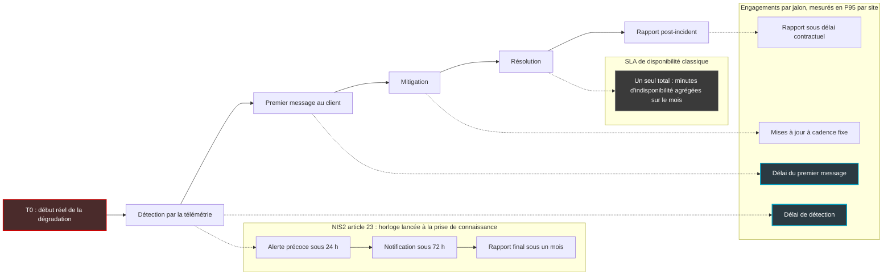

## La confiance qui ne survit pas au pire jour

Neuf décideurs réseau sur dix disent faire confiance à leur opérateur. Moins d'un sur six croit vraiment qu'il saura repérer et éteindre vite une panne grave. Entre ces deux chiffres, il y a toute la distance qui sépare une relation commerciale confortable d'un samedi soir où le Wi-Fi d'un hôtel complet tombe, où les terminaux de paiement d'un réseau de magasins se figent, et où c'est le client qui appelle pour prévenir.

Ces chiffres viennent de *The Trust Illusion*, une étude publiée le 28 septembre 2026 par Arelion, un transitaire IP (l'opérateur de backbone qui achemine le trafic entre les réseaux). L'institut Savanta a interrogé 518 décideurs aux États-Unis, au Royaume-Uni, en Allemagne et en France. Le chiffre qui devrait inquiéter les directions générales n'est pas le 93 %. C'est le 58 % : plus de la moitié des répondants disent avoir retardé, réduit ou encadré des projets stratégiques sur deux ans à cause de leur opérateur.

IA, conformité, migrations cloud : les chantiers de la décennie attendent que le tuyau inspire confiance.

Pourquoi maintenant ? Parce que chaque projet IA ajoute une dépendance réseau de plus, et que les directions ne veulent plus signer à l'aveugle. Ma thèse tient en une phrase. La confiance ne se décrète pas dans un contrat de niveau de service (SLA) à 99,9 % ; elle se prouve en minutes, avec des jalons mesurés et une télémétrie que le client peut voir.

## Ce que l'étude dit, et ce qu'elle tait

Commençons par les faits, avec la prudence qu'ils méritent. Le tableau ci-dessous reprend les chiffres du communiqué d'Arelion, recoupés par Light Reading et HostingJournalist. La troisième colonne compte autant que la deuxième.

| Indicateur | Chiffre | Précaution de lecture |
|---|---|---|
| Confiance large ou totale dans son opérateur | 93 % | Question générale, sans scénario précis |
| Confiance complète dans la détection et la résolution rapide d'une panne grave | 15 % | Pas totalement confiant ne veut pas dire défiant |
| Initiatives stratégiques retardées, réduites ou encadrées à cause de l'opérateur | 58 % | Horizon déclaré de deux ans |
| Projets IA et données touchés | 49 % | Parmi ceux qui ont subi un impact, pas parmi les 518 |
| Sécurité et conformité / transformation digitale / migrations cloud | 44 % / 42 % / 38 % | Même sous-groupe |
| Expansion de marchés / lancements de produits | 30 % / 30 % | Même sous-groupe |
| Opérateur gravement en deçà des attentes plusieurs fois par an ou plus | 42 % | Échelle de réponse non publiée |
| Paieraient plus pour une fiabilité démontrée | 98 % | Préférence déclarée, sans coût réel |
| Surcoût accepté entre +6 % et +20 % | 72 % | Idem |
| Transparence citée comme premier levier de confiance | 38 % | Devant fiabilité et disponibilité |
| L'IA dans la gestion réseau, plus grand défi de confiance à venir | 54 % | Anticipation, pas constat |

Côté méthode, l'essentiel est publié : enquête en ligne menée en 2026, organisations de 2 000 salariés et plus, répondants influents sur la stratégie datacenter, cloud et connectivité, dont 66 % détiennent la validation finale. Ce qui manque est tout aussi parlant. Pas de dates de terrain précises, pas de questionnaire, pas de marge d'erreur, pas de mode de recrutement, pas de libellés exacts. Le rapport complet se télécharge derrière un formulaire que je n'ai pas pu exploiter : tout chiffre absent du communiqué reste, ici, non vérifié.

Dernière réserve, et pas la moindre. L'écart 93 % / 15 % oppose deux questions de nature différente. D'un côté une confiance générale, de l'autre une confiance sur un scénario précis et extrême. Une partie de l'écart tient mécaniquement à la formulation, et c'est précisément le message que le commanditaire voulait faire passer.

> **Encadré : lire l'étude avec les lunettes du vendeur**
>
> - **Le commanditaire vend la solution.** Arelion commercialise du transit IP et revendique la place de premier backbone IP mondial. Un récit où la fiabilité brute ne suffit plus et où la transparence devient décisive sert directement son positionnement premium.
> - **Le relais n'est pas une enquête.** Chez Light Reading, la page est étiquetée #pressrelease, sans signature de journaliste ni contrepoint. La source d'origine reste le communiqué diffusé sur PR Newswire.
> - **Le 98 % est une préférence déclarée.** Dire qu'on paierait plus ne coûte rien au répondant. C'est un signal d'attente, pas une élasticité-prix mesurée.
> - **C'est une série.** Arelion et Savanta publient ce type d'étude régulièrement (532 répondants en janvier 2026, 754 en 2022). Chaque édition a intérêt à trouver son alerte.
> - **Le périmètre n'est pas forcément le vôtre.** Grandes organisations, acheteurs de connectivité WAN, cloud et transit. Le Wi-Fi d'un hôtel ou d'un réseau de magasins est une autre couche, avec des PME et des ETI dans le lot.

Pourquoi en parler quand même ? Parce que le diagnostic recoupe des données indépendantes, on va le voir. Et parce que la formule de Mattias Fridström, Chief Evangelist d'Arelion, est juste : « Trust is no longer a soft metric ». Je signe. Mais une métrique qui cesse d'être molle, encore faut-il la mesurer quelque part, et pas dans une brochure.

*Deux jauges, deux questions : 93 % font confiance à leur opérateur, 15 % seulement ont une confiance complète dans sa gestion d'une panne grave.*

## Le 99,9 % raconte l'année, votre client redoute un samedi soir

Pensez au taux de ponctualité d'une compagnie aérienne. Il peut être excellent sur l'année et ne rien vous dire du soir où vous patientez trois heures devant un écran qui affiche toujours *à l'heure*. Votre jugement sur la compagnie ne se forme pas sur la statistique annuelle. Il se forme sur un moment précis : celui où quelqu'un, au comptoir, vous a enfin dit la vérité. Et sur le temps écoulé depuis que l'équipage la connaissait.

Le SLA de disponibilité, c'est ce taux de ponctualité. Un engagement à 99,9 % mensuel tolère environ 43 minutes d'indisponibilité par mois. Le contrat est respecté que ces 43 minutes soient émiettées en micro-coupures nocturnes ou concentrées sur un samedi 20 h dans un hôtel plein. Il ne dit rien de qui a vu la panne en premier. D'expérience, dans beaucoup de contrats, le compteur ne démarre d'ailleurs qu'à l'ouverture du ticket, souvent par le client lui-même.

Les données indépendantes confirment que le sujet n'a rien de théorique. L'Uptime Institute, dans son analyse annuelle des pannes publiée en mai 2026, attribue environ deux tiers des pannes publiques des neuf dernières années à des fournisseurs tiers : cloud, télécoms, colocation. Les pannes liées à la fibre et à la connectivité ont plus que doublé par rapport à la moyenne 2020-2025.

Elles durent aussi plus longtemps.

Network World, qui a couvert le rapport, indique que le réseau et la connectivité pèsent 23 % des causes de pannes de services IT, première cause devant l'énergie (21 %). En tête des causes de pannes réseau : les changements de configuration, puis les défaillances d'un fournisseur réseau tiers. Chiffre de presse, à recouper avec le rapport payant, mais la tendance est nette.

Autre signal, plus gênant pour les opérateurs qui se taisent. ThousandEyes, qui mesure l'Internet depuis l'extérieur, a compté 531 événements de pannes réseau dans le monde la semaine du 14 au 20 septembre 2026, dont 246 chez des fournisseurs d'accès. Parmi eux, une coupure AT&T de 18 minutes le 16 septembre. Autrement dit, un tiers sait déjà détecter, dater et chiffrer la panne de votre opérateur. Si un observateur extérieur y arrive, l'opérateur lui-même n'a aucune excuse pour ne pas vous prévenir.

C'est d'ailleurs ce que réclament les répondants. Interrogés sur ce qui bâtirait leur confiance, ils placent la transparence (38 %) devant la fiabilité, la disponibilité et la sécurité. Light Reading rapporte aussi un second classement, à choix multiples, où la protection contre les menaces et l'uptime passent devant. Les deux questions ne se comparent pas, et je retiens la première avec prudence. Mais le signal est là. Le client ne demande pas un réseau qui ne tombe jamais. Il demande à savoir.

## Des jalons, pas une moyenne

Si la disponibilité agrégée ne suffit pas, que mettre dans le contrat ? Ma réponse : des jalons horodatés, mesurés en percentiles, sur une chronologie dont le point de départ est défini noir sur blanc.

Tout commence par le T0. C'est le début réel de la dégradation tel que la télémétrie le date, pas l'heure de l'alerte interne, encore moins celle du ticket client. Sans T0 contractuel, chaque minute passée à ne rien voir disparaît des statistiques. Viennent ensuite quatre engagements :

1. **Le délai de détection**, du T0 à la détection, exprimé en P90 ou P95 par site sur douze mois glissants. Le P95, c'est le délai sous lequel tombent 95 % des incidents : il décrit l'opérateur les mauvais jours, pas les jours moyens.
2. **Le délai du premier message client**, avec le périmètre touché et une cause présumée, même provisoire.
3. **Une cadence de mise à jour** fixée au contrat, jusqu'au retour à la normale.
4. **Un rapport post-incident** sous un délai défini : chronologie, cause racine, actions correctives.

Pourquoi des percentiles plutôt que l'indicateur que tout le monde connaît, le MTTR (Mean Time To Repair, temps moyen de résolution) ? Parce que Google l'a démonté dans son document *Incident Metrics in SRE*, du nom de sa discipline d'exploitation fiable des services (Site Reliability Engineering). Par simulation de Monte-Carlo, son auteur, Štěpán Davidovič, montre que les durées d'incident suivent une distribution à longue traîne.

Conséquence : les moyennes de type MTTR ou temps moyen de mitigation sont mal adaptées à la prise de décision comme à l'analyse de tendance. Un seul incident monstre au milieu de trente petits, et la moyenne raconte n'importe quoi. Traduit en langage contractuel, un MTTR moyen dans un SLA est un chiffre que le bruit statistique fait bouger d'un trimestre à l'autre sans que le service ait changé. Des percentiles par jalon, eux, se vérifient, se comparent et se pénalisent.

*Une même panne, trois lectures : le SLA de disponibilité n'en retient qu'un total mensuel, les engagements par jalon mesurent chaque étape, et l'horloge réglementaire démarre à la prise de connaissance de l'incident.*

## Le régulateur a déjà écrit la moitié du contrat

Cette logique de jalons n'est pas une lubie d'ingénieur. Le législateur européen l'a déjà gravée dans les textes, et les clients régulés vont la faire redescendre sur leurs fournisseurs.

La directive NIS2, à son article 23, impose aux entités concernées, en cas d'incident important, une alerte précoce sous 24 heures, une notification sous 72 heures et un rapport final sous un mois. Elle prévoit aussi d'informer sans retard les destinataires des services susceptibles d'être touchés par une cybermenace importante. Trois jalons et une obligation d'information du client : c'est exactement la grammaire que je propose pour les contrats réseau.

Un détail change tout. À ma lecture du texte, l'horloge NIS2 démarre à la prise de connaissance de l'incident, pas à son début réel. Un opérateur qui détecte tard repousse mécaniquement toutes les échéances. Seul un T0 contractuel, adossé à une télémétrie horodatée, referme cette porte.

*Dégradation, détection, notification, rapport : quatre jalons qu'un contrat peut horodater, mesurer et pénaliser.*

DORA (Digital Operational Resilience Act, le règlement européen sur la résilience numérique du secteur financier) va plus loin sur le terrain contractuel. Son article 30 exige, pour les fonctions critiques ou importantes, des descriptions de niveaux de service assorties d'objectifs de performance précis, quantitatifs comme qualitatifs. Pour tous les contrats TIC, il demande aussi que l'assistance en cas d'incident soit gratuite ou prévue à un coût connu à l'avance. Ajoutez l'article 14 du Cyber Resilience Act, applicable depuis le 11 septembre 2026, qui impose aux fabricants une alerte précoce sous 24 heures pour les vulnérabilités activement exploitées et les incidents graves touchant la sécurité de leurs produits : le périmètre est différent, mais le régulateur pense lui aussi en jalons horodatés.

Mon analyse : une banque soumise à DORA ou une entité essentielle au sens de NIS2 ne tiendra pas ses propres délais si son opérateur découvre la panne bien après elle. L'opérateur incapable de dater ses incidents à la minute devient un risque de conformité pour son client. Ce n'est plus un sujet de qualité de service.

C'est un sujet d'achat.

## Le Wi-Fi, bon banc de preuve, avec ses angles morts

Ici je change de casquette et je parle en opérateur d'accès. Ce qui suit est une analyse personnelle et une direction que je défends, pas le descriptif d'une offre.

Rappel du périmètre : l'étude Arelion interroge des acheteurs de WAN (le réseau étendu qui relie les sites), de cloud et de transit dans de grandes organisations. Le Wi-Fi managé d'un hôtel, d'une résidence étudiante ou d'un réseau de magasins est une autre couche, avec d'autres clients, PME et ETI comprises. Je ne transpose donc pas les chiffres. Je transpose la question : qui voit la panne, qui prévient, en combien de temps ?

Sur ce terrain, l'opérateur d'accès part avec un avantage structurel. Un transitaire voit ses routeurs de cœur. Un opérateur Wi-Fi voit chaque borne, chaque SSID (le nom de réseau diffusé), chaque port de switch, et souvent l'expérience réelle des terminaux grâce au DEM (Digital Experience Monitoring, la mesure de l'expérience vécue côté utilisateur). Quand un port lâche au troisième étage, la télémétrie le sait avant que le premier client de l'hôtel ne descende à la réception.

La tuyauterie existe. Le streaming de télémétrie, où l'équipement pousse ses mesures au lieu d'attendre qu'on l'interroge, remplace peu à peu la collecte périodique à l'ancienne. Côté normes, YANG-Push est standardisé à l'IETF et TR-369 est porté par le Broadband Forum pour les équipements d'accès. Les données arrivent en continu, horodatées.

Elles deviennent alors corrélables entre le Wi-Fi, le réseau local et le lien d'accès Internet. C'est cette corrélation qui permet d'écrire, dans le tout premier message au client, *le Wi-Fi fonctionne, c'est le lien d'accès du site qui est coupé*. Une phrase comme celle-là, envoyée dans les premières minutes, vaut plus qu'un épais rapport mensuel.

*Borne par borne, site par site : la même télémétrie pour le centre de supervision et pour le client.*

Ma conviction : un opérateur d'accès devrait pouvoir s'engager, site par site, sur un délai de détection et un délai de premier message exprimés en P95. Il devrait aussi exposer à son client la même télémétrie que celle de son propre centre de supervision, en API ou en flux. C'est exigeant, et ces engagements ne valent que s'ils sont mesurés sur des mois, publiés et opposables. Mais c'est la seule réponse sérieuse au 15 %.

Le 54 % sur l'IA dans la gestion réseau pousse dans le même sens. Plus on confie de décisions à des agents automatisés, plus la télémétrie partagée devient la seule façon de prouver ce qui s'est passé, et qui a décidé quoi.

Reste l'angle mort, et il faut le dire. L'opérateur d'accès ne voit pas l'amont. Si le transitaire tombe, il détecte vite le symptôme mais ne répare pas le backbone d'un autre. Pire, la redondance peut être illusoire. Deux liens *différents* qui passent dans le même fourreau appartiennent au même SRLG (Shared Risk Link Group, un groupe de liens exposés au même risque physique) et tombent ensemble. L'engagement honnête porte donc sur la détection et la notification, pas sur la résolution d'une panne qu'on ne contrôle pas.

## Six questions à poser avant de signer

Pour un DSI ou un directeur des achats, voici la grille que j'utiliserais, quel que soit l'opérateur, y compris le mien.

1. **Quelle est votre définition du T0 ?** Début réel de la dégradation, alerte interne ou ticket client : la réponse en dit long sur la suite.
2. **Quel est votre délai de détection au P95 sur les douze derniers mois ?** Par site ou par type de site, jamais en moyenne globale.
3. **En combien de temps m'envoyez-vous le premier message, et que contient-il ?** Périmètre touché, cause présumée, heure de la prochaine mise à jour.
4. **Puis-je consommer votre télémétrie en API ou en flux ?** Si la réponse est un PDF mensuel, vous avez votre réponse.
5. **Sous combien de jours recevrai-je le rapport post-incident ?** Avec une chronologie horodatée et des actions correctives suivies.
6. **Quels crédits ou pénalités sont liés à la détection et à la notification ?** Et pas seulement à l'indisponibilité.

Un opérateur qui répond vite et précisément à ces six questions a déjà prouvé une partie de ce qu'il vend. Un opérateur qui renvoie vers la plaquette commerciale aussi, dans l'autre sens.

## Verdict : un 99,9 % sans horloge est un chèque sans provision

L'écart entre 93 % et 15 % n'est pas qu'un malaise diffus. C'est une opportunité pour les opérateurs capables de prouver ce qu'ils avancent, et une menace pour ceux qui vivent de la moyenne annuelle.

Quant aux 98 % prêts à payer plus, dont 72 % qui accepteraient entre 6 et 20 % de surcoût, je les lis comme un signal d'attente, pas comme une grille tarifaire. Une préférence déclarée dans un sondage commandé par un vendeur ne remplace pas un contrat signé. Le vrai test viendra quand un acheteur mettra face à face deux offres : l'une avec des jalons en P95 et une télémétrie ouverte, l'autre moins chère avec un simple 99,9 %.

Ma position est nette. Côté acheteur, je ne signerais plus de contrat réseau critique sans horloge de détection écrite noir sur blanc. Côté opérateur, refuser d'exposer sa télémétrie revient à avouer qu'on n'aime pas ce qu'elle montre. Un SLA de disponibilité sans engagement de détection est un chèque de confiance sans provision : il rassure jusqu'au jour où l'on essaie de l'encaisser.

La confiance se mesure désormais en minutes. Et en percentiles.

---

_Vues personnelles, pas position Wifirst._

## Sources

1. Arelion, communiqué sur l'étude *The Trust Illusion* (PR Newswire, 28 septembre 2026) : https://www.prnewswire.com/news-releases/new-report-trust-in-network-providers-is-holding-back-ai-and-digital-transformation-initiatives-302889641.html
2. Arelion, page du rapport Network trust (téléchargement sur formulaire) : https://www.arelion.com/insights/network-trust/
3. Light Reading, relais du communiqué étiqueté #pressrelease (28 septembre 2026) : https://www.lightreading.com/ai-machine-learning/trust-in-network-providers-is-holding-back-ai-and-digital-transformation-initiatives-arelion
4. HostingJournalist, sur l'enquête Arelion (septembre 2026) : https://hostingjournalist.com/news/arelion-survey-finds-network-trust-gap-slowing-enterprise-ai
5. Uptime Institute, Annual Outage Analysis 2026 (13 mai 2026) : https://uptimeinstitute.com/about-ui/press-releases/uptime-announces-annual-outage-analysis-report-2026
6. Network World (Denise Dubie), sur l'analyse Uptime (14 mai 2026) : https://www.networkworld.com/article/4171277/network-outages-power-failures-strain-data-center-resiliency.html
7. Network World, rapport de pannes réseau 2026 et données ThousandEyes (22 septembre 2026) : https://www.networkworld.com/article/4113326/2026-network-outage-report-and-internet-health-check.html
8. Google SRE, *Incident Metrics in SRE* (Štěpán Davidovič) : https://sre.google/resources/practices-and-processes/incident-metrics-in-sre/
9. Directive NIS2, article 23 (directive (UE) 2022/2555) : https://www.nis-2-directive.com/NIS_2_Directive_Article_23.html
10. Règlement DORA, article 30 : https://www.digital-operational-resilience-act.com/Article_30.html
11. Cyber Resilience Act, article 14 : https://www.european-cyber-resilience-act.com/Cyber_Resilience_Act_Article_14.html
