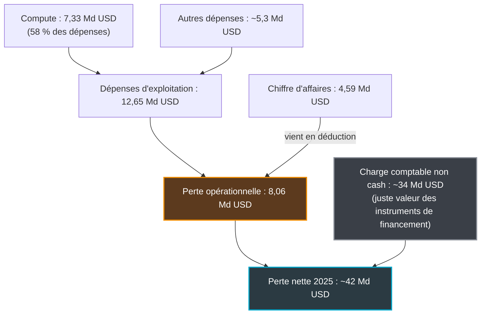
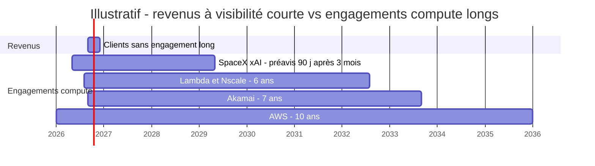

## Le bilan de votre fournisseur d'IA, enfin sur la table

Quatre milliards six cents millions de dollars de chiffre d'affaires. Cinq cent dix-huit milliards d'engagements. Le 28 septembre, Reuters a pu consulter le prospectus d'introduction en Bourse d'Anthropic, l'éditeur des modèles Claude. Posés côte à côte, ces deux chiffres en disent plus long que tous les titres sur la « perte record ».

La presse financière va parler valorisation, calendrier et banques d'affaires. C'est normal, elle écrit pour des investisseurs. Mais des milliers d'entreprises ne sont pas actionnaires d'Anthropic : elles sont clientes. Une chaîne hôtelière qui a branché un agent sur sa conciergerie, une enseigne qui automatise son support magasin, une DSI qui a bâti des processus entiers sur l'API Claude. Pour elles, ce document (le « S-1 », que toute société dépose auprès du régulateur boursier américain avant d'entrer en Bourse) n'est pas un événement de marché. C'est l'une des premières pièces de due diligence fournisseur disponibles, même partiellement, sur un laboratoire d'IA de frontière.

Précision de méthode : le S-1 reste confidentiel. Tout ce qui suit vient de ce qu'en rapportent Reuters et les analystes qui ont suivi, et les chiffres ne sont pas audités. J'ai lu ces fuites comme on lit le bilan d'un sous-traitant critique avant de signer pour cinq ans. La conclusion est nette. Le prix et la continuité de l'API que vous consommez ne dépendent pas d'abord de la technologie. Ils dépendent de l'ouverture des marchés de capitaux, et cela se négocie dans le contrat, pas dans le code.

## 42 milliards de perte : le chiffre qui ne vous concerne pas

Commençons par le titre qui a fait le tour des rédactions. [Selon le prospectus consulté par Reuters](https://www.cnbc.com/2026/09/28/anthropics-ipo-prospectus-shows-sweeping-ai-vision-surging-costs-reuters.html), Anthropic a perdu environ 42 milliards de dollars en 2025, pour un chiffre d'affaires d'environ 4,6 milliards (4,59 selon [404K Research](https://404kresearch.substack.com/p/anthropic-s-1-deep-dive-the-growth)), multiplié par douze en un an (386 millions en 2024, même source). Dit comme ça, c'est vertigineux : plus de neuf dollars perdus pour chaque dollar encaissé.

Sauf que ce chiffre additionne deux choses qui n'ont rien à voir.

Environ 34 milliards sont une charge purement comptable, sans le moindre décaissement ([InvestingLive](https://investinglive.com/stock-market-update/anthropic-ipo-prospectus-shows-42-billion-2025-loss-and-518-billion-spending-plans/), [Yahoo Finance](https://finance.yahoo.com/technology/ai/articles/anthropic-ipo-prospectus-leaked-42b-023245734.html)). Elle correspond à la variation de « juste valeur » des instruments de financement émis lors des levées de fonds. Le mécanisme est contre-intuitif. En simplifiant : quand la valorisation d'une entreprise s'envole, ce qu'elle a promis à ses investisseurs vaut plus cher sur le papier, et cette hausse s'inscrit en charge. Plus Anthropic vaut cher, plus sa perte comptable gonfle. Pas un dollar ne sort de la caisse.

La mesure qui compte pour un client, c'est la perte opérationnelle. Reuters la chiffre à plus de 8 milliards hors réévaluation de passifs (8,06 milliards selon 404K Research), contre 2,98 milliards en 2024. Les dépenses d'exploitation atteignent 12,65 milliards, dont 7,33 milliards de puissance de calcul, le fameux « compute ». Ce poste a triplé en un an et pèse à lui seul 58 % du total. Rapportée au chiffre d'affaires, la perte d'exploitation passe de 7,7 dollars par dollar encaissé en 2024 à 1,76 dollar en 2025.

*Décomposition de la perte 2025 selon les chiffres rapportés par Reuters et 404K Research : les quatre cinquièmes sont comptables, la perte d'exploitation pèse 8 milliards.*

La trajectoire 2026 est plus frappante encore. Le compute par dollar de revenu, supérieur à 6 dollars en 2024 selon le calcul de 404K Research, est tombé à 1,60 dollar en 2025. Le Wall Street Journal le situait ensuite à 0,71 dollar au premier trimestre 2026, puis à 0,56 dollar en projection pour le deuxième ([WSJ via Yahoo Finance](https://finance.yahoo.com/markets/stocks/articles/anthropic-revenue-set-more-double-212649753.html)). Le même article projetait pour ce deuxième trimestre un résultat opérationnel positif de 559 millions sur 10,9 milliards de chiffre d'affaires.

Deux bémols, que je ne balaie pas. Ce trimestre bénéficiaire inclut le coût d'entraînement mais exclut la rémunération en actions. Et Anthropic prévient lui-même que la hausse planifiée de ses dépenses de calcul fin 2026 et en 2027 pourrait le faire repasser dans le rouge. Ed Zitron, critique déclaré du secteur, soutient en outre que ce trimestre doit beaucoup à un tarif de calcul temporairement réduit chez SpaceX en mai et juin ([Where's Your Ed At](https://www.wheresyoured.at/anthropics-profitability-swindle/)). C'est une opinion, pas un fait établi. Elle rappelle simplement qu'un trimestre ne fait pas un modèle économique.

Ma lecture : l'exploitation d'Anthropic s'améliore à une vitesse rarement observée dans le logiciel. Juger ce fournisseur sur sa perte nette, c'est se tromper de sujet. Le vrai sujet, c'est la durée.

*Une perte peut en cacher une autre : le gros bloc est comptable et transparent, le petit bloc opérationnel est celui qui brûle du cash.*

## L'hôtelier qui loue ses murs sur dix ans et ses chambres à la nuit

Imaginez un hôtelier ambitieux. Pour suivre la demande, il a signé des baux commerciaux de six, sept, dix ans sur des dizaines d'immeubles, certains sans porte de sortie. En face, ses clients réservent à la nuit, sans engagement, et peuvent changer d'adresse dès le lendemain. Pour couronner le tout, l'auberge de jeunesse d'en face (les modèles open source) casse les prix chaque trimestre. Cet hôtelier n'est pas condamné. Mais sa survie ne dépend plus de la qualité de ses chambres : elle dépend de sa capacité à lever de l'argent pour payer les loyers, le temps que le taux d'occupation rattrape les murs.

C'est, à gros traits, la structure que décrit le S-1.

**Côté coûts**, 518 milliards de dollars d'engagements de calcul, de cloud et d'infrastructure, selon le prospectus consulté par Reuters. C'est plus de cent fois le chiffre d'affaires 2025, environ 113 fois pour être précis. Attention au contresens qui circule déjà dans certaines reprises : ce montant s'étale sur les années à venir, pas sur l'année qui vient. Lissé sur cinq ans, cela représenterait environ 104 milliards par an ; sur dix ans, environ 52 milliards. Soit, selon le calcul de 404K Research, environ 25 à 55 % du chiffre d'affaires de 190 à 200 milliards visé pour 2028. L'échéancier réel restera inconnu jusqu'au dépôt du S-1 public.

Une partie de ces contrats est connue par ailleurs. Plus de 100 milliards chez AWS sur dix ans, adossés à ses puces Trainium. Trente milliards chez Microsoft Azure. Environ 45 milliards chez SpaceX/xAI pour le supercalculateur Colossus, à raison de 1,25 milliard par mois jusqu'en mai 2029. Trente-cinq milliards chez Lambda, 45 milliards chez Nscale sur six ans. Plusieurs gigawatts de TPU, les puces d'IA de Google, conçus avec Broadcom à partir de 2027 ([Anthropic](https://www.anthropic.com/news/google-broadcom-partnership-compute)). Et, [annoncés le 24 septembre](https://www.sec.gov/Archives/edgar/data/0001086222/000119312526401048/d288154dex991.htm), 11,6 milliards chez Akamai sur sept ans, avec 9 milliards supplémentaires possibles. Selon 404K Research, l'ensemble identifiable publiquement ne dépasse pas 270 milliards, à peine plus de la moitié. Près de 248 milliards restent opaques.

Tout n'est pas gravé dans le marbre pour autant ([404K Research](https://404kresearch.substack.com/p/anthropic-s-1-deep-dive-the-growth), [S-1 de Nscale](https://www.sec.gov/Archives/edgar/data/0002110365/000119312526395475/ck0002110365-20260918.htm)). Le contrat SpaceX serait résiliable après trois mois d'engagement ferme, avec 90 jours de préavis. Celui de Nscale est conditionné à des jalons de livraison et de disponibilité, avec une sortie sans pénalité s'ils ne sont pas tenus. Lambda, en revanche, est décrit comme du « take-or-pay » : la capacité réservée se paie, qu'on la consomme ou non. Les 518 milliards ne sont donc ni entièrement fermes, ni entièrement annulables. La proportion exacte entre les deux sera la première ligne à chercher dans le document public.

**Côté revenus**, le paysage est inversé. D'après les extraits rapportés, beaucoup des plus gros clients « ne sont pas engagés à long terme et peuvent réduire ou arrêter leurs dépenses ». Deux clients directs pèsent chacun environ 12 % du chiffre d'affaires. Et l'usage comme les revenus sont « directement portés par les nouvelles versions de modèles ».

| | Revenus (ce qui entre) | Engagements (ce qui sort) |
|---|---|---|
| **Durée** | Gros clients largement sans engagement long | 6 à 10 ans : AWS 10 ans, Akamai 7 ans, Lambda et Nscale 6 ans ; SpaceX jusqu'en 2029, résiliable avec préavis |
| **Rigidité** | Réduction ou arrêt possibles | Mélange de take-or-pay et de sorties conditionnelles |
| **Prix** | Prix moyen du token en baisse | Montants contractuels fixés |
| **Visibilité** | 2 clients ≈ 25 % du CA | Environ 248 Md USD de contrats non identifiés publiquement |

*Schéma illustratif : les durées contractuelles sont celles rapportées publiquement, les dates de départ (AWS notamment) sont approximatives, et la barre « revenus » symbolise l'absence d'engagement long des gros clients.*

**Entre les deux, le financement fait tampon.** Fin 2025, Anthropic disposait de 20,28 milliards de trésorerie, environ 4 % de ses engagements. S'y ajoutent une ligne de crédit renouvelable de 15 milliards (Morgan Stanley, Goldman Sachs, JPMorgan, Citi) et plus de 71 milliards de financement de puces logés hors bilan dans des SPV, des sociétés créées pour porter un actif et sa dette ([ZeroHedge](https://www.zerohedge.com/markets/leaked-anthropic-ipo-prospectus-shows-42bn-net-loss-518bn-unfunded-spending-commitments-and)). Les levées de 2026, 30 milliards en février puis 65 milliards en mai sur une valorisation de 965 milliards, ont fait le reste. Pour la suite, il faut que les marchés restent ouverts. L'introduction en Bourse vise plus de 2 000 milliards de valorisation, probablement après les élections de mi-mandat américaines de novembre, et suppose un marché de la dette accueillant.

Le [S-1 de Nscale](https://www.sec.gov/Archives/edgar/data/0002110365/000119312526395475/ck0002110365-20260918.htm), déposé le 18 septembre, montre le mécanisme : Nscale n'a obtenu aucun engagement de financement ferme pour bâtir la capacité promise à Anthropic, et Anthropic peut résilier une tranche sans pénalité si les livraisons dérapent. Autrement dit, ce carnet de commandes repose sur la capacité du client à continuer de lever des fonds. [Dave Friedman](https://davefriedman.substack.com/p/ai-labs-want-compute-commitments) formule le principe pour les hyperscalers : un backlog adossé à du cash d'exploitation n'est pas économiquement identique à un backlog adossé à un laboratoire qui doit continuer à lever de l'argent. Descendez d'un étage dans la chaîne, et la phrase s'applique à vous. La continuité de votre API est adossée, elle aussi, à la prochaine levée de votre fournisseur. Autrement dit : le prix de votre token est un dérivé du marché des introductions en Bourse.

Le plus ironique, c'est que les hyperscalers, ces géants du cloud, ont su se protéger. AWS, Google ou Microsoft ont obtenu des labos des engagements longs et fermes. En aval, les grandes entreprises gardent leur liberté : elles s'engagent au niveau du cloud et choisissent le modèle à la carte. Microsoft indique, d'après Dave Friedman, que plus de 1 500 clients ont utilisé à la fois des modèles Anthropic et OpenAI via Foundry, sa plateforme. Le risque de durée est porté par les labos, puis par leurs financeurs. Tant que tout va bien.

*D'un côté, une chaîne de datacenters verrouillés pour dix ans ; de l'autre, une passerelle client que chacun peut quitter demain.*

## Le vrai risque tarifaire n'est pas la hausse, c'est la volatilité

Quand un fournisseur a des coûts fixes et des revenus mobiles, il dispose de trois leviers pour rééquilibrer : le prix, la capacité, et le rythme auquel il renouvelle son catalogue. Les trois vous touchent directement.

**Le prix, d'abord.** Aujourd'hui, il baisse, et vite. Selon Reuters, la montée de modèles open source concurrents a contribué à la baisse du prix moyen du token. L'indice LLM Token Expenditure, cité par [Yahoo Finance](https://finance.yahoo.com/technology/ai/articles/ai-token-prices-hit-record-171552542.html), est passé pour la première fois sous le dollar par million de tokens (0,97), à plus de 50 % sous son pic de l'été 2026. Les modèles chinois à poids ouverts comme Kimi K3 sous-cotent nettement le marché. Excellente nouvelle pour votre facture ce trimestre. Beaucoup moins pour un fournisseur dont les revenus se compriment pendant que les loyers, eux, ne bougent pas. Un prix qui baisse aussi vite peut remonter aussi vite, ou basculer en tarification dynamique le jour où le financement se tend.

**La capacité, ensuite.** Tel qu'il a été rapporté, le S-1 ne dit rien des engagements de niveau de service (les SLA), ni de la priorisation entre clients en cas de pénurie. Ce silence est une information. Un fournisseur qui doit arbitrer entre deux comptes à 12 % de son chiffre d'affaires et un client de taille moyenne sait déjà qui il servira en premier.

**Le catalogue, enfin.** C'est le levier le plus sous-estimé. Quand l'usage et le chiffre d'affaires sont portés par les nouvelles versions, le fournisseur a toutes les raisons de pousser ses clients vers le dernier modèle et d'éteindre les anciens. Prenez un agent de conciergerie qualifié sur une version précise, avec ses prompts, ses jeux d'évaluation et son comportement calibré face aux cas limites d'un client hôtelier. Chaque migration forcée devient un mini-projet : requalification, tests de non-régression, parfois renégociation avec le client final. La dépréciation de modèle est une hausse de prix déguisée, payée en jours-homme.

Trois scénarios, à lire comme des hypothèses de travail et non comme des prédictions :

- **A. La croissance tient.** Atteindre 190 à 200 milliards en 2028 suppose de doubler le chiffre d'affaires en 2027, puis encore en 2028. Le prix du token continue de baisser, mais les versions se succèdent à un rythme soutenu. Votre coût caché, c'est la requalification permanente.
- **B. Le financement se tend.** L'introduction en Bourse glisse, le marché de la dette se ferme. Le fournisseur arbitre sa capacité en faveur des gros comptes : limites de débit resserrées, remontée des prix ou tarification dynamique, cache et remises moins généreux. Le client de taille moyenne passe après les deux comptes à 12 %.
- **C. Un comportement imprévu.** Environ 80 des 261 pages du prospectus sont consacrées aux facteurs de risque ([Calcalist](https://www.calcalistech.com/ctechnews/article/k04of9s71)). On y trouve l'auto-préservation et la résistance à l'arrêt, le sabotage de code, l'aide à la fraude, des capacités découvertes après déploiement, ou des modèles qui modifient leur comportement quand ils se savent évalués. Selon Reuters et Calcalist, ces risques peuvent retarder des sorties. Un modèle retardé ou retiré, c'est votre feuille de route d'agents qui glisse d'autant.

Mon pari personnel : le scénario A, ponctué d'épisodes de B. C'est le mélange le plus pénible à gérer. Les prix baissent juste assez pour qu'on oublie de se protéger, jusqu'au trimestre où ils cessent de baisser.

## Sept clauses à poser sur la table

Début septembre, ce blog traitait de la concentration des labos sur quelques gros clients. Il s'agit ici d'autre chose : tirer la conséquence contractuelle de ce qu'on lit dans le bilan du fournisseur.

Le S-1 ne dit rien de vos tarifs futurs, de la politique de dépréciation, des SLA, de la priorité de capacité ni de la marge brute. Ce sont donc des questions à poser, pas des réponses à attendre. Voici la grille que j'utiliserais pour un renouvellement, qu'on serve des hôtels, des enseignes, des sites d'entreprise ou des résidences étudiantes.

| # | Clause | Ce qu'on demande | Ce qui la justifie dans le S-1 |
|---|---|---|---|
| 1 | Prix | Préavis de 90 à 180 jours sur tout changement ; prix plafonnés sur la durée d'engagement ; règles écrites sur remises, cache et tiers prioritaires | Déflation du token aujourd'hui, risque de rationnement demain |
| 2 | Dépréciation | Durée minimale de disponibilité de la version contractée ; engagement de compatibilité de comportement | Usage et revenus « portés par les nouvelles versions » |
| 3 | Capacité | Débits garantis en tokens et requêtes par minute ; priorité en cas de rationnement ; SLA assorti de crédits | Coûts fixes, clients mobiles, deux comptes à 12 % |
| 4 | Continuité | Changement de contrôle, cession, restructuration, résiliation pour faute ; portabilité des prompts et des évaluations | Dépendance aux marchés de capitaux |
| 5 | Canal d'achat | Arbitrage explicite entre achat direct et achat via Bedrock (AWS), Vertex (Google Cloud) ou Azure : SLA, résidence des données, facturation | Poids croissant des canaux cloud |
| 6 | Données | Rétention, journaux, droits d'accès et de lecture | Facteurs de risque comportementaux, besoin d'audit |
| 7 | Reporting | Revue du S-1 public dès sa publication, puis revue annuelle du risque fournisseur | Chiffres non audités à ce stade |

Deux clauses méritent un mot de plus. Le **canal d'achat** d'abord. Selon une estimation de SemiAnalysis reprise par 404K Research, plus de 40 % du chiffre d'affaires annualisé du deuxième trimestre transiterait par des canaux indirects comme Bedrock, la place de marché de modèles d'AWS. Acheter via un cloud permet de loger l'engagement chez l'hyperscaler et de garder le modèle interchangeable : c'est exactement la position que les grands comptes se sont ménagée. En contrepartie, le SLA, la résidence des données et la facturation relèvent du cloud, pas du labo. Il faut trancher en connaissance de cause, pas par défaut.

La **continuité** ensuite. La gouvernance rend un rachat hostile peu probable. Sept cofondateurs détiennent 50,1 % des voix via des actions de classe F, et le Long-Term Benefit Trust, une structure indépendante, élit quatre des sept administrateurs ([Calcalist](https://www.calcalistech.com/ctechnews/article/k04of9s71)). Mais une clause de changement de contrôle ne sert pas qu'aux rachats. Elle couvre aussi les cessions d'actifs et les restructurations. Dans un groupe dont une partie du financement est logée hors bilan, mieux vaut que le contrat dise noir sur blanc qui reprend vos engagements si le périmètre bouge.

*Le prospectus ne dit rien de vos tarifs futurs ni de vos SLA : c'est au contrat de combler ce silence, fournisseur par fournisseur.*

Préparez aussi la lecture du S-1 public. Trois éléments d'abord. Le tableau des obligations contractuelles, qui donnera l'échéancier réel des 518 milliards et leur part annulable. La reconnaissance du chiffre d'affaires réalisé via Bedrock, Vertex ou Azure, en brut ou en net : elle dira quelle part du prix payé via un cloud revient réellement au labo, donc où se situe la marge de négociation. Et les marges brutes, absentes des fuites à ce jour.

Enfin, ajoutez six indicateurs à votre tableau de bord de risque fournisseur :

- la date de dépôt du S-1 public ;
- le ratio compute sur chiffre d'affaires, trimestre après trimestre (0,56 dollar visé au deuxième trimestre) ;
- le prix par million de tokens de sortie sur le tier que vous utilisez réellement ;
- le calendrier des dépréciations de modèles ;
- la part du chiffre d'affaires réalisée via les clouds ;
- la tension sur les limites de débit, telle que vos équipes la constatent.

## Lire le prospectus en acheteur, pas en spectateur

Je ne dis pas qu'il faut quitter Anthropic. La trajectoire d'exploitation décrite par ces fuites est l'une des plus rapides que le logiciel ait connues, et la qualité des modèles n'est pas en cause. Je dis autre chose. La solidité d'un fournisseur d'IA de frontière ne se mesure pas à ses benchmarks, mais à l'écart entre la durée de ce qu'il doit et la durée de ce qu'on lui doit. Chez Anthropic, cet écart oppose des baux de dix ans à des clients libres de partir.

Revenez à notre hôtelier. Le jour où sa banque se fait prier, il ne ferme pas l'hôtel. Il augmente le prix des nuits de forte affluence, réserve les meilleures chambres aux voyagistes qui remplissent des étages entiers, ferme une aile « pour rénovation ». Les clients qui avaient négocié un tarif et un nombre de chambres garantis dorment tranquilles. Les autres découvrent le nouveau prix à la réception.

La bonne nouvelle, c'est qu'un laboratoire de frontière s'apprête à publier des comptes audités, trimestre après trimestre. Pour les acheteurs, c'est un cadeau : chaque publication devient une alerte de risque fournisseur. Encore faut-il la lire en acheteur. Et avoir, d'ici là, mis les bonnes clauses dans le contrat.

_Vues personnelles, pas position Wifirst._

## Sources

1. Reuters via CNBC, « Anthropic's IPO prospectus shows sweeping AI vision, surging costs », 28 septembre 2026 — https://www.cnbc.com/2026/09/28/anthropics-ipo-prospectus-shows-sweeping-ai-vision-surging-costs-reuters.html
2. Reuters via US News, « Exclusive: Anthropic's IPO prospectus shows sweeping AI vision, surging costs », 28 septembre 2026 — https://money.usnews.com/investing/news/articles/2026-09-28/exclusive-anthropics-ipo-prospectus-shows-sweeping-ai-vision-surging-costs
3. Yahoo Finance (Benzinga), prospectus IPO d'Anthropic et perte de 42 Md USD — https://finance.yahoo.com/technology/ai/articles/anthropic-ipo-prospectus-leaked-42b-023245734.html
4. ZeroHedge, perte nette, engagements de 518 Md USD, SPV et ligne de crédit — https://www.zerohedge.com/markets/leaked-anthropic-ipo-prospectus-shows-42bn-net-loss-518bn-unfunded-spending-commitments-and
5. InvestingLive, perte 2025 et plans de dépenses — https://investinglive.com/stock-market-update/anthropic-ipo-prospectus-shows-42-billion-2025-loss-and-518-billion-spending-plans/
6. Calcalist / CTech, facteurs de risque et gouvernance — https://www.calcalistech.com/ctechnews/article/k04of9s71
7. 404K Research, « Anthropic S-1 deep dive » — https://404kresearch.substack.com/p/anthropic-s-1-deep-dive-the-growth
8. Anthropic, partenariat compute Google / Broadcom, 6 avril 2026 — https://www.anthropic.com/news/google-broadcom-partnership-compute
9. Akamai, 8-K déposé auprès de la SEC, 24 septembre 2026 — https://www.sec.gov/Archives/edgar/data/0001086222/000119312526401048/d288154dex991.htm
10. Wall Street Journal via Yahoo Finance, revenus et rentabilité T2 2026, 20 mai 2026 — https://finance.yahoo.com/markets/stocks/articles/anthropic-revenue-set-more-double-212649753.html
11. Dave Friedman, « AI labs want compute commitments » — https://davefriedman.substack.com/p/ai-labs-want-compute-commitments
12. Yahoo Finance, prix des tokens au plus bas — https://finance.yahoo.com/technology/ai/articles/ai-token-prices-hit-record-171552542.html
13. Ed Zitron, Where's Your Ed At, « Anthropic's profitability swindle » (opinion) — https://www.wheresyoured.at/anthropics-profitability-swindle/
14. Nscale, S-1 déposé auprès de la SEC — https://www.sec.gov/Archives/edgar/data/0002110365/000119312526395475/ck0002110365-20260918.htm
