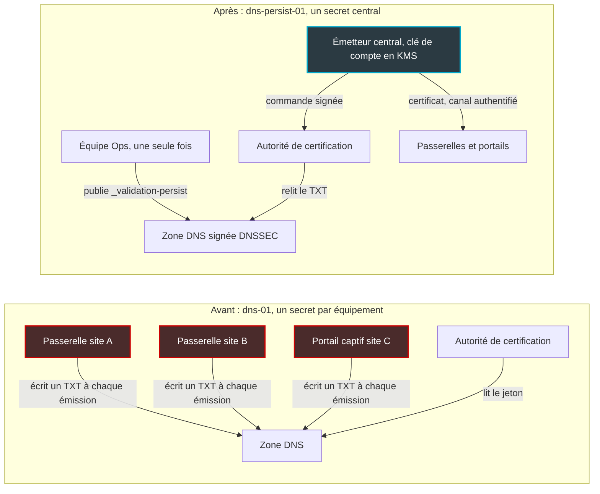
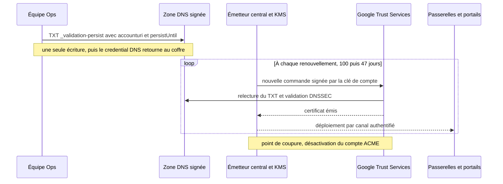

## Le cadenas a une date de péremption

Le petit cadenas de la barre d'adresse a une date de péremption, et elle se rapproche à vue d'œil. Jusqu'en mars dernier, un certificat de site web pouvait vivre 398 jours. Il est plafonné à 200 jours aujourd'hui. Ce sera 100 jours en mars 2027, puis 47 jours en mars 2029.

Pour une enseigne de 800 magasins, un groupe hôtelier ou un réseau de résidences étudiantes, ce n'est pas un détail de sysadmin. Chaque portail captif, chaque passerelle, chaque console d'administration exposée porte son certificat. Multipliez par le nombre de sites, puis par la cadence de renouvellement : ce qui était une opération annuelle devient un flux industriel permanent. Et un renouvellement raté ne passe pas inaperçu. Il se voit : un client bloqué devant un avertissement de sécurité au moment précis où il essaie de se connecter au Wi-Fi.

Le 28 septembre, Google Trust Services, l'autorité de certification de Google, a annoncé le support d'une nouvelle méthode de validation baptisée dns-persist-01. L'idée : publier dans le DNS une autorisation durable, plutôt que de le modifier à chaque renouvellement. Et donc, surtout, cesser de distribuer sur toute la flotte le mot de passe qui permet de réécrire ce DNS.

C'est un vrai progrès. Mais les petites lignes comptent : le secret critique ne disparaît pas. Il change de coffre.

## Deux horloges qui s'accélèrent en même temps

Le calendrier vient du CA/B Forum, l'instance où autorités de certification et éditeurs de navigateurs écrivent ensemble les règles du jeu. Ces règles portent un nom un peu austère : les Baseline Requirements, ou BR. Le ballot SC-081v3, adopté le 11 avril 2025, y a programmé une décrue en trois marches [7]. Ce qu'on oublie souvent, c'est qu'il fait tourner deux horloges à la fois : la durée de vie du certificat, et la durée pendant laquelle une autorité peut réutiliser une preuve de contrôle du domaine sans la redemander [5].

| Certificats émis | Durée de vie max | Réutilisation de la validation de domaine |
|---|---|---|
| Avant le 15 mars 2026 | 398 jours | 398 jours |
| Du 15 mars 2026 au 15 mars 2027 | 200 jours | 200 jours |
| Du 15 mars 2027 au 15 mars 2029 | 100 jours | 100 jours |
| À partir du 15 mars 2029 | 47 jours | 10 jours |

Nous vivons déjà dans la deuxième ligne. La troisième arrive dans moins de six mois. La dernière colonne est la règle générale. Pour la méthode dns-persist-01, les BR fixent déjà une réutilisation maximale de 10 jours (§3.2.2.4.22), on y reviendra.

Faisons un calcul de coin de table pour une flotte hypothétique de 5 000 noms de domaine. En renouvelant chaque certificat au dernier jour, ce qui constitue une borne basse, on passe d'environ 4 600 émissions par an à 9 100 aujourd'hui, 18 250 en 2027 et 38 800 en 2029. En pratique, on renouvelle avec de la marge : multipliez ces chiffres par 1,5 environ. Huit fois plus d'émissions en trois ans, pour exactement le même parc.

Let's Encrypt, qui suit son propre calendrier, va plus vite encore. Profil à 45 jours en option depuis le 13 mai 2026, 64 jours par défaut le 10 février 2027, puis en février 2028 des certificats de 45 jours avec une réutilisation d'autorisation ramenée à sept heures [9]. Sept heures. Autant dire qu'avec la méthode actuelle, chaque émission ou presque imposera une écriture fraîche dans le DNS.

Car aujourd'hui, pour automatiser à grande échelle, tout le monde s'appuie sur ACME (Automatic Certificate Management Environment), le protocole standard popularisé par Let's Encrypt, et sur son challenge dns-01. Le principe : l'autorité vous donne un jeton, vous l'écrivez dans un enregistrement TXT de votre zone DNS, elle le lit, vous l'effacez. C'est universel, compatible avec les certificats wildcard, et indépendant de l'exposition web de la machine.

Le problème est ailleurs. Chaque système qui renouvelle doit détenir un droit d'écriture sur la zone DNS. Sur une flotte, ce credential est copié des centaines ou des milliers de fois, souvent en clair dans un script de renouvellement. Il est pénible à faire tourner. Et son rayon d'explosion, c'est typiquement la zone entière. Ajoutez les délais de propagation DNS qui font échouer des validations au pire moment, et vous avez le tableau complet d'une fragilité qui grossit à chaque marche du calendrier.

## Le mot sur la porte et le registre de l'accueil

Prenons une image. Avec dns-01, pour entrer dans l'immeuble, vous devez à chaque visite scotcher sur la porte le code que le vigile vient de vous donner. Il vérifie, vous laisse passer, vous décollez le papier. Tous ceux qui doivent entrer, et sur une flotte ils sont des milliers, possèdent donc la clé de la vitrine d'affichage. Celle qui permet d'afficher n'importe quoi d'autre, aussi.

Avec dns-persist-01, on écrit une seule fois dans le registre de l'accueil : « le porteur du badge n° 12345678 est autorisé à entrer, jusqu'à telle date ». À chaque visite, le vigile relit le registre et contrôle le badge. Personne ne touche plus à la vitrine. Mais le badge, lui, devient l'objet qui compte.

Concrètement, on publie un enregistrement TXT sur le label `_validation-persist` du domaine. Google Trust Services (GTS) donne cet exemple, avec un TTL standard recommandé de 3600 secondes [1] :

```text
_validation-persist.example.com.  3600  IN  TXT  "pki.goog; accounturi=https://pki.goog/acct/12345678; policy=wildcard"
```

Le premier champ désigne l'autorité autorisée : `pki.goog` pour GTS. Le second, `accounturi`, désigne le compte ACME précis qui a le droit d'émettre. C'est le numéro du badge. Plusieurs autorités peuvent cohabiter sur le même label (un enregistrement par CA). On peut y voir un moyen de préparer une autorité de secours, mais chaque CA ajoutée élargit aussi la surface d'émission.

Viennent ensuite deux paramètres optionnels. `policy=wildcard` étend l'autorisation aux certificats wildcard et aux sous-domaines ; sans lui, seul le nom exact est couvert. `persistUntil`, un horodatage UNIX, fixe la date au-delà de laquelle l'autorisation ne vaut plus [3].

Le cadre réglementaire existe depuis un an. Le ballot SC-088v3, proposé par Michael Slaughter d'Amazon Trust Services et soutenu par Google Chrome, DigiCert et Sectigo, a été adopté le 9 octobre 2025 sans une seule voix contre : 26 émetteurs et 3 consommateurs de certificats (Cisco, Google, Mozilla) ont voté pour [6]. Il inscrit la méthode dans les BR sous le nom « DNS TXT Record with Persistent Value », section 3.2.2.4.22 [5].

Let's Encrypt résume les trois douleurs que la méthode élimine : les délais de propagation, la mise à jour DNS à chaque renouvellement, et la distribution des credentials DNS dans l'infrastructure [4]. Il cite nommément les cas où dns-01 devient impraticable : l'IoT, les plateformes multi-tenant, les opérations par lots. Autrement dit, le profil exact d'une flotte de passerelles et de portails captifs.




*Avant : un credential DNS sur chaque équipement. Après : une seule clé, dans un seul coffre.*

## Le secret ne disparaît pas, il change de coffre

Déroulons un scénario. Un attaquant met la main sur la clé de compte ACME. Il n'a besoin d'aucun accès à votre DNS, d'aucun mot de passe chez votre registrar. Il passe commande. L'autorité lit l'enregistrement que vous avez vous-même publié, constate que le compte correspond, et émet. Pour chaque domaine que ce compte est autorisé à couvrir.

Ce n'est pas un procès d'intention. La spécification, encore à l'état de brouillon à l'IETF (un Internet-Draft, aujourd'hui en version -02), l'écrit sans détour : une clé de compte compromise permet d'utiliser immédiatement toutes les autorisations dns-persist-01 existantes de ce compte, sans le moindre accès à l'infrastructure DNS [3]. Let's Encrypt le formule autrement : la préoccupation centrale passe des credentials DNS distribués à la protection de la clé de compte ACME [4]. L'inverse reste vrai. Une zone DNS compromise permet d'obtenir des certificats tant que les enregistrements n'ont pas été retirés.

Premier contresens à éviter : l'enregistrement persistant n'est pas un sésame perpétuel. Les BR imposent aux autorités de considérer dix jours comme durée maximale de réutilisation des données de validation pour cette méthode [5]. Passé ce délai, l'autorité relit le DNS avant d'émettre. Le TTL de l'enregistrement, lui, ne gouverne que le cache DNS : ce n'est pas une durée de validité. Et `persistUntil` plafonne l'autorisation, puisque la CA n'a plus le droit de s'appuyer dessus après la date indiquée [3]. Retirer l'enregistrement coupe donc le robinet dans un délai borné. Certains vulgarisateurs laissent entendre qu'on valide un domaine une bonne fois et qu'on n'en parle plus. C'est trompeur.

Alors, bon échange ou pas ? Oui, sans hésiter. À une condition.

Un credential DNS copié sur deux mille boîtiers est un secret indéfendable : impossible à auditer, pénible à faire tourner, et un seul équipement compromis suffit à exposer la zone. Surtout, il donne un pouvoir bien plus large que l'émission de certificats, puisqu'il permet de réécrire des enregistrements. Une clé de compte ACME ne sait faire qu'une chose : commander des certificats pour les domaines explicitement autorisés. Rangée dans un module matériel et utilisée par un seul service, c'est un secret défendable. On échange un pouvoir diffus contre un pouvoir concentré, mais plus étroit.

La condition, c'est la centralisation. Le pire scénario serait d'installer un client ACME sur chaque passerelle avec la même clé de compte, par facilité. On se retrouverait avec des milliers de copies d'un passe-partout capable d'émettre pour toute la flotte, sans qu'aucune écriture DNS ne trahisse son usage. Ce serait pire qu'avant.

## Un coffre, pas un trousseau

Voici l'architecture que je défendrais pour une flotte de passerelles et de portails captifs. C'est une recommandation d'architecte, à confronter à la réalité de chaque parc, pas la description d'un déploiement existant.

Le cœur du dispositif est un émetteur central, qu'il s'appelle cert-manager, Vault ou service maison. Lui seul détient la clé de compte ACME, stockée dans un KMS (service de gestion de clés) ou un HSM (module matériel de sécurité) qui signe sans jamais laisser sortir la clé. Les passerelles et portails reçoivent leur certificat par un canal authentifié. Ils ne détiennent ni credential DNS, ni clé ACME.

Le droit d'écriture DNS ne sert plus qu'à l'installation ou à la modification des enregistrements. Un accès temporaire, ou mieux, un workflow d'approbation à deux personnes. Il sort du quotidien, et c'est exactement ce qu'on veut.



**Découper le rayon d'explosion.** Un enregistrement lie un triplet : domaine, autorité, compte. Rien n'oblige à n'avoir qu'un seul compte. Un compte par environnement, par périmètre client ou par groupe de sites, et la compromission de l'un n'ouvre pas les autres.

Chez GTS, cette granularité se pilote côté Google Cloud. L'External Account Binding (EAB, qui rattache le compte ACME à un compte client existant) y est obligatoire. Chaque secret EAB n'est valable que sept jours et ne crée qu'un seul compte ACME, et les comptes liés à un projet supprimé sont invalidés [19]. Un compte, un projet : c'est votre unité de cloisonnement. C'est aussi votre bouton d'arrêt d'urgence, puisque désactiver le compte coupe l'émission pour tous ses domaines. D'où l'intérêt de ne pas tout mettre dans le même panier.

**Poser les garde-fous.** Cinq, non négociables à mes yeux :

- **`persistUntil` systématique.** Une autorisation qui expire d'elle-même, c'est une rotation programmée. Revers de la médaille : si personne ne surveille l'échéance, les renouvellements échouent en silence le jour J. Alertez bien avant.
- **Pas de `policy=wildcard` par défaut.** Ce paramètre étend l'autorisation au domaine, à ses wildcards et à tous ses sous-domaines, et le draft pointe lui-même le risque de prise de contrôle de sous-domaine. Notez aussi qu'il s'agit d'une extension du draft IETF : la chaîne n'apparaît pas dans le texte des BR, qui demandent d'ignorer les paramètres inconnus. Sa sémantique dépend donc de l'implémentation de chaque autorité.
- **Un DNSSEC sain.** Depuis le 15 mars 2026, les autorités doivent valider DNSSEC (les signatures cryptographiques des réponses DNS) sur toutes les requêtes de validation, sans pouvoir le désactiver [5]. Une zone mal signée, et la validation échoue.
- **Les journaux Certificate Transparency sous surveillance.** Ces registres publics inscrivent chaque certificat émis. C'est là qu'une émission frauduleuse avec une clé volée deviendra visible, puisqu'elle ne laissera aucune trace dans votre DNS.
- **Un enregistrement CAA avec `accounturi`** (RFC 8657), en complément. Il restreint l'émission à une autorité et à un compte donnés. Vérifiez que votre CA l'honore.


*Une autorisation persistante, mais bornée : date d'expiration, relecture du DNS, signature DNSSEC.*

**Tourner la page du CNAME délégué.** Beaucoup de plateformes multi-tenant, portails captifs compris, délèguent aujourd'hui leur `_acme-challenge` par un CNAME vers une zone tierce, façon acme-dns. Les BR 2.3.0 envoient un signal clair : une autorité, ou son affilié, qui opère ce type de zone de délégation devrait s'en abstenir et orienter les demandeurs vers la méthode persistante (§3.2.2.4.7) [5]. Ce n'est pas encore une interdiction. C'est une direction.

## Piloter, oui. Épouser le draft -01, non.

Tout cela serait simple si la norme était figée. Elle ne l'est pas. dns-persist-01 reste un Internet-Draft, pas une RFC. La version -02, publiée le 20 septembre 2026 par Shiloh Heurich (Fastly), Henry Birge-Lee (Crosslayer Labs) et Michael Slaughter (Amazon Trust Services), expire le 24 mars 2027 [3]. Or GTS implémente la -01. Son annonce le reconnaît d'ailleurs : la spécification n'est pas finalisée, et les premiers adoptants devront peut-être mettre à jour leurs enregistrements [1].

Le changement qui fâche porte sur l'`accounturi`. Dans la -01, c'est une URL de compte en clair. Dans la -02, c'est exclusivement une empreinte : un hash SHA-256 calculé côté client sur la longueur du nom de domaine, le nom lui-même, l'empreinte de la clé du compte (JWK Thumbprint) et l'URL du compte [3].

La raison est saine. Avec une URL en clair, n'importe qui peut lire votre DNS et relier entre eux tous les domaines rattachés au même compte : une cartographie des domaines de votre flotte offerte gratuitement (le -02 prévoit toutefois une option pour renoncer volontairement à cette protection). Conséquence pratique : un pilote lancé aujourd'hui devra réécrire ses enregistrements. Raison de plus pour les faire générer par l'émetteur central, jamais à la main.

L'écosystème, lui, avance en ordre dispersé. Let's Encrypt, qui a présenté la méthode dès février, n'a pas de dns-persist-01 en production à la dernière trace vérifiée [4][10][12]. L'objectif affiché était le deuxième trimestre 2026, puis « peut-être le troisième ». Le 25 juin, le déploiement a été bloqué tant que l'issue #64 du draft (« l'enregistrement devrait inclure une information calculée par le client ») n'était pas résolue. C'est elle qui a débouché sur le hash de la -02. Un fil du 26 septembre ne contient toujours aucune annonce de mise en service.

Côté clients ACME, à revérifier au moment où vous lisez ces lignes. Certbot ne supportait pas la méthode en juin 2026, une pull request (#10633) étant en discussion [11]. acme.sh l'implémente, dans sa version -01 avec URL en clair [17]. L'issue cert-manager #8373 est ouverte, sans implémentation confirmée [18].

Il existe aussi une voie intermédiaire. GTS a annoncé en juillet le support de dns-account-01, qui place un hash de l'URL de compte dans le label DNS (`_acme-challenge_<hash>.example.com`) pour éviter les collisions entre clients [2]. On reste sur un challenge par émission, donc sur une écriture DNS à chaque fois. Mais la méthode repose sur un ballot adopté à l'unanimité, SC084, en janvier 2025 [20]. C'est utile pour séparer proprement plusieurs clients ACME sans encore accepter une autorisation persistante.


*Plus les certificats raccourcissent, plus la clé qui les commande prend de la valeur.*

## Ma position : traiter la clé comme un actif, pas comme un fichier

L'ère du mot de passe DNS recopié sur toute la flotte touche à sa fin, et je ne la regretterai pas. dns-persist-01 règle un vrai problème d'exploitation, et il arrive au bon moment : juste avant que le passage à 100 jours, puis à 47, ne transforme chaque écriture DNS en point de fragilité.

Mais la méthode convertit un problème d'exploitation en problème de gouvernance de clé. Les équipes qui la traiteront comme « un TXT de plus » fabriqueront un passe-partout. Celles qui la traiteront comme un projet PKI (infrastructure à clé publique) en sortiront avec une chaîne plus solide qu'avant : clé en coffre, comptes découpés, `persistUntil` partout, journaux de transparence sous surveillance.

Ma recommandation tient en trois temps. Piloter dès maintenant avec GTS, sur un périmètre restreint et non critique, pour roder l'émetteur central et le monitoring. Ne pas généraliser tant que la -02 n'est pas stabilisée et que Let's Encrypt et les clients majeurs n'ont pas suivi. Et viser une architecture en place avant le 15 mars 2027, quand la barre tombera à 100 jours.

Le DNS cesse d'être la serrure. La clé de compte devient le passe-partout. Reste à décider dans quel coffre on le range.

---

_Vues personnelles, pas position Wifirst._

## Sources

1. Google Trust Services — DNS-PERSIST-01 support (28 septembre 2026) — https://developers.google.com/public-key-infrastructure/updates/september2026-dns-persist-01
2. Google Trust Services — dns-account-01 (juillet 2026) — https://developers.google.com/public-key-infrastructure/updates/july2026-dns-account-01
3. IETF — draft-ietf-acme-dns-persist-02 — https://datatracker.ietf.org/doc/draft-ietf-acme-dns-persist/ (texte : https://www.ietf.org/archive/id/draft-ietf-acme-dns-persist-02.html)
4. Let's Encrypt — DNS-PERSIST-01: A New Model for DNS-based Challenge Validation — https://letsencrypt.org/2026/02/18/dns-persist-01
5. CA/B Forum — TLS Baseline Requirements v2.3.0 (PDF) — https://cabforum.org/working-groups/server/baseline-requirements/documents/CA-Browser-Forum-TLS-BR-2.3.0.pdf
6. CA/B Forum — Ballot SC-088v3, DNS TXT Record with Persistent Value — https://cabforum.org/2025/10/09/ballot-sc-088v3-dns-txt-record-with-persistent-value-dcv-method/
7. CA/B Forum — Ballot SC-081v3, réduction des durées de validité et de réutilisation — https://cabforum.org/2025/04/11/ballot-sc081v3-introduce-schedule-of-reducing-validity-and-data-reuse-periods/
8. DigiCert — TLS certificate lifetimes will officially reduce to 47 days — https://www.digicert.com/blog/tls-certificate-lifetimes-will-officially-reduce-to-47-days
9. Let's Encrypt — Decreasing Certificate Lifetimes to 45 Days — https://letsencrypt.org/2025/12/02/from-90-to-45
10. Let's Encrypt Community — Dns-persist-01 deployment status and timeline — https://community.letsencrypt.org/t/dns-persist-01-deployment-status-and-timeline/246468
11. Let's Encrypt Community — Certbot & dns-persist-01 — https://community.letsencrypt.org/t/does-certbot-currently-support-the-acme-dns-persist-01-challenge/248445
12. Let's Encrypt Community — Timeline of availability of dns-persist-01 in LE? — https://community.letsencrypt.org/t/timeline-of-availability-of-dns-persist-01-challenge-in-le/251613
13. Scott Helme — DNS-PERSIST-01: handling DCV in a short-lived certificate world — https://scotthelme.co.uk/dns-persist-01-handling-domain-control-validation-in-a-short-lived-certificate-world/
14. Linuxiac — Let's Encrypt Introduces DNS-PERSIST-01 — https://linuxiac.com/lets-encrypt-introduces-dns-persist-01-for-persistent-acme-dns-validation/
15. bex.co — Let's Encrypt's DNS-PERSIST-01: One TXT Record Replaces Every Renewal — https://bex.co/blog/2026/07/09/lets-encrypt-dns-persist-01-multi-tenant-tls
16. CertKit — DNS-PERSIST-01 — https://www.certkit.io/blog/dns-persist-01
17. acme.sh Wiki — DNS persist mode — https://github.com/acmesh-official/acme.sh/wiki/DNS-persist-mode
18. cert-manager — issue #8373 — https://github.com/cert-manager/cert-manager/issues/8373
19. Google Cloud — Public CA (ACME, EAB) — https://docs.cloud.google.com/certificate-manager/docs/public-ca-tutorial
20. CA/B Forum — Ballot SC084, DNS labeled with ACME account ID — https://cabforum.org/2025/01/28/ballot-sc084-dns-labeled-with-acme-account-id-validation-method/
