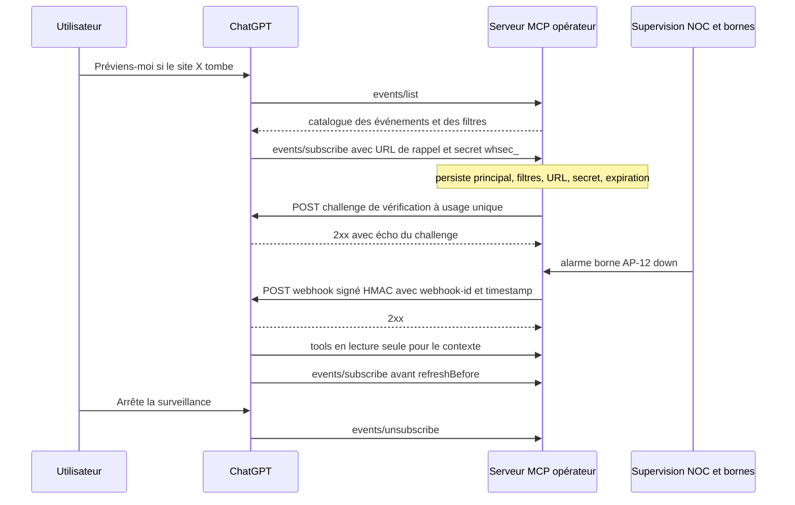
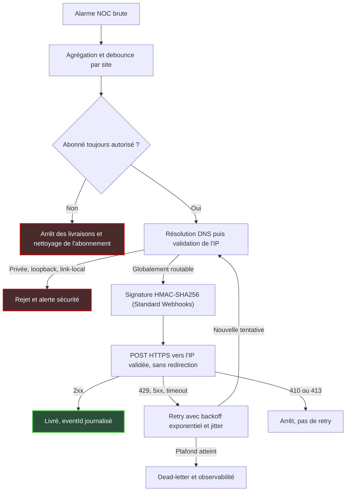

## Les agents IA sont sourds, et ça commence à changer

Un samedi soir, dans un hôtel complet, une borne Wi-Fi du troisième étage tombe. Les clients s'en rendent compte en trente secondes. Le centre de supervision réseau (le NOC, pour Network Operations Center) voit l'alarme presque aussi vite. L'assistant IA que la DSI a branché sur ses outils, lui, n'en saura rien tant que personne ne pensera à lui poser la question.

C'est la limite la plus sous-estimée des agents IA en 2026. Ils sont brillants, mais sourds. Le Model Context Protocol (MCP), ce standard ouvert qui permet à un assistant de se brancher sur les outils d'une entreprise, a d'abord été pensé pour que l'agent aille chercher l'information, pas pour qu'on vienne le prévenir.

Le 29 septembre, au DevDay, OpenAI a annoncé le support dans ChatGPT de la spécification proposée « MCP Events » : des plugins capables de déclencher des automatisations quand un événement survient dans une app connectée [9]. Opérateurs réseau, enseignes retail, groupes hôteliers, DSI qui exposent leurs systèmes à des agents : tout le monde est concerné. Deux précautions, pourtant. Le mot clé de l'annonce est « proposed » : nous parlons d'un draft expérimental. Et le modèle retenu inverse les rôles. Ce n'est pas l'agent qui écoute nos systèmes. C'est notre serveur qui doit appeler l'agent, avec toutes les responsabilités d'un émetteur.

## Du polling aux webhooks : l'agent arrête de relever le courrier

Une image aide à saisir la bascule. Jusqu'ici, un agent MCP se comportait comme quelqu'un qui descend relever sa boîte aux lettres toutes les cinq minutes. Rien ? Il remonte, puis redescend. C'est le polling : interroger en boucle, au cas où. Coûteux, lent à réagir, absurde à l'échelle de milliers d'équipements. Le webhook, c'est le facteur qui sonne quand il y a du courrier. L'agent ne demande plus. Il est prévenu.

Ce glissement n'est pas un caprice d'OpenAI : il s'inscrit dans la trajectoire du protocole. La révision 2026-07-28 de la spécification MCP a fait passer le socle au sans-état. Plus de poignée de main d'ouverture (`initialize`), plus d'identifiant de session (`Mcp-Session-Id`) : chaque requête se suffit à elle-même [5].

Conséquence directe, les tâches longues ont été sorties du socle vers une extension dédiée, qui se consulte... par polling, via `tasks/get`. Un protocole sans session a besoin d'un autre canal pour dire « il s'est passé quelque chose ». La feuille de route publiée par l'équipe MCP le 22 août le formule sans détour : parmi les priorités figurent des « server-initiated events (webhooks and channels, so clients aren't left polling for results) » [8]. Le groupe de travail Triggers & Events, mené par Clare Liguori (AWS) et Peter Alexander (Anthropic), porte le sujet depuis sa charte du 24 mars [4].

Porter, pas conclure. Le dépôt `experimental-ext-triggers-events` se présente comme un espace d'incubation dont le contenu « does not represent official MCP specifications or recommendations » [2]. Le changelog de la révision 2026-07-28 ne mentionne aucune méthode `events/*` : les événements vivent en extension expérimentale, hors du socle. Quant à la charte du groupe, elle affichait le statut « Ideating ». Nous n'avons vu aucune mise à jour indiquant qu'une proposition formelle d'évolution (un SEP, pour Specification Enhancement Proposal) ait été acceptée.

Autre point qui compte : ChatGPT n'implémente qu'une tranche du draft. Le document de conception prévoit trois modes de livraison (polling, flux continu, webhook), des curseurs pour reprendre là où l'on s'était arrêté, et des notifications de contrôle comme `gap` (un trou dans la séquence) ou `terminated` (fin d'abonnement) [3]. La doc OpenAI est explicite : webhook uniquement, sans polling, sans streaming, sans `gap` ni `terminated` [1]. Un serveur qui suivrait le draft complet pourrait donc émettre des enveloppes que ChatGPT ne traite pas.

Le sujet bouge vite. Les 23 et 25 septembre encore, Svix, éditeur spécialisé dans l'infrastructure webhook, présentait la livraison webhook MCP comme un « planned follow-up » [12][13]. Quelques jours plus tard, OpenAI annonçait le support côté ChatGPT. C'est précisément pour ça qu'il ne faut rien couler dans le béton.

*Polling contre webhook : d'un côté l'agent qui frappe en boucle à la porte, de l'autre un signal unique qui arrive quand il y a vraiment quelque chose à dire.*

## Le renversement : c'est nous, le facteur

Voilà le point que je veux marteler. Dans le modèle ChatGPT, l'opérateur n'est pas côté récepteur. Il est côté émetteur.

C'est notre serveur MCP qui expose trois méthodes : `events/list` pour décrire les événements disponibles et leurs filtres, `events/subscribe` pour créer ou rafraîchir un abonnement, `events/unsubscribe` pour y mettre fin. C'est lui qui stocke les abonnements. Et c'est lui qui, quand une borne tombe, envoie un webhook signé vers ChatGPT [1].

Reprenons l'image du courrier. Relever sa boîte aux lettres n'engage à rien. Être facteur, si. Le facteur vérifie que le destinataire existe avant la première tournée. Il signe les recommandés. Il repasse quand personne n'ouvre, mais pas indéfiniment. Et il ne glisse jamais un pli dans la mauvaise boîte. Chacune de ces obligations a son équivalent technique, et chacune est une dette opérationnelle que l'on contracte le jour où l'on déclare `events: {}` dans les capacités de son serveur, la révision 2026-07-28 du protocole étant un prérequis côté OpenAI.

*Cycle de vie d'un abonnement MCP Events dans le modèle ChatGPT : le serveur de l'opérateur vérifie, stocke, signe et émet.*

Le cycle se lit de haut en bas. L'utilisateur formule une intention, ChatGPT consulte le catalogue, puis s'abonne en fournissant une URL de rappel et un secret au format `whsec_`. Avant la moindre livraison, notre serveur envoie un challenge à usage unique, `{"type":"verification","challenge":"..."}`, que ChatGPT doit renvoyer en écho dans une réponse 2xx, dans un délai borné. Le draft est formel : aucune livraison tant que l'intention du destinataire n'est pas confirmée [3]. La vérification est ensuite mise en cache par couple principal (l'identité abonnée) et URL.

Vient la question de la durée. Le client suggère une durée de vie (`ttlMs`), mais c'est le serveur qui tranche en fixant `refreshBefore`. ChatGPT rafraîchit avant l'échéance, curseur sauvegardé en main.

Deux exigences de la doc OpenAI méritent d'être relues. La première : les abonnements (propriétaire, filtres, URL, secret, expiration) doivent survivre aux redémarrages du serveur. Adieu le dictionnaire en mémoire du prototype du vendredi soir. La seconde : l'autorisation de l'utilisateur est vérifiée à l'abonnement, revérifiée pendant toute sa durée de vie, et la livraison doit s'arrêter si l'accès est révoqué [1].

Pour un acteur multi-clients, c'est le point le plus lourd. Un technicien qui quitte un prestataire, un client qui résilie : leurs abonnements doivent mourir avec leurs droits, pas à la prochaine échéance de rafraîchissement.

## Signer, filtrer, rejouer : la checklist de l'émetteur

Commençons par le scénario qui devrait empêcher un RSSI de dormir. Un client malveillant s'abonne à vos événements et fournit comme URL de rappel non pas une adresse publique, mais celle d'une console d'administration sur votre réseau interne. Ou `169.254.169.254`, l'adresse du service de métadonnées de la plupart des clouds. Votre dispatcher, obéissant, va y poster des données. Au mieux, l'attaquant s'en sert pour sonder votre réseau. Au pire, il atteint un service qui n'aurait jamais dû être joignable depuis l'extérieur.

Ce scénario porte un nom : SSRF (Server-Side Request Forgery, falsification de requête côté serveur). Dans ce modèle, il est structurel, puisque le serveur accepte une URL fournie par un tiers et va y écrire. Le draft impose de rejeter toute URL dont l'IP résolue n'est pas globalement routable, et de le vérifier « at delivery time, not only at subscribe time » [3].

La nuance est capitale. Un nom de domaine qui pointe vers une IP publique au moment de l'abonnement peut pointer vers `127.0.0.1` une heure plus tard : c'est le DNS rebinding. Il faut donc résoudre, valider l'IP, puis se connecter à cette IP validée, à chaque livraison et à chaque retry. La doc OpenAI exige HTTPS et le blocage des adresses privées, locales et non publiques [1].

Le guide SSRF de l'OWASP (la référence communautaire en sécurité applicative) ajoute deux réflexes : désactiver le suivi des redirections et bloquer explicitement `169.254.169.254` [7]. J'en ajoute un troisième, réseau celui-là. Le dispatcher qui émet les webhooks doit vivre dans un segment dont les flux sortants sont restreints au strict nécessaire.

Deuxième chantier, la signature. OpenAI s'appuie sur Standard Webhooks, une spécification ouverte [6]. Chaque requête porte un identifiant, un horodatage et une signature dans des en-têtes dédiés (`webhook-id`, `webhook-timestamp`, `webhook-signature`), plus l'identifiant d'abonnement `X-MCP-Subscription-Id`.

La signature elle-même est un HMAC-SHA256, c'est-à-dire un sceau cryptographique calculé avec un secret partagé, appliqué à l'identifiant, à l'horodatage et au corps du message. Le secret, fourni par ChatGPT à l'abonnement, décode en 24 à 64 octets. Côté émetteur, cela impose des secrets stockés chiffrés et une rotation prévue dès le premier jour. Le draft prévoit d'ailleurs une double signature pendant la transition.

*Chaque webhook part scellé, et passe un contrôle d'adresse qui refuse toute destination privée avant de quitter le réseau.*

Troisième chantier, l'idempotence. Le réseau perd des réponses, les retries dupliquent, et la doc OpenAI prévient que les événements peuvent arriver dans le désordre [1]. D'où un `eventId` unique, conservé d'un retry à l'autre, et un `webhook-id` qui sert de clé de déduplication. La création et la suppression d'abonnement doivent être idempotentes, tout comme les tools d'écriture que l'agent pourrait appeler en réaction. Règle simple : un événement livré deux fois ne doit jamais créer deux tickets.

Quatrième chantier, les retries. OpenAI demande un backoff exponentiel à nombre de tentatives borné, sans publier son propre calendrier. Pas de nouvelle tentative sur une réponse 410 (la ressource a disparu) ni sur une 413 (charge trop lourde).

Standard Webhooks fournit des repères utiles. Une redirection compte comme un échec. Un 429 ou un 502 invite à ralentir. Un timeout de 15 à 30 secondes est raisonnable, et le calendrier indicatif de la spec étale une dizaine de tentatives sur environ 75 heures [6]. Ajoutez une part d'aléatoire dans les délais (le jitter) pour ne pas relancer toutes les livraisons à la même seconde, une file des échecs définitifs (dead-letter), et de l'observabilité sur l'ensemble.

Dernier chantier, le plus souvent oublié : le contenu. OpenAI accepte jusqu'à 256 KiB par requête, un seul événement par requête. Standard Webhooks recommande de rester sous 20 kB. Je vise la seconde valeur. Un bon payload dit « la borne AP-12 du site X est hors service » et laisse l'agent chercher le reste via les tools.

Pas d'adresses MAC de terminaux clients, pas de données personnelles Wi-Fi inutiles : le RGPD ne s'arrête pas à la porte de l'agent. Et le draft le rappelle, un payload d'événement est une donnée non fiable, à assainir avant de la présenter au modèle [3]. Un champ texte libre dans une alarme, c'est une surface d'injection de prompt.

Mis bout à bout, le chemin d'un événement côté émetteur ressemble à ceci.

*Les garde-fous d'un émetteur de webhooks : chaque tentative, y compris un retry, repasse par le contrôle d'adresse.*

## Bornes, alarmes, tickets : le prototype que nous esquisserions

Ce qui suit est une hypothèse de travail, pas un déploiement. Aucun chiffre, aucun gain annoncé : tout reste à mesurer. Les cas d'usage évoqués dans la presse, rapports de bugs ou revue de documents, restent d'ailleurs conceptuels [10], et nous n'avons vu aucun retour de production publié.

Côté catalogue, quatre événements candidats viennent naturellement pour un opérateur Wi-Fi. `ap.state_changed` quand une borne passe up, down ou dégradée. `alarm.raised` quand une alarme remonte au NOC. `ticket.created` ou `ticket.updated` pour le suivi des incidents. Et `site.capacity_threshold` quand un site approche de sa capacité. Dans `events/list`, les filtres évidents sont le site, le client et la sévérité.

Le scénario type : la responsable d'exploitation d'un groupe hôtelier demande à ChatGPT de la prévenir si l'un de ses établissements se dégrade. À la réception d'un événement, l'agent lit le contexte via les tools MCP existants, en lecture seule : historique de la borne, tickets ouverts, état du lien. Il propose ensuite un diagnostic ou un brouillon de ticket. Toute action d'écriture reste soumise à validation humaine et passe par des tools idempotents.

Quatre garde-fous me paraissent non négociables.

**Commencer petit.** Un ou deux événements à faible risque, typiquement le changement d'état de borne et la création de ticket. Les alarmes de sécurité attendront.

**Absorber les tempêtes.** La coupure d'un lien d'accès peut faire tomber d'un coup toutes les bornes d'un site et déclencher des centaines d'alarmes. Sans agrégation ni debounce (attendre que la rafale se calme avant d'émettre), chaque alarme déclenche un raisonnement LLM. Résultat : du coût, du bruit, et un utilisateur qui résilie son abonnement au bout d'une heure. Mieux vaut un seul événement « site dégradé » qui liste les équipements touchés.

**Coller aux droits.** En hôtellerie, en retail comme en entreprise, un abonnement est lié à un principal. L'autorisation par site doit être revérifiée pendant toute la vie de l'abonnement, et une révocation côté opérateur doit couper les livraisons sans attendre.

**Mesurer avant de promettre.** Délai entre l'alarme et le diagnostic proposé, part des diagnostics réellement utiles, coût LLM par événement : ce sont ces métriques qui décideront du passage à l'échelle, pas l'enthousiasme d'un DevDay.

*Des dizaines d'alertes remontent des étages ; une seule, agrégée et filtrée, atteint l'assistant IA.*

## Prototyper, oui. Figer, non.

Ma position tient en une phrase : il faut prototyper maintenant, et ne rien figer.

Prototyper maintenant, parce que la direction ne fait guère de doute. Le passage au sans-état et la feuille de route MCP convergent vers des événements initiés par le serveur, et ChatGPT vient de s'y brancher. Les équipes qui auront appris à émettre des événements propres pour des agents auront une longueur d'avance quand le standard se stabilisera.

Ne rien figer, parce que tout le reste est mouvant. Concrètement, cela veut dire une couche d'abstraction : un bus d'événements interne, et un adaptateur « MCP Events » qui traduit vers le sous-ensemble que ChatGPT supporte. Si le draft renomme une méthode, change le format d'enveloppe ou ajoute un mode de livraison, seul l'adaptateur bouge. Le reste de la chaîne ne sait même pas que MCP existe.

Surtout, la gouvernance webhook est un investissement qui survivra au draft. Signer, filtrer les destinations, dédupliquer, rejouer, révoquer : ce sont des compétences d'émetteur, pas des spécificités MCP. Des éditeurs comme Svix ou Hookdeck en ont fait un métier [11][12], avec le biais commercial qu'on imagine. Leurs contenus sont antérieurs à l'annonce, mais restent utiles sur la rétention et la déduplication. Faire ou acheter, la question se pose. Ignorer le sujet, en revanche, n'est pas une option.

Ce que je surveille avant de parler de production :

1. **Un SEP Events accepté** et intégré à une révision du socle. Aujourd'hui, rien ne l'indique.
2. **Un second client.** Nous n'avons vu aucune confirmation qu'un autre assistant que ChatGPT supporte ces webhooks. Même la compatibilité Codex est signalée comme inconnue par un implémenteur [14].
3. **Des SDK MCP de premier rang** avec une implémentation de référence stable. Tant qu'ils manquent, chacun réécrit la même plomberie.
4. **L'identité des parties.** La doc ne publie aucune plage d'IP de sortie pour ChatGPT, et le draft renvoie la question à des travaux ultérieurs (server cards, SEP-2127). Inutile donc de bâtir une allowlist IP : la confiance repose sur la signature et le challenge.

Les critères go/no-go pour passer du prototype à la production en découlent. Checklist de gouvernance couverte et testée, y compris un test de DNS rebinding et une rotation de secret. Révocation vérifiée de bout en bout. Tempête d'alarmes simulée et absorbée. Métriques du prototype qui justifient le coût. Et au moins un des signaux ci-dessus passé au vert.

Les agents IA vont cesser d'être sourds. La vraie question n'est pas de savoir si nos systèmes leur parleront, mais si nous saurons être des facteurs fiables. Et ça, ça ne dépend pas d'OpenAI.

## Sources

1. [OpenAI, MCP Events (documentation développeur)](https://developers.openai.com/plugins/build/mcp-events)
2. [MCP, experimental-ext-triggers-events (README)](https://github.com/modelcontextprotocol/experimental-ext-triggers-events)
3. [MCP, design sketch du draft Triggers & Events](https://github.com/modelcontextprotocol/experimental-ext-triggers-events/blob/main/docs/design-sketch-proposal.md)
4. [MCP, charte du groupe de travail Triggers & Events (2026-03-24)](https://modelcontextprotocol.io/community/working-groups/triggers-events)
5. [MCP, changelog de la révision 2026-07-28](https://modelcontextprotocol.io/specification/2026-07-28/changelog)
6. [Standard Webhooks, spécification](https://github.com/standard-webhooks/standard-webhooks/blob/main/spec/standard-webhooks.md)
7. [OWASP, SSRF Prevention Cheat Sheet](https://cheatsheetseries.owasp.org/cheatsheets/Server_Side_Request_Forgery_Prevention_Cheat_Sheet.html)
8. [MCP Blog, The New MCP Roadmap (2026-08-22)](https://blog.modelcontextprotocol.io/posts/mcp-roadmap/)
9. [Thurrott, OpenAI announces massive set of ChatGPT upgrades (2026-09-29)](https://www.thurrott.com/a-i/342197/openai-announces-massive-set-of-chatgpt-upgrades)
10. [Forkast, MCP Events Complete the Agent Communication Model (2026-09-29)](https://forkast.news/mcp-events-complete-the-agent-communication-model/)
11. [Hookdeck, MCP event gateway](https://hookdeck.com/blog/mcp-event-gateway)
12. [Svix, MCP webhook (glossaire, 2026-09-23)](https://www.svix.com/resources/glossary/mcp-webhook/)
13. [Svix, MCP vs Webhooks (2026-09-25)](https://www.svix.com/resources/faq/mcp-vs-webhooks/)
14. [Mumega mupot, issue #1618](https://github.com/Mumega-com/mupot/issues/1618)

---

_Vues personnelles, pas position Wifirst._
