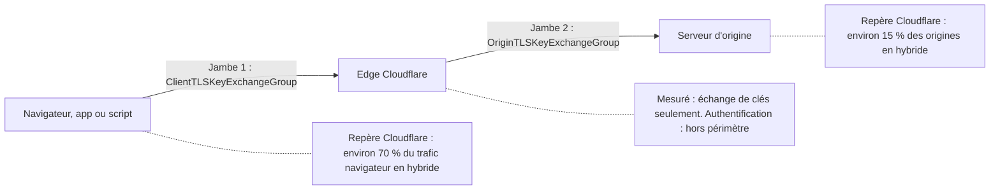
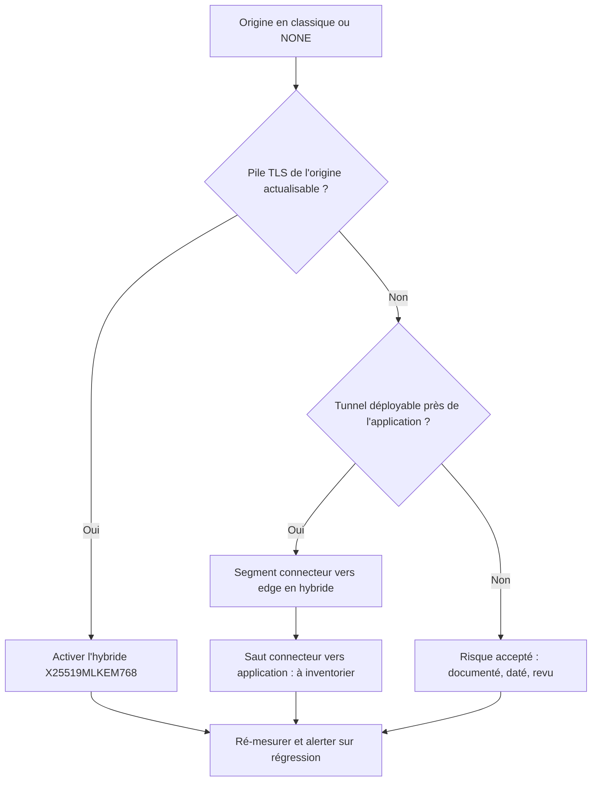

## Le cadenas ne dit pas tout

Demandez à un directeur des systèmes d'information si ses services web sont protégés : il vous montrera le petit cadenas du navigateur. Demandez-lui si ce chiffrement tiendra face à un futur ordinateur quantique, et la réponse devient beaucoup plus floue. Elle l'était pour tout le monde, faute d'instrument de mesure.

Depuis le 29 septembre, [Cloudflare](https://blog.cloudflare.com/post-quantum-visibility/) comble une partie de ce vide. Ses tableaux de bord et ses journaux indiquent, requête par requête, si la clé qui protège la session a été fabriquée selon une méthode dite post-quantique, conçue pour résister à cette future machine. Au passage, l'éditeur a publié deux ordres de grandeur tirés de son observatoire. D'un côté, environ 70 % du trafic des navigateurs qui arrive sur son réseau est protégé de cette façon. De l'autre, environ 15 % seulement des serveurs d'origine qu'il contacte en coulisses, ceux qui hébergent réellement les applications.

Ces deux chiffres ne se comparent pas par une simple division, on y reviendra. Mais ils racontent une histoire que tout exploitant d'un portail captif d'hôtel, d'interfaces de supervision ou de back-offices partenaires dans le retail devrait entendre. La partie visible du trajet progresse toute seule, au rythme des mises à jour de smartphones. La partie cachée ne progresse que si quelqu'un s'en occupe.

Ma thèse tient en une ligne : « chiffré » ne veut pas dire « post-quantique ». Avant de lancer le moindre chantier de migration, mesurez l'écart entre les deux parties du trajet, segment par segment.

## Deux camions, un seul cadenas

Une requête qui traverse Cloudflare ressemble à un colis qui change de camion à l'entrepôt. Le premier camion roule du navigateur jusqu'à l'entrepôt, c'est-à-dire le point de présence Cloudflare le plus proche, que l'on appelle l'edge. Le second roule de l'entrepôt jusqu'au vrai destinataire : votre serveur d'origine. Rien n'oblige les deux camions à être blindés de la même façon. Et le cadenas du navigateur ne voit que le premier.

Pourquoi le blindage compte-t-il dès aujourd'hui ? Parce qu'un adversaire peut enregistrer du trafic chiffré maintenant et le déchiffrer le jour où une machine quantique suffisante existera. Ce scénario, dit « harvest now, decrypt later », est [déjà largement traité sur ce blog](/post?slug=cryptographie-post-quantique-telecom-mwc-2026) ; je n'y reviens pas.

Le remède s'appelle l'échange de clés hybride. On combine un algorithme classique éprouvé et ML-KEM, le mécanisme post-quantique normalisé par le NIST (l'institut américain des normes et de la technologie) dans [FIPS 203](https://csrc.nist.gov/pubs/fips/203/final), en août 2024. Si l'un des deux tombe, l'autre tient encore.

Ce que Cloudflare livre, c'est la possibilité de regarder chaque camion séparément. Deux champs apparaissent dans les journaux HTTP. `ClientTLSKeyExchangeGroup` décrit la jambe visiteur → Cloudflare. `OriginTLSKeyExchangeGroup` décrit la jambe Cloudflare → origine. La valeur à chercher est `X25519MLKEM768`, le nom du groupe hybride.

Le billet du 29 septembre annonce le filtrage sur ces champs à trois endroits : le tableau de bord d'analyse du trafic HTTP, Log Explorer (la recherche dans les journaux) et Logpush, le service d'export vers un stockage ou une console de sécurité. Le changelog d'août documente la ventilation par hostname, chemin, user-agent et pays.

Petite précision de chronologie. Le [changelog du 20 août](https://developers.cloudflare.com/changelog/post/2026-08-20-pqc-key-exchange-visibility/) n'annonçait que le champ côté client, dans le jeu de données `http_requests`. Le champ côté origine arrive avec le billet de septembre. Ceux qui ont regardé fin août n'ont vu qu'un camion.

*Deux jambes, deux champs de journal, deux dénominateurs différents : du trafic d'un côté, des serveurs de l'autre.*

Une limite doit être posée tout de suite, parce qu'elle conditionne la lecture de tout le reste. Ces champs mesurent l'échange de clés, donc la confidentialité. Ils ne disent rien de l'authentification, l'autre moitié du chantier, celle qui garantit que vous parlez au bon serveur. Cloudflare l'écrit lui-même : le chiffrement hybride est plus largement déployé que l'authentification post-quantique. Sa [documentation](https://developers.cloudflare.com/ssl/post-quantum-cryptography/) précise que l'authentification post-quantique entre visiteur et edge est encore en développement, et que les signatures ML-DSA ne couvrent pour l'instant que la jambe vers l'origine ([sujet traité ici](/post?slug=signature-post-quantique-ml-dsa-cloudflare)).

Est-ce une lacune ? Non, c'est le bon ordre. Dans sa [fiche FT-115](https://messervices.cyber.gouv.fr/documents-guides/transition_post_quantique_tls_1_3.pdf) de février 2026, l'ANSSI (l'agence nationale de la sécurité des systèmes d'information) juge la transition de la confidentialité « plus urgente » que celle de l'authentification, précisément à cause du risque de stockage puis déchiffrement différé. Mais un tableau de bord entièrement vert sur ces champs ne sera jamais un certificat « post-quantique complet ». Écrivez-le dans chaque rapport qui cite la mesure.

## 70 et 15 ne se divisent pas

Revenons aux deux chiffres. Le réflexe naturel consiste à diviser l'un par l'autre. C'est une erreur.

Le premier, environ 70 %, porte sur du trafic. C'est la part du trafic généré par des navigateurs, à l'arrivée sur le réseau Cloudflare, qui est protégée par ML-KEM hybride. Il est mesuré sur la jambe visiteur → Cloudflare. L'éditeur cite Radar, son observatoire public, et ne donne pas d'autre fenêtre de mesure que la date du billet.

Le second, environ 15 %, porte sur des origines. C'est une proportion de serveurs, pas de requêtes ni de connexions. Dans ce comptage, une origine qui sert un million de requêtes par jour pèse autant qu'une origine qui en sert dix. Diviser un pourcentage de trafic par un pourcentage d'hôtes ne produit aucun ratio exploitable. Toute formule du type « x fois plus prêt côté client » est à jeter.

Côté origine, il faut ajouter une subtilité de méthode. En février 2026, [l'équipe Radar a décrit son instrument](https://blog.cloudflare.com/radar-origin-pq-key-transparency-aspa/) : un scanner automatisé sonde les origines compatibles TLS 1.3 et agrège les résultats chaque jour. Il teste le support de l'hybride, pas ce que le serveur préfère réellement négocier. Les auteurs préviennent d'ailleurs que la préférence locale d'une origine peut dicter le résultat.

La mesure tournait alors autour de 10 %, contre moins de 1 % début 2025. Le billet de septembre parle de 15 % des origines qui « utilisent » l'hybride. Rien ne garantit qu'il s'agisse de la même série : lisez la progression comme un ordre de grandeur, pas comme une courbe.

Dernière précaution : les deux repères viennent d'une seule source, Cloudflare et son observatoire. Je n'ai pas trouvé de recoupement indépendant de ces valeurs précises. Ils servent de boussole, pas de référence d'audit.

### Le premier se subit, le second se pilote

Ce qui m'intéresse vraiment, c'est ce que ces deux courbes disent de qui tient le volant. Côté client, la progression suit le calendrier des éditeurs de systèmes et de navigateurs. Radar mesurait moins de 3 % de trafic post-quantique début 2024 et plus de 60 % en février 2026. Les définitions changent d'un billet à l'autre (trafic « humain » ici, trafic « navigateur » là), donc ne chaînez pas ces séries en une tendance unique. Mais le moteur, lui, est visible.

L'illustration la plus nette date de fin 2025. Après la sortie d'iOS 26, la part de requêtes iOS en post-quantique est passée, [selon Radar](https://blog.cloudflare.com/radar-2025-year-in-review/), de moins de 2 % à 11 % en quatre jours, puis au-delà de 25 % début décembre. Le levier était chez Apple, pas chez les exploitants de sites.

Côté origine, c'est l'inverse. Le chiffre bouge au rythme de la configuration de chaque serveur, donc de chaque équipe d'exploitation. C'est ma lecture, pas un fait publié, mais je la crois solide : le côté client se subit, le côté origine se pilote. Et c'est le seul des deux qui dépend de nous.

*Deux jambes, deux jauges : la connexion visiteur progresse avec les mises à jour des terminaux, la connexion vers l'origine avec la configuration de chaque serveur.*

## Supporter n'est pas utiliser

Comment une origine capable de parler hybride peut-elle finir en classique ? La réponse tient à la façon dont Cloudflare négocie la seconde jambe.

Sa [documentation « PQC to origin »](https://developers.cloudflare.com/ssl/post-quantum-cryptography/pqc-to-origin/) décrit un échange de clés automatique. Cloudflare apprend quels accords de clés les origines d'une zone préfèrent, puis applique une seule préférence à toute la zone. Le mécanisme est actif sur toutes les zones existantes et par défaut sur les nouvelles. Quand une origine supporte à la fois le classique et l'hybride, Cloudflare préfère l'hybride.

Le détail du protocole compte. Si l'hybride est la préférence de la zone, Cloudflare place directement sa part de clé `X25519MLKEM768` dans le ClientHello, le tout premier message de la poignée de main TLS. Sinon, l'origine peut répondre par un HelloRetryRequest, une demande de recommencer avec un autre groupe. D'après la documentation, cela « ajoute un aller-retour réseau mais ne casse pas la connexion ». C'est le seul élément de coût publié. Aucun chiffre en millisecondes.

Deuxième mise en garde de la documentation : avec la part de clé hybride, le ClientHello est fragmenté sur deux paquets. Certaines piles côté origine digèrent mal ce cas. C'est le phénomène d'ossification, où un écosystème se fige autour d'hypothèses que la norme n'a jamais garanties.

Une conséquence pratique, que je n'ai pas vue écrite noir sur blanc et que je vous invite à vérifier : puisque la préférence est unique par zone, une zone qui mélange des origines récentes et un vieux serveur pourrait voir cette préférence tirée vers le classique. Les origines modernes paieraient alors l'aller-retour supplémentaire, ou accepteraient le groupe classique proposé, selon leur propre configuration. Testez sur vos zones avant d'en faire une règle.

Pour lire les journaux, deux repères d'identifiants. `0x11ec` correspond à `X25519MLKEM768`, le groupe recommandé. `0x6399` désigne l'ancien `X25519Kyber768Draft00`, que Cloudflare qualifie d'obsolète.

Le groupe hybride est normalisé par la [RFC 10024](https://www.rfc-editor.org/info/rfc10024), publiée en 2026 au statut de norme proposée, qui définit aussi deux variantes sur courbes NIST. Et l'hybride n'existe qu'en TLS 1.3 et HTTP/3 : une origine restée en TLS 1.2 ne sera [jamais post-quantique](/post?slug=post-quantique-jamais-tls-12-rfc-9851).

## Six gestes pour une baseline honnête

Une mesure mal construite est pire que pas de mesure du tout : elle rassure à tort. Commençons par le dictionnaire, car chaque valeur de champ appelle un traitement différent. Les définitions viennent de la [documentation du jeu de données](https://developers.cloudflare.com/logs/logpush/logpush-job/datasets/zone/http_requests/).

| Valeur du champ | Ce qu'elle signifie | Comment la traiter |
|---|---|---|
| `X25519MLKEM768` | Échange hybride post-quantique | Numérateur de votre indicateur |
| `X25519`, `P-256` ou autre nom | Échange classique | Dette post-quantique à résorber |
| `UNK` | Non déterminé ; côté origine, couvre aussi l'absence de connexion à l'origine (réponse servie depuis le cache) | À exclure du calcul côté origine |
| `NONE` | Échange de clés RSA, ou pas de TLS du tout | Dette prioritaire, à isoler |

**1. Baseline client.** Calculez la part de `ClientTLSKeyExchangeGroup` égale à `X25519MLKEM768` par hostname, puis par user-agent, puis par pays. La ventilation par user-agent est la plus instructive : séparez les navigateurs de tout le reste (appels d'API, clients embarqués, scripts). Le repère de 70 % porte sur les navigateurs. Ce n'est pas votre chiffre.

**2. Baseline origine, hors cache.** Même exercice sur `OriginTLSKeyExchangeGroup`, en excluant les requêtes servies depuis le cache. Elles remontent en `UNK` puisque Cloudflare n'a pas contacté l'origine, et elles feraient chuter artificiellement votre pourcentage. Isolez ensuite `NONE`. Une origine en classique porte une dette post-quantique. Une origine en échange RSA ou sans TLS porte un problème bien plus ancien.

**3. L'écart, segment par segment.** Construisez un tableau croisant chaque hostname avec deux colonnes : part hybride côté client, part hybride côté origine. C'est l'écart qui désigne les priorités, pas chaque chiffre isolé. Un hostname où les navigateurs négocient massivement l'hybride et où l'origine reste en classique est le candidat évident : le visiteur a fait sa part, pas le serveur.

*Hybride, indéterminé, absent : chaque valeur de champ appelle un traitement distinct, et le cache doit sortir du calcul avant toute conclusion.*

**4. Le coût, mesuré chez vous.** Le jeu de données expose aussi `OriginSSLProtocol` et `OriginTLSHandshakeDurationMs`, la durée de la poignée de main vers l'origine. Croisez cette durée avec le groupe négocié, en excluant les valeurs à zéro, qui signalent une connexion d'origine réutilisée. Vous obtiendrez votre propre mesure de l'impact de l'hybride. Je ne citerai ici aucun chiffre de latence : les sources de Cloudflare n'en donnent pas pour cette jambe, et en emprunter un à un autre contexte serait malhonnête. Point de vigilance : la documentation ne précise pas comment le champ de groupe se comporte sur une connexion réutilisée. Testez avant d'interpréter.

**5. Remédier dans l'ordre.** Pile d'abord, tunnel ensuite, risque assumé en dernier. J'y reviens juste après.

**6. Ré-mesurer et alerter.** Après chaque changement, refaites la baseline. Puis transformez-la en alerte. Un hostname qui retombe en `X25519` ou en `NONE` après une mise à jour, un changement de répartiteur de charge ou une migration d'hébergement, c'est une régression silencieuse. Sans alerte, personne ne la verra.

## Remédier : la pile, puis le tunnel, puis le risque assumé

Une fois l'écart cartographié, l'ordre de remédiation me paraît non négociable.

Premier levier : mettre à jour la pile TLS de l'origine. La fiche FT-115 de l'ANSSI fait de l'hybridation la solution privilégiée pendant la transition, et rappelle qu'OpenSSL 3.5.0 implémente l'hybride. C'est d'ailleurs le même seuil de version que Cloudflare exige pour ses [signatures post-quantiques vers l'origine](https://blog.cloudflare.com/post-quantum-authentication-to-origins/). Quand c'est possible, c'est le chemin le plus court et le plus propre.

Deuxième levier, pour les serveurs qu'on ne peut pas toucher : Cloudflare propose de placer l'origine legacy derrière Cloudflare Tunnel. Un connecteur logiciel, cloudflared, installé près de l'application, achemine le trafic vers Cloudflare en TLS 1.3 avec `X25519MLKEM768`, sans modifier le serveur lui-même. L'éditeur décrivait déjà ce tunnel en hybride dans son [annonce de février 2026](https://blog.cloudflare.com/post-quantum-sase/) sur son offre d'accès sécurisé, un sujet [abordé ici sous l'angle TLS 1.3](/post?slug=tls-1-3-rfc-9846-sase-post-quantique).

Troisième option, quand ni l'un ni l'autre n'est possible : le risque accepté. Documenté, daté, signé par un responsable, avec une date de revue. Pas un oubli maquillé en décision.

*L'ordre de remédiation : corriger la pile quand c'est possible, tunneler quand ça ne l'est pas, et assumer par écrit tout le reste.*

### Le tunnel déplace la frontière

Attention à ce que l'on promet avec ce tunnel. Il protège le segment entre le connecteur et Cloudflare. Le dernier saut, du connecteur jusqu'à l'application, reste exactement ce que la configuration locale en fait : du HTTP en clair sur la même machine, du TLS classique à travers un réseau local, ou mieux. La source ne détaille pas ce point ; c'est ma lecture de l'architecture.

Si le connecteur tourne sur le même hôte que l'application, l'exposition résiduelle est faible. S'il est posé sur une autre machine, à l'autre bout d'un réseau partagé, c'est une autre histoire. Le tunnel ne rend pas l'origine post-quantique. Il déplace la frontière du risque, et cette nouvelle frontière doit figurer dans votre inventaire, avec son propre propriétaire.

*Le tunnel blinde le long trajet vers l'edge ; le court segment entre le connecteur et le vieux serveur reste à documenter.*

## Portail, API, back-offices : où je chercherais l'écart

Transposons à un opérateur comme Wifirst. Je raisonne ici en hypothèses, sans préjuger de ce qui passe ou non par un CDN chez nous. Si votre portail captif, vos API de gestion ou vos back-offices sont derrière Cloudflare ou un autre reverse proxy, trois segments méritent chacun leur ligne dans le tableau d'écart.

**Le portail captif invité.** Il est consulté par des navigateurs, souvent récents, mais sur un parc très hétérogène : smartphones de clients d'hôtel, tablettes d'étudiants, vieux portables de passage. Je m'attends à ce que la jambe client suive la tendance des navigateurs, avec une traîne. La jambe origine, elle, dépend entièrement de notre pile.

**Les API de supervision des équipements.** Clients non-navigateurs, bibliothèques HTTP embarquées, scripts d'automatisation : probablement en classique côté client, parce que personne ne les met à jour au rythme d'iOS. C'est précisément là que le repère « navigateur » de Cloudflare induit en erreur.

**Les intégrations hospitality et retail.** Back-offices de tiers, logiciels de gestion hôtelière, plateformes de fidélité, parfois anciens et hors de notre contrôle direct : candidats naturels au tunnel, ou au risque documenté.

Pour les origines qui ne passent pas par Cloudflare, l'équivalent se construit dans le reverse proxy. nginx expose une variable `ssl_curve` (le groupe négocié) et une variable `ssl_curves` (la liste proposée par le client), qu'il suffit d'ajouter au format de journal.

Un piège est documenté. L'[issue nginx #606](https://github.com/nginx/nginx/issues/606), ouverte en avril 2025, signalait qu'avec nginx 1.27.4 et OpenSSL 3.5.0-beta1, la variable `ssl_curve` journalisait « 0x11ec » au lieu du nom `X25519MLKEM768`. Un correctif a été proposé, mais je n'ai pas pu confirmer dans quelle version il a atterri. Vérifiez votre combinaison de versions, et écrivez votre parseur pour reconnaître les deux formes.

Reste la gouvernance. Je préfère de loin un indicateur auditable, publié par hostname, à une case « conforme post-quantique » cochée dans une réponse à appel d'offres. Le [calendrier de l'ANSSI](/post?slug=anssi-calendrier-post-quantique-2027-sourcing-equipements) fixe le rythme côté achats. La mesure, elle, dit la vérité côté production.

Méfiez-vous aussi des échéances arrondies. Cloudflare écrit que le NIST veut voir RSA et les courbes elliptiques dépréciés « d'ici 2030 ». C'est un raccourci. Le [projet initial du rapport NIST IR 8547](https://csrc.nist.gov/pubs/ir/8547/ipd), publié en novembre 2024, distingue deux paliers pour RSA et ECDSA (la signature sur courbes elliptiques). À 112 bits de sécurité : « deprecated » après 2030, « disallowed » après 2035. À 128 bits et plus : « disallowed » après 2035. Cloudflare, de son côté, vise 2029 pour une sécurité post-quantique complète.

## Mesurer d'abord, promettre ensuite

Le geste de Cloudflare paraît modeste : deux champs de plus dans un journal. Il change pourtant la nature de la conversation. Jusqu'ici, « sommes-nous post-quantiques ? » se tranchait à l'impression, ou par une ligne dans une fiche produit. Désormais, sur la part du trafic qui passe par Cloudflare, c'est un pourcentage par hostname, que l'on peut suivre semaine après semaine.

Ma position est nette. Arrêtez de célébrer le chiffre client : il progresse grâce aux éditeurs de systèmes et de navigateurs, pas grâce à vous. Le chiffre qui dit quelque chose de votre maturité, c'est l'écart entre les deux jambes, et surtout la jambe origine, parce que c'est la seule que vous pilotez.

Commencez par la baseline, hors cache, avec `NONE` isolé. Corrigez la pile avant de dérouler des tunnels. Inventoriez le dernier saut quand vous tunnelez. Et dans chaque rapport, écrivez noir sur blanc ce que la mesure ne couvre pas : l'authentification.

Le cadenas restera affiché dans la barre d'adresse. Il ne dira toujours rien du second camion. À nous de le regarder.

_Vues personnelles, pas position Wifirst._

## Sources

1. [Cloudflare, « Is your domain using post-quantum encryption? Now you can see for yourself »](https://blog.cloudflare.com/post-quantum-visibility/) (29/09/2026)
2. [Cloudflare changelog, « Per-zone post-quantum visibility in Logpush and Log Explorer »](https://developers.cloudflare.com/changelog/post/2026-08-20-pqc-key-exchange-visibility/) (20/08/2026)
3. [Cloudflare docs, jeu de données http_requests (champs TLS)](https://developers.cloudflare.com/logs/logpush/logpush-job/datasets/zone/http_requests/)
4. [Cloudflare docs, Post-quantum cryptography](https://developers.cloudflare.com/ssl/post-quantum-cryptography/)
5. [Cloudflare Radar, « Bringing more transparency to post-quantum usage, encrypted messaging, and routing security »](https://blog.cloudflare.com/radar-origin-pq-key-transparency-aspa/) (27/02/2026)
6. [Cloudflare docs, PQC to origin (automatic key exchange)](https://developers.cloudflare.com/ssl/post-quantum-cryptography/pqc-to-origin/)
7. [Cloudflare, « Post-quantum authentication to origins is now supported »](https://blog.cloudflare.com/post-quantum-authentication-to-origins/) (29/07/2026)
8. [Cloudflare, « The 2025 Radar Year in Review »](https://blog.cloudflare.com/radar-2025-year-in-review/) (mesures de début décembre 2025)
9. [Cloudflare, « Cloudflare One is the first SASE offering modern post-quantum encryption across the full platform »](https://blog.cloudflare.com/post-quantum-sase/) (23/02/2026)
10. [ANSSI, FT-115 Transition post-quantique de TLS 1.3](https://messervices.cyber.gouv.fr/documents-guides/transition_post_quantique_tls_1_3.pdf) (02/02/2026)
11. [IETF / RFC Editor, RFC 10024, Post-Quantum Traditional Hybrid Key Agreement Mechanisms for TLS 1.3](https://www.rfc-editor.org/info/rfc10024) (2026)
12. [NIST, FIPS 203 (ML-KEM)](https://csrc.nist.gov/pubs/fips/203/final) (13/08/2024)
13. [NIST, IR 8547 ipd, Transition to Post-Quantum Cryptography Standards](https://csrc.nist.gov/pubs/ir/8547/ipd) (11/2024)
14. [nginx, issue #606 (variable ssl_curve et groupes post-quantiques)](https://github.com/nginx/nginx/issues/606) (02/04/2025)
