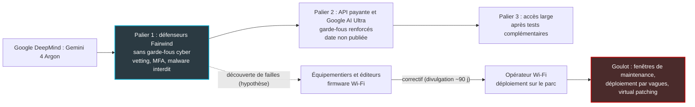

## Le meilleur modèle de Google n'est pas à vendre

Le 30 septembre, Google a présenté son nouveau modèle phare, Gemini 4 Argon, puis a expliqué dans la foulée que presque personne ne pourrait s'en servir. Ni les développeurs, ni les entreprises clientes, ni le grand public. Pas tout de suite, et pas à une date annoncée.

Les premiers servis sont des défenseurs cyber triés sur le volet, réunis dans un programme baptisé Fairwind après vérification de leurs antécédents. Longtemps, l'informatique d'entreprise a reposé sur une règle simple : le meilleur outil revient à celui qui peut le payer. Pour l'IA dite *frontier*, celle qui repousse la limite de l'état de l'art, cette règle vient de céder. L'accès devient un statut. Il dépend de ce que vous êtes (autorité nationale, opérateur d'infrastructure critique, grande plateforme technologique), pas du chèque que vous êtes prêt à signer.

Pour un DSI, deux questions très concrètes en découlent. Côté achats : comment bâtir une feuille de route IA quand le modèle de référence arrive en différé, et dans une version bridée ? Côté sécurité : que se passe-t-il quand des défenseurs équipés de ces modèles trouvent des failles plus vite que les fabricants ne savent les corriger ? Pour un opérateur qui exploite des milliers de bornes Wi-Fi dans des hôtels, des magasins et des résidences étudiantes, la seconde question n'a rien de théorique.

Et Google n'invente rien. Anthropic a son Glasswing, OpenAI son Daybreak. L'accès à paliers est en train de devenir la norme du secteur.

## Fairwind, ou l'IA sous ordonnance

Pensez à votre pharmacie. Le même principe actif existe souvent en deux dosages : l'un en libre-service, l'autre derrière le comptoir. Ce qui vous sépare du second n'est pas le prix. C'est votre statut : une ordonnance, une identité, une trace dans le registre. Argon obéit à la même logique. Le modèle doit, à terme, être ouvert à tous, mais sa version la moins bridée se délivre sur ordonnance.

L'ordonnance s'appelle Fairwind. Google a lancé ce programme le 2 septembre, quatre semaines avant Argon, en le présentant comme un dispositif à accès limité pour gouvernements et partenaires de confiance. Il revendique plus de 650 partenaires ; parmi les logos affichés figurent CrowdStrike, Palo Alto Networks, Wiz, Snowflake et Armadin. Trois familles sont prioritaires : les gouvernements et autorités cyber nationales, les opérateurs d'infrastructures critiques (santé, télécoms, énergie, finance) et les fournisseurs de plateformes technologiques cœur.

Les conditions d'entrée tiennent davantage de l'habilitation que des conditions générales de vente. L'usage est réservé aux équipes internes de cybersécurité, de réponse à incident et de test d'intrusion. Chaque utilisateur s'authentifie avec une MFA (authentification multifacteur) résistante au phishing, et le partage d'accès est interdit. Google mène vérifications d'antécédents et due diligence. Les usages autorisés sont listés : simulation de menace, rétro-ingénierie, analyse de malware à des fins défensives ou académiques. La ligne rouge est écrite noir sur blanc : « Malicious tasks such as creating malware are not permitted. »

Qui tient déjà Argon entre ses mains ? Google ne publie pas la liste. Deux bénéficiaires sont nommés : ses propres équipes, soit des milliers d'employés selon The Next Web, et Wiz, via son initiative *Scan for Good*. D'après The Next Web et TBreak, Wiz aurait ainsi débusqué une vulnérabilité critique dans un logiciel de santé utilisé par des hôpitaux, que les modèles précédents avaient manquée. Attention au raccourci : les 650 partenaires sont ceux du programme, pas forcément tous dotés d'Argon. Fairwind s'appuie d'ailleurs sur d'autres briques, comme Gemini 3.8 Flash Cyber ou CodeMender, un outil qui enchaîne trouver, vérifier, corriger.

### Le garde-fou ne disparaît pas, il déménage

Reste la formule qui a fait réagir. Pour ces défenseurs, Google publie Argon « without cyber guardrails », afin de leur ouvrir les « full frontier-level cybersecurity defense capabilities ». Lue trop vite, la phrase inquiète. Lue en entier, elle dit autre chose : le garde-fou quitte le modèle pour s'installer dans le contrat.

Argon cesse de refuser les tâches cyber, mais la politique Fairwind continue d'interdire la création de malware et d'imposer vetting, MFA et équipes internes. Le modèle garde par ailleurs ses protections sur les risques CBRN (chimiques, biologiques, radiologiques, nucléaires). Il reste aussi protégé contre l'injection de prompt indirecte, ces instructions malveillantes cachées dans un document ou une page web que l'IA va lire.

Google maintient enfin la surveillance du désalignement, c'est-à-dire d'un modèle qui dériverait de l'objectif fixé, en suivant sa chaîne de raisonnement et ses actions. Les agents tournent dans des environnements décrits comme « isolated and sealed ». L'éditeur promet de renforcer l'ensemble avant l'ouverture large.

Le résultat est un objet inédit : un modèle dont le potentiel offensif n'est plus borné par sa programmation, mais par l'identité de celui qui tient le clavier. C'est cohérent. C'est aussi un pari sur la qualité du vetting.

*Trois paliers d'accès : le sommet est gardé, les étages inférieurs reçoivent le modèle plus tard, avec davantage de garde-fous.*

## Lire l'annonce avec un crayon rouge

Une annonce de modèle frontier reste un document commercial. Celle-ci contient des chiffres solides, mais aussi des raccourcis que la presse a déjà propagés. Quatre points méritent un coup de crayon rouge.

**Le million de tokens se compte en sortie.** Plusieurs agrégateurs ont écrit qu'Argon lisait un contexte d'un million de tokens, ces unités de texte que le modèle consomme et produit, et qui servent de base à la facturation. Ce n'est pas ce que dit Google. La source primaire évoque une « industry-leading 1 million token limit » en sortie, contre 64 000 auparavant. Argon peut donc générer jusqu'à un million de tokens en une seule passe. Confondre les deux revient à confondre la taille de la bibliothèque qu'un expert peut consulter avec la longueur du rapport qu'il peut rédiger. Aucune source vérifiable ne confirme à ce jour une fenêtre d'entrée équivalente, et Google n'a pas publié de spécification d'API complète. Ne dimensionnez rien sur un contexte d'un million.

**Le prix affiché n'est pas le prix payé.** Google annonce 2 USD par million de tokens en entrée et 10 USD en sortie, avec 95 % de remise sur les entrées mises en cache, soit 0,10 USD par million. C'est un tarif introductif, dont la durée n'est pas publiée. Le tarif standard double ensuite : 4 USD en entrée, 20 USD en sortie. Au moment de l'annonce, il n'existait ni identifiant de modèle pour l'API, ni limites de débit publiées. Kingy AI résume le piège : « a published price establishes the intended commercial rate; it does not establish that any developer can call the model today ». Le couple 2 USD / 10 USD est un prix d'annonce, que personne ne peut appeler aujourd'hui. Budgétez 4 USD / 20 USD.

**Les benchmarks sont auto-déclarés.** VentureBeat a titré sur un leadership retrouvé face à OpenAI et Anthropic. Voici les chiffres, publiés par Google et non audités de manière indépendante.

| Test (périmètre) | Gemini 4 Argon | GPT-6 Astra | Claude Opus 5.5 |
|---|---|---|---|
| DeepSWE v1.1 (ingénierie logicielle) | 77,9 % | 74,1 % | 74,2 % |
| AutomationBench (automatisation) | 51,3 % | 41,4 % | 42,5 % |
| CWE-bench v1 (classes de failles logicielles) | 68 % | 68 % | 67 % |
| Gray Swan IPI (injection de prompt indirecte, taux d'attaques réussies : plus bas = mieux) | 0,7 % | 8,5 % | 1,0 % |
| Terminal-Bench 4.0 (DataCamp, relayé par la presse) | 57,4 % | non communiqué | 66,4 % |

Trois lectures s'imposent. Côté sécurité, le gain le plus net porte sur la résistance d'Argon aux attaques par injection, pas sur sa capacité à trouver des failles. Sur CWE-bench, le test le plus proche de la chasse aux vulnérabilités, Argon partage la première place avec GPT-6 Astra, à 68 % chacun : c'est une égalité, pas une victoire. Enfin, Argon n'est pas premier partout, puisque DataCamp le place neuf points derrière Claude Opus 5.5 sur Terminal-Bench 4.0. Techzine a la formule juste : « benchmarks, of all shapes and sizes, have become somewhat unreliable in recent months ».

Ma lecture : l'avantage cyber propre à Argon, celui qui justifierait à lui seul un accès réservé, n'est pas démontré par ces tableaux. Cela ne veut pas dire qu'il n'existe pas. Cela veut dire qu'on ne le mesurera que sur le terrain, et que les premiers à le voir seront ceux qui sont dans le club.

**Le calendrier n'existe pas.** L'ordre est annoncé : défenseurs Fairwind maintenant, puis clients API payants et abonnés Google AI Ultra, puis développeurs, entreprises et particuliers après des tests complémentaires. Aucune date : VentureBeat rapporte un « as soon as possible », Techzine constate « no specific release date ». Google participe en outre au processus volontaire américain d'accès pré-publication, qui permet au gouvernement des États-Unis d'examiner un modèle avant sa diffusion large. Techzine y voit l'une des variables du calendrier. C'est une lecture de journaliste, pas une déclaration de Google. Elle rappelle pourtant une réalité nouvelle : la date de sortie de votre prochain outil ne dépend plus seulement de son éditeur.

## La frontière devient une dépendance de sourcing

Prenez une équipe qui aurait bâti cet été un prototype d'agent de diagnostic réseau en pariant sur l'arrivée d'Argon à l'automne. Elle se retrouve avec un prix affiché mais un modèle impossible à appeler, une future version aux garde-fous inconnus, et aucune date. Ce n'est pas un accident de calendrier. C'est le nouveau mode de fonctionnement du haut de gamme.

Fairwind n'est pas isolé. Techzine le range aux côtés de Project Glasswing chez Anthropic et de Daybreak chez OpenAI. Glasswing a donné le ton : un modèle non public, Claude Mythos Preview, confié à une coalition d'environ 50 organisations. Selon Help Net Security, plus de 10 000 vulnérabilités de sévérité haute ou critique ont été identifiées avec les partenaires. Sur 1 752 découvertes de ce niveau passées en revue, plus de 90 % ont été validées comme de vrais positifs. Trois éditeurs, un même réflexe : réserver d'abord la pleine capacité cyber à des défenseurs sélectionnés.

Le schéma ci-dessous résume la chaîne, du palier d'accès jusqu'au parc d'équipements. Le lien marqué *hypothèse* relève de mon analyse, pas d'un fait publié.

Pour un acheteur d'IA, la conséquence est simple à énoncer et pénible à gérer. Le modèle de pointe n'est plus un produit sur étagère. C'est une dépendance à paliers, et la plupart des entreprises en recevront la version bridée, en différé. J'en tire cinq règles.

1. **Un modèle de repli exploitable aujourd'hui.** Chaque cas d'usage doit tourner sur un modèle appelable maintenant, avec un identifiant, des quotas et un contrat. Argon deviendra une option le jour où il apparaîtra dans votre console.
2. **Le multi-fournisseur par défaut.** Ne calibrez jamais une architecture sur un modèle indisponible. Une couche d'abstraction entre vos applications et les fournisseurs coûte peu ; une réécriture forcée coûte cher.
3. **Le tarif standard comme hypothèse budgétaire.** 4 USD / 20 USD par million de tokens. Le tarif introductif est un bonus, pas une base de calcul.
4. **La sécurité passera par des intermédiaires.** La version ouverte d'Argon aura des garde-fous cyber. L'analyse de firmware ou la rétro-ingénierie à pleine puissance passeront donc par les éditeurs de sécurité partenaires de Fairwind (Wiz, CrowdStrike, Palo Alto Networks), ou par une candidature directe.
5. **La candidature, une piste à instruire.** Les télécoms figurent parmi les infrastructures critiques prioritaires. Un opérateur Wi-Fi français pourrait donc, en théorie, déposer un dossier. Rien dans les sources publiques ne garantit son éligibilité : la question se pose à Google, pas à un communiqué de presse.

## Le vrai goulot est vissé au plafond

Changement de registre. Ce qui suit est mon analyse d'opérateur, pas un fait sourcé : aucune publication ne relie à ce jour Argon, Mythos ou Daybreak à des failles de firmware Wi-Fi. Rien n'indique non plus que des fabricants de points d'accès ou de puces Wi-Fi participent à Fairwind. Les tendances de fond, elles, sont documentées.

Un point d'accès Wi-Fi vissé au plafond d'un couloir d'hôtel ne se redémarre pas un samedi soir de pleine saison. Celui d'un magasin ne se coupe pas en pleines soldes. Celui d'une résidence étudiante ne se touche pas la veille des partiels. Un correctif peut exister, être testé, être signé : tant qu'il n'est pas déployé, il ne protège rien.

*Le correctif le plus rapide du monde ne protège rien tant qu'il n'a pas atteint la borne fixée au plafond.*

Unit 42, l'équipe de recherche sur les menaces de Palo Alto Networks, a mesuré l'ampleur de la vague. Son système NOVA a confirmé 14 090 vulnérabilités dans 3 915 projets open source, dont 99,4 % inédites et 40 % de sévérité haute ou critique. Son verdict tient en une phrase : « The patch window has collapsed ». Unit 42 souligne qu'un attaquant n'a pas besoin du dernier modèle frontier pour rétro-ingénier un patch publié. Sa recommandation : le virtual patching, qui bloque l'exploitation au niveau du réseau en attendant le vrai correctif.

Mettez deux chiffres côte à côte. Google présente CodeMender comme capable de produire des correctifs vérifiés en quelques minutes. Unit 42 retient une référence de 55 jours pour déployer un correctif classique. Tout l'enjeu des prochaines années tient dans cet écart.

Les analystes convergent. Help Net Security, à propos de Glasswing, pose l'équation : « The relative ease of finding vulnerabilities compared with the difficulty of fixing them amounts to a major challenge ». Les mainteneurs open source y forment le goulot, avec des cycles de divulgation coordonnée d'environ 90 jours. L'analyse d'IANS Research, qui mobilise Adrian Sanabria et Rich Mogull, va plus loin : « The problem isn't generating more patches, it's getting them deployed to infrastructure that we're not allowed to touch/take offline/make changes to. » IANS ajoute que l'avantage des défenseurs ne durera que jusqu'à ce que les attaquants accèdent à des capacités équivalentes.

Pour mesurer d'où l'on part, il suffit de relire l'avis de sécurité publié par NETGEAR en juillet. Six CVE (identifiants publics de vulnérabilités) touchant des routeurs et systèmes mesh Wi-Fi 6, 6E et 7, ainsi qu'un point d'accès, le WAX333. Toutes sont attribuées à des chercheurs humains. Les correctifs arrivent modèle par modèle, la mise à jour automatique est recommandée, et l'IA n'apparaît nulle part. C'est la photographie d'avant. Je doute qu'elle reste fidèle très longtemps.

Le moment critique n'est donc pas la découverte : c'est la publication du correctif. Un patch publié est une carte au trésor pour l'attaquant. Il indique précisément où se trouvait le trou, et chaque équipement non mis à jour devient une cible désignée. Plus les défenseurs outillés trouvent vite, plus les correctifs se multiplient, et plus l'écart entre publication et déploiement devient la seule métrique qui compte.

Pour un parc de milliers de points d'accès répartis chez des hôteliers, des enseignes et des gestionnaires de résidences, j'en tire quatre exigences à poser dès maintenant aux équipementiers.

- **Des SLA de patch contractuels.** Un engagement de niveau de service chiffré entre la divulgation d'une faille et la livraison d'un firmware corrigé. Les 55 jours d'Unit 42 doivent devenir un indicateur à challenger à chaque renouvellement, pas une moyenne qu'on subit.
- **Un déploiement par vagues automatisé.** Le *staged rollout* pousse le firmware sur un échantillon de sites, observe, puis élargit. C'est la seule manière de concilier vitesse et contraintes d'exploitation des clients.
- **Du virtual patching et de la segmentation.** Quand le correctif ne peut pas partir tout de suite, le réseau doit neutraliser l'exploitation et cloisonner les équipements exposés.
- **Un SBOM firmware.** Le SBOM (Software Bill of Materials) est l'inventaire des composants logiciels embarqués dans un équipement. Sans lui, impossible de savoir en quelques heures si une faille découverte dans une bibliothèque open source touche votre parc.

*D'un côté, la découverte de failles accélère ; de l'autre, le compte à rebours du déploiement ne bouge pas.*

## Ma position : courez après vos correctifs, pas après Argon

Je trouve le choix de Google défendable. Donner une longueur d'avance aux défenseurs sur un modèle qui ne refuse plus les tâches cyber vaut mieux que de le livrer à tous le même jour. Glasswing a d'ailleurs montré que la méthode produit des résultats mesurables. Mais il faut regarder lucidement ce que cela change.

Première conséquence : l'IA de pointe n'est plus une commodité. Elle se distribue par paliers, selon le statut, et la majorité des entreprises en recevra la version bridée, plus tard. Bâtir sa stratégie IA en supposant l'inverse est une faute d'architecture.

Deuxième conséquence, plus inconfortable : l'avance des défenseurs est un sursis. Les attaquants n'ont pas besoin d'Argon pour exploiter un correctif publié, et ils finiront par disposer de capacités comparables. IANS et Unit 42 le disent chacun à leur manière.

Pour un opérateur réseau, l'urgence n'est donc pas d'obtenir Argon. Elle est de renégocier dès maintenant les contrats équipementiers : délais de correctif chiffrés, déploiement automatisé par vagues, inventaire logiciel exploitable. Le tout calibré sur des défenseurs déjà outillés, et sur des attaquants qui le seront bientôt. Ceux qui attendront la disponibilité générale d'Argon pour s'en préoccuper auront raté la fenêtre.

L'IA frontier se mérite désormais. Le parc, lui, se patche. Les deux horloges tournent déjà.

---

_Vues personnelles, pas position Wifirst._

## Sources

1. [Google Blog — Gemini 4 Argon](https://blog.google/innovation-and-ai/models-and-research/gemini-models/gemini-4-argon/) — 30 septembre 2026
2. [Google Blog — Fairwind Program](https://blog.google/innovation-and-ai/technology/safety-security/fairwind-program/) — 2 septembre 2026
3. [Google DeepMind — Fairwind Program](https://deepmind.google/fairwind-program/) — conditions d'accès, non daté
4. [VentureBeat — Google unveils Gemini 4 Argon](https://venturebeat.com/technology/google-unveils-gemini-4-argon-retaking-benchmark-lead-over-openai-and-anthropic-but-in-limited-release) — 30 septembre 2026
5. [TBreak — Gemini 4 Argon et Fairwind](https://tbreak.com/gemini-4-argon-fairwind-release/) — 1er octobre 2026
6. [Techzine Global — Gemini 4 Argon unveiled but not yet released](https://www.techzine.eu/news/applications/144683/gemini-4-argon-unveiled-but-not-yet-released-whats-going-on/) — 30 septembre 2026
7. [The Next Web — Gemini 4 Argon pour les cyberdéfenseurs](https://thenextweb.com/news/google-gemini-4-argon-cyber-defenders-fairwind) — 30 septembre 2026
8. [DataCamp — Gemini 4 Argon](https://www.datacamp.com/blog/gemini-4-argon) — septembre-octobre 2026
9. [Kingy AI — Gemini 4 Argon : specs, benchmarks, pricing](https://kingy.ai/blog/gemini-4-argon-specs-benchmarks-pricing/) — septembre-octobre 2026
10. [Help Net Security — Anthropic Project Glasswing update](https://www.helpnetsecurity.com/2026/05/26/anthropic-project-glasswing-update/) — 26 mai 2026
11. [IANS Research — Project Glasswing and vulnerability management](https://www.ians.com/news/anthropics-project-glasswing-exposes-the-next-challenge-for-vulnerability-management) — 9 avril 2026
12. [Unit 42 (Palo Alto Networks) — Frontier AI vulnerability burst](https://unit42.paloaltonetworks.com/frontier-ai-vulnerability-burst/) — 4 août 2026
13. [NETGEAR — July 2026 Security Advisory](https://kb.netgear.com/000070859/July-2026-NETGEAR-Security-Advisory) — 17 juillet 2026
