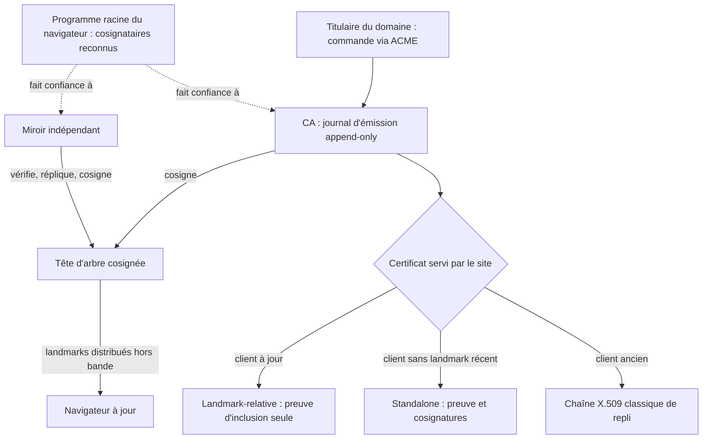
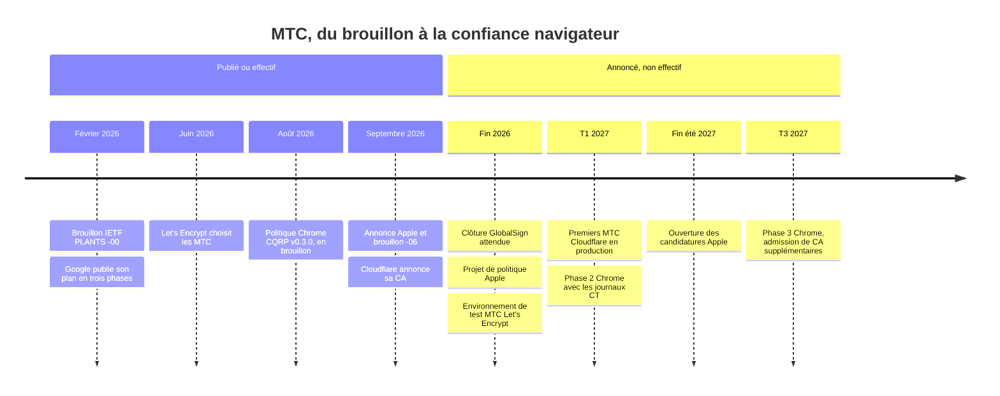
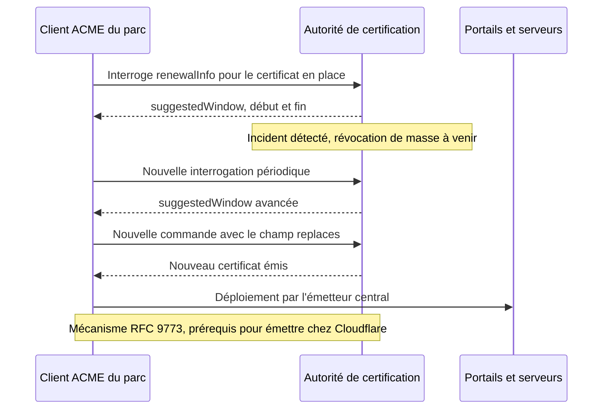

## Une signature invisible, des milliers de fois par jour

Quand un client d'hôtel ouvre la page de connexion au Wi-Fi, son téléphone accorde sa confiance, en quelques millisecondes et sans rien lui demander, à une entreprise dont il n'a jamais entendu parler. Ce tiers s'appelle une autorité de certification (CA, pour *Certificate Authority*) : l'organisme qui atteste qu'un nom de domaine appartient bien à celui qui le présente. Une poignée d'acteurs tiennent ce rôle pour tout le web. La liste bouge rarement.

Le 29 septembre, Cloudflare a annoncé vouloir y entrer. Il a demandé à Chrome, Apple, Microsoft et Mozilla de l'ajouter à leurs listes de confiance, signé pour reprendre une racine existante à GlobalSign et promis, pour le premier trimestre 2027, des certificats conçus pour résister aux futurs ordinateurs quantiques.

Pour une chaîne de 800 magasins, un groupe hôtelier ou un réseau de résidences étudiantes, le sujet n'a rien d'académique. Chaque portail invité, chaque console d'administration exposée, chaque interface de supervision porte un certificat. Il faut le renouveler sur des centaines de sites, sans jamais couper un client en pleine connexion.

Les titres de la semaine parlent de cryptographie quantique. Ils regardent la vitrine. Le vrai filtre se cache dans les petites lignes : Cloudflare n'émettra qu'aux abonnés dont l'outillage sait renouveler seul, au moment choisi par la CA. La condition d'entrée, ce n'est pas le post-quantique. C'est l'automatisation du renouvellement, et celle-là doit se prouver dès maintenant, pas en 2027.

## Ce que dit le communiqué, et ce qu'il tait

Le cadenas HTTPS a deux serrures. La première garantit que personne n'écoute : c'est le chiffrement, dont la version post-quantique hybride se mesure déjà segment par segment, du client jusqu'au serveur d'origine, comme je l'expliquais dans [mon dernier article](https://wifirst-tech-blog.web.app/post?slug=chiffre-pas-post-quantique-mesurer-ecart-client-origine). La seconde garantit que vous parlez au bon interlocuteur : c'est l'authentification. Elle repose sur les CA et n'a pas encore de version post-quantique reconnue par les navigateurs. C'est cette serrure-là que Cloudflare veut fabriquer.

Le [communiqué du 29 septembre](https://www.cloudflare.com/press/press-releases/2026/cloudflare-announces-public-certificate-authority-for-the-post-quantum-web/), repris par [SiliconANGLE](https://siliconangle.com/2026/09/29/cloudflare-to-become-a-public-certificate-authority-with-post-quantum-certificates/) et [Help Net Security](https://www.helpnetsecurity.com/2026/09/30/cloudflare-certificate-authority-2027/), tient en quelques points. Cloudflare a demandé son inclusion dans les programmes racine des quatre grands éditeurs. Il a signé un accord définitif pour acquérir auprès de GlobalSign du matériel de clé racine déjà reconnu, avec une clôture attendue sous deux mois, soit vers fin novembre. Les certificats classiques suivront la fin du processus d'adhésion, sans date. Les certificats post-quantiques au format MTC (*Merkle Tree Certificates*) sont attendus en production au premier trimestre 2027. Matthew Prince, son patron, y voit « one of the biggest coordination challenges in the history of the Internet ». Difficile de lui donner tort.

Ce qui manque est tout aussi parlant. Ni le prix, ni l'identité exacte de la racine, ni le rôle futur de GlobalSign n'ont été publiés, relève [ppc.land](https://ppc.land/cloudflare-targets-q1-2027-for-its-first-quantum-safe-web-certificates/). Tarif et ouverture aux non-clients restent flous : seul le billet technique évoque une « standard MTC issuance at no cost », ce qui ne dit rien des certificats classiques. Surtout, aucun certificat n'est disponible aujourd'hui. C'est une feuille de route, pas un produit.

Le cœur du dispositif est ailleurs, dans le [billet de Steve Goldsmith](https://blog.cloudflare.com/cloudflare-certificate-authority/) sur le blog de Cloudflare. Le mot ACME, absent du communiqué, y structure tout. ACME (*Automatic Certificate Management Environment*) est le protocole popularisé par Let's Encrypt qui permet à un serveur d'obtenir et de renouveler ses certificats sans intervention humaine. Cloudflare se veut « ACME-first » : venir d'une autre CA reviendrait à changer l'URL de *directory* dans son client.

Puis vient la phrase qui compte : « Subscribers must maintain automation that polls our renewal endpoint, acts on the renewal windows we publish, and identifies the certificate it is replacing ». En clair, Cloudflare n'émettra qu'aux clients qui supportent ARI (*ACME Renewal Information*, normalisé par la RFC 9773). Pas d'ARI, pas de certificat.

Le [second billet](https://blog.cloudflare.com/pq-ca-with-mtcs/), plus technique, ajoute que l'infrastructure ACME sera un fork de Boulder, le logiciel de Let's Encrypt. Le premier billet promet aussi des builds reproductibles, une attestation des HSM (les boîtiers matériels qui protègent les clés) et un tableau de bord public des incidents, que mentionne également le communiqué. Pour les appareils anciens, une racine reconnue depuis 2012 ; pour les programmes qui plafonnent l'âge des racines, une seconde, toute neuve.

## Un registre notarié plutôt qu'un tampon par acte

Pourquoi ne pas glisser une signature post-quantique dans le certificat actuel ? Parce qu'elle pèse trop lourd. Une signature ML-DSA-44, l'algorithme normalisé par le NIST dans [FIPS 204](https://csrc.nist.gov/pubs/fips/204/final) en août 2024, occupe 2 420 octets, contre 64 pour ECDSA P-256 : environ 38 fois plus, comme je l'ai [détaillé cet été](https://wifirst-tech-blog.web.app/post?slug=signature-post-quantique-ml-dsa-cloudflare).

Or une connexion n'en transporte pas une, mais plusieurs : celle du certificat, plus celles qu'exige la Certificate Transparency (CT), ces journaux publics où toute CA doit consigner ce qu'elle émet. Chaque preuve de consignation, un SCT (*Signed Certificate Timestamp*), est elle-même une signature. Chacune prendrait le même embonpoint.

Les Merkle Tree Certificates prennent le problème à l'envers. Imaginez un notaire qui, au lieu de tamponner chaque acte, inscrit tous les actes de la journée dans un registre et ne signe que la page. Pour prouver que votre acte existe, plus besoin de tampon : vous montrez la ligne du registre et le chemin qui la relie à la page signée. Un second notaire, indépendant, recopie le registre et contresigne la page. Si le premier triche, le second le voit.

*Un MTC ne porte plus de tampon individuel : il prouve sa place dans un registre que deux parties indépendantes ont scellé.*

C'est la mécanique que décrit le [brouillon IETF](https://datatracker.ietf.org/doc/draft-ietf-plants-merkle-tree-certs/). Chaque CA tient un journal *append-only* (on ajoute, on n'efface jamais) de tout ce qu'elle émet, organisé en arbre de Merkle : chaque nœud y résume, par hachage, ceux du dessous. Un certificat devient une preuve d'inclusion dans cet arbre, plus les cosignatures de sa tête. Celle de la CA, et celles de cosignataires qui vérifient le journal et peuvent le répliquer, d'où leur nom de miroirs. La journalisation étant intégrée à l'émission, les SCT séparés disparaissent.

Reste l'astuce qui fait gagner le plus de place : les *landmarks*, des têtes d'arbre de référence que le navigateur reçoit à l'avance, hors connexion, environ chaque semaine dans le modèle de l'[expérience menée avec Chrome](https://blog.cloudflare.com/bootstrap-mtc/). Si le navigateur détient déjà la page signée, le serveur n'envoie que la ligne et le chemin. Aucune signature dans le certificat. Le brouillon appelle ce format *landmark-relative* et en annonce honnêtement le prix : il fonctionne « at the cost of only applying to up-to-date relying parties and older certificates ». Les clients en retard reçoivent la forme *standalone*, plus lourde, qui embarque l'arbre cosigné et la preuve.

*Qui fait confiance à qui : la confiance ne repose plus sur une signature par certificat, mais sur des têtes d'arbre cosignées par des parties que le navigateur reconnaît.*

Les chiffres de la version -03 du brouillon donnent l'ordre de grandeur. Avec ML-DSA-44, la preuve d'inclusion d'un certificat landmark-relative pèse 736 octets (23 hachages, sans aucune signature, pour un nouveau landmark par heure), contre 2 420 pour une seule signature. Le texte la décrit comme « almost ten times smaller than the three ML-DSA-44 signatures necessary to include post-quantum SCTs ». Attention au périmètre : on compare à trois signatures de SCT, pas à une chaîne de certificats entière.

*736 octets de preuve d'inclusion contre 2 420 pour une seule signature ML-DSA-44 : le gain vient de tout ce qu'on n'envoie plus.*

Sur le terrain, Cloudflare et Chrome testent le modèle depuis le 28 octobre 2025. L'expérience a ensuite tourné sur Chrome Beta 146, auprès de 50 % des utilisateurs de cette Beta, pour une sélection de domaines du plan gratuit de Cloudflare. Cloudflare dit avoir servi des milliards de MTC (« billions » dans le texte) et mesure, à la médiane, un MTC landmark 9 % plus rapide qu'une chaîne classique. C'est une mesure de l'éditeur, sur un échantillon choisi, avec des certificats classiques en secours. Elle montre que le modèle tient la route. Elle ne dit pas que les MTC accélèrent le web de 9 %.

Dernier détail, et pas le moindre : tout cela reste un brouillon. Le document `draft-ietf-plants-merkle-tree-certs` est porté par le groupe PLANTS (*PKI, Logs, And Tree Signatures*). Il a connu sept versions depuis février ; la -06, du 21 septembre, expire le 25 mars 2027, sans statut de RFC arrêté. Les auteurs de la -03 viennent de Google, d'Apple, de Cloudflare et de Geomys. Un texte qui change tous les un à deux mois n'est pas un standard. C'est un chantier.

## Premier trimestre 2027 n'est pas synonyme de confiance universelle

Une CA peut émettre tous les certificats qu'elle veut. Si le navigateur ne les reconnaît pas, l'utilisateur voit un écran d'alerte et ferme l'onglet. La date qui compte n'est donc pas celle du premier MTC signé par Cloudflare, mais celle où Chrome, Safari et les autres l'accepteront sans filet. Or les calendriers publiés ne racontent pas la même histoire que le communiqué.

Côté Google, la [politique du Chrome Quantum-resistant Root Program](https://googlechrome.github.io/chromerootprogram/cqrp/draft-policy/) (CQRP) en est à la version 0.3.0, datée du 14 août 2026 et marquée DRAFT. Elle exige au moins deux cosignatures par tête d'arbre, celle de la CA et celle d'un miroir indépendant reconnu par Chrome, des clés protégées en HSM certifiés et l'algorithme ML-DSA-44.

Deux lignes parlent directement aux exploitants. Les certificats d'abonné « MUST be able to be issued and retrieved using an ACME-based service ». Et une validation de domaine ne se réutilise que 10 jours. Le texte fixe aussi des validités maximales de certificat d'abonné de 7 jours (premier cosignataire de CA actif) et de 47 jours (cosignataires optionnels 2 à 4), toujours en brouillon. Enfin, Chrome n'ajoutera pas à son magasin racine classique de certificats X.509 traditionnels embarquant du post-quantique : pour le web public, sa voie passe par les MTC.

Le [calendrier de Google](https://blog.google/security/cultivating-a-robust-and-efficient-quantum-safe-https/), publié le 27 février 2026, compte trois phases. La première, en cours, est une étude de faisabilité avec Cloudflare, adossée à des certificats X.509 de secours. La deuxième, au premier trimestre 2027, invitera les opérateurs de journaux CT à amorcer des MTC publics. La troisième, au troisième trimestre 2027, finalisera les exigences d'admission de CA supplémentaires dans le magasin quantique de Chrome (le CQRS, *Chrome Quantum-resistant Root Store*), ainsi que les protections contre le *downgrade*, ce repli forcé vers un format plus faible.

Le 21 septembre, [Apple](https://groups.google.com/a/chromium.org/g/ct-policy/c/QGZw2ADMXvk/m/pR3A5uRZCAAJ) a annoncé sa propre politique MTC pour les serveurs TLS. Le projet de texte est attendu fin octobre : c'est donc encore une intention. D'après l'annonce et la [synthèse de PostQuantum.com](https://postquantum.com/security-pqc/apple-mtc-policy-post-quantum/), elle va plus loin que Chrome. Trois cosignatures par certificat (ML-DSA et ECDSA P-256 de l'émetteur, ML-DSA d'un miroir distinct), des HSM FIPS 140-3 niveau 3, des audits annuels. Et une validité plafonnée à 7 jours, qu'au moins un participant a contestée sur la liste de discussion. Les candidatures d'opérateurs ouvriront à la fin de l'été 2027.

[Let's Encrypt](https://letsencrypt.org/2026/06/03/pq-certs) a pris la même voie le 3 juin : environnement de test fin 2026, production prête en 2027. Pour ses abonnés, « nothing changes today », mais ACME devra évoluer. L'organisation participe aux groupes PLANTS et ACME de l'IETF et, selon le billet Cloudflare, développe le support MTC dans Boulder.

Ma lecture, et c'est une inférence de ma part, pas une annonce : le premier trimestre 2027 sera celui des premiers MTC Cloudflare en production, pas celui d'une confiance générale. Le billet technique vise une inclusion dans le CQRS en début d'année. Mais Google ne finalisera l'admission des CA supplémentaires qu'au troisième trimestre, et Apple n'ouvrira ses candidatures qu'à la fin de l'été. Rien, dans les calendriers publiés, ne garantit une confiance MTC large côté navigateurs avant le second semestre 2027. Sans même parler des terminaux qui ne se mettent jamais à jour.

*Les jalons publiés. Ma lecture : entre la première émission annoncée et une confiance navigateur généralisée, il reste au moins deux trimestres.*

Une ligne, en revanche, est commune à tous. Chrome inscrit ACME en MUST dans son brouillon. Google recommande des « ACME-only workflows ». Let's Encrypt prévient que le protocole va évoluer. Cloudflare impose ACME et ARI. Le format reste incertain ; le mode d'émission, lui, est déjà tranché.

## ARI, le péage qui n'a rien de quantique

Imaginez un vendredi soir. Une CA découvre un défaut dans sa chaîne d'émission et doit révoquer des milliers de certificats en quelques jours. Sans automatisation, chaque abonné reçoit un e-mail ; la moitié le lit lundi, l'autre découvre la panne quand les utilisateurs appellent. Avec ARI, la CA avance la date de renouvellement conseillée, et les serveurs renouvellent seuls, avant la révocation. Personne ne passe son week-end au téléphone.

C'est l'objet de la [RFC 9773](https://www.rfc-editor.org/rfc/rfc9773.html), publiée en juin 2025 sur la voie des standards par A. Gable, de l'ISRG, l'organisation qui opère Let's Encrypt (laquelle y a consacré un [billet en mars 2026](https://letsencrypt.org/2026/03/17/acme-renewal-information-ari)). Le client interroge un point d'accès `renewalInfo` pour chaque certificat. La CA répond par une `suggestedWindow`, une fenêtre avec un début et une fin. À la commande suivante, le client renseigne le champ `replaces` pour désigner le certificat remplacé. La RFC cite explicitement le cas d'une CA qui suggère un renouvellement anticipé avant une révocation de masse.

Soyons clairs : ARI n'a rien de post-quantique. C'est un signal de renouvellement, un outil de réponse aux incidents et d'étalement de la charge. Le communiqué met en avant une « zero-downtime incident response » au fil d'un récit post-quantique, et l'amalgame est tentant. Les deux sujets sont liés par le calendrier, pas par la cryptographie.

Pourquoi en faire une condition d'accès ? Mon hypothèse : une CA neuve, qui entre dans un écosystème où Apple envisage des validités de 7 jours, ne peut pas dépendre d'abonnés qui renouvellent quand ils y pensent. Elle veut pouvoir faire tourner toute sa base d'un coup, sans attendre la réactivité humaine. Je trouve ce choix sain. Il est aussi exigeant.

*Le cycle ARI décrit par la RFC 9773 : la CA fixe le tempo, le client exécute.*

Concrètement, ARI exige trois choses d'un parc. D'abord, un client ACME compatible, et prudence : les tableaux de compatibilité qui circulent pour certbot, cert-manager, acme.sh, Caddy ou lego se contredisent d'une source à l'autre. Vérifiez dans les dépôts officiels, version par version, et testez en préproduction. Ensuite, un ordonnanceur qui interroge réellement le point d'accès. La tâche planifiée qui renouvelle *à trente jours de l'échéance* ne suffit plus, puisque c'est la CA qui fixe le moment et qu'elle peut le déplacer.

Enfin, un émetteur central qui sait quel certificat en remplace un autre, sur quel équipement, avec quelle clé de compte. J'ai détaillé [la gouvernance de cette clé de compte ACME](https://wifirst-tech-blog.web.app/post?slug=dns-persist-01-google-trust-services-cle-compte-acme) dans un précédent article. Notons seulement que les 10 jours de réutilisation de validation du brouillon Chrome rejoignent la cible fixée pour 2029 par le [ballot SC-081](https://cabforum.org/2025/04/11/ballot-sc081v3-introduce-schedule-of-reducing-validity-and-data-reuse-periods/) du CA/Browser Forum.

## Portails captifs, vieux terminaux et PKI privée : où passe la frontière

Première frontière, pour éviter les faux chantiers : les MTC concernent la PKI publique du web, l'infrastructure à clés publiques que vérifient les navigateurs. Les certificats qui authentifient un terminal sur un Wi-Fi d'entreprise (802.1X avec EAP-TLS), ceux de la flotte d'équipements ou ceux des échanges entre services internes (mTLS) relèvent d'une PKI privée. Ils ne sont pas concernés. Google a d'ailleurs annoncé, séparément, la prise en charge de certificats X.509 post-quantiques de forme classique pour les PKI privées, plus tard en 2026.

En face, la liste des noms publics à inventorier est plus longue qu'on ne le croit : portail captif invité, API de supervision exposées, consoles web d'administration, back-offices partagés avec des partenaires. Ce sont eux qui vivront dans le monde ACME, ARI et, un jour, MTC.

Deuxième réalité : un parc Wi-Fi accueille tout ce qui existe. Le smartphone récent d'un client d'hôtel, la tablette jamais mise à jour d'un étudiant, un vieux portable, un objet connecté. Le modèle MTC suppose des clients à jour ; les autres recevront la forme standalone ou une chaîne classique de repli. C'est d'ailleurs pour eux que Cloudflare met en avant sa racine reconnue depuis 2012. Sur un parc aussi hétérogène, je m'attends à ce que le repli soit fréquent, pas exceptionnel.

*Sur des centaines de sites, le renouvellement ne peut plus dépendre d'un humain qui surveille l'agenda.*

Troisième point, que je formule comme une hypothèse à tester et non comme un fait : le portail captif. Cloudflare cite lui-même les clients « newly installed, offline, or missing the relevant landmark update » parmi les cas de repli. Or un terminal derrière un portail captif, avant authentification, ne voit qu'un jardin clos (le *walled garden*, la courte liste de destinations autorisées avant connexion). Peut-il récupérer ses landmarks à ce moment-là ? Je n'ai trouvé aucune documentation qui réponde. Si c'est non, la page d'accueil Wi-Fi, celle de la première impression, pourrait servir la forme la plus lourde aux terminaux en retard. Cela se mesure en laboratoire, avec un téléphone fraîchement réinitialisé.

Dernier point, et c'est une opinion assumée : la concentration. Cloudflare présente la dépendance du web à Let's Encrypt comme un risque systémique, et une monoculture de CA est en effet fragile. Mais [techatelier.fr](https://techatelier.fr/en/blog/cloudflare-public-ca-post-quantum/) relève que l'annonce ne traite pas la concentration inverse, alors que Cloudflare termine déjà TLS pour une grande part du web. Le même acteur qui héberge le CDN, termine la session et signe le certificat, c'est un autre point unique de défaillance. La parade, Cloudflare la fournit lui-même : si arriver chez lui revient à changer l'URL de directory, en partir aussi. À condition d'avoir construit son émission pour ça.

## Cinq gestes avant le premier trimestre 2027

Comme le note techatelier.fr, il n'y a rien à configurer aujourd'hui, puisqu'aucun certificat n'existe encore. Mais six mois suffisent à peine pour préparer le terrain.

1. **Inventorier les noms publics et les clients qui les renouvellent.** Pas seulement les certificats : les outils, leurs versions, leurs propriétaires.
2. **Tester ARI en préproduction**, client par client, avec une CA qui le propose déjà. La source de vérité, ce sont les dépôts officiels.
3. **Centraliser l'émission**, avec des comptes ACME séparés par périmètre et une clé de compte gouvernée. C'est ce qui permet de changer de CA sans tout reconfigurer.
4. **Verrouiller CAA et surveiller CT.** Les enregistrements DNS CAA (*Certification Authority Authorization*) désignent les CA autorisées à émettre pour vos domaines. Décidez explicitement si Cloudflare y figure, et guettez toute émission inattendue dans les journaux CT.
5. **Ne rien promettre en *certificats post-quantiques*.** Cocher cette case dans un appel d'offres avant la confiance des navigateurs, c'est vendre un brouillon. Planifiez deux revues : fin du premier trimestre 2027, puis au troisième trimestre 2027.

## Surveiller le format, industrialiser le renouvellement

Ma position est simple. Les MTC sont une bonne idée, co-écrite par des ingénieurs de Google, d'Apple, de Cloudflare et de Geomys, et je pense qu'elle finira par s'imposer sur le web public. Mais le brouillon a connu sept versions depuis février, les politiques de Chrome et d'Apple restent des projets, et la confiance large prendra plusieurs trimestres. Migrer aujourd'hui, ce serait courir après une cible mouvante.

L'automatisation, elle, n'attendra pas. Cloudflare l'exige pour émettre, Chrome l'inscrit en MUST dans son brouillon, Google la recommande, et la course aux durées courtes la rend de toute façon inévitable. Un parc qui ne sait pas renouveler seul, au signal de la CA, se fermera la porte des nouvelles autorités avant même d'avoir décidé s'il voulait y entrer.

La CA du futur ne se choisit pas sur sa cryptographie. Elle se mérite par l'automatisation. Le post-quantique fera les titres de 2027 ; la question de cette semaine est plus prosaïque. Si votre CA vous demandait demain de renouveler tous vos certificats avant vendredi, combien le feraient sans qu'un humain intervienne ?

## Sources

1. Cloudflare, communiqué de presse sur son autorité de certification publique (29 septembre 2026) : https://www.cloudflare.com/press/press-releases/2026/cloudflare-announces-public-certificate-authority-for-the-post-quantum-web/
2. Steve Goldsmith, « Building a certificate authority for the whole Internet », blog Cloudflare (29 septembre 2026) : https://blog.cloudflare.com/cloudflare-certificate-authority/
3. Cloudflare, « Building a post-quantum certificate authority with Merkle Tree Certificates » (29 septembre 2026) : https://blog.cloudflare.com/pq-ca-with-mtcs/
4. Cloudflare, expérience MTC avec Chrome (28 octobre 2025) : https://blog.cloudflare.com/bootstrap-mtc/
5. IETF, draft-ietf-plants-merkle-tree-certs (datatracker ; texte de la version -03) : https://datatracker.ietf.org/doc/draft-ietf-plants-merkle-tree-certs/ et https://datatracker.ietf.org/doc/html/draft-ietf-plants-merkle-tree-certs-03
6. IETF, RFC 9773, ACME Renewal Information (ARI) Extension (juin 2025) : https://www.rfc-editor.org/rfc/rfc9773.html
7. Chrome Quantum-resistant Root Program Policy v0.3.0, brouillon (14 août 2026) : https://googlechrome.github.io/chromerootprogram/cqrp/draft-policy/
8. Google, billet sur les MTC et le Quantum-resistant Root Store (27 février 2026) : https://blog.google/security/cultivating-a-robust-and-efficient-quantum-safe-https/
9. Let's Encrypt, « A Post-Quantum Future for Let's Encrypt » (3 juin 2026) : https://letsencrypt.org/2026/06/03/pq-certs
10. Apple Root Program, annonce sur la liste ct-policy (21 septembre 2026) : https://groups.google.com/a/chromium.org/g/ct-policy/c/QGZw2ADMXvk/m/pR3A5uRZCAAJ
11. NIST, FIPS 204 (13 août 2024) : https://csrc.nist.gov/pubs/fips/204/final
12. CA/Browser Forum, ballot SC-081v3 (11 avril 2025) : https://cabforum.org/2025/04/11/ballot-sc081v3-introduce-schedule-of-reducing-validity-and-data-reuse-periods/
13. SiliconANGLE (29 septembre 2026) : https://siliconangle.com/2026/09/29/cloudflare-to-become-a-public-certificate-authority-with-post-quantum-certificates/
14. Help Net Security (30 septembre 2026) : https://www.helpnetsecurity.com/2026/09/30/cloudflare-certificate-authority-2027/
15. SC World : https://www.scworld.com/brief/cloudflare-announces-plans-for-post-quantum-certificate-authority
16. ppc.land, analyse de l'annonce : https://ppc.land/cloudflare-targets-q1-2027-for-its-first-quantum-safe-web-certificates/
17. techatelier.fr, analyse de l'annonce : https://techatelier.fr/en/blog/cloudflare-public-ca-post-quantum/
18. PostQuantum.com, sur la politique MTC d'Apple (septembre 2026) : https://postquantum.com/security-pqc/apple-mtc-policy-post-quantum/
19. Let's Encrypt, billet sur ARI (17 mars 2026) : https://letsencrypt.org/2026/03/17/acme-renewal-information-ari

_Vues personnelles, pas position Wifirst._
