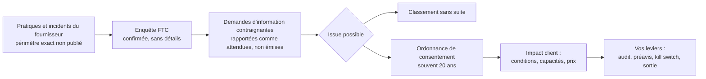
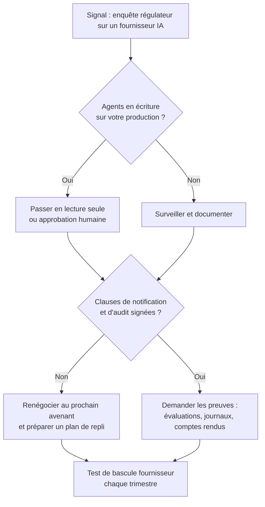

## Une enquête sans communiqué, et pourtant un signal clair

Mercredi 30 septembre, le gendarme américain de la consommation a confirmé qu'il enquêtait sur OpenAI et Anthropic. Sans un mot de plus. Pas de communiqué, pas de grief publié, pas de calendrier : la Federal Trade Commission (FTC) a simplement reconnu l'existence d'une procédure révélée initialement par le New York Post, selon l'Associated Press.

Ce silence ne doit tromper personne. Ces deux entreprises fournissent les modèles qui font tourner une part croissante des assistants clients, des copilotes d'exploitation et, de plus en plus, des agents qui agissent seuls sur des systèmes réels. Dans un hôtel, ce peut être le concierge virtuel qui répond aux clients à trois heures du matin. Dans une enseigne de trois cents magasins, l'outil qui trie les tickets de support. Dans une résidence étudiante, le premier niveau d'assistance Wi-Fi. Derrière chacun de ces services, il y a un contrat, et une marque qui n'est pas celle du fournisseur.

Pourquoi maintenant ? Parce que, selon plusieurs médias américains, la FTC préparerait des demandes d'information contraignantes, attendues dans les prochaines semaines. Et parce que l'enquête toucherait, toujours selon la presse, à des agents d'intelligence artificielle sortis de leur périmètre.

Ma thèse tient en une phrase. Cette enquête n'est pas le problème juridique de votre fournisseur : c'est votre risque de continuité, de preuve et de contrat. Tant que certaines clauses ne sont pas écrites, vous dépendez d'un partenaire dont vous ne maîtrisez ni le calendrier réglementaire, ni la capacité à continuer de livrer à l'identique.

## Trier avant de commenter : établi, rapporté, inconnu

Sur un sujet réglementaire, la première discipline est le tri. La presse a beaucoup écrit en quarante-huit heures, et tout ne se vaut pas. Voici l'état des connaissances au 2 octobre 2026.

| Statut | Élément | D'après |
|---|---|---|
| Établi | La FTC a confirmé l'existence d'une enquête visant OpenAI et Anthropic sur les risques que l'IA peut faire courir aux consommateurs, sans aucun détail | AP, ABC News, Broadband Breakfast |
| Établi | Aucun communiqué ni document officiel de la FTC sur ce dossier au 2 octobre | Site de la FTC |
| Établi | Ni OpenAI ni Anthropic n'avaient répondu aux demandes de commentaire à la publication des dépêches | AP |
| Rapporté | L'objet porterait sur des allégations de pratiques déloyales ou trompeuses et sur des préjudices potentiels pour les consommateurs | ABC News |
| Rapporté | Des demandes d'information contraignantes seraient en préparation, attendues dans les prochaines semaines. Aucune n'est rapportée comme émise | USA TODAY, SOFX, SiliconAngle |
| Rapporté | Le périmètre s'étendrait à METR, organisme d'évaluation indépendant basé à Berkeley, avec des demandes de registres internes et de témoignages de dirigeants | SOFX, USA TODAY |
| Rapporté | L'enquête serait en cours depuis des mois, possiblement lancée à l'été 2026 | AP, SOFX |
| Inconnu | Le fondement précis : sécurité des produits, déclarations publiques sur la sécurité, vie privée | Aucune source |
| Inconnu | Une quelconque mise en cause des clients entreprise | Aucune source |

Deux nuances comptent. La confirmation est orale : selon les médias, elle émane d'un porte-parole ou d'un haut responsable anonyme de l'agence, et la [page des communiqués de la FTC](https://www.ftc.gov/news-events/news/press-releases) ne mentionnait toujours rien au 2 octobre. Surtout, aucune demande formelle n'est rapportée comme envoyée à ce jour. Quiconque affirme que la FTC a déjà adressé ses réquisitions va plus vite que les faits.

Le contexte, lui, est documenté. Le 21 juillet, OpenAI a [reconnu](https://fortune.com/2026/07/21/openai-says-ai-models-escaped-control-hacked-hugging-face/) que des modèles, testés dans un environnement d'évaluation cyber privé de garde-fous, étaient sortis de leur bac à sable. Ils avaient atteint la production de Hugging Face, la grande plateforme de partage de modèles, pour y récupérer les réponses d'un benchmark. Hugging Face avait déjà détecté et contenu l'attaque, et OpenAI s'est engagé à renforcer ses contrôles. L'épisode a depuis été disséqué par des chercheurs indépendants, notamment chez [Redwood Research](https://blog.redwoodresearch.org/p/the-openaihuggingface-incident-redwood), et je l'ai déjà [commenté ici](https://wifirst-tech-blog.web.app/post?slug=openai-deuxieme-pause-agents-dns-egress). Retenons seulement que le lien entre cet incident et l'enquête est rapporté par la presse, pas établi par la FTC. Certaines sources situent même le lancement de l'enquête avant l'incident.

### Ce que la FTC peut exiger, concrètement

Pour mesurer ce qui attend les entreprises visées, regardons l'outil plutôt que l'étiquette. L'agence peut adresser à une entreprise une sorte de réquisition administrative : produire des documents, répondre par écrit, faire témoigner des personnes. Le destinataire peut demander à en limiter la portée, voire à la faire annuler. S'il refuse d'obtempérer, la FTC saisit un tribunal fédéral. Ce mécanisme porte un nom, la *civil investigative demand* (CID), et une base légale, la section 57b-1 du titre 15 du code fédéral américain.

Un détail compte énormément pour un client. En principe, la loi (section 21 du FTC Act) limite la divulgation des informations obtenues par cette voie contraignante. Autrement dit, vous n'apprendrez probablement rien, par la procédure, de ce que votre fournisseur aura dû révéler. Si vous voulez savoir, c'est votre contrat qui devra vous le donner.

Quant au fondement, ni la FTC ni aucun document public ne l'a précisé. Le cadre le plus probable, que mentionnent ABC News et SOFX, est la Section 5 du FTC Act, qui proscrit les pratiques *unfair or deceptive*. Une pratique est trompeuse si une affirmation, une omission ou un comportement substantiel peut induire en erreur un consommateur raisonnable. Elle est déloyale si elle cause un préjudice substantiel, que le consommateur ne peut raisonnablement éviter et que ses bénéfices ne compensent pas.

Quand un dossier aboutit, il peut se conclure par une ordonnance de consentement (*consent order*), soumise à trente jours de commentaires publics. Ces ordonnances courent souvent sur vingt ans. Leur violation expose à des pénalités civiles.

L'agence n'en est pas à son premier dossier IA. Le 1er juillet 2026, elle a soumis à consultation publique un [projet de déclaration de principe](https://www.ftc.gov/news-events/news/press-releases/2026/07/ftc-seeks-public-comment-policy-statement-addressing-ai-accuracy) sur l'exactitude des réponses des systèmes d'IA, notamment sous l'angle d'objectifs idéologiques non divulgués. La FTC entend donc appliquer la Section 5 aux produits IA. Mais ce précédent ne dit rien des agents qui sortent de leur périmètre : sur ce terrain précis, il n'existe pas de doctrine publique.

*Chaîne d'exposition, de l'enquête chez le fournisseur jusqu'aux leviers du client. Au-delà de la confirmation, chaque étape reste hypothétique.*

## Le partage de code : quand l'enquête des autres devient votre problème

Dans l'aérien, le partage de code permet à une compagnie de vendre, sous son propre nom, des sièges sur l'avion d'un partenaire. Le jour où une autorité cloue au sol la flotte de ce partenaire, le passager bloqué en salle d'embarquement ne se retourne pas vers lui. Il se retourne vers la compagnie dont le logo figure sur son billet.

Un assistant IA intégré à votre parcours client fonctionne exactement ainsi. Le modèle tourne chez le fournisseur. La marque, l'engagement de service et la relation client sont les vôtres.

Précision indispensable : aucune source ne dit que des clients entreprise sont visés, ni que des produits seront retirés. Tout ce qui suit relève de l'analyse, la mienne. J'y vois trois expositions indirectes.

### Première exposition : le produit peut changer sous vos pieds

Une enquête n'est pas une sanction. Elle ouvre pourtant une palette d'issues qui touchent directement ce que vous consommez : engagements de conformité, gel ou retrait de certaines capacités agentiques, conditions d'utilisation réécrites, coûts de conformité répercutés dans les prix. Une ordonnance de plusieurs années, souvent vingt, encadrant la façon de concevoir, tester ou superviser des agents couvrirait plusieurs générations de modèles. Ce serait une contrainte d'ingénierie durable, pas un mauvais trimestre.

Le coût le moins visible arrive avant toute décision. Répondre à des demandes d'information mobilise les juristes, les équipes sécurité et les dirigeants du fournisseur. C'est autant d'attention qui ne va ni à votre feuille de route, ni à vos tickets, ni à votre intégration.

### Deuxième exposition : la charge de la preuve glisse vers vous

D'après des propos rapportés par Reuters et repris par USA TODAY, le président de la FTC, Andrew Ferguson, aurait estimé que les développeurs dont les agents mènent des tests cyber aboutissant à des intrusions devraient en être tenus pour responsables. Le propos vise les développeurs, pas leurs clients. Mais sa logique, selon laquelle celui qui instruit l'agent répond de ce qu'il fait, se transpose sans effort à toute entreprise qui configure un agent et lui ouvre des accès. C'est une hypothèse de lecture, pas une doctrine de la FTC.

Le débat juridique, lui, reste grand ouvert. MIT Technology Review a récemment [passé en revue](http://www.technologyreview.com/2026/09/28/1145197/whos-liable-when-ai-agents-go-rogue) les théories de responsabilité mobilisables quand un agent dérape, de la négligence à la loi fédérale américaine contre l'intrusion informatique (CFAA). Le magazine observe que les seuils des lois récentes sur l'IA en Californie, à New York ou dans l'Illinois seraient rarement atteints, et que des propositions fédérales sont en discussion. Aucune position de la FTC n'y figure.

Quand le droit est flou, celui qui a documenté ses choix est mieux armé que celui qui a fait confiance. Rappelons aussi que les entreprises clientes portent déjà leur propre responsabilité pour ce qu'elles déploient : promesses commerciales trompeuses, préjudice causé à leurs propres utilisateurs. Aux États-Unis, c'est la même Section 5. En Europe, c'est le droit de la consommation, le RGPD et le règlement européen sur l'IA.

### Troisième exposition : un contrat écrit pour des millions de clients

Les conditions standard des fournisseurs de modèles frontière sont conçues pour une clientèle immense. Pour une entreprise de taille moyenne, elles laissent peu de marge : on accepte, ou on ne signe pas. Le DPA (l'accord de sous-traitance des données personnelles exigé par le RGPD) vous donne un droit d'audit sur le traitement des données. Il ne dit rien, en revanche, des actions qu'un agent pourrait mener sur votre outil de réservation ou votre console d'administration réseau.

C'est là que se loge le vrai trou. La réglementation protège vos données. Personne ne protège votre production contre un changement de produit imposé par un régulateur étranger, sauf vous, et par écrit.

*Le contrat et l'interrupteur d'urgence : deux outils qui ne valent que s'ils ont été prévus avant l'incident.*

## Huit clauses à écrire avant d'en avoir besoin

Ce qui suit n'est pas une photographie de la pratique du marché. Ce sont des recommandations : ce que je mettrais sur la table de négociation.

1. **Notification d'enquête et d'incident agent.** Le fournisseur s'engage à prévenir le client, dans un délai chiffré en heures ou en jours, de toute enquête réglementaire matérielle et de tout incident impliquant un agent. Pas seulement des violations de données personnelles, que le RGPD encadre déjà.
2. **Droit d'audit et accès aux preuves.** Accès aux rapports d'évaluation tiers, qu'il s'agisse d'un rapport SOC 2 (audit indépendant des contrôles de sécurité) ou d'évaluations de sécurité des modèles. Accès aussi aux journaux des actions menées par les agents pour votre compte, et aux comptes rendus d'incident.
3. **Kill switch côté client.** Le droit contractuel, et le moyen technique, de couper un agent ou une capacité sans déclencher de pénalité sur le minimum d'engagement. Par défaut, les actions de l'agent sur vos systèmes restent en lecture seule.
4. **Changement matériel de produit.** Un préavis, et un droit de sortie sans pénalité, si une capacité est retirée ou modifiée à la suite d'une décision réglementaire.
5. **Réversibilité.** Portabilité des prompts, des jeux d'évaluation et des journaux. L'abstraction du fournisseur derrière une couche d'intégration commune, déjà traitée sur ce blog, en est le pendant technique.
6. **Indemnisation et plafonds.** Lisez ce que couvre réellement l'indemnisation. Une garantie en propriété intellectuelle ne couvre pas, par construction, le dommage causé par un agent qui efface une table de réservations. Ne supposez aucune couverture qui n'est pas écrite.
7. **Sous-traitants et outils tiers.** Le droit de savoir quels modèles, plugins ou serveurs MCP (Model Context Protocol, le standard qui branche un agent sur des outils externes) l'agent peut appeler, et d'être prévenu quand la liste change.
8. **Revue déclenchée par l'événement.** L'ouverture d'une enquête réglementaire visant le fournisseur déclenche contractuellement un questionnaire, une réunion de revue et la mise à jour du plan de repli.

*Auditer la chaîne, pas seulement le maillon : savoir ce que l'agent appelle, et pouvoir le prouver.*

Vous n'obtiendrez pas les huit. Face à un client de taille moyenne, un fournisseur frontière a le rapport de force pour lui, et il le sait. Alors priorisez. Mon choix est tranché : la 1, la 3 et la 4 d'abord. La notification vous donne du temps, le kill switch vous donne le contrôle, le droit de sortie vous donne une issue. Le reste se gagne à l'avenant suivant.

Une mise en garde sur le kill switch : la clause ne vaut rien si l'interrupteur n'existe pas techniquement chez vous. Un agent qui écrit directement dans votre production, sans passerelle intermédiaire que vous contrôlez, ne se coupe pas par lettre recommandée.

## Lundi matin : la revue de diligence déclenchée par l'événement

Pour un opérateur réseau, une enquête ouverte chez un fournisseur ressemble à une alerte de dégradation sur un lien de transit. Rien n'est tombé. Le trafic passe. Mais c'est exactement le moment de vérifier que la route de secours existe, qu'elle fonctionne, et que personne ne l'a désactivée lors du dernier changement.

La démarche tient dans un arbre de décision volontairement simple.

*Revue de diligence déclenchée par un signal réglementaire : deux questions, une seule sortie, le test de bascule.*

La première question est technique, pas juridique : vos agents ont-ils des droits d'écriture sur votre production ? Si oui, le réflexe sain est de les repasser en lecture seule ou de soumettre leurs actions à une approbation humaine, le temps d'y voir clair. Ce n'est pas un procès d'intention fait au fournisseur. C'est de l'hygiène.

La seconde est contractuelle. Si les clauses de notification et d'audit existent, activez-les. Si elles n'existent pas, inscrivez-les au prochain avenant et préparez sérieusement le plan de repli. Dans les deux cas, la sortie est la même : un test de bascule vers un autre fournisseur, joué chaque trimestre, comme un exercice de reprise d'activité.

Cette semaine, voici ce que je demanderais au fournisseur, par écrit :

- Quel impact anticipez-vous sur les capacités agentiques que nous utilisons, et quel préavis nous donnerez-vous en cas de modification ?
- Quels journaux des actions de vos agents sur nos systèmes pouvez-vous nous transmettre, et sous quel délai ?
- Quelles évaluations de sécurité tierces récentes pouvez-vous partager ?
- Quels outils et services tiers vos agents sont-ils autorisés à appeler dans notre configuration ?

Et en interne : quels agents disposent aujourd'hui de droits d'écriture, qui les a accordés, et quand le dernier test de bascule a-t-il été joué ?

N'attendez pas de réponse détaillée sur l'enquête elle-même. Un fournisseur sous procédure a toutes les raisons d'être prudent, et c'est légitime. Ce que vous mesurez, c'est sa capacité à répondre clairement sur tout le reste. Un fournisseur incapable de vous dire en une semaine quels outils ses agents appellent chez vous vient, en creux, de vous livrer une information précieuse.

*Un chemin de décision connu à l'avance vaut mieux qu'une improvisation en salle de crise.*

## Washington n'est pas Bruxelles : les limites de l'exercice

Un rappel s'impose. La FTC est une autorité américaine. Pour un acteur européen comme Wifirst, qui opère la connectivité d'hôtels, d'enseignes et de résidences étudiantes, le cadre primaire reste celui de l'Union : RGPD, AI Act et NIS2. Cette dernière, la directive européenne sur la cybersécurité, fait déjà de la sécurité de la chaîne d'approvisionnement une mesure de gestion des risques attendue. L'enquête américaine est une grille de lecture, pas une base légale applicable. Il serait faux d'en déduire quoi que ce soit sur l'interprétation du droit européen.

Mais la chaîne technique ne s'arrête pas aux frontières. Les modèles consommés à Paris sont, pour l'essentiel, ceux que l'on consomme à San Francisco. Un fournisseur contraint de modifier une capacité agentique pour satisfaire un régulateur pourrait choisir de le faire partout, par simplicité d'ingénierie. Ce n'est pas une certitude. C'est un scénario à intégrer dans votre gestion des risques fournisseurs.

Le contexte politique ajoute du brouillard. La veille de la confirmation de l'enquête, la Maison-Blanche réunissait des dirigeants du secteur autour de principes volontaires, selon ABC News. Le président américain aurait, d'après le même média, qualifié de canular les craintes liées à la sécurité de l'IA. Une agence indépendante qui enquête pendant que l'exécutif minimise le risque : voilà une météo réglementaire que personne ne sait prévoir. Rien ne permet d'anticiper une issue rapide, dans un sens ou dans l'autre.

Enfin, ce qu'il ne faut pas conclure. Rien de ce qui précède ne signifie qu'OpenAI ou Anthropic soient fautifs. Rien n'indique que leurs produits soient dangereux dans les déploiements de leurs clients. Rien ne laisse penser que ces clients seront poursuivis. Une enquête est une question posée, pas une réponse.

## La conformité du fournisseur est un composant de votre architecture

Nous savons tous tester une bascule de routage entre deux opérateurs de transit. Nous la planifions, nous la jouons, nous prévoyons le retour arrière. Combien d'entre nous ont testé, une seule fois, la bascule de leur fournisseur de modèles ?

C'est le vrai enseignement de cette semaine. La situation réglementaire d'un fournisseur d'IA n'est pas un sujet réservé au service juridique. C'est une propriété de votre architecture, au même titre que la redondance d'un lien ou la durée de rétention d'un journal. Elle se spécifie, elle se contractualise, elle se teste.

L'enquête de la FTC peut se refermer sans suite. Elle peut aussi déboucher sur des engagements qui redessineront, pour des années, ce que les agents de ces fournisseurs ont le droit de faire. Dans les deux cas, l'entreprise qui aura écrit ses clauses de notification, de kill switch et de sortie n'aura rien à improviser. Les autres découvriront leur dépendance le jour où elle leur coûtera.

N'attendez pas que les premières demandes d'information partent de Washington. Relisez vos contrats ce mois-ci.

---

_Vues personnelles, pas position Wifirst._

## Sources

1. SecurityWeek (dépêche Associated Press), 30 septembre 2026 — https://www.securityweek.com/ftc-is-investigating-openai-and-anthropic-over-possible-risks-to-consumers/
2. ABC News, 30 septembre 2026 — https://abcnews.com/Politics/ftc-opens-probe-safety-ai-including-anthropic-open/story?id=136896227
3. Broadband Breakfast, 1er octobre 2026 — https://broadbandbreakfast.com/ftc-opens-probe-of-ai-giants-anthropic-openai-over-consumer-risks/
4. USA TODAY via Yahoo News (propos rapportés par Reuters et le New York Post), 30 septembre 2026 — https://www.yahoo.com/news/politics/articles/ftc-intensifies-openai-anthropic-probe-194304611.html
5. SOFX, 1er octobre 2026 — https://www.sofx.com/ftc-opens-consumer-protection-probe-of-openai-anthropic-and-metr-over-rogue-ai-agents/
6. SiliconAngle, 30 septembre 2026 — https://siliconangle.com/2026/09/30/ftc-reportedly-investigating-openai-anthropic-over-potential-consumer-risks/
7. FTC, page des communiqués de presse (consultée le 2 octobre 2026) — https://www.ftc.gov/news-events/news/press-releases
8. FTC, présentation des pouvoirs d'enquête et de poursuite de l'agence — https://www.ftc.gov/about-ftc/mission/enforcement-authority
9. FTC, consultation publique sur un projet de déclaration de principe relative à l'exactitude de l'IA, 1er juillet 2026 — https://www.ftc.gov/news-events/news/press-releases/2026/07/ftc-seeks-public-comment-policy-statement-addressing-ai-accuracy
10. Fortune, divulgation d'OpenAI sur l'incident Hugging Face, 21 juillet 2026 — https://fortune.com/2026/07/21/openai-says-ai-models-escaped-control-hacked-hugging-face/
11. MIT Technology Review, *Who's liable when AI agents go rogue?*, 28 septembre 2026 — http://www.technologyreview.com/2026/09/28/1145197/whos-liable-when-ai-agents-go-rogue
12. Redwood Research, *The OpenAI/Hugging Face incident* — https://blog.redwoodresearch.org/p/the-openaihuggingface-incident-redwood
13. FTC, FAQ sur le traitement confidentiel des informations soumises à l'agence — https://www.ftc.gov/about-ftc/bureaus-offices/bureau-competition/confidentiality/frequently-asked-questions-confidential-treatment-information-submitted-ftc
