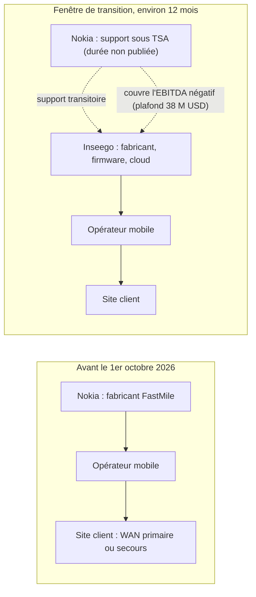
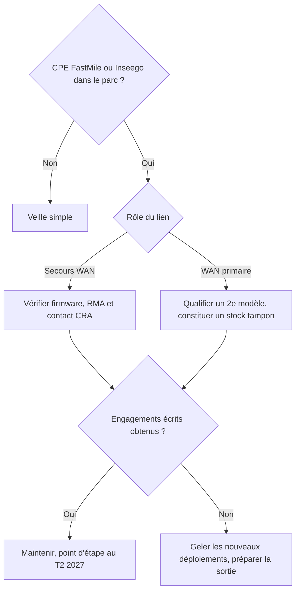

## Un boîtier blanc, un nouveau garant

Dans beaucoup de locaux techniques, il y a un petit boîtier blanc que personne ne regarde. Il est posé entre la baie de brassage et le compteur électrique d'un hôtel, d'une boutique ou d'une résidence étudiante. Il fait le métier le plus ingrat du réseau : prendre le relais quand la fibre tombe, ou la remplacer quand elle n'est pas encore arrivée.

Le 1er octobre 2026, une partie de ces boîtiers a changé de garant sans changer d'une vis. Nokia a finalisé la cession de son activité d'accès fixe sans fil (FWA, pour *fixed wireless access* : une box qui tire sa connexion du réseau mobile 4G/5G plutôt que d'un câble) à l'américain Inseego. La gamme s'appelle FastMile. Elle représente environ 200 M USD de chiffre d'affaires annuel. Son repreneur, lui, en faisait 166,2 M USD en 2025.

Pour une DSI qui gère des dizaines de sites, l'événement est discret. Rien ne casse demain matin. Mais une fenêtre d'environ douze mois s'ouvre, pendant laquelle tout ce qui entoure le boîtier (support, mises à jour, correctifs de sécurité, échanges sous garantie) passe d'un grand groupe qui voulait s'en séparer à un spécialiste plus petit, aux finances serrées.

Ma thèse tient en une phrase. Ce rachat ne se juge pas sur le communiqué, il se juge sur les douze prochains mois de support. Si votre parc contient ces équipements, c'est maintenant qu'il faut poser les questions, et les poser par écrit.

## Ce qui change vraiment de mains

Commençons par le périmètre, parce que c'est là que les résumés ont le plus arrondi. Nokia cède la quasi-totalité des actifs de son activité FWA : des CPE (*customer premises equipment*, l'équipement installé chez le client) en version intérieure, extérieure et millimétrique. Le mmWave, ce sont des bandes radio très hautes, capables de gros débits sur de courtes distances. Inseego reprend aussi certains passifs liés à l'activité, dont le montant n'est pas publié.

Ce qui n'est pas dans le carton compte autant. Les hotspots MiFi, les routeurs entreprise Wavemaker et le cloud de gestion Inseego Connect ne viennent pas de Nokia. Ils étaient déjà au catalogue d'Inseego avant l'opération. Les confondre, c'est se tromper de risque.

| Brique | Statut au 1er octobre 2026 | Ce qu'il faut en retenir |
|---|---|---|
| CPE FastMile : gateways Wi-Fi 6 et Wi-Fi 7 tri-bande, récepteur outdoor haut gain, récepteur mmWave et CBRS (bande partagée américaine), récepteur auto-installable | Acquis par Inseego | Le cœur de la transaction |
| Passifs associés à l'activité | Repris, montant non publié | Les garanties en cours sont à vérifier |
| Hotspots MiFi, routeurs Wavemaker, cloud Inseego Connect | Déjà chez Inseego avant le deal | Hors périmètre Nokia |
| Pile logicielle Corteca de Nokia | Non confirmée dans le périmètre | Qui maintient l'OS des FastMile installés ? |
| Environ 250 personnes associées à l'activité | Salariés transférés et personnel Nokia sous accord transitoire | Ce ne sont pas 250 recrues |

Le point le plus flou concerne le logiciel. Nokia présentait sa pile Corteca comme le moteur de la gamme FastMile Wi-Fi 7. Le communiqué de closing, lui, ne la cite pas. Il parle seulement de rendre le système d'exploitation et le cloud d'Inseego interopérables avec certains écosystèmes technologiques de Nokia, un chantier financé par un paiement de 10 M USD. Traduction opérationnelle : personne n'a dit publiquement qui écrira le prochain firmware d'une gateway FastMile déjà posée dans un hall d'hôtel.

Côté prix, l'histoire est presque cruelle. Pour les actifs, Inseego a émis 1 163 693 actions et 521 139 bons de souscription (*warrants*). En parallèle, Nokia a investi 10 M USD en numéraire contre 775 795 actions supplémentaires et d'autres warrants. Au total, environ 1,9 M d'actions nouvelles, soit près de 11 % du capital, et environ 0,8 M de warrants à échéance du 1er octobre 2030.

Le 30 avril, jour de la signature, le titre Inseego bondissait d'environ 30 % à 19,21 USD, et la presse valorisait l'actif autour de 20 M USD. Au closing, le prix d'exercice des warrants, fixé à 12,89 USD en avril, a été recalé à 4,26 USD : la moyenne des cours pondérée par les volumes sur trente jours, arrêtée au 25 septembre. De 19,21 USD à une moyenne de 4,26 USD, le titre a perdu environ 78 % en cinq mois, et aucune de mes sources n'en établit la cause. À ce niveau, les actions remises pour les actifs valent environ 5 M USD (calcul de l'auteur).

Ajoutez-y les chèques que Nokia continue de signer après la vente, et le montage ressemble moins à une vente qu'à une sortie accompagnée. Un analyste d'Info-Tech cité par RCR Wireless y lit un prix de sortie plutôt qu'un partenariat. C'est cohérent avec la stratégie affichée : dès novembre 2025, Nokia avait rangé le FWA parmi ses activités à céder, pour se concentrer sur l'infrastructure du supercycle de l'IA.

*Le périmètre cédé se limite aux CPE FWA de Nokia : hotspots, routeurs entreprise et cloud de gestion étaient déjà chez Inseego.*

## Une box 5G n'est pas un périphérique

Imaginez que le constructeur de votre flotte de camionnettes cède sa branche utilitaires à un spécialiste bien plus petit. Les véhicules roulent toujours. Le moteur n'a pas bougé d'un boulon. La vraie question surgit le jour d'un rappel de sécurité : qui envoie le courrier, qui a les pièces en stock, qui décroche quand une camionnette tombe en panne un dimanche soir sur l'autoroute ?

Un CPE FWA, c'est exactement cela. La fiche technique ne change pas. Ce qui change, c'est le réseau de garages.

Un analyste d'Info-Tech Research Group, cité par RCR Wireless, pose bien le problème. Pour lui, la box FWA n'est pas un accessoire mais le point d'ancrage de la connectivité du site : les mises à jour de firmware passent par elle, l'interopérabilité avec l'opérateur mobile en dépend. Quand son fabricant change, la décision devient à la fois un sujet d'achat, de sécurité et de continuité. Je partage cette lecture, et je la déclinerais selon les trois rôles que joue le FWA chez un exploitant multi-sites.

**Le secours WAN.** Derrière l'accès fibre principal, la box 4G/5G prend le relais en cas de coupure. C'est le rôle le plus traître, parce qu'un lien de secours ne prévient jamais qu'il est mort. Il le révèle le jour où on en a besoin. Un firmware qui n'est plus maintenu, une incompatibilité apparue après une évolution du cœur de réseau de l'opérateur, et la bascule échoue au pire moment.

**Le WAN primaire.** Boutique éphémère, chantier, résidence qui attend sa fibre, site rural : la box devient le point unique de défaillance. Il n'y a aucun plan B derrière elle.

**Le transport des flux critiques.** Terminal de paiement, PMS (le logiciel de gestion hôtelière), portail captif d'accueil des clients Wi-Fi : quand ces flux empruntent la 5G, la qualité du firmware et la compatibilité avec l'opérateur conditionnent directement l'activité du site.

Le sujet n'est pas seulement américain. Selon Light Reading (seule source que j'aie trouvée sur ce point), Inseego hérite de clients opérateurs comme Bharti Airtel, NBN, EOLO, Telia, Rogers et Orange France, en plus d'AT&T, T-Mobile et Verizon aux États-Unis. Si vous consommez une offre de 5G fixe via un opérateur, votre interlocuteur reste l'opérateur. Mais la chaîne qui se trouve derrière lui a changé de mains, et son contrat avec le fabricant n'est pas le vôtre.

## Le vrai contrat se lit dans les annexes

Le communiqué promet la continuité. Les dépôts auprès de la SEC, le régulateur boursier américain, décrivent plutôt un pari.

Sur le papier, le discours rassure. Nokia assurera le support pendant la transition et orientera les nouvelles opportunités FWA vers Inseego, et les clients existants conserveront le même accompagnement. Mais aucune durée de support, aucune politique firmware, aucun niveau de service chiffré n'a été publié. Le communiqué contient d'ailleurs, comme l'exige l'exercice, sa liste de risques : perte de clients, de fournisseurs ou de salariés, intégration ratée. Quatre mécanismes méritent qu'on s'y arrête.

**Un accord de transition sans date de fin publique.** Les quelque 250 personnes rattachées à l'activité mêlent des salariés qui rejoignent Inseego et du personnel Nokia qui continue de soutenir le produit sous TSA (*transition services agreement*, accord de services transitoires). La durée de ce TSA n'est pas publiée. Or c'est elle qui fixe le jour où votre ticket cessera d'être traité par une équipe qui connaît le produit depuis des années. Inseego ouvre un siège international à Amsterdam et un centre de développement à Athènes, renforce Bangalore, et confie l'EMEA à Ossi Korpela. Bonne nouvelle pour la proximité. Mais au 1er janvier, quelle file d'attente, quelle langue, quel fuseau horaire ?

**Un filet de 38 M USD, puis un partage.** Si l'EBITDA (le résultat opérationnel avant amortissements) de l'activité FWA est négatif sur les douze premiers mois, Nokia rembourse la perte chaque trimestre, jusqu'à 38 M USD. Ensuite, pendant 24 mois, Inseego reverse à Nokia de 0 à 50 % de l'EBITDA positif, selon des paliers de chiffre d'affaires. S'y ajoutent un second paiement de 10 M USD dû d'ici le 15 octobre pour l'effort d'ingénierie, une non-concurrence mondiale de trois ans qui interdit à Nokia de développer ou de vendre les produits FWA concernés, et un blocage de ses titres Inseego : la moitié pendant un an, l'autre moitié pendant deux ans.

Ma lecture, et c'est une interprétation : on ne tend pas un tel filet sous une activité qu'on croit rentable dès le premier jour. Les deux parties anticipent une année fragile, et Nokia reste économiquement intéressé au succès. C'est plutôt rassurant pour l'année 1. La vraie question, c'est l'année 2, quand le filet disparaît.

**Un repreneur à la marge de manœuvre étroite.** Voici les chiffres d'Inseego avant l'arrivée de FastMile.

| Indicateur Inseego | Valeur | Période ou date |
|---|---|---|
| Chiffre d'affaires | 44,0 M USD | T2 2026 (clos le 30/06) |
| EBITDA ajusté | 0,5 M USD | T2 2026 |
| Résultat net GAAP | perte de 8,4 M USD | T2 2026 |
| Trésorerie | 1,88 M USD (contre 24,9 M au 31/12/2025) | 30/06/2026 |
| Baisse de trésorerie | 23,0 M USD (dont 22,1 M consommés par l'exploitation) | 1er semestre 2026 |
| Ligne de crédit BMO | 10 M USD tirés sur 20 M, échéance août 2028 | 30/06/2026 |
| Obligations sécurisées 2029 à 9 % | 48,9 M USD de principal | 30/06/2026 |
| Capitaux propres | négatifs, à -30,6 M USD | 30/06/2026 |
| Deux premiers clients | 42,6 % et 37,8 % du chiffre d'affaires | T2 2026 |
| Guidance T3 2026 | 28 à 35 M USD de CA, EBITDA ajusté de -2 à -1 M USD | publiée le 05/08/2026 |
| Guidance annuelle 2026 | environ 155 M USD (166,2 M en 2025) | publiée le 05/08/2026 |

Soyons justes. Le rapport trimestriel ne contient aucune alerte formelle sur la capacité de l'entreprise à poursuivre son activité, et les 20 M USD que Nokia apporte en octobre donnent de l'air. Mais de l'air n'est pas une preuve de rentabilité. Deux clients pèsent à eux seuls plus de 80 % du chiffre du trimestre. La société dépend de fournisseurs uniques et des puces Qualcomm, et elle double de taille d'un coup. La marge de manœuvre existe, elle est étroite, et elle se documente plutôt qu'elle ne se devine.

**Un cloud qui n'est pas celui de Nokia.** Inseego Connect est la plateforme de gestion maison. L'interopérabilité avec l'écosystème Nokia n'est financée que pour l'année qui suit le closing. Si votre parc FastMile est piloté depuis un outil Nokia, la convergence annoncée porte aussi un risque de migration forcée de votre supervision, avec son lot de reprises de configuration.

*La chaîne de responsabilité avant et après le closing : le fabricant change, Nokia reste en appui pendant une durée que personne n'a publiée.*

*Douze mois de pont entre deux fabricants : la solidité d'une transition se mesure à l'autre rive, pas au départ.*

## Le Cyber Resilience Act pose la question que le communiqué esquive

Prenons un scénario. En novembre, une faille d'une gateway FastMile est activement exploitée. Qui doit prévenir les autorités européennes dans les 24 heures ? Le nouveau propriétaire de la gamme, l'ancien fabricant qui a mis le produit sur le marché, ou personne, parce que chacun pense que c'est l'autre ?

Cette question n'a plus rien de théorique. Depuis le 11 septembre 2026, le CRA (Cyber Resilience Act, le règlement européen sur la cybersécurité des produits numériques) impose aux fabricants de signaler les vulnérabilités activement exploitées et les incidents graves. Le rythme est serré : alerte précoce sous 24 heures, notification sous 72 heures, rapport final 14 jours après la mise à disposition d'un correctif, ou un mois après la notification des 72 heures pour un incident grave. L'obligation vaut aussi pour les produits déjà sur le marché. L'application générale du règlement suivra le 11 décembre 2027.

Le CRA ne vient pas seul. Le volet cybersécurité de la directive sur les équipements radio (RED-DA, articles 3(3)(d), (e) et (f), norme harmonisée EN 18031) est obligatoire depuis le 1er août 2025 pour les équipements concernés, passerelles à modem cellulaire comprises. Une box 5G vendue en Europe porte donc déjà des exigences de sécurité réglementaires. Et ces exigences supposent un fabricant identifié pour en répondre.

C'est là que le communiqué est muet. Les documents publics de l'opération ne précisent pas comment la qualité de fabricant a été réglée pour les FastMile déjà vendus. Je ne dis pas que le sujet est mal traité. Je constate qu'il n'est pas documenté. Pour un exploitant, la conséquence est simple : la chaîne de notification doit figurer noir sur blanc dans le contrat, que vous achetiez en direct ou via un opérateur. Qui reçoit le signalement, qui publie le correctif, sous quel délai êtes-vous prévenu ?

## Une grille à deux axes : votre exposition contre la lisibilité du fournisseur

Toutes les situations ne méritent pas la même énergie. Je propose de croiser deux axes. Le premier est votre exposition : rôle du lien (secours ou primaire), nombre de sites, criticité des flux qui y passent. Le second est la lisibilité du fournisseur : TSA daté, engagements firmware écrits, feuille de route publiée, trajectoire financière conforme à la guidance.

| | Fournisseur lisible | Fournisseur opaque |
|---|---|---|
| **Exposition faible** (secours sur quelques sites, flux non critiques) | Maintenir, revue semestrielle | Contractualiser avant tout renouvellement |
| **Exposition forte** (WAN primaire, dizaines de sites, paiement ou PMS) | Contractualiser, constituer un stock tampon | Qualifier un second modèle et planifier une sortie |

Dans tous les cas, la liste des clauses à obtenir est la même :

1. **Engagement firmware** par modèle (gateway Wi-Fi 6, Wi-Fi 7, outdoor, mmWave) : durée de maintenance et délai maximal de correctif pour une CVE critique, c'est-à-dire une vulnérabilité publiquement référencée.
2. **Fabricant responsable au sens du CRA**, nommé dans le contrat, avec le circuit de notification jusqu'à vous.
3. **RMA et stock tampon** : délai d'échange sous garantie, localisation du stock de remplacement en Europe.
4. **Transfert du support** : date de fin du TSA, point de contact après bascule, langue et fuseau horaire.
5. **Changement de contrôle** : notification obligatoire si l'activité change encore de mains.
6. **Accès aux images firmware signées**, voire séquestre (*escrow*), pour pouvoir réinstaller une version saine si un portail ferme.
7. **Clause de sortie et option de substitution** si un modèle passe en fin de vie anticipée.

Qualifier un second modèle ne veut pas dire fuir Inseego. Pour le segment entreprise, sa propre gamme est même une option : le Wavemaker FX4200 embarque Wi-Fi 7, double SIM, double WAN avec bascule automatique et batterie intégrée, le tout géré depuis Inseego Connect, pour un prix public de 899 USD. Point de vigilance, toutefois : les certifications opérateurs mises en avant sont américaines (AT&T, T-Mobile, Verizon). Avant d'en faire une cible de migration en Europe, vérifiez bandes de fréquences et homologation. Et quel que soit le candidat, ne verrouillez pas un second sourcing avant d'avoir vu la première année d'exécution.

*Un arbre de décision volontairement simple : le rôle du lien fixe l'urgence, les engagements écrits fixent la suite.*

*Le vrai livrable du rachat pour un exploitant multi-sites : des clauses signées et un parc cartographié, pas un communiqué.*

## Ma position : ni panique, ni chèque en blanc

Je ne débrancherais rien. Un boîtier qui fonctionne aujourd'hui fonctionnera demain. L'année qui s'ouvre est sans doute la mieux protégée de l'histoire de cette gamme : Nokia couvre les pertes d'exploitation dans la limite de 38 M USD, garde du personnel sur le produit et a un intérêt financier au succès. Je vais même plus loin. Un fabricant pour qui FastMile devient le cœur de métier peut se révéler un meilleur garant qu'un groupe qui avait déjà mis l'activité en vitrine des cessions.

Mais une préférence ne remplace pas une clause. Concrètement, chez un exploitant multi-sites, je ferais trois choses avant la fin de l'année. D'abord un inventaire précis : modèles, versions de firmware, rôle de chaque lien, plateforme de gestion. Ensuite, aucun déploiement massif tant que les engagements écrits ne sont pas obtenus. Enfin, un site pilote pour qualifier un second modèle, sans engagement de volume.

Puis un point d'étape au deuxième trimestre 2027. La date n'est pas choisie au hasard. Par calcul à partir du closing, le filet EBITDA de Nokia tombe le 1er octobre 2027, et c'est aussi le jour où la première moitié de ses titres Inseego devient cessible. Il faut avoir tranché avant.

D'ici là, cinq signaux à suivre :

- le versement des 10 M USD de Nokia attendu au 15 octobre 2026 ;
- les résultats du troisième trimestre, face à une guidance de 28 à 35 M USD de chiffre d'affaires ;
- la publication, ou non, de la durée du TSA ;
- une feuille de route firmware et produit pour les gateways Wi-Fi 7 et la gamme mmWave ;
- l'identification claire du fabricant responsable au sens du CRA pour le parc déjà installé.

Le même boîtier, un autre garant. Le boîtier, on le connaît. Le garant, on le jugera sur pièces, dans douze mois.

_Vues personnelles, pas position Wifirst._

## Sources

1. Inseego, communiqué de closing (Ex. 99.1 du 8-K), 1er octobre 2026 : https://www.sec.gov/Archives/edgar/data/0001022652/000168316826007512/inseego_ex9901.htm
2. Inseego, 8-K de closing (Amendment No. 1, warrants, lock-up), 1er octobre 2026 : https://www.sec.gov/Archives/edgar/data/0001022652/000168316826007512/inseego_8k.htm
3. Inseego, 8-K de signing (Asset Purchase Agreement, non-concurrence), 30 avril 2026 : https://www.sec.gov/Archives/edgar/data/0001022652/000168316826003379/inseego_8k.htm
4. Inseego, 10-Q du deuxième trimestre 2026 (trésorerie, dette, concentration clients, mécanisme EBITDA) : https://www.sec.gov/Archives/edgar/data/0001022652/000102265226000013/insg-20260630.htm
5. Inseego, résultats du deuxième trimestre 2026 et guidance, 5 août 2026 : https://www.sec.gov/Archives/edgar/data/0001022652/000168316826005989/inseego_ex9901.htm
6. Inseego, « Welcoming Nokia's FWA business to Inseego » : https://www.inseego.com/welcoming-nokias-fwa-business-to-inseego/
7. Light Reading, « Inseego goes global with Nokia FWA buy » : https://lightreading.com/fixed-wireless-access/inseego-goes-global-with-nokia-fwa-buy
8. Light Reading, « Inseego starts building base for international expansion » : https://www.lightreading.com/fixed-wireless-access/inseego-starts-building-base-for-international-expansion
9. TelecomTV, « Nokia offloads FWA CPE unit for 20m USD », 30 avril 2026 : https://www.telecomtv.com/content/access-evolution/nokia-offloads-fwa-cpe-unit-for-20m-55396/
10. RCR Wireless, analyse de la sortie FWA de Nokia (avis Info-Tech Research Group), 5 mai 2026 : https://www.rcrwireless.com/20260505/network-infrastructure/nokia-fwa-exit-insee
11. Commission européenne, Cyber Resilience Act, obligations de signalement : https://digital-strategy.ec.europa.eu/en/policies/cra-reporting (produits déjà sur le marché : règlement (UE) 2024/2847, art. 69(3))
12. TÜV SÜD, cybersécurité de la directive sur les équipements radio (RED-DA) : https://www.tuvsud.com/en-gb/services/product-certification/ce-marking/radio-equipment-directive/cybersecurity-for-radio-equipment-directive
13. Fierce Network, Inseego Wavemaker FX4200 : https://www.fierce-network.com/wireless/inseego-aims-big-enterprise-fwa-new-router
