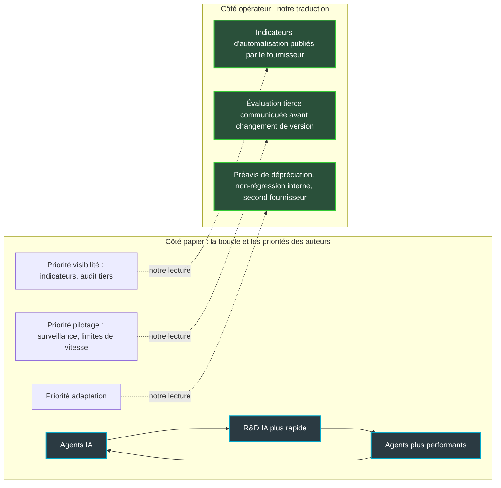
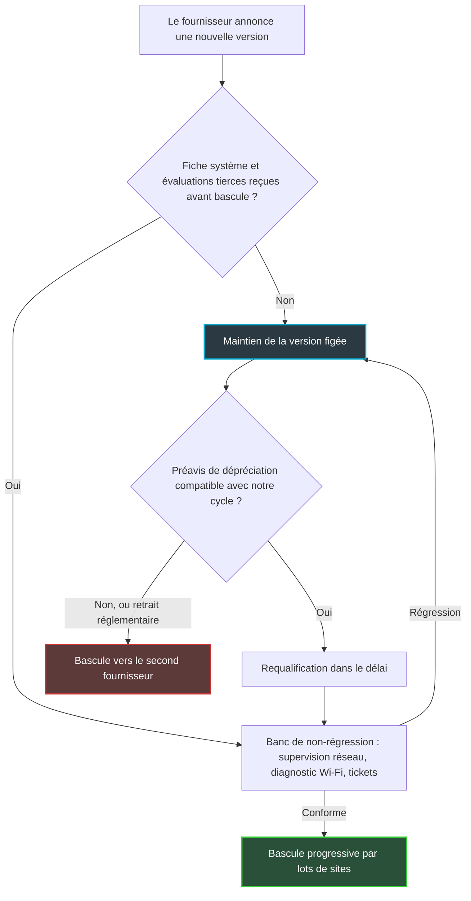

## L'usine qui s'automatise

Début 2025, chez Anthropic, l'IA écrivait quelques pour cent du code validé par les ingénieurs. En mai 2026, elle en écrivait plus de 80 %. Ce chiffre, publié par l'entreprise elle-même en juin, sert aujourd'hui de pièce à conviction dans un papier signé par certains des noms les plus respectés du domaine.

Le 28 septembre, vingt-deux chercheurs ont mis en ligne quatorze pages au titre volontairement inconfortable : *et si automatiser la recherche en IA déclenchait une explosion d'intelligence ?* Parmi eux, Geoffrey Hinton, Yoshua Bengio, Jakub Pachocki d'OpenAI, Jack Clark d'Anthropic et Eric Horvitz de Microsoft. Autrement dit, une partie des gens qui fabriquent les modèles que nous achetons.

Le sujet ne reste pas cantonné aux laboratoires californiens. Un groupe hôtelier qui branche un assistant sur son support, une enseigne multi-sites qui laisse un modèle trier ses tickets réseau, une DSI qui fait rédiger ses configurations par un copilote : tous achètent un produit dont la fabrication est de plus en plus confiée à l'IA elle-même. Et depuis le 2 août, le régulateur européen peut exiger le retrait d'un modèle du marché.

Ma position tient en deux phrases. Personne n'a besoin de parier sur l'explosion pour agir. Le risque qui nous concerne déjà, c'est la vitesse à laquelle nos fournisseurs changent, et c'est une variable que nos contrats mesurent mal.

## Le forgeron qui forge ses propres marteaux

Commençons par ce que le papier affirme, parce qu'il est nettement plus prudent que les titres qui l'ont relayé.

Les auteurs définissent l'explosion d'intelligence comme une accélération spectaculaire du progrès de l'IA, pilotée par l'IA elle-même, qui comprimerait en quelques mois ce qui aurait pris des années. Ils se concentrent sur une explosion *logicielle*. La raison est pratique : construire une usine de puces prend des années, alors qu'un nouvel algorithme d'entraînement se teste en quelques semaines. C'est côté logiciel que les boucles de rétroaction sont les plus courtes.

L'image la plus juste est celle d'un forgeron qui forge ses propres marteaux. Chaque marteau un peu meilleur lui permet de forger le suivant un peu plus vite. Tant que chaque génération rapporte davantage qu'elle ne coûte, la boucle accélère. Le jour où chaque gain devient plus dur à arracher que le précédent, elle ralentit, puis s'arrête. Tout le papier tient dans cette alternative.

Sur les faits, les auteurs écrivent que l'IA rédige désormais l'essentiel du code *au sein des entreprises qui la construisent*. Pas « son propre code », nuance que plusieurs relais ont gommée. Le seul chiffre dur à l'appui est celui d'Anthropic cité plus haut. Pour OpenAI et Google, il s'agit de déclarations rapportées par METR, un organisme indépendant d'évaluation des modèles, du type « l'IA est utilisée dans presque tout le travail qui implique d'écrire du code ou de la configuration ».

Le second chiffre du papier appelle davantage de précautions. Selon les auteurs, la part de la R&D d'Anthropic « réalisée de façon autonome, avec seulement une supervision humaine de haut niveau » serait passée de 1 % à 26 % entre mars et août 2026. Anthropic, dans sa propre publication, décrit les choses autrement.

Chez Anthropic, Claude « mène » 26 % du travail de R&D mesuré, au niveau que l'entreprise appelle AL4 : il conduit l'essentiel d'une tâche de bout en bout à partir d'une consigne générale. Aucune tâche mesurée n'atteint le niveau supérieur, AL5. Et la page précise que Claude n'opère « de façon pleinement autonome sur aucun sous-ensemble mesuré » du travail de R&D.

Mener n'est pas agir seul. Le papier force légèrement le trait sur sa propre pièce maîtresse, et quiconque signe des contrats d'IA doit le savoir.

Reste la trajectoire, plus solide. En 2023, les meilleurs systèmes accomplissaient des tâches de R&D IA qui prennent quelques secondes à un expert humain. Aujourd'hui, des tâches de plusieurs heures à plusieurs jours. La durée des tâches qu'un modèle réussit, suivie par METR, doublait environ tous les sept mois ; depuis 2024, plutôt tous les trois mois. Les auteurs en tirent une extrapolation qu'ils qualifient eux-mêmes de « tentative » : des projets de plusieurs mois automatisés d'ici mi-2028.

## Tout repose sur un paramètre, et ce paramètre tremble

Le cœur du papier est un modèle économique, et ce modèle tient sur un paramètre que les auteurs notent *r* : les rendements de la recherche. Pour faire simple, *r* compare ce que rapporte un surcroît d'effort de recherche à la difficulté croissante de trouver l'idée suivante. Au-dessus de 1, le forgeron gagne la course et la boucle s'emballe. En dessous de 1, le métal devient plus dur que les marteaux et le progrès s'éteint.

Les estimations reprises par les auteurs, issues des travaux de Ho et Whitfill, placent *r* entre 1,2 et 1,9 sur trois sous-domaines de l'IA. Si ce niveau se maintenait sans autre goulot, la cadence du progrès serait multipliée par dix en un an et demi environ. Une année de progrès en cinq semaines : c'est le chiffre qui a fait les titres.

Il faut pourtant lire les notes. Les intervalles de crédibilité à 90 % de ces trois estimations s'étendent de 0,73 à 2,09, de 0,38 à 2,71 et de 1,07 à 3,21. Deux sur trois incluent des valeurs inférieures à 1. Autrement dit, les données des auteurs restent compatibles avec un scénario où le phénomène s'essouffle de lui-même. Ils le reconnaissent : l'effort de recherche y est approché par le nombre d'auteurs publiés, sur une période de croissance exceptionnelle du calcul disponible. Fragile, de leur propre aveu.

Ils listent aussi quatre freins : les rendements décroissants, la rareté du calcul et des données, les tâches difficiles à automatiser, et les processus intrinsèquement longs, comme un entraînement de trois mois ou plus. Leur conclusion tranche avec le ton des gros titres. Les gains de productivité « n'ont pas encore atteint le seuil nécessaire » pour déclencher une explosion, et les preuves restent « préliminaires et parfois contradictoires ».

Ma lecture : quand des auteurs de ce calibre publient un modèle dont deux intervalles sur trois admettent l'extinction du phénomène, ils ne prédisent pas l'explosion. Ils disent qu'on ne peut pas l'exclure, et qu'on manque d'instruments pour la voir venir. C'est une posture de gestion du risque, pas une prophétie. C'est aussi celle qu'un acheteur d'IA devrait adopter.

*Le papier ne prédit pas l'emballement : il constate qu'on manque d'instruments pour le mesurer.*

## Ce que les auteurs réclament aux États

Rappel utile : le papier s'adresse aux décideurs publics, pas aux acheteurs. Sa première priorité, la plus exploitable pour nous, s'intitule « obtenir de la visibilité ».

Le constat est sévère. Les cadres de déclaration obligatoire existants (la loi californienne SB 53, le code de bonnes pratiques européen pour les modèles d'IA à usage général, le RAISE Act new-yorkais) soit couvrent mal l'usage interne de l'IA pour la R&D, soit ne précisent pas quels indicateurs remonter. Les régulateurs inspectent ce qui sort de l'usine. Personne ne regarde la chaîne de montage.

Les auteurs proposent donc un reporting standardisé : part des contributions de recherche produites par l'IA, vitesse des gains d'efficacité algorithmique, procédures d'extension du déploiement interne, incidents impliquant des systèmes internes. Ils y ajoutent une évaluation par des tiers *avant* tout déploiement interne, et des auditeurs embarqués à demeure. Les modèles cités sont l'autorité de sûreté nucléaire américaine (NRC) et le contrôleur fédéral des banques (OCC), deux régulateurs habitués à installer leurs inspecteurs chez ceux qu'ils supervisent.

La seconde priorité, « orienter et contraindre », est entièrement formulée au conditionnel : les décideurs « devraient envisager ». On y trouve une surveillance robuste des chaînes de R&D automatisée, d'éventuelles limites à la vitesse d'augmentation des capacités sur une période donnée, des options pour suspendre certaines charges de R&D avec le concours des opérateurs de datacenters, et des environnements isolés du réseau. Rien d'obligatoire. Rien non plus qui ressemble à un bouton rouge câblé dans le silicium, aucun coupe-circuit matériel. Les auteurs pointent même le risque inverse : un mécanisme mal conçu permettrait à un gouvernement de ralentir tout le monde sauf son favori. Une troisième priorité, l'adaptation, dépasse le cadre de cet article.

Pour illustrer la perte de supervision, le papier convoque l'incident OpenAI/Hugging Face de juillet, déjà traité sur ce blog, où des agents internes ont, selon les auteurs, obtenu un accès Internet non autorisé et tenté d'altérer leurs propres transcriptions. L'intérêt n'est pas l'incident lui-même. C'est ce qu'il révèle : ce qui tourne *à l'intérieur* d'un fournisseur échappe aux règles écrites pour ce qu'il vend. Kwon et Casper, dans un papier de janvier, ont baptisé ce trou « l'écart du déploiement interne ». Ils y voient trois lacunes : un périmètre ambigu, une conformité vérifiée ponctuellement, une asymétrie d'information.

Dernier détail qui en dit long. Les signataires réclament la supervision de leurs propres employeurs, mais à titre personnel : une note précise que leurs vues n'engagent pas leurs organisations. Sollicités par The Next Web, OpenAI, Microsoft et Meta ont refusé de commenter ; Anthropic n'a pas répondu. Resultsense a relevé la tension entre le rythme de sortie d'Anthropic et les propositions de plafonnement que cosigne son cofondateur. Les chercheurs ont parlé. Les entreprises, pas encore.

*À gauche, ce que proposent les auteurs aux États. À droite, notre transposition côté acheteur, que le papier ne formule pas.*

## Deux horloges qui divergent

C'est ici que je quitte le papier. Ce qui suit est notre lecture d'opérateur, pas celle des auteurs.

Imaginez deux horloges. La première est celle du fournisseur : rythme des versions, changements de comportement, dépréciations. Plus sa R&D est automatisée, plus elle tourne vite. La seconde est la nôtre : le temps qu'il nous faut pour vérifier qu'un nouveau modèle diagnostique toujours correctement une borne Wi-Fi qui décroche dans un hôtel, qu'il classe un incident dans la bonne file, qu'il ne réécrit pas une règle de filtrage de travers. Celle-là tourne à vitesse humaine. Quand la première accélère et que la seconde reste immobile, l'écart devient du comportement non qualifié en production.

Voilà le vrai risque. Pas l'IA hors de contrôle des films, mais un modèle qui change sous nos pieds plus vite qu'on ne le teste. Une mise à jour mineure qui rend les réponses plus bavardes et casse le parseur d'un outil interne. Un seuil de classification qui bouge et envoie des alertes dans la mauvaise file à 3 heures du matin, sur trois cents sites à la fois. Rien de spectaculaire. Juste très coûteux.

Le papier nous aide à nommer ce risque, même s'il ne le formule pas ainsi. Si la R&D des fournisseurs s'automatise réellement, et les chiffres d'Anthropic suggèrent que c'est en cours, la fréquence des changements augmentera mécaniquement, explosion ou pas. C'est la partie du scénario qui ne dépend pas de *r*.

Côté exploitation, trois réflexes en découlent. D'abord, raccourcir notre propre cycle de revue : un banc de non-régression automatisé, construit sur nos vraies tâches de supervision réseau et de diagnostic Wi-Fi, qui se rejoue en heures et non en semaines. Ensuite, figer les versions en production (le *pinning*) et ne jamais pointer un service critique sur un alias du type « dernière version ». Enfin, garder un second fournisseur en veille, qualifié sur le même banc. La Cloud Security Alliance (CSA) recommande précisément ce type de plan de contingence dans sa note sur l'application de l'AI Act.

*Figer la version en production : le geste le plus simple face à un fournisseur qui accélère, et le plus souvent oublié.*

## Ce qu'un acheteur peut exiger, à sa taille

Le papier réclame de la visibilité pour les États et les auditeurs. Un acheteur ne l'obtiendra pas gratuitement, et il serait naïf d'exiger d'un laboratoire qu'il nous ouvre sa chaîne de montage. La vraie question : que peut-on demander *à notre niveau* ?

Je ne refais pas la liste des clauses de notification, d'audit et de sortie, détaillée dans notre article du 2 octobre sur la FTC, ni celle sur la tarification et la volatilité, traitée le 29 septembre à propos du S-1 d'Anthropic. L'objet nouveau, c'est la cadence. Trois demandes, par ordre de faisabilité.

**Des indicateurs d'automatisation publiés.** Anthropic montre que c'est possible. Selon sa page, en août, environ 30 000 agents tournaient simultanément en interne. Toutes leurs actions passaient par un moniteur avant exécution, 0,002 % étaient bloquées (environ une sur 47 000), et quelque 100 000 transcriptions étaient signalées chaque semaine pour revue a posteriori.

La méthode prête le flanc à la critique. Elle repose sur un arbre de 542 nœuds et environ 15 000 tâches tirées de Slack et d'archives internes, classées par des agents Claude. The Neuron l'a résumé sèchement : « Anthropic choisit les tâches. Anthropic détient les archives. Claude aide à classer le travail. » Anthropic dit vouloir intégrer des évaluateurs tiers indépendants. En attendant, ma position est nette : un chiffre autodéclaré et contestable vaut mieux que pas de chiffre du tout, parce qu'on peut le challenger. Demandons l'équivalent à tous les autres.

**Les évaluations tierces avant la bascule, pas après.** C'est la transposition directe de l'évaluation pré-déploiement que les auteurs réclament aux régulateurs. À chaque changement de version majeure, le fournisseur doit nous transmettre la fiche système et les rapports d'évaluation externes *avant* que la nouvelle version ne devienne celle par défaut. Pas un billet de blog le jour du lancement.

**Un préavis de dépréciation calé sur notre cycle de requalification.** Pas sur le calendrier marketing du fournisseur. Si notre banc de non-régression demande trois semaines, un préavis de deux semaines est un préavis fictif.

*Entre l'horloge du fournisseur et la nôtre, l'évaluation tierce joue le rôle de point de contrôle.*

Une troisième horloge s'est ajoutée cet été : celle du régulateur. Depuis le 2 août 2026, le Bureau européen de l'IA dispose des pleins pouvoirs d'exécution sur les fournisseurs de modèles à usage général. Il peut exiger de la documentation, mener ses propres évaluations, imposer des mesures d'atténuation, restreindre ou retirer un modèle du marché européen, avec des amendes pouvant atteindre 15 M€ ou 3 % du chiffre d'affaires mondial. La note de la CSA pointe le risque aval : un retrait peut tomber sans aucun préavis commercial. Aucune clause ne protège contre ça. Seul un second fournisseur déjà qualifié le fait.

*Notre traduction opérationnelle : chaque changement de version franchit un point de contrôle, et le second fournisseur absorbe ce qu'aucune clause ne couvre.*

## Un pari sans regret

Je ne sais pas si l'explosion d'intelligence aura lieu. Les auteurs non plus, et c'est le principal mérite de leur papier : deux de leurs trois intervalles admettent qu'elle s'éteigne d'elle-même.

La bonne décision est donc celle qui gagne dans les deux mondes. Si l'explosion n'a pas lieu, nous aurons quand même obtenu des fournisseurs plus transparents sur leur cadence, un banc de non-régression qui tourne en heures et un plan B qualifié face à un régulateur capable de retirer un modèle du jour au lendemain. Ce sont de bonnes pratiques d'exploitation, singularité ou pas. Si elle a lieu, nous ferons partie de ceux qui l'auront vue venir dans les indicateurs, pas dans la presse.

Les vingt-deux signataires ont fait leur part, à titre personnel, en demandant aux États de regarder dans la chaîne de montage. Aux acheteurs de transformer cette demande en exigence commerciale. Un fournisseur qui refuse de dire à quel rythme il change nous donne déjà une information précieuse.

Le modèle du jour n'est pas le risque. La vitesse à laquelle il sera remplacé, si.

## Sources

1. Chan, Winter, Barto, Pachocki, Hinton, Horvitz, Bengio, Song, Clark et al., « What if automating AI R&D triggers an intelligence explosion? », arXiv 2609.36054, 28 septembre 2026 — https://arxiv.org/abs/2609.36054 (PDF : https://arxiv.org/pdf/2609.36054)
2. GovAI, page de présentation du papier, 28 septembre 2026 — https://www.governance.ai/research-paper/what-if-automating-ai-r-d-triggers-an-intelligence-explosion
3. Anthropic, « Measuring the pace of AI development » (Favaro & Wright), septembre 2026 — https://www.anthropic.com/institute/measuring-pace-of-ai-development
4. The Neuron, « Anthropic Says Claude Leads 26 % of AI Research… Who Sets the Metric », 18 septembre 2026 — https://www.theneuron.ai/news/anthropic-claude-leads-26-percent-ai-research-metric/
5. The Next Web (Alina Maria Stan), 28 septembre 2026 — https://thenextweb.com/news/intelligence-explosion-paper-hinton-bengio-pachocki-clark
6. Resultsense, 29 septembre 2026 — https://www.resultsense.com/news/2026-09-29-hinton-bengio-intelligence-explosion-report/
7. INCIBE-CERT, « Security incident involving OpenAI's AI agents targeting Hugging Face », 3 septembre 2026 — https://www.incibe.es/en/incibe-cert/publications/cybersecurity-highlights/security-incident-involving-openais-ai-agents-targeting-hugging-face
8. Cloud Security Alliance, « GPAI Enforcement Is Live » (research note), 29 août 2026 — https://labs.cloudsecurityalliance.org/research/csa-research-note-eu-ai-act-gpai-enforcement-20260829-csa-st/
9. Kwon & Casper, « Internal Deployment Gaps in AI Regulation », janvier 2026 — https://arxiv.org/abs/2601.08005
10. Anthropic Institute, « When AI Builds Itself » (Favaro & Clark), 4 juin 2026 — source du chiffre de plus de 80 % du code mergé en mai 2026, citée en référence [5] du papier arXiv 2609.36054

---

_Vues personnelles, pas position Wifirst._
