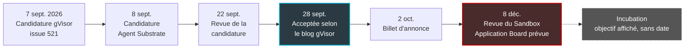

## La boîte invisible derrière le code des agents

Quand claude.ai exécute un script Python à votre demande, ce code s'exécute, selon la page d'utilisateurs de gVisor, derrière une couche d'isolation qui l'écarte du noyau de la machine. Même chose pour certaines tâches d'exécution de code jugées à risque chez OpenAI, pour les builds de Cloudflare Pages ou pour des services Google comme Cloud Run. Selon la liste d'utilisateurs publiée par le projet, tous passent par la même boîte, dont la plupart des DSI n'ont jamais entendu parler : gVisor [14].

Jusqu'ici, cette boîte appartenait à Google. En septembre, Google a engagé son transfert vers la CNCF (Cloud Native Computing Foundation, la fondation neutre qui héberge Kubernetes). Le moment n'a rien d'anodin. Les agents IA multiplient l'exécution de code que personne n'a relu. Les passerelles edge, ces boîtiers posés dans les hôtels, les résidences et les magasins, hébergent de plus en plus de fonctions, et parfois plusieurs clients, sur un même matériel modeste.

Pour tous ceux qui doivent faire cohabiter du code non fiable sur une infrastructure partagée, la question devient concrète. Peut-on bâtir une isolation sérieuse sur gVisor maintenant qu'il n'est plus le projet d'un seul fournisseur ?

Ma réponse tient en une phrase. La donation change la gouvernance, pas la physique. Le coût de chaque appel intercepté, la pile réseau réécrite, les trous de compatibilité : tout cela reste exactement là où c'était avant l'annonce.

## Acceptée, mais pas encore signée

Commençons par la nuance, parce qu'elle compte le jour où l'on rédige un contrat. Le 2 octobre, les mainteneurs Etienne Perot et Jing Chen racontent la procédure sur le blog du projet : candidature le 7 septembre, revue le 22, acceptation le 28 [1]. Le texte consulté ne précise pas quelle instance a tranché.

Côté CNCF, le dossier public raconte une histoire moins bouclée. Au 4 octobre, l'issue 521 du dépôt cncf/sandbox est toujours ouverte, au statut *In voting*. Elle est rangée dans une colonne qui annonce la prochaine revue du Sandbox Application Board pour le 8 décembre 2026. Ses labels signalent un vote passé (`gitvote/passed`), mais aussi un accord de contribution non signé (`contribution-agreement/unsigned`) [2].

Ma lecture prudente : le vote des sponsors est acquis, l'intégration formelle ne l'est pas encore. gVisor est en route vers le niveau Sandbox de la CNCF, sans y être installé avec tous les papiers. Et même une fois installé, ce niveau reste défini par la fondation comme expérimental, pas encore largement éprouvé en production [17]. Le palier qui parle aux acheteurs, Incubation, suppose des utilisateurs en production et un vivier de contributeurs sain. Les mainteneurs le visent. C'est une intention, pas un acquis [1].

*Calendrier de la donation : un vote passé, une revue du board encore à venir.*

Ce qui change vraiment, c'est la question de savoir qui tient les clés. Le dossier CNCF désigne trois responsables Google comme signataires autorisés (Srikanth Mandadi, Jago Macleod, Allan Naim), avec Ant Group, Tines et Modal comme co-sponsors [2]. Ces trois entreprises s'engagent comme mainteneurs sur la durée. OpenAI, Tencent et NVIDIA continuent de contribuer [1].

Le billet décrit une bascule en deux temps. D'abord un modèle fondé sur les mainteneurs, avec des droits de merge accordés hors de Google. Ensuite un vote par organisation, conçu pour qu'aucune entreprise, Google compris, ne puisse décider seule. Selon le billet, le dépôt doit à terme quitter l'organisation GitHub de Google, les builds et les tests vont migrer vers GitHub Actions et Buildkite, et l'infrastructure de test interne de Google ne bloquera plus les contributions [1].

Ce dernier point paraît anodin. Il ne l'est pas. Jusqu'ici, un patch externe dépendait au bout du compte d'une chaîne d'intégration continue que Google seul opérait. Pour qui bâtissait une isolation sur gVisor, le vrai risque n'était pas technique : c'était la dépendance à un fournisseur unique, libre de changer de priorités. Ce risque baisse. Il ne disparaîtra pas tant que le vote par organisation ne sera pas documenté noir sur blanc.

Précision de méthode : je n'ai trouvé aucune validation indépendante de la donation, ni presse spécialisée ni analyste. Tout repose sur le blog des mainteneurs et le dossier CNCF, de bonnes sources primaires, mais celles des intéressés.

## Un standardiste devant le noyau

Pour comprendre ce que gVisor protège, et ce qu'il coûte, prenez un immeuble de bureaux partagé.

Un conteneur classique, c'est l'open space. Chaque locataire a son coin, mais tous s'adressent directement au même gardien : le noyau Linux de la machine. Qu'un locataire malveillant trouve une faille chez le gardien, et il récupère le trousseau de tout l'immeuble. Une micro-VM, façon Kata Containers ou Firecracker, c'est un pavillon par locataire avec son propre gardien. Solide, mais il faut un terrain viabilisé : la virtualisation matérielle.

gVisor, c'est un standardiste posté devant chaque locataire. Il traite lui-même les demandes et ne dérange le gardien de l'immeuble que pour une courte liste de requêtes prévues d'avance.

Ce standardiste s'appelle le Sentry. C'est un programme écrit en Go qui réimplémente l'interface système de Linux en espace utilisateur. Quand une application émet un appel système (syscall, la requête qu'un programme adresse au noyau pour ouvrir un fichier, créer une connexion ou réserver de la mémoire), c'est le Sentry qui répond [10].

Il travaille les mains liées, et c'est voulu. Le Sentry ne peut ni ouvrir un fichier ni créer une socket sur l'hôte. Les fichiers passent par un processus séparé, le Gofer. Le réseau passe par netstack, une pile TCP/IP complète écrite en Go, qui échange des paquets virtuels avec l'extérieur [10, 11]. Seul un jeu minimal d'appels atteint le vrai noyau.

```mermaid
flowchart TB
    subgraph RUNC["Conteneur classique (runc)"]
        R1["Application"] -->|"tous les appels système"| R2["Noyau hôte partagé"]
    end
    subgraph GV["gVisor (runsc)"]
        G1["Application"] -->|"appels interceptés"| G2["Sentry : Linux réimplémenté en Go"]
        G2 -->|"fichiers"| G3["Gofer"]
        G2 -->|"réseau"| G4["netstack : TCP/IP en Go"]
        G2 -->|"jeu minimal d'appels"| G5["Noyau hôte"]
        G3 --> G5
        G4 --> G5
    end
    subgraph VM["Kata Containers / Firecracker"]
        K1["Application"] -->|"tous les appels système"| K2["Noyau invité dédié"]
        K2 --> K3["Moniteur de VM"]
        K3 --> K4["KVM : /dev/kvm requis"]
        K4 --> K5["Noyau hôte"]
    end
    style R2 fill:#4a2b2b,stroke:#cc0000,stroke-width:2px,color:#fff
    style G2 fill:#2b3a42,stroke:#00a8cc,stroke-width:2px,color:#fff
    style K4 fill:#555555,stroke:#999999,color:#fff
```

*Trois chemins pour un même appel système : direct, filtré par un noyau en espace utilisateur, ou absorbé par un noyau invité.*

Reste à intercepter les appels de l'application. gVisor propose pour cela plusieurs plateformes [9]. Systrap, la plateforme par défaut depuis 2023, a remplacé ptrace. Elle s'appuie sur seccomp, le filtre d'appels système du noyau Linux, et fonctionne partout, y compris dans une VM cloud.

La plateforme KVM (l'hyperviseur intégré au noyau Linux) offre de meilleures performances, mais sur du bare-metal uniquement. La doc déconseille la virtualisation imbriquée en production : performances médiocres et historique de problèmes de sécurité.

D'où la conséquence que je retiens pour la suite : gVisor n'a pas besoin de `/dev/kvm`, le périphérique qui donne accès à la virtualisation matérielle. Firecracker l'exige [15]. Kata, lui, pilote ses micro-VMs à travers un hyperviseur [16]. Sur ce critère précis, gVisor est le seul des trois à s'installer partout.

Un dernier avertissement, signé par la doc elle-même : un sandbox ne remplace pas une architecture sécurisée, et la protection contre les canaux auxiliaires matériels dépend des mitigations de l'hôte [10].

## Les agents IA, premiers clients du standardiste

Un agent IA qui exécute du code, c'est le locataire qu'on n'a pas choisi. Il écrit des scripts que personne n'a relus, à la demande d'un prompt que personne n'a filtré, et il veut une réponse en quelques secondes.

C'est exactement le terrain où gVisor s'est imposé. La page d'utilisateurs du projet, une liste auto-déclarée, aligne OpenAI pour certaines tâches à risque, Anthropic pour l'exécution de code dans claude.ai, Ant Group en production à grande échelle, Tines pour l'isolation et la reprise sur point de contrôle [14]. Modal indique dans sa documentation que ses jobs de calcul sont conteneurisés et virtualisés avec gVisor [19].

Pourquoi lui ? Parce que ces charges sont courtes, nombreuses et imprévisibles. Pas de noyau invité à démarrer, donc une boîte disponible presque immédiatement. Même Fly.io, qui vend du Firecracker et l'assume, reconnaît à gVisor cet avantage sur les tâches courtes et en rafales [18].

L'écosystème Kubernetes a suivi. Le projet Agent Sandbox, porté par le groupe de travail SIG Apps, ajoute à l'API un objet `Sandbox` qui délègue l'isolation à un runtime sécurisé, gVisor ou Kata. Le choix passe par RuntimeClass, le mécanisme Kubernetes qui désigne le runtime d'un pod. Le projet était présenté en alpha le 20 mars 2026 [6].

Deux mois plus tard, Google annonçait sa disponibilité générale sur son service Kubernetes managé, GKE. Avec des chiffres maison : 300 sandboxes par seconde et par cluster, 90 % des allocations en moins de 200 ms [5].

Le 8 septembre, vingt-quatre heures après gVisor, une seconde candidature arrive à la CNCF : Agent Substrate, un plan de contrôle minimal pour orchestrer des agents à très grande échelle. Ses runtimes sont interchangeables, gVisor ou Kata avec Cloud Hypervisor. Le projet revendique une densité de 30 à 100 fois supérieure grâce au multiplexage d'acteurs logiques sur des pods, avec une activation visée en moins d'une seconde et des cycles de suspension et reprise qui conservent l'état en mémoire. Il prévoit d'annoncer son transfert à la KubeCon North America de novembre [4].

Ma lecture, que les dossiers ne formulent pas : une pile complète se dessine. Un noyau isolant (gVisor), une couche d'orchestration (Substrate), une API standard (Agent Sandbox). Rien n'indique que les deux dépôts aient été coordonnés. Mais la plomberie d'exécution des agents passe, brique par brique, sous gouvernance neutre.

## La facture : chaque appel passe au guichet

*Trois architectures d'isolation, trois factures : noyau partagé, noyau en espace utilisateur, noyau invité sur hyperviseur.*

Un `git clone`. Un `npm install`. Une suite de tests unitaires. Des milliers de petites opérations sur des fichiers et des sockets, chacune anodine. Sous gVisor, chacune passe au guichet du standardiste. Fly.io décrit précisément ce profil comme celui où le surcoût de gVisor s'accumule [18]. C'est un concurrent qui parle, mais la doc officielle ne dit pas autre chose.

Elle distingue deux familles de coûts [7]. Les coûts structurels viennent de l'interception de chaque appel. Les coûts d'implémentation viennent du réseau et des fichiers, réécrits en Go. Netstack, reconnaît-elle, n'a pas tous les mécanismes avancés de récupération des autres piles TCP et consomme plus de CPU. Le Sentry ajoute un surcoût mémoire fixe. Le verdict est honnête : impact faible quand le calcul domine, fort quand chaque requête enchaîne les opérations sur le système de fichiers.

Deux réserves sur ces mesures. La page n'est pas datée, et ses benchmarks tournent sur ptrace, la plateforme en voie de retrait. Or Systrap a changé la donne : en 2023, les mainteneurs mesuraient un gain net face à ptrace sur un appel synthétique (getpid en boucle), que les auteurs jugent eux-mêmes peu représentatif, avec des gains réels très variables selon la charge [8]. Personne ne publie de comparatif à jour sur la plateforme par défaut.

Le billet de donation contient l'aveu le plus intéressant du dossier. Ses auteurs reconnaissent que les performances par défaut se dégradent sur certaines charges riches en entrées-sorties. Google et d'autres appliquent des patchs noyau internes pour compenser. Leurs tentatives d'intégration dans le noyau Linux officiel ont été refusées, et les auteurs attribuent ce refus au fait que gVisor était un projet détenu par Google [1]. C'est leur version, non vérifiée de l'extérieur. Si elle est juste, la CNCF pourrait rouvrir cette porte. Rien ne le garantit.

Reste la compatibilité. Selon la doc consultée le 4 octobre 2026 (pages non datées), gVisor implémente totalement ou partiellement 290 des 352 appels système Linux sur amd64 : 62 ne sont pas supportés. Sur arm64, c'est 253 sur 295, soit 42 absents [12, 13].

La liste des absents mérite un coup d'œil. On y trouve `perf_event_open`, porte d'entrée du profilage, `userfaultfd`, qui gère des fautes mémoire en espace utilisateur, ou `io_uring_register`, lié aux entrées-sorties asynchrones modernes. La doc rappelle qu'un appel absent ne provoque pas forcément de panne, car beaucoup de runtimes prévoient un repli. Mais un outil d'observabilité ou un service qui mise sur io_uring peut échouer, ou se dégrader sans bruit.

Côté sécurité, le dossier CNCF ne mentionne aucun audit tiers formel [2]. Le niveau de sécurité comparable aux VM est une affirmation des candidats. Un langage sûr pour la mémoire élimine une classe de bugs, il ne rend pas un logiciel invulnérable. Et le noyau hôte reste partagé : surface réduite, jamais nulle.

## Sur une passerelle edge multi-tenant, mon analyse

Changement de registre. Ce qui suit est mon analyse d'auteur, pas un résultat de mesure. Je n'ai trouvé aucun benchmark public comparant gVisor à Kata ou à Firecracker sur du matériel edge contraint. Les comparatifs disponibles sont qualitatifs, et souvent signés par un vendeur. Lisez donc ce qui suit comme une liste d'hypothèses à tester.

L'atout de gVisor à l'edge tient en une ligne : pas besoin de `/dev/kvm`. Sur un boîtier dont l'hyperviseur n'est pas exposé ou déjà saturé, ou dans une VM sans virtualisation imbriquée exploitable, c'est l'option qui s'installe partout [9, 15, 16].

Le revers est cruel. Les fonctions qu'on voudrait isoler sur une passerelle (portail captif, DHCP, DNS, collecteurs de télémétrie) sont des charges réseau intenses avec peu de calcul par paquet. C'est précisément le profil où la doc admet le surcoût le plus lourd [7, 11]. La tentation serait de basculer en mode réseau `host`, qui rend la pile de l'hôte et les performances. Mais ce mode abandonne l'isolation réseau, donc l'argument de sécurité qui justifiait le choix. Il faut mesurer les deux modes et assumer le compromis par écrit.

Netstack mérite une attention particulière. Pile TCP séparée de celle de l'hôte, elle réduit la surface d'attaque côté noyau, mais se comporte différemment, avec des mécanismes de récupération moins riches. Sur un réseau Wi-Fi où la qualité de service se joue à quelques millisecondes, je veux voir ce comportement sous charge avant d'y faire passer du trafic client.

La doc réseau offre un outil précieux pour le multi-tenant, la limitation du trafic sortant par sandbox (`--qdisc=tbf`). Elle reste en revanche muette sur le filtrage iptables, les sockets brutes et les accélérations de réception du noyau [11]. Un serveur DHCP ou un outil de capture qui s'appuie sur des sockets brutes devra donc être testé en conditions réelles.

Sur ARM, prudence aussi. Il manque 42 appels sur arm64 [13]. Le billet Systrap de 2023 note que KVM exige la virtualisation imbriquée, absente de certains matériels comme les CPU ARM, et que l'optimisation par trampolines de Systrap n'existait alors qu'en x86_64 [8]. La doc actuelle ne dit rien du support de KVM sur arm64 : je n'ai pas pu le confirmer. Je partirais du principe qu'un boîtier ARM tournera sous Systrap, sans l'accélération x86, donc avec un surcoût d'appels système à mesurer.

*Sur une passerelle edge, c'est la pile réseau en espace utilisateur qui rendra le verdict, pas le logo de la fondation.*

Reste le cas le mieux soutenu par l'écosystème : isoler des agents IA de supervision réseau qui exécutent des runbooks ou appellent des outils via MCP (Model Context Protocol). Là, gVisor joue à domicile. Mais le sandbox contient l'agent. Il ne remplace ni le filtrage de ses sorties réseau ni un journal d'audit stocké hors de l'hôte, deux sujets traités ici récemment.

Ma synthèse, construite à partir des docs et des sites des projets, avec des chiffres de vendeurs non vérifiés :

| Critère | gVisor | Kata Containers | Firecracker |
|---|---|---|---|
| Virtualisation matérielle requise | Non, avec Systrap | Oui, via l'hyperviseur choisi | Oui, KVM |
| Frontière d'isolation | Noyau en espace utilisateur, hôte partagé | Micro-VM, noyau invité | Micro-VM, noyau invité |
| Démarrage | Pas de noyau à démarrer | Démarrage d'une micro-VM | Moins de 125 ms selon le projet |
| Point faible documenté | Charges riches en appels système, fichiers, réseau | Hors jeu sans virtualisation accessible | Hors jeu sans KVM |
| Où je le placerais | Hôtes sans KVM, tâches courtes, agents | Charges I/O lourdes, noyau distinct exigé | Comme Kata, densité sur KVM |

Surtout, ne choisissez pas une fois pour toutes. Agent Sandbox accepte gVisor comme Kata via RuntimeClass [6]. Déclarez les deux, routez chaque charge vers le bon runtime, et gardez la porte de sortie ouverte.

## Ce que je ferais lundi matin

Le vrai livrable de cette annonce n'est pas une décision, c'est un protocole. Je prendrais une passerelle représentative du parc et j'y comparerais quatre configurations : runc comme référence, gVisor sous Systrap, gVisor sous KVM si le matériel est bare-metal, et Kata. Six mesures suffisent pour trancher :

1. **Débit et latence TCP** à charge réaliste, en mode réseau `sandbox` puis `host`.
2. **Requêtes par seconde** d'un petit service HTTP, du type portail captif.
3. **Démarrage à froid** d'une instance.
4. **Mémoire résiduelle par instance**, puisque le surcoût fixe du Sentry se multiplie par le nombre de tenants.
5. **Taux d'appels système en échec**, relevé dans les journaux de `runsc`.
6. **Comportement sur arm64**, si le parc en compte.

Côté gouvernance, je suivrais une checklist courte avant de signer quoi que ce soit qui engage un client :

- l'accord de contribution signé et l'issue 521 fermée après la revue du 8 décembre ;
- le nombre d'organisations disposant des droits de merge, avant et après le transfert ;
- les modalités du vote par organisation, annoncé mais encore à documenter ;
- un audit de sécurité tiers, absent du dossier de candidature ;
- le transfert effectif du nom et des marques, annoncé dans le billet, à confirmer dans l'acte de donation.

*Le test d'une donation se lit au nombre d'organisations autour de la table, pas dans le communiqué.*

## Un bien commun, pas encore un réflexe

Sur le principe, cette donation est une bonne nouvelle, et je le dis sans réserve. Je préfère bâtir une isolation sur un bien commun que sur le projet d'un seul fournisseur, aussi compétent soit-il. Une CI publique annoncée, des mainteneurs chez Ant Group, Modal et Tines, un vote par organisation prévu : c'est ce qu'on attend d'une brique appelée à se retrouver sous des millions de sandboxes.

Mais la CNCF ne change ni la physique d'un appel intercepté ni le CPU que consomme netstack. Le logo d'une fondation n'a jamais accéléré une pile TCP.

Ma position tient donc en deux temps. Pour isoler des agents IA qui exécutent du code, gVisor est dès aujourd'hui un choix défendable : l'écosystème s'est construit autour, et son profil de coût colle à ces charges courtes. Pour le plan de données d'une passerelle edge multi-tenant, la réponse est non, pas encore. Pas tant que nous n'aurons pas nos propres chiffres, sur notre matériel, avec notre trafic.

Rendez-vous le 8 décembre pour la gouvernance. Pour le reste, rendez-vous au labo.

---

_Vues personnelles, pas position Wifirst._

## Sources

1. gVisor blog, « gVisor is being donated to CNCF » (Etienne Perot, Jing Chen), 2026-10-02 : https://gvisor.dev/blog/2026/10/02/gvisor-cncf/
2. cncf/sandbox, issue 521, « [Sandbox] gVisor », ouverte le 2026-09-07, consultée le 2026-10-04 : https://github.com/cncf/sandbox/issues/521
3. google/gvisor, PR 15232, ajout du billet d'annonce (pas la PR du transfert), mergée le 2026-10-02 : https://github.com/google/gvisor/pull/15232
4. cncf/sandbox, issue 523, « [Sandbox] Agent Substrate », déposée le 2026-09-08 : https://github.com/cncf/sandbox/issues/523
5. Google Cloud blog, Agent Sandbox on GKE and Agent Substrate, 2026-05-20 : https://cloud.google.com/blog/products/containers-kubernetes/bringing-you-agent-sandbox-on-gke-and-agent-substrate
6. Kubernetes blog, Running Agents on Kubernetes with Agent Sandbox, 2026-03-20 : https://kubernetes.io/blog/2026/03/20/running-agents-on-kubernetes-with-agent-sandbox
7. gVisor docs, Performance Guide (non datée, consultée le 2026-10-04) : https://gvisor.dev/docs/architecture_guide/performance/
8. gVisor blog, Systrap release, 2023-04-28 : https://gvisor.dev/blog/2023/04/28/systrap-release/
9. gVisor docs, Platforms (non datée, consultée le 2026-10-04) : https://gvisor.dev/docs/user_guide/platforms/
10. gVisor docs, Security Model (non datée, consultée le 2026-10-04) : https://gvisor.dev/docs/architecture_guide/security/
11. gVisor docs, Networking (non datée, consultée le 2026-10-04) : https://gvisor.dev/docs/user_guide/networking/
12. gVisor docs, compatibilité des appels système Linux/amd64 (consultée le 2026-10-04) : https://gvisor.dev/docs/user_guide/compatibility/linux/amd64/
13. gVisor docs, compatibilité des appels système Linux/arm64 (consultée le 2026-10-04) : https://gvisor.dev/docs/user_guide/compatibility/linux/arm64/
14. gVisor, Who's Using gVisor (liste auto-déclarée, consultée le 2026-10-04) : https://gvisor.dev/users/
15. Firecracker, site officiel (consulté le 2026-10-04) : https://firecracker-microvm.github.io/
16. Kata Containers, site officiel (consulté le 2026-10-04) : https://katacontainers.io/
17. CNCF, Projects et niveaux de maturité (consulté le 2026-10-04) : https://www.cncf.io/projects/
18. Fly.io, Firecracker vs gVisor (analyse d'un vendeur Firecracker), septembre 2026 : https://fly.io/learn/firecracker-vs-gvisor/
19. Modal, Security (non datée, consultée le 2026-10-04) : https://modal.com/docs/guide/security
