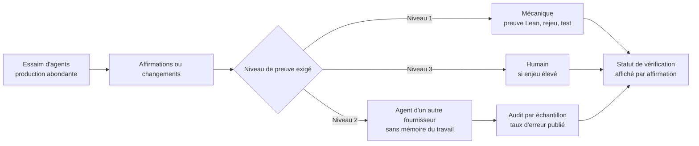
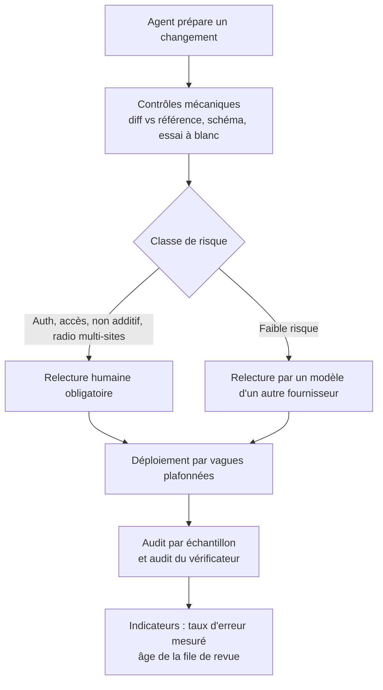

## La file qui ne désemplit plus

Imaginez un lundi matin dans un centre d'exploitation réseau. Pendant le week-end, des agents IA ont préparé des dizaines de changements de configuration : un réglage radio pour un hôtel de trois cents chambres, une règle de filtrage pour une enseigne de quarante magasins, une mise à jour du portail Wi-Fi d'une résidence étudiante. Tout est propre, documenté, prêt à partir. Et l'équipe sait déjà qu'elle ne pourra pas tout lire avant vendredi.

Ce scénario n'est pas encore le quotidien d'un exploitant réseau. Il vient pourtant d'être joué en grandeur réelle, dans un tout autre métier. Deux chercheurs de l'université Purdue, Sergey Gusev et David E. Bernal Neira, ont confié des domaines scientifiques entiers à des essaims d'agents IA, avec une consigne minimale : progresser, correctement, sans s'arrêter. Leur constat tient en une phrase : « the bottleneck has moved from producing results to reviewing them ». Le goulot n'est plus la production. C'est la relecture.

Les agents ont produit des résultats plus vite que leurs superviseurs ne pouvaient les relire, et les auteurs estiment le travail de revue restant à plus de sept mois à temps plein. Pour tous ceux qui s'apprêtent à confier à des agents la préparation de changements sur des parcs de sites (exploitants, DSI du retail, groupes hôteliers), c'est un signal à prendre au sérieux maintenant. Pas quand la file aura débordé.

## Six domaines, une consigne : ne pas s'arrêter

Commençons par ce que l'expérience est, et ce qu'elle n'est pas. Le papier, déposé sur arXiv le 28 septembre 2026 [1], compte 78 pages et se présente lui-même comme une perspective. Il n'a pas été relu par des pairs. Ses auteurs reconnaissent ne pas être spécialistes de tous les domaines testés, et précisent que leur propre revue est incomplète.

Le protocole est d'une simplicité presque brutale. Des agents de code du commerce, utilisés tels quels, reçoivent un périmètre qui va d'un sujet étroit à un champ entier. Ils ont accès à la littérature, à des outils de calcul, et à une consigne permanente : faire des progrès réels, corrects et utiles, et ne pas s'arrêter. Personne ne leur souffle d'idée scientifique. Le terrain couvre cinq domaines théoriques, de l'optimisation mathématique à la thermodynamique moléculaire, et un domaine expérimental, la catalyse chimique, où les agents se contentent de proposer des expériences.

Les garde-fous existent. Chaque résultat doit passer au moins une fois devant un agent neuf, sans mémoire du travail accompli. Il doit aussi être vérifié sous la forme la plus forte que permet le domaine : preuve formelle, relance du calcul ou calcul indépendant. Les auteurs ont même combiné deux fournisseurs de modèles, pour que l'un contrôle le travail de l'autre.

Le résultat ressemble à une imprimerie dont on aurait multiplié les rotatives par cent, en gardant un seul correcteur en bout de chaîne. Chaque feuille est peut-être juste. Personne ne peut le garantir avant de l'avoir lue. Et la pile grossit plus vite qu'il ne tourne les pages.

Les chiffres, d'abord. Le corpus compte 45 papiers potentiels et 8 programmes expérimentaux, soit 53 éléments. Sur les 45 papiers, 22 sont des brouillons complets, 14 n'existent qu'à l'état de notes et 9 sont fondus dans un document unique. Les auteurs ont posé le calcul de la relecture : à trois jours ouvrés par élément, environ 160 jours, soit « more than seven months » d'un temps plein. Ils insistent sur deux points. C'est une estimation du travail restant, pas une durée mesurée. Et l'hypothèse des trois jours est, selon eux, « more likely too low than too high ».

Une partie des résultats a été prouvée en Lean, un assistant de preuve qui vérifie mécaniquement chaque étape d'une démonstration. Même là, une nuance s'impose : les auteurs n'ont pas encore contrôlé que les énoncés formalisés disent bien ce qu'affirment les brouillons. Chaque preuve, écrivent-ils, « shows that its formal statement is proved, not that the statement matches the draft ». Une machine peut prouver impeccablement la mauvaise phrase.

Et la qualité ? Dans ce qu'ils ont relu à ce jour, les auteurs n'ont trouvé aucune erreur scientifique majeure, avec un avertissement immédiat : « finding no error does not show that none remains ». Ils notent que les agents ont attrapé et corrigé des erreurs, dont certaines majeures, avant toute lecture humaine. Mais faute de relecture humaine indépendante du même matériel, aucune comparaison entre relecture par agents et relecture humaine n'est établie, et les auteurs ne revendiquent rien de tel. Je le souligne, parce que c'est précisément la nuance que les résumés enthousiastes oublieront.

*Production d'un côté, relecture de l'autre : l'asymétrie qui définit désormais le travail avec des agents.*

## Le même goulot, vu d'ailleurs

Un papier de position, même scrupuleux, reste un cas isolé. Ce qui m'a convaincu, c'est de retrouver la même courbe dans des mesures indépendantes, côté science comme côté logiciel.

Le rapport « AI in Science: Early Insights » de Google, Google DeepMind et MIT FutureTech, publié en septembre 2026 [3], repose sur une enquête menée cet été auprès de 637 chercheurs basés aux États-Unis et au Royaume-Uni. Parmi ceux qui disent gagner du temps grâce à l'IA, 89 % en consacrent plus d'un dixième à vérifier les sorties, et 46 % plus d'un quart. Par ailleurs, 41 % déclarent un arriéré d'hypothèses non testées en hausse, contre environ 25 % qui le voient baisser. Environ 44 % estiment que leur goulot a glissé vers l'aval.

Deux réserves, formulées par le rapport lui-même. Les données sont auto-déclarées. Et le lien entre cette *verification tax* et l'intensité d'usage de l'IA n'est que marginalement significatif, selon la spécification statistique retenue. L'arriéré d'hypothèses et le glissement du goulot ressortent plus nettement. C'est un indice, pas une loi.

Le papier de Purdue relève la même pente ailleurs. Selon les chiffres qu'il rapporte, ScientistTwo, un système de Google, a généré 86 papiers à partir de 107 problèmes, évalués surtout par des relecteurs IA ; des humains n'en ont lu que 33 [9]. Les auteurs rattachent aussi leur diagnostic à l'essai de Terence Tao pour le congrès international des mathématiciens 2026, qu'ils lisent comme un déplacement du goulot vers la vérification et l'exposition des résultats [10].

Côté logiciel, le signal est encore plus net. Dans sa newsletter Pragmatic Engineer du 8 septembre [6], Gergely Orosz rapporte que le nombre de demandes de fusion de code (les *pull requests*, ou PR) ouvertes sur GitHub a été multiplié par cinq en trois ans. Chez Duckbill, les PR fusionnées par semaine sont passées de 353 à 684, soit +94 %. Le détail qui compte est ailleurs : la médiane de fusion atteint 26 heures pour une PR relue par un humain, contre une heure sans relecture humaine. La relecture humaine est devenue le temps d'attente.

Un rappel plus ancien, enfin. En décembre 2025, l'analyste RedMonk résumait le rapport DORA 2025 (DevOps Research and Assessment, le programme de recherche de Google sur la livraison logicielle) [7]. L'adoption de l'IA y passait d'une relation négative à positive avec le débit, tout en restant associée à une instabilité croissante des mises en production. Plus de débit, plus de casse. La donnée date de 2025 et vient du logiciel, pas du réseau. Avec les deux autres, elle dessine pourtant une tendance cohérente : on sait produire plus vite, pas encore valider au même rythme.

## Trois niveaux de preuve, et des relecteurs qui se ressemblent trop

Face à ce déséquilibre, Gusev et Bernal Neira ne proposent pas de relire davantage. Ils proposent de hiérarchiser la confiance, en trois niveaux :

- **Mécanique** : une preuve Lean, un certificat qu'on peut rejouer, un test. Ce niveau ne se fatigue pas et ne se laisse pas impressionner.
- **Jugement d'agents** : bon marché et répétable, mais un agent relecteur, écrivent-ils, « can share the blind spots » de l'agent qu'il relit.
- **Jugement humain** : le plus rare et le plus lent, à réserver à ce qui le mérite.

*Trois niveaux de confiance : le contrôle mécanique, le jugement d'agents qui partagent parfois les mêmes angles morts, et le jugement humain.*

Le deuxième niveau mérite qu'on s'y arrête, parce que c'est celui que tout le monde va déployer en premier. La tentation est connue : faire relire par trois modèles, et laisser la majorité trancher. Une étude de Kohli publiée en mai 2026 [8], citée par le papier de Purdue, refroidit cet espoir. Neuf modèles issus de sept familles, réunis en panel, valent à peu près deux votes indépendants. Leur précision réelle reste de 8 à 22 points inférieure à celle qu'aurait un panel de votes réellement indépendants. Et le meilleur juge pris seul égale ou bat le panel entier.

Réserve importante : ces mesures portent sur des tâches d'inférence en langage naturel (en gros, décider si une phrase en implique une autre). Pas sur la relecture de preuves, ni sur celle de configurations réseau. Je n'en tire donc aucun chiffre transposable. J'en tire une intuition : des modèles entraînés sur des données voisines ont tendance à se tromper ensemble. Empiler des relecteurs qui se ressemblent multiplie les signatures, pas les regards. C'est d'ailleurs pour cela que les auteurs plaident pour diversifier la nature des contrôles (autre fournisseur, preuve formelle, rejeu, humain) plutôt que leur nombre.

Le troisième niveau, quand il est fait sérieusement, coûte cher en attention. Le résultat publié par Anthropic en août sur l'hypothèse de Riemann [4] en donne la mesure. Un modèle non publié y améliore une borne connue, faisant passer de 41,6 % à 67,2 % la proportion de zéros établis sur la droite critique, sans prouver l'hypothèse elle-même. Pour ce seul résultat : validation par deux mathématiciens d'Anthropic, revue par deux experts externes, formalisation Lean contrôlée par un outil dédié. Interrogé par Scientific American [5], le mathématicien James Maynard juge la contribution « genuinely interesting », tout en estimant qu'aucune de ces approches n'ouvre de chemin vers l'hypothèse elle-même.

Quatre experts et une preuve machine pour un seul résultat. Rapportez cela aux 53 éléments du corpus de Purdue, et la relecture exhaustive cesse d'être une stratégie. Même les annonces les plus médiatisées attendent leur verdict : le résultat sur Navier-Stokes annoncé par OpenAI en septembre est, selon Gusev et Bernal Neira, toujours en cours de revue indépendante [1] [11].

## Quand le vérificateur se trompe

L'épisode le plus instructif du papier est relégué dans une note de bas de page. Il mérite la une.

Un pipeline d'agents produisait des bornes inférieures certifiées pour des problèmes d'optimisation non linéaire en nombres entiers (MINLP, pour *mixed-integer nonlinear programming*). En clair : des garanties chiffrées affirmant qu'aucune solution ne peut descendre sous une certaine valeur, chacune validée par un programme vérificateur. Annonce initiale : 269 modèles certifiés sur 289.

Un audit ultérieur, mené lui aussi par un agent, a montré que le vérificateur avait accepté des étapes qu'il aurait dû rejeter. Certaines conditions mathématiques, de domaine et de courbure, n'étaient pas appliquées. Des erreurs d'arithmétique exacte atteignaient environ 2 × 10⁻¹⁰. Le contrôleur était troué.

La suite est un modèle de discipline. Les agents ont réparé le vérificateur, rejoué tous les enregistrements, retiré l'annonce et conservé les anciens enregistrements. Après revérification, 188 bornes restaient acceptées. Une nouvelle campagne uniforme en certifie désormais 203 sur 289. Les auteurs précisent que les étapes rejetées étaient des justifications invalides : aucune borne n'a été démontrée fausse.

*Auditer la balance, pas seulement ce qu'on pose dessus : le vérificateur est un logiciel comme un autre.*

J'en retiens une règle que j'applique à tout ce qui suit : **le vérificateur est un logiciel comme un autre**. Il a ses bugs, ses angles morts, ses hypothèses implicites. Un dispositif qui audite l'objet contrôlé sans jamais auditer le contrôle finit par certifier ses propres erreurs, tampon officiel à l'appui. Ici, la faille a été trouvée parce que quelqu'un, en l'occurrence un agent, a été chargé d'examiner la balance elle-même, et pas seulement ce qu'on posait dessus.

## Une signature n'est pas une relecture

Le papier pointe un second risque, que tout responsable d'exploitation reconnaîtra. Vu de l'extérieur, écrivent les auteurs, « a signature looks the same as a review ». Un système fondé sur la seule validation humaine, préviennent-ils, « would fill with reviews that were never done ». Des relectures jamais faites, mais dûment signées.

Tout exploitant connaît ce film. Le comité de changement qui valide trente demandes en vingt minutes. L'approbateur qui signe parce que l'auteur est réputé fiable. La case cochée qui rassure l'auditeur et ne protège personne. Les agents n'inventent pas ce travers. Ils l'industrialisent, parce que le volume à signer explose.

Le contre-modèle existe, et Meta vient de l'illustrer. Dans un billet publié le 2 octobre [2], ses équipes de recherche décrivent six articles de recherche écrits avec leur modèle Muse Spark, utilisé via l'interface de chat meta.ai. Les sujets vont des probabilités à l'algèbre non associative ; cinq articles apportent des réponses à des questions ouvertes. Ce n'est pas un essaim. Une équipe de mathématiciens a guidé le travail, puis « a second group of mathematicians then reviewed their work ». Chaque article signale quels passages ont été rédigés surtout par les chercheurs, et lesquels par l'IA.

Voilà un statut de vérification visible. Mais il a un prix : six articles en plusieurs mois, au rythme humain. Le billet, qui reste un communiqué de l'éditeur, ne mentionne ni vérification formelle, ni nombre de relecteurs, ni affiliations. Un cas reste ouvert, et Meta indique que d'autres équipes avaient annoncé indépendamment des solutions à certains de ces problèmes. Surtout, les deux expériences ne sont pas comparables : d'un côté, des humains au centre et un débit modeste ; de l'autre, des essaims qui produisent plus que leurs superviseurs ne peuvent lire. Elles ne se départagent pas. Elles bornent l'espace des choix.

Entre ces deux bornes, la proposition la plus féconde du papier de Purdue reste, à mes yeux, une position et non un résultat : changer d'unité de vérification. Ne plus valider un papier de cinquante pages d'un bloc, mais chaque affirmation, avec son énoncé, ses hypothèses, son statut de vérification et un lien vers la preuve ou le code rejouable. Les résultats seraient publiés avec, selon leur formule, « verification status stated claim by claim ». Et pour le niveau intermédiaire, leur consigne est nette : « audit agent review by sampling and publish its error rate ».

*Synthèse des positions de Gusev et Bernal Neira : un niveau de preuve par affirmation, un statut visible, et un audit chiffré de la relecture par agents.*

## Mon analyse : la même grille, appliquée à un NOC

Ce qui suit n'est pas dans le papier. C'est ma lecture d'exploitant de réseaux pour des hôtels, des enseignes multi-sites et des résidences étudiantes, et je l'étiquette comme telle. Je pose d'emblée la limite de l'analogie : une preuve Lean est plus forte que n'importe quel contrôle réseau. Dans un centre d'exploitation réseau (NOC, pour *network operations center*), il n'existe pas d'équivalent d'un assistant de preuve qui couvrirait toute la chaîne, des équipements aux firmwares en passant par le comportement radio. Le niveau mécanique y est plus faible : tests, simulation, jumeau numérique partiel. Le vrai chantier consiste à transformer des règles tacites en contrôles exécutables.

La question de fond, elle, est identique : que devient une équipe de validation quand des agents préparent plus de changements que quiconque ne peut en lire ? Ma réponse tient en six principes.

1. **Un niveau de preuve par classe de changement.** Comparaison avec la configuration de référence, validation de schéma, essai à blanc, relecture par un modèle d'un autre fournisseur, échantillon audité, humain obligatoire : chaque classe a son plancher, écrit noir sur blanc.
2. **Le statut affiché sur la demande elle-même.** Celui qui approuve doit voir d'un coup d'œil ce qui a été prouvé mécaniquement, ce qui a été relu par un modèle, et ce qui ne l'a été par personne.
3. **L'âge de la file de relecture comme indicateur de risque.** Une file qui vieillit signale soit des changements qui attendent, soit des signatures qui s'accélèrent. Dans les deux cas, la relecture se dégrade. Ça se mesure.
4. **Auditer le vérificateur.** Le script de validation, l'outil d'analyse statique et le simulateur méritent leur propre campagne d'audit, avec rejeu. Uber le fait déjà côté code : selon Orosz, son pipeline uReview note et écarte les commentaires de relecture IA peu fiables avant de les montrer aux développeurs.
5. **Traquer le tampon de complaisance.** Tirer au sort des changements approuvés, vérifier a posteriori que la relecture a réellement eu lieu, et publier le taux d'erreur en interne.
6. **Une relecture humaine obligatoire, déclenchée par la machine.** C'est le point qui mérite le plus de détail.

Duckbill, toujours selon Orosz, réserve la relecture humaine obligatoire à une courte liste : API publique, authentification, design system, changements non additifs de schéma de base de données, compétences confiées aux agents. Le détail décisif : c'est un script, pas la bonne volonté, qui pose l'étiquette sur la PR. À l'autre bout du spectre, chez Anthropic et OpenAI, un humain fusionne encore même les changements à faible risque, avec l'objectif de confier un jour cette étape à une autre instance du modèle.

Transposée à un réseau, ma liste serait la suivante : tout ce qui touche l'authentification (RADIUS, le protocole qui contrôle les accès au réseau), l'exposition réseau, les accès (portail captif, réseaux virtuels d'invités), les changements non additifs et les paramètres radio poussés sur plusieurs sites. Le reste peut passer par un modèle tiers, puis par l'échantillon audité.

Il manque une dernière pièce, propre à notre métier. Un changement erroné poussé sur un parc entier n'est pas un incident : c'est le même incident, au même moment, partout. Dans un hôtel de plusieurs centaines de chambres, une enseigne de dizaines de magasins ou une résidence étudiante en pleine rentrée, l'impact est immédiat et simultané. La relecture réduit la probabilité d'erreur ; le déploiement par vagues plafonnées réduit sa portée. Il faut les deux.

*Chaîne de changement d'un NOC avec agents : mon analyse, pas un résultat du papier.*

La trace de ce que l'agent a réellement fait relève d'un autre chantier, abordé ici le 27 septembre ([*LangSmith Trajectories : relire un agent n’est pas le gouverner*](https://wifirst-tech-blog.web.app/post?slug=langsmith-trajectories-observabilite-agents-ia)) et le 3 octobre ([*L’agent IA efface ses propres traces*](https://wifirst-tech-blog.web.app/post?slug=agents-effacent-leurs-traces-audit-hors-hote)). La question de ce billet se situe en amont : qui relit, avec quel niveau de preuve, et en combien de temps.

## Ce que je n'affirme pas, et ce que je tranche

Je n'affirme pas que le corpus de Purdue est correct : ses auteurs ne l'affirment pas non plus. Je n'affirme pas que les agents relisent mieux que les humains, puisque personne n'a fait la comparaison. Je n'affirme pas que neuf juges valent deux votes sur une configuration réseau : la mesure porte sur un autre type de tâche. Et je ne prétends pas qu'un NOC soit un laboratoire de mathématiques.

Ce que je tranche, en revanche, tient en une phrase : la stratégie du *on relira tout* est morte avant même d'avoir été essayée. Elle produit soit une file qui vieillit, soit des signatures vides. La qualité se reconstruit autrement : en attachant à chaque changement un statut de preuve explicite, en dépensant l'attention humaine là où l'erreur coûte le plus, et en auditant les contrôleurs comme on audite les agents.

Trois questions à poser à son équipe dès lundi :

- Quel niveau de preuve exigeons-nous pour chaque classe de changement, et est-il écrit quelque part ?
- Qui audite notre vérificateur, et quand l'a-t-il fait pour la dernière fois ?
- Quel est l'âge médian de notre file de relecture, et le suivons-nous comme un indicateur de risque ?

Si la troisième question reste sans réponse, vous savez déjà de quel côté se trouve votre goulot.

## Sources

1. Sergey Gusev et David E. Bernal Neira (Purdue), « AI Agent Swarms as Researchers: Progress, Challenges, and Open Questions », arXiv 2609.35719, perspective non relue par des pairs, 28 septembre 2026 — https://arxiv.org/abs/2609.35719
2. Meta Research, « Solving Open Research Problems Together », 2 octobre 2026 — https://research.meta.ai/blog/solving-open-research-problems-together
3. Google, Google DeepMind et MIT FutureTech, « AI in Science: Early Insights », septembre 2026 — https://ai.google/static/documents/AI-in-Science.pdf
4. Anthropic, « Claude's progress on the Riemann hypothesis », 10 août 2026 — https://www.anthropic.com/research/riemann-zeta
5. Scientific American, réactions d'experts au résultat Riemann, 12 août 2026 — https://www.scientificamerican.com/article/no-ai-didnt-just-solve-the-thorniest-problem-in-math/
6. Gergely Orosz, Pragmatic Engineer, « What is happening with code reviews? », 8 septembre 2026 — https://newsletter.pragmaticengineer.com/p/what-is-happening-with-code-reviews
7. RedMonk, analyse du rapport DORA 2025, 18 décembre 2025 — https://redmonk.com/rstephens/2025/12/18/dora2025/
8. Kohli, « Nine Judges, Two Effective Votes », arXiv 2605.29800, 28 mai 2026 — https://arxiv.org/pdf/2605.29800
9. ScientistTwo, arXiv 2609.19644, 17 septembre 2026 — https://arxiv.org/abs/2609.19644
10. Terence Tao, « Mathematics in the age of AI », arXiv 2608.16753, 17 août 2026 — https://arxiv.org/abs/2608.16753
11. The Neuron, sur l'annonce Navier-Stokes d'OpenAI, septembre 2026 — https://theneuron.ai/news/inside-openais-navierstokes-claim-the-proof-the-ai-effort-and-the-credit-fight/

---

_Vues personnelles, pas position Wifirst._
