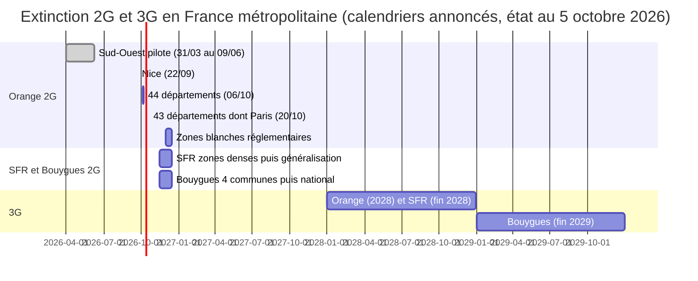
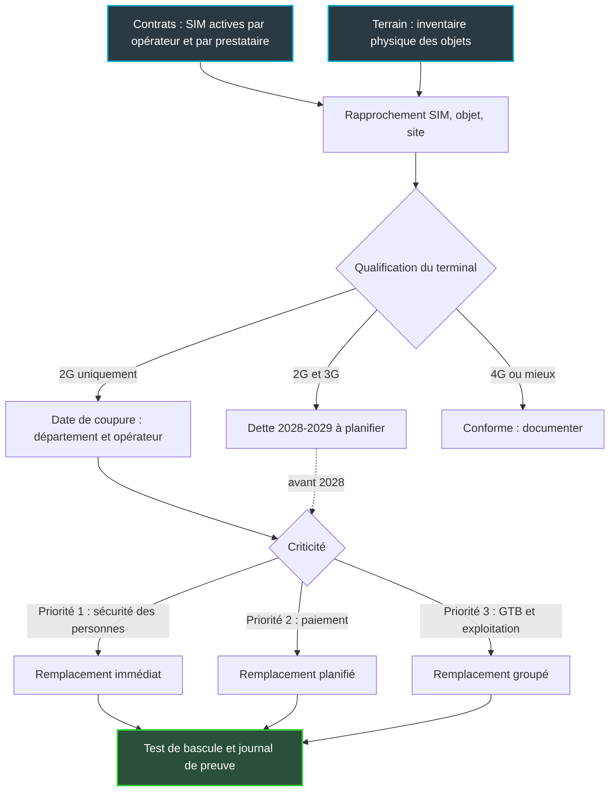
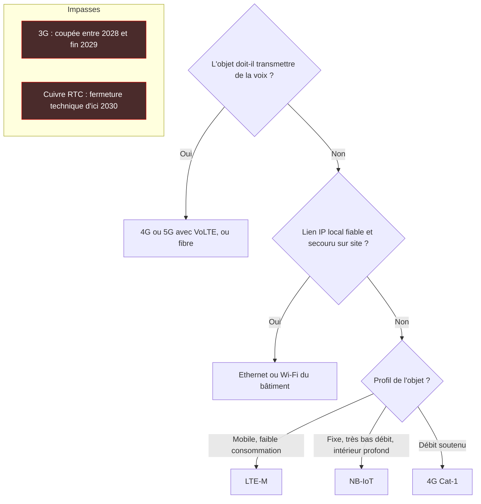

## Demain, 44 départements perdent la 2G d'Orange

Demain, mardi 6 octobre, Orange éteint son réseau 2G dans 44 départements d'un seul coup. Marseille, Rennes, Strasbourg, Montpellier, Nantes, Toulon, la Corse, la Seine-Saint-Denis, le Val-de-Marne. Deux semaines plus tard, le 20 octobre, 43 autres suivent, dont Paris, Lyon, Lille et Bordeaux. Ce jour-là, le réseau 2G d'Orange sera totalement arrêté en métropole, à l'exception de zones blanches réglementaires traitées début décembre.

Pour un smartphone, l'événement passera inaperçu. Pour un bâtiment, c'est une autre histoire. La téléalarme d'un ascenseur d'hôtel, le transmetteur d'alarme d'un magasin, l'interphone d'une résidence, le terminal de paiement d'un comptoir d'accueil : une partie de ces équipements a été installée il y a des années avec une carte SIM qui ne connaît que la 2G. Ils ne tomberont pas en panne. Ils deviendront muets. Et souvent, personne ne s'en apercevra avant le jour où quelqu'un appuiera sur le bouton.

Le piège, c'est de raisonner en date unique. La coupure arrive par vagues, département par département, opérateur par opérateur : SFR et Bouygues Telecom prennent le relais de mi-novembre à mi-décembre. Pour qui exploite des dizaines ou des centaines de sites, en hôtellerie, en résidences gérées ou dans le commerce, la réponse sérieuse n'est pas une note de service. C'est un inventaire, rattaché site par site à son calendrier de coupure.

## Une extinction en mosaïque, pas un interrupteur

Imaginez une ville qui couperait l'eau quartier par quartier, avec trois compagnies distinctes et trois calendriers différents. Votre immeuble, lui, a des robinets branchés sur les trois réseaux. C'est à peu près la situation de la 2G en France cet automne.

Côté Orange, le calendrier est public : l'Arcep, le régulateur des télécoms, l'a mis en ligne [2]. Un pilote a démarré le 31 mars 2026 à Biarritz, Anglet et Bayonne. Il s'est étendu aux Pyrénées-Atlantiques et aux Landes le 12 mai, puis à sept départements d'Occitanie et de Nouvelle-Aquitaine le 9 juin. Neuf départements sont donc déjà éteints. Nice a suivi le 22 septembre, en avance sur le reste des Alpes-Maritimes, qui basculent demain avec la grande vague.

Neuf, plus 44, plus 43 : le compte couvre les 96 départements métropolitains, Corse comprise. Le document est sans ambiguïté : « Au 20 octobre 2026, le réseau mobile 2G Orange sera totalement arrêté » [2]. Seule exception, des zones blanches réglementaires où les clients Orange perdront la 2G entre le 1er et le 15 décembre. Le document n'en détaille pas le périmètre.

Pour les autres, le paysage est moins net. Free Mobile n'a pas de réseau 2G en propre : ses abonnés suivent le calendrier d'Orange [3][10]. SFR annonce un arrêt à partir du 15 novembre selon la fiche de l'Arcep ; la presse détaille d'abord les zones très denses jusqu'au 30 novembre, puis une généralisation du 1er au 15 décembre [3][8][10]. Bouygues Telecom commence le 15 novembre par quatre communes (Brest, Guipavas, Nancy, Vandœuvre-lès-Nancy) et généralise du 1er au 15 décembre [3][7][9]. L'Arcep prévient elle-même que ces dates peuvent encore bouger au gré des annonces des opérateurs.

Conséquence directe : la date qui compte n'est pas celle de votre région. C'est le couple formé par le département du site et l'opérateur de la carte SIM. Prenez un hôtel à Nancy. Si son transmetteur d'alarme embarque une SIM Orange, il perd la 2G demain, la Meurthe-et-Moselle faisant partie de la vague du 6 octobre. Avec une SIM Bouygues Telecom, il tient jusqu'au 15 novembre. Même bâtiment, deux dates, près de six semaines d'écart.

*Calendriers annoncés au 5 octobre 2026. Les dates SFR et Bouygues Telecom peuvent encore évoluer ; la 3G est figurée à l'année.*

## Ce que l'Arcep compte, et ce qu'elle ne compte pas

Le 24 septembre, l'Arcep a publié la cinquième édition de son observatoire de l'extinction 2G et 3G [1]. Le titre a fait le tour de la presse : 1,7 million de terminaux 2G encore actifs fin juin 2026. Le chiffre est juste. Il est aussi très facile à mal lire.

Ce que l'Arcep mesure, ce sont des cartes SIM : celles des abonnés de Bouygues Telecom, Free Mobile, Orange et SFR, logées dans des terminaux compatibles uniquement avec la 2G, ou uniquement avec la 2G et la 3G, en France métropolitaine. Pas des appareils, pas des bâtiments, pas l'outre-mer. Les SIM montées par les constructeurs automobiles sont exclues du décompte des objets connectés. Et le communiqué ne dit pas si les cartes des opérateurs virtuels ou des revendeurs de connectivité pour objets sont incluses.

Compter les SIM pour mesurer le risque d'un parc immobilier, c'est compter les clés d'un trousseau sans savoir quelles portes elles ouvrent. L'exercice dit si le trousseau maigrit. Il ne dit pas si la téléalarme de l'ascenseur de votre hôtel rennais joindra encore quelqu'un mercredi.

Dans le détail, 1,68 million de SIM sont logées dans des terminaux 2G uniquement : 1,06 million pour la voix, les SMS et l'internet mobile, et 0,62 million pour les objets communicants, que les opérateurs rangent sous l'étiquette M2M (*machine-to-machine*) [1][5]. Un an plus tôt, le total dépassait 2,9 millions. La baisse atteint 41,4 % sur douze mois, dont 327 000 SIM sur le seul deuxième trimestre.

Le M2M fond plus vite que le reste : 1,22 million de SIM en terminaux 2G uniquement fin juin 2025, 0,78 million fin mars 2026, 0,62 million fin juin. Moitié moins en un an, et désormais 2,4 % du parc M2M [1]. À cela s'ajoute une deuxième famille, souvent oubliée : les terminaux qui parlent 2G et 3G, mais pas 4G. Ils hébergent 2,24 millions de SIM, dont 1,39 million côté M2M. Toutes catégories confondues, 3,9 millions de SIM dépendent encore de la 2G ou de la 3G, contre 5,9 millions un an plus tôt [1].

Côté objets, environ 390 000 SIM M2M ont quitté ces deux familles entre fin mars et fin juin (calcul à partir des tableaux Arcep, arrondis). C'est près des deux tiers de la baisse totale du trimestre, qui atteint 610 000 SIM [1][5]. Le M2M dépendant de la 2G ou de la 3G pèse encore 2,01 millions de SIM, soit 7,7 % du parc M2M.

Ma lecture, qui n'engage que moi : les parcs les plus simples partent en premier, ceux qu'un seul gestionnaire pilote depuis un seul contrat. Ce qui reste, c'est le résidu dur. Des objets dispersés, posés par un installateur parfois disparu, rattachés à un abonnement que plus personne ne relit. Exactement le profil d'un transmetteur d'alarme au fond d'un local technique.

Dernier point : ces chiffres datent de fin juin. Ils précèdent la coupure de Nice et celle de demain. L'Arcep présente d'ailleurs son observatoire comme un outil pour apprécier l'effet des actions des opérateurs auprès de leurs clients [1]. C'est un thermomètre du marché, pas l'état de vos sites ce lundi.

## Ascenseurs, alarmes, paiement : la carte des objets muets

Écartons d'abord une fausse piste : la couverture. Selon l'Arcep, plus de 99,8 % des sites 2G/3G sont déjà équipés en 4G, et la 4G couvre plus de 99,9 % de la population métropolitaine [3]. Le réseau de remplacement est là, sur les mêmes sites. Ce sont les terminaux qui ne savent pas s'y raccrocher.

Les autorités ont dressé la liste des suspects habituels. Le guide de l'Arcep et de la DGE (Direction générale des entreprises) cite les alarmes connectées et la télésurveillance, la téléassistance, les téléalarmes d'ascenseurs, les visiophones connectés et certains dispositifs médicaux [4]. La fiche pratique de l'Arcep y ajoute le pilotage du chauffage et les interphones [3]. Bouygues Telecom et la Banque des Territoires citent aussi les terminaux de paiement [6][9].

Transposée à un parc de bâtiments gérés, voici la carte que je dresserais. C'est une grille d'analyse, pas un relevé : elle se valide sur le terrain, site par site.

- **Hôtellerie et résidences gérées** : téléalarme d'ascenseur, transmetteur d'alarme, interphone et visiophone de portail, terminal de paiement de secours à l'accueil, téléassistance en résidence services.
- **Commerce** : terminaux de paiement autonomes, transmetteur de télésurveillance, boîtier de télémaintenance sur le froid ou la climatisation.
- **GTB** (gestion technique du bâtiment) : passerelles de relève de compteurs, pilotage du chauffage, supervision de chaufferie.

*Téléalarme d'ascenseur, centrale d'alarme, interphone, terminal de paiement, passerelle GTB : autant d'objets qui peuvent dépendre d'une SIM 2G sans que personne ne le sache.*

Pour les ascenseurs, le sujet a quitté le terrain de la bonne pratique. C'est une obligation. Depuis le 1er avril, le décret n° 2026-166 du 4 mars 2026 impose au mainteneur de vérifier toutes les six semaines le dispositif d'alerte et de communication [13][14]. Lorsque ce dispositif repose sur le RTC (réseau téléphonique commuté, autrement dit le cuivre), sur la 2G ou sur la 3G, le propriétaire en est informé par lettre recommandée, renouvelée au moins tous les six mois jusqu'aux travaux. Depuis le 15 mai, les contrôles techniques quinquennaux vérifient en outre la compatibilité avec des systèmes qui ne dépendent ni de la 2G/3G ni du cuivre [13][15].

L'enjeu est massif. La Banque des Territoires estimait en mars 2026 qu'environ 290 000 ascenseurs sur 650 000 étaient équipés d'une téléalarme 2G ou 3G [14]. Les sanctions en cas de non-conformité ne sont pas précisées dans les sources consultées [15].

Ce décret dit quelque chose qui dépasse les ascenseurs. Le pouvoir réglementaire a choisi la traçabilité plutôt que l'interdiction. Une lettre recommandée tous les six mois, c'est une preuve qui s'empile dans le dossier du propriétaire. Le jour d'un incident, la question ne sera plus *saviez-vous ?* mais *qu'avez-vous fait depuis la première lettre ?* Je parie que les autres objets de sécurité suivront la même logique de responsabilité, avec ou sans texte dédié.

## Auditer en quatre temps, sans attendre la lettre recommandée

Un audit 2G n'a rien de sophistiqué. Il est surtout fastidieux, ce qui explique qu'il soit si rarement mené jusqu'au bout. Quatre temps suffisent.

**1. Croiser deux inventaires.** Le premier est contractuel : demander à chaque opérateur la liste des SIM actives rattachées à vos comptes. Le second est physique : le tour des locaux techniques, des machineries d'ascenseur, des baies et des comptoirs. Les deux listes ne coïncideront pas, et c'est tout l'intérêt de l'exercice. Une partie des SIM qui font vivre un bâtiment peut ne figurer sur aucun de vos contrats, parce qu'elle est fournie par l'ascensoriste, le télésurveilleur ou l'installateur de la GTB. Il faut donc aussi interroger les prestataires.

**2. Qualifier chaque terminal.** Trois cases, pas plus : 2G uniquement, 2G et 3G, 4G ou mieux. La fiche technique du module suffit souvent. À défaut, l'IMEI (l'identifiant matériel du terminal) permet de retrouver le modèle exact, et l'ICCID (le numéro de la carte SIM) de faire le lien avec les listes des opérateurs. En cas de doute, un test tranche : l'objet s'enregistre-t-il sur le réseau quand la 2G n'est plus disponible ?

**3. Dater chaque objet.** Le département du site et l'opérateur de la SIM donnent la date de coupure.

| Date | Opérateur | Périmètre annoncé |
|---|---|---|
| 6 octobre 2026 | Orange (et Free) | 44 départements |
| 20 octobre 2026 | Orange (et Free) | 43 départements, dont Paris |
| À partir du 15 novembre 2026 | SFR | Zones très denses, puis généralisation du 1er au 15 décembre (selon la presse) |
| 15 novembre 2026 | Bouygues Telecom | Brest, Guipavas, Nancy, Vandœuvre-lès-Nancy |
| 1er au 15 décembre 2026 | Bouygues Telecom | Reste du territoire |
| 1er au 15 décembre 2026 | Orange | Zones blanches réglementaires |

**4. Prioriser par criticité.** D'abord la sécurité des personnes : ascenseurs, téléassistance, alarmes. Ensuite le chiffre d'affaires : les terminaux de paiement. Enfin l'exploitation : GTB, relève, chauffage. Un objet de sécurité situé dans un département coupé demain ne se planifie plus. On appelle le mainteneur aujourd'hui.

Reste l'étape que tout le monde saute : la preuve. Chaque remplacement doit se conclure par un test de bascule daté, documenté et signé par le prestataire. Ce journal, c'est ce que vous montrerez à l'assureur, au contrôleur technique ou, dans le pire des cas, au juge.

*Le flux d'audit : deux inventaires croisés, une qualification, une date par objet, puis une file de remplacement ordonnée par criticité.*

*Un audit 2G fonctionne comme un entonnoir : tout inventorier, qualifier, dater, puis remplacer par ordre de criticité.*

## 4G, LTE-M, NB-IoT ou câble : choisir une sortie, pas un sursis

Première règle : on ne migre pas de la 2G vers la 3G. Faire ce choix en 2026, c'est emménager dans un immeuble dont le permis de démolir est déjà affiché sur la façade. Orange éteindra sa 3G en 2028, SFR fin 2028, Bouygues Telecom fin 2029, et Free n'a pas encore annoncé de date [3][11]. L'Arcep évoque des « premières extinctions de réseaux 3G à l'horizon 2028 » [1].

Selon ma lecture des calendriers, que l'Arcep ne formule pas en ces termes, les terminaux 2G/3G continueront de fonctionner tant que la 3G de leur opérateur restera allumée. Puis ils tomberont à leur tour. Fin juin, cela concernait 1,39 million de SIM M2M [1]. La prochaine vague a déjà une date.

Il reste quatre sorties crédibles. La grille qui suit est la mienne, à confronter à la documentation de votre opérateur.

- **La 4G classique**, avec la voix sur 4G (VoLTE) quand l'objet doit parler : téléalarme d'ascenseur, interphone, téléassistance. Pour les objets qui échangent surtout des données, les modules dits Cat-1, une catégorie de 4G à débit modéré, font souvent l'affaire.
- **Le LTE-M** (*Long Term Evolution for Machines*), une déclinaison de la 4G taillée pour les objets : faible consommation, débit modeste, compatible avec la mobilité.
- **Le NB-IoT** (*Narrowband IoT*, IoT désignant l'Internet des objets), plus frugal encore : très bas débit, bonne pénétration à l'intérieur des bâtiments, pensé pour des capteurs fixes qui envoient quelques messages par jour.
- **L'IP local**, c'est-à-dire l'Ethernet ou le Wi-Fi déjà présents dans le bâtiment. Pour une passerelle GTB, un terminal de paiement ou un transmetteur d'alarme compatible IP, c'est souvent la sortie la plus directe, sans nouvel abonnement mobile.

LTE-M et NB-IoT sont présentés comme les remplaçants usuels de la 2G pour les objets, aux côtés de la 4G et de la 5G. Objenious, la filiale IoT de Bouygues Telecom, annonçait en juin 2024 une couverture supérieure à 99 % de la population [12]. Chiffre de vendeur, vieux de plus de deux ans : à reconfirmer auprès de votre opérateur, adresse par adresse.

L'IP local, lui, pose une condition non négociable. Un objet de sécurité qui doit fonctionner pendant une coupure de courant ne peut pas dépendre d'un switch sans onduleur. Pour les ascenseurs, les analyses de conformité citent la 4G, la 5G et la fibre comme technologies pérennes [15]. Quant au cuivre, il est hors jeu : Orange a annoncé une fermeture commerciale du cuivre progressive à partir de janvier 2026 et une fermeture technique par lots d'ici 2030 [4]. Revenir au RTC, c'est échanger une dette contre une autre.

Quelques écueils, enfin, que je surveillerais par expérience d'ingénieur, sans source publique pour les étayer ici. LTE-M et NB-IoT ne se replient ni sur la 2G ni sur la 3G : un module mal configuré ne retombe sur rien. La voix est absente du NB-IoT et dépend de l'opérateur en LTE-M. L'itinérance entre réseaux n'est pas acquise partout. Et chaque module doit être validé par l'opérateur, ce qui oblige souvent à changer d'un coup le module, la SIM et le firmware. Autant de points à vérifier avant de signer un bon de commande.

*Arbre de décision simplifié, issu de mon analyse : à valider objet par objet avec le fabricant et l'opérateur.*

*Le remplacement d'un module de communication se planifie avec le mainteneur, pas au lendemain de la coupure.*

## Ce n'est pas un projet télécom

La courbe de l'Arcep est une bonne nouvelle pour le marché et un mauvais indicateur pour vous. Un parc national de SIM 2G uniquement qui fond de 41,4 % en un an ne dit rien de vos sites. Ce qui compte, c'est le dernier transmetteur oublié dans une gaine technique, celui qui ne figurait sur aucune liste.

Le fond du problème est une question de propriété. Le propriétaire paie, l'exploitant vit avec, le mainteneur installe, l'opérateur coupe. Chacun a une bonne raison de penser que c'est le travail d'un autre. Le remède tient en une page : un RACI (qui réalise, qui décide, qui est consulté, qui est informé) par famille d'objets. Le propriétaire décide et finance. L'exploitant ou le syndic tient l'inventaire et le journal de risque. Le mainteneur qualifie, remplace et alerte par écrit. L'opérateur réseau fournit la liste des SIM et la connectivité de remplacement, cellulaire ou IP.

Viennent ensuite les contrats. Chaque contrat de maintenance devrait prévoir le remplacement des modules de communication avant toute extinction annoncée, avec un délai et une répartition des coûts. La 3G sera la prochaine. Autant écrire la clause une fois pour toutes.

Ma position est nette. L'extinction de la 2G n'est pas un chantier télécom : c'est un sujet de sécurité des occupants et de responsabilité du propriétaire. Le décret ascenseurs a ouvert la voie en rendant l'inaction traçable. La checklist tient en cinq lignes :

1. Demander dès aujourd'hui à chaque opérateur et à chaque prestataire la liste des SIM actives.
2. Qualifier chaque objet : 2G uniquement, 2G et 3G, 4G ou mieux.
3. Croiser département et opérateur pour obtenir une date par objet : 6 octobre, 20 octobre, mi-novembre, début décembre.
4. Traiter d'abord la sécurité des personnes, puis le paiement, puis la GTB.
5. Migrer vers la 4G, le LTE-M, le NB-IoT ou l'IP local. Jamais vers la 3G, jamais vers le cuivre.

Demain, 44 départements. Dans deux semaines, 43 de plus. Le seul calendrier qui protège vos occupants est celui que vous aurez reconstruit vous-même, objet par objet.

---

_Vues personnelles, pas position Wifirst._

## Sources

1. Arcep, communiqué « 1,7 millions de terminaux 2G étaient encore actifs fin juin 2026 » et annexe de données (24/09/2026) — https://www.arcep.fr/actualites/actualites-et-communiques/detail/n/extinction-des-reseaux-mobiles-2g-et-3g-240926.html ; PDF : https://www.arcep.fr/fileadmin/cru-1789736418/user_upload/50-26-version-francaise.pdf
2. Arcep, calendrier d'extinction 2G par département d'Orange (PDF, juillet 2026) — https://www.arcep.fr/fileadmin/cru-1786970039/user_upload/demarches-et-services/consommateurs/reseaux-2G-3G/calendrier-Orange-extinction-2G_2026.pdf
3. Arcep, fiche pratique « Fermeture des réseaux mobiles 2G et 3G : ce qu'il faut anticiper » (consultée le 05/10/2026) — https://www.arcep.fr/mes-demarches-et-services/consommateurs/fiches-pratiques/extinction-reseaux-mobiles-2g-3g.html
4. Arcep et DGE, guide « Les réseaux télécom mobiles 2G et 3G vont s'éteindre » (juillet 2025) — https://www.arcep.fr/uploads/tx_gspublication/plaquette-extinction-2G-3G_DGE_Arcep_juil2025.pdf
5. Degroup.test, « La 2G s'éteint bientôt : que révèlent les derniers chiffres de l'Arcep » (25/09/2026) — https://www.degrouptest.com/actualite/la-2g-s-eteint-bientot-que-revelent-les-derniers-chiffres-de-l-arcep-sur-les-appareils-a-migrer
6. Banque des Territoires, « Extinction de la 2G : alors que le rythme s'accélère, 1,7 million de terminaux 2G étaient encore actifs » (28/09/2026) — https://www.banquedesterritoires.fr/extinction-de-la-2g-alors-que-le-rythme-saccelere-17-million-de-terminaux-2g-etaient-encore-actifs
7. Selectra, fin de la 2G chez SFR et Bouygues Telecom en novembre et décembre (02/10/2026) — https://selectra.info/telecom/actualites/marche/fin-2g-sfr-bouygues-novembre-decembre
8. Univers Freebox, dates d'extinction 2G de Bouygues Telecom et SFR (26/03/2026) — https://www.universfreebox.com/article/592745/orange-commence-a-eteindre-sa-2g-des-dates-plus-precises-revelees-pour-bouygues-telecom-et-sfr/amp
9. Bouygues Telecom, « Fin de la 2G et de la 3G : dates, appareils concernés, que faire » — https://www.bouyguestelecom.fr/guide-pratique/smartphones/fin-2g-3g-appareils-concernes
10. Degroup.test, « Orange reprend les coupures le 22 septembre avant une vague massive en octobre » (21/08/2026) — https://www.degrouptest.com/actualite/fin-de-la-2g-orange-reprend-les-coupures-le-22-septembre-avant-une-vague-massive-en-octobre
11. Banque des Territoires, « Extinction de la 2G/3G : un calendrier ajusté à la marge, une échéance à préparer » (08/09/2025) — https://www.banquedesterritoires.fr/extinction-de-la-2g3g-un-calendrier-ajuste-la-marge-une-echeance-preparer
12. Objenious, « Understanding everything about the shutdown of 2G and 3G » (20/06/2024) — https://objenious.com/en/blogpost/shutdown-of-2g-and-3g/
13. Next.ink, décret sur la sécurité des ascenseurs face à la fin de la 2G, de la 3G et du xDSL (mars 2026) — https://next.ink/228364/fin-de-la-2g-3g-et-xdsl-un-decret-pour-garantir-la-securite-des-ascenseurs/
14. Banque des Territoires, décret imposant la modernisation des systèmes d'alerte des ascenseurs (mars 2026) — https://www.banquedesterritoires.fr/ascenseurs-un-decret-impose-la-modernisation-des-systemes-dalerte-face-larret-des-reseaux-2g-et-3g
15. Tennaxia, « Ascenseurs et appels d'urgence : se mettre en conformité avec le décret n° 2026-166 » (2026) — https://www.tennaxia.com/en/blog/ascenseurs-et-appels-durgence-se-mettre-en-conformite-avec-le-decret-n-2026-166
