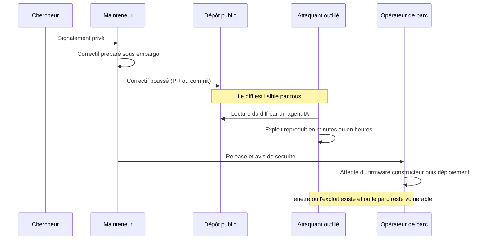
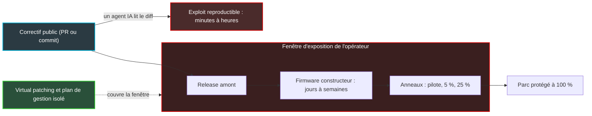

## Dix minutes entre un correctif et les premières sondes

Fin août, un mainteneur open source publie un correctif de sécurité. C'est un geste banal, que des milliers de projets répètent chaque jour. Une dizaine de minutes plus tard, ses journaux serveur voient arriver des requêtes qui testent précisément le trou qu'il vient de boucher. Le signal de départ tient en quelques lignes de code proposées sur une plateforme publique, lisibles par qui veut bien les lire.

Lui y voit la main d'agents d'intelligence artificielle. Sur un seul serveur, impossible de le prouver. Mais en juin, des chercheurs avaient mesuré en laboratoire qu'un modèle d'IA de pointe pouvait transformer un correctif publié en attaque fonctionnelle en quelques heures, parfois en moins d'une.

Pour quiconque opère un parc d'équipements réseau, ce détail change la nature du problème. Je pense aux milliers de bornes Wi-Fi accrochées aux plafonds des hôtels, des magasins, des résidences étudiantes et des sièges d'entreprise. Notre sécurité reposait sur un délai de grâce implicite : le temps qu'il fallait à un attaquant pour comprendre une faille à partir de son correctif. Ce délai est en train de s'effondrer. Pendant ce temps, nos cycles de mise à jour se comptent toujours en semaines, parfois en trimestres.

La question n'est plus de savoir si le secret tiendra. Elle est de savoir à quelle vitesse nous savons patcher.

## La carte au trésor que tout le monde sait lire

Pendant vingt ans, la divulgation coordonnée a reposé sur un pacte simple. Le chercheur signale la faille en privé. Le mainteneur prépare le correctif à l'abri, sous embargo, c'est-à-dire pendant une période de confidentialité convenue entre les parties. Puis tout sort en même temps : la version corrigée, l'avis de sécurité, l'identifiant CVE (le numéro de catalogue public de la vulnérabilité). Les défenseurs partent avec une longueur d'avance.

Ce pacte avait un angle mort connu, toléré parce qu'il coûtait cher à exploiter : le correctif lui-même. Un diff de sécurité (la différence ligne à ligne entre l'ancien et le nouveau code), c'est une carte au trésor. Il indique où creuser, et souvent comment. Mais cette carte était écrite dans une langue que peu de gens maîtrisaient. Il fallait un spécialiste, plusieurs jours de travail, beaucoup de patience. C'est ce coût de traduction qui faisait office de protection.

Les agents IA lisent désormais cette langue couramment.

Et en open source, la carte est affichée en vitrine avant même que l'ouvrage soit livré. Le correctif atterrit dans un dépôt public, parfois des semaines avant la version officielle qui l'embarque, et bien avant que le constructeur de votre équipement l'ait intégré à son firmware.

*Le schéma classique de divulgation coordonnée et sa fuite structurelle : le correctif public précède de loin le déploiement chez l'opérateur.*

L'épisode d'août a été raconté en détail par son protagoniste, Anil Madhavapeddy, chercheur à Cambridge et contributeur de longue date de l'écosystème OCaml [2]. La faille touchait cohttp, une bibliothèque HTTP écrite dans ce langage. Il s'agissait d'un path traversal : la possibilité de remonter l'arborescence de fichiers d'un serveur pour lire ce qui ne devrait pas l'être.

Le correctif part sous forme de pull request publique (une demande de modification ouverte à tous) ; il donnera la version 6.3.0 et l'avis de sécurité OSEC-2026-16. Environ dix minutes plus tard, des sondes testant des séquences de traversal encodées apparaissent dans ses logs. Il tente ensuite lui-même de reproduire l'attaque en local avec DeepSeek V4 Pro. Résultat : un exploit en moins de soixante secondes.

Sa conclusion [2], que relaie InfoQ [1], tient en une phrase : « la simple rumeur d'un problème de sécurité suffit à donner aux attaquants assez d'information ». Pas besoin du code complet. Savoir qu'il y a quelque chose à chercher, et à peu près où, suffit à orienter la recherche.

Il faut lire ce témoignage pour ce qu'il est : un serveur, un épisode. Des scanners génériques balaient Internet en permanence, et rien ne prouve que ces sondes venaient d'un agent IA. C'est l'inférence de l'auteur, pas une mesure. Quant à l'exploit en soixante secondes, c'est lui qui l'a produit, en connaissant déjà la faille. Ce récit illustre un usage possible. La preuve de capacité, elle, vient d'ailleurs.

## Des heures, pas des semaines

Commençons par la date qui fâche. Dans une étude publiée en juin par l'équipe Frontier Red Team d'Anthropic, le premier exploit Firefox était prêt dans l'heure suivant la mise en ligne du correctif [3][4]. Firefox 148, la version qui livrait ce correctif aux utilisateurs, est sortie environ dix-huit jours plus tard. Dix-huit jours pendant lesquels le correctif était lisible par tous et l'exploit déjà faisable.

L'étude porte sur les « n-days » : des failles déjà corrigées par l'éditeur, mais pas encore patchées sur le terrain. Sur 18 correctifs de SpiderMonkey, le moteur JavaScript de Firefox, le modèle Mythos Preview a produit 14 PoC (preuves de concept, c'est-à-dire du code qui démontre que la faille est exploitable). Le premier exploit est arrivé en un peu moins d'une heure. Huit étaient prêts en douze heures environ.

Côté Windows, le résultat est plus inconfortable encore. Sur 21 correctifs du noyau, le modèle a sorti 18 PoC et 8 chaînes complètes d'élévation de privilèges (passer d'un compte limité au contrôle total de la machine), pour environ 15 700 USD au total. Premier PoC : 31 minutes. Détail qui pique : 13 des 14 failles que Microsoft classait « Exploitation Less Likely » ou « Unlikely » ont eu leur PoC.

Vient ensuite la comparaison qui devrait faire réfléchir tout responsable d'exploitation. Windows Autopatch, le service de mise à jour automatisée de Microsoft, met 7 jours pour couvrir 90 % d'un parc et 11 jours pour forcer le redémarrage. Tous les exploits de l'étude étaient prêts avant l'application automatique. Mozilla, de son côté, est passé d'un rythme de publication mensuel à hebdomadaire.

Une nuance s'impose, et elle compte. Mythos Preview est un modèle de pointe à accès restreint. Testé sur les mêmes correctifs, Opus 4.8 obtient 11 sur 18 côté Firefox et 15 sur 21 côté Windows, mais uniquement des PoC, sans aucune chaîne complète. Écrire que n'importe quel attaquant dispose aujourd'hui de cette capacité serait faux. Écrire qu'elle existe et qu'elle se diffuse est exact : Anthropic souligne elle-même le risque posé par des modèles publics dont on aurait retiré les garde-fous.

Le signal n'est d'ailleurs pas nouveau. En avril 2024, une équipe de l'université de l'Illinois montrait que GPT-4 exploitait 87 % d'un échantillon de 15 vulnérabilités « one-day » quand on lui fournissait la description CVE, contre 7 % sans [5]. GPT-3.5, les modèles open source testés et les outils classiques comme ZAP ou Metasploit restaient à zéro. Petit échantillon, modèle daté : ce n'est pas l'état de l'art. La leçon structurelle tient pourtant toujours. C'est l'information publiée sur la faille qui guide l'agent.

Gardons les deux preuves séparées, car elles ne disent pas la même chose. Le laboratoire établit ce qu'un modèle sait faire. Le témoignage de Madhavapeddy suggère que quelqu'un, peut-être, essaie déjà. Les additionner pour en tirer une certitude serait malhonnête. Attendre une troisième preuve avant d'agir le serait tout autant.

*Le correctif public, l'agent qui le lit, l'exploit qui jaillit, puis le long convoyeur des firmwares vers les bornes : deux vitesses dans une même chaîne.*

## L'open source réécrit déjà ses règles

Les mainteneurs n'ont pas attendu les éditorialistes. QEMU, l'émulateur et hyperviseur open source au cœur de nombreuses plateformes de virtualisation, a formalisé une ligne dure [7]. Le marqueur « confidentiel » y est limité au strict nécessaire pour développer le correctif et obtenir un identifiant CVE. Les demandes d'embargo arbitraires sont en principe refusées pour les trouvailles issues d'outils automatisés : fuzzers (outils qui bombardent un programme d'entrées aléatoires pour le faire planter) ou IA. Motif avancé : ces failles seront « très probablement redécouvertes indépendamment, potentiellement plusieurs fois, très rapidement ». L'usage d'outils IA doit d'ailleurs être déclaré dès le signalement.

C'est un renversement philosophique. L'embargo protégeait une information rare. QEMU acte qu'elle ne l'est plus.

Du côté des petits projets, la pression se lit dans l'agenda des mainteneurs. Selon son créateur, Nick Craig-Wood, rclone (l'outil open source de synchronisation de fichiers vers le stockage cloud) a reçu environ 20 divulgations de sécurité en dix ans, puis plus de 40 en un seul mois [1]. « A huge amount of my time », résume-t-il. La part exacte des outils IA dans cet afflux n'est pas établie. Le déséquilibre, lui, saute aux yeux.

Un papier récent de Pesoli, Errico et Cavallaro met des mots sur le phénomène [6]. L'IA fait chuter le coût de génération des candidats et des PoC. Elle ne fait pas baisser celui de la validation, du tri, de l'écriture du correctif et de la publication. Le goulot n'est plus la découverte : c'est le débit de remédiation. Et les projets open source, déjà sous-dotés, sont les premiers à le subir.

Madhavapeddy esquisse trois pistes [2]. D'abord, des discussions privées entre mainteneurs qui se connaissent, via un réseau de confiance (web-of-trust), pour ne pas exposer le correctif avant qu'il soit prêt. Ensuite, une livraison continue, hebdomadaire, sur le modèle de Chrome, pour que l'écart entre correctif et version disparaisse. Enfin, le virtual patching au niveau protocole : bloquer le motif d'attaque en amont, dans un proxy ou un pare-feu, avant même que le code soit corrigé. Les trois convergent vers la même idée. Quand le secret ne tient plus, on gagne sur la vitesse et sur la surface d'exposition.

## Une course de relais où l'adversaire part avant nous

Transposons au monde des réseaux d'accès. Pour un opérateur Wi-Fi, la chaîne de patch compte trois maillons. Le premier, c'est le correctif amont dans les briques open source présentes dans quasiment toutes les bornes : la pile d'authentification Wi-Fi (hostapd et wpa_supplicant), les bibliothèques cryptographiques et réseau (OpenSSL, curl), la boîte à outils système (BusyBox), le noyau Linux, les dépendances de l'agent de gestion. Le deuxième, c'est le firmware du constructeur qui intègre ce correctif. Le troisième, c'est le déploiement sur le parc.

L'IA ne comprime que l'écart entre le premier maillon et l'exploit. Il peut désormais se compter en heures. Le deuxième maillon, lui, se compte souvent en semaines. L'exposition réelle de l'opérateur, c'est la somme du deuxième et du troisième.

C'est une course de relais où l'adversaire s'élance au coup de pistolet, pendant que notre premier relayeur attend encore qu'un tiers lui tende le témoin. Peu importe la vitesse de nos équipes de déploiement si le firmware arrive trois semaines après l'exploit.

D'où une affirmation que j'assume : un cycle firmware trimestriel n'est plus une politique de maintenance. C'est une vulnérabilité en soi, prévisible, que n'importe quel attaquant peut inscrire à son calendrier.

Faites l'exercice avec vos contrats. Combien de constructeurs de bornes ou de CPE (les équipements installés chez le client, box ou routeurs) s'engagent sur un délai chiffré entre un correctif amont et le firmware qui l'intègre ? Mon pari : très peu. C'est une hypothèse, pas une statistique, et je serais ravi d'avoir tort.

*La fenêtre d'exposition réelle : l'exploit est possible dès le correctif public, le parc n'est protégé qu'au bout du dernier anneau. Le virtual patching sert à couvrir l'intervalle.*

Le contexte général n'aide pas. Dans M-Trends 2026, Mandiant estime le délai moyen d'exploitation à -7 jours : en moyenne, les failles sont exploitées avant que le correctif soit disponible [8]. Attention, ce chiffre est tiré par les zero-days et ne mesure pas le mécanisme décrit ici. Il dit simplement que la pression est déjà maximale.

Plus parlant pour nous : les exploits restent le premier vecteur d'intrusion, à 32 %. Et les équipements de bordure (VPN, routeurs) sont des cibles délibérées : Mandiant cite des campagnes comme BRICKSTORM, avec un dwell time, le temps de présence d'un attaquant avant sa détection, proche de 400 jours, quand la médiane tous incidents confondus est de 14 jours. La raison est prosaïque : ces boîtiers n'ont pas la télémétrie qu'apportent les EDR (les outils de détection et de réponse installés sur les postes et serveurs). Un équipement de bordure compromis peut donc, dans les cas extrêmes, rester silencieux près d'un an.

## Patcher vite sans couper le Wi-Fi d'un hôtel plein

Premier réflexe à industrialiser : savoir en quelques minutes si l'on est concerné. C'est le rôle du SBOM (Software Bill of Materials), la nomenclature exhaustive des composants logiciels d'un firmware, version par version. Couplé à un document VEX (Vulnerability Exploitability eXchange), qui précise « composant présent mais code vulnérable non atteignable », il transforme l'alerte « un correctif OpenSSL vient d'apparaître » en décision immédiate. Concerné, pas concerné, ou concerné mais non exploitable.

Sans SBOM exploitable, le scénario est connu. On écrit au constructeur, qui interroge son sous-traitant, qui remonte au fournisseur du chipset. Deux jours plus tard, on ne sait toujours pas. Quand un exploit se construit en heures, ces deux jours sont un luxe que personne n'a plus.

Deuxième chantier : la mise à jour automatisée, mais jamais aveugle. Concrètement, des partitions A/B sur chaque équipement (deux emplacements de firmware : on écrit le nouveau sur l'un, on redémarre sur l'ancien en cas d'échec). Des anneaux de déploiement successifs : labo, site pilote, 5 % du parc, 25 %, puis tout le reste. Des critères d'arrêt automatiques, comme un taux de redémarrage anormal, une hausse des échecs d'authentification ou une chute du nombre de clients associés. Et un retour arrière qui ne demande aucune intervention sur site.

*Déploiement par anneaux : d'une borne de test à tout un campus, avec des indicateurs de santé à chaque étape et un retour arrière automatique dès que l'un d'eux vire au rouge.*

Ce dernier point est vital dans nos métiers. Dans l'hôtellerie ou les résidences étudiantes, on n'envoie pas un technicien dans des milliers de chambres parce qu'une mise à jour a mal tourné. Les fenêtres de maintenance sont étroites : la nuit, hors événements, jamais un soir de congrès. Le Wi-Fi d'un hôtel qui tombe pendant un séminaire, c'est un incident commercial avant d'être un incident technique.

La leçon de Windows Autopatch vaut avertissement. Même automatisé, un déploiement qui prend 7 à 11 jours arrive après l'exploit. Mozilla en a tiré la conclusion logique en passant à l'hebdomadaire. Pour un parc de bornes, viser l'hebdomadaire n'a aucun sens si chaque mise à jour reste un événement à risque. Il faut d'abord rendre la mise à jour ennuyeuse.

C'est là que la thèse « Bugonomics » nous rattrape : le goulot se déplace chez nous. Validation, tests de non-régression, astreinte. Un firmware Wi-Fi ne se teste pas comme une application web. Il faut vérifier le roaming (le passage d'une borne à l'autre sans coupure), l'authentification 802.1X des réseaux d'entreprise, le portail captif des réseaux invités. Promettre un patch en 72 heures sans banc de test automatisé, c'est promettre des incidents en 72 heures. Investissez dans les tests avant de signer la promesse.

Troisième levier : compenser le délai qu'on ne peut pas comprimer. Le plan de gestion des équipements ne doit jamais être exposé sur Internet. Des ACL (listes de contrôle d'accès) et une segmentation stricte côté contrôleur réduisent la surface attaquable. Des règles WAF ou IPS (pare-feu applicatif et système de prévention d'intrusion) doivent pouvoir être poussées en quelques heures, le temps que le firmware arrive. C'est le virtual patching de Madhavapeddy, version opérateur.

Les autorités américaines ont déjà intégré cette logique. Publiée en juin, la directive BOD 26-04 de la CISA, l'agence fédérale de cybersécurité, fixe aux agences civiles fédérales un délai de 3 jours calendaires pour traiter les failles qui cumulent quatre critères : exposées, automatisables, offrant un contrôle total et connues comme exploitées [9]. Point capital : la « remédiation » y inclut l'isolement ou la désinstallation, pas seulement le patch. Quand l'administration fédérale admet que remédier, c'est parfois débrancher, on peut s'autoriser le même pragmatisme.

## Le contrat, première ligne de défense

Tout cela ne vaut rien si le deuxième maillon reste une boîte noire. Le levier le plus sous-utilisé de la sécurité des parcs, c'est le contrat fournisseur. Cinq clauses devraient devenir la norme :

1. **Un SLA de livraison en jours** (engagement contractuel de niveau de service) pour les vulnérabilités de sévérité haute et critique, mesuré à partir de la publication du correctif amont, pas de l'avis du constructeur.
2. **Une veille active des correctifs amont** par le constructeur, sur toutes les briques open source qu'il embarque.
3. **La répercussion des notifications** : quand le constructeur alerte les autorités, l'opérateur doit l'apprendre dans le même délai.
4. **Un SBOM livré à chaque version** de firmware, dans un format lisible par machine.
5. **Le support garanti du retour arrière**, testé et documenté.

Le contexte réglementaire donne de l'appui à ces demandes. Depuis le 11 septembre 2026, le Cyber Resilience Act (CRA), le règlement européen sur la cybersécurité des produits numériques, impose aux fabricants une alerte sous 24 heures pour toute vulnérabilité activement exploitée. La notification suit à 72 heures, puis le rapport final 14 jours après la disponibilité d'une mesure corrective, le tout via la plateforme unique de l'ENISA, l'agence européenne de cybersécurité [10]. L'application complète du texte interviendra le 11 décembre 2027.

Un fabricant capable de réagir en 24 heures face au régulateur peut le faire face à son client. Le CRA organise la remontée vers les autorités. Le délai concret dans lequel le firmware corrigé atteindra votre parc, lui, mérite d'être écrit noir sur blanc dans le contrat.

*Le SBOM, nomenclature logicielle de chaque firmware : le document le plus ennuyeux du contrat, et celui qui fait gagner des jours le moment venu.*

## Le secret était un luxe, la vitesse est une compétence

Je ne dis pas que l'embargo est mort. Pour une faille complexe dont le correctif demande des semaines d'ingénierie, quelques jours de discrétion restent utiles. Mais l'embargo ne peut plus être la défense. Il couvre, au mieux, la période qui précède la publication du correctif. Or c'est précisément après cette publication que commence notre exposition.

Ma position est donc tranchée. La fenêtre de sécurité d'un parc d'équipements ne se joue plus dans le secret, mais dans sa capacité à ingérer vite les correctifs amont. Cela suppose d'exiger des fournisseurs un SLA de patch en jours, pas en trimestres. Cela suppose aussi d'industrialiser une mise à jour automatisée et testée, au point qu'elle devienne une routine plutôt qu'un événement.

Le reste est une affaire de mesure. Voici trois chiffres à sortir dès lundi, pour n'importe quelle équipe réseau, la mienne comprise :

- **le délai médian entre un correctif amont et le firmware constructeur qui l'intègre** ;
- **le délai médian entre la sortie d'un firmware et sa présence sur 90 % du parc** ;
- **la part du parc couverte par un SBOM réellement exploitable.**

Si vous ne connaissez pas ces trois chiffres, vous ne connaissez pas votre fenêtre d'exposition. L'attaquant, lui, n'a plus besoin de la deviner. Il lui suffit de lire le diff.

## Sources

1. [InfoQ, Renato Losio, 3 octobre 2026](https://www.infoq.com/news/2026/10/open-source-ai-security/)
2. [Anil Madhavapeddy, « rumour is the exploit », 22 août 2026](https://anil.recoil.org/notes/rumour-is-the-exploit)
3. [Anthropic Frontier Red Team, « Measuring LLMs' impact on N-day exploits », 8 juin 2026](https://www.anthropic.com/research/n-days)
4. [The Decoder, « Anthropic study shows AI needs hours, not weeks, to build exploits from security patches »](https://the-decoder.com/anthropic-study-shows-ai-needs-hours-not-weeks-to-build-exploits-from-security-patches/)
5. [Fang, Bindu, Gupta, Kang, « LLM Agents can Autonomously Exploit One-day Vulnerabilities », arXiv 2404.08144, avril 2024](https://arxiv.org/abs/2404.08144)
6. [Pesoli, Errico, Cavallaro, « Demystifying the Mythos or Disrupting Bugonomics? », arXiv 2605.24632](https://arxiv.org/abs/2605.24632)
7. [QEMU, Security Process](https://www.qemu.org/contribute/security-process)
8. [Google Cloud / Mandiant, M-Trends 2026](https://cloud.google.com/blog/topics/threat-intelligence/m-trends-2026?hl=en)
9. [Qualys, « CISA BOD 26-04 : 3-day remediation SLA », 9 juillet 2026](https://blog.qualys.com/product-tech/2026/07/09/cisa-bod-26-04-3-day-remediation-sla)
10. [Browne Jacobson, « Cyber Resilience Act reporting obligations in force »](https://www.brownejacobson.com/insights/cyber-resilience-act-reporting-obligations-in-force)

---

_Vues personnelles, pas position Wifirst._
