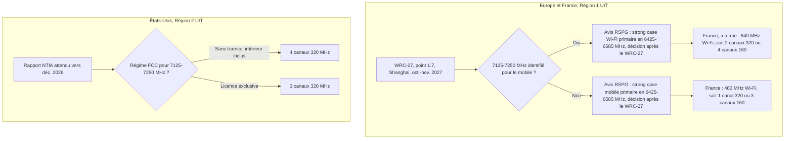

## Un hôtel, quarante points d'accès, un seul canal

Prenez un hôtel de 150 chambres en France, équipé de quarante points d'accès Wi-Fi 7 flambant neufs. Sur la fiche technique, chacun sait émettre sur un canal de 320 MHz, la largeur maximale de cette génération, celle qui fabrique les chiffres de débit des brochures. Faites le calcul : dans la bande ouverte au Wi-Fi en France, il n'y a de place que pour un seul canal de cette taille sans chevauchement. Un seul. Pour tout le bâtiment.

Ce n'est pas un détail d'ingénieur radio. Hôtels, campus, résidences étudiantes, enseignes de retail, sièges sociaux : partout où des dizaines de points d'accès cohabitent sous un même toit, la promesse « 320 MHz » relève de la fiche technique, pas du plan de fréquences. Et la question de savoir s'il y aura un jour un deuxième canal ne se tranchera ni chez les constructeurs, ni chez les intégrateurs. Elle se jouera à Shanghai, à l'automne 2027, autour d'une tranche de 125 MHz située juste au-dessus de 7 GHz, que les opérateurs mobiles convoitent pour la 6G.

Pourquoi en parler maintenant ? Parce que le calendrier se resserre des deux côtés de l'Atlantique. À Washington, la Maison-Blanche veut réserver cette bande à des licences mobiles, et le rapport qui doit en dessiner les contours est attendu vers décembre. En Europe, les positions se figent avant la conférence mondiale. Et le 5 octobre, l'analyste Dean Bubley a relancé la bataille dans Light Reading [1]. C'est le bon moment pour remettre la fiche technique à sa place.

## Une salle de réunion, pas un auditorium

Commençons par une image. Un canal Wi-Fi fonctionne comme une salle de réunion : tous les appareils qui s'y trouvent attendent leur tour pour parler. Quand deux points d'accès voisins émettent sur le même canal, ils partagent la même salle, donc le même temps de parole. Tout l'art d'un plan Wi-Fi consiste à donner à chaque point d'accès une salle différente de celle de ses voisins. C'est la réutilisation de fréquences.

Un canal de 320 MHz, c'est un auditorium. Parfait pour une keynote. Absurde si l'on remplace les six salles de réunion d'un étage par un auditorium unique : la salle est immense, mais une seule équipe parle à la fois.

Passons aux chiffres, avec une précaution : le calcul qui suit est le mien, à valider sur le plan de canaux officiel du standard 802.11be (le Wi-Fi 7). En France comme dans toute l'Union européenne, le Wi-Fi n'a accès qu'au bas de la bande 6 GHz, de 5945 à 6425 MHz, soit 480 MHz (décision UE 2021/1067, décision Arcep 2021-2184) [17]. Dans 480 MHz, on loge au choix :

- **1 canal de 320 MHz** sans chevauchement, plus 160 MHz résiduels ;
- **3 canaux de 160 MHz** ;
- **6 canaux de 80 MHz**.

Pour un hôtel de quarante points d'accès, seules les deux dernières lignes ressemblent à un plan de fréquences. Le canal de 320 MHz reste exploitable sur un point d'accès isolé : un amphithéâtre, une salle de conférence en bout d'aile, un petit site peu dense. Partout ailleurs, il fusionne quarante cellules en une seule file d'attente.

La puissance n'arrange rien. En France, le Wi-Fi 6 GHz fonctionne en LPI (Low Power Indoor, faible puissance en intérieur), plafonné à 23 dBm de puissance rayonnée moyenne [17]. Élargir le canal revient à étaler la même énergie sur davantage de spectre. Le 320 MHz en intérieur, c'est un auditorium mal sonorisé.

Et le Wi-Fi 8 ne viendra pas à la rescousse. D'après l'état des travaux du groupe IEEE 802.11bn tel qu'il est résumé publiquement [18], la largeur maximale reste fixée à 320 MHz ; cette génération vise la fiabilité et la latence, avec une ratification visée pour 2028 (source secondaire, à recouper). Le facteur limitant du Wi-Fi d'entreprise n'est donc plus la largeur de canal. C'est le nombre de canaux propres. Autrement dit, la quantité de spectre.

*Un canal large qui recouvre toutes les cellules, ou des canaux plus étroits que l'on réutilise d'une chambre à l'autre : dans un couloir d'hôtel, l'arbitrage est vite fait.*

## Washington : trois canaux et une bande convoitée

Aux États-Unis, le Wi-Fi joue sur un terrain deux fois et demie plus grand. Depuis avril 2020, la FCC (Federal Communications Commission, le régulateur américain) autorise sans licence toute la bande 5925–7125 MHz, soit 1200 MHz, en intérieur et à faible puissance [5]. La puissance standard, celle de l'extérieur et des longues portées, passe par l'AFC (Automated Frequency Coordination) : une base de données qui n'autorise l'émission qu'après avoir vérifié qu'on ne brouille pas les liaisons existantes. Et l'AFC ne couvre que 5925–6425 et 6525–6875 MHz. Soit 850 MHz, pas 1200 : méfiez-vous des synthèses qui confondent les deux chiffres.

Sur 5945–7125 MHz, mon calcul donne trois canaux de 320 MHz. C'est aussi le chiffre que met en avant WifiForward, la coalition américaine pro-Wi-Fi, dans sa contribution de mars 2024 [6]. Son argumentaire : la puissance standard ne permet qu'un seul canal de 320 MHz, encore rogné par des zones d'exclusion, et un quatrième canal reste « stranded », échoué en bord de bande. Les 125 MHz de 7125–7250 MHz suffiraient à le compléter ; mon calcul passe alors effectivement à quatre. C'est un plaidoyer d'industrie, pas une position de régulateur.

Le problème, c'est que la Maison-Blanche regarde ailleurs. Le 19 décembre 2025, le mémorandum présidentiel « Winning the 6G Race » (un NSPM, National Security Presidential Memorandum) demande à la NTIA (National Telecommunications and Information Administration, l'agence qui gère le spectre fédéral) de « immediately begin the process of identifying the band of spectrum frequencies at 7.125-7.4 GHz for reallocation for full-power commercial licensed use cases » [2]. Traduction : des licences mobiles, à pleine puissance.

Le texte ne mentionne ni le sans-licence, ni le Wi-Fi, ni le partage. Il commande aussi une étude de relocalisation des utilisateurs fédéraux, y compris vers 7,4–8,4 GHz, sous douze mois : échéance vers le 19 décembre 2026. Le 31 juillet, la NTIA a confirmé mener ce chantier de front avec trois autres bandes (1,6, 2,7 et 4,4 GHz) [3].

Le décor législatif pousse dans le même sens. Selon le Congressional Research Service [4], la loi One Big Beautiful Bill Act de juillet 2025 rétablit l'autorité d'enchères de la FCC jusqu'au 30 septembre 2034, mais exclut de son champ 3,1–3,45 GHz et 7,4–8,4 GHz. Ma lecture : si 7,4–8,4 GHz échappe aux enchères et sert de point de chute aux fédéraux, la pression se concentre sur la tranche juste en dessous. Précision utile, car la rumeur circule : aucune enchère 7 GHz n'est programmée. Rien ne sera tranché avant le rapport de la NTIA, puis la FCC.

Les camps se sont alignés en quelques jours. La CTIA, le lobby mobile américain, a salué le mémorandum par la voix d'Ajit Pai. La NCTA, le lobby du câble, a jugé à l'inverse que l'orientation retenue sur le lower 7 GHz freine l'innovation américaine, rapporte Broadband Breakfast [7].

Entre ces deux pôles, Dean Bubley défend un compromis [1]. Selon lui, les 125 MHz offriraient « an extra 320MHz Wi-Fi channel or two 160MHz channels », et quatre canaux de 320 MHz constituent le « magic number » des grilles de points d'accès en entreprise. Sa recommandation : 7,125–7,25 GHz sans licence ; 7,25–7,4 GHz sous licence, avec protection des titulaires actuels et éventuellement une enchère.

Il ajoute un argument de couverture : à 7 GHz, une macro-cellule extérieure traverserait mal les murs, avec un rayon de cellule réduit d'environ 30 % face à la bande C et à peu près deux fois plus de sites à construire [1][20]. Ce sont des opinions d'analyste, et Bubley est un défenseur affiché du partage. Je n'ai trouvé aucune étude tierce de pénétration à 7 GHz qui les confirme ou les infirme.

Un point mérite d'être recadré, parce qu'il brouille souvent le débat. On parle volontiers de « partage de type AFC » pour le 7 GHz. Or l'AFC sert surtout l'extérieur et la haute puissance. Un hôtel, un campus ou une résidence étudiante tournent en intérieur, en LPI, sans AFC. Un 7 GHz réservé à l'AFC ne protégerait donc pas le Wi-Fi indoor. Le vrai enjeu, c'est que l'intérieur ne soit pas exclu ; Bubley le formule ainsi : la bande « should not exclude indoor or local access ».

## Europe : 125 MHz pour en débloquer 160

En Europe, la même tranche joue un rôle inverse. Le Wi-Fi ne cherche pas à la conquérir. C'est une monnaie d'échange : si le mobile l'obtient, le Wi-Fi récupère 160 MHz ailleurs. S'il ne l'obtient pas, le mobile viendra chercher ces 160 MHz lui-même.

Tout passe par le WRC-27, la Conférence mondiale des radiocommunications de l'UIT (Union internationale des télécommunications), du 18 octobre au 12 novembre 2027 à Shanghai [15]. Son point 1.7 étudie l'identification de nouvelles bandes pour l'IMT (International Mobile Telecommunications, c'est-à-dire le mobile). Mais pas les mêmes bandes selon les régions du monde.

Dans les Régions 2 et 3 (Amériques, Asie-Pacifique), l'étude couvre 7125–8400 MHz. Dans la Région 1, celle de l'Europe, elle se limite à 7125–7250 MHz et 7750–8400 MHz, d'après la Résolution 256 du WRC-23 telle que la cite le régulateur slovène [10]. Washington et Bruxelles ne jouent donc pas la même partie, même quand ils parlent de la même tranche.

Le mécanisme a été posé le 12 novembre 2025 par le RSPG (Radio Spectrum Policy Group), le comité qui conseille la Commission européenne sur le spectre. Son avis sur le haut de la bande 6 GHz découpe le terrain [8] :

- **6585–7125 MHz (540 MHz)** : prioritaire pour les réseaux mobiles ;
- **6425–6585 MHz (160 MHz)** : bande de garde gelée, avec des masques d'émission qui protègent le Wi-Fi du bas 6 GHz, « until the WRC-27 which may identify the additional band 7125-7250 MHz for IMT ». D'ici là, les États membres ne l'attribuent ni au mobile, ni au Wi-Fi.

La suite est conditionnelle. Si le WRC-27 identifie 7125–7250 MHz pour le mobile, le RSPG voit un « strong case » pour attribuer 6425–6585 MHz au Wi-Fi à titre primaire. Sinon, le « strong case » bascule vers le mobile. La décision sur ces 160 MHz ne viendra qu'après la conférence. L'avis reconnaît d'ailleurs que le haut 6 GHz apporterait au Wi-Fi des canaux de 80 et 160 MHz supplémentaires, pour les écoles et les hôpitaux notamment, et « more 320 MHz channels ». La Wi-Fi Alliance avait jugé la recommandation « short-sighted » [14].

*Même tranche de 125 MHz, deux mécaniques opposées. Les nombres de canaux sont un calcul de l'auteur, à valider sur le plan de canaux 802.11be.*

Reprenons la calculette. Avec 6425–6585 MHz, la France passerait de 480 à 640 MHz de Wi-Fi : deux canaux de 320 MHz, ou quatre de 160 MHz. C'est mieux. Ce n'est toujours pas de quoi bâtir un plan de réutilisation en 320 MHz dans un bâtiment dense.

D'où un paradoxe que peu de gens formulent, et c'est mon analyse : en Europe, le Wi-Fi aurait intérêt à ce que le mobile obtienne 7125–7250 MHz à Shanghai, puisque l'avis du RSPG ouvre alors un « strong case » pour 6425–6585 MHz en Wi-Fi primaire (sans engagement : la décision revient au RSPG après le WRC-27). Aux États-Unis, c'est exactement l'inverse.

*Europe contre États-Unis : la même tranche de 125 MHz, que le Wi-Fi veut conquérir d'un côté et voir partir au mobile de l'autre.*

### Le diable est dans les petites lignes

Sauf que l'identification ne suffit pas. Le RSPG lui-même écrit qu'« it remains undecided whether and to what extent » 7125–7250 MHz pourrait prolonger le haut 6 GHz pour le mobile, à cause de la protection des services satellitaires d'exploration de la Terre et de recherche spatiale [8].

Quant à sa position pour le WRC-27, je n'en connais que le projet, soumis à consultation publique du 18 juin au 24 août 2026 [11] ; je n'ai pas trouvé de source sur sa version finale. D'après le régulateur slovène qui en relaie le contenu [10], ce projet propose de s'opposer à l'IMT en 7,25–8,4 GHz notamment. Il envisage en revanche un soutien en 7125–7250 MHz, si les services existants sont protégés et si les contraintes imposées au mobile restent acceptables.

En face, la GSMA (l'association mondiale des opérateurs mobiles) et Connect Europe ont posé leurs conditions le 27 mars 2026 [12]. Elles réclament au moins 200 MHz par opérateur pour lancer la 6G, et « at least 665 MHz of contiguous spectrum », soit 540 + 125 MHz. Elles soutiennent l'identification de 7125–7250 MHz, à condition qu'aucune contrainte n'y empêche les macro-cellules à haute puissance. À défaut, elles demandent 6425–6585 MHz pour le mobile. Le projet de feuille de route 6G du RSPG, lui, retient un plancher de 540 MHz continus, 7125–7250 MHz n'étant qu'un complément s'il est identifié [9].

Lisez les positions côte à côte. Le projet du RSPG dit en substance : nous soutiendrons peut-être le mobile en 7125–7250 MHz, sous conditions. Les opérateurs mobiles répondent : nous en voulons, à condition de pouvoir y installer des macro-cellules à pleine puissance. Si Shanghai accouche d'une identification assortie de contraintes, le camp mobile aura un argument tout prêt pour revendiquer quand même les 160 MHz du milieu. La vraie bataille ne porte pas sur l'identification. Elle porte sur les petites lignes.

### Londres a déjà tranché

Le Royaume-Uni, hors UE, n'a pas attendu Shanghai. Ofcom, le régulateur britannique, a publié le 20 juillet 2026 sa décision de partage priorisé : Wi-Fi prioritaire en 6425–6585 MHz, mobile prioritaire en 6585–7125 MHz [16]. Le Wi-Fi y suit les mêmes règles qu'en bas 6 GHz, LPI et VLP (Very Low Power, très faible puissance), l'extérieur et la haute puissance passant par l'AFC. Selon la presse juridique britannique, le pays devient ainsi le premier d'Europe à ouvrir au Wi-Fi l'ensemble de 5925–7125 MHz.

Ofcom se dit en outre « minded to support » l'identification mobile de 7125–7250 MHz, consultation ouverte jusqu'au 24 novembre 2026 [15]. Londres joue déjà le scénario que Bruxelles conditionne au WRC-27.

Et la France ? L'Arcep a consulté à l'automne 2025 pour transposer la décision UE 2025/913 sur le bas 6 GHz [17]. Sur le haut 6 GHz ou sur 7125–7250 MHz, je n'ai trouvé aucune position publique du régulateur français.

Pour s'y retrouver, voici le cadre à ne pas confondre :

| | États-Unis (Région 2 UIT) | Europe/France (Région 1 UIT) |
|---|---|---|
| Wi-Fi aujourd'hui | 5925–7125 MHz = 1200 MHz sans licence (FCC 20-51, avril 2020). LPI indoor sur toute la bande ; standard power sous AFC seulement en 5925–6425 + 6525–6875 MHz | Bas 6 GHz seul : 5945–6425 MHz = 480 MHz (décision UE 2021/1067 ; Arcep 2021-2184). LPI/VLP, pas d'AFC |
| Haut 6 GHz (6425–7125) | Déjà Wi-Fi | RSPG 12 nov. 2025 : 6585–7125 MHz prioritaire mobile ; 6425–6585 MHz = bande de garde gelée jusqu'au WRC-27 |
| 7125–7250 MHz | Plaidoyer Wi-Fi (WifiForward/NCTA) contre NSPM : réattribution « full-power commercial licensed » | Étudié au WRC-27 point 1.7 pour l'IMT en Région 1 ; aucune piste Wi-Fi |
| 7250–7400 MHz | Dans l'étude NTIA 7,125–7,4 GHz | Hors du champ IMT du WRC-27 en Région 1 ; le projet d'avis RSPG s'oppose à l'IMT |
| 7,4–8,4 GHz | Exclu de l'autorité d'enchères (loi), cible de relocalisation des fédéraux | Le projet d'avis RSPG s'oppose à l'IMT en 7250–8400 ; Région 1 : 7750–8400 étudié |

## Deux camps, aucun arbitre neutre

Personne dans ce débat n'est neutre. Bubley milite pour le partage, WifiForward plaide pour son industrie, la GSMA, Connect Europe et la CTIA défendent les opérateurs mobiles. Leurs chiffres de couverture sont des arguments, pas des mesures. Les seules bases factuelles datées restent les textes des régulateurs : NTIA, RSPG, CEPT (la conférence qui réunit les régulateurs européens), Ofcom.

Il manque aussi des pièces au dossier : aucune position directe de la Wi-Fi Alliance sur le lower 7 GHz, aucune étude indépendante de pénétration à 7 GHz, aucune position de l'Arcep. Mieux vaut le dire que combler les trous par des suppositions.

## Le plan de fréquences avant la fiche technique

Concrètement, voici ce que j'appliquerais dès aujourd'hui sur un parc multi-sites en France.

**Planifier en 80 et 160 MHz.** Le socle 2026–2030, c'est le 5 GHz avec DFS (Dynamic Frequency Selection, le mécanisme qui libère un canal quand un radar est détecté) et le 6 GHz en 80 MHz (six canaux) ou en 160 MHz (trois canaux). Le 320 MHz se réserve aux points d'accès isolés ou aux zones peu denses.

**Vendre autre chose que la largeur.** Sur un site à plusieurs points d'accès, ne promettez pas « 320 MHz » comme capacité garantie. Vendez la latence, le MLO (Multi-Link Operation, la capacité du Wi-Fi 7 à utiliser plusieurs bandes en parallèle) et la réutilisation des canaux. C'est là que se joue l'expérience d'un client d'hôtel à 21 h, quand tout l'étage regarde une série en même temps.

**Acheter pour 2028.** Les points d'accès Wi-Fi 7 ou Wi-Fi 8 achetés aujourd'hui doivent pouvoir être ouverts à 6425–6585 MHz par mise à jour de firmware ou de domaine réglementaire. Exigez des fournisseurs qu'ils documentent la prise en charge des canaux au-delà de 6425 MHz.

**Gérer trois régimes.** Royaume-Uni (6425–6585 MHz décidé en juillet 2026), Union européenne (gelé), États-Unis (7125–7250 MHz contesté) : un opérateur présent dans plusieurs pays doit gérer des domaines réglementaires, voire des références matérielles, distincts.

**Surveiller le bord haut.** En Europe, le mobile sera prioritaire en 6585–7125 MHz, avec des masques d'émission censés protéger le Wi-Fi sous 6425 MHz. Un déploiement 6G à haute puissance vers 2030 pourrait néanmoins se faire sentir au bord haut du bas 6 GHz. Pas une certitude : un point de vigilance pour les sites denses proches de macro-sites.

*La route vers Shanghai : liaisons hertziennes, satellites et campus suspendus au même calendrier réglementaire jusqu'à fin 2027.*

Enfin, tenir un calendrier :

1. **24 novembre 2026** : clôture de la consultation Ofcom sur 7125–7250 MHz.
2. **Vers le 19 décembre 2026** : rapport de la NTIA sur 7,125–7,4 GHz, avant toute décision de la FCC.
3. **Mars 2027** : premières propositions européennes communes de la CEPT ; versions finales au plus tard le 3 septembre 2027.
4. **2027** : réponse de la CEPT au mandat de la Commission européenne sur 6425–7125 MHz (juillet selon la presse [19]).
5. **18 octobre – 12 novembre 2027** : WRC-27 à Shanghai.
6. **Après le WRC-27** : décision du RSPG sur 6425–6585 MHz.

## Mon pari : compter les canaux, pas les mégahertz

Ma position tient en trois convictions.

La première : en Europe et en site dense, le 320 MHz restera une fonctionnalité de démonstration au moins jusqu'en 2028. Planifier un réseau sur cette promesse, c'est acheter une voiture de sport pour rouler en zone 30. Traitez 6425–6585 MHz comme une option pour 2028 et au-delà, pas comme une hypothèse de dimensionnement.

La deuxième, plus inconfortable : l'industrie européenne du Wi-Fi se tromperait de combat si elle s'opposait à l'identification mobile de 7125–7250 MHz (je n'ai trouvé aucune position publique en ce sens). Son intérêt est que cette identification ait lieu, et qu'elle soit assez exploitable par le mobile pour lui ôter toute raison de revendiquer 6425–6585 MHz. C'est contre-intuitif. C'est pourtant ce qui découle de l'avis du RSPG, lu à la lumière des conditions posées par la GSMA.

La troisième concerne les États-Unis. Malgré son parti pris, le compromis de Bubley me paraît le plus rationnel : du sans-licence en 7,125–7,25 GHz, de la licence au-dessus. À une condition non négociable, que l'intérieur ne soit pas exclu. Un 7 GHz cantonné à l'AFC ne servirait à rien aux hôtels, aux campus et aux résidences.

Au-delà du 7 GHz, la leçon est simple. Le Wi-Fi d'entreprise de la fin de la décennie ne se gagnera pas en élargissant les canaux. Il se gagnera en les comptant.

---

_Vues personnelles, pas position Wifirst._

## Sources

1. Dean Bubley, Light Reading, éditorial d'analyste sur le lower 7 GHz, 5 octobre 2026 — https://www.lightreading.com/wifi/lower-7ghz-focus-on-real-end-user-needs-not-mobile-industry-wishful-thinking
2. Maison-Blanche, NSPM « Winning the 6G Race », 19 décembre 2025 — https://www.whitehouse.gov/presidential-actions/2025/12/national-security-presidential-memorandum-nspm-8-0bda
3. NTIA, communiqué sur l'étude 4,4 GHz et les quatre bandes à l'étude, 31 juillet 2026 — https://www.ntia.gov/press-release/2026/administration-clears-plan-44-ghz-study-major-milestone-6g-leadership
4. Congressional Research Service, R48862, dispositions spectre de la P.L. 119-21, 25 février 2026 — https://www.everycrsreport.com/files/2026-02-25_R48862_66e58badb3a5f49429169799a83fcc34936cfb38.html
5. FCC, fact sheet 6 GHz (ET 18-295), 2 avril 2020 — https://docs.fcc.gov/public/attachments/doc-363490a1.pdf
6. WifiForward, réponse à la NTIA (stratégie nationale du spectre), mars 2024 — https://www.ntia.gov/sites/default/files/wififorward-written-input.pdf
7. Broadband Breakfast, NSPM et réactions NCTA/CTIA, 22 décembre 2025 — https://broadbandbreakfast.com/white-house-wants-portions-of-7-ghz-band-for-licensed-use/
8. RSPG, avis RSPG25-031 sur le haut de la bande 6 GHz, 12 novembre 2025 — https://radio-spectrum-policy-group.ec.europa.eu/document/download/3301c2fd-7bff-4ecf-bfcd-cfb572a5972f_en?filename=RSPG25-031final-RSPG-Opinion-Upper_6GHz_band.pdf
9. RSPG, projet d'avis RSPG26-004 sur la feuille de route spectre 6G, 11 février 2026 — https://radio-spectrum-policy-group.ec.europa.eu/document/download/75f0d0e2-9c82-469c-859d-0f48eedf082c_en?filename=RSPG26-004final-DRAFT-RSPG_Opinion_6G_Spectrum_Roadmap_PC.pdf
10. AKOS (Slovénie), document de consultation WRC-27 / RSPG / CEPT, juillet 2026 — https://www.akos-rs.si/fileadmin/user_upload/dokumenti/Javna_posvetovanja_in_razpisi/Dokument_WRC-27.MPT.AL.MPT.AL.FIN_MVS.mm.fin.po_RSPG.pdf
11. IEEE 802.11 WG, annonce de la consultation RSPG, 18 juin 2026 — https://ieee802.org/11/email/stds-802-11/msg09427.html
12. GSMA / Connect Europe, réponse au projet d'avis RSPG sur la 6G, 27 mars 2026 — https://connecteurope.org/sites/default/files/2026-03/GSMA_Connect%20Europe_RSPG_consultation%20response_6G%20roadmap_FINAL.pdf
13. SDxCentral, position de la GSMA sur le haut 6 GHz, 8 septembre 2026 — https://www.sdxcentral.com/news/gsma-urges-regulators-to-back-upper-6-ghz-spectrum-for-next-gen-networks/
14. Light Reading, « Mobile operators beat Wi-Fi for upper 6GHz in Europe », 13 novembre 2025 — https://www.lightreading.com/wifi/mobile-operators-beat-wi-fi-for-upper-6ghz-in-europe
15. Bratby Law, ligne britannique pour le WRC-27, 2026 — https://bratby.law/wrc-27-uk-imt-identification-four-bands/
16. LexisNexis, décision Ofcom sur le haut 6 GHz, 20 juillet 2026 — https://www.lexisnexis.co.uk/legal/news/ofcom-confirms-prioritised-spectrum-sharing-framework-for-upper-6-ghz-band
17. Arcep, consultation sur la transposition de la décision UE 2025/913 (Wi-Fi 6 GHz), septembre-octobre 2025 — https://www.arcep.fr/uploads/tx_gspublication/consultation-transposition-decision-UE-2025-0913-Wifi-6-GHz_sept2025.pdf
18. Wikipedia, « Wi-Fi 8 » (source secondaire), consulté le 6 octobre 2026 — https://en.wikipedia.org/wiki/Wi-Fi_8
19. The Register, calendrier européen sur le haut 6 GHz, 9 novembre 2025 — https://www.theregister.com/2025/11/09/europe_to_decide_if_6/
20. Dean Bubley, Broadband Breakfast, 16 janvier 2026 — https://broadbandbreakfast.com/dean-bubley-winning-in-6g-will-not-require-more-spectrum/
