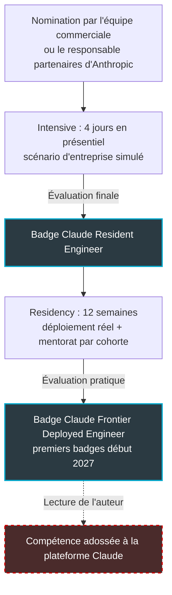
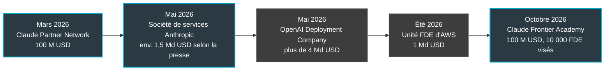

## Cent millions de dollars, et pas pour un modèle

Cent millions de dollars, et cette fois, l'argent ne va pas à un modèle. Le 2 octobre, Anthropic, l'éditeur de Claude, a annoncé cette enveloppe pour former 10 000 ingénieurs d'ici fin 2027. Pas des chercheurs : des praticiens du déploiement, ceux qui prennent un assistant brillant en démonstration et le font tourner dans une vraie entreprise, avec ses vrais clients, son vrai système d'information et sa vraie revue sécurité. Le programme s'appelle Claude Frontier Academy. Au bout, un badge.

Tout opérateur réseau connaît ce problème sous un autre nom : le dernier kilomètre. Une borne Wi-Fi qui affiche des débits superbes en laboratoire ne dit rien de ce qu'elle donnera dans un hôtel aux murs en béton armé, ou dans une résidence étudiante un soir de rentrée. Le matériel est rarement le problème. L'installation, si.

L'IA d'entreprise en est exactement là. En 2026, Anthropic, OpenAI et AWS sont arrivés à la même conclusion à quelques mois d'intervalle : le goulot n'est plus le modèle, c'est la compétence pour le déployer. Chacun a décidé de la produire lui-même.

Ma thèse : en certifiant cette compétence, l'éditeur en fait un actif de sa plateforme. Pour un DSI, c'est une décision d'architecture déguisée en plan de formation, à prendre avant que le badge ne la prenne à sa place.

## Quatre jours d'amphi, douze semaines de garde

Le vocabulaire retenu par Anthropic dit déjà beaucoup. Le parcours enchaîne un « Intensive » puis une « Residency ». Autrement dit, le schéma de l'internat de médecine : d'abord l'amphithéâtre, ensuite les gardes à l'hôpital sous l'œil d'un senior. On n'apprend pas à poser un diagnostic dans un manuel, on l'apprend au lit du patient. L'éditeur parie que le déploiement d'IA s'apprend de la même façon.

Premier temps, l'Intensive : quatre jours en présentiel selon la [page du programme](https://claude.com/programs/frontier-academy), l'[annonce officielle](https://www.anthropic.com/news/claude-frontier-academy) restant plus vague sur la durée. Les participants y construisent un système complet autour de Claude, sur un scénario d'entreprise simulé, de la demande du client jusqu'à la revue de sécurité. Une évaluation finale délivre un premier badge, Claude Resident Engineer.

Second temps, la Residency : douze semaines pendant lesquelles l'ingénieur pilote un vrai déploiement de Claude dans sa propre organisation, avec un mentorat par cohorte assuré par des ingénieurs d'Anthropic. Une évaluation pratique délivre alors le badge qui donne son sens au programme, Claude Frontier Deployed Engineer. Les premiers sont attendus début 2027.

*Le parcours tel que décrit par Anthropic. Le dernier bloc, en pointillés, relève de mon analyse, pas du programme.*

L'accès est filtré. Pas d'inscription libre : on est nommé par l'équipe commerciale d'Anthropic ou par son responsable partenaires, en accès anticipé réservé à des clients et partenaires sélectionnés. Les cohortes sont petites, mélangent plusieurs organisations et se tiennent à San Francisco, New York et Londres. Parmi les organisations de la première vague, on trouve des cabinets de conseil (Accenture, Bain, Capgemini, Deloitte, McKinsey) et de grands comptes utilisateurs (Commonwealth Bank of Australia, Morgan Stanley, Novo Nordisk).

Ce qu'on ne sait pas pèse autant. Aucun prix public. Aucune ventilation des 100 millions, donc aucune visibilité sur ce que paie l'éditeur et ce que paie l'employeur ; diviser 100 millions par 10 000 donnerait un chiffre, pas une information. Rien sur le taux de réussite, le détail du programme, la durée de validité des badges ou leur reconnaissance hors de l'écosystème Claude. Rien, enfin, sur Paris ou l'Europe continentale. Pour un DSI français, la Frontier Academy reste donc un signal à lire, pas une offre à acheter.

*Quatre jours d'atelier, puis un long pont vers la production : c'est la Residency qui fait la valeur du parcours.*

## Le dernier kilomètre devient une industrie

L'idée de départ n'a rien de neuf. Dans un billet de blog de 2019, Palantir opposait deux profils d'ingénieurs : les « Devs », qui construisent une capacité servant de nombreux clients, et les « Deltas », détachés chez un seul client pour y assembler plusieurs capacités. Ces derniers ont donné son nom au métier, Forward Deployed Engineer (FDE) : l'ingénieur envoyé en première ligne chez le client. Ce qui est neuf, c'est la vitesse à laquelle les éditeurs d'IA se sont approprié ce modèle en 2026.

*2026, l'année où les éditeurs ont internalisé le dernier kilomètre. En bleu, Anthropic ; en gris, OpenAI et AWS. Le montant de la société de services est un chiffre de presse.*

En mars, Anthropic lance son Claude Partner Network. Au programme : 100 millions de dollars pour l'année, une adhésion gratuite, une première certification (Claude Certified Architect, Foundations) et une équipe dédiée aux partenaires multipliée par cinq.

En mai, il s'associe à Blackstone, Hellman & Friedman et Goldman Sachs pour fonder une société de services. Elle place des ingénieurs dans des entreprises de taille moyenne, à commencer par les participations des fonds. La presse évoque environ 1,5 milliard de dollars d'engagements. Jon Gray, de Blackstone, parlait à cette occasion de l'un des principaux goulots d'étranglement de l'adoption de l'IA en entreprise.

Huit jours plus tard, OpenAI dévoile sa Deployment Company, une filiale dont il détient la majorité, dotée de plus de 4 milliards de dollars de capital initial et soutenue par 19 partenaires menés par le fonds TPG. Elle rachète au passage Tomoro et ses quelque 150 ingénieurs de déploiement. À l'été, AWS monte à son tour une unité FDE à 1 milliard de dollars. Le format : des équipes de cinq ou six ingénieurs, des missions d'environ 45 jours, et un double objectif affiché, construire des systèmes d'IA sur mesure et former les équipes du client à les maintenir.

Lu bout à bout, et c'est mon analyse, le mouvement est une intégration verticale vers l'aval. Les éditeurs ne se contentent plus de vendre le moteur. Ils veulent tenir le réseau de garages qui l'installent et l'entretiennent. Anthropic couvre désormais trois étages : un réseau de partenaires, une société de services, une école.

Le marché du travail confirme la rareté, avec des précautions. Début septembre, un relevé d'offres d'emploi de Valletta Software, dont l'auteur reconnaît lui-même la fragilité méthodologique, comptait 77 postes « forward deployed » sur environ 310 chez Palantir et 94 sur 870 chez Databricks. Chez Anthropic, une poignée seulement, avec un salaire de base américain affiché entre 280 000 et 320 000 dollars. Un ordre de grandeur, pas une statistique. Mais quand un profil coûte ce prix et reste introuvable, on finit par le fabriquer.

## Quand le fournisseur tient l'école

Le réseau a déjà vu ce film. Depuis les années 1990, les certifications Cisco, du CCNA au CCIE, forment des générations d'ingénieurs. C'est un excellent signal de compétence. C'est aussi, de façon moins avouée, un formidable outil de prescription : quiconque a dépouillé un appel d'offres réseau a vu un ingénieur recommander, en toute bonne foi, la gamme qu'il a mis deux ans à maîtriser. Personne ne ment. Le biais s'installe tout seul.

*Réseau de partenaires, société de services, école : autour du modèle, les couches de services s'empilent.*

Le badge Claude Frontier Deployed Engineer aura, à mon sens, la même double nature. Côté acheteur, c'est un progrès réel. Un ingénieur qui a piloté douze semaines de déploiement réel, puis passé une évaluation pratique, envoie un meilleur signal que le titre d'« expert IA » qui fleurit sur les profils en ligne. Ancrer la certification dans un projet de production est le choix le plus solide du programme.

Côté dépendance, le badge porte un nom de modèle. Une partie de la compétence est universelle : cadrer un besoin, mener une revue de sécurité, construire une évaluation. Une autre est propre à la plateforme, des réflexes d'écriture des prompts à l'outillage et aux garde-fous. Anthropic présente la Frontier Academy comme un investissement dans la capacité humaine. Ma lecture, qui reste une inférence, est qu'elle installe aussi Claude comme standard implicite chez ceux qui conseilleront demain vos choix de modèle.

Les intégrateurs l'ont compris et se couvrent. Bain, Capgemini et McKinsey figurent à la fois dans la première vague de la Frontier Academy et parmi les investisseurs cités par OpenAI pour sa Deployment Company. Ils ont raison : leur métier est de rester utiles quel que soit le modèle gagnant. Le client, lui, doit savoir quel ingénieur il reçoit, formé à quoi et par qui.

Accenture donne l'échelle visée. En décembre 2025, le cabinet annonçait un plan pour former 30 000 de ses professionnels à Claude, avec la création d'un Accenture Anthropic Business Group et des ingénieurs détachés chez ses clients. C'est un plan annoncé, pas un effectif déjà formé. Et ce plan n'est pas présenté par Anthropic comme un résultat de la Frontier Academy (certains médias évoquent un usage de ses ressources) : comparer les deux chiffres reviendrait à comparer un cours d'initiation et un internat.

## Interne, intégrateur ou éditeur : où loger la compétence

La vraie question pour un CTO n'est donc pas de savoir s'il faut envoyer quelqu'un à la Frontier Academy. C'est de décider où vit la compétence d'intégration IA dans son organisation. Quatre options se dessinent, et elles ne se valent pas.

*Interne, intégrateur ou service de l'éditeur : le lieu où vit la compétence engage la réversibilité pour des années.*

| Option | Démarrage | Connaissance du métier | Réversibilité | Dépendance fournisseur |
|---|---|---|---|---|
| Un ou deux FDE internes | Lent (recruter ou former) | Forte d'emblée | Forte si les actifs sont documentés | Faible, hors départ de la personne |
| Intégrateur multi-éditeurs | Moyen | À construire | Moyenne à forte | Modérée |
| Intégrateur certifié sur un seul éditeur | Rapide | À construire | Faible | Élevée |
| Service de l'éditeur ou du cloud | Très rapide | Faible au départ | Faible | Très élevée |

*Grille de lecture de l'auteur : un jugement éditorial, pas des données mesurées. « Service de l'éditeur » recouvre ici la société de services d'Anthropic, l'OpenAI Deployment Company ou l'unité FDE d'AWS.*

Les services portés par les éditeurs sont les plus rapides. C'est leur force et leur piège : l'ingénieur qui arrive connaît le modèle par cœur et votre métier pas du tout. Il ignore pourquoi le portail captif d'un hôtel (la page de connexion au Wi-Fi) ne se comporte pas comme celui d'une résidence étudiante, ou pourquoi une enseigne ne tolère aucune coupure un samedi de soldes. Ce savoir-là ne s'achète pas en 45 jours. Il se construit, et il doit rester chez vous.

Mon verdict : tout internaliser n'a pas de sens pour une entreprise dont l'IA n'est pas le produit, mais tout externaliser revient à louer son propre jugement. À notre échelle, il faut cultiver un ou deux « résidents » internes qui connaissent le métier et pilotent les déploiements, puis acheter l'exécution lourde à un intégrateur, de préférence multi-éditeurs. Le service de l'éditeur reste utile pour une accélération ciblée, avec une clause de transfert de compétence. AWS affiche d'ailleurs cet objectif dans sa propre offre : c'est le minimum à exiger de tout prestataire.

Formulé autrement : le badge est un bon critère d'achat et un mauvais critère d'architecture. Il vous dit qu'un ingénieur sait déployer Claude. Il ne vous dit ni si Claude est le bon choix pour votre cas, ni comment en sortir s'il ne l'est plus dans dix-huit mois.

## Cinq décisions avant l'ouverture d'une cohorte européenne

Rien n'est annoncé pour Paris. Tant mieux : cela laisse le temps de poser un cadre avant que la question n'arrive en comité d'achat.

1. **Nommer un responsable de l'intégration IA.** Pas un comité : une personne, avec un budget, une feuille de route et le droit de dire non à un prestataire.
2. **Exiger la liste nominative des ingénieurs affectés.** Quels badges, chez quel éditeur, et surtout combien de mises en production réelles. Un badge Resident Engineer obtenu sur un scénario simulé ne remplace pas trois déploiements menés à terme.
3. **Contractualiser la transférabilité.** Prompts, jeux d'évaluation, connecteurs MCP (Model Context Protocol, le standard qui relie un modèle aux outils et aux données de l'entreprise) et documentation appartiennent au client. Ils sont livrés dans un format exploitable sans le prestataire.
4. **Garder une évaluation interne multi-modèle.** Un jeu de tests métier, rejouable sur Claude, sur GPT ou sur un modèle ouvert. C'est l'équivalent du plan de recette qu'on impose à chaque nouvelle borne Wi-Fi avant de la généraliser sur un parc.
5. **Surveiller l'ouverture de cohortes en Europe.** Le jour venu, négocier une place pour un ingénieur interne plutôt que de laisser les intégrateurs occuper toute la promotion.

## Le jugement d'intégration, nouvelle ressource rare

Pendant trois ans, la rareté de l'IA se comptait en GPU et en mégawatts. Elle se compte désormais aussi en ingénieurs capables de transformer un modèle en système qui tient en production, revue de sécurité comprise.

Rien de cynique là-dedans. Anthropic a un vrai problème à résoudre, et des ingénieurs mieux formés au déploiement profitent à tous, y compris à ceux qui choisiront un autre modèle. Mais il faut regarder l'ensemble avec lucidité. L'éditeur ne vend plus seulement l'intelligence. Il forme aussi ceux qui décident comment l'installer.

Former ses ingénieurs est une excellente idée. Laisser son fournisseur décider qui sont vos ingénieurs en est une autre. Le CTO qui n'aura pas tranché d'ici les premiers badges, début 2027, découvrira que la question a été tranchée pour lui, badge par badge, dans les CV de ses prestataires.

---

_Vues personnelles, pas position Wifirst._

## Sources

1. [Anthropic — Claude Frontier Academy (2 octobre 2026)](https://www.anthropic.com/news/claude-frontier-academy)
2. [Claude.com — Page programme Frontier Academy](https://claude.com/programs/frontier-academy)
3. [Anthropic — Claude Partner Network (12 mars 2026)](https://www.anthropic.com/news/claude-partner-network)
4. [Anthropic — Partenariat Accenture (9 décembre 2025)](https://www.anthropic.com/news/anthropic-accenture-partnership)
5. [Built In — Accenture Anthropic Business Group (9 décembre 2025)](https://builtin.com/articles/accenture-anthropic-expand-partnership-with-new-business-group-20251209)
6. [AI Weekly — Lancement de la Claude Frontier Academy (2 octobre 2026)](https://aiweekly.co/alerts/anthropic-launches-claude-frontier-academy-commits-100m-to-train-10000)
7. [Crypto Briefing — Claude Frontier Academy (2 octobre 2026)](https://cryptobriefing.com/anthropic-100-million-claude-frontier-academy/)
8. [Fortune — Société de services Anthropic, Blackstone, Hellman & Friedman, Goldman Sachs (4 mai 2026)](https://fortune.com/2026/05/04/anthropic-claude-consulting-industry-joint-venture-blackstone-goldman-sachs/)
9. [OpenAI — The Deployment Company (12 mai 2026)](https://openai.com/index/openai-launches-the-deployment-company/)
10. [Crypto Briefing — L'unité FDE d'AWS à 1 Md USD (été 2026)](https://cryptobriefing.com/amazon-aws-billion-ai-forward-deployed-engineering/)
11. [Palantir — Dev versus Delta (2019)](https://blog.palantir.com/dev-versus-delta-demystifying-engineering-roles-at-palantir-ad44c2a6e87)
12. [Valletta Software — Entreprises qui recrutent des forward deployed engineers (8 septembre 2026)](https://vallettasoftware.com/blog/post/companies-hiring-forward-deployed-engineers)
