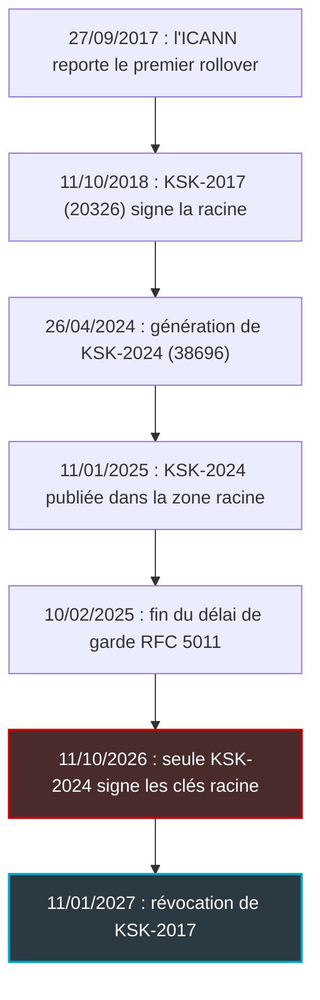
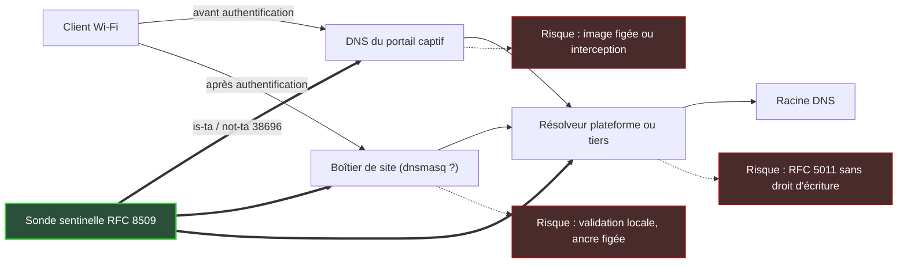

## Dimanche, la racine d'Internet change de serrure

Dimanche 11 octobre, pendant que la plupart des équipes IT seront en week-end, la racine du DNS changera de clé. Ni panne, ni attaque : une opération planifiée depuis des années, préparée au jour près, que l'immense majorité des internautes ne remarquera jamais.

L'immense majorité. Pas tous.

Lundi matin, dans un hôtel, un client pourrait ouvrir son ordinateur, voir les barres Wi-Fi au maximum et n'obtenir aucune page. Dans une résidence étudiante, le ticket arriverait avec la phrase que tout support réseau redoute : *le Wi-Fi marche, mais Internet est cassé*. Ce ticket n'atterrira pas chez l'éditeur du logiciel fautif. Il atterrira chez celui qui opère le réseau, qu'il s'agisse d'hôtels, de magasins, de bureaux ou de résidences.

Pourquoi en parler à J-4 ? Parce que les chiffres sont bons, et que c'est précisément ce qui endort. Plus de 95 % des résolveurs (les serveurs qui traduisent les noms de domaine pour les terminaux) qui se signalent sont prêts. Les autres n'apparaissent sur aucun tableau de bord : un boîtier dans une baie technique, une image de conteneur figée, une appliance posée par un prestataire parti depuis longtemps.

Le changement de clé racine n'est pas un risque « Internet ». C'est un risque de parc. Et d'ici dimanche, la seule défense crédible est un audit de configuration, pas un test lancé depuis un navigateur.

## Une serrure changée avec 638 jours de préavis

Commençons par une image. Le syndic d'un immeuble décide de changer la serrure de la porte d'entrée, et il fait les choses bien : la nouvelle clé est déposée dans chaque boîte aux lettres près de deux ans à l'avance. Les résidents qui relèvent leur courrier ont depuis longtemps les deux clés sur leur trousseau. Dimanche, l'ancienne serrure disparaît. Ceux qui n'ont jamais ouvert leur boîte resteront dehors, et ne le découvriront qu'en tournant la clé.

Dans le monde réel, la porte s'appelle DNSSEC (DNS Security Extensions). Ce mécanisme ajoute des signatures cryptographiques aux réponses DNS. Un résolveur dit « validant » vérifie toute la chaîne de signatures, de la racine jusqu'au domaine demandé, et rejette ce qui ne colle pas.

Au sommet de cette chaîne se trouve une clé maîtresse, la KSK (Key Signing Key), qui signe le jeu de clés de la racine. Celle-là, le résolveur ne la vérifie auprès de personne. Il en détient une copie locale, appelée ancre de confiance (trust anchor). C'est la clé du trousseau.

Depuis le 11 octobre 2018, la racine est signée par KSK-2017, identifiée par son numéro de clé (key tag) 20326. À partir de dimanche, le jeu de clés racine sera signé uniquement par KSK-2024, numéro 38696. Cette nouvelle clé est publiée dans la zone racine depuis le 11 janvier 2025, soit 638 jours de préavis. Un résolveur capable de se mettre à jour seul pouvait l'adopter dès le 10 février 2025.

Un résolveur validant qui ne connaît pas 38696, en revanche, ne pourra plus valider la racine dès que sa copie en cache aura expiré. L'ICANN, l'organisme qui coordonne la racine, parle d'échec total de la résolution DNS. Le registre néerlandais SIDN décrit un blocage de toutes les requêtes relatives aux noms signés. Côté client, cela se traduit par des SERVFAIL (le code d'erreur « échec serveur ») et un navigateur qui tourne dans le vide.

Ce scénario n'a rien de théorique. Le 27 septembre 2017, l'ICANN reportait le tout premier changement de KSK, prévu le 11 octobre suivant. Les signaux remontés par les résolveurs montraient qu'une part significative de ceux des fournisseurs d'accès n'était pas prête, en partie parce qu'un résolveur très répandu ne mettait pas sa clé à jour automatiquement. Selon l'estimation de l'ICANN, environ 750 millions de personnes, soit à peu près un internaute sur quatre, auraient pu être touchées. Le basculement n'a finalement eu lieu que le 11 octobre 2018.

La leçon de 2017 n'a pas vieilli : la mise à jour automatique peut échouer en silence, et à grande échelle.



*Du report de 2017 à la bascule de dimanche : un calendrier long, conçu pour laisser aux résolveurs le temps d'apprendre la nouvelle clé.*

## Plus de 95 % : le chiffre qui ne compte que les bons élèves

Depuis 2017, un résolveur peut signaler les clés racine auxquelles il fait confiance, grâce à un mécanisme normalisé par la RFC 8145 : de petites requêtes envoyées vers la racine, que Verisign agrège et analyse. Les courbes publiées par Duane Wessels (Verisign) sont plutôt rassurantes. Au 3 mars 2025, 91,3 % des résolveurs émettant ces signaux déclaraient faire confiance à KSK-2024. Au 28 juillet 2026, on dépassait 95 %. La trajectoire est presque identique à celle de 2018 : dans les deux cas, la barre des 95 % a été franchie après environ 500 jours.

Bonne nouvelle. Mais lisez la notice.

D'abord, c'est un échantillon. Seuls les résolveurs qui émettent des signaux sont comptés, et Verisign reconnaît que ces signaux étaient bruités en 2017-2018, avec des faux négatifs. Ensuite, on compte des résolveurs, pas des utilisateurs : celui qui sert trois chambres d'hôtel pèse autant que celui d'un fournisseur d'accès qui sert des millions d'abonnés. *Plus de 95 % des résolveurs* ne signifie donc pas *moins de 5 % des utilisateurs touchés*.

Enfin, et c'est ici mon analyse, la statistique ne dit rien des résolveurs muets. Un boîtier embarqué qui n'émet aucun signal n'existe tout simplement pas dans ces courbes. Or c'est exactement le profil des équipements à risque.

Un autre chiffre du même billet m'inquiète davantage. Environ 3,5 % des sources qui signalent leurs clés annoncent encore faire confiance à KSK-2010, une clé créée en 2010 et révoquée en 2019. Sept ans après sa révocation. Cette poussière de configurations figées existe, elle dure, et personne ne passe l'épousseter. Rien ne permet de penser que les placards qui ont conservé la clé de 2010 ont accueilli celle de 2024.

L'ICANN ne dit pas autre chose dans son guide publié fin juillet : vérifiez que la clé 38696 figure bien dans la configuration de vos ancres, et ne supposez pas que les mises à jour automatiques ont fonctionné. L'organisme a encore relancé la communauté fin septembre, sur la liste du groupe de travail DNS du RIPE. Quand le gardien de la clé racine insiste à ce point, c'est qu'il connaît les placards.


*Le résolveur qui posera problème est rarement au cœur de la plateforme : il dort dans un boîtier de site, un portail ou une image que personne n'a touchés depuis des années.*

## Le vigile amnésique : pourquoi l'automatique échoue sans bruit

Le mécanisme de mise à jour automatique est décrit par la RFC 5011, publiée en septembre 2007. Son principe est prudent. Quand un résolveur voit apparaître dans la racine une nouvelle clé, signée par la clé en place, il ne lui accorde pas sa confiance tout de suite. Il la place en attente pendant un délai de garde (hold-down) d'au moins 30 jours. Ce n'est qu'à l'issue de ce délai qu'elle devient valide. L'objectif : empêcher qu'un attaquant ayant brièvement compromis l'ancienne clé impose la sienne en un seul coup.

Imaginez un vigile à l'entrée d'un site sensible. Sa consigne : un nouveau badge n'est accepté qu'après trente jours de présentation. Excellente règle. Sauf si le vigile est amnésique et oublie tout chaque nuit : son compteur ne dépassera jamais un jour. Et il ne vous préviendra pas, puisque de son point de vue il fait parfaitement son travail. La RFC 5011 l'assume d'ailleurs explicitement : elle suppose que le résolveur fonctionne pendant toute la période de garde.

De là découlent six manières d'échouer sans bruit. C'est une analyse, fondée sur la RFC et sur la documentation des éditeurs.

1. **Le fichier en lecture seule.** Conteneur read-only, firmware, politique SELinux ou AppArmor, mauvais propriétaire : le résolveur voit KSK-2024 mais ne peut pas enregistrer ce qu'il a vu. Chez Unbound, l'utilisateur du service doit pouvoir écrire dans le fichier d'ancres et dans son répertoire, où un fichier temporaire est créé. Pendant ce temps, le service reste « up ».
2. **Le redéploiement permanent.** Une image immuable relancée chaque semaine perd son état d'attente à chaque redémarrage, et le compteur de 30 jours repart de zéro. C'est le vigile amnésique, version conteneurs.
3. **Le boîtier rallumé trop tard.** Faites le calcul. Un équipement remis en service après le 11 septembre, dont l'ancre d'origine ne contenait pas 38696, ne pouvait plus boucler ses 30 jours avant dimanche. Rallumé après le 11 octobre, il ne verra même plus la nouvelle clé signée par l'ancienne. Pensez aux hôtels saisonniers et aux résidences vidées l'été.
4. **Le logiciel sans RFC 5011.** La documentation de PowerDNS Recursor est explicite : pas de prise en charge du rollover RFC 5011, pas de persistance sur disque d'une ancre racine modifiée. Les ancres sont celles intégrées à la version installée, point.
5. **La vieille ancre qui masque la bonne.** Chez PowerDNS, un fichier `trustanchorfile` éventuel écrase les ancres intégrées, et il est relu toutes les 24 heures. Un fichier copié depuis un vieux modèle de configuration suffit à masquer une version pourtant à jour.
6. **Le chemin détourné.** Portail captif qui intercepte le DNS, forwarder vers un résolveur qu'on ne contrôle pas : le test que vous lancez mesure un autre résolveur que celui que vous croyez auditer.

Le cas dnsmasq mérite qu'on s'y arrête, car on le retrouve souvent dans les boîtiers de site. Sa page de manuel ne mentionne ni RFC 5011 ni mise à jour automatique : il ne connaît que des ancres statiques, déclarées via l'option `--trust-anchor`, généralement dans un fichier `trust-anchors.conf`. Un correctif ajoutant KSK-2024 était en discussion sur sa liste de diffusion dès le 22 août 2024. Mon analyse : un dnsmasq qui valide DNSSEC avec un fichier antérieur à ce correctif ne peut pas apprendre 38696 tout seul. Seule une mise à jour du paquet ou du firmware règle le problème.

| Logiciel | Mise à jour automatique | Où vérifier | Piège principal |
|---|---|---|---|
| BIND | Oui (RFC 5011) | `rndc managed-keys status` | ISC a ajouté 38696 à `bind.keys` en novembre 2024 : vérifier l'état réel, pas le fichier livré |
| Unbound | Oui, via `auto-trust-anchor-file` | Fichier `root.key` : clé 38696 à l'état VALID | Droits d'écriture sur le fichier et sur le répertoire |
| Knot Resolver | Oui (RFC 5011) | Fichier `root.keys` : clé 38696 présente | Droits d'écriture et persistance du fichier |
| PowerDNS Recursor | Non | Version installée, présence d'un `trustanchorfile` | Un vieux fichier écrase les ancres intégrées |
| dnsmasq | Non (ancres statiques) | `trust-anchors.conf` | Seule une mise à jour du paquet ou du firmware ajoute 38696 |


*Trente jours d'attente avant d'accorder sa confiance : un compteur prudent, qui repart de zéro à chaque redémarrage sans mémoire persistante.*

## Hôtel, magasin, résidence : la carte des angles morts

Sur un réseau Wi-Fi managé, la requête DNS d'un client traverse plusieurs couches. Selon la configuration, chacune peut valider DNSSEC, et donc détenir sa propre ancre. Cinq surfaces sont à auditer :

- les résolveurs récursifs de la plateforme, ceux qu'on surveille déjà ;
- le DNS du portail captif, sollicité avant authentification et pour le walled garden (les destinations accessibles sans être connecté) ;
- les boîtiers de site qui font du DNS, souvent avec dnsmasq ;
- les images et conteneurs figés, redéployés sans être reconstruits ;
- les forwarders qui renvoient vers des résolveurs tiers.



*Chaque couche du chemin DNS peut détenir sa propre ancre de confiance : la sonde doit les traverser toutes, pas seulement la plateforme.*

Le portail captif est l'angle mort le plus traître. S'il valide avec une ancre périmée, c'est l'accès au portail lui-même qui peut tomber : le client ne voit même pas la page de connexion. Le ticket décrira alors un *Wi-Fi qui ne s'ouvre pas*, pas un problème DNS. Bon courage au support pour remonter la piste un lundi matin.

Les forwarders posent une autre question : celle de la dépendance. Cloudflare indique que 1.1.1.1 fait confiance à KSK-2024 depuis juillet 2024, avec les deux ancres intégrées, et qu'aucune action n'est requise pour ses clients. Tant mieux. Pour tout autre résolveur tiers, sa préparation devient la vôtre : demandez-lui, puis testez-le.

Les images figées, enfin, cachent peut-être un piège plus subtil. C'est une hypothèse à tester en lab, pas un constat. Le paquet Debian `dns-root-data` a renouvelé en août 2025 la signature du fichier d'ancres de l'IANA, dont l'ancienne expirait le 7 juillet 2026. Une image construite avant ce renouvellement, dont l'outillage vérifie cette signature lors d'un repli (c'est le chemin de `unbound-anchor` quand la RFC 5011 ne suffit pas), pourrait échouer depuis juillet sans que personne ne l'ait vu.

D'où ma position, assumée : **valider au cœur, forwarder en bordure**. La validation DNSSEC doit vivre dans un nombre réduit de résolveurs de plateforme, persistants, surveillés et mis à jour par un pipeline qu'on maîtrise. Les boîtiers de site, eux, transmettent les requêtes sans valider. Un boîtier qui ne valide pas n'a pas besoin d'ancre, et une ancre qui n'existe pas ne peut pas périmer.

Le prix est connu : le dernier tronçon entre le site et la plateforme échappe à la validation locale. C'est un compromis que je préfère gérer avec un lien chiffré et de la supervision, plutôt qu'avec des centaines d'ancres disséminées sur des sites dont certains ferment la moitié de l'année.

## Quatre jours pour auditer : sonde, configuration, plan B

### La sonde sentinelle : tester le chemin réel

Une poignée de requêtes suffit à savoir si un résolveur fait confiance à la nouvelle clé. À une condition : les lancer au bon endroit.

Le mécanisme est normalisé par la RFC 8509 (décembre 2018). Il repose sur deux noms piégés, `root-key-sentinel-is-ta-38696` et `root-key-sentinel-not-ta-38696`. Un résolveur compatible ne répond au premier que s'il fait confiance à la clé 38696, et renvoie SERVFAIL sinon. Le second fonctionne à l'inverse. La zone publique `dnstest.dev` héberge ces noms, ainsi que deux contrôles qui vérifient que le résolveur valide bien.

```bash
# Remplacer 192.0.2.53 par l'IP du résolveur à tester :
# VLAN invités, DNS du portail en pré-auth, boîtier de site, plateforme
dig @192.0.2.53 root-key-sentinel-is-ta-38696.dnstest.dev. A +noall +comments +answer
dig @192.0.2.53 root-key-sentinel-not-ta-38696.dnstest.dev. A +noall +comments +answer
dig @192.0.2.53 root-key-sentinel-not-ta-20326.dnstest.dev. A +noall +comments +answer

# Contrôles : le résolveur valide-t-il DNSSEC ?
dig @192.0.2.53 valid.alg13.dnstest.dev. A +noall +comments +answer
dig @192.0.2.53 invalid.alg13.dnstest.dev. A +noall +comments +answer
```

| `is-ta-38696` | `not-ta-38696` | Lecture |
|---|---|---|
| Répond (NOERROR) | SERVFAIL | Prêt |
| SERVFAIL | Répond | Non prêt : alerte rouge |
| Répond | Répond | Sentinelle non supportée : retour à l'audit de configuration |

Les contrôles servent de garde-fou : `valid.alg13` doit résoudre, `invalid.alg13` doit échouer. Si le second résout, le résolveur ne valide pas DNSSEC du tout. Il n'est pas concerné par la clé, mais il ne protège personne non plus.

Le vrai piège est dans l'adresse. Le test en ligne lancé depuis un navigateur ne mesure que le résolveur de ce navigateur, sur ce poste, à cet instant. Pas celui du VLAN invités, ni celui du portail en pré-authentification, ni celui d'un boîtier installé à 600 kilomètres. La sonde doit partir de chaque segment réseau et suivre le chemin réel : client, boîtier, forwarder. Idéalement, elle tourne en tâche planifiée, branchée sur le monitoring avec une alerte.

La RFC 8509 reconnaît elle-même ses limites. Elle suppose, sans le vérifier, qu'un terminal essaie tous ses résolveurs en cas de SERVFAIL, et ses résultats deviennent indéterminés quand des forwarders aux états différents s'enchaînent. Le support n'est pas universel non plus : BIND la gère depuis les versions 9.9.13, 9.10.8 et 9.11.4, Unbound via l'option `root-key-sentinel`. Pour PowerDNS et dnsmasq, ne présumez rien. La sonde complète l'audit de configuration. Elle ne le remplace jamais.


*Deux requêtes jumelles, une réponse attendue et un échec attendu : la sonde sentinelle se lit comme un test de contrôle, à condition de la lancer depuis chaque segment.*

### La checklist, dans l'ordre

1. **Inventaire.** Lister tout composant qui valide DNSSEC (résolveurs de plateforme, portails, boîtiers de site, appliances, conteneurs DNS) avec sa version et son mode de mise à jour des ancres.
2. **Présence de 38696 dans l'ancre active**, et non dans le seul fichier livré par le paquet.
3. **Droits et persistance.** Écriture sur le fichier et le répertoire des ancres, système de fichiers non read-only, état conservé entre redémarrages : uptime supérieur à 30 jours ou volume persistant.
4. **Sonde sentinelle depuis chaque segment** : invités, pré-authentification du portail, sites distants. Les trois sentinelles, plus les deux contrôles.
5. **Images et firmwares figés.** Une date de construction antérieure à novembre 2024 rend l'équipement suspect par défaut. Patcher, ou couper la validation locale et forwarder vers un résolveur validant audité.
6. **Surveillance** du taux de SERVFAIL par résolveur, avec un seuil d'alerte et une astreinte couvrant du 11 au 13 octobre.
7. **Plan de repli** prêt et documenté (voir ci-dessous).
8. **Communication.** Un message pré-rédigé pour le support et pour les clients, hôtels comme enseignes, en cas de *Wi-Fi sans Internet*.

Pour le point 2, quelques commandes de départ. Les chemins varient selon la distribution ou le firmware, et chacune mérite d'être validée en lab sur votre version :

```bash
# BIND : état RFC 5011 de chaque clé racine
rndc managed-keys status

# Unbound : la ligne de la clé 38696 doit porter l'état VALID
grep 38696 /var/lib/unbound/root.key

# PowerDNS Recursor : un fichier d'ancres explicite écrase les ancres intégrées
grep -ri trustanchorfile /etc/powerdns/

# dnsmasq : l'ancre 38696 est-elle déclarée ?
grep 38696 /usr/share/dnsmasq-base/trust-anchors.conf
```

### Le plan B, et ce qu'il faut éviter

Ma recommandation, à valider avec vos équipes : si un résolveur n'est pas prêt et ne peut pas être mis à jour à temps, deux options propres. La première consiste à injecter l'ancre 38696 à la main (`initial-ds` sous BIND, `trust-anchor` sous Unbound, `--trust-anchor` sous dnsmasq). Récupérez-la dans le fichier officiel de l'IANA, dont vous vérifiez la signature ; son format est décrit par la RFC 9718, qui a remplacé la RFC 7958. Ne recopiez jamais une empreinte depuis un blog, celui-ci compris. La seconde option : basculer temporairement le site vers un résolveur déjà vérifié comme prêt.

Ce qu'il faut éviter : *désactiver DNSSEC partout*. C'est un recul de sécurité, à réserver au dernier recours, sur un périmètre précis et avec une date de fin.

### Et après dimanche ?

La panne, si elle survient, ne sera pas instantanée. Un résolveur non prêt continue d'utiliser la copie des clés racine qu'il garde en cache jusqu'à son expiration. Un éditeur, EfficientIP, indique pour cet enregistrement une durée de vie en cache (TTL) de 48 heures ; le chiffre reste à confirmer côté IANA ou Verisign. S'il se vérifie, les premiers SERVFAIL pourraient n'apparaître que jusqu'à deux jours après la bascule. *Pas de panne dimanche soir* ne voudra donc pas dire *tout va bien*. Surveillez au moins jusqu'au mardi 13.

Ensuite, le calendrier continue. KSK-2017 sera révoquée le 11 janvier 2027, selon SIDN, puis retirée de la zone racine, et sa clé privée détruite courant 2027. Cloudflare insiste à juste titre sur un point : arrêter de signer avec une clé et cesser de lui faire confiance sont deux étapes distinctes. En janvier, revérifiez que 38696 est toujours à l'état valide partout, en particulier sur les résolveurs redéployés entre-temps.

## Lundi, l'incident sera un incident d'inventaire

Ce rollover se passera probablement bien pour Internet dans son ensemble, comme en 2018. La racine fonctionnera. Les grands résolveurs publics qui ont documenté leur préparation, comme Cloudflare, sont prêts depuis longtemps. La vraie question n'est pas là.

La vraie question, c'est de savoir si vous connaissez chaque endroit où votre réseau prend une décision DNSSEC. Si un incident survient lundi, ce ne sera pas un incident cryptographique. Ce sera un incident d'inventaire : un boîtier que personne n'a listé, une image que personne n'a reconstruite, une configuration copiée d'un modèle que personne n'a relu.

J'en tire une règle qui dépasse cette échéance. Chaque ancre de confiance déployée sur le terrain est une dette technique avec une date d'exigibilité, et sur un parc multi-sites, certains de ces sites dorment la moitié de l'année. Valider au cœur, forwarder en bordure, sonder en continu.

Quatre jours, c'est assez pour un audit. Ce n'est pas assez pour un déni.

_Vues personnelles, pas position Wifirst._

## Sources

1. ICANN, Root Zone KSK Rollover (page officielle) : https://www.icann.org/resources/pages/ksk-rollover
2. ICANN, blog « Preparing for the Root Zone KSK Rollover: What You Need to Know » (27/07/2026) : https://www.icann.org/en/blogs/details/preparing-for-the-root-zone-ksk-rollover-what-you-need-to-know-27-07-2026-en
3. Verisign (Duane Wessels), « 2024-2026 Root Zone KSK Rollover: Updates and Observations » (28/07/2026) : https://blog.verisign.com/security/2024-2026-root-zone-ksk-rollover-updates-observations/ (miroir CircleID : https://circleid.com/posts/the-2024-2026-root-zone-ksk-rollover-updates-and-observations)
4. Verisign / CircleID, « Initial Observations and Early Trends » (19/03/2025) : https://www.circleid.com/posts/the-2024-2026-root-zone-ksk-rollover-initial-observations-and-early-trends
5. Cloudflare, « The keys to the Internet change on October 11, 2026. Are you ready? » (06/10/2026) : https://blog.cloudflare.com/root-ksk-2024-rollover
6. IANA, DNSSEC Trust Anchors and Rollovers : https://www.iana.org/dnssec/files
7. RFC 5011, Automated Updates of DNS Security (DNSSEC) Trust Anchors (septembre 2007) : https://www.rfc-editor.org/rfc/rfc5011.html
8. RFC 8509, A Root Key Trust Anchor Sentinel for DNSSEC (décembre 2018) : https://www.rfc-editor.org/rfc/rfc8509.html
9. RFC 9718 (janvier 2025) : https://www.rfc-editor.org/rfc/rfc9718.html ; RFC 7958 (août 2016) : https://www.rfc-editor.org/rfc/rfc7958.html
10. PowerDNS Recursor, documentation DNSSEC : https://doc.powerdns.com/recursor/dnssec.html
11. NLnet Labs, unbound.conf : https://nlnetlabs.nl/documentation/unbound/unbound.conf/ ; unbound-anchor : https://nlnetlabs.nl/documentation/unbound/unbound-anchor/
12. ISC BIND, merge request 9747 (bind.keys, clé 38696, 15/11/2024) : https://gitlab.isc.org/isc-projects/bind9/-/merge_requests/9747
13. dnsmasq, page de manuel : https://thekelleys.org.uk/dnsmasq/docs/dnsmasq-man.html ; patch KSK-2024 (22/08/2024) : https://lists.thekelleys.org.uk/pipermail/dnsmasq-discuss/2024q3/017698.html
14. ICANN, KSK rollover postponed (27/09/2017) : https://www.icann.org/en/announcements/details/ksk-rollover-postponed-27-9-2017-en
15. SIDN, « New KSK-2024 trust anchor published on IANA website » : https://www.sidn.nl/en/news-and-blogs/new-ksk-2024-trust-anchor-published-on-iana-website
16. Debian, changelog dns-root-data (KSK-2024 ajoutée, signature p7s renouvelée) : https://tracker.debian.org/media/packages/d/dns-root-data/changelog-2025080400
17. dnstest.dev, test sentinelle KSK-2024 : https://dnstest.dev/ksk-2024/
18. RIPE dns-wg, rappel ICANN (23/09/2026) : https://mailman.ripe.net/archives/list/dns-wg@ripe.net/message/OC4BTMM3C66PQGZMSLHXALGTWQU6ZVOQ/
19. EfficientIP, « Root KSK Rollover 2026 » (17/09/2026, source éditeur) : https://efficientip.com/blog/root-ksk-rollover-2026/
