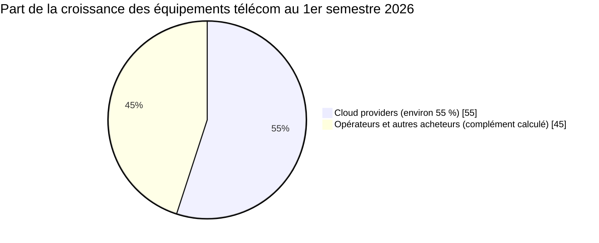
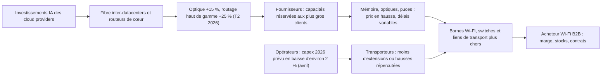

## Une reprise qui ne vous était pas destinée

Trois années de recul et 14 % de chiffre d'affaires effacés entre 2022 et 2024 : les fabricants d'équipements télécom sortent d'un long hiver. Le dégel est là. Au premier semestre 2026, leurs ventes progressent de 5 % sur un an, sixième trimestre de croissance d'affilée, et le cabinet d'analyse Dell'Oro a relevé mi-septembre sa prévision annuelle, désormais entre +3 et +5 % [1].

Regardez qui achète, pourtant. Selon les estimations préliminaires de Dell'Oro, environ 55 % de cette croissance vient des géants du cloud, qui ne pèsent qu'une petite fraction des ventes. Ils achètent de la fibre entre leurs datacenters et des routeurs de très forte capacité pour alimenter leurs clusters d'IA. Les opérateurs télécom, eux, représentent toujours plus de 90 % du marché, mais n'accélèrent pas : antennes mobiles, cœur de réseau et accès fixe font du surplace.

Pour qui achète des bornes Wi-Fi, des switches et des liens fibre (hôtels, résidences étudiantes, sièges d'entreprise, et les opérateurs qui les équipent), ce détail change tout. Une reprise tirée par un client plus gros que vous ne renforce pas votre position de négociation. Elle l'affaiblit. Mêmes fournisseurs, mêmes composants, mêmes usines, et un client prioritaire qui passe devant au guichet.

Pourquoi en parler maintenant ? Parce que quatre publications Dell'Oro en cinq semaines, plus les résultats trimestriels de l'équipementier optique Ciena, racontent la même histoire. Et parce que les budgets 2027 se bouclent en ce moment.

## Le +5 %, c'est le ticket de caisse, pas le budget des ménages

Prenez un supermarché de quartier dont le chiffre d'affaires progresse de 5 % en un an. Le gérant se frotte les mains. Puis il regarde le détail des tickets. Les familles du quartier assurent toujours plus de 90 % des ventes et remplissent leur chariot à peu près comme l'an dernier. L'essentiel de la croissance vient d'un restaurant ouvert en face, qui achète par palettes entières. Le jour où un produit vient à manquer, devinez qui sera servi en premier.

C'est la photographie du marché des équipements télécom au premier semestre 2026. Les familles, ce sont les opérateurs. Le restaurant, ce sont les grands fournisseurs de cloud, les hyperscalers, lancés dans la course aux infrastructures d'IA. Le mouvement s'installe : en 2025 déjà, année à +4 %, les cloud providers avaient fourni environ la moitié de la croissance des équipements [1, 8]. Ce n'est plus un accident de trimestre, c'est une tendance.

Premier piège de lecture, et il est fréquent : ce +5 % mesure le chiffre d'affaires des équipementiers, pas l'investissement des opérateurs. Les deux courbes divergent même. En avril, Dell'Oro prévoyait un CapEx télécom mondial (les dépenses d'investissement des opérateurs) en baisse d'environ 2 % en 2026, après une année 2025 stable en dollars courants, puis une croissance annuelle moyenne d'à peine 1 % jusqu'en 2030 [8]. Cette prévision couvre une cinquantaine d'opérateurs, soit environ 80 % de l'investissement mondial.

Comment les ventes d'équipements peuvent-elles grimper quand l'investissement des opérateurs recule ? Dell'Oro ne publie pas la réconciliation, donc ce qui suit est mon interprétation. Les deux agrégats ne mesurent pas la même chose : le CapEx d'un opérateur inclut aussi le génie civil, les bâtiments, la fibre enfouie et les logiciels, et les achats des cloud providers n'y figurent tout simplement pas. Une précaution : cette prévision d'avril n'a pas été mise à jour publiquement à ma connaissance. Le relèvement de septembre côté équipements laisse penser qu'elle pourrait l'être.

Deuxième piège : le périmètre. Les six marchés suivis par Dell'Oro couvrent pour l'essentiel la radio mobile, le cœur de réseau, l'accès large bande, les faisceaux hertziens et le transport optique (regroupés dans un même programme) et le routage haut de gamme. Le Wi-Fi d'entreprise, le switching de datacenter et la sécurité n'en font pas partie. Le lien avec une borne Wi-Fi vissée au plafond d'un hôtel est donc indirect. Il passe par les mêmes fournisseurs, les mêmes puces mémoire, les mêmes transporteurs. On y revient plus bas.

*Estimation préliminaire Dell'Oro pour les cloud providers. La part « opérateurs et autres » est le complément arithmétique, pas un chiffre publié.*

Faisons le calcul, et je précise qu'il s'agit d'une estimation de l'auteur, pas d'un chiffre Dell'Oro. Si 55 % des 5 points de croissance viennent des cloud providers, cela leur attribue environ 2,7 points, contre 2,3 points pour les opérateurs et les autres acheteurs. Rapporté aux poids respectifs (moins de 10 % des ventes d'un côté, environ 90 % de l'autre), cela implique une croissance supérieure à 27 % pour les cloud providers. Les opérateurs, eux, progressent d'environ 2,5 %. Dix fois moins vite.

Ces ordres de grandeur reposent sur des estimations préliminaires, non auditées, et les montants absolus dorment dans des rapports payants. Mais la formulation juste s'impose : la croissance marginale vient des cloud providers, la base reste opérateur. Les deux propositions sont vraies. Et c'est la marge, pas la base, qui dicte les priorités d'un fournisseur.

## La fibre entre datacenters, nouveau centre de gravité

Pendant que les antennes 5G tournent au ralenti, un autre réseau se construit à toute vitesse : les autoroutes de lumière qui relient les datacenters d'IA entre eux. Un modèle entraîné sur plusieurs sites, ou servi depuis plusieurs régions, réclame des tuyaux énormes entre ses salles machines. C'est là que l'argent coule.

Au deuxième trimestre 2026, le marché du transport optique a progressé de 15 % sur un an [2, 3]. Le segment DCI (Data Center Interconnect, l'interconnexion entre datacenters) a fait trois fois mieux : +45 %. Les cloud providers pèsent désormais 34 % du revenu de l'optique. L'Amérique du Nord a capté à elle seule plus de 40 % du chiffre du trimestre. Seule l'Asie-Pacifique recule, plombée par la Chine.

Derrière le sigle DCI, deux familles de produits. D'un côté, les systèmes de multiplexage en longueur d'onde (WDM), qui font circuler des dizaines de « couleurs » de lumière dans une seule fibre. De l'autre, des optiques cohérentes miniaturisées, dites ZR et ZR+, qui s'enfichent directement dans un routeur et suppriment une couche d'équipement. Ce second format, la lumière qui sort directement du routeur, brouille la frontière entre optique et routage.

*Les liens optiques entre datacenters captent l'essentiel de la croissance, les réseaux d'accès des opérateurs restent en retrait.*

Même dynamique côté routage. Le marché du routage haut de gamme et de l'agrégation, ces gros routeurs qui forment la colonne vertébrale des réseaux, a crû de 25 % au deuxième trimestre [6]. Les ventes directes aux cloud providers ont presque doublé : +94 %. Les routeurs de cœur atteignent un niveau record, pour leur cinquième trimestre de croissance. Nuance importante, toutefois : les opérateurs restent les premiers acheteurs de routeurs, devant les cloud providers, et Dell'Oro relève une croissance à deux chiffres chez tous les types de clients ce trimestre.

Et la radio mobile ? Le RAN (Radio Access Network, les antennes et stations de base des réseaux mobiles) aligne son troisième trimestre de croissance modérée, après plus de deux ans de contraction [5]. Mais Dell'Oro maintient pour 2026 une prévision globalement à plat. Cinq fournisseurs (Huawei, Ericsson, Nokia, ZTE, Samsung) s'y partagent 96 % du marché. Un marché mûr, concentré, qui ne grossit plus. Sur l'ensemble du semestre, radio, cœur mobile, accès fixe et faisceaux hertziens sont restés relativement stables [1, 9].

| Indicateur | Période | Croissance sur un an | Source |
|---|---|---|---|
| Équipements télécom, six marchés Dell'Oro | 1er semestre 2026 | +5 % | [1] |
| Transport optique | T2 2026 | +15 % | [2] |
| Routage haut de gamme et agrégation | T2 2026 | +25 % | [6] |
| Optique d'interconnexion de datacenters (DCI) | T2 2026 | +45 % | [2] |
| Routage, ventes directes aux cloud providers | T2 2026 | +94 % | [6] |
| Radio mobile (RAN) | Prévision 2026 | globalement stable | [5] |
| CapEx télécom mondial des opérateurs | Prévision 2026 (avril) | environ -2 % | [8] |

*Périmètres et périodes différents : ces chiffres se lisent côte à côte, ils ne s'additionnent pas et ne se comparent pas terme à terme.*

Côté fournisseurs, Ciena donne la mesure du phénomène. Sur son troisième trimestre fiscal, clos le 1er août 2026, l'équipementier optique américain affiche 1 671,1 M USD de chiffre d'affaires, contre 1 219,4 M USD un an plus tôt [4]. Soit environ +37 %, selon mon calcul. Il relève sa prévision annuelle à 6,42 Md USD, à 50 M USD près.

Le plus instructif est ailleurs. Le document déposé auprès du régulateur boursier américain ne nomme aucun client, mais indique que deux d'entre eux dépassent chacun 10 % du chiffre d'affaires et en totalisent 41,7 % à eux deux. Le site spécialisé SDxCentral rapporte que la direction attribue 53 % de ses revenus aux hyperscalers et décrit une demande qu'elle juge durable [7]. Chiffre de seconde main, à prendre comme tel. Mais quand deux clients pèsent quatre dollars sur dix, on devine à qui le fournisseur pense en premier.

Le rapport de force entre équipementiers bouge aussi. Hors Chine, Huawei et Cisco gagnent des parts de marché par rapport à 2025, tandis que le duo Ericsson-Nokia cède environ 3 points cumulés [1]. Dell'Oro l'explique par l'exposition à l'optique et au routage, et par la géographie. Attention à ne pas transposer : en Europe, Huawei est écarté de nombreux réseaux 5G, et ce gain « hors Chine » ne dit rien du marché français.

Dernier signal, peut-être le plus parlant. En Chine, les trois grands opérateurs visent +40 % d'investissements dans le calcul en 2026, et une baisse de 24 % sur la connectivité traditionnelle [1]. Ce sont des objectifs déclarés, non audités. Le message reste limpide : même les opérateurs déplacent leur argent du tuyau vers le calcul.

## Trois courroies entre l'autoroute de lumière et le couloir d'hôtel

Quel rapport entre une liaison optique qui relie deux datacenters d'IA et une borne Wi-Fi 7 vissée au plafond d'un couloir d'hôtel ? Aucun, en apparence. Le périmètre de Dell'Oro exclut le Wi-Fi, et aucune statistique publique ne relie directement les deux. Ma lecture, et c'est une hypothèse d'analyse, pas un fait sourcé : la reprise portée par les cloud providers se transmet à l'acheteur Wi-Fi par trois courroies.

*Chaîne de transmission selon ma lecture : les taux de croissance viennent de Dell'Oro, les liens de cause à effet sont des hypothèses d'analyse.*

**Première courroie : les composants.** Une borne Wi-Fi, un switch d'accès et un routeur de cœur n'ont pas grand-chose en commun, sauf l'essentiel. De la mémoire, des puces spécialisées (ASIC), des modules optiques enfichables, et souvent les mêmes fondeurs au bout de la chaîne. Quand un segment de clients représente plus de la moitié de la croissance de votre marché, vous lui réservez vos capacités. C'est rationnel, et je ferais pareil à leur place. Ciena a d'ailleurs sécurisé, toujours selon SDxCentral, des contrats long terme sur ses composants jusqu'en 2029 [7]. Celui qui verrouille ses approvisionnements sur trois ans passe devant celui qui commande au trimestre.

Les effets se voient déjà sur le Wi-Fi d'entreprise, pourtant hors du périmètre télécom. Au deuxième trimestre, Dell'Oro y relève des prix moyens en hausse modérée, attendus en hausse plus nette sur l'année à cause de la mémoire, des délais de livraison qui varient et des entreprises qui avancent leurs commandes [10]. Nous avons détaillé ce volet dans nos articles du 27 août sur la pénurie mémoire et du 11 septembre sur le Wi-Fi 7. Je n'y reviens pas.

**Deuxième courroie : le prix.** Selon le même média, la direction de Ciena évoque des hausses de prix allant de près de 10 % à un peu plus de 20 % selon les clients et les produits [7]. Source secondaire, mais signal cohérent : dans un marché tiré par la demande, c'est le fournisseur qui fixe le prix. Et ces hausses ne restent pas confinées au datacenter. Les transporteurs qui vous louent vos liens achètent les mêmes systèmes optiques.

*Mémoire, modules optiques, puces : quand les composants se raréfient, le plus gros client se sert en premier.*

**Troisième courroie : l'attention.** Plusieurs équipementiers vendent à la fois de l'optique, du routage, du Wi-Fi et du switching campus. Leur croissance vient des deux premiers. Le Wi-Fi d'entreprise reste un marché vivant, avec un Wi-Fi 8 attendu dès 2027 selon Dell'Oro [10], mais il devient un enjeu secondaire pour ces groupes. Les meilleurs avant-ventes, les priorités de feuille de route et les arbitrages d'usine suivront la croissance. C'est mécanique, pas malveillant.

Le Wi-Fi d'une résidence étudiante n'a jamais entraîné le moindre modèle de langage. Il en paiera pourtant une petite part de la facture.

## Le transporteur pris en tenaille

Mettez-vous à la place d'un opérateur de transport, celui qui vous loue une longueur d'onde entre deux villes ou un lien fibre jusqu'au local technique d'une résidence. Il est coincé entre deux courbes.

D'un côté, son budget d'investissement est sous contrainte : c'est la prévision d'avril à environ -2 % [8]. Stefan Pongratz, qui suit ce marché chez Dell'Oro, décrivait alors des opérateurs plus prudents à court terme, dont beaucoup comptaient modérer leurs dépenses, sur des réseaux jugés en bon état en couverture comme en capacité. De l'autre côté, ses fournisseurs optiques augmentent leurs tarifs.

Il lui reste deux leviers. Étendre moins de capacité. Ou répercuter la hausse sur ses clients. Probablement un peu des deux, selon la concurrence sur chaque route.

Le gros acheteur, lui, négocie en direct avec l'équipementier, sur des volumes qui justifient un contrat pluriannuel. Le petit acheteur de capacité hérite du prix final, après passage chez l'intermédiaire. C'est toute l'asymétrie du moment.

Pour un opérateur Wi-Fi qui achète de la collecte, du transit IP et des liens fibre vers des centaines de sites, mon hypothèse est simple. Les renouvellements de contrats de liens et de longueurs d'onde d'ici fin 2027 se feront à la hausse, ou avec des délais de mise en service plus longs. Je n'ai trouvé aucune donnée publique qui chiffre ce transfert. C'est une hypothèse à valider auprès de vos transporteurs, contrat par contrat, et je serais ravi d'avoir tort.

## Ma position : acheter comme si la reprise jouait contre vous

Je tranche : pour un acheteur d'infrastructure Wi-Fi, « reprise du marché » ne veut pas dire « reprise du pouvoir d'achat ». C'est même l'inverse. Dans un marché porté par la demande hyperscale, l'acheteur moyen ne profite pas du cycle, il le subit. Les réflexes hérités de 2022-2024, quand le marché reculait et que l'acheteur avait la main, sont à ranger au placard.

*Derrière chaque borne Wi-Fi, une chaîne de fibre et de composants qui remonte jusqu'aux datacenters de l'IA.*

Concrètement, voici ce que je mettrais en place pour 2026-2027. C'est mon analyse, pas une recommandation de Dell'Oro.

1. **Budgéter la hausse, pas l'érosion.** Inscrire au budget une hausse des prix moyens des bornes et des switches, modérée à court terme et plus marquée ensuite, plutôt que la baisse annuelle qu'on avait fini par tenir pour une loi de la nature.
2. **Indexer, mais plafonner.** Les fournisseurs vont pousser des clauses d'indexation sur les composants. Elles sont acceptables, à condition d'un plafond et d'une clause de révision à la baisse quand la mémoire se détendra.
3. **Stocker pour les dates qui ne bougent pas.** La rentrée universitaire et la saison hôtelière ne se décalent pas. Un stock tampon de six à douze mois de bornes et de switches pour les ouvertures planifiées immobilise de la trésorerie. Une ouverture ratée coûte un client.
4. **Un double sourcing qui tient debout.** Un second fournisseur n'a de valeur que s'il est compatible avec vos contrôleurs et votre plateforme de gestion cloud. Sinon, c'est un plan B qui n'existe que sur le papier.
5. **Négocier les liens tôt, et long.** Ouvrir les renouvellements de liens fibre et de longueurs d'onde plus tôt qu'à l'habitude, et échanger de la durée contre des prix plafonnés.

Côté tableau de bord, cinq indicateurs suffisent. Les délais de livraison des bornes et des switches. Les prix catalogue des fabricants. Les révisions de Dell'Oro, en particulier sa prévision de CapEx opérateurs (datée d'avril), à surveiller après le relèvement en septembre de la prévision sur les équipements. Les résultats trimestriels de Ciena, Nokia et Cisco. Et la disponibilité des optiques 10, 25 et 100G qui équipent les cœurs de réseau d'un opérateur comme le nôtre.

Qu'est-ce qui me donnerait tort ? Une détente rapide sur la mémoire, ou un ralentissement brutal des investissements IA des cloud providers, qui libérerait d'un coup capacités d'usine et composants. Les deux sont possibles. Aucun ne se lit dans les chiffres de l'été. Entre un stock de trop et une résidence ouverte sans réseau, je choisis le stock.

Le marché des équipements télécom ne repart pas d'abord pour les réseaux du quotidien. Il repart pour les réseaux de l'IA, et les opérateurs en constituent la base, solide mais immobile. Pour ceux qui achètent bornes, switches et liens, la seule vraie erreur serait de lire ce +5 % comme une bonne nouvelle.

---

_Vues personnelles, pas position Wifirst._

## Sources

1. Dell'Oro Group, Stefan Pongratz, « Cloud Providers Drive Telecom Equipment Growth in 1H26 », 17 septembre 2026 : https://www.delloro.com/cloud-providers-drive-telecom-equipment-growth-in-1h26/
2. Dell'Oro Group, Jimmy Yu, « Optical Transport Equipment Market Grew 15 Percent Year-over-Year in 2Q 2026 », 20 août 2026 : https://www.delloro.com/news/optical-transport-equipment-market-grew-15-percent-year-over-year-in-2q-2026/
3. TelecomTV, relais du communiqué Dell'Oro sur le transport optique 2Q26, août 2026 : https://www.telecomtv.com/content/next-gen-telco-infra/optical-transport-equipment-market-up-15-year-on-year-in-2q-2026-dell-oro-group-56113/
4. Ciena, résultats du troisième trimestre fiscal 2026 (formulaire 8-K, communiqué), 3 septembre 2026 : https://www.sec.gov/Archives/edgar/data/0000936395/000162828026060245/ex9912026q3earningspressre.htm
5. Dell'Oro Group, « RAN Market Growth Continues in 2Q 2026 », 18 août 2026 : https://www.delloro.com/news/ran-market-growth-continues-in-2q-2026/ (relais Light Reading : https://lightreading.com/open-ran/ran-market-growth-continues-in-2q-2026-dell-oro)
6. Dell'Oro Group, « High End Routing and Aggregation Market Grew 25 Percent in 2Q 2026 », 10 septembre 2026 : https://www.delloro.com/news/high-end-routing-and-aggregation-market-grew-25-percent-in-2q-2026/
7. SDxCentral, « Ciena sees 1.6B USD in earnings with supply chain optimism », 4 septembre 2026 : https://www.sdxcentral.com/news/ciena-sees-16b-in-earnings-with-supply-chain-optimism/
8. Dell'Oro Group, « Worldwide Telecom Capex to Decline in 2026 », 2 avril 2026 : https://www.delloro.com/news/worldwide-telecom-capex-to-decline-in-2026/ (relais RCR Wireless : https://www.rcrwireless.com/20260403/5g/global-telecom-capex-2)
9. IEEE ComSoc Technology Blog, A. Weissberger, synthèse du marché des équipements télécom 1H26, 21 septembre 2026 : https://techblog.comsoc.org/?p=1077278
10. Dell'Oro Group, Siân Morgan, « Wi-Fi 7 Surpasses 50 Percent of the Market with Wi-Fi 8 on the Horizon », 10 septembre 2026 : https://www.delloro.com/news/wi-fi-7-surpasses-50-percent-of-the-market-with-wi-fi-8-on-the-horizon/
