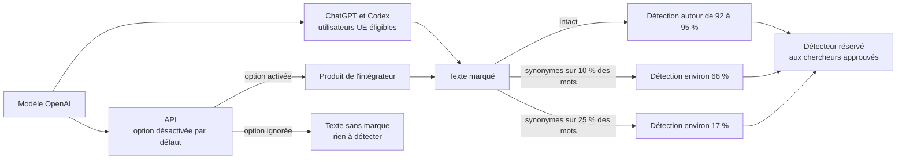
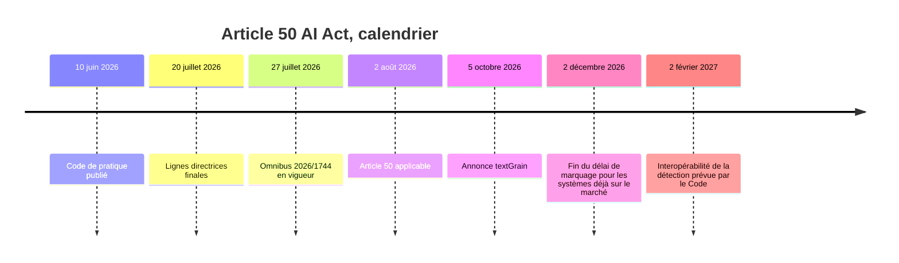
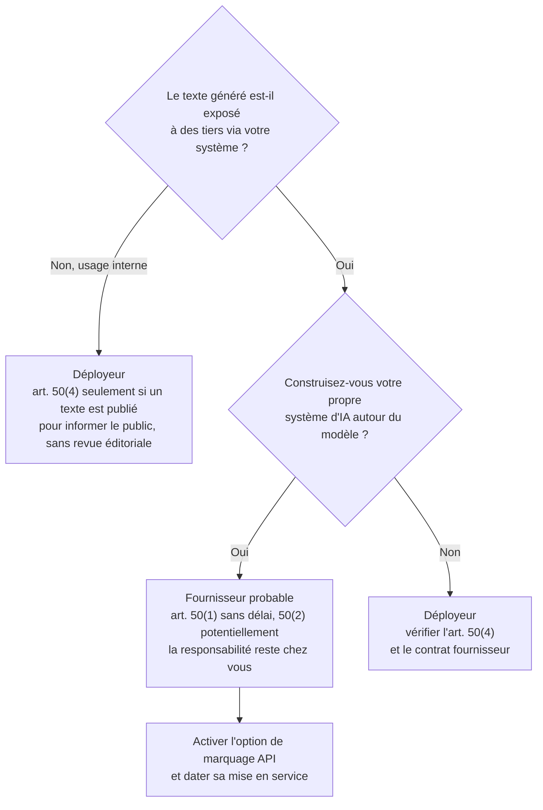

## Deux réponses identiques, une seule est signée

Posez deux fois la même question au même modèle d'OpenAI. La première réponse, obtenue dans ChatGPT depuis l'Europe, devrait porter d'ici quelques semaines une signature que personne ne peut voir. La seconde, servie par l'API (l'accès programmatique que les entreprises branchent dans leurs propres produits) au chatbot de votre service client, n'en portera aucune. Sauf si quelqu'un, chez vous, a pensé à cocher une option.

C'est le cœur de ce qu'OpenAI a annoncé lundi 5 octobre avec textGrain, un filigrane de texte conçu pour répondre à l'article 50 de l'AI Act, le règlement européen sur l'intelligence artificielle. Le sujet dépasse largement les éditeurs de chatbots. Il touche toutes les entreprises qui ont glissé un grand modèle de langage dans leurs produits ou leurs process : l'assistant d'un hôtel, la FAQ générée d'une enseigne, les messages envoyés aux étudiants d'une résidence, la documentation interne, le code.

Depuis le 2 août 2026, les obligations de transparence de l'article 50 s'appliquent (avec un sursis jusqu'au 2 décembre pour le seul marquage 50(2) des systèmes déjà sur le marché, détaillé plus bas). Le raccourci est tentant : le fournisseur filigrane, donc l'entreprise qui intègre son modèle serait couverte.

Les chiffres d'OpenAI, tels que rapportés par la presse spécialisée, racontent autre chose. Remplacez un quart des mots d'un texte marqué par des synonymes, et le détecteur n'en reconnaît plus qu'environ un sur six. Le filigrane est un composant utile. Ce n'est pas une conformité.

## Ce qu'OpenAI a réellement annoncé

Une précision de méthode d'abord. Le billet d'OpenAI n'a pas pu être consulté pour cet article (erreur d'accès), et son rapport technique est resté introuvable. Tout ce qui suit vient de la presse qui les a relayés (TNW, VKTR, AI Weekly, Let's Data Science), et qui converge sur l'essentiel. Quand un point ne repose que sur une source, je le signale.

Le principe tient en une image. Prenez un croupier qui pipe très légèrement ses dés. Sur un lancer, rien ne se voit. Sur cent lancers, celui qui connaît le biais le repère sans effort. textGrain fait la même chose avec les mots : à chaque étape de génération, une clé secrète favorise discrètement certains mots plutôt que d'autres. Aucun caractère caché, rien qu'un lecteur puisse remarquer. Juste une statistique, lisible par qui détient la clé.

Ce que les articles rapportent de l'annonce :

| Point | Ce qui est rapporté | Solidité |
|---|---|---|
| Périmètre | Texte produit par ChatGPT et Codex, utilisateurs « éligibles » de l'UE, tous forfaits, déploiement « dans les semaines à venir » | Plusieurs sources |
| ChatGPT dans l'UE | Marquage activé par défaut | VKTR et Let's Data Science ; TNW ne le précise pas |
| API | Option mondiale, désactivée par défaut, sur « certains modèles », disponible depuis le 5 octobre | Plusieurs sources |
| Clouds partenaires | OpenAI dit « travailler avec » eux ; rien de disponible | À confirmer |
| Qualité du texte | 49,57 sans filigrane, 49,76 avec, sur un benchmark | Plusieurs sources |
| Détecteur | Réservé aux chercheurs et organisations expertes approuvés, au cas par cas ; ne révèle ni l'utilisateur ni le prompt | Plusieurs sources |

Trois détails comptent pour qui intègre ces modèles. L'écart de qualité est négligeable : aucun argument produit ne justifie de laisser le marquage éteint. L'accès au détecteur passe par une candidature, ouverte le jour de l'annonce, dans une logique qu'OpenAI présente comme alignée sur le Code de pratique européen. Selon Let's Data Science, les premiers participants sont Cornell, l'ETH Zurich et l'institut KInIT. Enfin, OpenAI prévoit une ouverture en open source, mais la presse diverge sur son objet : « la technologie » chez TNW, « le détecteur » chez Let's Data Science. Ce n'est pas la même promesse.

Le point qui devrait faire réagir un DSI, c'est la ligne API. Dans ChatGPT, le marquage arrive sans que l'utilisateur ait à agir, si l'on en croit deux des sources. Dans l'API, il faut le demander, et seulement sur des modèles que personne n'a encore listés publiquement. Un même modèle, deux produits, deux régimes.

*Même modèle, deux sorties : le texte de ChatGPT en Europe sera marqué, celui de l'API ne le sera que si l'intégrateur active l'option.*

## Un indice statistique, pas une preuve

Revenons au croupier. Plus il y a de lancers, plus le biais se voit. Pour textGrain, les lancers sont des tokens, ces fragments de mots que manipulent les modèles. Selon OpenAI, tel que rapporté par la presse, avec un taux de faux positifs fixé à 1 % (un texte non marqué sur cent signalé à tort), le détecteur reconnaît environ 80 % des textes marqués de 200 tokens, l'équivalent d'un long paragraphe. À 400 tokens, on monte autour de 95 %. Les contenus mathématiques, eux, sont moins bien détectés.

Lisez la première ligne à l'envers. Sur un texte court et intact, un texte marqué sur cinq passe sous le radar. Avant la moindre retouche.

Puis viennent les retouches. À 400 tokens, remplacer 10 % des mots par des synonymes fait passer la détection d'environ 92 % à environ 66 %. À 25 % de mots remplacés, elle tombe vers 17 %. L'écart entre 92 % et 95 % sur le texte intact vient d'une incohérence dans les chiffres relayés, sans incidence sur le fond. Méfiez-vous en revanche du raccourci lu ici ou là. Le filigrane n'est pas « effacé » : il est dilué, au point de ne plus rien prouver sur un document isolé.

*Où la marque naît, où elle s'affaiblit. Chiffres OpenAI rapportés par la presse, à 400 tokens et 1 % de faux positifs.*

Corollaire que soulignent les sources : l'absence de marque ne prouve rien. Un texte court, édité, traduit ou produit par un autre fournisseur ne portera pas de signal détectable, et n'en sera pas plus humain pour autant. OpenAI le reconnaît d'ailleurs, selon AI Weekly : « A watermark does not measure human contribution, does not establish ownership or responsibility. » Autrement dit, un filigrane ne mesure pas la part humaine et n'établit ni propriété ni responsabilité.

Anthropic n'échappe pas à cette physique. Selon BleepingComputer, le filigrane de Claude, annoncé mi-août, s'applique aux nouveaux modèles lancés depuis le 2 août 2026 ; les modèles antérieurs, en période transitoire, seront marqués « dans les mois qui viennent ». La méthode s'appuie sur SynthID-Text, la technique de Google DeepMind. Anthropic l'applique partout, faute de moyen durable de le restreindre par région : « We're applying watermarking globally at launch because we don't yet have a durable way to scope it by region. » Même fragilité : une réécriture complète supprime la marque, une édition légère probablement pas. Et l'API de détection est promise, pas livrée.

Un détail pèse lourd pour qui produit du code. Anthropic ne filigrane pas les sorties où une seule réponse est correcte : réponses factuelles, code exact. Côté OpenAI, Let's Data Science note qu'aucun chiffre spécifique à Codex n'a été publié. Conclusion pratique : « Codex est filigrané » ne dit rien de votre capacité à repérer du code généré dans vos dépôts.

Mon analyse : à l'échelle d'un corpus de milliers de textes, textGrain est un instrument de mesure honnête. À l'échelle d'un document, c'est une présomption faible. Personne ne devrait s'en servir pour trancher la question « ce contrat a-t-il été rédigé par une IA ? ». Et rien, dans l'annonce telle que rapportée, n'indique qu'une entreprise pourra poser elle-même la question au détecteur.

*Quelques synonymes suffisent à diluer le signal : un filigrane statistique s'affaiblit à chaque retouche.*

## Ce que dit le droit, et ce qu'il ne dit pas

Le texte européen n'exige pas un filigrane. Il exige un résultat, réparti entre des acteurs différents. L'article 50 du règlement (UE) 2024/1689 contient trois obligations qui nous concernent directement.

- **Article 50(1)** : les fournisseurs de systèmes interactifs informent les personnes qu'elles échangent avec une IA, sauf si c'est évident.
- **Article 50(2)** : les fournisseurs de systèmes d'IA, y compris à usage général, qui génèrent du texte, de l'audio, de l'image ou de la vidéo de synthèse veillent à ce que les sorties soient « marked in a machine-readable format and detectable as artificially generated or manipulated ». Les solutions doivent être « effective, interoperable, robust and reliable as far as this is technically feasible », compte tenu des coûts et de l'état de l'art. Sont exclus l'assistance à l'édition standard et les systèmes qui ne modifient pas substantiellement les données d'entrée.
- **Article 50(4)** : les déployeurs d'un système qui génère du texte « published with the purpose of informing the public on matters of public interest » doivent le signaler. Exception : une revue humaine ou un contrôle éditorial, avec une responsabilité éditoriale assumée.

Ma lecture : la réserve « as far as this is technically feasible » est ce qui rend défendable, pour le texte, un filigrane statistique et fragile. Elle admet qu'il n'existe pas de marquage infaillible pour de la prose libre.

Le calendrier s'est précisé cet été. L'article 50 s'applique depuis le 2 août 2026. Le Digital Omnibus on AI, règlement (UE) 2026/1744 du 8 juillet 2026, publié au Journal officiel le 24 juillet et en vigueur depuis le 27, accorde un délai de quatre mois pour le seul marquage 50(2) des systèmes placés sur le marché avant le 2 août. Ils ont jusqu'au 2 décembre 2026, selon le considérant 38, la FAQ de la Commission et plusieurs cabinets. Les systèmes mis sur le marché depuis le 2 août doivent marquer dès le premier jour. Les autres obligations, dont 50(1) et 50(4), n'ont reçu aucun délai.

Deux précisions encore. Le plafond de sanction est de 15 millions d'euros ou 3 % du chiffre d'affaires mondial annuel. Il n'y a pas de rétro-marquage des sorties antérieures au 2 août ; pour le texte d'intérêt public, c'est la date de publication qui compte.

Reste le Code de pratique sur la transparence des contenus générés par IA, publié le 10 juin 2026. Il est volontaire et se découpe en deux sections : la première pour les fournisseurs (50(2)), la seconde pour les déployeurs (50(4)). Il comptait environ 190 signataires fin juillet, dont OpenAI, Anthropic et Google en section 1. La Commission et le comité européen de l'IA l'ont jugé adéquat en juillet. Mais le signer n'est pas un safe harbour, c'est-à-dire une protection automatique en cas de contrôle. Les non-signataires, eux, doivent démontrer l'adéquation de leur solution par d'autres moyens.

Le Code privilégie une approche multicouche, métadonnées signées et filigrane imperceptible, avec des exigences simplifiées pour le texte libre. Il fixe l'interopérabilité de la détection au 2 février 2027. Selon Freshfields, il prévoit une détection « en principe gratuite », avec un accès gratuit pour les autorités, les médias, les fact-checkers, les chercheurs et la société civile. Un détecteur réservé à des chercheurs approuvés cadre-t-il avec cette ambition ? La question est ouverte, et je ne prétends pas y répondre. Le rendez-vous de février 2027 le dira.

Les lignes directrices finales de la Commission, publiées le 20 juillet et non contraignantes, ajoutent deux nuances relevées par les cabinets. Le marquage peut se faire au niveau du modèle, et des solutions amont ou tierces sont possibles, mais « responsibility for compliance remains with the provider », selon McCann FitzGerald. Les traductions relèvent de l'édition standard exemptée, tandis que résumés et réécritures substantielles sont à marquer, selon Faegre Drinker.

*Les échéances de l'article 50 : une seule obligation a obtenu un sursis, et seulement pour les systèmes déjà sur le marché.*

## Qui porte quoi : fournisseur, déployeur, et la zone grise

Les faits d'abord. Le marquage 50(2) pèse sur le fournisseur du système d'IA, et, selon la lecture des lignes directrices par McCann FitzGerald, la responsabilité lui reste même s'il s'appuie sur une solution amont. Le 50(4) pèse sur le déployeur, indépendamment de tout marquage fournisseur. Le Code n'est pas un bouclier. Et l'option API de textGrain est éteinte par défaut.

La suite est mon analyse, pas un avis juridique. Je n'ai trouvé aucune source primaire qui qualifie un intégrateur consommant l'API d'un grand modèle de langage (LLM). Votre juriste tranchera.

Premier cas, l'usage interne : rédaction, code, support aux équipes. Vous êtes déployeur. Le 50(4) ne vise que le texte publié pour informer le public sur des questions d'intérêt public. La plupart des usages internes d'un opérateur réseau tombent probablement hors de ce périmètre. Inutile de surdimensionner.

Deuxième cas, celui qui compte : un service qui expose du texte généré à des tiers. Assistant client, portail captif, FAQ générée, notifications aux résidents. Ici, l'opérateur peut devenir fournisseur d'un système d'IA à part entière. Le 50(1) s'applique alors sans délai depuis le 2 août, et le 50(2) potentiellement. Le marquage du modèle amont ne règle pas la question. Si l'option API n'est pas activée, votre système émet du texte non marqué, alors que le même modèle, dans ChatGPT en Europe, devrait le marquer.

Pour le dire avec une image : monter des pneus homologués ne fait pas homologuer la voiture. Le filigrane d'OpenAI est un pneu. Le service que vous exposez à vos clients, c'est la voiture.

*Arbre de décision de rôle : analyse de l'auteur, à valider avec votre juriste, pas un avis juridique.*

## Cinq chantiers pour cet automne

Pour un opérateur présent dans l'hôtellerie, le retail, l'entreprise et les résidences étudiantes, avec une chaîne de revendeurs et d'intégrateurs, voici où je mettrais l'effort.

1. **Cartographier les sorties.** Chaque chemin par lequel du texte généré quitte vos systèmes : appels API en temps réel, traitements batch, webhooks, caches. Sans oublier les runbooks et configurations produits par Codex ou Claude Code. Le marquage intervenant à la génération, un texte produit avant l'activation et resservi depuis un cache restera, par déduction (le marquage intervenant à la génération), non marqué.
2. **Qualifier son rôle, service par service.** Fournisseur ou déployeur n'est pas une identité d'entreprise. C'est une question qui se pose pour chaque système, avec le juridique autour de la table.
3. **Activer l'option API et dater l'activation.** Vérifier quels modèles la supportent, l'allumer, consigner la date de mise en service du marquage. Sans cette date, il devient difficile de dire quels textes ont été générés avec marquage (déduction de l'auteur, pas une exigence légale).
4. **Contractualiser.** Faegre Drinker recommande de répartir marquage et détection le long de la chaîne d'approvisionnement. Concrètement : obligation d'activer le marquage, accès et niveau de service sur le détecteur, notification de tout changement de méthode, répartition explicite entre 50(2) et 50(4), gel de version de modèle. Puis répercuter ces clauses vers vos revendeurs.
5. **Tracer la revue éditoriale.** L'exception du 50(4) repose sur une revue humaine avec responsabilité éditoriale assumée. Qui relit, quand, avec quelle trace ? Si ce n'est pas écrit, ça n'existe pas.

*Fournisseur ou déployeur : la réponse change d'une porte à l'autre, et chaque sortie de texte appelle sa propre clé.*

## Ce qu'on ne sait pas encore

Plusieurs angles morts subsistent, et ils pèsent sur les décisions ci-dessus.

- **La détection en français.** Aucun chiffre n'a été rapporté pour notre langue.
- **Les modèles API couverts.** « Certains modèles », sans liste publique.
- **Le périmètre des « utilisateurs éligibles ».** Rien ne dit si les offres Enterprise ou Edu sont incluses.
- **Les clouds partenaires.** OpenAI « travaille avec » eux, sans calendrier.
- **L'interopérabilité de février 2027.** Comment un détecteur à accès restreint s'articulera-t-il avec l'exigence du Code ?
- **L'accès au détecteur pour le privé.** Rien d'annoncé à ce stade.

## Le filigrane est un composant, pas une conformité

textGrain est un travail d'ingénierie sérieux. Il donne à OpenAI de quoi documenter sa part de l'article 50(2), avec un impact quasi nul sur la qualité et une franchise appréciable sur ses propres limites. Je ne lui reproche rien de ce qu'il est.

Je reproche au marché ce qu'il veut en faire. Un signal qui laisse passer un texte court sur cinq avant toute retouche, qui tombe vers 17 % après un quart de synonymes et dont le détecteur reste réservé à des chercheurs approuvés n'est pas un contrôle. C'est un indice. Et cet indice n'est même pas présent par défaut là où les entreprises consomment le modèle : dans l'API.

Pour qui intègre des LLM, la vraie question n'a pas bougé depuis le 2 août. Quel système exposez-vous, à qui, sous quel rôle, avec quelle trace ? Le fournisseur livre une brique. L'architecture, les contrats et la preuve restent chez vous. Ceux qui l'auront traduit en inventaire et en clauses avant le 2 décembre auront une longueur d'avance. Les autres découvriront qu'une case cochée chez OpenAI ne coche rien chez eux.

---

_Vues personnelles, pas position Wifirst._

## Sources

1. TNW, « OpenAI starts watermarking ChatGPT and Codex text in the EU », 5 octobre 2026 — https://thenextweb.com/news/openai-text-watermarking-chatgpt-codex-eu-ai-act
2. OpenAI, billet sur les règles européennes de provenance du texte (inaccessible lors de la rédaction) — https://openai.com/index/our-approach-to-eu-text-provenance-rules
3. VKTR, octobre 2026 — https://www.vktr.com/ai-platforms/openai-adds-invisible-watermarks-to-chatgpt-text-in-eu/
4. Let's Data Science, octobre 2026 — https://letsdatascience.com/blog/openai-watermarks-chatgpt-codex-in-eu-rewrite-erases-mark
5. AI Weekly, octobre 2026 — https://aiweekly.co/alerts/openai-to-watermark-eu-chatgpt-text-opens-api-opt-in-worldwide
6. BleepingComputer, « How Anthropic plans to watermark Claude's AI-generated text », 14 août 2026 — https://bleepingcomputer.com/news/artificial-intelligence/how-anthropic-plans-to-watermark-claudes-ai-generated-text
7. Règlement (UE) 2024/1689, article 50 — https://artificialintelligenceact.eu/article/50/
8. Commission européenne, Code de pratique sur la transparence des contenus générés par IA — https://digital-strategy.ec.europa.eu/en/policies/code-practice-ai-generated-content
9. Commission européenne, lignes directrices sur la transparence des contenus générés par IA — https://digital-strategy.ec.europa.eu/policies/guidelines-transparency-ai-generated-content
10. Commission européenne, communiqué sur le soutien au Code de pratique, 31 juillet 2026 — https://digital-strategy.ec.europa.eu/en/news/strong-backing-code-practice-transparency-ai-generated-content
11. EUR-Lex, règlement (UE) 2026/1744, JO du 24 juillet 2026 — https://eur-lex.europa.eu/legal-content/EN/TXT/?uri=OJ:L_202601744
12. William Fry, accord sur l'Omnibus IA — https://www.williamfry.com/knowledge/eu-ai-act-omnibus-deal-reached-postponed-deadlines-watermarking-compromise-and-the-nudificiation-prohibition/
13. Hunton, entrée en vigueur du Digital Omnibus on AI — https://www.hunton.com/privacy-and-cybersecurity-law-blog/eu-digital-omnibus-on-ai-enters-into-force
14. Faegre Drinker, 30 juillet 2026 — https://www.faegredrinker.com/en/insights/publications/2026/7/eu-ai-act-commission-confirms-transparency-code-of-practice-as-adequate-and-publishes-final-version-of-its-guidelines-on-transparency-obligations
15. Jones Day, juin 2026 — https://www.jonesday.com/en/insights/2026/06/european-commission-publishes-final-code-of-practice-on-marking-and-labelling-aigenerated-content
16. Commission européenne, FAQ sur la signature du Code de pratique — https://digital-strategy.ec.europa.eu/en/faqs/signing-code-practice-transparency-ai-generated-content
17. Freshfields, « EU AI Act Unpacked #33 » — https://www.freshfields.com/en/our-thinking/blogs/technology-quotient/eu-ai-act-unpacked-33-the-final-code-of-practice-on-transparency-of-ai-generate-102n4yx
18. McCann FitzGerald, lignes directrices de l'article 50, obligations des fournisseurs — https://www.mccannfitzgerald.com/knowledge/data-privacy-and-cyber-risk/ai-transparency-european-commissions-guidelines-on-article-50-part-1-provider-obligations
