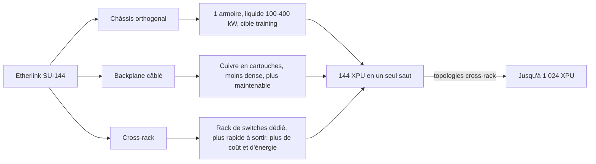
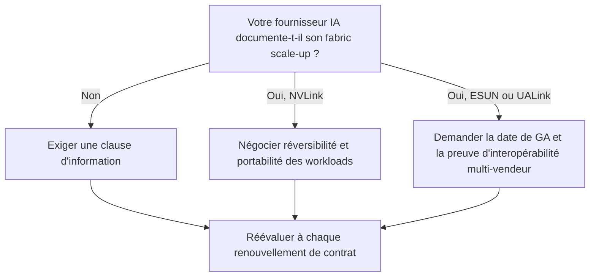

## Une armoire de 400 kilowatts, et pas une seule date

Quatre cents kilowatts pour une seule armoire de serveurs. C'est le haut de la fourchette de puissance qu'Arista affiche pour le format le plus intégré de sa nouvelle plateforme réseau IA, refroidie au liquide et présentée le 7 octobre. Le principe : relier jusqu'à 144 accélérateurs de calcul si étroitement qu'ils se comportent comme une machine unique. Ce que le communiqué tait pèse presque autant. Aucune date de disponibilité. Aucun prix. Aucune mesure de latence.

Vous n'installerez jamais ce type d'armoire dans vos salles techniques. Wifirst non plus. Mais dès que votre entreprise consomme de l'IA (un assistant pour le support client, un modèle de détection d'anomalies, une API de transcription), elle la fait tourner chez un grand cloud public, un cloud spécialisé GPU ou un éditeur de modèles qui, lui, achète ces armoires. Or au cœur de ces machines, une couche réseau est aujourd'hui tenue par un seul acteur : Nvidia, avec sa technologie propriétaire NVLink.

Pourquoi en parler maintenant ? Parce qu'Ethernet, qui a déjà conquis le réseau entre les serveurs, tente d'entrer à l'intérieur de l'armoire, porté par un standard ouvert qui revendique plus de 175 entreprises. Le sommet de l'Open Compute Project (OCP), du 12 au 15 octobre, lui servira de vitrine. Mon avis tient en une ligne : c'est une option à écrire dans vos contrats IA pour 2027, pas un achat à budgéter en 2026.

## La table de réunion et le standard téléphonique

Pour saisir l'enjeu, il faut distinguer deux réseaux. Pensez à une grande entreprise. Le premier est son standard téléphonique : il relie des milliers de bureaux, route les appels, absorbe les embouteillages, et personne ne s'offusque d'attendre une seconde. Dans un datacenter IA, c'est le **scale-out**, qui connecte des milliers de serveurs entre eux.

Le second est la table de réunion. Cent quarante-quatre personnes qui se parlent en continu, sans intermédiaire, au point de raisonner comme un seul cerveau. C'est le **scale-up** : le réseau qui soude les accélérateurs d'un même domaine pour qu'ils partagent leur mémoire et traitent ensemble un modèle trop gros pour une seule puce.

Sur le standard téléphonique, Ethernet a pris le dessus : il a repris à InfiniBand, la technologie historique du calcul haute performance, une large part des réseaux de clusters IA. Autour de la table, en revanche, on parle une seule langue : NVLink, propriété de Nvidia. Zeus Kerravala, analyste chez ZK Research, le résume en substance dans [sa tribune pour SiliconANGLE](https://siliconangle.com/2026/10/07/ethernet/) : la couche scale-up est aujourd'hui calquée sur la position dominante de Nvidia. Chez Arista, Vijay Vusirikala ne dit pas autre chose des systèmes NVLink : « There is no near-term opportunity because that is proprietary. »

Pour l'acheteur final, la conséquence est mécanique. Si la couche la plus critique du système ne se négocie qu'à un seul guichet, le prix et la feuille de route aussi. Tyson Lamoreaux, vice-président senior chargé du cloud et du réseau IA chez Arista, le formule ainsi : « The network in the AI era is no longer just an independent pipe between servers. » Il ajoute : « It's now a tightly integrated rack-scale backplane that is essential to maximizing compute. » Le réseau n'est plus un tuyau, c'est le fond de panier de l'armoire. Qui le contrôle contrôle la machine.

## Etherlink SU-144 : ce qu'il y a vraiment dans le carton

[Le communiqué d'Arista](https://www.arista.com/en/company/news/press-release/24818-pr-20261007) décrit un portefeuille Ethernet ouvert couvrant les deux réseaux, conçu avec AMD, Arm, Broadcom, d-Matrix, Meta, Microsoft et Qualcomm. Sa pièce centrale, Etherlink SU-144, forme un domaine de 144 XPU joignables en un seul saut réseau, extensible jusqu'à 1 024 XPU dans des topologies qui enjambent plusieurs armoires. Arista parle de XPU plutôt que de GPU à dessein : le terme englobe toutes les puces d'accélération, y compris celles qui ne sortent pas de chez Nvidia.

Trois formats sont proposés, et ils racontent trois compromis :

- **Châssis orthogonal** : une seule armoire refroidie au liquide, de 100 à 400 kW. Selon Kerravala, c'est le format de l'entraînement, là où la densité prime sur tout le reste.
- **Backplane câblé** : des câbles cuivre rangés en cartouches. Moins dense, mais modulaire et plus simple à maintenir.
- **Cross-rack** : la commutation part dans une armoire de switches dédiée. C'est le plus rapide à mettre sur le marché, d'après l'analyste, au prix d'un surcoût d'interconnexion et d'énergie.

Le cuivre n'est pas un choix esthétique, c'est de la physique : à ces débits, sa portée fond, ce qui impose de coller les accélérateurs aux switches. Jayshree Ullal, la PDG d'Arista, a sa formule, répétée lors des résultats d'août : « copper if you can, optics if you must ». Le cuivre tant qu'on peut, l'optique quand on n'a plus le choix.

Pour l'optique, Arista promet des modules enfichables de nouvelle génération (format XPO) et de l'optique co-packagée ou quasi co-packagée (CPO, NPO), qui rapproche le composant optique de la puce de commutation pour économiser de l'énergie. Le constructeur affiche une capacité par armoire allant de 1,6 Pb/s avec les modules actuels jusqu'à 6,5 Pb/s, et une empreinte datacenter réduite de près de 50 %. Ce sont des cibles constructeur : elles dépendent d'optiques qui ne sont pas encore livrées.

Le volet scale-out, lui, raconte une industrie qui s'industrialise. Arista y propose des armoires de référence complètes, refroidies au liquide, autour du switch 7060EX7 à 102,4 Tb/s : panneaux de brassage fibre, bacs anti-fuite avec détection active, étagères d'alimentation avec batteries de secours. Une armoire de 16 switches, c'est environ 2 000 fibres à raccorder, précise Arihant Jain, d'Arista. Sa conclusion est sans appel : « The whole old approach of spare parts or things assembled at site has to change. »

Côté logiciel, on retrouve EOS (le système d'exploitation d'Arista) ou un système réseau ouvert, les briques de l'Ultra Ethernet Consortium (UEC) et un transport multi-chemins maison, baptisé MRC.

*Orthogonal, backplane câblé, cross-rack : trois façons de souder 144 accélérateurs, trois arbitrages entre densité, maintenance et délai de mise sur le marché.*

## ESUN : Ethernet fait un régime pour entrer dans le rack

Rien de tout cela ne tiendrait sans un standard commun. ESUN (Ethernet for Scale-Up Networking) est un groupe de travail de l'OCP lancé le 13 octobre 2025 par douze fondateurs : AMD, Arista, Arm, Broadcom, Cisco, HPE Networking, Marvell, Meta, Microsoft, NVIDIA, OpenAI et Oracle. Relisez la liste. Nvidia y figure. L'initiative revendiquait plus de 175 entreprises en mars 2026, et la [spécification ESUN 1.0](https://www.opencompute.org/news/the-ocp-esun-10-specification-has-been-released/), rédigée sous la conduite de Meta et Microsoft, a été publiée entre février et mars.

Son idée centrale tient en un chiffre : 4 octets. Sur un réseau Ethernet IA classique en RoCEv2 (l'accès direct à la mémoire d'une autre machine, transporté sur IP), les en-têtes IP et UDP de chaque paquet pèsent de 28 à 48 octets, selon [l'analyse de Keysight](https://www.keysight.com/blogs/en/tech/traf-gen/2026/08/06/esun-gives-up-ip). C'est comme écrire son adresse postale complète, pays compris, sur un billet qu'on glisse à son voisin de table. ESUN remplace cette pile par un en-tête de 4 octets. Chaque octet économisé est de la bande passante rendue au calcul.

Ce régime a un prix : la souplesse. Keysight, éditeur d'outils de test, relève que les tables d'acheminement sont statiques. Pas d'apprentissage d'adresses MAC, et toute trame vers une destination inconnue est jetée. Le réseau ne découvre plus rien, il exécute un plan figé. Pour la fiabilité, ESUN impose des mécanismes de non-perte au niveau du lien, que nous avions détaillés en août à propos de SONiC. La spécification se coordonne avec l'IEEE 802.3, le comité qui normalise Ethernet, selon Synopsys.

Keysight pointe surtout deux trous dans cette version 1.0. Le premier : « defines no detection or re-routing mechanism for link- or plane-level failure ». Si un lien ou un plan entier du réseau tombe, rien n'est prévu pour détecter la panne ni la contourner. Le second est administratif mais parlant : l'EtherType d'ESUN, le code qui identifie le protocole dans une trame Ethernet, n'est pas encore attribué. Le multi-chemins d'Arista apporte bien de la résilience, mais côté scale-out, pas dans le domaine scale-up. Un standard qui ne sait pas gérer ses pannes n'est pas un standard de production. C'est un chantier.

ESUN n'est pas seul en lice. D'après [la comparaison publiée par Synopsys](https://www.synopsys.com/articles/ethernet-standards-scale-up-ai.html), UALink (Ultra Accelerator Link) fait un autre pari : une sémantique mémoire, où un accélérateur lit et écrit directement dans la mémoire d'un autre, plutôt qu'un réseau de paquets. Sa version 1.0, parue en avril 2025, vise jusqu'à 1 024 accélérateurs par grappe. La 2.0 aurait été ratifiée en avril 2026, selon la presse spécialisée. Une troisième voie, SUE (Scale-Up Ethernet), a été contribuée à l'OCP, en version 1.0 depuis septembre 2025.

Petit rapprochement personnel : 1 024, c'est aussi le plafond cross-rack de SU-144. Les deux camps visent la même échelle. Les départager en performance est en revanche impossible : ni Arista ni l'OCP ne publient de latence ou de débit par accélérateur. Toute comparaison chiffrée avec NVLink ou UALink relève, à ce stade, de la fiction marketing.

*De 144 accélérateurs joignables en un saut à 1 024 répartis sur plusieurs armoires : l'échelle que visent à la fois Arista et UALink.*

## Le calendrier, ce juge de paix

Dans une annonce d'architecture, il y a ce qu'on montre au salon et ce qu'on facture. Pour situer SU-144, il suffit d'écouter Arista parler à ses investisseurs. Début mai, lors des résultats du premier trimestre, Jayshree Ullal a posé le cadre, [rapporté par The Next Platform](https://www.nextplatform.com/connect/2026/05/07/arista-rides-ai-scale-out-networks-moves-into-scale-across-and-awaits-scale-up/5235293) : « Scale up will be a new entry for Arista in 2027 and beyond. » ESUN n'arrive sur les switches qu'à partir de 2027. Les clients en essai attendent les ports à 1,6 Tb/s, et seuls quelques-uns testent ESUN à 800 Gb/s.

Les résultats du deuxième trimestre, en août, ont confirmé à la fois la santé du groupe et ce calendrier. [Selon SDxCentral](https://www.sdxcentral.com/news/arista-smashes-revenue-records-with-3b-ceo-bullish-on-supply-chain-overhaul/), le chiffre d'affaires atteint 3,036 Md USD (+37,7 %), la prévision annuelle tourne autour de 12,6 Md USD, et les engagements d'achat pluriannuels ont bondi à 9,7 Md USD, contre 3,6 Md USD un an plus tôt. Mais les switches à 1,6 Tb/s, présentés en juin, ne seront expédiés qu'au début de 2027. Arista elle-même situe des revenus scale-up significatifs en 2027-2028, pas avant.

Sur NVLink, Ullal reste prudente : « It will take time to go from a proprietary scale-up that's been around a long time with NVLink. » C'est dans les environnements non-Nvidia, a-t-elle précisé, qu'Arista compte travailler au plus près de ses clients. Traduction : Arista ne vient pas déloger NVLink chez Nvidia. Elle vient équiper tous les autres. Ajoutez la pénurie : la direction ne voit pas l'industrie sortir des tensions sur la mémoire et la chaîne d'approvisionnement avant 2028, selon [le résumé de l'appel publié par GuruFocus](https://www.gurufocus.com/news/9004375/arista-networks-inc-anet-q2-2026-earnings-call-highlights-record-3-billion-quarter-and-raised-2026-guidance-signal-strong-ai-momentum). Toute date de livraison sera à pondérer.

Kerravala en tire la conclusion logique : SU-144 relève davantage d'une stratégie d'architecture de référence que d'un produit catalogue. Les premiers acheteurs seront les hyperscalers, les neoclouds (ces clouds spécialisés dans la location de GPU) et les fournisseurs d'infrastructure IA. Les entreprises en consommeront les effets à travers eux. À noter : je n'ai trouvé ni réaction publique de Nvidia ou du consortium UALink, ni chiffrage d'un cabinet d'analyse indépendant sur ESUN.

| Ce qui est annoncé | Ce qui manque |
|---|---|
| 144 XPU en un saut, jusqu'à 1 024 en cross-rack | Date de disponibilité générale (GA) |
| Trois formats, jusqu'à 400 kW en mono-armoire | Prix |
| Armoires scale-out à 102,4 Tb/s par switch | Latence et débit par XPU |
| Cibles : 6,5 Pb/s par armoire, près de 50 % d'empreinte en moins | Premier client nommé, rôle de chaque partenaire |

## Vous n'achèterez pas de SU-144. Votre fournisseur, peut-être

Revenons à la question de départ. Un opérateur comme Wifirst, une DSI de la distribution ou de l'hôtellerie n'achètera pas de fabric scale-up. Nos besoins IA passent par des API, des instances louées, des modèles hébergés. La bonne question n'est donc pas « faut-il acheter Arista ? ». C'est : sur quel réseau tourne ce que j'achète, et puis-je en sortir ?

L'argument le plus solide d'Arista, souligne Kerravala, n'est d'ailleurs pas la performance mais l'exploitation : un seul système réseau, une seule télémétrie, les mêmes compétences du fond de l'armoire jusqu'au réseau entre serveurs. Pour un fournisseur de cloud, ce sont des équipes plus polyvalentes. Pour vous, à terme, un fournisseur moins captif de son propre fournisseur, donc une négociation plus équilibrée.

Trois questions méritent d'entrer dans vos prochains appels d'offres et renouvellements de contrats IA :

1. **Quel fabric scale-up ?** Demandez à votre fournisseur de documenter ce qui relie les accélérateurs de vos instances : NVLink, ESUN, UALink ou autre. Une clause d'information, mise à jour à chaque évolution d'infrastructure, ne coûte rien.
2. **Quelle feuille de route hors Nvidia ?** Accélérateurs AMD, puces maison, ESUN : à quel horizon, et avec quelle continuité de service pendant la transition ?
3. **Quelle réversibilité ?** Vos modèles affinés et vos pipelines d'inférence sont-ils portables d'une plateforme à l'autre sans réécriture ? Quel est le coût de sortie, en jours-homme comme en euros ?

Ensuite, surveillez les signaux qui transformeront l'option en décision. Le premier se jouera dès la semaine prochaine : Arista exposera un rack liquide assemblé sur son stand E61 au sommet OCP, et son cofondateur Andy Bechtolsheim y interviendra le 13 octobre sur « The Gigawatt AI Data Center Era ». Une démo n'est pas une livraison. Pour rouvrir le dossier, j'attends :

- une date de GA et un prix publics pour SU-144 ;
- un premier client nommé en production, hors partenaires d'ingénierie ;
- une démonstration d'interopérabilité ESUN entre switches et accélérateurs de constructeurs différents ;
- une révision d'ESUN qui comble les trous relevés par Keysight (pannes de lien, EtherType) ;
- les premiers produits UALink, attendus entre fin 2026 et 2027 selon la presse spécialisée.

*Cadenas fermé sur le câblage propriétaire, cadenas ouvert sur Ethernet : la bataille du rack porte sur la dépendance autant que sur le débit.*

## Une sortie de secours, pas un déménagement

Le fait le plus important de cette séquence n'est pas dans le communiqué du 7 octobre. Il est dans la liste des fondateurs d'ESUN, un an plus tôt : Nvidia y figure, aux côtés d'AMD, de Broadcom, de Meta et d'OpenAI. Je n'y lis pas une capitulation. J'y lis une assurance : quand un standard peut un jour concurrencer votre produit le plus stratégique, mieux vaut être assis à la table où il s'écrit.

Le rapport de force dans le rack ne basculera pas en 2026. Arista le dit elle-même : scale-up en 2027 et au-delà, revenus significatifs en 2027-2028, composants sous tension jusqu'en 2028. Ajoutez une spécification 1.0 qui ne sait pas encore contourner une panne de lien. Quiconque vous vend aujourd'hui une IA « ouverte de bout en bout » grâce à ESUN vous vend une maquette.

L'histoire du scale-out invite pourtant à ne pas balayer le sujet. Ethernet partait derrière InfiniBand dans les clusters IA ; quelques années plus tard, c'est lui qui donne le tempo. Rien ne garantit que le scénario se répète dans le rack. Rien ne permet de l'exclure non plus, et c'est précisément ce qui donne sa valeur à l'option.

Pour un CTO qui consomme de l'IA, la conduite à tenir se résume ainsi : ne rien acheter, tout documenter. Une clause de sortie, c'est une sortie de secours. On n'a aucune intention de l'emprunter, mais on vérifie à chaque visite qu'elle n'est pas murée. Exigez de savoir sur quel fabric tournent vos workloads, inscrivez la réversibilité dans les contrats renouvelés en 2026, et rouvrez le dossier au premier signal concret : une date, un prix, un client. Pas avant.

Le réseau devient le fond de panier de l'IA. Raison de plus pour savoir à qui appartient la prise.

_Vues personnelles, pas position Wifirst._

## Sources

1. [Arista Networks, communiqué de presse Etherlink scale-up et scale-out, 7 octobre 2026](https://www.arista.com/en/company/news/press-release/24818-pr-20261007)
2. [Zeus Kerravala (ZK Research), SiliconANGLE, 7 octobre 2026](https://siliconangle.com/2026/10/07/ethernet/)
3. [Open Compute Project, « The OCP ESUN 1.0 specification has been released », 10 mars 2026](https://www.opencompute.org/news/the-ocp-esun-10-specification-has-been-released/)
4. [Keysight, « ESUN gives up IP », 6 août 2026](https://www.keysight.com/blogs/en/tech/traf-gen/2026/08/06/esun-gives-up-ip)
5. [Synopsys, standards Ethernet pour le scale-up IA : ESUN, SUE, UALink](https://www.synopsys.com/articles/ethernet-standards-scale-up-ai.html)
6. [The Next Platform, résultats Q1 2026 d'Arista, 7 mai 2026](https://www.nextplatform.com/connect/2026/05/07/arista-rides-ai-scale-out-networks-moves-into-scale-across-and-awaits-scale-up/5235293)
7. [SDxCentral, résultats Q2 2026 d'Arista, 5 août 2026](https://www.sdxcentral.com/news/arista-smashes-revenue-records-with-3b-ceo-bullish-on-supply-chain-overhaul/)
8. [GuruFocus, synthèse de l'appel résultats Q2 2026 d'Arista, août 2026](https://www.gurufocus.com/news/9004375/arista-networks-inc-anet-q2-2026-earnings-call-highlights-record-3-billion-quarter-and-raised-2026-guidance-signal-strong-ai-momentum)
9. [Converge Digest, UALink 2.0, avril 2026](https://convergedigest.com/qa-ualink-2-0-in-network-compute-and-the-future-of-open-ai-interconnects/)
10. [Techstrong.ai, UALink 2.0, avril 2026](https://techstrong.ai/features/ualink-2-0-targets-nvidias-grip-on-ai-interconnects/)
