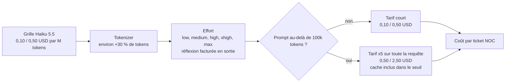
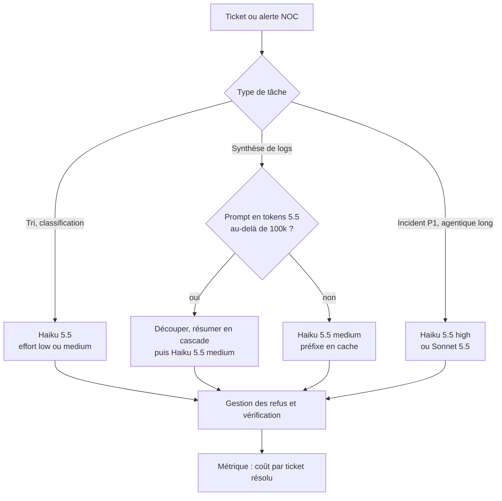

## Dix cents de dollar, et trois petites lignes

Dix cents de dollar. C'est ce que facture désormais Anthropic pour faire lire un million de tokens (les fragments de mots qu'un modèle de langage découpe, compte et facture) à Claude Haiku 5.5, son plus petit modèle, annoncé le 7 octobre. C'est dix fois moins que son prédécesseur. Le communiqué résume l'affaire en une formule : environ 75 % moins cher, « en moyenne ».

Cette formule va voyager. Nous sommes en pleine saison budgétaire, et elle atterrira dans plus d'un tableur 2027. Elle parle à tous ceux qui ont confié à un petit modèle des tâches répétitives et massives : le tri des tickets d'un centre de supervision réseau (NOC), la synthèse des journaux d'équipements, le support de premier niveau pour des centaines d'hôtels, de magasins ou de résidences étudiantes. À ces volumes, quelques millièmes de dollar par ticket finissent par faire une ligne budgétaire.

Le problème, c'est que personne ne paie une grille tarifaire. On paie des tickets traités. Entre les deux, Haiku 5.5 a glissé trois mécanismes que la grille ne montre pas. Un niveau de réflexion réglable fait varier le coût d'une même tâche d'un facteur 4. Un nouveau découpage du texte gonfle les volumes d'environ 30 %. Et un seuil à 100 000 tokens fait payer toute la requête cinq fois plus cher.

Selon votre architecture, le « -75 % » devient -83 %. Ou presque rien.

## Le prix au litre n'est pas la consommation

Imaginez une station-service qui afficherait le litre à -90 %. Belle affiche. Puis vous lisez les petites lignes. Le litre a rétréci : il en faut 30 % de plus pour parcourir la même distance. La consommation dépend de la pédale d'accélérateur, réglée par défaut à mi-course. Et au-delà d'une certaine charge, la voiture bascule en tarif poids lourd, pas seulement sur le surplus, mais sur tout le trajet.

Haiku 5.5, c'est exactement cette station. La grille, confirmée par la documentation tarifaire d'Anthropic [5], tient en deux lignes. Sous 100 000 tokens de prompt : 0,10 USD par million de tokens en entrée, 0,50 USD en sortie. Au-delà : 0,50 USD et 2,50 USD. La relecture du cache (un contexte déjà envoyé, que le fournisseur garde en mémoire et refacture à prix cassé) tombe à 0,01 USD. Haiku 4.5 coûtait 1 USD et 5 USD, sans palier.

Faites la division. La grille donne -90 % sous le seuil, -50 % au-dessus. D'où sort le 75 % ? Anthropic ne publie pas sa méthode. L'éditeur précise qu'environ 90 % des requêtes Haiku 4.5 restaient sous les 100 000 tokens [1] ; une moyenne pondérée par le nombre de requêtes tomberait donc autour de -86 %. Le 75 % repose sur une autre pondération, peut-être par la dépense, peut-être corrigée du nouveau découpage. C'est une hypothèse de ma part, pas une information.

Une chose est certaine : ce chiffre est une moyenne sur la clientèle d'Anthropic. Pas sur la vôtre.

*Les trois leviers qui séparent la grille affichée du coût réel d'un ticket.*

Trois leviers, donc. Le premier se règle, le deuxième se mesure, le troisième s'évite par l'architecture.

## L'effort : un facteur 4 sur la même grille

Même modèle, même grille, même série de tâches. Réglé sur « medium », Haiku 5.5 coûte 0,05 USD par tâche. Réglé sur « max », 0,21 USD. Quatre fois plus, sans qu'un seul centime de tarif ait bougé.

Ces chiffres ne viennent pas d'Anthropic. Ils viennent d'Artificial Analysis (AA), un banc d'essai indépendant qui fait tourner les modèles sur sa propre batterie d'épreuves, l'Intelligence Index, avec environ 10 000 tokens d'entrée par tâche [8][9][10]. C'est aujourd'hui la seule mesure tierce disponible : à J+2, je n'ai trouvé aucun analyste (type Gartner ou IDC) ni régulateur qui se soit prononcé.

Le mécanisme est simple. Haiku 5.5 est le premier Haiku doté d'un « effort » réglable sur cinq crans, de low à max, avec medium par défaut [6][7]. Plus l'effort monte, plus le modèle réfléchit avant de répondre. Et cette réflexion est facturée comme de la sortie, donc cinq fois le prix de l'entrée.

| Modèle et effort | Indice AA | Tokens de sortie (index entier) | Coût par tâche |
|---|---|---|---|
| Haiku 4.5 (raisonnement) | 17 | 78 M | 0,28 USD |
| Haiku 5.5 medium (défaut) | 34 | 54 M | 0,05 USD |
| Haiku 5.5 max | 43 | 440 M | 0,21 USD |
| GPT-6 Luna max | 38 | 140 M | 0,07 USD |

*Mesures tierces Artificial Analysis, Intelligence Index v4.3.2, octobre 2026 [9][10][11][12].*

Trois lectures, et elles ne vont pas toutes dans le sens du communiqué.

Première lecture : face à Haiku 4.5, l'économie par tâche atteint -82 % en medium, pour un indice doublé. En max, elle tombe à -25 % (calcul de l'auteur à partir des chiffres AA). Le même produit est une rupture ou une simple remise, selon un paramètre.

Deuxième lecture : la réputation de modèle « bavard » qui circule depuis l'annonce ne vaut qu'en max. À ce niveau, Haiku 5.5 produit environ trois fois plus de tokens que GPT-6 Luna d'OpenAI, vendu à la même grille de 0,10 et 0,50 USD. Trois fois plus de tokens, trois fois la facture, pour un indice de 43 contre 38. En medium, AA le classe au contraire parmi les modèles « fairly concise » : 54 millions de tokens sur l'index, quand la médiane tourne autour de 100.

Troisième lecture, la plus utile : à score égal (38), Haiku 5.5 en high consomme environ 55 000 tokens par tâche, Luna en max environ 50 000 [14]. Des volumes comparables. Le coût dépend moins du modèle que du réglage.

Deux précautions. Le coût par tâche d'AA n'intègre pas encore la tarification par palier [8], mais son workload court y échappe de toute façon. Et comme les deux éditeurs ne découpent pas le texte de la même façon, une partie de l'écart avec Luna pourrait tenir au comptage plutôt qu'au bavardage (inférence de l'auteur).

Anthropic documente lui-même l'arbitrage : passer de low à medium divise environ par deux les abandons prématurés, mais fait « plus que doubler » les tokens de sortie par tentative [7]. Je ne referai pas ici le plaidoyer de juillet sur le curseur d'effort d'Opus 5. Le point neuf est ailleurs. Pour la première fois sur la gamme d'entrée, un paramètre de configuration pèse autant dans la facture que le choix du modèle (facteur 4 entre medium et max, contre 1,3 à 5,6 entre Haiku 4.5 et 5.5 selon l'effort).

*Trois réglages invisibles sur la grille, un seul ticket de caisse à l'arrivée.*

## La falaise des 100 000 tokens

Prenez un pipeline qui résume les journaux d'un incident réseau. Il envoie 77 000 tokens à Haiku 4.5, confortablement sous la barre. Vous basculez sur Haiku 5.5 sans toucher une ligne de code. Le même texte pèse maintenant environ 100 000 tokens [15]. Vous venez de franchir la falaise sans le savoir, et toute la requête change de tarif.

Deux mécanismes se cumulent. Le premier est le nouveau tokenizer, le composant qui découpe le texte en tokens. La documentation technique annonce « approximately 30% more tokens » pour un même texte, avec une variation selon le contenu [3][4][5]. La page d'annonce se contente d'un pudique « slightly more tokens per task » [1]. Faites confiance à la doc.

Un tiers non primaire évoque même jusqu'à +35 % sur du JSON et du code, soit exactement la matière d'un journal d'équipement. C'est plausible, et cela se vérifie sur vos propres données. Anthropic demande d'ailleurs de recompter prompts, plafonds de sortie et estimations de coût avec le nouvel identifiant de modèle, via l'endpoint `count_tokens` [3].

Le second mécanisme est le seuil lui-même. Notre impôt sur le revenu est progressif : franchir une tranche ne taxe au taux supérieur que l'euro de trop. La grille de Haiku 5.5 n'a pas cette délicatesse. C'est un effet de seuil pur : à 100 001 tokens de prompt, toute la requête passe à 0,50 USD en entrée et 2,50 USD en sortie.

Le cache n'y échappe pas. La documentation est explicite : la longueur du prompt « counts all of its input tokens, including cache reads and cache writes », et une requête au-dessus du seuil paie le tarif haut « even when part of its prompt is a cache hit » [5]. La relecture de cache passe alors de 0,01 à 0,05 USD.

Le détail qui fâche : Haiku 5.5 est le seul modèle récent d'Anthropic sans tarif plat sur sa fenêtre de contexte d'un million de tokens. Ailleurs dans le catalogue, « a 900k-token request is billed at the same per-token rate as a 9k-token request » [5]. Ici, le million de tokens de contexte (contre 200 000 sur Haiku 4.5) est une capacité, pas une invitation.

Deux phrases en apparence contradictoires circulent sur la tranche haute [13]. Elles sont vraies toutes les deux. Au-delà de 100 000 tokens, Haiku 5.5 coûte 50 % de moins que Haiku 4.5. Et il coûte cinq fois plus que son propre tarif court. Tout dépend de qui vous comparez.

Combinons maintenant les deux leviers (estimation de l'auteur, tokenizer à x1,3). Sous le seuil, un même texte revient à 0,13 USD au lieu de 1 USD par million de tokens comptés à l'ancienne : -87 %. Au-dessus, 0,65 USD au lieu de 1 USD : -35 %. L'essentiel de la remise se joue donc sur un seul critère. Rester sous la barre.

*Découper les journaux en lots plus courts pour passer sous le seuil : l'économie se gagne dans l'architecture, pas dans la grille.*

## Quatre scénarios NOC, de -3 % à -83 %

Passons aux cas d'usage. Les chiffres qui suivent sont **des estimations d'ordre de grandeur, pas des mesures**. Hypothèses déclarées : tokenizer à x1,3 sur l'entrée et sur la sortie visible ; réflexion ajoutée en sortie à 1 500 tokens en medium et 12 000 en max (valeurs d'exemple, à mesurer chez vous) ; Haiku 4.5 sans réflexion. Tout se recalcule avec la grille publique [5].

**Cas A, tri d'un ticket.** 6 000 tokens d'entrée (le ticket et quelques extraits de logs), 400 de sortie. Sur Haiku 4.5, cela donne 0,0080 USD. Sur Haiku 5.5 medium : 7 800 tokens d'entrée à 0,10 USD le million, plus 2 020 tokens de sortie (520 visibles, 1 500 de réflexion) à 0,50 USD, soit 0,0018 USD. Le communiqué tient : -78 %. En max, la réflexion grimpe à 12 000 tokens et le ticket revient à 0,0070 USD. Le communiqué s'évapore : -12 %.

**Cas B, synthèse de logs.** 90 000 tokens d'entrée mesurés sur Haiku 4.5, 800 de sortie : 0,094 USD. Sur Haiku 5.5, le tokenizer porte l'entrée à 117 000 tokens. Falaise franchie, tout passe au tarif haut. En medium, environ 0,065 USD, soit -31 %. En max, avec 12 000 tokens de réflexion facturés à 2,50 USD le million, environ 0,091 USD. Autrement dit -3 %, c'est-à-dire rien.

**Cas B bis, la même synthèse découpée.** Deux lots d'environ 58 000 tokens, chacun résumé en medium, puis un appel court qui fusionne les deux résumés. Hypothèse : 800 tokens de sortie visibles par lot, 1 500 de réflexion. Total : environ 0,016 USD, soit -83 %. Quatre fois moins cher que le cas B, pour le même travail. Rester sous le seuil par architecture vaut un facteur 4.

**Cas C, support multi-sites.** Une conversation de dix tours, avec un préfixe stable de 20 000 tokens en cache : procédures, topologie et contacts du site. Hypothèse : 800 tokens de nouvelle entrée et 1 200 de sortie visible par tour, écriture de cache 5 min. Environ 0,113 USD sur Haiku 4.5, contre 0,019 USD en medium (-83 %) et 0,030 USD en max (-74 %), avec une réflexion plus modeste sur ce type d'échange (800 et 3 000 tokens). C'est la relecture de cache à 0,01 USD qui fait l'essentiel du travail. Un piège documenté guette pourtant : changer l'effort global en cours de conversation invalide le cache [6][7].

| Scénario (estimations) | Haiku 4.5 | Haiku 5.5 medium | Haiku 5.5 max |
|---|---|---|---|
| A. Tri d'un ticket | 0,0080 USD | 0,0018 USD (-78 %) | 0,0070 USD (-12 %) |
| B. Synthèse de logs, 90 000 tokens | 0,094 USD | 0,065 USD (-31 %) | 0,091 USD (-3 %) |
| B bis. Même synthèse en deux lots | 0,094 USD | 0,016 USD (-83 %) | non calculé |
| C. Support, 10 tours, préfixe en cache | 0,113 USD | 0,019 USD (-83 %) | 0,030 USD (-74 %) |

De -3 % à -83 % : même modèle, même grille. L'écart ne vient pas du fournisseur. Il vient de vos choix d'architecture et de configuration.

*Petit modèle rapide ou grand modèle : c'est ce choix, ticket par ticket, qui fait la facture d'un centre de supervision.*

## Piloter le coût par ticket résolu

La conséquence managériale tient en une phrase : le bon indicateur n'est plus le prix par million de tokens, c'est le coût par ticket résolu. Le premier se lit sur une grille. Le second se mesure, à partir du champ `usage` que renvoie chaque appel.

Quatre indicateurs méritent un tableau de bord. La distribution des tailles de prompt autour de 100 000 tokens, comptées avec le tokenizer de Haiku 5.5 et non avec celui de l'ancien modèle. Le ratio entre tokens de réflexion et tokens visibles, par type de tâche. La part de réponses refusées. Le taux de reprise, humaine ou automatique.

Pourquoi surveiller les refus ? Parce que Haiku 5.5 introduit de nouveaux refus de sécurité, avec une catégorie dédiée à la cybersécurité. La documentation prévient : « Benign cybersecurity work can also trigger this category », sans repli automatique côté serveur [7]. Pour un centre de supervision qui résume des journaux d'incident, le risque est concret. Un ticket refusé repart vers un humain, et c'est le plus cher des tickets.

Ensuite, un routeur. En medium, Haiku 5.5 rend le tri de premier niveau si peu coûteux qu'il devient du bruit dans le budget. La question bascule vers la qualité et la vérification, sujet abordé ici en début de semaine à propos des essaims d'agents. Pour les tâches agentiques longues, le grand frère reste dans une autre catégorie : 70,6 % sur Terminal-Bench 4.0 pour Sonnet 5.5, contre 39,2 % pour Haiku 5.5, selon l'éditeur [1]. AA mesure d'ailleurs un score plus bas pour Haiku sur sa propre exécution. Sonnet 5.5 coûte vingt fois plus cher en entrée : il les vaut sur un incident complexe, pas sur un tri.

*Un routage FinOps (pilotage financier du cloud) type pour un NOC : l'effort et le modèle deviennent des décisions par type de ticket, P1 désignant les incidents de priorité maximale.*

Restent trois lignes que la grille ne montre pas davantage. Le Priority Tier, la capacité garantie qu'Anthropic vend sous engagement, n'existe pas sur Haiku 5.5 [4] : un NOC qui en dépend doit le replanifier. La résidence des données se paie aussi : endpoints régionaux à +10 %, traitement limité aux États-Unis à x1,1, et grilles propres chez les clouds partenaires, Bedrock, Google Cloud ou Microsoft Foundry [2][5]. Je n'ai pas trouvé de grille européenne spécifique à Haiku 5.5. Vérifiez celle de votre région avant de projeter quoi que ce soit.

Dernier point, la migration n'est pas un simple changement d'identifiant. Plusieurs paramètres disparaissent, dont `temperature` et le pré-remplissage de la réponse du modèle [3][4]. Prévoyez une vraie recette, pas un rechercher-remplacer.

## Ma position : la grille est un argument commercial, le ticket une métrique d'ingénierie

Soyons clairs : Haiku 5.5 est un vrai saut. Un indice de capacité doublé face à Haiku 4.5 selon AA, et un bond de 15,7 % à 72,4 % sur OSWorld 2.1, sur un sous-ensemble hors ligne et selon l'éditeur [1]. En medium, sur un tri de ticket, le coût devient marginal. Je le mettrais en test dès la semaine prochaine sur un flux de tri.

Mais le « -75 % » n'a rien à faire dans un budget. Ce qui doit y figurer, c'est le coût par ticket mesuré sur un échantillon d'un millier de vos tickets réels. Avec le tokenizer réel, l'effort réel et la distribution réelle des tailles de prompt.

Surtout, regardez ce que la grille dessine. Un tarif plancher sous 100 000 tokens, un effet de seuil au-delà, une relecture de cache à un centime : Anthropic tarife Haiku 5.5 pour des appels nombreux, courts et bien cachés, typiquement des sous-agents [17]. Pas pour un prompt géant qui avale un incident entier d'un coup. Le message est architectural autant que commercial. Découpez, résumez en cascade, gardez chaque appel sous la barre.

La gouvernance suit naturellement : un budget par type de ticket, une alerte quand les plus gros prompts approchent 90 000 tokens, et l'effort traité comme un paramètre de configuration versionné. Revu comme un changement de code, pas basculé un vendredi soir.

Celui qui pilote ces trois leviers battra la grille. Celui qui lit seulement la grille découvrira la falaise sur sa facture de novembre.

_Vues personnelles, pas position Wifirst._

## Sources

1. [Anthropic — Claude Haiku 5.5, annonce officielle (7 octobre 2026)](https://www.anthropic.com/claude-haiku-5-5)
2. [Claude Docs — Claude Haiku 5.5, overview](https://platform.claude.com/docs/en/models/haiku-5-5/overview)
3. [Claude Docs — What's new in Claude Haiku 5.5](https://platform.claude.com/docs/en/models/haiku-5-5/whats-new-haiku-5-5)
4. [Claude Docs — Migration guide Haiku 5.5](https://platform.claude.com/docs/en/models/haiku-5-5/migration-guide)
5. [Claude Docs — Pricing (seuil 100k, clouds partenaires, résidence)](https://platform.claude.com/docs/en/about-claude/pricing)
6. [Claude Docs — Effort](https://platform.claude.com/docs/en/build-with-claude/effort)
7. [Claude Docs — Prompting Claude Haiku 5.5 (effort, refus)](https://platform.claude.com/docs/en/build-with-claude/prompt-engineering/prompting-claude-haiku-5-5)
8. [Artificial Analysis — Anthropic has released Claude Haiku 5.5](https://artificialanalysis.ai/articles/claude-haiku-5-5)
9. [Artificial Analysis — Claude Haiku 5.5 (Max)](https://artificialanalysis.ai/models/claude-haiku-5-5)
10. [Artificial Analysis — Claude Haiku 5.5 (medium)](https://artificialanalysis.ai/models/claude-haiku-5-5-medium)
11. [Artificial Analysis — GPT-6 Luna (max)](https://artificialanalysis.ai/models/gpt-6-luna)
12. [Artificial Analysis — Claude 4.5 Haiku (Reasoning)](https://artificialanalysis.ai/models/claude-4-5-haiku-reasoning)
13. [AI Weekly — Anthropic Cuts Claude Haiku 5.5 Price 75% Below Haiku 4.5](https://aiweekly.co/alerts/anthropic-cuts-claude-haiku-55-price-75-below-haiku-45)
14. [The Decoder — Claude Haiku 5.5 arrives with massive price cuts](https://the-decoder.com/claude-haiku-5-5-arrives-with-massive-price-cuts-proving-the-ai-pricing-arms-race-is-far-from-over/)
15. [Beri / The Daily Brief — Haiku 5.5 charges 5x once a prompt passes 100K tokens](https://www.beri.net/article/claude-haiku-5-5-pricing-100k-token-tier-benchmarks-vs-gpt-6-luna-sonnet-5-5-haiku-4-5-migration)
16. [OrcaRouter — Claude Haiku 5.5 vs Haiku 4.5: Not a 90% Saving (analyse d'un revendeur)](https://www.orcarouter.ai/blog/claude-haiku-5-5-vs-claude-haiku-4-5)
17. [Beam.ai — Claude Haiku 5.5: Price, Benchmarks and Subagent Costs](https://beam.ai/agentic-insights/claude-haiku-5-5-subagents)
