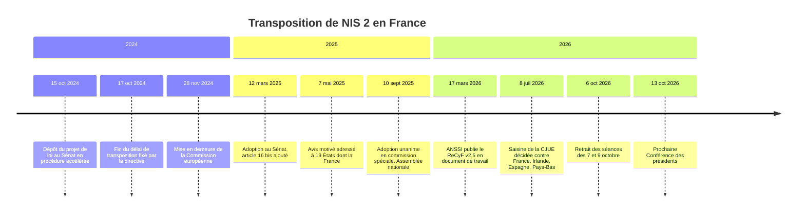
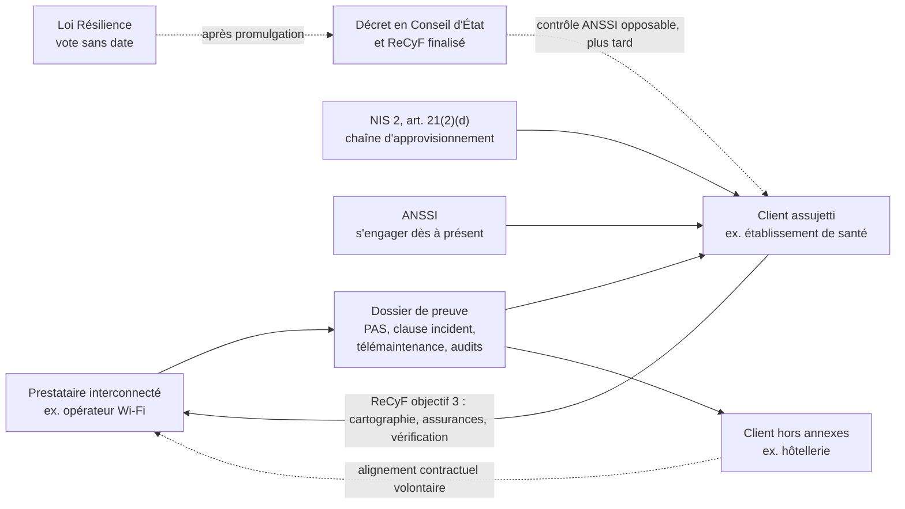

## Cinq séances rayées d'un trait de plume

Mardi 6 octobre, l'Assemblée nationale a rayé cinq séances de son agenda. Deux le mercredi 7, trois le vendredi 9 : les créneaux qui devaient enfin amener dans l'hémicycle le projet de loi Résilience. Ce texte transpose en droit français la directive européenne NIS 2 (Network and Information Security), le socle d'obligations de cybersécurité qui attend les établissements de santé, les opérateurs télécoms, les fournisseurs de services numériques et une longue liste d'autres secteurs. Aucun motif écrit. Aucune nouvelle date. Prochain rendez-vous : la Conférence des présidents du 13 octobre.

Ce report pèse plus lourd qu'il n'y paraît. Bruxelles avait fixé la date limite de transposition au 17 octobre 2024. Presque deux ans plus tard, le texte n'a toujours pas été débattu en séance publique au Palais-Bourbon. Entre-temps, la Commission européenne a décidé de porter le cas français devant la Cour de justice de l'Union européenne.

La tentation est compréhensible, pour un DSI de clinique, d'enseigne ou de groupe hôtelier comme pour les prestataires qui les équipent : tant que la loi n'est pas votée, rien ne presse. Je crois que c'est une erreur de lecture. Le calendrier parlementaire fixe le jour où les contrôles de l'ANSSI (Agence nationale de la sécurité des systèmes d'information) deviendront opposables. Il ne fixe pas le jour où un client demandera à son opérateur Wi-Fi de prouver qu'il n'est pas le maillon faible de sa chaîne.

## Ce que dit le relevé, et ce qu'il tait

La source officielle tient en une phrase. Le relevé de conclusions de la Conférence des présidents acte le « retrait du projet de loi, adopté par le Sénat, relatif à la résilience des infrastructures critiques » des séances du mercredi 7 octobre (après-midi et soir) et du vendredi 9 octobre (matin, après-midi et soir) [1]. Pas un mot sur le pourquoi.

La presse a comblé le vide. D'après Next, c'est officiellement l'encombrement du calendrier qui est en cause, notamment l'examen de la loi intégrale contre les violences sexistes et sexuelles [14]. Le rapporteur Éric Bothorel, interrogé par Projet Arcadie et repris par Next, se veut rassurant : « J'ai bon espoir qu'on pourra réinscrire le texte d'ici quinze jours ou trois semaines » [19]. Un espoir n'est pas une date.

Reste un débat de fond, et il tient en quelques lignes. En mars 2025, le Sénat a ajouté au texte une disposition interdisant d'imposer aux fournisseurs de services de chiffrement des dispositifs qui affaiblissent volontairement la sécurité, « tels que des clés de déchiffrement maîtresses ou tout autre mécanisme permettant un accès non consenti aux données protégées » [3]. Traduction : pas de porte dérobée obligatoire. C'est l'article 16 bis. Il est issu d'un amendement d'Olivier Cadic, Michel Canévet, Catherine Morin-Desailly et d'une vingtaine de sénateurs, adopté le 12 mars 2025 malgré l'avis défavorable de la commission et du Gouvernement [4]. La commission spéciale de l'Assemblée l'a même élargi en septembre 2025, en ajoutant les « processus » aux mécanismes visés [5].

Plusieurs acteurs désignent cet article comme le vrai point de friction. La CSNP (Commission supérieure du numérique et des postes), citée par Next en mars, y voyait « un point de clivage politique » [13]. Dès février, dans un article d'Acteurs Publics où des parlementaires accusaient le ministère de l'Intérieur de freiner la transposition, le député Philippe Latombe affirmait que « c'est le 16 bis qui pose problème » [17].

Le 4 octobre, LCP rapportait ses propos selon lesquels la DGSI (Direction générale de la sécurité intérieure) et ses services « veulent absolument la fin de l'article 16 bis » [16]. Selon le même article, Anne Le Hénanff a qualifié la disposition de « cavalier législatif » (une mesure sans lien avec l'objet du texte) le 1er octobre, devant la commission spéciale. Elle a annoncé que le Gouvernement soutiendrait sa suppression en séance, et s'est engagée à ne pas réintroduire de disposition affaiblissant le chiffrement « d'ici la fin de la session parlementaire ». LCP est, à ce stade, la seule source de ces déclarations.

Il faut tenir ces informations côte à côte, sans les fusionner. Le motif officiel n'est pas publié. La presse invoque le calendrier. Plusieurs acteurs désignent le 16 bis comme le blocage de fond depuis des mois. Rien, dans les documents publics, ne relie formellement le retrait du 6 octobre à cet article. Et son sort n'est pas scellé : même supprimé en séance, il restera à trancher avec le Sénat.

Mon avis personnel, biais d'ingénieur assumé : une clé maîtresse est une vulnérabilité qui attend son exploitant. Mais ce débat porte sur un article. Les obligations de sécurité qui forment l'essentiel du titre II, celui consacré à NIS 2, n'en dépendent pas. Leur calendrier, peut-être.

Pendant ce temps, l'horloge européenne tourne. La Commission a adressé une mise en demeure le 28 novembre 2024, puis un avis motivé le 7 mai 2025, envoyé à 19 États dont la France [7]. Le 8 juillet 2026, elle a décidé de saisir la Cour de justice de l'Union européenne (CJUE) contre la France, l'Irlande, l'Espagne et les Pays-Bas [6]. Elle demande une somme forfaitaire et des astreintes journalières jusqu'à la notification d'une transposition complète. Aucun montant n'a été publié, et la Cour n'a encore rien jugé. Ironie du calendrier : le texte avait été adopté à l'unanimité en commission spéciale le 10 septembre 2025 [15], après le dépôt de 505 amendements [5].

*Deux horloges, un seul texte : le parcours parlementaire et la procédure d'infraction européenne avancent à des rythmes différents.*

## Le ReCyF : la grille de correction est publiée, pas la date de l'examen

Imaginez un concours dont le jury aurait publié la grille de correction, en prévenant qu'elle peut encore bouger, sans fixer la date de l'épreuve. Le candidat raisonnable n'attend pas sa convocation pour réviser. Il apprend la grille et surveille les mises à jour. C'est très exactement la situation que l'ANSSI a créée en mars.

Le document s'appelle ReCyF, pour « Référentiel Cyber France ». Sa version 2.5, datée du 17 mars 2026, est estampillée « document de travail » [12]. L'ANSSI le présente comme le référentiel mentionné à l'article 14 du projet de loi, celui dont un décret en Conseil d'État fixera le cadre une fois la loi promulguée [10]. Elle prévient qu'aucune version définitive ne sera publiée avant la fin des travaux législatifs et réglementaires et une consultation. Le contenu peut donc encore évoluer.

Sa nature juridique se lit à deux étages, et beaucoup de commentaires se trompent d'étage. Le premier, ce sont les objectifs de sécurité, le « quoi » : vingt au total, dont quinze communs aux entités importantes et essentielles, et cinq réservés aux essentielles. Le ReCyF écrit que leur atteinte « est obligatoire », au sens où le futur décret les imposera. Le second étage, ce sont les « moyens acceptables de conformité », le « comment ». Ils ne sont pas d'application obligatoire, sauf cas particuliers, mais celui qui les applique peut s'en prévaloir pour démontrer qu'il atteint les objectifs. Next parle de « mesures recommandées » [13], Le Monde Informatique d'« objectifs obligatoires » [18]. Les deux ont raison, chacun à son étage.

Aujourd'hui, ni l'un ni l'autre n'a de force normative, puisque la transposition n'a pas eu lieu. Le ReCyF ne vaut pas conformité NIS 2 : il préfigure la grille de contrôle de demain. D'où une première prise de position. Méfiez-vous de tout prestataire qui vous vend du « conforme ReCyF ». On ne peut pas être conforme à un document de travail. On peut, en revanche, montrer où l'on se situe objectif par objectif, preuves à l'appui.

L'ANSSI, elle, ne laisse aucune ambiguïté sur le tempo. Sa page consacrée à NIS 2 indique que les futures entités essentielles et importantes sont « invitées à s'engager dès à présent dans une démarche de sécurisation cohérente avec NIS 2 » [10]. Son actualité du 18 mars parle d'« anticiper l'entrée en vigueur de ces nouvelles exigences » et encourage un pré-enregistrement volontaire, ouvert pour l'instant aux seules entreprises [11]. Vincent Strubel, son directeur général, a enfoncé le clou sur LinkedIn, selon Next : le ReCyF restera un document de travail jusqu'à la transposition, « mais il ne faut surtout pas attendre pour le mettre en œuvre » [13].

L'Agence a aussi annoncé un outil de comparaison entre le ReCyF et les normes existantes, ainsi qu'un « référentiel de mesures basiques » à venir pour les structures les moins matures [11]. Autrement dit, le régulateur outille déjà ceux qui veulent commencer.

*Le calendrier parlementaire glisse, les attentes de sécurité ne bougent pas : le décalage ouvre une fenêtre, pas un répit.*

## Objectif 3 : votre note dépend de la copie de vos prestataires

Prolongeons l'image du concours. Dans un travail de groupe, la note de chacun dépend aussi de la copie du plus faible. La directive NIS 2 applique ce principe à la cybersécurité. Son article 21 range la sécurité de la chaîne d'approvisionnement parmi les mesures minimales que chaque entité concernée devra prendre, y compris dans ses relations avec ses fournisseurs et prestataires directs [8]. Elle demande aussi de tenir compte des vulnérabilités propres à chacun d'eux.

Le ReCyF traduit cette exigence dans son objectif n° 3, « Maîtrise de l'écosystème » [12]. Concrètement, l'entité doit :

- tenir une cartographie de ses prestataires et fournisseurs, et de leurs interconnexions avec son système d'information (moyen 3.A.1) ;
- disposer d'un point de contact identifié chez chacun d'eux (3.A.2) ;
- s'assurer de disposer d'assurances contractuelles de conformité, le référentiel citant en exemple un plan d'assurance sécurité, une charte de télémaintenance ou des indicateurs de suivi (3.B.1) ;
- vérifier périodiquement la conformité de la prestation, éventuellement par des audits (3.B.2).

Ces moyens visent les entités importantes comme les essentielles. L'ANSSI justifie l'objectif par le risque d'incidents nés d'une compromission de la sous-traitance, « en particulier lorsque ces prestataires sont interconnectés aux SI de l'entité ».

Interconnecté : voilà le mot qui concerne directement un opérateur Wi-Fi. Un réseau sans fil managé n'est pas posé à côté du système d'information. Il est branché dessus. Des bornes à chaque étage, un contrôleur souvent opéré à distance, des réseaux virtuels qui transportent les flux du personnel ou des équipements métier, et des accès de télémaintenance pour que nos équipes interviennent sans se déplacer. Du point de vue de l'objectif 3, c'est le profil type du prestataire à cartographier, à contractualiser et à vérifier.

*La chaîne de preuve : l'obligation pèse sur le client assujetti, mais le dossier se constitue chez le prestataire. En pointillés, ce qui dépend encore du vote ou du seul contrat.*

Encore faut-il savoir quels clients sont réellement concernés, et c'est là que beaucoup de discours commerciaux dérapent. NIS 2 vise les entités d'au moins taille moyenne relevant de ses annexes I et II [8]. Les prestataires de soins figurent à l'annexe I : les établissements de santé qui atteignent le seuil de taille seront dans le champ dès la transposition. L'annexe II vise le secteur alimentaire, mais seulement la distribution en gros et la production ou transformation industrielles. Le commerce de détail n'y figure pas. L'hôtellerie non plus, dans aucune des deux annexes. Les résidences étudiantes n'ont pas de secteur dédié.

Pour un hôtel, une résidence ou un magasin, l'effet de NIS 2 sera donc contractuel, pas légal. Un groupe qui exerce aussi dans un secteur listé, ou qui choisit de s'aligner sur la grille par prudence, transmettra l'exigence à ses prestataires. C'est une contagion par le contrat. Je la présente comme une hypothèse argumentée, pas comme une obligation, et certainement pas comme un phénomène de marché déjà mesuré.

*Établissement de santé assujetti ou hôtel aligné par contrat : dans les deux cas, la demande de preuve remonte vers le prestataire interconnecté.*

## Double lecture : le prestataire peut lui-même entrer dans le champ

Il y a un étage de plus, moins confortable : le prestataire peut être assujetti lui-même. L'annexe I de NIS 2 cite deux catégories qui méritent examen pour un acteur comme Wifirst. D'une part, les fournisseurs de réseaux ou de services de communications électroniques accessibles au public, couverts quelle que soit leur taille [8]. D'autre part, les fournisseurs de services gérés, dans la rubrique consacrée à la gestion des services informatiques entre entreprises.

La qualification dépend des services réellement fournis et de la taille. Je ne la trancherai pas ici. C'est un travail de juristes, pas une intuition de CTO, et écrire « nous serons assujettis » sans cette analyse serait aussi léger que d'écrire le contraire.

La conséquence pratique, elle, se lit noir sur blanc. Dans sa version issue de la commission spéciale, l'article 14 du projet de loi prévoit une dérogation [5]. Les fournisseurs de services gérés, de services de sécurité gérés, d'informatique en nuage ou de réseaux de diffusion de contenu, lorsqu'ils sont entités importantes ou essentielles, appliquent les exigences du règlement d'exécution (UE) 2024/2690, et non le référentiel national. Ce règlement européen d'application directe impose notamment une politique de sécurité de la chaîne d'approvisionnement, avec des critères de sélection et de contractualisation des fournisseurs [9].

D'où une double lecture. Vers ses clients, le prestataire répond à l'objectif 3 du ReCyF, parce que c'est leur grille. Pour lui-même, s'il est qualifié de fournisseur de services gérés assujetti, il applique le règlement européen, qui lui demande à son tour de maîtriser ses propres fournisseurs : constructeurs de bornes, hébergeurs de contrôleurs, sous-traitants d'installation. La chaîne de preuve devient une cascade. À mon sens, les deux grilles parlent heureusement la même langue sur ce point : sélectionner, contractualiser, vérifier. Un dossier bien construit sert les deux.

## Le dossier de preuve, pièce par pièce

Concrètement, que faut-il avoir sur l'étagère ? Voici ma lecture de l'objectif 3, complétée par l'article 23 de la directive sur la notification des incidents. Ce n'est pas une liste officielle de l'ANSSI. C'est ce que je m'attends à voir demander, et ce que je préfère avoir prêt avant qu'on le demande.

1. **Une cartographie des interconnexions.** Ce que le prestataire exploite chez le client, quels flux traversent vers son système d'information, quels accès distants existent. C'est la pièce 3.A.1 du client, et il ne peut pas la remplir sans vous.
2. **Un point de contact sécurité nommé**, joignable, avec un suppléant (3.A.2).
3. **Un plan d'assurance sécurité (PAS).** Le document contractuel qui décrit les mesures du prestataire, cité en exemple par le ReCyF lui-même.
4. **Une clause de notification d'incident alignée sur l'article 23 de NIS 2.** Pour les incidents importants, la directive prévoit une alerte précoce sous 24 heures, une notification sous 72 heures et un rapport final sous un mois [8]. Ces délais sont ceux du client envers l'autorité. Le prestataire doit donc le prévenir assez tôt pour qu'il puisse les tenir.
5. **Une charte et un journal de télémaintenance.** Qui se connecte, quand, depuis où, pour quoi faire.
6. **Une politique de correctifs documentée** pour les bornes, les contrôleurs et les équipements réseau, avec des indicateurs de suivi, autre exemple cité par le référentiel.
7. **Des preuves d'audit.** Certification ISO 27001, qualification ANSSI le cas échéant, et surtout l'acceptation contractuelle des audits du client (3.B.2).

*La cartographie des interconnexions est la première pièce du dossier : le client ne peut pas la dresser sans son prestataire.*

Le report du 6 octobre change une chose, une seule à mes yeux. Tant que la loi n'est pas promulguée et le décret publié, il n'y a ni contrôle de l'ANSSI opposable au titre de NIS 2, ni sanction nationale. Il ne change pas le reste. L'article 21 de la directive est public depuis décembre 2022. L'ANSSI invite à agir dès à présent. Les clients qui relèvent déjà d'autres régimes, comme les opérateurs d'importance vitale ou les acteurs financiers soumis au règlement européen DORA (Digital Operational Resilience Act), ont leurs propres obligations, indépendantes de ce vote. Et la procédure européenne, elle, continue d'avancer.

## Attendre le Journal officiel, c'est laisser le client écrire le calendrier

Je n'ai pas de statistique à vous donner sur une vague de questionnaires fournisseurs alignés sur le ReCyF. Aucune source publique ne la documente aujourd'hui. Mon pari repose sur une mécanique, pas sur un sondage. Le jour où le décret sera publié, chaque entité assujettie devra montrer sa cartographie de prestataires et ses assurances contractuelles. Elle ne pourra pas le faire seule. Elle se tournera vers ses fournisseurs, tous au même moment, avec ses propres formats et ses propres échéances.

Le prestataire qui a constitué son dossier à froid répondra vite, avec un socle unique décliné client par client. Celui qui a attendu le Journal officiel le montera à chaud, sous une avalanche de demandes simultanées, parfois au beau milieu d'un appel d'offres. Le contenu final sera peut-être comparable. La qualité, le coût et la crédibilité, non.

C'est la différence entre l'emprunteur qui rassemble ses bulletins de salaire avant de visiter l'appartement et celui qui les cherche la veille du rendez-vous à la banque. Le taux sera peut-être le même. Le stress, non.

Le report du 6 octobre n'est donc pas une pause. C'est une fenêtre, et elle ne restera pas ouverte indéfiniment : la Conférence des présidents se réunit de nouveau le 13 octobre, la procédure européenne suit son cours, et l'ANSSI a déjà publié sa grille. Si vous êtes client, demandez dès maintenant la cartographie et le plan d'assurance sécurité de vos prestataires interconnectés. Si vous êtes prestataire, n'attendez pas qu'on vous les demande. C'est un chantier que je préfère mener à notre rythme plutôt qu'à celui des autres.

_Vues personnelles, pas position Wifirst._

## Sources

1. Assemblée nationale, relevé de conclusions de la Conférence des présidents du mardi 6 octobre 2026 — https://www2.assemblee-nationale.fr/17/la-conference-des-presidents/releve-de-conclusions/reunion-du-mardi-6-octobre-2026
2. Sénat, dossier législatif du projet de loi relatif à la résilience des infrastructures critiques et au renforcement de la cybersécurité — https://www.senat.fr/dossier-legislatif/pjl24-033.html
3. Sénat, texte adopté n° 78 (12 mars 2025) — https://www.senat.fr/leg/tas24-078.pdf
4. Sénat, amendement n° 1 (Cadic et al.) au texte n° 394 — https://www.senat.fr/amendements/2024-2025/394/Amdt_1.html
5. Assemblée nationale, dossier législatif et texte de la commission spéciale n° 1779 — https://www.assemblee-nationale.fr/dyn/17/dossiers/DLR5L17N50731 ; https://www.assemblee-nationale.fr/dyn/17/textes/l17b1779_texte-adopte-commission.pdf
6. Commission européenne, saisine de la CJUE contre l'Irlande, l'Espagne, la France et les Pays-Bas (8 juillet 2026) — https://digital-strategy.ec.europa.eu/en/news/commission-refers-ireland-spain-france-and-netherlands-court-justice-failing-transpose-rules
7. Commission européenne, avis motivés adressés à 19 États membres (7 mai 2025) — https://digital-strategy.ec.europa.eu/en/news/commission-calls-19-member-states-fully-transpose-nis2-directive
8. EUR-Lex, directive (UE) 2022/2555 (NIS 2) — https://eur-lex.europa.eu/eli/dir/2022/2555/oj
9. EUR-Lex, règlement d'exécution (UE) 2024/2690 — https://eur-lex.europa.eu/eli/reg_impl/2024/2690/oj
10. ANSSI, « La directive NIS 2 » — https://cyber.gouv.fr/reglementation/cybersecurite-systemes-dinformation/directives-nis-nis2-et-dispositif-saiv/directive-nis-2/
11. ANSSI, « NIS 2 : l'ANSSI poursuit et renforce sa dynamique d'accompagnement » (18 mars 2026) — https://cyber.gouv.fr/actualites/nis-2-lanssi-poursuit-et-renforce-sa-dynamique-daccompagnement/
12. ANSSI, ReCyF v2.5 du 17 mars 2026 (document de travail) — https://messervices.cyber.gouv.fr/documents-ressources/20260317_NIS_V2_ReCyF_v2.5.pdf
13. Next, « NIS 2 : l'ANSSI publie son ReCyF, la CSNP s'impatiente et le fait savoir » (19 mars 2026) — https://next.ink/229605/nis-2-lanssi-publie-son-recyf-la-csnp-simpatiente-et-le-fait-savoir/
14. Next, brief sur l'inscription puis le retrait du texte (mise à jour du 6 octobre 2026) — https://next.ink/brief-article/alleluia-la-transposition-de-nis2-est-enfin-a-lordre-du-jour-de-lassemblee-nationale/
15. Next, « Cybersécurité : à l'Assemblée, le projet de loi Résilience adopté à l'unanimité » (11 septembre 2025) — https://next.ink/brief-article/cybersecurite-a-lassemblee-le-projet-de-loi-resilience-adopte-a-lunanimite/
16. LCP, « Cybersécurité : pourquoi la France a-t-elle autant tardé pour renforcer sa protection » (4 octobre 2026) — https://lcp.fr/actualites/cybersecurite-pourquoi-la-france-a-t-elle-autant-tarde-pour-renforcer-sa-protection
17. Acteurs Publics, sur les accusations de parlementaires visant l'Intérieur (4 février 2026) — https://acteurspublics.fr/articles/comment-linterieur-tente-de-faire-freiner-la-transposition-de-la-loi-resilience-et-cybersecurite/
18. Le Monde Informatique, « L'ANSSI publie un référentiel accompagnant la conformité NIS2 » (26 mars 2026) — https://www.lemondeinformatique.fr/actualites/lire-l-anssi-publie-un-referentiel-accompagnant-la-conformite-nis2-99753.html
19. Leto, report du projet de loi Résilience à l'Assemblée nationale (octobre 2026) — https://www.leto.legal/news/assemblee-nationale-report-projet-loi-resilience-nis2-octobre-2026
