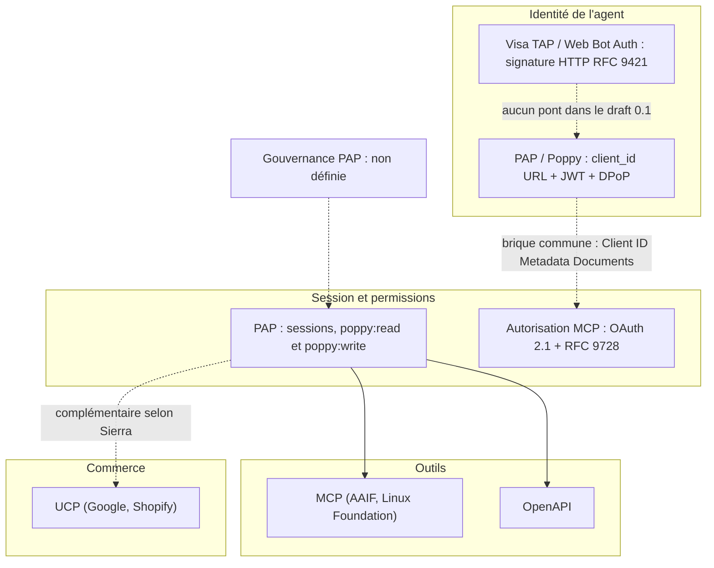
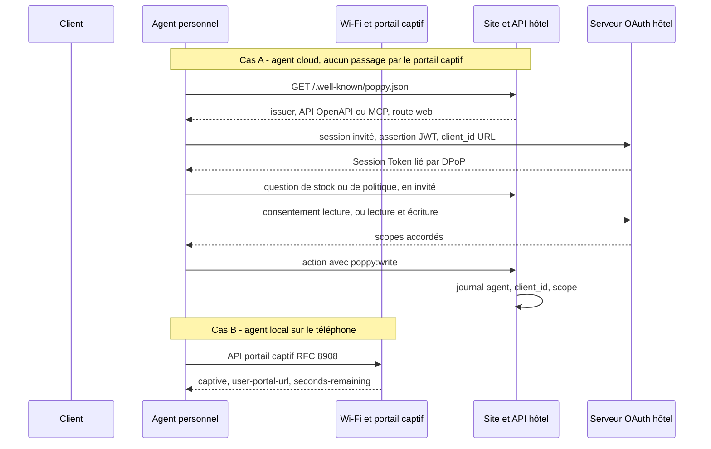

## Douze jours, puis Amazon ferme la porte

Le 20 septembre 2026, Amazon a bloqué Muse, l'assistant personnel lancé par Meta douze jours plus tôt. Selon Implicator, Muse ne se présentait pas comme un agent et semblait capter les identifiants de ses utilisateurs. Meta répond que ces identifiants dorment dans un coffre que l'assistant utilise sans jamais les voir. Entre-temps, l'application avait dépassé les 5 millions de téléchargements, selon une estimation Sensor Tower du 30 septembre relayée par Yellow. Yelp refuse le trafic non humain, sauf licence payante. Delta n'a aucun partenariat permettant à un agent tiers de réserver un vol.

Voilà le décor. D'un côté, des assistants téléchargés par millions qui veulent réserver une chambre, modifier une commande ou résilier un abonnement au nom de leur propriétaire. De l'autre, des enseignes, des hôtels, des banques et des opérateurs qui voient débarquer sur leurs espaces clients un visiteur qu'ils ne savent pas identifier. Leur seul réflexe aujourd'hui : bloquer.

Le 6 octobre, Meta et Sierra, la société de Bret Taylor et Clay Bavor qui vend des agents de service client, ont proposé une sortie : le Personal Agent Protocol (PAP), surnommé « Poppy ». Le 9 octobre, Sierra en a publié un premier draft. Les articles qui parlaient d'« annonce sans spec » avaient raison à leur date ; ils sont périmés. Mais une spec n'est pas un standard. C'est l'écart entre les deux qui décide de ce qu'un DSI doit faire, ou ne pas faire, dans les trois prochains mois.

## Une procuration plutôt qu'un déguisement

Aujourd'hui, un agent qui navigue sur un site marchand, c'est quelqu'un qui se présente au guichet avec les vêtements du client, ses clés et son code de carte. Le guichetier ne voit qu'une silhouette familière. S'il a un doute, il n'a qu'une option : fermer le guichet. C'est ce qu'a fait Amazon avec Muse.

PAP propose de remplacer le déguisement par une procuration. Un document qui dit qui agit, pour le compte de qui, avec quels pouvoirs et jusqu'à quand. Le guichetier ne vérifie plus une ressemblance ; il vérifie un mandat. Sierra résume l'ambition dans un billet du 8 octobre consacré à la détection de voix synthétiques : avec PAP, « the company knows it's an agent and who it's acting for ».

Le draft 0.1, mis à jour le 9 octobre et publié sous licence Apache 2.0, traduit cette procuration en quatre briques. Presque toutes sont empruntées à l'existant, à commencer par OAuth, le protocole de délégation d'accès qui se cache derrière chaque bouton « Se connecter avec… ». C'est plutôt une bonne nouvelle.

**Le panneau d'accueil.** L'entreprise publie sur son domaine un fichier `/.well-known/poppy.json`. Il indique où se trouve son serveur d'autorisation, quelles API elle expose et comment ouvrir une session navigateur. Les API sont décrites en OpenAPI ou via MCP, le Model Context Protocol que les agents utilisent déjà pour appeler des outils. Trois routes, au choix de l'entreprise : le site web, l'API, ou son propre agent conversationnel.

**La carte d'identité de l'agent.** Le `client_id` n'est pas un identifiant opaque mais une URL HTTPS qui pointe vers un document décrivant l'agent. C'est la même brique que celle retenue par la spécification d'autorisation de MCP. L'agent prouve son identité en signant une assertion avec sa clé privée (méthode `private_key_jwt`, RFC 7523). Listes d'autorisation ou de blocage, révocation, limitation de débit : tout est permis à l'entreprise, mais le processus d'inscription préalable reste explicitement hors périmètre.

**Le jeton qui ne se prête pas.** La session repose sur un jeton de courte durée lié par DPoP (Demonstrating Proof-of-Possession, RFC 9449). Traduction : un jeton volé ne sert à rien sans la clé qui va avec. Seule exception, l'accès via MCP, où un jeton classique reste toléré mais cantonné à un seul serveur. Un second jeton, de longue durée, joue le rôle de jeton de rafraîchissement.

**Les pouvoirs.** Deux scopes réservés, `poppy:read` et `poppy:write`, complétés par des scopes métier que l'entreprise déclare elle-même. Détail qui compte, d'après le guide : l'écriture n'inclut pas la lecture. Les erreurs sont normalisées (`insufficient_scope`, `sign_in_required`), ce qui permet de démarrer petit et de demander plus de droits au moment d'agir.

Pour obtenir ces pouvoirs, le draft prévoit plusieurs chemins. L'agent peut démarrer en invité, sans compte. Il peut faire connecter le client par le flux OAuth classique, durci par PKCE (la parade contre l'interception du code d'autorisation), ou par le flux « device » qu'on connaît sur les TV connectées. Et il existe un quatrième chemin, hors OAuth, baptisé « mediated sign-in » : l'agent poste lui-même les identifiants du client à l'entreprise. Gardez-le en tête.

Sur la route « agent », les deux agents dialoguent en REST et en flux SSE (Server-Sent Events), avec transfert possible vers un humain. Une extension `operations` fait approuver par l'utilisateur les termes exacts et rend les reprises idempotentes. Pas de double réservation parce que la connexion a hoqueté.

*Le fichier poppy.json sert de panneau d'accueil : il dit à l'agent où frapper, et avec quel jeton se présenter.*

## Une spec publique, un arbitre absent

Le draft est honnête sur son statut. Le site prévient que « every part of it can still change » (page open topics) et que les entreprises de ses exemples sont fictives. Il liste aussi ses « open topics », renvoyés à plus tard : paiements, notifications push, pièces jointes. Les paiements figuraient pourtant parmi les extensions envisagées dans l'annonce du 6 octobre.

Ce qui manque est plus structurant. Aucun dépôt public n'est lié depuis le site. L'implémentation de référence est promise « over the next month ». Surtout, la gouvernance n'est décrite nulle part.

Meta affirme qu'« aucun acteur ne le possède », compare l'ambition aux standards de l'e-mail et évoque un groupe de travail entre partenaires. Mais aucun organisme, aucune règle de vote, aucun processus de contribution n'est publié. Une licence Apache 2.0 dit ce que vous avez le droit de faire du texte. Elle ne dit pas qui écrira la version suivante. D'où les guillemets quand j'écris « standard » : PAP est aujourd'hui le draft d'un consortium piloté par Meta et Sierra, sans tiers neutre.

Côté soutiens, la photo bouge vite et appelle à la prudence. Les listes du 6 octobre ne concordent pas : Sierra cite notamment Genesys, Instinct, Rocket, Shopify, Stripe et Walmart ; Meta mentionne NiCE et Decagon, mais pas Instinct. Le 9 octobre, Sierra annonce 35 « design partners » supplémentaires, parmi lesquels OpenAI, Visa, Mastercard, Cloudflare, Okta, 1Password, PayPal, Adyen, Comcast, Hertz, Bank of America et BBVA.

Nuance importante : dans la formulation de Sierra, un design partner participe à la conception et donne son avis. Il ne s'engage pas à implémenter. OpenAI est donc dans la salle de conception, pas dans la file des adoptants. Implicator rappelle au passage que Bret Taylor préside aussi le conseil d'administration d'OpenAI. Mon analyse : un design partner aussi proche du promoteur ne vaut pas encore signal de marché.

Trois absences se remarquent. Anthropic, Google et Amazon n'apparaissent dans aucune des listes publiées les 6 et 9 octobre. C'est une absence de mention, pas un refus documenté.

Dernier point, relevé par CMSWire le 6 octobre : Sierra, Decagon, Genesys et NiCE vendent tous des agents d'entreprise. Or l'une des trois routes de PAP fait précisément dialoguer l'agent du client avec celui de l'entreprise. Les promoteurs du « standard » sont donc aussi vendeurs sur le marché qu'il ouvre. Pas disqualifiant. Mais c'est une raison de plus d'exiger une gouvernance.

## D'accord sur la serrure, pas sur la carte d'identité

On a beaucoup lu que PAP ajoutait un protocole de plus à une pile encombrée. C'est vrai à moitié. Deux questions sont à séparer : comment l'agent obtient-il des droits, et comment prouve-t-il qui il est ?

Sur les droits, la convergence est réelle. MCP a été confié le 9 décembre 2025 à l'Agentic AI Foundation, hébergée par la Linux Foundation, avec AWS, Anthropic, Google, Microsoft et OpenAI parmi ses membres fondateurs. Son draft d'autorisation repose sur OAuth 2.1 et recommande les Client ID Metadata Documents. C'est exactement le mécanisme d'identifiant-URL repris par PAP.

Les deux textes partagent la même grammaire : métadonnées publiées à des adresses connues (RFC 9728 côté MCP, RFC 8414 côté PAP), jetons cantonnés à une ressource, demande de droits supplémentaires quand une action l'exige. Conclusion pratique : une entreprise qui a correctement sécurisé ses serveurs MCP a déjà fait une bonne partie du chemin.

Côté commerce, UCP (Universal Commerce Protocol), publié par Google et Shopify le 11 janvier 2026, couvre l'acte d'achat. Son conseil technique s'est élargi le 24 avril à Amazon, Meta, Microsoft, Salesforce et Stripe : Amazon et Meta siégeaient donc à la même table cinq mois avant l'affaire Muse. Une capability de réservation hôtelière (`dev.ucp.lodging.booking`) y est en draft depuis le 25 septembre. Sierra qualifie PAP de « complementary » : UCP pour le shopping, PAP pour l'identité, la permission et toute autre tâche.

Sur l'identité, en revanche, deux familles coexistent. PAP s'appuie sur un jeton signé et lié par DPoP. Le Trusted Agent Protocol (TAP) de Visa, lui, signe chaque requête HTTP selon la RFC 9421 et se dit « aligned with web-bot-auth ». Il ajoute un nonce (valeur à usage unique), une tolérance de 8 minutes et des clés publiées par Visa ; aucune licence n'y est indiquée, il relève des conditions produit de Visa.

Le draft PAP ne mentionne ni Web Bot Auth ni les signatures HTTP génériques. Zéro occurrence. Pendant ce temps, Stripe et Shopify figurent dans UCP et dans TAP, d'après TNW, tandis que Visa et Mastercard sont désormais design partners de PAP. Les mêmes acteurs parient sur plusieurs chevaux.

Qui tranchera ? Pas l'IETF, pour l'instant. Son groupe de travail Web Bot Auth couvre bien les agents d'IA agissant pour le compte d'utilisateurs. Mais il exclut de son périmètre les API HTTP, les échanges d'agent à agent et l'authentification de l'utilisateur final, soit l'essentiel de ce que fait PAP. Ses jalons de 2026 (30 avril, 31 août) sont passés sans qu'aucun document adopté ne figure sur sa page. Quant au draft « OAuth on-behalf-of for AI agents », il a expiré le 27 février 2026 sans adoption. Aujourd'hui, personne n'arbitre.

*Convergence sur la couche OAuth, divergence sur l'identité d'agent, gouvernance absente : la carte des protocoles au 10 octobre 2026.*

## Le Wi-Fi n'est pas sur le chemin, et c'est une bonne nouvelle

_Cette section relève de mon analyse : ni Meta ni Sierra ne parlent de réseau d'accès._

Premier réflexe d'un opérateur Wi-Fi : est-ce que ça passe par chez nous ? Très peu. PAP, c'est du HTTPS entre l'agent et le domaine de l'entreprise. Un agent hébergé dans le cloud ne passe jamais derrière le portail captif de l'hôtel. Il réserve depuis un datacenter, pas depuis la chambre 412.

Un agent qui tourne localement sur le téléphone du client, lui, y passe. Et pour lui, la bonne interface existe depuis septembre 2020 : l'API de portail captif de la RFC 8908. Un document JSON (`application/captive+json`) indique si l'appareil est captif (`captive`), où se trouve la page de connexion (`user-portal-url`) et combien de temps il reste (`seconds-remaining`). Un agent qui gratte la page HTML du portail pour deviner quoi cliquer reproduit, à l'échelle du réseau, l'erreur de Muse.

Il faut donc distinguer deux surfaces. Le réseau d'abord : portail captif, authentification unique (SSO) pour se connecter au Wi-Fi. PAP ne le touche pas. Les services web et les API ensuite : réservation, fidélité, support, espace de gestion du compte Wi-Fi. C'est là que PAP frappe.

Sur cette seconde surface, un opérateur comme Wifirst peut lui-même devenir « l'entreprise » au sens de PAP. L'espace où un résident gère son abonnement, le support, les API d'intégration avec les logiciels de gestion hôtelière (PMS, Property Management System) ou les CRM : autant de portes où un agent personnel finira par frapper. Le pivot sera alors le serveur d'autorisation, pas le réseau.

Concrètement : publier des métadonnées RFC 8414, distinguer lecture et écriture, gérer DPoP (le guide prévoit une passerelle si le serveur existant ne sait pas émettre ces jetons), afficher un consentement lisible. Aucun point d'accès n'est concerné.

Même logique pour le support : selon Sierra, cité par CMSWire, un agent personnel qui échoue sur un site se rabat sur le téléphone ou le chat. Et pour l'hôtellerie, le partage des rôles se dessine : UCP pour réserver la chambre, PAP pour savoir qui agit et avec quels droits.

Notez enfin qu'aucun hôtelier ni opérateur Wi-Fi spécialisé dans l'hébergement ne figure parmi les partenaires annoncés. Le sujet se décide pour l'instant sans nous. Notre vraie question, en cas de litige, sera de répondre à : quel agent a fait quoi, pour quel client, avec quel scope ?

*Deux surfaces distinctes : PAP vit entre l'agent et le domaine de l'entreprise ; le portail captif ne concerne que l'agent qui tourne sur le terminal du client.*

## Trois chantiers pour les 90 prochains jours

Ces recommandations sont les miennes. Elles rejoignent Constellation Research (Larry Dignan, 7 octobre), qui voit dans PAP une spec précoce, susceptible d'évoluer aussi vite que MCP, et conseille de privilégier visibilité et contrôle. Elles rejoignent aussi Rajesh Beri, analyste indépendant : exposer d'abord des API protégées par OAuth, traiter PAP comme un « thin adapter ». Beri écrivait avant le draft et déconseillait de coder du spécifique PAP sans licence publiée. La licence existe désormais ; la gouvernance manque toujours. Le conseil tient.

**1. Inventorier et découper les droits.** Listez chaque API et chaque serveur MCP exposé à des tiers, avec ses scopes actuels. Puis séparez trois niveaux : lecture, écriture, irréversible (résiliation, paiement, annulation). Le draft ne connaît que lecture et écriture, mais il autorise des scopes métier : c'est là que doit se loger l'irréversible. Une matrice de permissions bâtie ce trimestre servira, quel que soit le protocole gagnant.

**2. Tenir un registre d'agents et des journaux hors de portée.** Le guide PAP recommande de lister, dans les paramètres du compte, chaque agent connecté (nom, domaine, scopes, dernière utilisation) avec un bouton de déconnexion. Il recommande aussi de conserver au moins 30 jours les événements de conversation et les opérations finales. Jamais de jetons ni de codes dans les logs : en-têtes `Authorization`, `DPoP` et `Cookie` masqués. J'ajoute une exigence : ces journaux vivent hors de l'hôte qui exécute les actions. Un journal stocké sur la machine qu'il surveille ne prouve rien le jour où elle est compromise.

*Le registre d'agents est le vrai livrable : quel agent, pour quel client, avec quelle clé, et quand.*

**3. Revoir le portail de connexion et le SSO.** La page de consentement doit afficher le nom, le logo et le domaine du `client_id` : c'est la signature au bas de la procuration. PKCE en mode `S256` uniquement. Une notification par e-mail à chaque connexion d'agent. Un cache anti-rejeu DPoP partagé entre serveurs, faute de quoi une preuve rejouée sur une autre instance peut passer.

Et un œil particulier sur le « mediated sign-in ». Un chemin où des agents postent des identifiants en masse ressemble trait pour trait à du credential stuffing, ce test automatisé de mots de passe volés. Le guide demande d'ailleurs un rate limit et une réponse `failed` uniforme. C'est le type de crainte attribuée à Amazon dans l'affaire Muse, même si rien n'indique que Muse empruntera ce chemin. Du design de SSO, pas du réseau.

## Ma position : passer les gaines, pas poser les prises

Quand on rénove un bâtiment sans savoir quels équipements viendront, on passe les gaines et on attend pour les prises. C'est exactement l'attitude que je recommande face à PAP.

PAP est la tentative la plus sérieuse à ce jour pour remplacer le déguisement par une procuration. Ses choix techniques sont ceux que j'aurais faits : OAuth plutôt qu'un mécanisme maison, jetons liés à une clé, identifiant d'agent vérifiable, consentement explicite. Mais un draft 0.1 sans dépôt, sans implémentation de référence et sans arbitre reste un signal à anticiper. Pas un « standard » à câbler tel quel.

Les gaines, c'est la couche commune : inventaire d'API, scopes, registre d'agents, journaux. Elle vaut pour PAP, pour MCP, pour UCP, pour TAP. Chaque protocole devient ensuite un adaptateur fin posé dessus. Si PAP l'emporte, l'adaptateur est un chantier court. S'il s'enlise, vous n'avez rien perdu.

Ce qui me fera passer de « suivre » à « implémenter » :

- un dépôt public et l'implémentation de référence promise d'ici un mois ;
- un organisme de gouvernance nommé, avec des règles de contribution publiées ;
- un premier agent hors Meta et une première entreprise hors clientèle Sierra en production ;
- une position publique d'Anthropic, de Google et d'Amazon ;
- un pont explicite, ou un choix assumé, entre jetons DPoP et signatures HTTP à la Web Bot Auth.

*Identité, session, outils, commerce : les pièces existent, elles ne s'emboîtent pas encore.*

Muse a été bloqué, selon Implicator, parce qu'il avançait masqué. La prochaine génération d'agents arrivera avec une procuration en poche. Reste à savoir qui rédige le modèle du formulaire. Pour l'instant, la réponse tient en deux noms, et c'est précisément le problème.

---

_Vues personnelles, pas position Wifirst._

## Sources

1. Sierra, annonce du Personal Agent Protocol (6 octobre 2026) : https://sierra.ai/blog/introducing-personal-agent-protocol
2. Meta Business, annonce côté entreprises (6 octobre 2026) : https://www.facebook.com/business/news/a-new-way-for-businesses-and-personal-agents-to-work-together
3. Sierra, « Sharing a draft of PAP » (9 octobre 2026) : https://sierra.ai/blog/poppy
4. Personal Agent Protocol, draft 0.1 : spec, guides, extensions, open topics (9 octobre 2026) : https://personalagentprotocol.org/docs/spec
5. Sierra, billet sur la détection de voix d'IA et fleming-1 (8 octobre 2026) : https://sierra.ai/blog/caller-id-in-the-age-of-agents
6. CMSWire, Genesys rejoint Sierra et Meta (6 octobre 2026) : https://www.cmswire.com/contact-center/genesys-joins-sierra-meta-on-open-standard-for-personal-ai-agents-01/
7. TNW, Sierra et Meta lancent PAP (6 octobre 2026) : https://thenextweb.com/news/personal-agent-protocol-sierra-meta
8. Techzine, présentation de PAP (7 octobre 2026) : https://www.techzine.eu/news/applications/144823/personal-agent-protocol-introduced-visibility-into-what-ai-agents-do/
9. Constellation Research, Larry Dignan (7 octobre 2026) : https://www.constellationr.com/insights/news/meta-sierra-pitch-personal-agent-protocol-govern-how-personal-ai-agents-deal-business
10. Implicator (6 octobre 2026) : https://www.implicator.ai/meta-sierra-personal-agent-protocol/
11. Rajesh Beri, analyse indépendante (date non vérifiée) : https://www.beri.net/article/meta-sierra-personal-agent-protocol-oauth-guest-read-write-access-vs-ucp-acp-trusted-agent-protocol-retail-banks
12. UCP Checker, PAP et UCP (octobre 2026) : https://ucpchecker.com/blog/personal-agent-protocol-meta-sierra-ucp
13. Yellow.com, Meta Muse et blocages de sites (octobre 2026) : https://yellow.com/news/meta-muse-5m-downloads-websites-blocking
14. Model Context Protocol, spécification d'autorisation (draft, consultée le 10 octobre 2026) : https://modelcontextprotocol.io/specification/draft/basic/authorization
15. Linux Foundation, formation de l'Agentic AI Foundation (9 décembre 2025) : https://www.linuxfoundation.org/press/linux-foundation-announces-the-formation-of-the-agentic-ai-foundation
16. UCP, annonces (jusqu'au 25 septembre 2026) : https://ucp.dev/documentation/announcements/
17. Visa Developer, Trusted Agent Protocol specifications : https://developer.visa.com/capabilities/trusted-agent-protocol/trusted-agent-protocol-specifications
18. IETF, groupe de travail Web Bot Auth : https://datatracker.ietf.org/group/webbotauth/about/
19. IETF, draft « OAuth on-behalf-of for AI agents » -02 (expiré le 27 février 2026) : https://datatracker.ietf.org/doc/html/draft-oauth-ai-agents-on-behalf-of-user-02
20. RFC 8908, Captive Portal API (septembre 2020) : https://www.rfc-editor.org/rfc/rfc8908.html
