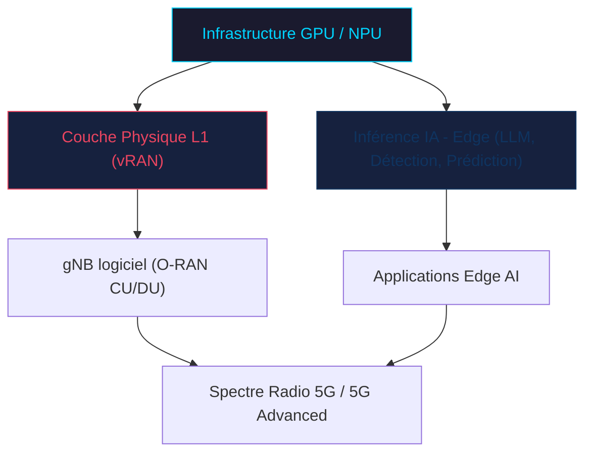
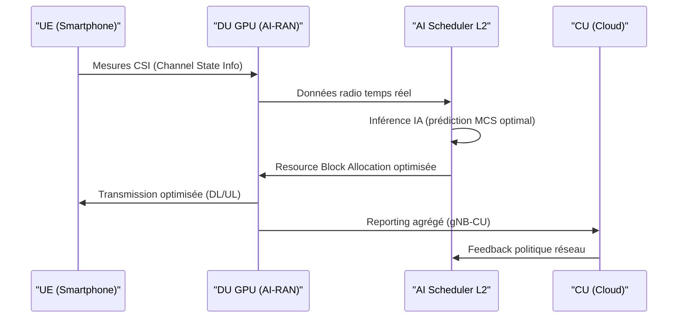

## Quand le GPU prend les commandes du réseau radio : l'AI-RAN Alliance redéfinit la 5G et prépare la 6G

*Le data center et le réseau radio fusionnent dans l'architecture AI-RAN — une révolution en cours au MWC 2026.*

Depuis plusieurs années, les opérateurs télécoms cherchent à sortir du modèle ASIC propriétaire pour virtualiser leurs réseaux radio. L'Open RAN a ouvert la voie, mais une nouvelle révolution est en marche : l'**AI-RAN** (Artificial Intelligence Radio Access Network). Cette semaine au MWC 2026 à Barcelone, plus de 20 démos industrielles ont démontré que l'idée n'est plus un concept de laboratoire — c'est une réalité commerciale imminente.

L'enjeu est majeur pour des opérateurs comme Wifirst : mieux exploiter le spectre radio, réduire les coûts d'énergie, et préparer l'infrastructure qui supportera la 6G d'ici 2030.

---

### Du ASIC au GPU : une mutation fondamentale de l'infrastructure radio

Pendant des décennies, les équipements radio (eNodeB en 4G, gNB en 5G) reposaient sur des **processeurs spécialisés (ASICs)** conçus spécifiquement pour les algorithmes de traitement du signal. Ces puces sont extrêmement performantes pour les tâches définies, mais rigides : chaque évolution de standard (5G, 5G Advanced, 6G) impose des cycles matériels coûteux et longs.

L'AI-RAN renverse ce paradigme en déplaçant les fonctions radio vers des **GPU de datacenter**. Concrètement, les traitements de couche physique (Layer 1) — démodulation, codage canal, MIMO massif — sont exécutés sur des GPU NVIDIA de dernière génération (architecture Blackwell), aux côtés des inférences IA. La même infrastructure calcul sert donc à la fois le RAN et les applications d'intelligence artificielle déployées en edge.

Ce modèle n'est possible que parce que les GPU modernes offrent une puissance de calcul brute suffisante pour tenir les latences temps-réel exigées par la norme 3GPP (< 1 ms pour la couche physique en New Radio).

*Schéma 1 — L'infrastructure GPU unifie le traitement RAN (L1) et les inférences IA sur la même plateforme matérielle.*

---

### NVIDIA AI Aerial : le socle technique de l'AI-RAN

Au cœur de l'écosystème AI-RAN se trouve le framework **NVIDIA AI Aerial**, qui fournit une pile logicielle complète pour exécuter la 5G NR sur GPU. Cette suite repose sur plusieurs composants clés :

- **cuVNF** (*CUDA-accelerated Virtual Network Functions*) : accélération GPU des fonctions L1/L2 du réseau radio, permettant d'atteindre les débits et latences 5G NR sur des serveurs génériques.
- **AERIAL CUDA-Accelerated RAN** : librairies CUDA spécialisées pour le traitement OFDM, la détection MIMO, le décodage LDPC et turbo — toutes les opérations massivement parallélisables qui étaient jusqu'ici l'apanage des ASIC.
- **AERIAL AI** : couche IA intégrée fournissant des algorithmes d'optimisation L1/L2 basés sur l'apprentissage automatique — notamment pour l'**efficacité spectrale** (Modulation and Coding Scheme adaptatif) et la **gestion d'interférences**.

Au MWC 2026, la plateforme de référence mise en avant est l'**NVIDIA Aerial RAN Computer Pro**, équipée de GPU **RTX PRO Blackwell** et de processeurs Grace (ARM). Cette architecture "inline" permet un traitement GPU sans passer par le CPU pour les fonctions critiques L1, réduisant drastiquement la latence de traitement.

Les benchmarks annoncés par NVIDIA et ses partenaires indiquent une amélioration de l'efficacité spectrale de **20 à 40%** par rapport à des déploiements vRAN classiques, grâce aux algorithmes d'optimisation IA intégrés au scheduler L2.

*Illustration conceptuelle de la convergence GPU ↔ antenne radio dans l'architecture AI-RAN.*

---

### L'AI-RAN Alliance : un écosystème industriel qui prend forme

L'AI-RAN n'est pas un projet NVIDIA en solo. L'**AI-RAN Alliance**, fondée en 2024, regroupe désormais plus de 50 membres industriels. Au MWC 2026, les annonces se sont multipliées :

**Nokia** a présenté son approche **anyRAN**, permettant aux opérateurs de déployer AI-RAN aussi bien en environnement Cloud RAN (O-RAN compliant) qu'en RAN propriétaire, avec une migration progressive. Le partenariat Nokia × NVIDIA × QCT (QuantaEdge EGN77C-2U) illustre l'écosystème serveurs-logiciels-intégrateurs qui se structure autour de la plateforme Aerial.

**Ericsson** pousse son concept de "RAN Compute", exploitant les GPU dans ses Radio System pour exécuter des fonctions IA au plus près de l'antenne. L'objectif affiché est de réduire la consommation énergétique des sites radio de **15 à 25%** grâce au Dynamic Spectrum Sharing piloté par IA.

**SoftBank** (Japon) est l'opérateur le plus avancé en déploiement réel : son réseau nationwide integre déjà NVIDIA AI Aerial sur une partie de son infrastructure 5G SA, avec des expérimentations de beam management IA sur des milliers de sites.

**AWS, Microsoft Azure et Google Cloud** participent également à l'Alliance, positionnant leurs plateformes cloud comme substrate d'orchestration pour les fonctions CU (Central Unit) de l'O-RAN, tandis que le DU (Distributed Unit) reste hébergé near-edge sur des serveurs GPU locaux.

---

### Dynamic Spectrum Sharing et optimisation IA : les cas d'usage concrets

L'un des apports les plus tangibles de l'AI-RAN réside dans l'**optimisation dynamique du spectre**. Les réseaux radio actuels souffrent d'une rigidité dans l'allocation des ressources : les plannings radio (Resource Blocks en 5G NR) sont définis par des règles statiques ou des heuristiques simples.

L'IA embarquée dans le scheduler L2 de l'AI-RAN permet des optimisations en temps réel :

1. **Dynamic Spectrum Sharing (DSS) IA** : co-existence 4G/5G sur les mêmes fréquences avec allocation adaptative par slot — les modèles de prédiction anticipent la charge réseau pour basculer dynamiquement entre les deux standards.
2. **Beam Management intelligent** : dans les déploiements massive MIMO (64T64R et plus), les algorithmes de prédiction de mobilité des UE permettent de préformer les faisceaux avant même le handover, réduisant la latence perçue.
3. **Détection d'anomalies et self-healing** : les modèles IA détectent les dégradations de performance (pilot contamination, interférence inter-cellule) et ajustent automatiquement les paramètres radio sans intervention humaine.

*Schéma 2 — Boucle d'optimisation IA en temps réel : le scheduler L2 exploite les mesures CSI pour adapter dynamiquement l'allocation des ressources radio.*

---

### AI-RAN comme fondation de la 6G

Si l'AI-RAN répond à des besoins opérationnels immédiats en 5G, son ambition à long terme est d'être le **substrat natif de la 6G**. Les groupes de standardisation 3GPP (Release 20+) et ITU-R intègrent désormais l'IA comme composante architecturale intrinsèque du réseau radio, et non plus comme une couche de management externe.

Trois piliers définissent cette vision :

**1. Integrated Sensing and Communication (ISAC)** : La 6G unifie dans le même signal radio les fonctions de communication et de détection (radar). Cette co-optimisation est computationnellement impossible sur ASIC — elle nécessite la flexibilité des GPU et des modèles IA pour gérer les interférences entre les deux fonctions.

**2. AI-Native Air Interface** : Le canal radio 6G (7-15 GHz, voire THz) est tellement complexe que la modélisation analytique atteint ses limites. Les décodeurs basés sur des réseaux de neurones (Neural Network-based Decoders) surpassent déjà les décodeurs LDPC classiques dans certaines conditions de canal.

**3. Zero-Touch Network** : NTT Docomo a déployé en février 2026 un agent IA basé sur AWS Bedrock AgentCore analysant en temps réel plus d'un million d'équipements réseau. L'objectif déclaré : "zéro intervention humaine" sur la gestion quotidienne du réseau radio d'ici 2028.

*La convergence entre infrastructure datacenter et réseau radio est au cœur de la vision 6G AI-native.*

---

### Défis : latence, coût et interopérabilité O-RAN

L'enthousiasme est réel, mais les défis techniques restent conséquents :

**Latence L1** : Les spécifications 3GPP imposent une latence de traitement L1 inférieure à **1 ms** en mode TDD (Time Division Duplex). Les GPU, malgré leur puissance brute, introduisent des latences liées aux transferts mémoire CPU-GPU (via PCIe ou NVLink). Les architectures "inline" (Grace-Blackwell) visent à éliminer ce goulot d'étranglement, mais les validations à grande échelle restent à confirmer.

**Coût matériel** : Un serveur GPU NVIDIA Blackwell coûte entre **30 000 et 80 000 €** selon la configuration, contre 5 000 à 15 000 € pour un serveur vRAN x86 classique. Le ROI se justifie par la mutualisation AI+RAN et les gains d'efficacité spectrale, mais les petits opérateurs font face à une barrière d'entrée significative.

**Interopérabilité O-RAN** : L'écosystème O-RAN (Alliance ORAN) impose des interfaces standardisées (F1, E2, O1). Les implémentations AI-RAN actuelles sont souvent "ORAN-compliant" au niveau CU/DU, mais les optimisations IA propriétaires de chaque vendeur peuvent créer des silos — exactement ce que l'Open RAN cherchait à éviter.

---

### Perspectives pour les opérateurs B2B

Pour des opérateurs comme Wifirst, dont le cœur de métier est la connectivité entreprise (Wi-Fi géré, LAN, accès 4G/5G privé), l'AI-RAN ouvre plusieurs perspectives concrètes :

- **Réseau 5G privé géré** : les plateformes AI-RAN de type MSI/NVIDIA permettent de déployer des gNB logiciels sur des serveurs standards en datacenter client, avec une gestion centralisée — un modèle parfaitement aligné avec les offres managed services B2B.
- **Optimisation des densités Wi-Fi/5G** : L'IA de scheduler peut gérer la coexistence Wi-Fi 6E/7 et 5G NR sur les mêmes sites, en arbitrant dynamiquement entre les technologies selon les profils d'usage (latence critique vs. haut débit).
- **Économies d'énergie** : Les engagements contractuels de réduction carbone des grands comptes poussent les opérateurs à démontrer une empreinte réseau mesurable. Les 15-25% d'économie énergétique annoncés par Ericsson sont un argument commercial direct.

---

### Conclusion

L'AI-RAN Alliance cristallise au MWC 2026 un consensus industriel fort : l'avenir du réseau radio est logiciel, GPU-accéléré et intrinsèquement IA. NVIDIA AI Aerial fournit le socle technique, Nokia, Ericsson et SoftBank valident l'approche en production, et les hyperscalers structurent le marché de l'orchestration.

Pour les opérateurs télécom, la question n'est plus "si" mais "quand et comment" migrer vers cette architecture. Les déploiements 5G Advanced (Release 18-19) constituent la fenêtre d'opportunité pour expérimenter, avant que la 6G ne rende cette architecture incontournable.

Statistiquement, y'a toujours moyen — et cette fois, c'est le GPU qui tient les tranches de temps radio.

---

**Références**
- NVIDIA Blog — "Software-Defined AI-RAN Is the Next Wireless Generation" (mars 2026)
- Nokia Newsroom — "Nokia accelerates AI-RAN momentum, MWC26" (mars 2026)
- Forbes — "Telecom's AI Shift: Carriers Are Building Agentic Networks For The 6G Era" (fév. 2026)
- MSI Press Release — "MSI Unveils Scalable AI-RAN with NVIDIA AI Aerial Solutions, MWC 2026"
- 3GPP TR 38.843 — Study on AI/ML for NR Air Interface
