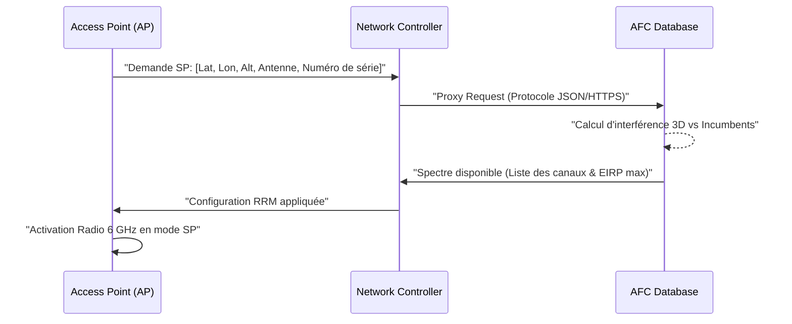
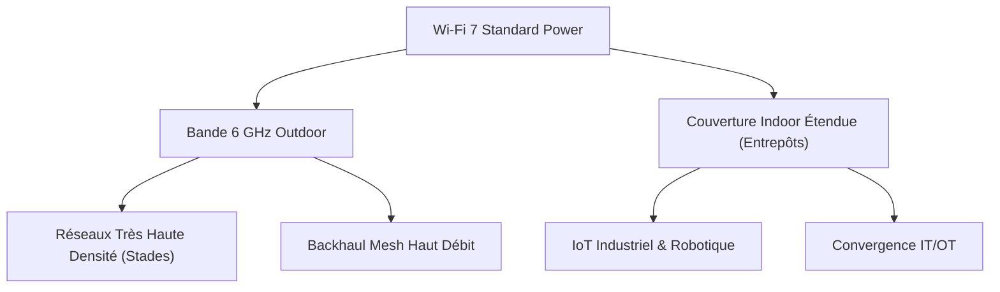

## L'avènement du Standard Power : Libérer le vrai potentiel du 6 GHz

Depuis l'introduction du Wi-Fi 6E, la bande des 6 GHz a été perçue comme un eldorado spectral : 1200 MHz de spectre vierge (en Amérique du Nord, ou 500 MHz en Europe), permettant des canaux de 160 ou 320 MHz, sans interférences legacy. Mais cette promesse était jusqu'à présent bridée par une contrainte réglementaire majeure : le mode **Low Power Indoor (LPI)**. 

Le LPI, bien qu'idéal pour densifier un open space, nous interdisait d'exploiter la pleine puissance des équipements, notamment pour les déploiements exigeant une forte couverture ou pour des environnements extérieurs. En 2026, l'arrivée à maturité du Wi-Fi 7 avec la certification **Standard Power (SP)** change radicalement la donne. Le SP permet de multiplier la puissance d'émission de manière significative, mais cela vient avec une contrepartie technique stricte : l'implémentation de l'**Automated Frequency Coordination (AFC)** pour protéger les utilisateurs historiques de la bande 6 GHz.

En tant qu'opérateur B2B, nous avons pu analyser les premiers retours terrain de cette transition. Voici un bilan technique sans concession de ce que le passage du LPI au SP implique réellement pour nos infrastructures.

---

## LPI vs Standard Power : Les gains de portée mesurés sur le terrain

Le principal grief à l'encontre du LPI a toujours été son Power Spectral Density (PSD) contraint. Fixé réglementairement pour éviter les interférences avec les liaisons micro-ondes existantes, le PSD du LPI s'effondre littéralement quand on élargit la largeur de canal. 

Concrètement, en LPI, doubler la largeur de canal (par exemple, passer de 80 à 160 MHz) divise mécaniquement le rapport signal-bruit (SNR) par deux, réduisant la portée utile des modulations d'ordre supérieur comme le 4096-QAM propre au Wi-Fi 7.

Le mode Standard Power lève ce verrou. En SP, la puissance isotrope rayonnée équivalente (EIRP) maximale peut atteindre 36 dBm, contre généralement 18 à 24 dBm pour le LPI selon les canaux et régions (la valeur exacte dépendant de la régulation locale).

**Ce que nous constatons sur nos sites pilotes en 2026 :**
- **Couverture étendue :** Une augmentation de la portée utile d'environ +30% à +40% en intérieur pour franchir les cloisons (atténuation matérielle) avec un SNR maintenu au-dessus du seuil requis pour le 1024-QAM.
- **Canaux larges viables :** Là où un canal de 320 MHz en LPI était inexploitable à plus de 10 mètres de la borne à cause de la contrainte PSD, le Standard Power permet de saturer un client MLO (Multi-Link Operation) à des distances bien plus respectables (20 à 25 mètres en Line-of-Sight).
- **Roaming optimisé :** La zone de recouvrement entre les APs s'améliore, réduisant le "ping-pong" des clients 6 GHz qui avaient tendance à basculer trop vite sur la bande 5 GHz à cause de la dégradation rapide du signal LPI.

---

## Sous le capot de l'AFC : Gérer les "Incumbents"

Si nous avons le droit d'émettre plus fort, c'est uniquement parce que nous pouvons garantir que nous ne perturberons pas les *incumbents* (les services fixes, tels que les faisceaux hertziens de backhaul mobile ou les liaisons satellite, qui utilisent déjà le spectre 6 GHz). C'est le rôle du système AFC.

L'AFC est une base de données cloud centralisée et certifiée (gérée par des acteurs comme la Wi-Fi Alliance, Google, ou Federated Wireless) qui calcule en temps réel, selon la position 3D d'un point d'accès, les canaux et les puissances autorisées.

### Le workflow d'une requête AFC

La dynamique est stricte : un point d'accès *n'a pas le droit* d'émettre en 6 GHz SP tant qu'il n'a pas reçu le feu vert de l'AFC.

*Le flux de provisionnement standard : l'Access Point déclare sa position exacte avant toute émission.*

La précision de la géolocalisation est le nerf de la guerre. Le point d'accès doit fournir ses coordonnées GPS (latitude, longitude, mais aussi l'incertitude géographique) et sa hauteur d'installation. Si l'AP ne dispose pas de récepteur GNSS intégré ou perd le signal (typiquement en indoor profond), des méthodes de *Secure Indoor Geolocation* ou de configuration manuelle certifiée doivent prendre le relai, complexifiant le déploiement opérationnel.

---

## Défis d'intégration dans les contrôleurs réseau (WLC)

L'introduction de l'AFC n'est pas qu'une simple requête d'API de temps à autre. Elle modifie fondamentalement le cycle de vie de la gestion du spectre radio (RRM - Radio Resource Management).

**1. Latence et Disponibilité**
La résolution d'une requête AFC introduit une dépendance forte vis-à-vis du cloud. Qu'arrive-t-il si la liaison WAN tombe ? L'AP dispose d'une "période de grâce" (généralement 24 heures). S'il ne peut pas renouveler son autorisation auprès de l'AFC dans ce délai, il est obligé par la réglementation de couper sa radio 6 GHz en mode SP. C'est un *failover* critique. Les équipementiers doivent alors basculer silencieusement l'AP en mode LPI pour maintenir le service, ce qui entraîne une réduction brutale de la couverture et une potentielle déconnexion de clients en bordure de cellule.

**2. Le passage à l'échelle (Scale)**
Dans une infrastructure B2B gérant des dizaines de milliers d'APs, un redémarrage massif suite à une coupure de courant déclenche une tempête de requêtes AFC simultanées. Les contrôleurs doivent implémenter des mécanismes de *jitter* et de cache intelligent pour ne pas se faire blacklister ou surcharger l'API du fournisseur AFC. 

**3. Complexité algorithmique du RRM**
Le système RRM du contrôleur doit désormais gérer une topologie dynamique où la puissance maximale autorisée peut changer chaque jour. Si un nouvel équipement fixe (incumbent) est installé dans la région, l'AFC peut soudainement interdire l'usage du canal 37. Le WLC doit réagir sans créer de chaos RF (effet domino de changement de canaux sur tout l'étage).

---

## Perspectives pour le B2B : Campus, Stades et Smart Cities

L'impact réel de l'AFC et du Standard Power dépasse l'amélioration du Wi-Fi de bureau. C'est le retour en force du Wi-Fi dans les espaces où il était jusqu'ici mis en difficulté par la 5G privée.

**1. L'Outdoor libéré**
Le 6 GHz LPI est strictement interdit en extérieur. Le Standard Power lève cette interdiction. Pour les environnements B2B massifs (stades, parcs d'attractions, campus universitaires), nous pouvons enfin déployer du Wi-Fi 7 avec des canaux de 160 MHz à l'air libre. L'apport du MLO (Multi-Link Operation) combiné à l'absence totale de DFS (Dynamic Frequency Selection, qui rend les canaux 5 GHz instables près des aéroports) offre une latence ultra-faible, déterministe, rivalisant sérieusement avec les réseaux cellulaires privés.

**2. Le retour en grâce des déploiements industriels**
Dans les grands entrepôts logistiques haut de plafond, le LPI atteignait ses limites : la perte de signal entre l'AP fixé au plafond à 12 mètres et le terminal cariste au sol rendait la bande 6 GHz inefficace. Le SP permet de repousser cette limite, offrant la densité du Wi-Fi 7 (gestion de la latence via les Puncturing Preamble) couplée à la pénétration RF du Standard Power.

*Les nouveaux cas d'usage débloqués par le mode Standard Power dans le secteur B2B.*

---

## Conclusion : Une maturité réseau à anticiper pour les DSI

Le Wi-Fi 7 Standard Power n'est pas juste un "bouton magique" pour augmenter la puissance d'émission. C'est un changement de paradigme complet. L'accès au spectre devient un privilège accordé dynamiquement (via l'AFC) et non plus un droit statique.

Pour les ingénieurs réseau, cela signifie de nouveaux outils de troubleshooting, une gestion fine de la localisation des APs, et l'intégration d'une dimension temporelle dans le design RF (la couverture d'aujourd'hui n'est pas garantie demain si un incumbent apparaît). 

Chez Wifirst, nous adaptons d'ores et déjà nos modèles prédictifs et nos algorithmes d'intelligence artificielle pour ingérer ces contraintes AFC en amont, dès la phase d'audit. La puissance est là, la bande passante aussi. Le défi de 2026 est avant tout un défi d'orchestration logicielle.
