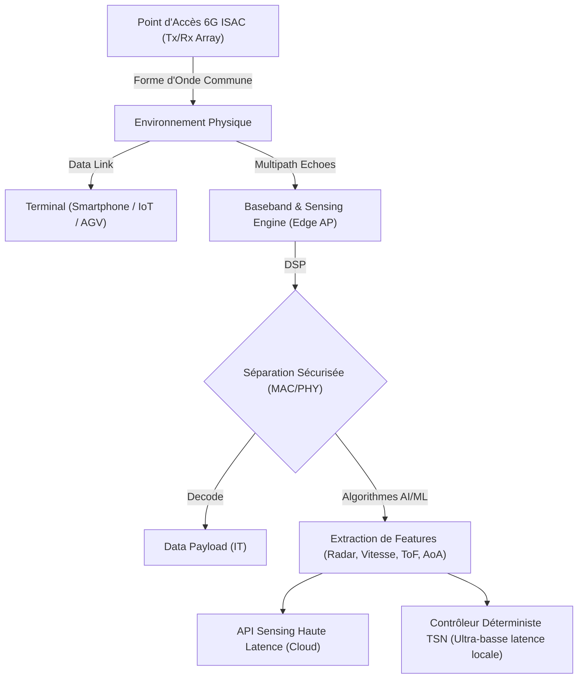

# 6G et ISAC : Quand l'infrastructure réseau se transforme en radar spatial

L'évolution des réseaux sans fil s'est jusqu'ici résumée à une course aux armements prévisible et assez linéaire : toujours plus de bande passante, toujours moins de latence, une densité de connexions accrue. La 5G a globalement fait le job sur l'ultra-fiabilité (URLLC) et la connectivité massive des objets (mMTC), même si certaines promesses industrielles peinent encore à trouver un modèle économique scalable. Mais la 6G, dont les standards commencent à se cristalliser fermement en cette année 2026, s'apprête à introduire un changement de paradigme fondamental. Nous passons littéralement d'une infrastructure réseau de transport de données (qui achemine des paquets de A à B) à un réseau doué de perception, capable de comprendre son environnement physique de manière autonome.

C'est la promesse de l'ISAC (*Integrated Sensing and Communication*, souvent appelé JCAS pour *Joint Communication and Sensing*). En termes clairs : votre réseau de communication devient simultanément un réseau de radars tridimensionnels en ultra-haute définition. 

Pour nous, architectes réseau, opérateurs d'infrastructures B2B et décideurs IT, c'est une révolution tectonique qui va bien au-delà d'un simple upgrade de capacité spectrale. C'est la fusion absolue de l'IT (Information Technology) et de l'OT (Operational Technology), non plus par le biais d'applications superposées, mais de façon inhérente au niveau de la couche physique (PHY) et de l'onde radio.

## ISAC et spectre THz/cmWave : La physique derrière la convergence

Historiquement, les systèmes de communication (Wi-Fi, 4G/5G) et les systèmes de détection (Radar, LiDAR, sonar) opéraient dans des silos spectraux et matériels étanches. Ils utilisaient des bandes de fréquences distinctes, des baies d'antennes incompatibles et des processeurs de traitement de signal hermétiques, ce qui générait une superposition coûteuse et un gaspillage massif des ressources radioélectriques. 

L'ISAC brise ces silos en imposant une convergence radicale : utiliser exactement la même forme d'onde (*Joint Waveform Design*), le même spectre radio et le même hardware d'émission/réception (transceivers) pour transmettre de la data et pour "voir" l'espace environnant.

Comment est-ce physiquement possible ? La clé se trouve dans la montée vertigineuse en fréquence imposée par l'architecture 6G.

En exploitant massivement les bandes centimétriques hautes (cmWave, 7-24 GHz) et en défrichant pour la première fois les ondes sub-térahertz (sub-THz, 100-300 GHz), nous manipulons des longueurs d'onde extrêmement courtes. À ces fréquences extrêmes, l'onde radio perd fortement en capacité de pénétration des obstacles, mais gagne des propriétés quasi-optiques en retour : elle devient hautement directive et s'avère hyper-sensible à la moindre réflexion environnementale.

Lorsqu'un point d'accès 6G (ou un gNodeB) émet un faisceau ultra-ciblé via des matrices *Massive MIMO* vers un terminal, une partie inévitable du signal rebondit sur les murs, le mobilier, les machines et les corps humains. Jusqu'à présent, ce rebond, le fameux *multipath* (trajets multiples), était l'ennemi juré des ingénieurs télécoms, un bruit parasite que les algorithmes devaient annuler ou contourner. Avec l'ISAC, ce bruit devient la source d'information primaire. 

En captant ces échos de manière synchrone et en analysant de multiples variables — le délai de retour (*Time of Flight* ou ToF), le décalage Doppler généré par les objets en mouvement, et l'angle d'arrivée des signaux (AoA) — le réseau génère en temps réel un nuage de points (*point cloud*) tridimensionnel de l'espace. Avec l'immense largeur de bande disponible dans le spectre sub-THz, la résolution spatiale atteint le centimètre, voire le millimètre.

## L'impact architectural : Le choc du Edge et de l'accélération matérielle

Pour les ingénieurs réseau, le défi d'implémentation est proprement vertigineux. L'ISAC exige une puissance de calcul massive au plus près des antennes, ce qui provoque une refonte structurelle du concept de *Compute Continuum*.

Le traitement du signal conjoint impose de réconcilier des exigences mathématiques diamétralement opposées au sein du DSP (*Digital Signal Processor*). D'un côté, la fonction de communication requiert de l'entropie, de l'aléatoire et de la variabilité pour maximiser le débit de données (pensez aux modulations d'amplitude en quadrature très denses comme le QAM-4096). De l'autre, la fonction radar a un besoin critique de prévisibilité, de patterns répétitifs et de signaux déterministes (comme les impulsions modulées en fréquence, ou *chirps* FMCW) pour calculer sans ambiguïté les distances et la vélocité. 

*Architecture logique simplifiée d'un nœud réseau ISAC 6G, illustrant la séparation des flux de données de communication et du traitement sémantique radar en périphérie de réseau.*

Le multiplexage de ces domaines transforme l'AP 6G en un nœud de *Deep Edge Computing* surpuissant, bien loin du simple point d'accès Wi-Fi ou L2/L3 d'antan. 

Se pose alors la question critique du hardware silicium. Les CPU x86 classiques ou les architectures ARM multicœurs standard explosent à la fois leur budget thermique et les plafonds de latence sur ces traitements lourds. Actuellement, le débat industriel se joue entre l'usage des FPGA (*Field-Programmable Gate Arrays*) de nouvelle génération et la conception d'ASIC dédiés. Les FPGA offrent la flexibilité vitale nécessaire aujourd'hui, alors que les standards 6G sont encore mouvants, permettant de mettre à jour la logique de traitement matériel à la volée. Mais à l'échelle d'un déploiement dense, leur consommation électrique limite le modèle. L'avenir appartient aux SoC (*System-on-Chip*) hybrides : un cœur ASIC durci et ultra-optimisé pour le traitement radiofréquence de base, flanqué de puces NPU (*Neural Processing Units*) massivement parallèles dédiées à l'inférence de modèles d'IA pour analyser, nettoyer et labelliser la signature radar des échos bruts en temps réel.

Ensuite vient l'impératif de la latence déterministe. Pour que la donnée de perception puisse servir à un cas d'usage critique (comme l'évitement d'une collision par un robot industriel), la boucle complète — émission radar, réception de l'écho, inférence IA, prise de décision — doit se clore en moins de deux millisecondes, avec un *jitter* (gigue) quasi-nul. C'est l'intégration native des concepts du TSN (*Time-Sensitive Networking*) directement sur la liaison radio. Il est inenvisageable d'envoyer le flux radar brut vers un data center distant : le traitement massif s'opère dans l'équipement de plafond, pour ne remonter vers le système centralisé que des métadonnées sémantiques très légères, par exemple : "Objet en mouvement, type=Humain, vélocité=1.2 m/s, position=(X, Y, Z), trajectoire prédictive=vecteur_V".

## Cas d'usage concrets : Santé, Logistique et Smart Building

L'intégration native de la capacité radar dans l'infrastructure de communication détruit littéralement le TCO (*Total Cost of Ownership*) des réseaux de capteurs IoT spécialisés (*overlay networks*). Cette consolidation permet de démocratiser des applications de nouvelle génération.

**1. Santé connectée : Hôpitaux et EHPAD**
C'est le domaine où l'impact sociétal de l'ISAC est le plus profond. La surveillance de patients âgés ou à risque en milieu hospitalier et en EHPAD repose aujourd'hui soit sur de la vidéosurveillance intrusive, souvent incompatible avec l'intimité et le RGPD, soit sur des dispositifs portables (*wearables*, bracelets) que les patients oublient souvent, retirent ou rejettent.
L'ISAC change radicalement l'approche : la résolution millimétrique du spectre sub-THz permet le *vital sign monitoring* à distance. Les micro-réflexions de l'onde radio sur la cage thoracique du patient permettent à la borne réseau de mesurer sa fréquence respiratoire et ses battements cardiaques avec une précision d'ordre clinique, au travers des vêtements et de la literie.
De plus, le réseau cartographie l'attitude du corps en 3D de manière non visuelle. Il peut détecter de manière autonome une chute soudaine — caractérisée par une altération violente du nuage de points et de l'axe vertical — et remonter une alerte vitale immédiate au personnel infirmier. Tout ceci est intrinsèquement *Privacy-Preserving* : aucune image optique n'est générée, ce qui garantit la stricte intimité de la chambre tout en assurant une sécurité vitale H24.

**2. Industrie 4.0 et Logistique : AGV et Robots Autonomes**
Dans un entrepôt logistique, le déploiement massif de véhicules guidés automatiquement (AGV) et de robots mobiles autonomes (AMR) se heurte à un mur de complexité matérielle. Actuellement, chaque machine doit embarquer ses propres systèmes LiDAR à 360° ultra-coûteux pour se repérer (SLAM) et éviter les collisions.
Avec une infrastructure réseau privée 6G ISAC, l'intelligence spatiale est retournée. C'est le bâtiment lui-même qui, via son réseau sans fil, cartographie la position exacte de tous les éléments dynamiques en temps réel (chariots, palettes, opérateurs humains). Le réseau crée un modèle numérique global (*digital twin*) et envoie des commandes de navigation de haute précision en ultra-basse latence aux AGV. Les robots peuvent ainsi être drastiquement simplifiés, allégés de leurs capteurs optiques lourds. Le gain se traduit en autonomie de batterie prolongée, en réduction de coût unitaire, et en sécurité accrue puisque le réseau offre une vue omnisciente au-delà des angles morts (le capteur réseau situé au plafond voit ce qu'il y a derrière le croisement avant le robot).

**3. Bâtiment Intelligent (Smart Building)**
Oubliez les capteurs thermiques PIR peu réactifs ou la triangulation d'adresses MAC Wi-Fi hasardeuse. La connectivité 6G génère une télémétrie spatiale micrométrique des flux d'occupation d'un building d'entreprise, capable de comptabiliser précisément les personnes, même celles ne possédant pas de smartphone ou d'appareil connecté. Cette vision radar nourrit directement le système de gestion technique du bâtiment (BMS) pour adapter le chauffage, la ventilation, la climatisation (HVAC) et l'éclairage en fonction de l'occupation physique stricte de chaque espace, réduisant dramatiquement le bilan carbone de l'immobilier d'entreprise.

## Cybersécurité : L'émergence des vulnérabilités de perception

Ajouter le sens de la vue au réseau par défaut crée de nouvelles dimensions vertigineuses en matière de cybersécurité. En fusionnant l'acheminement des données informatiques avec la topologie physique réelle, la surface d'attaque est démultipliée. En tant que directeur technologique, c'est ce point qui exige le plus de vigilance.

Le risque majeur numéro un est le *Sensing Eavesdropping* (que l'on pourrait traduire par espionnage par écho radar) ou l'écoute clandestine de l'environnement. Si une borne compromise est capable de générer la cartographie 3D d'une salle de crise au siège d'une entreprise, de localiser les individus, et potentiellement d'analyser les micro-vibrations d'une fenêtre ou d'un écran, alors un attaquant réseau a instantanément accès à un jumeau numérique physique de la zone confinée. Plus grave encore, la nature passive de certains radars fait qu'un adversaire externe pourrait capter les ondes d'environnement rebondissant sur la cible sans même s'introduire logiquement sur le réseau 6G.

Le second vecteur de menace réside dans la manipulation des signaux, notamment le *Signal Spoofing* et le brouillage (*Jamming*). Reprenons le cas logistique avec nos AGV naviguant à haute vitesse grâce aux métadonnées ISAC. Si un acteur malveillant injecte de faux échos radio dans l'environnement, il peut virtuellement matérialiser des "cibles fantômes" (*ghost targets*) sur la cartographie du réseau, provoquant le freinage d'urgence injustifié de la flotte logistique et la paralysie de la production. À l'inverse, l'attaquant pourrait annuler l'empreinte radar d'un obstacle bien réel, masquant sa présence aux systèmes de l'AGV pour provoquer volontairement une collision industrielle destructrice. On ne hacke plus seulement des bases de données : on corrompt la proprioception des systèmes physiques lourds.

La mitigation de ces menaces requiert des architectures Zero Trust étendues aux propriétés électromagnétiques. La sécurité devra opérer au plus bas niveau : la couche de sécurité physique (*Physical Layer Security*, PLS). Il est crucial d'implémenter un *Sensing Encryption* robuste, où la forme d'onde radar est dynamiquement obfusquée par des séquences cryptographiques pseudo-aléatoires pour empêcher une oreille externe de déduire les distances via l'écho de retour. Par ailleurs, les techniques de profilage radio (*RF Fingerprinting*) pilotées par l'intelligence artificielle seront obligatoires pour vérifier mathématiquement l'intégrité et la provenance matérielle de chaque signal reçu, rendant le *spoofing* pratiquement impossible. 

## Standardisation et réglementation : Où en est-on ?

La viabilité de cette révolution technologique repose sur un écosystème globalement interopérable. Les organismes de standardisation internationaux en font leur priorité absolue depuis quelques années.

L'Union Internationale des Télécommunications (ITU-R) a dressé la charpente conceptuelle de cette évolution. Sa vision stratégique IMT-2030 (l'appellation légale de la technologie 6G) a intégré officiellement le "Sensing and Communication intégré" comme l'un des piliers fondamentaux de la prochaine décennie, marquant un tournant historique aux côtés des traditionnels piliers de débit (eMBB) et de latence (URLLC).

Le cœur du réacteur, c'est le 3GPP, l'organisation chargée des spécifications techniques de l'industrie mobile. Le très anticipé *Release 19*, dont les travaux préparatoires se sont achevés récemment, a lancé de vastes *Study Items* (phases d'études) dédiés au JCAS, visant à qualifier mathématiquement les modèles de canaux et à identifier les compromis inévitables entre performances data et précision radar. 
Cependant, l'événement majeur, c'est le **Release 20** du 3GPP. En cours d'élaboration intense en cette année 2026, il porte la lourde responsabilité de figer les spécifications normatives prescriptives : comment on alloue les ressources fréquentielles entre un paquet IP et un scan radar, la structure exacte des trames unifiées, et les protocoles d'interfaces permettant à différentes applications tierces d'exploiter la télémétrie via des API standardisées.

La bataille se joue également sur le front réglementaire avec l'allocation des fréquences. Une précision radar de qualité requiert d'immenses blocs de spectre contigus. Les bandes visées par l'ISAC, spécifiquement les cmWave hautes et le sub-THz, sont déjà partiellement occupées. Les Conférences Mondiales des Radiocommunications (WRC) doivent composer avec la coexistence délicate entre les réseaux civils 6G et les systèmes historiques de radar militaire, la radioastronomie scientifique spatiale ou l'exploration satellitaire de la terre (EESS). Pour débloquer ces spectres critiques, les régulateurs européens travaillent sur de nouveaux modèles de partage dynamique des fréquences, régulés en temps réel par des IA centrales pour prévenir toute interférence active.

## Conclusion

L'intégration conjointe de la communication et de la détection a largement dépassé le stade du prototype de laboratoire. À l'heure où l'écosystème semi-conducteur affine ses premiers chipsets ASIC/NPU hybrides et que le 3GPP finalise les cadres de son Release 20, nous sommes à la veille de la plus grande mutation philosophique de l'infrastructure réseau depuis le passage à la commutation de paquets.

Chez Wifirst, notre approche n'est pas d'attendre passivement une nouvelle norme radio. Nous concevons le réseau B2B comme le système nerveux central et l'infrastructure perceptive primordiale des entreprises. En intégrant les capacités de l'ISAC dans la conception de nos futures architectures Wi-Fi et Cellulaires Privées convergées, nous offrons une proposition de valeur radicalement nouvelle. Demain, l'excellence d'un réseau opérateur ne se mesurera pas uniquement à son débit en fibre optique ou en radio, mais à sa capacité intime à comprendre l'espace, la dynamique et la sécurité du monde physique qui l'entoure pour automatiser les processus critiques de nos clients industriels, logistiques ou sanitaires.