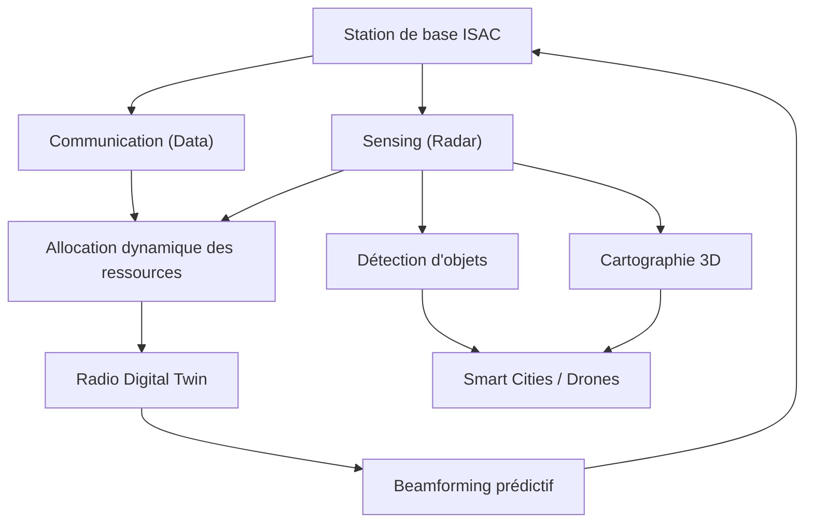
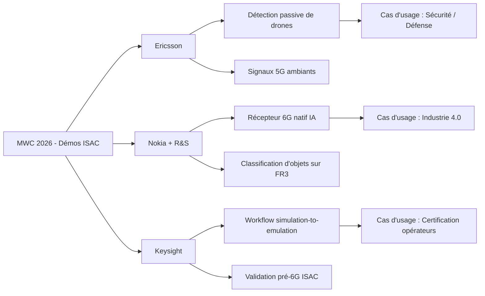

Au MWC 2026, une démonstration a captivé l'attention de toute l'industrie télécom : une station de base 5G qui détecte des drones en vol, sans radar dédié, en utilisant uniquement les réflexions de ses propres signaux de communication. Ce n'est pas de la science-fiction. C'est l'**ISAC** — Integrated Sensing and Communication — et c'est probablement la rupture technologique la plus sous-estimée de la décennie.

Pour les opérateurs réseau comme Wifirst, cette convergence entre radar et télécommunications ouvre un nouveau chapitre : celui du **réseau comme sixième sens**, capable non seulement de transporter des données, mais de percevoir son environnement physique.

## Du tuyau de données au capteur distribué

Historiquement, radar et télécommunications ont évolué dans des univers parallèles. Le radar, né pendant la Seconde Guerre mondiale, émet des ondes pour détecter la distance, la vitesse et la direction d'objets. Les télécoms, elles, transportent de l'information entre émetteur et récepteur. Deux usages distincts, deux infrastructures séparées, deux spectres réservés.

L'ISAC brise cette séparation en fusionnant les deux fonctions sur la **même infrastructure matérielle**. Une antenne massive MIMO (Multiple Input Multiple Output) qui servait exclusivement à acheminer du trafic data peut désormais simultanément scanner son environnement, détecter des objets en mouvement et cartographier l'espace en trois dimensions.

Cette convergence repose sur trois piliers :

- **Hardware Sharing** : les mêmes transceivers, les mêmes antennes et les mêmes amplificateurs servent aux deux fonctions. Pas de duplication d'infrastructure, donc des coûts maîtrisés.
- **Resource Sharing dynamique** : le système alloue en temps réel les ressources (temps, fréquence, faisceaux spatiaux) entre communication et sensing, en fonction des priorités.
- **Radio Digital Twin** : chaque objet détecté par le sensing alimente un jumeau numérique du réseau, permettant un beamforming prédictif qui améliore à son tour la qualité de communication.

*Architecture fonctionnelle d'un système ISAC : la boucle vertueuse entre communication, sensing et optimisation réseau via le Radio Digital Twin.*

Le résultat est un cercle vertueux : le sensing améliore la communication (en anticipant les obstacles et les mouvements), et la communication fournit le canal nécessaire au sensing. Le réseau ne se contente plus de connecter : il comprend.

## OTFS vs OFDM : la bataille des formes d'onde

Pour que le sensing fonctionne à l'échelle télécom, il faut une forme d'onde adaptée. L'OFDM (Orthogonal Frequency Division Multiplexing), pilier de la 4G et de la 5G, montre ici ses limites.

L'OFDM travaille dans le domaine **temps-fréquence**. C'est excellent pour la communication : chaque sous-porteuse transporte un symbole, le tout est robuste face aux trajets multiples (multipath). Mais pour le sensing, il faut extraire deux informations fondamentales : le **délai** (distance à l'objet) et le **décalage Doppler** (vitesse de l'objet). En OFDM, cette extraction est indirecte et perd en précision quand l'objet se déplace rapidement.

C'est là qu'entre en jeu l'**OTFS** (Orthogonal Time Frequency Space). Cette forme d'onde, encore expérimentale mais vigoureusement poussée par le département de la Défense américain et plusieurs acteurs du 3GPP, travaille dans le domaine **délai-Doppler** — le langage natif du radar.

Les avantages sont significatifs :

- **Extraction directe** : en OTFS, délai et Doppler sont les axes naturels de la modulation. L'information de sensing est directement lisible, sans transformation complexe.
- **Robustesse à la mobilité** : à haute fréquence (mmWave, Sub-THz) ou haute vitesse (drones à 150 km/h, TGV à 300 km/h), l'OFDM souffre d'interférences entre porteuses causées par le décalage Doppler. L'OTFS transforme ce décalage en gain de diversité.
- **PAPR réduit** : le rapport puissance crête / puissance moyenne est plus favorable, ce qui améliore l'efficacité énergétique des stations de base.

*Représentation conceptuelle du domaine délai-Doppler utilisé par l'OTFS, où chaque point du plan encode simultanément la distance et la vitesse d'un objet détecté.*

L'OTFS n'est pas encore standardisée pour la 5G-Advanced (Release 19), mais les études en cours au sein du 3GPP laissent entrevoir son adoption pour les premières spécifications 6G. Pour les opérateurs, il est crucial de suivre cette évolution : le choix de la forme d'onde déterminera les capacités de sensing du réseau.

## Le spectre ISAC : FR3, la « Golden Band » de la 6G

Le sensing est intimement lié au spectre. Plus la fréquence est élevée, plus la résolution est fine (capacité à distinguer deux objets proches). Plus la bande passante est large, plus la précision en distance augmente. L'ISAC 6G s'appuie sur deux gammes de fréquences complémentaires.

**La bande FR3 (7-24 GHz)**, baptisée « Golden Band » par l'industrie, constitue le socle de l'ISAC cellulaire. Elle offre un compromis idéal :

- **Couverture** : plusieurs centaines de mètres, compatible avec les déploiements macro-cellulaires urbains.
- **Bande passante** : suffisante pour une résolution radar de l'ordre du mètre, adaptée à la détection de véhicules, piétons et drones.
- **Propagation** : meilleure pénétration que le mmWave (28-39 GHz), ce qui la rend utilisable en environnement urbain dense.

Au MWC 2026, Ericsson et Qualcomm ont démontré les performances de la bande cmWave (6-8 GHz), un sous-ensemble de FR3, pour la connectivité et le sensing simultanés. Keysight Technologies a présenté un workflow complet de validation ISAC sur FR3, allant de la simulation à l'émulation en conditions réelles.

**La bande Sub-THz (100-300 GHz)** vise des cas d'usage de précision chirurgicale à courte portée :

- **Résolution centimétrique** : détection de micro-mouvements (gestes, respiration).
- **Imagerie 3D** : cartographie ultra-précise d'environnements indoor pour la logistique ou la santé.
- **Bande passante massive** : plusieurs dizaines de GHz disponibles, permettant des débits de sensing sans précédent.

*Allocation spectrale pour l'ISAC 6G : la bande FR3 assure la couverture macro tandis que le Sub-THz cible les applications de haute précision indoor.*

## MWC 2026 : les démos qui changent la donne

Le MWC 2026 a marqué le passage de l'ISAC du concept académique à la réalité industrielle. Trois démonstrations ont particulièrement retenu l'attention.

**Ericsson : détection de drones sans radar dédié.** Au siège texan d'Ericsson à Plano, une preuve de concept live a démontré la détection et le suivi de drones en vol en utilisant uniquement les signaux 5G existants. Le système exploite les réflexions des ondes de communication ambiantes pour localiser des « dark objects » — des objets non connectés au réseau. Les études sur l'ISAC ont démarré au 3GPP sous la Release 19 et devraient alimenter les premières spécifications 6G, positionnant le sensing comme une capacité native du réseau aux côtés de la communication.

**Nokia et Rohde & Schwarz : récepteur 6G natif IA sur FR3.** La démonstration a mis en avant un récepteur capable d'optimiser conjointement l'estimation de canal pour les données et la classification des objets détectés. L'intelligence artificielle permet de distinguer un humain d'un robot industriel, ouvrant la voie à des applications de sécurité industrielle sans caméra.

**Keysight Technologies : de la simulation à l'émulation ISAC.** Keysight a présenté un workflow de validation complet pour les systèmes ISAC, incluant la simulation de formes d'onde pré-6G sur FR3 et des scénarios de test end-to-end. Pour les équipementiers et les opérateurs, c'est un outil crucial pour accélérer le développement et la certification des futures stations de base ISAC.

*Cartographie des démonstrations ISAC au MWC 2026 : trois approches complémentaires pour transformer le réseau en capteur.*

*Illustration conceptuelle de la détection de drones par ISAC : les signaux de communication réfléchis permettent de localiser et suivre des objets non connectés, sans infrastructure radar dédiée.*

## Cas d'usage B2B et défis à relever

Pour un opérateur B2B comme Wifirst, l'ISAC ouvre des perspectives concrètes dans plusieurs verticaux :

**Smart Buildings et Hospitality.** Imaginez un réseau Wi-Fi ou 5G privé qui, en plus de fournir la connectivité, détecte la présence et le mouvement des occupants sans caméra. Gestion énergétique intelligente (CVC adaptatif), détection d'intrusion, comptage de fréquentation — le tout sans capteur IoT supplémentaire. Le réseau devient la plateforme de sensing par défaut.

**Logistique et Industrie.** Tracking d'actifs en entrepôt ou en usine sans tags RFID ni balises Bluetooth. Le réseau lui-même localise les chariots, les palettes et les opérateurs. Couplé à l'IA de classification (comme la démo Nokia), il distingue un humain d'une machine, renforçant la sécurité industrielle.

**Santé et Senior Living.** Le sensing Sub-THz permet le monitoring de signes vitaux sans contact : fréquence respiratoire, détection de chutes, analyse des patterns de mouvement. Pour les résidences seniors, c'est une alternative non intrusive aux caméras, respectueuse de la dignité des résidents.

Mais l'ISAC n'est pas sans défis :

- **Privacy et régulation.** Un réseau qui « voit » son environnement soulève des questions fondamentales de vie privée. Les régulateurs (CNIL, EDPB) devront définir un cadre clair pour le sensing passif, distinct de la vidéosurveillance.
- **Resource sharing.** L'arbitrage entre communication et sensing n'est pas trivial. Prioriser le sensing peut dégrader la QoS data, et inversement. Des algorithmes d'allocation dynamique basés sur l'IA sont indispensables.
- **Coût computationnel.** Le traitement radar en temps réel sur des antennes massives MIMO demande une puissance de calcul considérable. L'intégration de NPU (Neural Processing Units) dans les stations de base, déjà amorcée par Qualcomm et MediaTek, est un prérequis.
- **Standardisation.** Les études ISAC au 3GPP en sont à la Release 19 (phase d'étude). Les spécifications normatives arriveront avec la Release 20 ou 21, horizon 2028-2029. Le chemin est encore long vers la commercialisation.

## Ce que les opérateurs doivent retenir

L'ISAC n'arrivera pas demain dans les réseaux commerciaux. Les premières spécifications 6G sont attendues autour de 2028-2029, et les déploiements commerciaux vers 2030-2032. Mais le MWC 2026 a envoyé un signal clair : **la convergence radar-télécom est inévitable**.

Pour les opérateurs réseau, la feuille de route est la suivante :

- **Surveiller la bande FR3.** Les allocations spectrales dans la gamme 7-24 GHz définiront les capacités de sensing de demain. Les discussions réglementaires (WRC-27) seront déterminantes.
- **Investir dans l'IA réseau.** L'ISAC sans intelligence artificielle est un radar des années 1940. C'est l'IA qui transforme les échos en informations actionnables (classification, prédiction, optimisation).
- **Anticiper les cas d'usage.** Les opérateurs qui proposeront du « Sensing-as-a-Service » aux entreprises — détection de présence, tracking d'actifs, monitoring environnemental — capteront une valeur considérable sur des marchés aujourd'hui adressés par des solutions IoT fragmentées.
- **Suivre le 3GPP.** Les Release 19 (études) et Release 20 (spécifications) définiront les contours de l'ISAC. Participer aux discussions, même en observateur, est essentiel pour ne pas être pris au dépourvu.

La 6G ne sera pas simplement une « 5G plus rapide ». Ce sera un réseau qui comprend le monde physique. Et pour un opérateur d'infrastructure comme Wifirst, qui déploie des réseaux dans des milliers de sites — hôtels, résidences, campus — la capacité de transformer chaque point d'accès en capteur intelligent est une opportunité stratégique majeure.

Le réseau a longtemps été aveugle à son environnement. Avec l'ISAC, il ouvre les yeux.
