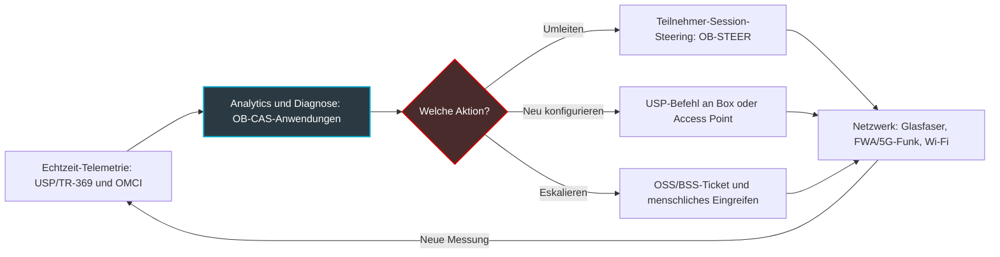
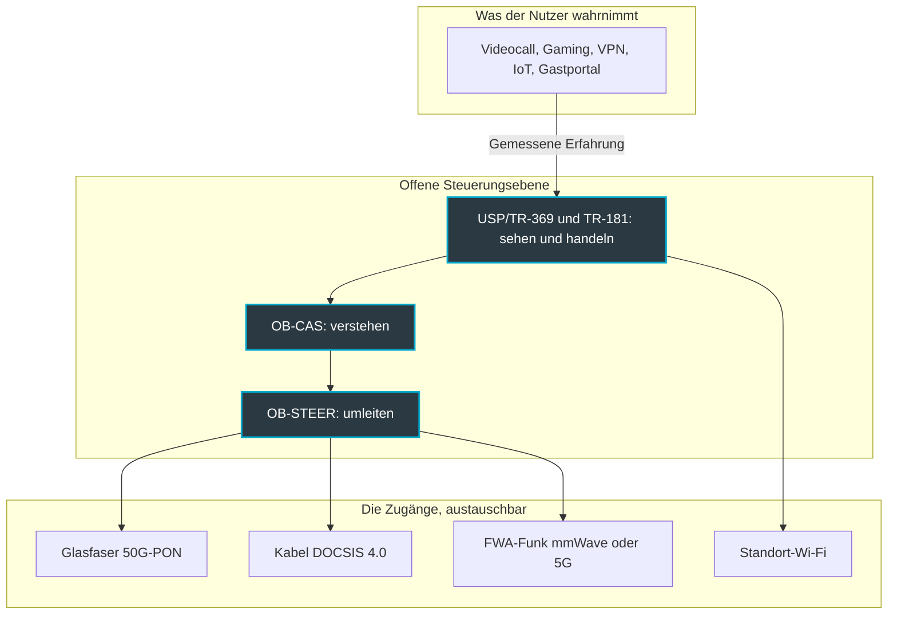

## Das Gigabit garantiert nichts mehr

Ein Hotelgast weiß nicht, ob sein Zimmer per Glasfaser, 5G oder über ein altes Koaxialkabel angebunden ist. Er weiß nur, dass sein Videocall nach Singapur um 23:10 Uhr eingefroren ist. Und dafür macht er in seiner Bewertung das Hotel verantwortlich, nicht den Zugangsanbieter.

Diese Szene bringt das Missverständnis auf den Punkt, von dem die Telekommunikationsbranche fünfzehn Jahre lang gelebt hat. Man hat Megabit verkauft, Megabit gemessen, Verträge in Megabit unterschrieben. Der Endkunde selbst hat nie eine Bandbreite gekauft. Er kauft einen Videocall, der nicht einfriert, einen reibungslosen Check-in, eine Kasse, die funktioniert. Für einen Hotelier, einen Verwalter von Studentenwohnheimen oder eine IT-Leitung, die zweihundert Filialen steuert, ist der Unterschied zwischen beidem längst kein technisches Thema mehr, sondern eine Frage des Umsatzes.

Vom 13. bis 15. Oktober besiegelt das Broadband Forum in Wien diesen Wandel öffentlich. Dieses Konsortium schreibt seit über zwanzig Jahren die Standards für die Fernverwaltung von Boxen und Zugangsnetzen. Wer das Programm seiner sieben Demonstrationen auf der Network X liest, unterstützt von mehr als zwanzig Mitgliedern, erkennt: Der rote Faden ist nicht mehr die Bandbreite. Es ist die Quality of Experience (QoE), und vor allem ihre Automatisierung: messen, diagnostizieren, korrigieren, ohne einen Techniker zu entsenden.

Meine These: Diese Verschiebung verändert die Natur des Wettbewerbs. Die Schlacht verlässt die Leitung und verlagert sich in die Orchestrierung. Auf diesem Feld haben diejenigen, die bereits Ergebnisse statt Megabit verkaufen, einen Vorsprung.

## Drei Bausteine, eine einzige Schleife

Um zu verstehen, was das Forum hier zusammenfügt, denken Sie an eine Navigations-App im Stau.

Millionen Smartphones melden fortlaufend ihre Position und Geschwindigkeit. Ein Server gleicht diese Signale ab, erkennt die Verlangsamung und leitet eine wahrscheinliche Ursache ab. Anschließend rät Ihnen eine Stimme, an der nächsten Ausfahrt die Autobahn zu verlassen. Erfassen, verstehen, umleiten. Genau diese drei Ebenen baut das Broadband Forum für das Zugangsnetz auf, jede mit ihrem eigenen offenen Standard.

### USP/TR-369: die Sensoren und die Stellhebel

Die erste Ebene heißt USP (User Services Platform), standardisiert unter der Referenz TR-369 [10, 12]. Sie ist der Nachfolger von TR-069, dem historischen Protokoll, mit dem ein Betreiber die Boxen seiner Kunden fernkonfiguriert.

Der Unterschied lässt sich in einem Bild fassen. TR-069 ist die Zählerablesung in regelmäßigen Abständen, USP ist der intelligente, kommunizierende Zähler. Die Architektur basiert auf einem Controller-Agent-Paar, das für Echtzeit ausgelegt ist, mit verstärkter Sicherheit. Vor allem stützt sie sich auf ein gemeinsames Datenmodell, TR-181, das eine Box, einen Wi-Fi-Access-Point oder ein vernetztes Gerät auf dieselbe Weise beschreibt.

Konkret kann sich ein USP-Controller für Ereignisse registrieren und wird sofort benachrichtigt, sobald ein Access Point überlastet ist, statt auf die nächste Abfrage zu warten. Das ist die Voraussetzung für alles Weitere. Man automatisiert nicht, was man nur verzögert sieht.

### OB-CAS: das Gehirn, das die Messwerte liest

Die zweite Ebene ist die jüngste. OB-CAS steht für Open Broadband - CloudCO Application Software Development Kit [4]. Vereinfacht gesagt: ein Entwicklungskit zum Schreiben von Anwendungen, die oberhalb des Controllers eines Zugangsnetzes laufen. CloudCO bezeichnet im Vokabular des Forums die Zugangszentrale, neu gedacht als Softwareplattform.

Der Nutzen geht über das Akronym hinaus. OB-CAS stellt über offene APIs die Telemetrie bereit, die dieser Controller sammelt: die der Glasfaserendgeräte über ihren OMCI-Verwaltungskanal und die der über USP gesteuerten Geräte. Ein Drittanbieter kann sie so nutzen, ohne an den Hersteller der Hardware gebunden zu sein [3, 4].

Das Forum hat ein anschauliches Beispiel dokumentiert [3]. Condor Technologies hat eine OB-CAS-Anwendung vorgeführt: eine Netzwerk-Wartungs-Engine, gesteuert von einem großen Sprachmodell (LLM). Sie folgt einer Methode namens *Chain of Evidence* in drei Schritten: beschreiben, diagnostizieren, empfehlen. Der nächste Schritt wird als geplante Weiterentwicklung dargestellt: die autonome Aktionsausführung, also die Anwendung der Korrektur und das Öffnen des Tickets in den Überwachungs- und Abrechnungssystemen (OSS/BSS) ohne menschliches Eingreifen.

### OB-STEER: die Stimme, die Sie zum Spurwechsel bewegt

Die dritte Ebene, OB-STEER (Open Broadband Subscriber Session Steering), stützt sich auf die noch laufende Spezifikation WT-474 [11]. Ihr Ziel: die Sitzung eines Teilnehmers in Echtzeit auf die am besten geeignete Netzwerkressource umzuleiten. Das Forum hat sie im März 2025 im Rahmen von drei neuen Open-Broadband-Projekten gestartet. In der Erzählung dazu ist von einem Wi-Fi die Rede, das sich selbst reparieren kann, nach der Logik wahrnehmen-entscheiden-handeln.

Setzt man alle drei Ebenen zusammen, ergibt sich eine geschlossene Schleife. Die Messung nährt die Diagnose, die Diagnose löst die Aktion aus, die Aktion erzeugt eine neue Messung.

*Vereinfachtes Schema (Lesart des Autors): die geschlossene Schleife, die USP/TR-369, OB-CAS und OB-STEER gemeinsam bilden.*

## Wien 2026: ein Programm, das nicht mehr von Bandbreite spricht

Das Programm im Detail bestätigt den Wandel. Die Demonstrationen finden im VIECON in Wien, Halle B, Stand D25, vom 13. bis 15. Oktober 2026 statt: sieben Demonstrationen mit vielfältigen Anwendungsfällen, unterstützt von mehr als zwanzig Anbietern und Betreibern als Mitgliedern [1].

Parallel dazu bündelt die BASe-Konferenzreihe des Forums vier Sessions am 13. und 14. Oktober auf der Partner Stage [2]. Die Titel lesen sich wie ein Manifest:

- **Beyond Connectivity**: USP/TR-369 als Basis für monetarisierbare Angebote, vom latenzoptimierten Gaming bis zu abgesicherten Netzwerk-Slices für kleine Büros und Homeoffice-Nutzer (SOHO).
- **The Autonomous Edge**: OB-CAS und OB-STEER kombiniert für Zero-Touch-Betrieb, mit zwei sehr konkreten Versprechen. Weniger Betriebskosten und weniger Techniker-Einsätze vor Ort, die berühmten *truck rolls*.
- **Beyond the Bit**: die Konvergenz von Kabel (DOCSIS 4.0), Millimeterwellen-Funk im Festnetzzugang (FWA, Fixed Wireless Access) und Glasfaser 50G-PON unter einer einheitlichen Software-Steuerungsebene, mit der QoE priorisiert gegenüber der reinen Bandbreite.
- Ein **Roundtable der Betreiber** mit Blick auf 2027.

Bei den Referenten mischen sich Ausrüster und Betreiber: Mike Emmendorfer (Calix), Kurt Pynaert (Nokia), Bruno Cornaglia (Vodafone), David Tomalin, CTO von CityFibre, und Paul Arola (Telus) [2]. Meine Einschätzung: Wenn konkurrierende Ausrüster und Betreiber von beiden Seiten des Atlantiks dieselbe Bühne zum selben Thema teilen, ist das kein Zufall der Programmplanung. Das ist eine Agenda.

Die Maschinerie läuft schon vor der Eröffnung. Lincoln Lavoie (Interoperabilitätslabor UNH-IOL), technischer Vorsitzender des Forums, hat die Dreharbeiten der Vorstellungsvideos zu den Demonstrationen betreut. Und ein BASe-Panel, *Service Assurance in a Heterogeneous Network World*, ist bereits für den 30. September angesetzt [9].

*Erfassen, diagnostizieren, korrigieren: die Schleife, die die Demonstrationen in Wien greifbar machen sollen, von der Glasfaser bis zum Wi-Fi.*

Um einschätzen zu können, was tatsächlich gezeigt wird, hilft der Blick auf die Vorgängerveranstaltung in Paris, sofern man die Editionen nicht durcheinanderbringt. Auf der Network X Paris, vom 14. bis 16. Oktober 2025, hatte das Forum acht Demonstrationen präsentiert [5]. Darunter befand sich bereits ein OB-CAS-Baustein zur dynamischen Anpassung von Alarmschwellenwerten. Ein weiterer überwachte die Stromkontinuität von Geräten über USP und TR-181, das sogenannte *lifeline monitoring*. Ein dritter prüfte eine Serviceverpflichtung (SLA) mit der Delta-Q-Metrik (ΔQ, Serie TR-452.x), die auf die Erfahrung ausgelegt ist und nicht auf die Bandbreite.

Meine Lesart: Wien ist kein Ausgangspunkt. Es ist eine zweite Iteration, und daran sollte man es messen. Was hat sich zwischen der Demo eines Alarmschwellenwerts 2025 und dem Versprechen eines autonomen Edge 2026 tatsächlich weiterentwickelt?

## Der letzte Meter entscheidet über alles

Warum diese plötzliche Fixierung auf die Erfahrung? Weil die Glasfaser gewonnen hat, und ihr Sieg das Problem verschoben hat.

In der Praxis ist die Beobachtung konstant. Das ist meine Beobachtung als Betreiber, keine Statistik des Forums. Wenn der Zugang ein Gigabit liefert, ist es fast nie dieser Zugang, der den Videocall einfrieren lässt. Es ist der überlastete Access Point am Ende des Flurs, der überfüllte Funkkanal, die Box im Metallschrank, die App, die nicht weiß, dass sie sich die Antenne mit vierzig Smartphones teilt.

Craig Thomas, CEO des Broadband Forum, sagt nichts anderes. Ende Mai 2026, am Rande der Fiber-Connect-Messe, von Lightwave Online befragt, erklärte er, dass die Migration von TR-069 zu USP die Vorlaufzeit für neue Dienste verkürzt [7]. Sein erklärtes Ziel: die Glasfaser aus ihrem Status als passives Groß-Rohr herauszuholen und an die Anwendungen anzupassen, die Menschen wirklich nutzen wollen. Und er stellt die richtige Frage: die nach der Brücke, die zwischen Wi-Fi und Anwendung zu bauen ist.

Das Forum hatte den Rahmen bereits im April 2025 abgesteckt [6]. Dort beschreibt es ein Automated Intelligence Management (AIM): KI und maschinelles Lernen, um Ereignisse zu erkennen, die die Erfahrung verschlechtern, und daraufhin dynamisches Traffic-Steering auszulösen. Der Geltungsbereich ist durchgängig. Er reicht vom Data Center über den Metro-Edge bis zum Zugangsnetz, zur Box und schließlich zum Endgerät.

Zwei ergänzende Bausteine werden dabei genannt. Zunächst die Wi-Fi-Leistungszertifizierung TR-398, die das reale Verhalten von Funkgeräten prüft. Dann L4S, eine Technologie, die die durch Warteschlangen im Netzwerk verursachte Latenz reduziert. Die eine behandelt den Funk, die andere den Transport: Meiner Einschätzung nach greifen sie gemeinsam die beiden klassischen Ursachen eines ruckelnden Videocalls an.

*Vereinfachte Darstellung (Lesart des Autors): Eine offene Steuerungsebene macht die Zugänge austauschbar, und die Erfahrung wird zum Maßstab.*

Genau das ist der Sinn der Session *Beyond the Bit*. Es spielt keine Rolle, ob die letzte Schleife über Glasfaser, Koax oder Funk läuft, solange die Steuerungsebene einheitlich ist und der Maßstab die Erfahrung wird. Die Leitung wird zur Commodity. Die Steuerung wird zum Produkt.

## Warum der Wi-Fi-Betreiber einen Vorsprung hat

Was folgt, ist meine Analyse, nicht die Position des Forums.

Die Massenmarkt-Betreiber entdecken die QoE gerade erst als ein Produkt, das sie noch erfinden müssen. Für einen Managed-Wi-Fi-Betreiber wie Wifirst ist sie das Produkt seit dem ersten Tag. Ein Hotelier unterschreibt nicht für eine Bandbreite, er unterschreibt dafür, dass das Wi-Fi aus den Kundenbewertungen verschwindet. Eine IT-Leitung mit mehreren Standorten will keine Spitzenbandbreite. Sie will, dass der Videocall der Geschäftsleitung durchhält und das VPN der Filialen nicht abbricht.

Nehmen wir drei Bereiche.

**Die Hotellerie.** Der Gast bewegt sich von der Lobby ins Restaurant und dann ins Zimmer, und seine Sitzung muss ohne Unterbrechung von einem Access Point zum nächsten wechseln. Das Gastportal darf den Check-in nicht zum Hindernislauf machen. Und um 21 Uhr streamen alle gleichzeitig. Eine nützliche geschlossene Schleife besteht hier darin, zu erkennen, dass ein Access Point überlastet ist, und die Last zu verteilen, bevor die negative Bewertung geschrieben wird.

**Studentenwohnheime.** Die Lastspitzen sind hier brutal: Semesterstart, Partys, Online-Prüfungen. Jeder Student bringt einen Lautsprecher, eine Konsole, manchmal einen Drucker mit, der angeschlossen werden muss. Ein gemeinsames Datenmodell wie TR-181, das Box, Access Point und Gerät auf dieselbe Weise beschreibt, macht das Onboarding der Geräte endlich industrialisierbar.

**Unternehmen und Einzelhandel.** Hier wird die QoE Flow für Flow beurteilt: Videocall, VPN, Bezahlterminals, verwaltete IoT-Geräte. Der Zugang ist oft doppelt vorhanden, Glasfaser als Primäranschluss und 4G oder 5G als Backup. Genau das ist das Multi-Access-Szenario von Wien, heruntergebrochen auf die Größenordnung einer Filiale.

*Hotel oder Studentenwohnheim: Der Nutzer bewertet nicht die Bandbreite, sondern die Kontinuität seiner Sitzung von einem Access Point zum nächsten.*

Meine Prognose: In zwei bis drei Jahren werden Ausschreibungen für Managed Services Verpflichtungen verlangen, die in Erfahrung ausgedrückt sind, nicht in garantierter Bandbreite. Man wird von einem Anteil unterbrechungsfreier Videocall-Sitzungen sprechen, von der Zeit bis zur automatischen Wiederherstellung, von der Zahl vermiedener Einsätze. Das verlangt vom Betreiber dreierlei: jedes Glied bis zum Endgerät zu instrumentieren, offene Schnittstellen zu akzeptieren, um von keinem Hersteller abhängig zu sein, und einen gewissen Grad an Automatisierung bei der Behebung zu übernehmen.

Das Paradox ist köstlich. Die Infrastrukturbetreiber haben die Standards, aber nicht die Ergebniskultur. Die Servicebetreiber haben die Ergebniskultur, müssen aber noch die Standards übernehmen. Wer als erstes seinen Rückstand aufholt, wird die Regeln des Marktes bestimmen.

## Drei Gründe, kühlen Kopf zu bewahren

Die Richtung teile ich. Dem Zeitplan traue ich nicht.

**Erster Punkt: die Adoptionszahl.** Laut dem Bericht *Future of the Connected Home* des Broadband Forum, veröffentlicht am 9. Oktober 2025 auf Basis von 116 befragten Betreibern in 32 Ländern, setzen 88 % der Breitbandanbieter USP bereits ein oder planen dies innerhalb von 6 bis 18 Monaten [8]. Die Zahl beeindruckt. Man muss sie jedoch für das nehmen, was sie ist: eine Selbstauskunfts-Umfrage, durchgeführt von der Organisation, die den Standard selbst herausgibt. Planen ist nicht dasselbe wie einsetzen. Und vom Veröffentlichungsdatum an läuft das angegebene Fenster grob von April 2026 bis April 2027: Wir stecken mittendrin. Wien ist der richtige Moment, um nach realen Bestandszahlen zu fragen, nicht nach Absichten.

**Zweiter Punkt: die Reife von OB-STEER.** Die öffentliche Dokumentation bleibt dünn. Soweit mir bekannt, ist über die Ankündigung vom März 2025 und den Verweis auf WT-474 hinaus kein detailliertes technisches Dokument verfügbar. In der Nomenklatur des Forums ist ein WT (Working Text) ein noch in Arbeit befindlicher Text, kein veröffentlichter technischer Bericht. Das Wi-Fi, das sich selbst reparieren soll, gehört derzeit eher zur Veranstaltungsrhetorik als zur Spezifikation.

**Dritter Punkt: der Zero-Touch-Betrieb.** Das Condor-Beispiel ist ehrlich. Die Engine beschreibt, diagnostiziert und empfiehlt; die autonome Aktionsausführung bleibt eine geplante Weiterentwicklung. Diese Vorsicht hat einen Grund. Wenn ein Sprachmodell eine Konfiguration auf Tausende von Access Points ausrollt, stellen sich Fragen, die die Demonstrationen selten behandeln. Wer validiert? Wie macht man es rückgängig? Wer trägt die vertragliche Verantwortung, wenn die Korrektur den Dienst verschlechtert, statt ihn wiederherzustellen?

*Vor der autonomen Aktionsausführung bleibt die realistische Stufe die unterstützte Diagnose: Die Maschine schlägt vor, der Ingenieur bestätigt.*

Meine Position: Die geschlossene Schleife wird in Etappen kommen. Zuerst die reversiblen Aktionen mit geringem Wirkungsradius, wie das Wechseln eines Funkkanals, das Neustarten einer Schnittstelle oder das Umschalten auf die Backup-Leitung. Danach, deutlich später, die Entscheidungen, die einen gesamten Bestand betreffen. Ein LLM, das allein Tausende von Produktionsstandorten steuert, sehe ich nicht für 2027, egal wie die Sessions heißen.

## Worauf ich in Wien achten werde

Das Broadband Forum liegt in der Sache richtig. Die Bandbreite ist zur Commodity geworden, die Erfahrung bleibt ein Handwerk, und dieses Handwerk erhält gerade eine gemeinsame Grammatik: USP zum Sehen und Handeln, OB-CAS zum Verstehen, OB-STEER zum Umleiten.

Vier Signale werden mir zeigen, ob Wien einen echten Wendepunkt markiert oder nur eine schöne Vitrine ist.

1. **Eine wirklich geschlossene Schleife.** Werden die Demonstrationen eine automatische Aktion zeigen, vorher und nachher gemessen, an Geräten mehrerer Hersteller? Oder nur ein weiteres Dashboard?
2. **Bestandszahlen.** Werden Vodafone, Telus und CityFibre tatsächlich verwaltete USP-Gerätemengen nennen, über bloße Absichten hinaus?
3. **OB-STEER auf dem Tisch.** Wird das Projekt vom Working Text zu einer vorführbaren Implementierung übergehen, mit einem klaren Wi-Fi-Geltungsbereich?
4. **Der Roundtable 2027.** Werden die Betreiber dort über vertragliche QoE-Verpflichtungen sprechen, oder immer noch über Bandbreiten?

Für diejenigen, die bereits Ergebnisse verkaufen, ist die Botschaft klar. Der kulturelle Vorteil existiert, aber er wird ein proprietäres, geschlossenes Toolset nicht überleben. Offene Standards machen die Automatisierung der QoE gerade für alle zugänglich, auch für Akteure, die daraus nie ihr Kerngeschäft gemacht hatten. Wer 2027 noch Megabit verkauft, verkauft eine Commodity. Wer eine gemessene, garantierte und in einer geschlossenen Schleife reparierte Erfahrung verkauft, verkauft einen Dienst.

_Persönliche Ansichten, keine Position von Wifirst._

## Quellen

1. Broadband Forum, *Broadband Forum at Network X 2026* (Veranstaltungsseite, abgerufen am 27.09.2026) : https://www.broadband-forum.org/events/broadband-forum-at-network-x-2026/
2. Broadband Forum, *BASe at Network X 2026* (Veranstaltungsseite, abgerufen am 27.09.2026) : https://www.broadband-forum.org/events/base-at-network-x-2026/
3. Broadband Forum, *Turning raw network data into actionable insights with OB-CAS* (Blog, 2026) : https://www.broadband-forum.org/blog/turning-raw-network-data-into-actionable-insights-with-ob-cas/
4. Broadband Forum, *OB-CAS SDK Overview* (offizielle Dokumentation, abgerufen am 27.09.2026) : https://obcas.broadband-forum.org/sdk/overview/
5. Business Wire, *Turning Standards Into Solutions: Automation, Quality of Experience and Wholesale Network Tools Are Themes of the Live Demos at Network X in Paris* (30.09.2025) : https://www.businesswire.com/news/home/20250930781334/en/Turning-Standards-Into-Solutions-Automation-Quality-of-Experience-and-Wholesale-Network-Tools-Are-Themes-of-the-Live-Demos-at-Network-X-in-Paris
6. Broadband Forum, *The future of broadband: why services-led QoE is essential* (Blog, 23.04.2025) : https://www.broadband-forum.org/blog/the-future-of-broadband-why-services-led-qoe-is-essential/
7. Lightwave Online, *Broadband Forum sets sights on the subscribers' experience* (29.05.2026) : https://www.lightwaveonline.com/home/article/55380814/broadband-forum-sets-sights-on-the-subscribers-experience
8. Morningstar / Business Wire, *USP Critical to Broadband Service Provider AI Plans and Growth of Homeworking Services, New Report Finds* (09.10.2025) : https://www.morningstar.com/news/business-wire/20251009946527/usp-critical-to-broadband-service-provider-ai-plans-and-growth-of-homeworking-services-new-report-finds
9. Viodi, *Viodi View – 09/26/26* (26.09.2026) : https://viodi.com/2026/09/26/viodi-view-09-26-26/
10. Axiros, *What is USP/TR-369* (Wissensdatenbank, abgerufen am 27.09.2026) : https://www.axiros.com/knowledge-base/usp-tr-369
11. Business Wire, *Broadband Forum Launches Three New Open Broadband Projects* (05.03.2025) : https://www.businesswire.com/news/home/20250305176951/en/Broadband-Forum-Launches-Three-New-Open-Broadband-Projects
12. Broadband Forum, *TR-369 User Services Platform, spécification* : https://usp.technology/specification/
