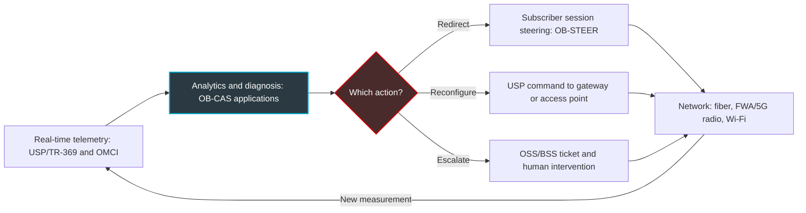
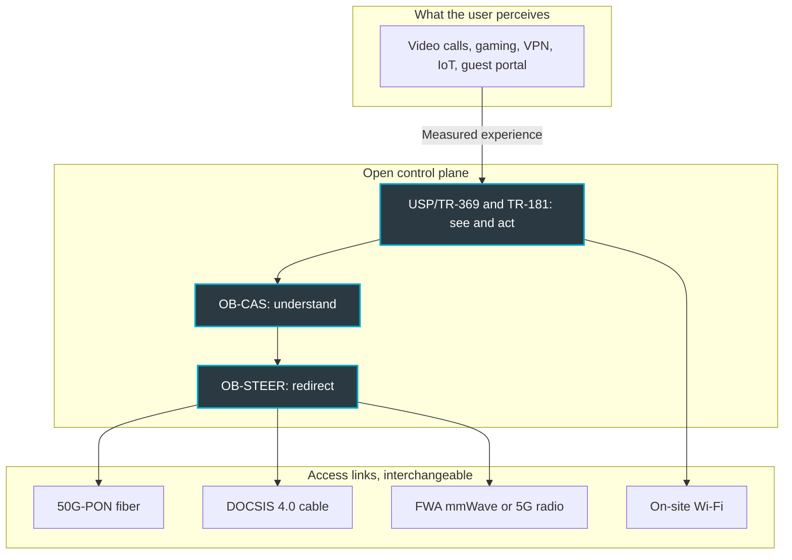

## Gigabit no longer guarantees anything

A hotel guest has no idea whether their room is wired for fiber, 5G, or an old coax cable. All they know is that their video call to Singapore froze at 11:10 PM. And it's the hotel they'll blame in their review, not the internet service provider.

That scene sums up the misunderstanding telecom has lived on for fifteen years. We sold megabits, measured megabits, signed contracts in megabits. The end customer, meanwhile, never bought bandwidth. They buy a video call that doesn't freeze, a smooth check-in, a payment terminal that actually processes the transaction. For a hotelier, a student housing manager, or a CIO running two hundred branch offices, the gap between the two is no longer a technical footnote: it's revenue.

From October 13 to 15, in Vienna, the Broadband Forum will make that shift official, in public. This consortium has spent more than twenty years writing the standards for remote management of home gateways and access networks. Reading the program for its seven demonstrations at the Network X show, backed by more than twenty members, the common thread is no longer throughput. It's Quality of Experience (QoE), and above all, putting it on autopilot: measure, diagnose, correct, without dispatching a technician.

My take: this shift changes the nature of the competition. The battle is moving from the pipe to orchestration. On that terrain, those who already sell outcomes rather than megabits start with a head start.

## Three building blocks, one loop

To understand what the Forum is assembling, think about how a navigation app handles a traffic jam.

Millions of phones continuously report their position and speed. A server cross-references these signals, spots the slowdown, and infers a likely cause. Then a voice tells you to take the next exit. Sense, understand, redirect. The Broadband Forum is building exactly these three layers for the access network, each with its own open standard.

### USP/TR-369: the sensors and the controls

The first layer is called USP (User Services Platform), standardized under reference TR-369 [10, 12]. It's the successor to TR-069, the long-standing protocol that lets an operator remotely configure subscribers' gateways.

The difference boils down to one image. TR-069 is a meter reading taken at regular intervals; USP is a smart meter. The architecture is built around a controller/agent pair designed for real time, with hardened security. Above all, it relies on a shared data model, TR-181, which describes a gateway, a Wi-Fi access point, or a connected device in the same way.

In practice, a USP controller can subscribe to events and get notified the moment an access point saturates, instead of waiting for the next collection cycle. That's the precondition for everything else. You can't automate what you see late.

### OB-CAS: the brain that reads the gauges

The second layer is the newest. OB-CAS stands for Open Broadband - CloudCO Application Software Development Kit [4]. Put simply: a development kit for writing applications that run on top of an access network's controller. In the Forum's vocabulary, CloudCO refers to the access central office reimagined as a software platform.

The interest goes beyond the acronym. OB-CAS exposes, through open APIs, the telemetry that controller collects: from fiber terminals, via their OMCI management channel, and from equipment managed over USP. A third-party vendor can then tap into it without being locked to the hardware manufacturer [3, 4].

The Forum documented a compelling example [3]. Condor Technologies demonstrated an OB-CAS application: a network maintenance engine driven by a large language model (LLM). It follows a method called *Chain of Evidence*, in three steps: describe, diagnose, recommend. The next step is presented as a planned evolution: autonomous actioning, meaning applying the fix and opening the ticket in the operations and billing systems (OSS/BSS) without human intervention.

### OB-STEER: the voice that reroutes you

The third layer, OB-STEER (Open Broadband Subscriber Session Steering), builds on the in-progress WT-474 specification [11]. Its purpose: redirect a subscriber's session in real time to the most suitable network resource. The Forum launched it in March 2025 among three new Open Broadband projects. The narrative attached to it is Wi-Fi that can heal itself, following a sense-decide-act logic.

Put the three together and you get a closed loop. Measurement feeds diagnosis, diagnosis triggers action, action produces a new measurement.

*Simplified diagram (author's interpretation): the closed loop drawn together by USP/TR-369, OB-CAS, and OB-STEER.*

## Vienna 2026: a program that no longer talks about throughput

The program details confirm the shift. The demonstrations will be held at VIECON in Vienna, Hall B, Stand D25, from October 13 to 15, 2026: seven multi-use-case demonstrations, backed by more than twenty vendor and operator members [1].

Alongside them, the Forum's BASe conference series lines up four sessions on October 13 and 14, on the Partner Stage [2]. The titles read like a manifesto:

- **Beyond Connectivity**: USP/TR-369 as the foundation for monetizable offers, from latency-optimized gaming to secure network slices for small offices and remote workers (SOHO).
- **The Autonomous Edge**: OB-CAS and OB-STEER combined for zero-touch operations, with two very concrete promises. Lower operating costs, and fewer technician dispatches, the infamous *truck rolls*.
- **Beyond the Bit**: the convergence of cable (DOCSIS 4.0), millimeter-wave fixed wireless access (FWA), and 50G-PON fiber under a unified software control plane, with QoE prioritized over raw throughput.
- An **operator roundtable** looking ahead to 2027.

On the speaker side, the lineup mixes vendors and operators: Mike Emmendorfer (Calix), Kurt Pynaert (Nokia), Bruno Cornaglia (Vodafone), David Tomalin, CTO of CityFibre, and Paul Arola (Telus) [2]. My take: when competing equipment vendors and operators from both sides of the Atlantic share the same stage on the same topic, it's not a scheduling coincidence. It's an agenda.

The machinery is already running ahead of the opening. Lincoln Lavoie (UNH-IOL interoperability lab), the Forum's technical chair, oversaw the filming of the demo showcase videos. And a BASe panel, *Service Assurance in a Heterogeneous Network World*, is scheduled as early as September 30 [9].

*Sense, diagnose, correct: the loop the Vienna demonstrations must make tangible, from fiber to Wi-Fi.*

To gauge what will actually be shown, the Paris precedent is useful, provided you don't conflate the two editions. At Network X Paris, from October 14 to 16, 2025, the Forum showcased eight demonstrations [5]. Among them was already an OB-CAS building block for dynamically adjusting alarm thresholds. Another monitored the power continuity of equipment via USP and TR-181, so-called *lifeline monitoring*. A third verified a service level agreement (SLA) using the Delta-Q metric (ΔQ, TR-452.x series), designed around experience rather than throughput.

My reading: Vienna isn't a starting point. It's a second iteration, and that's the standard by which it should be judged. What has actually progressed between the 2025 alarm-threshold demo and the 2026 promise of an autonomous edge?

## The last mile decides everything

Why this sudden obsession with experience? Because fiber has won, and its victory has shifted the problem.

On the ground, the pattern is consistent. This is my observation as an operator, not a Forum statistic. When the access link delivers a gigabit, it's almost never the culprit behind a frozen video call. It's the saturated access point down the hall, the congested radio channel, the gateway stuffed inside a metal cabinet, the app that has no idea it's sharing the antenna with forty smartphones.

Craig Thomas, CEO of the Broadband Forum, says much the same thing. Interviewed by Lightwave Online in late May 2026, on the sidelines of the Fiber Connect show, he explained that migrating from TR-069 to USP shortens the time-to-launch for new services [7]. His stated goal: pull fiber out of its status as a passive fat pipe, and adapt it to the applications people actually want to use. And he asks the right question, the one about the bridge to build between Wi-Fi and the application.

The Forum had already laid out the framework back in April 2025 [6]. It describes an Automated Intelligence Management (AIM) approach: AI and machine learning to detect events that degrade experience, then trigger dynamic traffic steering. The scope is end-to-end. It runs from the data center to the metro edge, then to the access network, the gateway, and all the way to the terminal device.

Two complementary building blocks feature in it. First, the TR-398 Wi-Fi performance certification, which tests the real-world behavior of radio equipment. Second, L4S, a technology that reduces queuing-induced latency in the network. One addresses radio, the other transport: in my view, together they tackle the two classic causes of a choppy video call.

*Simplified view (author's interpretation): an open control plane makes access links interchangeable, and experience becomes the yardstick.*

That's the whole point of the *Beyond the Bit* session. It doesn't matter whether the last hop runs over fiber, coax, or radio, as long as the control plane is unified and the yardstick becomes experience. The pipe becomes a commodity. The control plane becomes the product.

## Why the Wi-Fi operator starts with a head start

What follows is my own analysis, not the Forum's talking points.

Consumer-facing operators are discovering QoE as a product to be invented. For a managed Wi-Fi operator like Wifirst, it's been the product from day one. A hotelier doesn't sign up for throughput; they sign up to make Wi-Fi disappear from guest reviews. A multi-site CIO doesn't want peak bandwidth. They want the executive committee's video call to hold up and the branch offices' VPN to stay connected.

Let's take three sectors.

**Hospitality.** Guests move from the lobby to the restaurant to their room, and their session has to follow them seamlessly from one access point to the next. The guest access portal shouldn't turn check-in into an obstacle course. And at 9 PM, everyone streams at once. A useful closed loop here means detecting that an access point is saturating and rebalancing the load before the negative review gets written.

**Student housing.** Load spikes are brutal here: move-in week, parties, online exams. Every student arrives with a speaker, a console, sometimes a printer to connect. A shared data model like TR-181, which describes the gateway, the access point, and the device the same way, finally makes device onboarding scalable.

**Enterprise and retail.** Here, QoE is judged flow by flow: video calls, VPN, payment terminals, managed IoT devices. Access is often dual-path, fiber as primary and 4G or 5G as backup. That's exactly Vienna's multi-access scenario, scaled down to a single store.

*Hotel or student housing: the user doesn't judge throughput, they judge the continuity of their session as they move from one access point to the next.*

My forecast: within two to three years, managed-service RFPs will demand commitments expressed in experience rather than guaranteed throughput. We'll talk about the share of video calls without degradation, automatic recovery time, and the number of interventions avoided. That requires three things from the operator. Instrument every link all the way to the terminal device. Accept open interfaces to avoid dependence on any single vendor. And own a share of automation in remediation.

The paradox is a tasty one. Infrastructure operators have the standards but not the outcome-driven culture. Service operators have the outcome-driven culture but still need to adopt the standards. Whichever camp closes its gap first will set the rules of the market.

## Three reasons to keep a cool head

I share the direction. I'm wary of the timeline.

**First point: the adoption figure.** According to the Broadband Forum's *Future of the Connected Home* report, published on October 9, 2025, based on 116 operators surveyed across 32 countries, 88% of broadband service providers are deploying or plan to deploy USP within 6 to 18 months [8]. The figure is impressive. But it should be read for what it is: a self-reported survey, run by the organization that publishes the standard. Planning isn't deploying. And, counting from publication, the announced window runs roughly from April 2026 to April 2027: we're right in the middle of it. Vienna is the right moment to ask for real deployed fleets, not intentions.

**Second point: OB-STEER's maturity.** Public documentation remains thin. As far as I know, no detailed technical deliverable is available beyond the March 2025 launch announcement and the reference to WT-474. In the Forum's naming convention, a WT (Working Text) is a text still under development, not a published technical report. Self-healing Wi-Fi still belongs more to event-stage rhetoric than to actual specification, for now.

**Third point: zero-touch.** The Condor example is honest. The engine describes, diagnoses, and recommends; autonomous actioning remains a planned evolution. That caution has a reason. Letting a language model push a configuration to thousands of access points raises questions the demonstrations rarely address. Who validates it? How do you roll it back? Who bears contractual liability when the fix degrades service instead of restoring it?

*Before autonomous actioning, the realistic near-term step remains assisted diagnosis: the machine proposes, the engineer approves.*

My position: the closed loop will arrive piece by piece. First, reversible, low-blast-radius actions, like switching a radio channel, restarting an interface, or failing over to the backup link. Then, much later, decisions that commit an entire fleet. An LLM autonomously running thousands of production sites on its own — I don't see that happening by 2027, whatever the session titles say.

## What I'll be watching for in Vienna

The Broadband Forum is right on substance. Throughput has become a commodity, experience remains a craft, and that craft is developing a shared grammar: USP to see and act, OB-CAS to understand, OB-STEER to redirect.

Four signals will tell me whether Vienna marks a genuine turning point or just a nice showcase.

1. **A genuinely closed loop.** Will the demonstrations show an automatic action, measured before and after, across equipment from multiple vendors? Or just another dashboard?
2. **Fleet numbers.** Will Vodafone, Telus, and CityFibre give actual volumes of equipment genuinely managed over USP, beyond stated intentions?
3. **OB-STEER on the table.** Will the project move from working text to a demonstrable implementation, with a clear scope on the Wi-Fi side?
4. **The 2027 roundtable.** Will operators there talk about contractual QoE commitments, or still about throughput?

For those who already sell outcomes, the message is clear. The cultural edge exists, but it won't survive proprietary, closed tooling. Open standards are making QoE automation accessible to everyone, including players who never made it their core business before. Whoever is still selling megabits in 2027 will be selling a commodity. Whoever sells a measured, guaranteed experience, repaired through a closed loop, will be selling a service.

_Personal views, not a Wifirst position._

## Sources

1. Broadband Forum, *Broadband Forum at Network X 2026* (page événement, consultée le 27/09/2026) : https://www.broadband-forum.org/events/broadband-forum-at-network-x-2026/
2. Broadband Forum, *BASe at Network X 2026* (page événement, consultée le 27/09/2026) : https://www.broadband-forum.org/events/base-at-network-x-2026/
3. Broadband Forum, *Turning raw network data into actionable insights with OB-CAS* (blog, 2026) : https://www.broadband-forum.org/blog/turning-raw-network-data-into-actionable-insights-with-ob-cas/
4. Broadband Forum, *OB-CAS SDK Overview* (documentation officielle, consultée le 27/09/2026) : https://obcas.broadband-forum.org/sdk/overview/
5. Business Wire, *Turning Standards Into Solutions: Automation, Quality of Experience and Wholesale Network Tools Are Themes of the Live Demos at Network X in Paris* (30/09/2025) : https://www.businesswire.com/news/home/20250930781334/en/Turning-Standards-Into-Solutions-Automation-Quality-of-Experience-and-Wholesale-Network-Tools-Are-Themes-of-the-Live-Demos-at-Network-X-in-Paris
6. Broadband Forum, *The future of broadband: why services-led QoE is essential* (blog, 23/04/2025) : https://www.broadband-forum.org/blog/the-future-of-broadband-why-services-led-qoe-is-essential/
7. Lightwave Online, *Broadband Forum sets sights on the subscribers' experience* (29/05/2026) : https://www.lightwaveonline.com/home/article/55380814/broadband-forum-sets-sights-on-the-subscribers-experience
8. Morningstar / Business Wire, *USP Critical to Broadband Service Provider AI Plans and Growth of Homeworking Services, New Report Finds* (09/10/2025) : https://www.morningstar.com/news/business-wire/20251009946527/usp-critical-to-broadband-service-provider-ai-plans-and-growth-of-homeworking-services-new-report-finds
9. Viodi, *Viodi View – 09/26/26* (26/09/2026) : https://viodi.com/2026/09/26/viodi-view-09-26-26/
10. Axiros, *What is USP/TR-369* (base de connaissances, consultée le 27/09/2026) : https://www.axiros.com/knowledge-base/usp-tr-369
11. Business Wire, *Broadband Forum Launches Three New Open Broadband Projects* (05/03/2025) : https://www.businesswire.com/news/home/20250305176951/en/Broadband-Forum-Launches-Three-New-Open-Broadband-Projects
12. Broadband Forum, *TR-369 User Services Platform, spécification* : https://usp.technology/specification/
