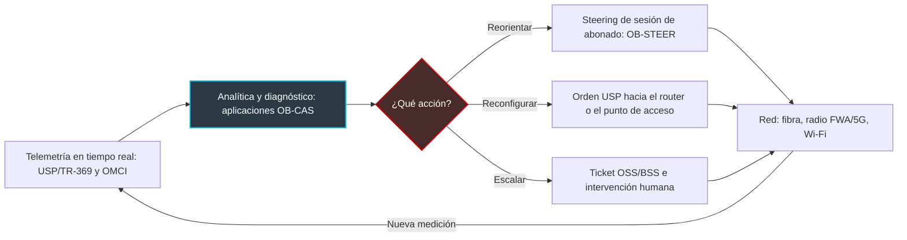
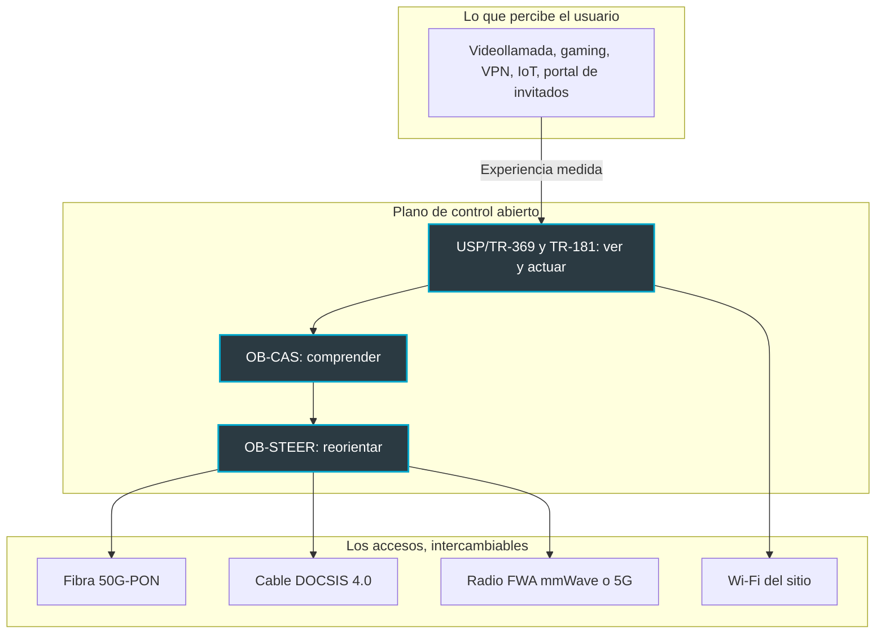

## El gigabit ya no garantiza nada

Un cliente de hotel no sabe si su habitación está conectada por fibra, por 5G o por un viejo cable coaxial. Solo sabe que su videollamada con Singapur se congeló a las 23:10. Y es al hotel a quien se lo reprocha en su reseña, no al proveedor de acceso.

Esta escena resume el malentendido sobre el que las telecos han vivido durante quince años. Se vendieron megabits, se midieron megabits, se firmaron contratos en megabits. El cliente final, en cambio, nunca compró un ancho de banda. Compra una videollamada que no se congela, un check-in fluido, una caja que cobra sin problemas. Para un hotelero, un gestor de residencias de estudiantes o un CIO que dirige doscientas sucursales, la diferencia entre ambos ya no es un asunto técnico: es facturación.

Del 13 al 15 de octubre, en Viena, el Broadband Forum hará público este vuelco. Este consorcio lleva más de veinte años escribiendo los estándares de gestión remota de los routers y las redes de acceso. A juzgar por el programa de sus siete demostraciones en el salón Network X, respaldadas por más de veinte miembros, el hilo conductor ya no es el ancho de banda. Es la calidad de experiencia (QoE, por Quality of Experience) y, sobre todo, su puesta en piloto automático: medir, diagnosticar, corregir, sin enviar a un técnico.

Mi tesis: este desplazamiento cambia la naturaleza de la competencia. La batalla abandona la tubería para pasar a la orquestación. En este terreno, quienes ya venden resultados en lugar de megabits parten con ventaja.

## Tres piezas, un solo bucle

Para entender lo que el Forum está ensamblando, piense en cómo una aplicación de navegación gestiona un atasco.

Millones de teléfonos envían continuamente su posición y su velocidad. Un servidor cruza estas señales, detecta la ralentización y deduce una causa probable. Después, una voz le aconseja salir de la autopista en la siguiente salida. Captar, comprender, reorientar. El Broadband Forum construye exactamente estas tres capas para la red de acceso, cada una con su propio estándar abierto.

### USP/TR-369: los sensores y los mandos

La primera capa se llama USP (User Services Platform), estandarizada bajo la referencia TR-369 [10, 12]. Es el sucesor de TR-069, el protocolo histórico que permite a un operador configurar de forma remota los routers de sus abonados.

La diferencia se resume en una imagen. TR-069 es la lectura del contador a intervalos regulares; USP es el contador inteligente. La arquitectura se basa en un par controlador/agente pensado para el tiempo real, con una seguridad reforzada. Y se apoya, sobre todo, en un modelo de datos compartido, TR-181, que describe de la misma manera un router, un punto de acceso Wi-Fi o un objeto conectado.

En la práctica, un controlador USP puede suscribirse a eventos y recibir una notificación en cuanto un punto de acceso se satura, en lugar de esperar la siguiente recolección de datos. Esa es la condición de todo lo demás. No se automatiza lo que se ve con retraso.

### OB-CAS: el cerebro que lee las constantes vitales

La segunda capa es la más reciente. OB-CAS significa Open Broadband - CloudCO Application Software Development Kit [4]. Dicho de forma sencilla: un kit de desarrollo para escribir aplicaciones que se ejecutan por encima del controlador de una red de acceso. CloudCO designa, en el vocabulario del Forum, la central de acceso reinventada como una plataforma de software.

El interés va más allá del acrónimo. OB-CAS expone mediante API abiertas la telemetría que recopila ese controlador: la de los terminales de fibra, a través de su canal de gestión OMCI, y la de los equipos gestionados en USP. Un proveedor externo puede así explotarla sin quedar cautivo del fabricante del hardware [3, 4].

El Forum ha documentado un ejemplo elocuente [3]. Condor Technologies presentó una aplicación OB-CAS: un motor de mantenimiento de red pilotado por un gran modelo de lenguaje (LLM). Sigue un método llamado *Chain of Evidence*, en tres pasos: describir, diagnosticar, recomendar. El siguiente paso se presenta como una evolución prevista. Se trata de la actuación autónoma, es decir, aplicar la corrección y abrir el ticket en las herramientas de supervisión y facturación (OSS/BSS) sin intervención humana.

### OB-STEER: la voz que le hace cambiar de ruta

La tercera capa, OB-STEER (Open Broadband Subscriber Session Steering), se apoya en la especificación en curso WT-474 [11]. Su objetivo: reorientar en tiempo real la sesión de un abonado hacia el recurso de red más adecuado. El Forum la lanzó en marzo de 2025 dentro de tres nuevos proyectos Open Broadband. El discurso que la acompaña le asocia la ambición de un Wi-Fi capaz de repararse solo, con una lógica de percibir-decidir-actuar.

Ponga las tres piezas una tras otra y obtendrá un bucle cerrado. La medición alimenta el diagnóstico, el diagnóstico desencadena la acción, la acción produce una nueva medición.

*Esquema simplificado (interpretación del autor): el bucle cerrado que dibujan juntos USP/TR-369, OB-CAS y OB-STEER.*

## Viena 2026: un programa que ya no habla de ancho de banda

El detalle del programa confirma el giro. Las demostraciones se celebrarán en el VIECON de Viena, pabellón B, estand D25, del 13 al 15 de octubre de 2026: siete demostraciones con múltiples casos de uso, respaldadas por más de veinte proveedores y operadores miembros [1].

En paralelo, el ciclo de conferencias BASe del Forum alinea cuatro sesiones los días 13 y 14 de octubre, en la Partner Stage [2]. Los títulos se leen como un manifiesto:

- **Beyond Connectivity**: USP/TR-369 como base de ofertas monetizables, desde el gaming con latencia optimizada hasta los segmentos de red seguros para pequeñas oficinas y teletrabajadores (SOHO).
- **The Autonomous Edge**: OB-CAS y OB-STEER combinados para operaciones zero-touch, con dos promesas muy concretas. Menos costes operativos y menos desplazamientos de técnicos, los famosos *truck rolls*.
- **Beyond the Bit**: la convergencia del cable (DOCSIS 4.0), la radio milimétrica en acceso fijo (FWA, Fixed Wireless Access) y la fibra 50G-PON bajo un plano de control de software unificado, con la QoE priorizada por encima del ancho de banda bruto.
- Una **mesa redonda de operadores** orientada a 2027.

En cuanto a los ponentes, la lista mezcla fabricantes y operadores: Mike Emmendorfer (Calix), Kurt Pynaert (Nokia), Bruno Cornaglia (Vodafone), David Tomalin, CTO de CityFibre, y Paul Arola (Telus) [2]. Mi análisis: cuando fabricantes competidores y operadores de ambos lados del Atlántico comparten el mismo escenario sobre el mismo tema, no es una casualidad de programación. Es una agenda.

La maquinaria funciona incluso antes de la inauguración. Lincoln Lavoie (laboratorio de interoperabilidad UNH-IOL), presidente técnico del Forum, supervisó el rodaje de los vídeos de presentación de las demostraciones. Y un panel BASe, *Service Assurance in a Heterogeneous Network World*, está programado ya para el 30 de septiembre [9].

*Captar, diagnosticar, corregir: el bucle que las demostraciones de Viena deben hacer tangible, de la fibra al Wi-Fi.*

Para calibrar lo que se mostrará realmente, el precedente parisino es útil, siempre que no se confundan las ediciones. En Network X Paris, del 14 al 16 de octubre de 2025, el Forum había presentado ocho demostraciones [5]. Ya se encontraba allí un componente OB-CAS para ajustar dinámicamente los umbrales de alarma. Otro vigilaba la continuidad eléctrica de los equipos vía USP y TR-181, el *lifeline monitoring*. Un tercero verificaba un acuerdo de nivel de servicio (SLA) con la métrica Delta-Q (ΔQ, serie TR-452.x), pensada para la experiencia y no para el ancho de banda.

Mi lectura: Viena no es un punto de partida. Es una segunda iteración, y así es como habrá que juzgarla. ¿Qué ha avanzado entre la demo de un umbral de alarma en 2025 y la promesa de un edge autónomo en 2026?

## El último metro lo decide todo

¿Por qué esta obsesión repentina por la experiencia? Porque la fibra ha ganado, y su victoria ha desplazado el problema.

Sobre el terreno, la constatación es constante. Es mi observación como operador, no una estadística del Forum. Cuando el acceso entrega un gigabit, casi nunca es él quien hace que la videollamada se congele. Es el punto de acceso saturado al final del pasillo, el canal de radio congestionado, el router guardado en un armario metálico, la aplicación que no sabe que comparte la antena con cuarenta smartphones.

Craig Thomas, CEO del Broadband Forum, dice lo mismo. Entrevistado por Lightwave Online a finales de mayo de 2026, en el marco del salón Fiber Connect, explicaba que la migración de TR-069 a USP acorta los plazos de lanzamiento de nuevos servicios [7]. Su objetivo declarado: sacar a la fibra de su estatus de gran tubería pasiva, para adaptarla a las aplicaciones que la gente realmente quiere usar. Y plantea la pregunta correcta, la del puente que hay que construir entre el Wi-Fi y la aplicación.

El Forum había planteado el marco ya en abril de 2025 [6]. Allí describe un Automated Intelligence Management (AIM): IA y aprendizaje automático para detectar los eventos que degradan la experiencia, y luego desencadenar un steering dinámico del tráfico. El alcance es de extremo a extremo. Va desde el centro de datos hasta la periferia metropolitana, después la red de acceso, el router y hasta el terminal.

Figuran allí dos componentes complementarios. Primero, la certificación de rendimiento Wi-Fi TR-398, que pone a prueba el comportamiento real de los equipos de radio. Después, L4S, una tecnología que reduce la latencia causada por las colas en la red. Una trata la radio, la otra el transporte: en mi opinión, atacan juntas las dos causas clásicas de una videollamada que se entrecorta.

*Vista simplificada (interpretación del autor): un plano de control abierto hace que los accesos sean intercambiables, y la experiencia se convierte en el patrón de medida.*

Ese es todo el sentido de la sesión *Beyond the Bit*. No importa que el último tramo pase por la fibra, el coaxial o la radio, si el plano de control está unificado y el patrón se convierte en la experiencia. La tubería se banaliza. El control se convierte en el producto.

## Por qué el operador Wi-Fi parte con ventaja

Lo que sigue es mi análisis, no el discurso del Forum.

Los operadores de consumo están descubriendo la QoE como un producto por inventar. Para un operador de Wi-Fi gestionado como Wifirst, es el producto desde el primer día. Un hotelero no firma por un ancho de banda; firma para que el Wi-Fi desaparezca de las reseñas de los clientes. Un CIO multisitio no quiere un pico de ancho de banda. Quiere que la videollamada del comité de dirección se sostenga y que la VPN de las sucursales no se caiga.

Tomemos tres terrenos.

**La hotelería.** El cliente pasa del lobby al restaurante y luego a su habitación, y su sesión debe seguirlo sin cortes de un punto de acceso a otro. El portal de acceso para invitados no debe convertir el check-in en una carrera de obstáculos. Y a las 21:00, todo el mundo hace streaming a la vez. Un bucle cerrado útil, aquí, consiste en detectar que un punto de acceso se satura y repartir la carga antes de que se escriba la reseña negativa.

**Las residencias de estudiantes.** Los picos de carga son brutales: inicio de curso, fiestas, exámenes en línea. Cada estudiante llega con un altavoz, una consola, a veces una impresora que conectar. Un modelo de datos común como TR-181, que describe de la misma manera el router, el punto de acceso y el objeto, hace por fin industrializable la incorporación de dispositivos.

**La empresa y el retail.** Aquí, la QoE se juzga flujo por flujo: videollamada, VPN, terminales de pago, objetos conectados gestionados. El acceso suele ser doble, fibra como principal y 4G o 5G como respaldo. Es exactamente el escenario multiacceso de Viena, trasladado a la escala de una tienda.

*Hotel o residencia de estudiantes: el usuario no juzga el ancho de banda, juzga la continuidad de su sesión de un punto de acceso a otro.*

Mi pronóstico: dentro de dos o tres años, las licitaciones de servicios gestionados exigirán compromisos expresados en experiencia y no en ancho de banda garantizado. Se hablará de la proporción de sesiones de videollamada sin degradación, del tiempo de restablecimiento automático, del número de intervenciones evitadas. Esto impone tres cosas al operador. Instrumentar cada eslabón hasta el terminal. Aceptar interfaces abiertas para no depender de ningún fabricante. Y asumir una parte de automatización en la remediación.

La paradoja es deliciosa. Los operadores de infraestructura tienen los estándares, pero no la cultura del resultado. Los operadores de servicios tienen la cultura del resultado, pero todavía deben adoptar los estándares. El primer bando que cierre su brecha fijará las reglas del mercado.

## Tres razones para mantener la cabeza fría

Comparto la dirección. Desconfío del calendario.

**Primer punto: la cifra de adopción.** Según el informe *Future of the Connected Home* del Broadband Forum, publicado el 9 de octubre de 2025 a partir de 116 operadores encuestados en 32 países, el 88 % de los proveedores de servicios de banda ancha despliega o prevé desplegar USP en los próximos 6 a 18 meses [8]. La cifra impresiona. Sin embargo, hay que leerla por lo que es: una encuesta declarativa, realizada por el organismo que edita el estándar. Prever no es desplegar. Y, a partir de la publicación, la ventana anunciada transcurre aproximadamente de abril de 2026 a abril de 2027: estamos en pleno medio de ella. Viena es el momento adecuado para exigir parques reales, no intenciones.

**Segundo punto: la madurez de OB-STEER.** La documentación pública sigue siendo escasa. Que yo sepa, no hay ningún entregable técnico detallado accesible más allá del comunicado de lanzamiento de marzo de 2025 y de la referencia al WT-474. En la nomenclatura del Forum, un WT (Working Text) es un texto todavía en fase de elaboración, no un informe técnico publicado. El Wi-Fi que se repara solo pertenece, por ahora, más al discurso de los eventos que a la especificación.

**Tercer punto: el zero-touch.** El ejemplo de Condor es honesto. El motor describe, diagnostica y recomienda; la actuación autónoma sigue siendo una evolución prevista. Esta prudencia tiene una razón. Dejar que un modelo de lenguaje despliegue una configuración en miles de puntos de acceso plantea preguntas que las demostraciones rara vez abordan. ¿Quién valida? ¿Cómo se revierte? ¿Quién asume la responsabilidad contractual cuando la corrección degrada el servicio en lugar de restablecerlo?

*Antes de la actuación autónoma, la etapa realista sigue siendo el diagnóstico asistido: la máquina propone, el ingeniero valida.*

Mi posición: el bucle cerrado llegará por partes. Primero, las acciones reversibles, de bajo radio de impacto, como cambiar de canal de radio, reiniciar una interfaz o conmutar al enlace de respaldo. Después, mucho más tarde, las decisiones que comprometen a todo un parque. Un LLM que pilote solo miles de sitios en producción, no lo veo para 2027, sea cual sea el título de las sesiones.

## Lo que observaré en Viena

El Broadband Forum tiene razón en el fondo. El ancho de banda se ha convertido en una commodity, la experiencia sigue siendo un oficio, y ese oficio está adquiriendo una gramática común: USP para ver y actuar, OB-CAS para comprender, OB-STEER para reorientar.

Cuatro señales me dirán si Viena marca un verdadero punto de inflexión o solo un buen escaparate.

1. **Un bucle realmente cerrado.** ¿Mostrarán las demostraciones una acción automática, medida antes y después, en equipos de varios fabricantes? ¿O un panel de control más?
2. **Cifras de parque instalado.** ¿Darán Vodafone, Telus y CityFibre volúmenes de equipos realmente gestionados en USP, más allá de las intenciones?
3. **OB-STEER sobre la mesa.** ¿Pasará el proyecto del texto de trabajo a una implementación demostrable, con un alcance claro en el lado Wi-Fi?
4. **La mesa redonda de 2027.** ¿Hablarán allí los operadores de compromisos contractuales en QoE, o todavía de ancho de banda?

Para quienes ya venden resultados, el mensaje es claro. La ventaja cultural existe, pero no sobrevivirá a un instrumental propietario y cerrado. Los estándares abiertos están haciendo que la automatización de la QoE sea accesible para todos, incluidos los actores que nunca la habían convertido en su oficio. Quien todavía venda megabits en 2027 venderá una commodity. Quien venda una experiencia medida, garantizada y reparada en bucle cerrado venderá un servicio.

_Opiniones personales, no posición de Wifirst._

## Sources

1. Broadband Forum, *Broadband Forum at Network X 2026* (page événement, consultée le 27/09/2026) : https://www.broadband-forum.org/events/broadband-forum-at-network-x-2026/
2. Broadband Forum, *BASe at Network X 2026* (page événement, consultée le 27/09/2026) : https://www.broadband-forum.org/events/base-at-network-x-2026/
3. Broadband Forum, *Turning raw network data into actionable insights with OB-CAS* (blog, 2026) : https://www.broadband-forum.org/blog/turning-raw-network-data-into-actionable-insights-with-ob-cas/
4. Broadband Forum, *OB-CAS SDK Overview* (documentation officielle, consultée le 27/09/2026) : https://obcas.broadband-forum.org/sdk/overview/
5. Business Wire, *Turning Standards Into Solutions: Automation, Quality of Experience and Wholesale Network Tools Are Themes of the Live Demos at Network X in Paris* (30/09/2025) : https://www.businesswire.com/news/home/20250930781334/en/Turning-Standards-Into-Solutions-Automation-Quality-of-Experience-and-Wholesale-Network-Tools-Are-Themes-of-the-Live-Demos-at-Network-X-in-Paris
6. Broadband Forum, *The future of broadband: why services-led QoE is essential* (blog, 23/04/2025) : https://www.broadband-forum.org/blog/the-future-of-broadband-why-services-led-qoe-is-essential/
7. Lightwave Online, *Broadband Forum sets sights on the subscribers' experience* (29/05/2026) : https://www.lightwaveonline.com/home/article/55380814/broadband-forum-sets-sights-on-the-subscribers-experience
8. Morningstar / Business Wire, *USP Critical to Broadband Service Provider AI Plans and Growth of Homeworking Services, New Report Finds* (09/10/2025) : https://www.morningstar.com/news/business-wire/20251009946527/usp-critical-to-broadband-service-provider-ai-plans-and-growth-of-homeworking-services-new-report-finds
9. Viodi, *Viodi View – 09/26/26* (26/09/2026) : https://viodi.com/2026/09/26/viodi-view-09-26-26/
10. Axiros, *What is USP/TR-369* (base de connaissances, consultée le 27/09/2026) : https://www.axiros.com/knowledge-base/usp-tr-369
11. Business Wire, *Broadband Forum Launches Three New Open Broadband Projects* (05/03/2025) : https://www.businesswire.com/news/home/20250305176951/en/Broadband-Forum-Launches-Three-New-Open-Broadband-Projects
12. Broadband Forum, *TR-369 User Services Platform, spécification* : https://usp.technology/specification/
