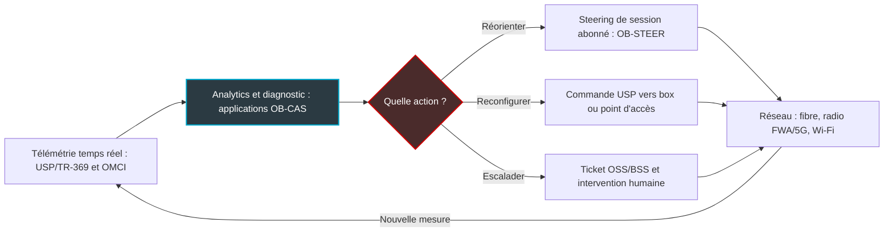
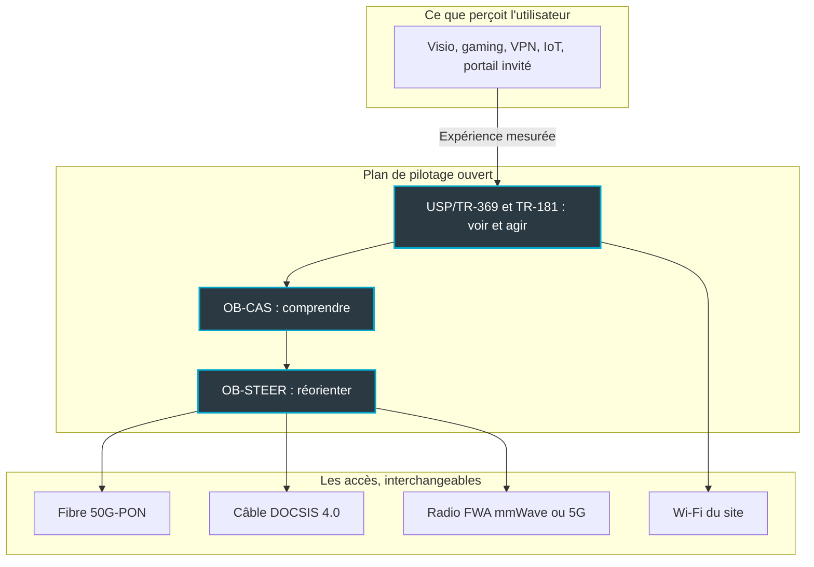

## Le gigabit ne garantit plus rien

Un client d'hôtel ne sait pas si sa chambre est raccordée en fibre, en 5G ou par un vieux câble coaxial. Il sait seulement que sa visio avec Singapour s'est figée à 23 h 10. Et c'est à l'hôtel qu'il le reproche dans son avis, pas au fournisseur d'accès.

Cette scène résume le malentendu sur lequel les télécoms ont vécu pendant quinze ans. On a vendu des mégabits, mesuré des mégabits, signé des contrats en mégabits. Le client final, lui, n'a jamais acheté un débit. Il achète une visio qui ne gèle pas, un check-in fluide, une caisse qui encaisse. Pour un hôtelier, un gestionnaire de résidences étudiantes ou une DSI qui pilote deux cents agences, l'écart entre les deux n'est plus un sujet technique : c'est du chiffre d'affaires.

Du 13 au 15 octobre, à Vienne, le Broadband Forum va acter ce basculement en public. Ce consortium écrit depuis plus de vingt ans les standards de gestion à distance des box et des réseaux d'accès. À lire le programme de ses sept démonstrations au salon Network X, soutenues par plus de vingt membres, le fil rouge n'est plus le débit. C'est la qualité d'expérience (QoE, pour Quality of Experience), et surtout sa mise en pilote automatique : mesurer, diagnostiquer, corriger, sans envoyer de technicien.

Ma thèse : ce déplacement change la nature de la compétition. La bataille quitte le tuyau pour l'orchestration. Sur ce terrain, ceux qui vendent déjà des résultats plutôt que des mégabits partent avec une longueur d'avance.

## Trois briques, une seule boucle

Pour comprendre ce que le Forum assemble, pensez à la façon dont une application de navigation gère un bouchon.

Des millions de téléphones remontent en continu leur position et leur vitesse. Un serveur croise ces signaux, repère le ralentissement et en déduit une cause probable. Puis une voix vous conseille de quitter l'autoroute à la prochaine sortie. Capter, comprendre, réorienter. Le Broadband Forum construit exactement ces trois étages pour le réseau d'accès, chacun avec son standard ouvert.

### USP/TR-369 : les capteurs et les manettes

Le premier étage s'appelle USP (User Services Platform), standardisé sous la référence TR-369 [10, 12]. C'est le successeur de TR-069, le protocole historique qui permet à un opérateur de configurer à distance les box de ses abonnés.

La différence tient en une image. TR-069, c'est le relevé de compteur à intervalles réguliers ; USP, c'est le compteur communicant. L'architecture repose sur un couple contrôleur/agent pensé pour le temps réel, avec une sécurité renforcée. Elle s'appuie surtout sur un modèle de données partagé, TR-181, qui décrit de la même manière une box, un point d'accès Wi-Fi ou un objet connecté.

Concrètement, un contrôleur USP peut s'abonner à des événements et être notifié dès qu'un point d'accès sature, au lieu d'attendre la prochaine collecte. C'est la condition de tout le reste. On n'automatise pas ce qu'on voit avec retard.

### OB-CAS : le cerveau qui lit les constantes

Le deuxième étage est le plus récent. OB-CAS signifie Open Broadband - CloudCO Application Software Development Kit [4]. Dit simplement : un kit de développement pour écrire des applications qui tournent au-dessus du contrôleur d'un réseau d'accès. CloudCO désigne, dans le vocabulaire du Forum, le central d'accès réinventé comme une plateforme logicielle.

L'intérêt dépasse l'acronyme. OB-CAS expose par des API ouvertes la télémétrie que ce contrôleur collecte : celle des terminaux fibre, via leur canal de gestion OMCI, et celle des équipements pilotés en USP. Un éditeur tiers peut ainsi l'exploiter sans être prisonnier du constructeur du matériel [3, 4].

Le Forum a documenté un exemple parlant [3]. Condor Technologies a démontré une application OB-CAS : un moteur de maintenance réseau piloté par un grand modèle de langage (LLM). Il suit une méthode baptisée *Chain of Evidence*, en trois temps : décrire, diagnostiquer, recommander. L'étape suivante est présentée comme une évolution prévue. Il s'agit de l'actionnement autonome, c'est-à-dire appliquer le correctif et ouvrir le ticket dans les outils de supervision et de facturation (OSS/BSS) sans intervention humaine.

### OB-STEER : la voix qui vous fait changer de route

Le troisième étage, OB-STEER (Open Broadband Subscriber Session Steering), s'appuie sur la spécification en cours WT-474 [11]. Son objet : réorienter en temps réel la session d'un abonné vers la ressource réseau la plus adaptée. Le Forum l'a lancé en mars 2025 parmi trois nouveaux projets Open Broadband. Son discours lui associe une ambition de Wi-Fi capable de se réparer seul, dans une logique percevoir-décider-agir.

Mettez les trois bout à bout et vous obtenez une boucle fermée. La mesure nourrit le diagnostic, le diagnostic déclenche l'action, l'action produit une nouvelle mesure.

*Schéma simplifié (lecture de l'auteur) : la boucle fermée que dessinent ensemble USP/TR-369, OB-CAS et OB-STEER.*

## Vienne 2026 : un programme qui ne parle plus de débit

Le détail du programme confirme la bascule. Les démonstrations se tiendront au VIECON de Vienne, hall B, stand D25, du 13 au 15 octobre 2026 : sept démonstrations à cas d'usage multiples, soutenues par plus de vingt fournisseurs et opérateurs membres [1].

En parallèle, le cycle de conférences BASe du Forum aligne quatre sessions les 13 et 14 octobre, sur la Partner Stage [2]. Les titres se lisent comme un manifeste :

- **Beyond Connectivity** : USP/TR-369 comme socle d'offres monétisables, du gaming à latence optimisée aux tranches de réseau sécurisées pour petits bureaux et télétravailleurs (SOHO).
- **The Autonomous Edge** : OB-CAS et OB-STEER combinés pour des opérations zero-touch, avec deux promesses très concrètes. Moins de coûts d'exploitation, et moins de déplacements de techniciens, les fameux *truck rolls*.
- **Beyond the Bit** : la convergence du câble (DOCSIS 4.0), de la radio millimétrique en accès fixe (FWA, Fixed Wireless Access) et de la fibre 50G-PON sous un plan de contrôle logiciel unifié, avec la QoE priorisée sur le débit brut.
- Un **roundtable opérateurs** tourné vers 2027.

Côté intervenants, la liste mélange constructeurs et opérateurs : Mike Emmendorfer (Calix), Kurt Pynaert (Nokia), Bruno Cornaglia (Vodafone), David Tomalin, CTO de CityFibre, et Paul Arola (Telus) [2]. Mon analyse : quand des équipementiers concurrents et des opérateurs des deux côtés de l'Atlantique partagent la même scène sur le même thème, ce n'est pas un hasard de programmation. C'est un agenda.

La mécanique tourne avant même l'ouverture. Lincoln Lavoie (laboratoire d'interopérabilité UNH-IOL), président technique du Forum, a supervisé le tournage des vidéos de présentation des démonstrations. Et un panel BASe, *Service Assurance in a Heterogeneous Network World*, est programmé dès le 30 septembre [9].

*Capter, diagnostiquer, corriger : la boucle que les démonstrations de Vienne doivent rendre tangible, de la fibre au Wi-Fi.*

Pour jauger ce qui sera réellement montré, le précédent parisien est utile, à condition de ne pas confondre les éditions. À Network X Paris, du 14 au 16 octobre 2025, le Forum avait présenté huit démonstrations [5]. On y trouvait déjà une brique OB-CAS pour ajuster dynamiquement les seuils d'alarme. Une autre surveillait la continuité électrique des équipements via USP et TR-181, le *lifeline monitoring*. Une troisième vérifiait un engagement de service (SLA) avec la métrique Delta-Q (ΔQ, série TR-452.x), pensée pour l'expérience plutôt que pour le débit.

Ma lecture : Vienne n'est pas un point de départ. C'est une deuxième itération, et c'est à ce titre qu'il faudra la juger. Qu'est-ce qui a progressé entre la démo d'un seuil d'alarme en 2025 et la promesse d'un edge autonome en 2026 ?

## Le dernier mètre décide de tout

Pourquoi cette obsession soudaine pour l'expérience ? Parce que la fibre a gagné, et que sa victoire a déplacé le problème.

Sur le terrain, le constat est constant. C'est mon observation d'opérateur, pas une statistique du Forum. Quand l'accès délivre un gigabit, ce n'est presque jamais lui qui fait geler la visio. C'est le point d'accès saturé au bout du couloir, le canal radio encombré, la box rangée dans un placard métallique, l'application qui ignore qu'elle partage l'antenne avec quarante smartphones.

Craig Thomas, CEO du Broadband Forum, ne dit pas autre chose. Interrogé par Lightwave Online fin mai 2026, en marge du salon Fiber Connect, il expliquait que la migration de TR-069 vers USP raccourcit les délais de lancement de nouveaux services [7]. Son objectif affiché : sortir la fibre de son statut de gros tuyau passif, pour l'adapter aux applications que les gens veulent réellement utiliser. Et il pose la bonne question, celle du pont à construire entre le Wi-Fi et l'application.

Le Forum avait posé le cadre dès avril 2025 [6]. Il y décrit un Automated Intelligence Management (AIM) : de l'IA et de l'apprentissage automatique pour détecter les événements qui dégradent l'expérience, puis déclencher un steering dynamique du trafic. Le périmètre est de bout en bout. Il va du data center à la périphérie métropolitaine, puis au réseau d'accès, à la box et jusqu'au terminal.

Deux briques complémentaires y figurent. D'abord la certification de performance Wi-Fi TR-398, qui éprouve le comportement réel des équipements radio. Ensuite L4S, une technologie qui réduit la latence due aux files d'attente dans le réseau. L'une traite la radio, l'autre le transport : à mon sens, elles attaquent ensemble les deux causes classiques d'une visio qui hache.

*Vue simplifiée (lecture de l'auteur) : un plan de pilotage ouvert rend les accès interchangeables, et l'expérience devient l'étalon de mesure.*

C'est tout le sens de la session *Beyond the Bit*. Peu importe que la dernière boucle passe par la fibre, le coaxial ou la radio, si le plan de pilotage est unifié et que l'étalon devient l'expérience. Le tuyau se banalise. Le pilotage devient le produit.

## Pourquoi l'opérateur Wi-Fi part avec une longueur d'avance

Ce qui suit relève de mon analyse, pas du discours du Forum.

Les opérateurs grand public découvrent la QoE comme un produit à inventer. Pour un opérateur de Wi-Fi managé comme Wifirst, c'est le produit depuis le premier jour. Un hôtelier ne signe pas pour un débit ; il signe pour que le Wi-Fi disparaisse des avis clients. Une DSI multisite ne veut pas un débit crête. Elle veut que la visio du comité de direction tienne et que le VPN des agences ne décroche pas.

Prenons trois terrains.

**L'hôtellerie.** Le client passe du lobby au restaurant puis à sa chambre, et sa session doit suivre sans couper d'un point d'accès à l'autre. Le portail d'accès invité ne doit pas transformer le check-in en parcours du combattant. Et à 21 h, tout le monde streame en même temps. Une boucle fermée utile, ici, consiste à détecter qu'un point d'accès sature et à répartir la charge avant que l'avis négatif ne soit rédigé.

**Les résidences étudiantes.** Les pics de charge y sont brutaux : rentrée, soirées, examens en ligne. Chaque étudiant arrive avec une enceinte, une console, parfois une imprimante à raccorder. Un modèle de données commun comme TR-181, qui décrit de la même façon la box, le point d'accès et l'objet, rend enfin l'embarquement des appareils industrialisable.

**L'entreprise et le retail.** Ici, la QoE se juge flux par flux : visio, VPN, terminaux de paiement, objets connectés managés. L'accès est souvent double, fibre en principal et 4G ou 5G en secours. C'est exactement le scénario multi-accès de Vienne, ramené à l'échelle d'un magasin.

*Hôtel ou résidence étudiante : l'utilisateur ne juge pas le débit, il juge la continuité de sa session d'un point d'accès à l'autre.*

Mon pronostic : d'ici deux à trois ans, les appels d'offres de services managés exigeront des engagements exprimés en expérience plutôt qu'en débit garanti. On parlera de part de sessions visio sans dégradation, de délai de rétablissement automatique, de nombre d'interventions évitées. Cela impose trois choses à l'opérateur. Instrumenter chaque maillon jusqu'au terminal. Accepter des interfaces ouvertes pour ne dépendre d'aucun constructeur. Et assumer une part d'automatisation dans la remédiation.

Le paradoxe est savoureux. Les opérateurs d'infrastructure ont les standards, mais pas la culture du résultat. Les opérateurs de services ont la culture du résultat, mais doivent encore adopter les standards. Le premier camp qui comble son retard fixera les règles du marché.

## Trois raisons de garder la tête froide

Je partage la direction. Je me méfie du calendrier.

**Premier point : le chiffre d'adoption.** Selon le rapport *Future of the Connected Home* du Broadband Forum, publié le 9 octobre 2025 à partir de 116 opérateurs interrogés dans 32 pays, 88 % des fournisseurs de services haut débit déploient ou prévoient de déployer USP dans les 6 à 18 mois [8]. Le chiffre impressionne. Il faut pourtant le lire pour ce qu'il est : une enquête déclarative, menée par l'organisme qui édite le standard. Prévoir n'est pas déployer. Et, à compter de la publication, la fenêtre annoncée court grosso modo d'avril 2026 à avril 2027 : nous sommes en plein dedans. Vienne est le bon moment pour demander des parcs réels, pas des intentions.

**Deuxième point : la maturité d'OB-STEER.** La documentation publique reste mince. À ma connaissance, aucun livrable technique détaillé n'est accessible au-delà du communiqué de lancement de mars 2025 et de la référence au WT-474. Dans la nomenclature du Forum, un WT (Working Text) est un texte encore en cours d'élaboration, pas un rapport technique publié. Le Wi-Fi qui se répare tout seul relève pour l'instant davantage du discours événementiel que de la spécification.

**Troisième point : le zero-touch.** L'exemple Condor est honnête. Le moteur décrit, diagnostique et recommande ; l'actionnement autonome reste une évolution prévue. Cette prudence a une raison. Laisser un modèle de langage pousser une configuration sur des milliers de points d'accès soulève des questions que les démonstrations traitent rarement. Qui valide ? Comment revient-on en arrière ? Qui porte la responsabilité contractuelle quand le correctif dégrade le service au lieu de le rétablir ?

*Avant l'actionnement autonome, l'étape réaliste reste le diagnostic assisté : la machine propose, l'ingénieur valide.*

Ma position : la boucle fermée arrivera par morceaux. D'abord les actions réversibles, à faible rayon d'impact, comme changer de canal radio, redémarrer une interface ou rebasculer sur le lien de secours. Ensuite, beaucoup plus tard, les décisions qui engagent un parc entier. Un LLM qui pilote seul des milliers de sites en production, je ne le vois pas pour 2027, quel que soit le titre des sessions.

## Ce que je regarderai à Vienne

Le Broadband Forum a raison sur le fond. Le débit est devenu une commodité, l'expérience reste un métier, et ce métier est en train de se doter d'une grammaire commune : USP pour voir et agir, OB-CAS pour comprendre, OB-STEER pour réorienter.

Quatre signaux me diront si Vienne marque un vrai cap ou une belle vitrine.

1. **Une boucle réellement fermée.** Les démonstrations montreront-elles une action automatique, mesurée avant et après, sur des équipements de plusieurs constructeurs ? Ou un tableau de bord de plus ?
2. **Des chiffres de parc.** Vodafone, Telus et CityFibre donneront-ils des volumes d'équipements réellement gérés en USP, au-delà des intentions ?
3. **OB-STEER sur la table.** Le projet passera-t-il du texte de travail à une implémentation démontrable, avec un périmètre clair côté Wi-Fi ?
4. **Le roundtable 2027.** Les opérateurs y parleront-ils d'engagements contractuels en QoE, ou encore de débits ?

Pour ceux qui vendent déjà des résultats, le message est clair. L'avantage culturel existe, mais il ne survivra pas à un outillage propriétaire et fermé. Les standards ouverts sont en train de rendre l'automatisation de la QoE accessible à tous, y compris aux acteurs qui n'en avaient jamais fait leur métier. Celui qui vendra encore des mégabits en 2027 vendra une commodité. Celui qui vendra une expérience mesurée, garantie et réparée en boucle fermée vendra un service.

_Vues personnelles, pas position Wifirst._

## Sources

1. Broadband Forum, *Broadband Forum at Network X 2026* (page événement, consultée le 27/09/2026) : https://www.broadband-forum.org/events/broadband-forum-at-network-x-2026/
2. Broadband Forum, *BASe at Network X 2026* (page événement, consultée le 27/09/2026) : https://www.broadband-forum.org/events/base-at-network-x-2026/
3. Broadband Forum, *Turning raw network data into actionable insights with OB-CAS* (blog, 2026) : https://www.broadband-forum.org/blog/turning-raw-network-data-into-actionable-insights-with-ob-cas/
4. Broadband Forum, *OB-CAS SDK Overview* (documentation officielle, consultée le 27/09/2026) : https://obcas.broadband-forum.org/sdk/overview/
5. Business Wire, *Turning Standards Into Solutions: Automation, Quality of Experience and Wholesale Network Tools Are Themes of the Live Demos at Network X in Paris* (30/09/2025) : https://www.businesswire.com/news/home/20250930781334/en/Turning-Standards-Into-Solutions-Automation-Quality-of-Experience-and-Wholesale-Network-Tools-Are-Themes-of-the-Live-Demos-at-Network-X-in-Paris
6. Broadband Forum, *The future of broadband: why services-led QoE is essential* (blog, 23/04/2025) : https://www.broadband-forum.org/blog/the-future-of-broadband-why-services-led-qoe-is-essential/
7. Lightwave Online, *Broadband Forum sets sights on the subscribers' experience* (29/05/2026) : https://www.lightwaveonline.com/home/article/55380814/broadband-forum-sets-sights-on-the-subscribers-experience
8. Morningstar / Business Wire, *USP Critical to Broadband Service Provider AI Plans and Growth of Homeworking Services, New Report Finds* (09/10/2025) : https://www.morningstar.com/news/business-wire/20251009946527/usp-critical-to-broadband-service-provider-ai-plans-and-growth-of-homeworking-services-new-report-finds
9. Viodi, *Viodi View – 09/26/26* (26/09/2026) : https://viodi.com/2026/09/26/viodi-view-09-26-26/
10. Axiros, *What is USP/TR-369* (base de connaissances, consultée le 27/09/2026) : https://www.axiros.com/knowledge-base/usp-tr-369
11. Business Wire, *Broadband Forum Launches Three New Open Broadband Projects* (05/03/2025) : https://www.businesswire.com/news/home/20250305176951/en/Broadband-Forum-Launches-Three-New-Open-Broadband-Projects
12. Broadband Forum, *TR-369 User Services Platform, spécification* : https://usp.technology/specification/
