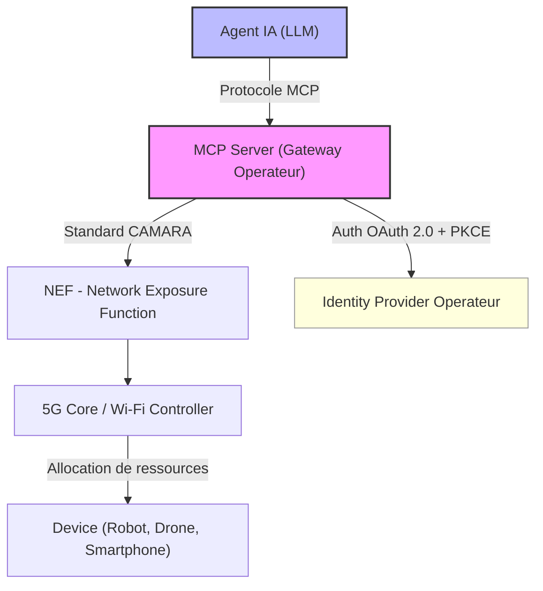
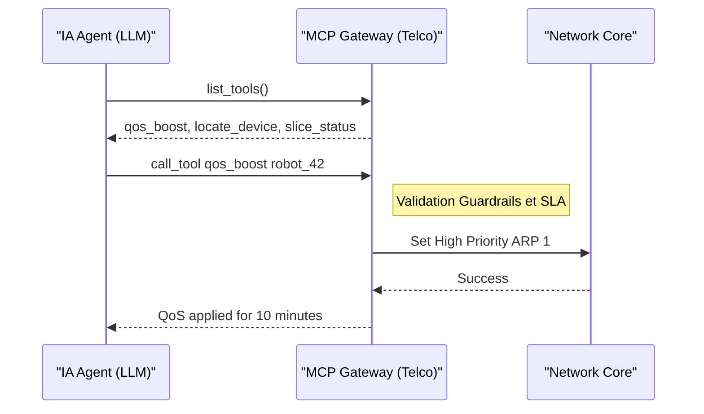

L'industrie des télécoms vient de franchir une étape charnière au Mobile World Congress 2026 à Barcelone. Alors que les débats sur la 6G et le Wi-Fi 8 occupaient les grands halls, une annonce plus discrète mais techniquement fondamentale a retenu l'attention des architectes réseau : l'émergence des **"Agent-Ready APIs"**, propulsées par le **Model Context Protocol (MCP)**.

Ce changement de paradigme, récompensé par le prestigieux GLOMO "Open Gateway Challenge" Award attribué à China Mobile, ZTE et JD.com, marque une rupture nette avec l'ère où les API réseau étaient conçues exclusivement pour des développeurs humains. Nous entrons dans l'ère où le réseau devient un outil nativement pilotable par des agents IA autonomes — sans intervention humaine dans la boucle.

## De "Network as Code" à "Agentic Networking"

Depuis 2022, l'initiative **GSMA Open Gateway** et le projet **CAMARA** (Linux Foundation) ont standardisé l'exposition des capacités réseau via des API REST. Localisation temps réel, QoS à la demande, vérification d'identité SIM, détection de fraude — autant de services télécoms désormais accessibles à un développeur via quelques appels HTTP. C'était la phase "Network as Code" : le réseau comme plateforme de développement.

Cependant, dans un monde où les Large Language Models (LLMs) et les agents IA autonomes deviennent les principaux consommateurs de services numériques, les API REST traditionnelles montrent leurs limites structurelles :

- **Découverte cognitive impossible** : Un agent IA doit ingérer une documentation Swagger/OpenAPI massive pour comprendre comment utiliser un endpoint. Ce "context overhead" est coûteux et peu fiable.
- **Latence de raisonnement** : Envoyer des payloads JSON complets dans la fenêtre de contexte du LLM est inefficace. Un agent préfère une description sémantique d'un "outil" plutôt qu'un schéma de données brut.
- **Manque de dynamicité situationnelle** : Les agents ont besoin de découvrir des capacités réseau disponibles à un instant précis et dans un contexte géographique donné (ex: "ce segment 5G peut-il supporter un URLLC slice pour ce robot maintenant ?").

C'est ici qu'intervient le **Model Context Protocol**.

*Le protocole MCP agit comme une couche d'abstraction sémantique entre l'intelligence artificielle et les API réseau, rendant le réseau "nativement compréhensible" par les LLMs.*

## Qu'est-ce que le Model Context Protocol (MCP) ?

Initialement spécifié par Anthropic et rapidement co-adopté par Google DeepMind, Microsoft et Meta, le **MCP** est un standard ouvert qui permet à n'importe quel serveur d'exposer des ressources, des outils et des prompts à un LLM de manière structurée et sécurisée.

Contrairement à un appel HTTP ordinaire, l'intégration MCP permet à un serveur opérateur d'exposer trois types d'objets à l'agent :

1. **Resources** : Des données en lecture seule accessibles en temps réel — par exemple, l'état de congestion d'une cellule, la carte de couverture 5G d'une zone industrielle, ou le statut d'un slice réseau actif.
2. **Tools** : Des fonctions directement invocables par l'agent — `qos_on_demand(device_id, profile, duration)`, `sim_swap_verify(phone_number)`, `network_slice_allocate(tenant_id, sla_profile)`.
3. **Prompts** : Des modèles de requêtes pré-configurés pour guider l'agent dans des workflows complexes, comme la procédure de basculement automatique entre opérateurs.

En plaçant un **serveur MCP** au-dessus des API CAMARA existantes, les opérateurs transforment leur infrastructure en un catalogue d'outils nativement "ingérable" par les modèles de langage. Le réseau devient, en quelque sorte, un immense "App Store" pour agents IA.

*Architecture de référence MCP intégrée à un réseau 5G-Advanced : le serveur MCP agit comme un orchestrateur sémantique entre l'agent et la NEF (Network Exposure Function).*

## Les APIs CAMARA : matière première des MCP Tools

Le projet CAMARA, hébergé par la Linux Foundation et porté par les principaux opérateurs mondiaux (Orange, Deutsche Telekom, Telefónica, China Mobile), définit aujourd'hui plus de 30 API standardisées. Les plus exploitées dans les démos MWC 2026 :

| API CAMARA | Cas d'usage Agentic |
|---|---|
| `QoS on Demand` | Garantir la latence d'un robot ou d'un drone |
| `Device Location` | Géolocalisation temps réel sans GPS |
| `SIM Swap` | Détection de fraude à la portabilité |
| `Network Slicing` | Attribution dynamique de slice URLLC |
| `Connected Device Status` | Vérifier la connectivité avant d'envoyer une commande |
| `Home Devices QoD` | Optimisation Wi-Fi résidentiel par agent domestique |

La puissance du MCP réside dans le fait que l'agent peut appeler `list_tools()` et obtenir dynamiquement la liste des APIs disponibles sur le réseau visité — sans configuration préalable côté agent.

## La démonstration de force de China Mobile et ZTE à Barcelone

Le GLOMO Award 2026 n'est pas qu'une récompense honorifique. La solution **"AI-powered Open Gateway"** présentée par China Mobile, ZTE et JD.com a démontré une intégration opérationnelle sur des infrastructures réelles.

Le scénario : une flotte de robots de livraison autonomes naviguant dans un environnement urbain dense. Plutôt que des règles de QoS statiques configurées à l'avance par un ingénieur réseau, un **agent IA centralisé** supervise la flotte en temps réel. Lorsqu'un robot entre dans une zone à forte congestion ou doit transmettre un flux vidéo 4K pour une levée de doute sécuritaire, l'agent IA :

1. Interroge le MCP Gateway : `list_tools()` → découvre `qos_boost` disponible.
2. Évalue le coût, la durée et la disponibilité : `get_resource("cell_load", location=robot.gps)`.
3. Déclenche la réservation : `call_tool("qos_boost", {device_id: robot.imsi, priority: "high", duration: 120})`.
4. Confirme le succès et ajuste le plan de navigation.

Tout ce flux s'exécute en moins de 200 millisecondes, sans aucune intervention humaine. Le jury du MWC a salué la capacité de **routage cross-opérateur automatique** — l'agent peut traverser les frontières d'opérateur (roaming) et maintenir ses garanties de QoS sans reconfiguration.

Nokia et Google Cloud ont simultanément annoncé l'extension de leur plateforme **"Network as Code"** avec un support MCP natif, permettant aux agents Google Gemini d'accéder directement aux API réseau Nokia via des tool calls standard.

*Les robots autonomes industriels deviennent des clients directs du réseau, capables de négocier leurs besoins en connectivité en temps réel via un agent IA.*

## Pourquoi cette révolution est critique pour le B2B ?

Pour des opérateurs B2B comme **Wifirst**, cette évolution ouvre des perspectives concrètes dès 2026-2027. La gestion de la performance réseau dans des environnements complexes — hôtellerie, résidences gérées, sites industriels — reposait jusqu'ici sur des politiques préconfigurées et des interventions manuelles.

Avec les **Agent-Ready APIs** et le MCP, les cas d'usage deviennent immédiats :

- **Self-Healing Intelligent** : Un agent SRE détecte une dégradation Wi-Fi sur un étage d'hôtel. Via MCP, il invoque `channel_optimization(zone_id)` sur le contrôleur Wi-Fi 7, corrige le chevauchement de canaux et ferme l'incident — sans ticket.
- **Expérience VIP Augmentée** : Un agent de conciergerie IA, à la demande d'un client souhaitant une visioconférence critique, invoque `qos_reserve(client_mac, latency_profile="ultra-low", duration=60)` sur l'infrastructure Wi-Fi 8 MLO pour garantir une latence sous 5 ms.
- **Sécurité Agentique** : Un agent SOC détecte un comportement suspect sur un port IoT. Il utilise `network_isolate(device_id)` pour segmenter dynamiquement le device suspect avant même la confirmation humaine, réduisant le blast radius.
- **Capacity Planning Proactif** : Un agent d'observabilité analyse les patterns de trafic et invoque des reconfigurations de slices sur l'infrastructure 5G privée en anticipant les pics de charge.

## Les défis : sécurité, gouvernance et standardisation

L'exposition du cœur de réseau à des agents autonomes soulève des questions légitimes de sécurité. Les principales problématiques identifiées par les acteurs du MWC 2026 :

**Authentification et autorisation** : Chaque agent doit s'authentifier via **OAuth 2.0 avec PKCE** avant d'accéder au serveur MCP. Les scopes OAuth définissent précisément les outils accessibles (ex: un agent logistique n'accède qu'aux APIs de QoS, pas à la localisation des clients).

**AI Guardrails** : Des garde-fous policy sont intégrés dans le serveur MCP. Chaque `call_tool()` passe par une couche de validation qui vérifie les SLAs contractuels, les capacités physiques disponibles et les quotas d'utilisation — évitant qu'un agent trop zélé ne sature une cellule entière.

**Audit Trail** : Toute action d'agent génère un log immuable dans le système de l'opérateur (qui a demandé quoi, quand, et avec quel résultat). Essentiel pour la conformité réglementaire NIS2.

**Standardisation en cours** : L'IETF travaille sur un profil "MCP over CAMARA" pour normaliser les schémas de tools et garantir l'interopérabilité cross-opérateur. Attendu en RFC d'ici fin 2026.

*Flux de communication sécurisé entre un agent IA et le cœur de réseau via une passerelle MCP : chaque tool call passe par une validation de politique avant exécution.*

## Le calendrier d'adoption : 2026-2028

D'après les annonces de MWC 2026 et les feuilles de route des principaux équipementiers, l'adoption des Agent-Ready APIs devrait suivre trois phases :

**Phase 1 — 2026 (Pilotes)** : Déploiements pilotes chez les opérateurs tier-1 (China Mobile, Deutsche Telekom, AT&T). Focus sur les APIs CAMARA les plus matures (QoS on Demand, Device Location). Serveurs MCP en mode sandbox.

**Phase 2 — 2027 (Production limitée)** : APIs en production pour les grands comptes industriels. Premiers SLAs "agent-to-network". Standardisation RFC finalisée.

**Phase 3 — 2028 (Généralisation)** : Intégration native MCP dans les contrôleurs Wi-Fi 8 et cœurs 5G-Advanced. Les agents IA des entreprises accèdent directement à leur infrastructure réseau comme ils accèdent aujourd'hui à une base de données.

## Conclusion : Le réseau comme plateforme cognitive

Le passage aux Agent-Ready APIs via le Model Context Protocol représente bien plus qu'une évolution d'interface technique. C'est le moment où le réseau change de nature : il cesse d'être un tuyau intelligent pour devenir une **plateforme cognitive** — une ressource que les systèmes autonomes peuvent interroger, négocier et piloter en temps réel.

Pour les opérateurs B2B, la question ne sera bientôt plus "quel débit offrez-vous ?" mais "vos APIs sont-elles agent-ready ?". Le MWC 2026 l'a clairement posé sur la table. La compétition commence maintenant.

---
*Sources :*
- *GSMA Open Gateway — "From Ambition to Execution: How Open Gateway Is Scaling the Global API Economy" (mars 2026)*
- *The Register — "China Mobile, ZTE & JD.com win GSMA Glomo award" (5 mars 2026)*
- *Nokia & Google Cloud — "Network as Code Ecosystem Expansion via MCP" (mars 2026)*
- *Linux Foundation CAMARA Project — API Catalogue v2.0 (2025)*
- *Anthropic — Model Context Protocol Specification (2024)*
