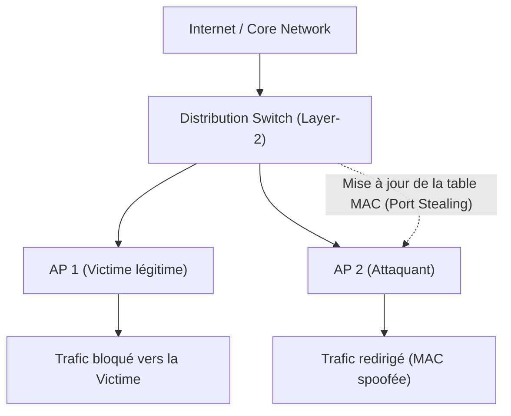
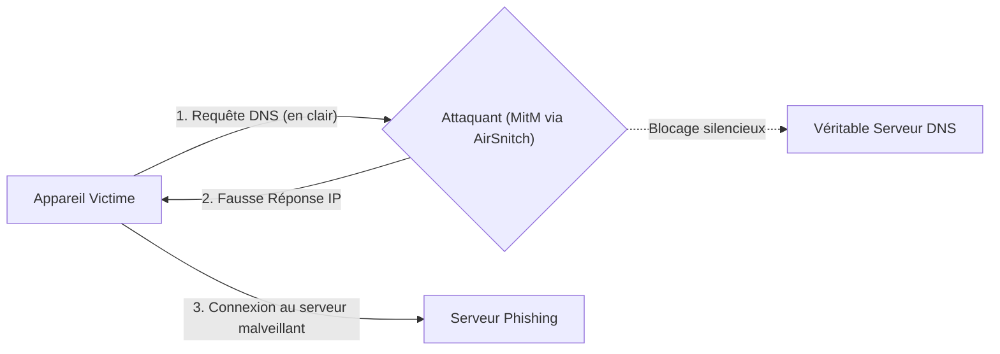

## Introduction : La Fin de l'Isolation Client ?

Le Wi-Fi d'entreprise a toujours reposé sur une promesse fondamentale : l'isolation des clients. Lorsqu'un appareil se connecte à un réseau invité ou au SSID de l'entreprise, il est censé être isolé des autres appareils connectés au même point d'accès (AP) ou au même réseau local (LAN). Cette fonctionnalité, vitale dans les environnements à forte densité tels que les hôtels, les campus, ou les bureaux partagés, vient d'être remise en question par une série d'attaques découvertes récemment et regroupées sous le nom de **AirSnitch**.

Cette nouvelle classe d'attaques ne s'en prend pas directement à la cryptographie qui sous-tend WPA2 ou WPA3. Elle s'attaque à la façon dont les différentes couches du modèle OSI interagissent, plus précisément entre la couche physique (Layer-1) et la couche de liaison de données (Layer-2). En manipulant le commutateur de distribution (distribution switch) qui relie plusieurs AP entre eux, AirSnitch contourne purement et simplement les mécanismes d'isolation, permettant d'intercepter, de modifier et de réinjecter du trafic en clair ou chiffré. 

Dans cet article, nous allons explorer en profondeur les mécanismes de cette faille critique, les vecteurs d'attaque mis en lumière par les chercheurs de la conférence NDSS 2026, et les réponses possibles pour protéger les infrastructures réseaux d'entreprise face à ce qui s'apparente à un retour en force de l'attaque "Man-in-the-Middle" (MitM) sur les ondes.

## Anatomie d'une Attaque : De la Couche 1 à la Couche 2

Pour comprendre la portée d'AirSnitch, il faut revenir aux fondamentaux du fonctionnement d'un réseau sans fil. Contrairement à un commutateur (switch) Ethernet filaire où un port physique est rattaché à une machine de manière statique ou traçable, un réseau Wi-Fi est mobile par nature. Un point d'accès doit constamment associer une adresse MAC à une connexion radio dynamique. 

### Le "Port Stealing" Revisité

L'attaque prend sa source dans un concept connu depuis les débuts des réseaux filaires : le **Port Stealing** (vol de port). Sur un commutateur filaire, un attaquant inondait la table MAC du commutateur avec de fausses adresses pour rediriger le trafic. Dans le contexte d'AirSnitch, la méthode est beaucoup plus chirurgicale.

L'attaquant observe le réseau, repère l'adresse MAC de sa victime et s'associe au point d'accès (ou à un autre point d'accès du même réseau étendu) en utilisant cette même adresse MAC usurpée. L'attaquant force alors le point d'accès (ou le contrôleur Wi-Fi centralisé) à croire que la victime a "roamé" (changé de cellule ou d'interface). Le BSSID de l'attaquant devient la nouvelle destination pour les trames destinées à la victime.

*Schéma illustrant le contournement de l'isolation via le vol de port au niveau du commutateur de distribution.*

Dès lors, le commutateur central met à jour sa table de transmission (MAC-to-port mapping). Les trames (frames) descendantes (downlink) destinées à la cible sont envoyées vers l'attaquant et chiffrées avec la clé temporaire (PTK) de l'attaquant. Le chiffrement WPA n'est pas "cassé" ; il est simplement contourné puisque le commutateur chiffre le paquet pour la mauvaise personne, pensant qu'il s'agit du client légitime.

### L'Illusion Bidirectionnelle (MitM)

Recevoir les données de la cible n'est que la première étape. Pour que l'attaque soit efficace et ne provoque pas une simple déconnexion (Denial of Service), l'attaquant doit établir un relais bidirectionnel invisible.

Une fois la trame reçue, l'attaquant doit rétablir la route vers la victime pour que cette dernière puisse répondre et maintenir la session TCP/IP ouverte. Pour ce faire, l'attaquant envoie une requête "ping" ICMP forgée. Cette requête pousse le commutateur à ré-associer l'adresse MAC de la victime à son AP d'origine. L'attaquant peut ainsi jongler avec les tables de routage Layer-2 à la milliseconde près, créant une position d'homme-du-milieu (MitM) parfaite, capable de lire le trafic descendant et d'intercepter les requêtes montantes.

 

*L'interception du trafic se joue au niveau de l'infrastructure de distribution, rendant l'isolation radio inopérante.*

## L'Effondrement des Frontières : Impact sur RADIUS et WPA Enterprise

Ce qui rend AirSnitch particulièrement inquiétant pour le monde "Enterprise", c'est sa capacité à outrepasser les frontières physiques et logiques établies par les différents points d'accès. 

Généralement, on considère qu'un client connecté à un "Guest SSID" ne peut pas interagir avec un client connecté au "Corporate SSID". Or, si les deux SSID partagent le même commutateur de distribution sous-jacent (ce qui est extrêmement courant, que ce soit via des VLAN ou des trunks partagés vers un contrôleur central), la faille devient exploitable en cross-SSID.

### La Compromission du Protocole RADIUS

L'une des démonstrations les plus alarmantes des chercheurs concerne le protocole RADIUS (Remote Authentication Dial-In User Service). En entreprise, le WPA2/WPA3-Enterprise repose sur un serveur RADIUS pour valider l'identité de chaque utilisateur via des certificats ou des identifiants (EAP-PEAP, EAP-TLS).

1. L'attaquant usurpe l'adresse MAC de la passerelle (gateway) réseau ou de l'AP lui-même.
2. Il parvient à intercepter les paquets RADIUS montants générés lors de l'authentification d'un nouvel utilisateur.
3. En craquant hors-ligne un authentificateur de message (s'il est faiblement configuré ou exposé), il peut récupérer un "shared secret" ou forger des réponses.
4. L'attaquant monte un "Rogue RADIUS" et un faux point d'accès d'entreprise. 

Les terminaux, pensant dialoguer avec l'infrastructure légitime, envoient leurs condensats de mots de passe ou acceptent la connexion. L'isolation client n'a servi à rien puisque la trahison vient de la couche réseau elle-même, qui achemine les trames d'authentification à la mauvaise adresse physique.

## Les Conséquences Pratiques et les Risques

Bien que l'attaque nécessite une certaine proximité et des connaissances techniques pointues (le code d'exploitation n'étant pas encore un outil "press-button" comme le furent certains exploits WEP par le passé), les risques sont immenses.

### Injection et Détournement de Trafic

En se plaçant au milieu de la communication, l'attaquant peut manipuler tout le trafic non chiffré ou mal protégé. Si une page web ou une interface d'administration interne d'entreprise n'utilise pas HTTPS (ou si l'attaquant opère un "downgrade" via des attaques de type SSL Stripping), les identifiants, les cookies de session et les données confidentielles sont directement exposés.

### Empoisonnement DNS (Cache Poisoning)

Même si le trafic applicatif est chiffré de bout en bout (via TLS 1.3 par exemple), les requêtes DNS transitent souvent en clair. L'attaquant peut intercepter les requêtes de résolution de nom et renvoyer des fausses adresses IP, redirigeant ainsi la cible vers des sites de phishing sophistiqués ou des serveurs compromis, contournant ainsi les sécurités du navigateur.

*Le MitM permet l'empoisonnement du cache DNS de la cible en interceptant les flux de résolution.*

### Vulnérabilité Généralisée des Équipements

L'étude présentée au symposium NDSS a testé 11 équipements de gammes différentes (incluant des constructeurs tels que Cisco, Ubiquiti, Netgear, et des firmwares open-source comme OpenWrt). Absolument tous présentaient une vulnérabilité à au moins une des variantes d'AirSnitch. Le problème est structurel : l'absence d'un standard industriel rigide pour l'isolation des clients (Client Isolation) a conduit chaque constructeur à bricoler sa propre solution, souvent pleine de "blind spots" (angles morts) au niveau de l'interaction Layer-1/Layer-2.

## Stratégies de Défense et Perspectives

Réparer AirSnitch n'est pas une mince affaire. Contrairement à une faille logicielle classique qui se colmate par une mise à jour mineure, cette faille touche au comportement fondamental des puces réseau (silicon) et des algorithmes de commutation des routeurs. Certains fabricants travaillent déjà sur des correctifs, mais la résolution définitive pourrait prendre des années pour l'ensemble du parc matériel mondial.

### Segmenter Rigoureusement (Micro-segmentation)

La séparation des SSID (Guest vs Corporate) via des VLAN n'est plus suffisante si la logique de commutation sous-jacente reste vulnérable au Port Stealing. Il est impératif d'auditer les configurations pour empêcher les sauts de VLAN ("VLAN hopping") et de s'assurer que les tables ARP et MAC sont protégées contre les modifications erratiques (Dynamic ARP Inspection, Port Security, etc.). Toutefois, ces fonctionnalités de niveau "wired" ne sont pas toujours parfaitement transposables sur les contrôleurs "wireless" où la mobilité des adresses MAC est une nécessité.

 

*Une architecture Zero Trust devient indispensable pour pallier les faiblesses inhérentes aux protocoles réseau sous-jacents.*

### Le Zero Trust Network Access (ZTNA) : L'Ultime Rempart

Si la couche de liaison est compromise, la seule solution viable est de considérer que le réseau lui-même est hostile, qu'il s'agisse d'un hotspot public ou du LAN du siège social de l'entreprise. C'est ici que l'approche **Zero Trust** prend tout son sens.

Dans un modèle ZTNA, l'adresse IP ou l'appartenance au réseau Wi-Fi de l'entreprise n'octroie aucune confiance par défaut. Chaque session, chaque requête applicative doit être authentifiée mutuellement (Mutual TLS, certificats clients) et chiffrée. Si un attaquant utilise AirSnitch pour intercepter le trafic d'un poste de travail vers un serveur interne, l'absence des clés cryptographiques applicatives empêchera tout déciffrement ou falsification du trafic TLS. L'attaquant verra passer des trames opaques, sans pouvoir les exploiter.

### Ce qu'il faut retenir

AirSnitch nous rappelle une leçon d'humilité en cybersécurité : l'empilement de protocoles cryptographiques sophistiqués au sommet (WPA3, OWE) ne protège pas contre un effondrement des fondations (Layer-2). Pour les opérateurs de réseaux B2B et les DSI, il est urgent d'intégrer cette menace dans les modèles de risque (Threat Modeling) et de s'assurer que les flux internes critiques ne se reposent jamais exclusivement sur l'isolation fournie par le point d'accès. 

Tant que les correctifs firmware ne seront pas massivement déployés (et validés techniquement), seule l'hygiène applicative stricte (HTTPS everywhere, ZTNA, VPN sécurisés) garantira l'intégrité des données dans les espaces connectés. Le Wi-Fi est un environnement radio partagé par essence : traitons-le comme tel.