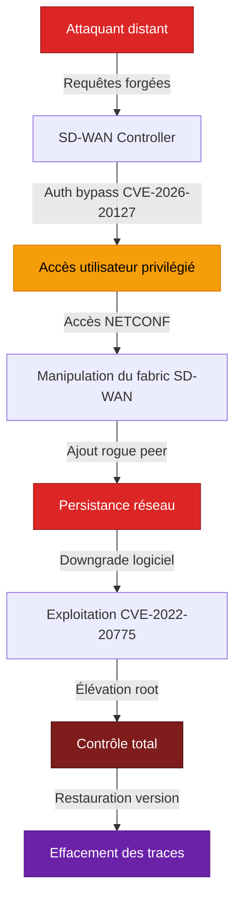

## Le fantôme dans le SD-WAN : trois ans d'exploitation silencieuse

Le 25 février 2026, Cisco a publié un avis de sécurité qui a secoué l'industrie réseau. La vulnérabilité CVE-2026-20127, notée **CVSS 10.0** — le score maximal possible — affecte le cœur même de l'infrastructure SD-WAN : le Catalyst SD-WAN Controller (anciennement vSmart) et le Catalyst SD-WAN Manager (anciennement vManage). Mais le véritable choc ne vient pas du score. Il vient de la révélation que cette faille est **activement exploitée depuis au moins 2023** par un acteur sophistiqué identifié sous le nom **UAT-8616**.

Pour les opérateurs réseau comme Wifirst, qui gèrent des milliers de sites clients, cette affaire est un cas d'école sur la menace persistante qui pèse sur les équipements de bordure de réseau (*network edge devices*). Analysons en détail ce qui s'est passé, comment l'attaque fonctionne, et surtout quelles leçons en tirer.

*CVE-2026-20127 : la faille CVSS 10.0 qui a permis à des attaquants de contrôler des infrastructures SD-WAN pendant trois ans.*

## Anatomie de CVE-2026-20127 : le bypass d'authentification ultime

### Ce que fait la vulnérabilité

CVE-2026-20127 est une **vulnérabilité de contournement d'authentification** (*authentication bypass*) dans le mécanisme de peering du Cisco Catalyst SD-WAN Controller. En termes simples, le système qui vérifie l'identité des pairs réseau (les contrôleurs, routeurs et gestionnaires qui forment le *control plane* SD-WAN) ne fonctionne pas correctement.

Un attaquant peut exploiter cette faille en envoyant des **requêtes spécialement conçues** vers un système vulnérable. Le résultat : il obtient un accès en tant qu'utilisateur interne à hauts privilèges (non-root), ce qui lui ouvre la porte vers **NETCONF** — le protocole de configuration réseau qui permet de manipuler l'intégralité du fabric SD-WAN.

### Pourquoi CVSS 10.0 ?

Le score maximal s'explique par la combinaison de trois facteurs critiques :

| Critère CVSS | Valeur | Impact |
|---|---|---|
| Vecteur d'attaque | Réseau | Exploitable à distance, sans accès physique |
| Complexité | Faible | Pas besoin de conditions particulières |
| Authentification | Aucune | L'attaquant n'a besoin d'aucun identifiant |
| Impact Confidentialité | Élevé | Accès aux configurations et données réseau |
| Impact Intégrité | Élevé | Modification des configurations SD-WAN |
| Impact Disponibilité | Élevé | Capacité de perturber le fabric entier |

L'absence totale de prérequis (pas d'authentification, pas de configuration spéciale, exploitable à distance) combinée à un impact maximal sur les trois piliers CIA (Confidentialité, Intégrité, Disponibilité) justifie le score de 10.0.

*Chaîne d'exploitation complète de UAT-8616 : de l'accès initial au contrôle total avec effacement des traces.*

## UAT-8616 : le profil d'un acteur persistant

### Qui est UAT-8616 ?

C'est l'équipe **Talos** de Cisco qui a attribué les activités post-compromission au groupe **UAT-8616** (*Unattributed Threat Actor*). Le préfixe "UAT" indique que l'attribution géographique ou organisationnelle reste incertaine, mais le niveau de sophistication observé pointe vers un acteur étatique ou para-étatique.

Les caractéristiques de UAT-8616 qui frappent :

- **Patience opérationnelle** : trois ans d'exploitation active sans détection
- **Connaissance approfondie** de l'architecture Cisco SD-WAN et de ses mécanismes internes (peering, NETCONF, versions logicielles)
- **Capacité anti-forensique** : restauration des versions logicielles après exploitation pour effacer les traces
- **Ciblage stratégique** : organisations à haute valeur incluant des secteurs d'infrastructure critique (CI)

### La chaîne d'attaque décomposée

La sophistication de UAT-8616 se révèle dans la séquence d'exploitation documentée par Cisco Talos et l'Australian Signals Directorate (ASD) :

**Phase 1 — Accès initial** : Exploitation de CVE-2026-20127 pour obtenir un accès utilisateur privilégié non-root sur le SD-WAN Controller.

**Phase 2 — Injection du rogue peer** : Utilisation de l'accès NETCONF pour ajouter un *rogue peer* (pair malveillant) au fabric SD-WAN. Ce pair illégitime, mais d'apparence légitime, permet à l'attaquant de s'insérer durablement dans l'architecture.

**Phase 3 — Escalade de privilèges** : Downgrade volontaire de la version logicielle du contrôleur vers une version vulnérable à **CVE-2022-20775** (une faille d'élévation de privilèges connue et corrigée depuis 2022).

**Phase 4 — Obtention root** : Exploitation de CVE-2022-20775 sur la version dégradée pour passer de l'utilisateur privilégié à **root**.

**Phase 5 — Anti-forensique** : Restauration de la version logicielle originale pour effacer toute trace du downgrade. Le système semble intact pour les administrateurs.

**Phase 6 — Persistance** : Le rogue peer reste en place, offrant un accès permanent et furtif au fabric SD-WAN.

*La sophistication anti-forensique de UAT-8616 : downgrade, exploitation, puis restauration pour effacer les preuves.*

## L'effet domino : cinq CVE supplémentaires et l'exploitation s'accélère

### La cascade de vulnérabilités

La révélation de CVE-2026-20127 n'était que le début. Le 6 mars 2026, Cisco a confirmé l'**exploitation active** de deux vulnérabilités supplémentaires dans le Catalyst SD-WAN Manager :

- **CVE-2026-20122** (CVSS 7.1) : Vulnérabilité d'écrasement arbitraire de fichiers. Un attaquant disposant de simples identifiants *read-only* avec accès API peut écraser n'importe quel fichier sur le système de fichiers local.

- **CVE-2026-20128** (CVSS 5.5) : Vulnérabilité de divulgation d'information permettant d'obtenir les privilèges du *Data Collection Agent* (DCA) avec de simples identifiants vManage.

En parallèle, trois autres CVE ont été corrigées dans le même lot de patchs :
- **CVE-2026-20126**, **CVE-2026-20129** et **CVE-2026-20133** — dont l'exploitation active n'a pas été confirmée à ce jour.

### L'exploitation massive est en cours

Les données de **watchTowr**, plateforme de gestion proactive des expositions, révèlent une situation alarmante. Selon Ryan Dewhurst, responsable du renseignement de menaces proactif chez watchTowr :

> *"Le plus grand pic d'activité s'est produit le 4 mars, avec des attaques largement réparties dans le monde, les zones basées aux États-Unis voyant une activité légèrement supérieure."*

Les observateurs rapportent :
- Des tentatives d'exploitation depuis **de nombreuses adresses IP uniques**
- Le déploiement de **web shells** sur les systèmes compromis
- Une exploitation **massive et opportuniste** qui dépasse désormais le cercle de UAT-8616

Le message est clair : **tout système exposé doit être considéré comme compromis jusqu'à preuve du contraire**.

*La CISA a émis la directive d'urgence ED 26-03, imposant aux agences fédérales américaines un inventaire et une remédiation immédiate.*

## Réponse institutionnelle : CISA, ASD et directive d'urgence

### La mobilisation internationale

La gravité de CVE-2026-20127 a déclenché une réponse coordonnée sans précédent entre plusieurs agences :

- **Australian Signals Directorate (ASD/ACSC)** : C'est l'agence australienne qui a initialement signalé la vulnérabilité à Cisco. L'ASD a publié un guide de chasse aux menaces (*threat hunt guide*) et des conseils de mitigation détaillés.

- **CISA (US)** : Émission de la **Directive d'Urgence ED 26-03** imposant aux agences fédérales civiles américaines de :
  1. **Inventorier** tous les systèmes Cisco SD-WAN en service
  2. **Collecter** les snapshots virtuels et les logs
  3. **Patcher** sans délai
  4. **Rechercher** des preuves de compromission
  5. **Implémenter** le *Cisco Catalyst SD-WAN Hardening Guide*
  
  **Date limite : 26 mars 2026** — les agences doivent avoir documenté toutes les actions de remédiation.

- **Cisco Talos** : Publication d'une analyse complète de la chaîne de post-exploitation de UAT-8616 avec des indicateurs de compromission (IoC).

### Versions corrigées

Cisco a publié les correctifs dans les versions suivantes :

| Version affectée | Version corrigée |
|---|---|
| Antérieure à 20.9 | Migration obligatoire |
| 20.9 | 20.9.8.2 |
| 20.11 | 20.12.6.1 |
| 20.12 | 20.12.5.3 ou 20.12.6.1 |
| 20.13 | 20.15.4.2 |
| 20.14 | 20.15.4.2 |
| 20.15 | 20.15.4.2 |
| 20.16 | 20.18.2.1 |
| 20.18 | 20.18.2.1 |

```mermaid
graph LR
    subgraph "Phase 1 : Détection"
        A["Inventaire SD-WAN"] --> B["Collecte logs et snapshots"]
        B --> C["Threat hunting IoC"]
    end
    subgraph "Phase 2 : Remédiation"
        C --> D["Patch vers version corrigée"]
        D --> E["Vérification peers autorisés"]
        E --> F["Hardening NETCONF"]
    end
    subgraph "Phase 3 : Durcissement"
        F --> G["Désactiver HTTP/FTP inutiles"]
        G --> H["Segmentation réseau"]
        H --> I["Monitoring continu"]
    end

    style A fill:#3b82f6,stroke:#1d4ed8,color:#fff
    style D fill:#f59e0b,stroke:#d97706,color:#000
    style G fill:#10b981,stroke:#059669,color:#fff
    style I fill:#10b981,stroke:#059669,color:#fff
```

*Plan de remédiation en trois phases : détecter, corriger, durcir.*

## Ce que cette affaire change pour les opérateurs réseau

### Le SD-WAN comme surface d'attaque critique

Cette série de vulnérabilités confirme une tendance documentée depuis plusieurs années : les **équipements de bordure de réseau** (*network edge devices*) sont devenus des cibles prioritaires pour les acteurs avancés. Le SD-WAN, conçu pour simplifier et centraliser la gestion des WAN distribués, concentre par définition le *control plane* — et donc le pouvoir sur l'ensemble du fabric.

Pour un opérateur comme Wifirst, qui gère des milliers de sites clients avec des architectures SD-WAN, les implications sont directes :

- **Inventaire permanent** : Connaître en temps réel chaque composant SD-WAN déployé, sa version et son état de patch
- **Monitoring du peering** : Détecter toute connexion de pair non autorisée — le vecteur de persistance de UAT-8616
- **Segmentation du management plane** : Isoler les interfaces de gestion (vManage, NETCONF) des réseaux de production
- **Audit régulier des versions** : Les downgrade volontaires sont un signal d'alerte — ils ne devraient jamais survenir en production

### Leçons pour les architectes réseau

**1. Le zero-day silencieux est la norme, pas l'exception.** CVE-2026-20127 a été exploité pendant trois ans avant d'être découvert. L'hypothèse de travail doit être que des vulnérabilités similaires existent dans d'autres équipements.

**2. Le patching ne suffit pas.** Même après application des correctifs, une investigation forensique est nécessaire pour vérifier qu'aucun rogue peer n'a été ajouté et qu'aucune modification de configuration n'a été effectuée.

**3. NETCONF doit être protégé comme un accès root.** L'accès NETCONF permet de reconfigurer l'intégralité du fabric. Il doit être limité par ACL, chiffré, et surveillé en continu.

**4. Le hardening proactif est non négociable.** Cisco recommande explicitement de :
  - Désactiver HTTP pour le portail d'administration vManage
  - Couper les services réseau non requis (HTTP, FTP)
  - Changer le mot de passe administrateur par défaut
  - Limiter l'accès depuis les réseaux non sécurisés
  - Surveiller le trafic de logs pour détecter toute anomalie

*Un SOC en alerte : la surveillance continue des pairs SD-WAN est désormais une priorité opérationnelle.*

## Au-delà du SD-WAN : la semaine noire de Cisco

Pour compléter le tableau, Cisco a également publié cette semaine des correctifs pour **deux vulnérabilités de sévérité maximale** dans son Secure Firewall Management Center (FMC) :

- **CVE-2026-20079** : Contournement d'authentification permettant un accès root à distance
- **CVE-2026-20131** : Exécution de code à distance (RCE) en tant que root

Ces vulnérabilités ne sont pas liées à la campagne UAT-8616, mais elles soulignent l'ampleur du défi sécuritaire auquel font face les opérateurs d'infrastructure Cisco. Quand le gestionnaire de pare-feu lui-même est vulnérable à un bypass d'authentification, c'est toute la chaîne de confiance qui doit être repensée.

## Conclusion : de la réaction à l'anticipation

L'affaire CVE-2026-20127 marque un tournant. Elle démontre que les équipements réseau — longtemps considérés comme des "boîtes noires" fiables — sont en réalité des surfaces d'attaque de premier plan. L'exploitation silencieuse pendant trois ans, la sophistication de la chaîne d'attaque (downgrade → exploit → restauration), et la vitesse à laquelle l'exploitation est devenue massive après la divulgation sont autant de signaux d'alarme.

Pour les opérateurs B2B, la conclusion est limpide : **le monitoring du control plane SD-WAN doit avoir le même niveau de priorité que la surveillance du data plane**. Les architectures Zero Trust ne doivent pas s'arrêter aux utilisateurs et aux applications — elles doivent englober les équipements d'infrastructure eux-mêmes.

Les organisations qui n'ont pas encore patché ont une fenêtre qui se referme rapidement. Comme le résume watchTowr : *"tout système exposé doit être considéré comme compromis jusqu'à preuve du contraire."*

---

## Références

- [Cisco Security Advisory — CVE-2026-20127](https://sec.cloudapps.cisco.com/security/center/content/CiscoSecurityAdvisory/cisco-sa-sdwan-auth-bypass)
- [Cisco Talos — UAT-8616 Analysis](https://blog.talosintelligence.com/uat-8616-sdwan-exploitation/)
- [CISA Emergency Directive ED 26-03](https://www.cisa.gov/emergency-directive-26-03)
- [Australian Signals Directorate — Threat Hunt Guide](https://www.cyber.gov.au/about-us/advisories/cisco-sd-wan-vulnerability)
- [BleepingComputer — Cisco flags more SD-WAN flaws](https://www.bleepingcomputer.com/news/security/cisco-flags-more-sd-wan-flaws-as-actively-exploited-in-attacks/)
- [The Hacker News — CVE-2026-20127](https://thehackernews.com/2026/02/cisco-sd-wan-zero-day-cve-2026-20127.html)
