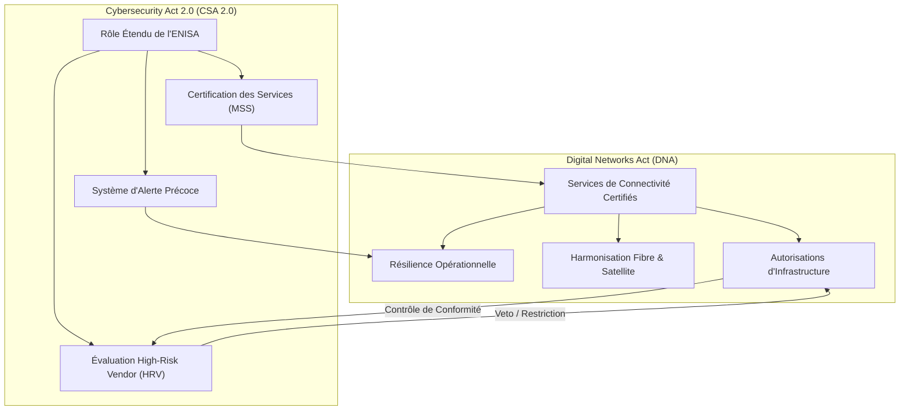
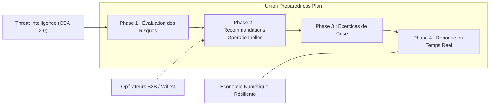

# Digital Networks Act (DNA) : L'Infrastructure comme Actif Stratégique — Vers la Souveraineté et la Résilience Européenne en 2026

En ce mois de mars 2026, l'industrie des télécommunications en Europe franchit un cap historique. Longtemps cantonnés au rôle de "fournisseurs de tuyaux", les opérateurs voient leur statut radicalement transformé par l'entrée en vigueur de deux piliers législatifs majeurs : le **Digital Networks Act (DNA)** et le **Cybersecurity Act 2.0 (CSA 2.0)**. 

Ce n'est pas une simple mise à jour réglementaire ; c'est un changement de paradigme. Pour David Berkowicz, CTO chez Wifirst, et l'ensemble des acteurs du B2B, ces textes redéfinissent ce qu'est une infrastructure numérique : non plus un service commoditisé, mais un **actif stratégique essentiel** à la sécurité nationale et à la compétitivité économique de l'Union.

## 1. Le Digital Networks Act (DNA) : La fin du "Dumb Pipe"

Le DNA marque la volonté de l'Europe de sortir de la dépendance technologique et de structurer son espace numérique comme un tout cohérent. L'un des points les plus saillants est la reconnaissance explicite des réseaux de communications électroniques comme **infrastructures essentielles**.

*Image 1 : Le passage au tout-fibre permet une télémétrie granulaire et une réduction de la surface d'attaque physique.*

### Un statut d'infrastructure critique renforcé

Jusqu'à présent, la protection des réseaux était largement déléguée aux États membres via NIS2. Avec le DNA, la Commission Européenne centralise la doctrine. L'infrastructure n'est plus seulement protégée ; elle est pilotée pour garantir une continuité de service absolue face aux crises géopolitiques ou climatiques. Cette centralisation s'accompagne d'un régime d'autorisation unifié pour les opérateurs paneuropéens, simplifiant le déploiement transfrontalier mais durcissant les exigences techniques sur chaque nœud du réseau.

L'une des pierres angulaires de ce statut est l'obligation de "Souveraineté des Données en Transit". Le DNA impose que les métadonnées de routage et les logs de supervision des infrastructures critiques ne quittent jamais le territoire de l'Union. Pour les acteurs du Cloud Networking, cela impose un rapatriement massif des control planes (plans de contrôle) vers des instances hébergées en Europe, mettant fin aux architectures de gestion centralisées outre-Atlantique ou en Asie.

*Schéma 1 : L'écosystème intégré du DNA et du CSA 2.0 pour une infrastructure souveraine.*

Ce changement de statut impose aux opérateurs des obligations de reporting et de redondance beaucoup plus strictes. Pour un opérateur comme Wifirst, cela signifie que la résilience n'est plus une option commerciale ou un SLA (Service Level Agreement), mais une exigence réglementaire de conformité. Le DNA introduit également la notion de "Service de Connectivité Garanti" pour les secteurs vitaux (santé, énergie, transport), où la latence et la disponibilité doivent être maintenues même en mode dégradé.

## 2. Le "Union Preparedness Plan" : La résilience en action

L'une des innovations majeures du DNA est la création du **Union Preparedness Plan for Digital Infrastructures**. Piloté par l'Organe des régulateurs européens des communications électroniques (BEREC), ce plan vise à créer un bouclier opérationnel paneuropéen.

### Comment fonctionne le plan de préparation ?

Le plan ne se contente pas de lister des bonnes pratiques. Il définit quatre phases opérationnelles pour garantir que l'Europe peut "garder la lumière allumée" numériquement parlant, même en cas de rupture majeure (câbles sous-marins sectionnés, attaques systémiques).

*Schéma 2 : Les quatre phases du Union Preparedness Plan pour la continuité des infrastructures.*

Les opérateurs devront participer à des exercices de crise réguliers et mettre en œuvre des recommandations spécifiques sur la diversité des routes, la sécurisation physique des points de présence (PoP) et la redondance hybride Terrestre/Satellite. L'évaluation des risques (Phase 1) ne portera plus uniquement sur les pannes matérielles, mais intégrera des scénarios hybrides : cyberattaques simultanées sur le plan de contrôle et coupures physiques sur le plan de données.

La Phase 2 ("Recommandations Opérationnelles") pourra imposer, par exemple, l'usage de protocoles de routage à haute convergence ou le déploiement de sondes d'intégrité de signal sur les liens fibre pour détecter les écoutes passives par courbure de fibre (fiber tapping).

## 3. Fibre et Satellite : L'ère de la convergence imposée

Le DNA pousse également à une accélération sans précédent de la transition vers le "tout-fibre" et à l'intégration du satellite comme composante standard du backhaul.

### La fin du cuivre et le mandat FTTX

Le texte prévoit des incitations financières massives, mais aussi des contraintes réglementaires, pour achever la migration des réseaux cuivre vers la fibre d'ici fin 2026. L'objectif est simple : réduire la surface d'attaque (le cuivre est plus vulnérable et moins monitorable en temps réel que la fibre) et augmenter l'efficacité énergétique. Le passage au "Full Fiber" permet une télémétrie beaucoup plus fine (via OTDR - Optical Time Domain Reflectometer intégrés aux SFP) pour localiser instantanément une rupture de lien à quelques mètres près.

### Le satellite comme "Failover" souverain

Pour la première fois, le DNA harmonise les autorisations de spectre satellite au niveau de l'UE. L'idée est de favoriser l'émergence de constellations souveraines (comme IRIS²) tout en intégrant les solutions LEO (Low Earth Orbit) existantes dans les plans de continuité d'activité. Pour les sites critiques en zone blanche ou isolés, le satellite devient un prérequis de résilience. Les routeurs d'entreprise de 2026 devront intégrer nativement des algorithmes de SD-WAN hybride capables de basculer d'un lien fibre à un lien LEO en moins de 10ms, tout en maintenant les sessions TCP actives.

*Image 2 : L'intégration du satellite LEO comme failover souverain devient un prérequis de la résilience 2026.*

## 4. Cybersecurity Act 2.0 (CSA 2.0) : Le bras armé de la sécurité

Si le DNA définit la structure, le **Cybersecurity Act 2.0** définit les règles de défense. Publié en janvier 2026, ce texte révise en profondeur les prérogatives de l'ENISA (Agence de l'Union européenne pour la cybersécurité).

### L'ENISA au cœur de la détection et des alertes précoces

Le CSA 2.0 transforme l'ENISA en une véritable tour de contrôle. L'agence gère désormais un **répertoire unifié des menaces** et opère une plateforme de notification d'incidents qui alimente directement le Union Preparedness Plan. L'innovation majeure réside dans le **Système d'Alerte Précoce (Early Alert System)**. Grâce à l'IA prédictive, l'ENISA pourra corréler des signaux faibles (scans réseau inhabituels, instabilité de routage BGP localisée) pour émettre des bulletins d'alerte aux opérateurs critiques avant même qu'une attaque n'atteigne son pic.

### La Certification MSS : Vers un standard de confiance B2B

Pour les entreprises, la nouveauté majeure réside dans la certification des **Managed Security Services (MSS)**. Finis les services de sécurité "maison" sans audit : pour opérer sur des infrastructures critiques, les prestataires devront décrocher une certification européenne (ENISA S22a) garantissant leur niveau de compétence et leur indépendance vis-à-vis des juridictions extra-communautaires.

Cette certification couvre :
-   **L'Indépendance Technologique** : Preuve que les briques de sécurité (firewalls, SIEM, EDR) ne sont pas soumises à des lois d'accès extra-territoriales (comme le Cloud Act US).
-   **La Compétence Opérationnelle** : Audit des processus du SOC (Security Operations Center), temps de réponse garantis et formation continue des analystes.
-   **L'Audit du Code** : Pour les briques logicielles critiques, l'exigence d'un SBOM (Software Bill of Materials) auditable.

*Image 3 : L'ENISA opère désormais une plateforme d'alerte précoce alimentée par les données de télémétrie des opérateurs certifiés.*

## 5. La question des High-Risk Vendors (HRV)

Le sujet qui fâche, mais qui est désormais gravé dans le marbre : la gestion des fournisseurs à haut risque. Le DNA et le CSA 2.0 créent un lien indissociable entre l'autorisation d'opérer une infrastructure et le choix des équipements.

Les opérateurs ne pourront plus utiliser de composants critiques (cœur de réseau, gestion des identités, supervision) provenant de fournisseurs désignés comme HRVs par la Commission. Cette mesure vise directement à protéger la supply chain contre l'espionnage et le sabotage étatique. 

Le CSA 2.0 introduit également une obligation de **Root of Trust (RoT) matériel** pour tous les équipements déployés en bordure de réseau (Edge). Chaque routeur, chaque point d'accès Wi-Fi devra disposer d'une puce sécurisée certifiée UE pour garantir l'intégrité du firmware dès le démarrage.

## 6. Wi-Fi 7/8 et MLO : La brique de résilience locale

Le DNA ne s'arrête pas aux frontières de l'opérateur (WAN). Il s'intéresse également à la résilience du dernier mètre. Le déploiement de technologies comme le **Multi-Link Operation (MLO)** du Wi-Fi 7 et du futur Wi-Fi 8 (802.11bn) devient un atout réglementaire.

En permettant à un appareil de se connecter simultanément sur plusieurs bandes (2.4, 5 et 6 GHz), le MLO assure une résilience contre le brouillage local ou les interférences. Dans le cadre d'un "Campus Industriel Critique" (DNA-compliant), l'usage du MLO permet de garantir que les flux de contrôle-commande ne subissent aucune rupture, même en cas de saturation accidentelle ou malveillante d'une bande de fréquences.

## 7. IA et AIOps : Automatiser la conformité DNA

Le respect des obligations du DNA (reporting en temps réel, auto-remédiation) est humainement impossible à l'échelle de réseaux modernes. L'usage de l'**AIOps (AI for IT Operations)** devient donc une brique de conformité indispensable.

Les algorithmes d'IA permettent de :
-   **Automatiser les notifications d'incidents** vers les plateformes de l'ENISA en moins de 15 minutes (exigence CSA 2.0).
-   **Prédire les pannes d'infrastructure** avant qu'elles ne surviennent grâce à l'analyse de télémétrie haute fréquence (gNMI).
-   **Orchestrer le Failover dynamique** entre fibre et satellite en fonction de la qualité de service (QoS) mesurée en temps réel.

## 8. Quel impact pour les entreprises et les opérateurs B2B ?

Pour Wifirst et ses clients, cette révolution législative se traduit par quatre changements majeurs en 2026 :

1.  **La Résilience par Design** : Les solutions réseau doivent intégrer nativement des mécanismes de failover multi-vecteurs (Fibre + 5G SA + Satellite).
2.  **La Certification des Services** : Les clients B2B exigeront de plus en plus des services de connectivité certifiés CSA 2.0 (standard MSS).
3.  **L'Observabilité en Temps Réel** : Les obligations de reporting du DNA imposent une télémétrie granulaire. On ne se contente plus de savoir si le lien est "Up" ou "Down" ; on doit monitorer son intégrité de bout en bout.
4.  **L'Audit de la Supply Chain** : Chaque composant matériel doit être traçable, avec un SBOM clair et sans HRV.

## Conclusion : Vers le Connectivity Cloud Souverain

Avec le DNA et le CSA 2.0, l'Europe ne se contente plus de subir les tendances mondiales du cloud et du réseau. Elle définit sa propre voie : celle du **Connectivity Cloud**. Une infrastructure unifiée, programmable, sécurisée et, surtout, résiliente.

Pour le CTO moderne, ces textes ne sont pas des contraintes administratives, mais des leviers pour construire des réseaux capables de supporter l'explosion de l'IA et de l'IoT industriel. En 2026, la connectivité n'est plus un coût ; c'est la garantie de survie d'une entreprise dans un monde numérique instable. La souveraineté n'est plus un concept abstrait, c'est une architecture technique.

*Sources : European Commission DNA Proposal (March 2026), BEREC Guidelines on Union Preparedness Plan, ENISA CSA 2.0 Framework, IEEE 802.11bn (Wi-Fi 8) Preliminary Specifications.*
