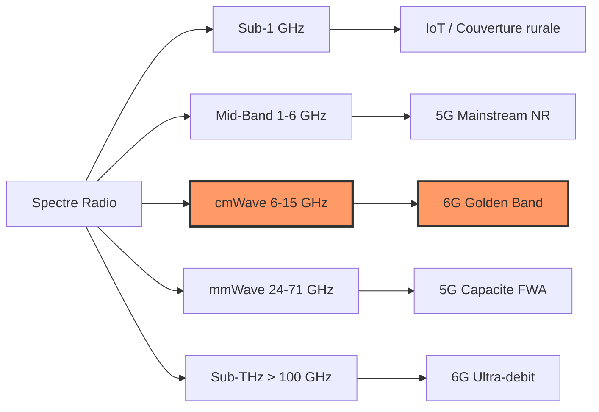
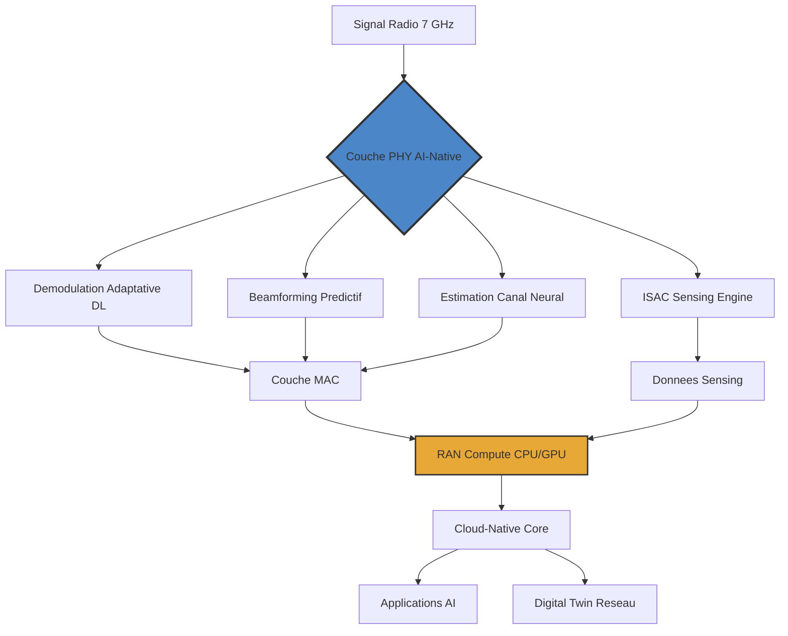

## Le MWC 2026 marque la naissance industrielle de la 6G

Le Mobile World Congress 2026 restera dans les mémoires comme le point de bascule où la 6G a cessé d'être un sujet de recherche académique pour devenir une réalité matérielle. L'annonce la plus marquante de cette semaine ne vient pas d'une keynote à Barcelone, mais d'une validation technique majeure réalisée au siège d'Ericsson à Plano, au Texas.

En collaboration avec **Apple**, **MediaTek** et **Qualcomm**, Ericsson a finalisé la première session **Over-the-Air (OTA)** au monde basée sur les pré-standards 6G. Ce test ne s'est pas limité à des débits théoriques en laboratoire : il a impliqué un écosystème complet — infrastructure radio, architecture cloud-native, chipsets et terminaux prototypes — ouvrant officiellement la voie à l'industrialisation de la prochaine génération de connectivité.

Pour les opérateurs réseau comme Wifirst, ce jalon marque le début d'un cycle de planification stratégique. Comprendre les briques technologiques validées lors de ce test est essentiel pour anticiper les architectures de demain.

## Le spectre 7 GHz : la "Golden Band" de la 6G

L'un des enseignements majeurs de ce test est l'utilisation du spectre **cmWave (centimeter-wave)**, particulièrement la bande des **6-8 GHz** avec une largeur de porteuse de **400 MHz**. Si la 5G a popularisé la bande 3,5 GHz comme colonne vertébrale du mid-band, la 6G cherche son salut dans ce que les ingénieurs d'Ericsson appellent désormais la "Golden Band".

### Pourquoi le 7 GHz change la donne

Le choix de cette bande de fréquence n'est pas anodin. Le spectre 7 GHz offre un équilibre optimal entre trois paramètres critiques :

- **Capacité** : avec 400 MHz de largeur de bande par porteuse (contre 100 MHz typiques en 5G mid-band), les débits potentiels sont multipliés par quatre à iso-technologie.
- **Propagation** : contrairement aux ondes millimétriques (mmWave, 26-39 GHz) de la 5G qui peinent à franchir un mur ou un feuillage, le 7 GHz conserve des propriétés de pénétration indoor acceptables pour une couverture urbaine dense.
- **Efficacité spectrale** : les technologies MIMO massif fonctionnent de manière optimale à ces fréquences, permettant un multiplexage spatial agressif avec des antennes de taille raisonnable.

*Positionnement du spectre cmWave (6-15 GHz) dans l'allocation fréquentielle : la "Golden Band" combine capacité et propagation.*

La démonstration de Plano a spécifiquement ciblé les performances en **uplink** — un choix stratégique. Les cas d'usage 6G les plus disruptifs (robotique téléopérée, streaming vidéo temps réel depuis des capteurs, jumeaux numériques) nécessitent des débits montants massifs que les architectures 5G actuelles peinent à fournir.

*Concept de terminal intégrant un NPU dédié à la gestion de l'interface radio AI-native et aux fonctions de sensing ISAC.*

## Over-the-Air vs laboratoire : pourquoi ce test est un tournant

Les tests en laboratoire utilisent des câbles coaxiaux pour connecter directement l'émetteur au récepteur. C'est propre, reproductible, mais totalement déconnecté de la réalité du terrain. Un test OTA, en revanche, confronte la technologie aux conditions réelles : propagation multi-trajets, interférences, effets de masquage, Doppler.

Le test de Plano a validé simultanément plusieurs briques technologiques critiques dans un environnement radio réel :

| Composant validé | Description | Fournisseur |
|---|---|---|
| Radio Hardware | Antennes cmWave 7 GHz, 400 MHz BW | Ericsson |
| RAN Compute | Plateforme baseband CPU/GPU | Ericsson |
| Air Interface | Interface radio software-defined, AI-native | Ericsson |
| Cloud Platform | Architecture cloud-native distribuée | Ericsson |
| Chipset terminal | Modem 6G pré-standard | MediaTek / Qualcomm |
| Prototype device | Terminal de référence | Apple |

Le fait qu'Ericsson ait précisé que son architecture logicielle est **déployable indifféremment sur CPU et GPU** est un signal fort. Cela signifie que les opérateurs pourront choisir leur plateforme de calcul en fonction de leurs besoins : CPU pour l'efficacité énergétique dans les zones rurales, GPU pour les traitements IA intensifs dans les zones denses.

## ISAC : quand le réseau devient son propre capteur

La grande révolution technologique portée par la 6G — et validée lors de cette session OTA — est l'**ISAC (Integrated Sensing and Communication)**. Jusqu'à présent, les ondes radio servaient exclusivement à transporter des données. Avec la 6G, l'infrastructure réseau se transforme en un système radar distribué et passif.

### Le principe technique

En analysant la réflexion des signaux radio sur les objets, les personnes et les véhicules dans l'environnement, le réseau peut "percevoir" son contexte spatial sans nécessiter de capteurs supplémentaires. La bande 7 GHz est particulièrement adaptée à ce double usage : sa longueur d'onde (environ 4 cm) offre une résolution spatiale suffisante pour distinguer des objets de taille humaine, tout en conservant une portée de communication exploitable.

### Applications concrètes pour les opérateurs B2B

Pour un opérateur comme Wifirst, l'ISAC ouvre des perspectives considérables dans les environnements qu'il connecte déjà :

- **Hôtellerie et résidences** : détection de présence dans les chambres pour l'optimisation énergétique (chauffage, climatisation), sans caméras ni atteinte à la vie privée.
- **Espaces de coworking** : comptage en temps réel de l'occupation des salles de réunion et des open-spaces.
- **Industrie et logistique** : tracking centimétrique des actifs et des personnes dans les entrepôts et les sites de production.
- **Santé** : détection de chutes dans les EHPAD et les établissements de soin, sans dispositif porté par le résident.

*Centre de supervision réseau intégrant les données de sensing ISAC superposées à la cartographie du site.*

## Architecture AI-Native : l'intelligence descend dans la couche physique

Une autre rupture fondamentale validée par l'écosystème Ericsson-Apple-MediaTek-Qualcomm est l'intégration de l'**IA native** dès la couche physique (PHY) du réseau. Dans la 5G, l'intelligence artificielle est typiquement une couche logicielle superposée pour l'optimisation réseau (AIOps). Dans la 6G, elle **remplace** certains algorithmes traditionnels de traitement du signal.

### Ce que l'IA change concrètement

L'interface radio "software-defined" testée à Plano utilise des réseaux de neurones pour trois fonctions critiques :

1. **Beamforming prédictif** : au lieu de calculer la direction optimale du faisceau à chaque slot (approche classique), l'IA prédit la trajectoire du terminal et ajuste le faisceau par anticipation. Résultat : latence réduite et stabilité accrue pour les terminaux en mouvement.

2. **Estimation et égalisation de canal** : les algorithmes classiques (MMSE, Zero-Forcing) sont remplacés par des modèles de deep learning qui apprennent les caractéristiques spécifiques du canal radio en temps réel. Les performances en environnement hostile (indoor dense, mobilité élevée) s'en trouvent significativement améliorées.

3. **Gestion énergétique intelligente** : les composants radio (amplificateurs, chaînes RF) sont activés et désactivés à la microseconde en fonction de la charge prédite, réduisant la consommation sans impacter la qualité de service.

*Architecture complète de la pile 6G AI-Native : de l'interface radio à la plateforme cloud, chaque couche intègre des capacités d'apprentissage.*

## L'écosystème : Apple, MediaTek, Qualcomm et le signal d'industrialisation

L'histoire des télécoms enseigne une leçon implacable : l'infrastructure réseau n'a de valeur que si les terminaux suivent. En associant simultanément **Apple** (leader premium des smartphones), **MediaTek** (premier fondeur mondial de chipsets mobiles en volume) et **Qualcomm** (leader du modem haut de gamme), Ericsson ne démontre pas seulement une technologie — il démontre un **écosystème**.

### Qualcomm et la collaboration sur les standards

En parallèle du test OTA, Ericsson et Qualcomm ont annoncé un accord de collaboration visant à "faire passer la 6G du concept à la preuve, en traçant un chemin clair vers la commercialisation". Les deux entreprises travaillent ensemble sur la définition des spécifications 3GPP Release 21, avec un focus particulier sur :

- La coexistence entre le spectre cmWave 6G et le Wi-Fi 6 GHz (un sujet critique pour les opérateurs convergents).
- Les mécanismes de handover 5G-Advanced vers 6G.
- L'intégration hardware des fonctions ISAC dans les chipsets mobiles.

### Ce que cela signifie pour les opérateurs

Pour les opérateurs B2B comme Wifirst, cette synergie garantit que dès le déploiement des premières cellules 6G (horizon 2029-2030), les parcs de terminaux seront déjà compatibles. C'est une rupture majeure avec le cycle 5G, où les premiers réseaux ont été déployés bien avant que les terminaux grand public ne soient disponibles en volume.

*Représentation des trois couches fonctionnelles d'un réseau 6G : communication, sensing et intelligence artificielle, opérant simultanément sur la même infrastructure radio.*

## Le contexte géopolitique : la course au leadership 6G

Le choix de Plano, Texas, pour ce premier test n'est pas anodin. Börje Ekholm, CEO d'Ericsson, a déclaré que *"la 6G sera fondamentale pour la manière dont l'intelligence artificielle se déploiera dans la société, et sera critique pour la sécurité nationale, la prospérité économique et la compétitivité mondiale des États-Unis"*.

Cette déclaration s'inscrit dans un contexte géopolitique tendu autour du leadership technologique :

- Les **États-Unis** accélèrent via le projet **AI-WIN** (AI-Native Wireless Networks), un consortium réunissant NVIDIA, Cisco, T-Mobile, MITRE et l'ODC pour développer un stack AI-RAN américain.
- L'**Europe** pousse via les programmes Horizon Europe et le projet **Hexa-X-II**, mais accuse un retard sur le silicon (absence de fondeur de chipsets mobiles européen).
- La **Chine** maintient une avance en nombre de brevets 6G déposés, avec Huawei et ZTE en pointe.

Pour les opérateurs européens, la question de la **souveraineté technologique** reste entière : les équipements 6G seront-ils exclusivement américains et asiatiques, ou l'Europe parviendra-t-elle à maintenir une filière via Nokia et l'Open RAN ?

## Timeline : de la R&D à la commercialisation

Le test OTA de Plano s'inscrit dans un calendrier précis :

| Jalon | Horizon | Statut |
|---|---|---|
| Premiers tests OTA pré-standard | Q1 2026 | ✅ Réalisé (Ericsson, Plano) |
| Définition du cahier des charges IMT-2030 (ITU) | 2026-2027 | En cours |
| Gel des spécifications 3GPP Release 21 | 2028 | Planifié |
| Premiers réseaux pilotes commerciaux | 2029-2030 | Prévu |
| Déploiement commercial à grande échelle | 2030-2032 | Prévu |

Toutefois, les avancées sur le spectre 7 GHz et l'IA native vont commencer à infuser dans la **5G-Advanced (Release 19/20)** bien avant la commercialisation de la 6G. Les opérateurs qui investissent aujourd'hui dans des architectures cloud-native et O-RAN seront les mieux positionnés pour absorber la transition.

## Ce que Wifirst et les opérateurs B2B doivent retenir

Le test OTA d'Ericsson n'est pas une curiosité de laboratoire. C'est le premier signal concret que la 6G suit une trajectoire d'industrialisation crédible. Pour les opérateurs B2B spécialisés en connectivité d'entreprise, trois enseignements se dégagent :

1. **Le réseau convergent est inévitable.** La coexistence 6G cmWave + Wi-Fi 7/8 dans la même bande 6-7 GHz va nécessiter des stratégies de gestion du spectre sophistiquées. Les opérateurs qui maîtrisent déjà le Wi-Fi enterprise seront en pole position.

2. **L'ISAC crée de nouvelles sources de revenus.** Un réseau qui "voit" son environnement peut vendre du sensing-as-a-service en plus de la connectivité. C'est un changement fondamental de business model.

3. **L'architecture AI-native exige des compétences nouvelles.** La gestion d'un réseau 6G nécessitera des équipes capables de travailler avec des modèles de deep learning, pas uniquement avec des configurations classiques de paramètres radio.

La 6G ne se contente plus de promettre : elle a désormais ses premiers benchmarks Over-the-Air. Et comme le rappelle la démonstration de Plano, ce n'est plus une affaire de chercheurs — c'est une affaire d'ingénieurs.

---

*Sources : Ericsson Press Release (28 février 2026), Digital Watch Observatory, PR Newswire, Qualcomm-Ericsson Joint Statement, MWC 2026 Technical Sessions.*
