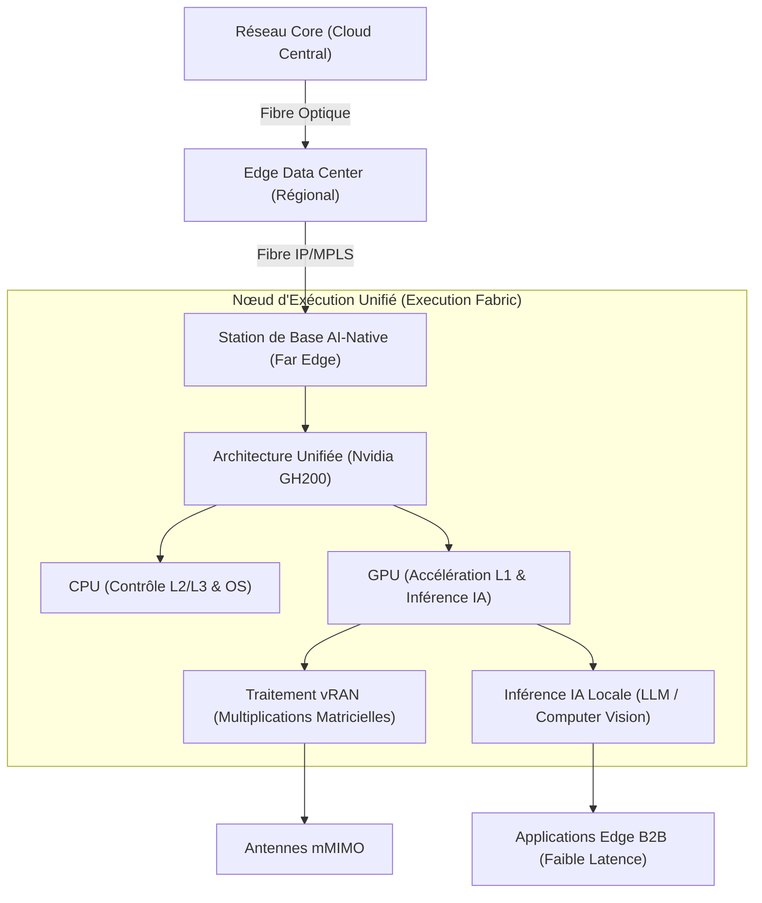
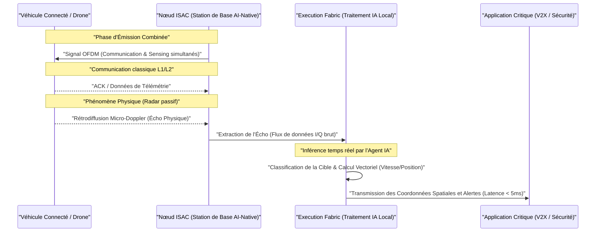

*L’infrastructure réseau mondiale évoluant vers un tissu d'exécution (Execution Fabric) unifié pour l'IA.*

## Introduction : L'Avènement du Substrat d'Exécution Unifié

Le Mobile World Congress (MWC) 2026 restera dans les annales comme le point de bascule définitif de l'industrie des télécommunications. Pendant des décennies, le réseau a été conçu, optimisé et perçu principalement comme un "tuyau" – certes de plus en plus large, rapide et intelligent, mais dont la finalité première restait le transport de l'information d'un point A à un point B. Aujourd'hui, face à l'explosion des besoins en calcul liés à l'intelligence artificielle générative et aux modèles fondationnels, cette vision est devenue obsolète. Le réseau ne se contente plus de connecter les centres de calcul ; il *devient* le centre de calcul.

Nous assistons à la transformation profonde de l'infrastructure réseau en un véritable « Execution Fabric » (substrat d'exécution unifié). Ce changement de paradigme redéfinit l'architecture même des nœuds de communication, effaçant la frontière historique entre le traitement du signal télécom et l'inférence des algorithmes d'intelligence artificielle. Les équipements réseaux de nouvelle génération ne sont plus de simples routeurs ou des antennes passives, mais des nœuds de calcul distribués, capables d'exécuter des charges de travail IA là où la donnée est générée. Cet article propose une plongée en profondeur dans les architectures AI-Native, les stratégies des équipementiers comme Nokia et des opérateurs comme Orange, et les nouveaux cas d'usage industriels tels que l'ISAC qui découlent de cette révolution technologique majeure.

## De l'AIOps au Réseau AI-Native : Une Différence Ontologique

Pour comprendre l'ampleur de la révolution présentée en 2026, il est crucial de dissiper une confusion sémantique fréquente dans l'industrie B2B : la différence fondamentale entre l'AIOps (Artificial Intelligence for IT Operations) et l'architecture "AI-Native". Ces deux concepts, bien que complémentaires, opèrent à des niveaux totalement différents de la pile technologique.

### Les Limites de l'AIOps traditionnel

L'AIOps, massivement déployé entre 2020 et 2025, est une approche de gestion et d'exploitation. Il s'agit d'une couche logicielle superposée ("overlay") à une infrastructure réseau existante et traditionnelle. Dans un modèle AIOps, les équipements réseaux (routeurs, commutateurs, firewalls, antennes) génèrent des téraoctets de données de télémétrie, de logs et d'événements. Ces données sont ensuite acheminées vers un lac de données centralisé (généralement dans le cloud), où des algorithmes de Machine Learning analysent les modèles pour détecter les anomalies, prédire les pannes matérielles, ou recommander des optimisations de routage. 

Bien que l'AIOps ait permis des gains d'efficacité opérationnelle majeurs (réduction du MTTR - Mean Time To Resolution), il souffre de limitations intrinsèques. Il est asynchrone, limité par la latence du transfert des données vers le cloud, et surtout, il ne modifie en rien la nature matérielle des équipements qui composent le réseau. L'IA observe le réseau, mais elle ne vit pas *dans* le réseau.

*Station de base AI-Native exploitant la puissance des GPU pour fusionner traitement radio et calcul d'IA.*

### L'Essence du Réseau AI-Native

Le réseau "AI-Native", en revanche, implique une refonte totale de la conception matérielle et logicielle dès la base ("from the ground up"). L'intelligence artificielle n'est plus un outil de supervision externe, mais une composante organique de l'infrastructure de traitement. Dans une architecture AI-Native, les ressources de calcul (Compute) sont partagées nativement entre les fonctions de télécommunication (comme le traitement en bande de base 5G/6G) et les charges de travail d'IA (inférence de modèles locaux, traitement vidéo embarqué, etc.).

Cette symbiose matérielle signifie que les nœuds du réseau intègrent des processeurs hautement parallèles (GPU, NPU, ou accélérateurs dédiés) capables d'exécuter indifféremment des algorithmes de réseau d'accès radio (RAN) virtualisé ou des réseaux de neurones complexes. L'infrastructure devient un substrat d'exécution liquide où les ressources CPU et GPU sont allouées dynamiquement en quelques microsecondes, selon que le besoin immédiat concerne la modulation d'un signal radio ou la détection d'une anomalie de sécurité via l'analyse comportementale du trafic en temps réel. C'est cette convergence au niveau du silicium qui donne naissance au véritable "Execution Fabric".

## La Vision Nokia : Le Réseau comme "Execution Fabric" Intégral

Parmi les équipementiers, Nokia s'est positionné à l'avant-garde de cette transformation avec sa vision "AI-First Network". Pour le géant européen, l'objectif n'est plus seulement de fournir de la connectivité, mais de déployer une plateforme de calcul massivement distribuée, continue et omniprésente.

### Convergence Totale : RAN, Core, IP et Optique

La stratégie "Execution Fabric" de Nokia repose sur l'intégration harmonieuse de tous les domaines du réseau qui fonctionnaient jusqu'ici en silos. Le RAN (Radio Access Network), le cœur de réseau (Core), le routage IP et la couche de transport optique ne sont plus gérés comme des entités distinctes, mais comme un continuum de ressources de calcul et de transport.

Dans cette architecture, l'orchestrateur central possède une visibilité totale sur l'état des capacités GPU disponibles à l'extrémité du réseau (Far Edge), dans les centres de données régionaux (Edge), et dans le cœur. Si une application d'entreprise nécessite une inférence IA à très faible latence (par exemple, pour la robotique industrielle), l'Execution Fabric de Nokia peut instancier le modèle d'IA directement sur la station de base la plus proche, tout en configurant dynamiquement un chemin optique dédié pour garantir un backhaul sans gigue.

### Le Point d'Inflexion : Le Test Nvidia Grace Hopper 200

La preuve de concept la plus spectaculaire de cette vision AI-Native a été la démonstration réalisée par Nokia en utilisant la super-puce Nvidia Grace Hopper 200 (GH200). Traditionnellement, les équipements de traitement radio (Baseband Units) utilisaient des circuits intégrés spécifiques aux applications (ASIC) ou des processeurs de signal numérique (DSP) hautement spécialisés. L'approche vRAN (Virtual RAN) avait commencé à déplacer ces charges vers des CPU standards, mais se heurtait à des limites d'efficacité énergétique pour les couches de traitement physique (Layer 1).

Avec le test GH200, Nokia et Nvidia ont prouvé qu'il était possible d'utiliser une architecture hybride CPU-GPU pour faire tourner *simultanément* le traitement du signal RAN (qui repose massivement sur des multiplications matricielles complexes) et des charges de travail d'IA générative sur le même composant matériel. Le GPU Grace Hopper, avec son architecture de mémoire unifiée massive, permet de traiter les signaux radio 5G Advanced avec une efficacité redoutable, tout en utilisant les cœurs tensoriels restants pour analyser les modèles de trafic locaux, optimiser l'allocation spectrale ou offrir des services d'inférence en tant que service (AIaaS) aux entreprises environnantes. 

Cette mutualisation du matériel réduit considérablement le TCO (Total Cost of Ownership) pour les opérateurs. Une station de base n'est plus un coût mort ("sunk cost") uniquement dédié à la connectivité ; elle devient un actif de calcul monétisable, capable de louer sa puissance de calcul GPU inutilisée pendant les heures creuses.

*Architecture conceptuelle d'un nœud de réseau AI-Native, illustrant le partage des ressources CPU/GPU entre le traitement radio (vRAN) et l'inférence IA, formant la base de l'Execution Fabric.*

## Programmabilité et "Agentic AI" : Le Réseau Autonome

Une infrastructure matérielle capable d'exécuter des charges IA partagées n'est utile que si elle peut être programmée et consommée facilement par les développeurs. C'est ici qu'intervient le concept de "Network as Code", poussé conjointement par les acteurs des télécoms et les fournisseurs cloud.

*Visualisation d'une plateforme intelligente orchestrant dynamiquement la connectivité fixe, mobile et satellite.*

### Network as Code et l'Alliance Nokia-Google Cloud

La complexité d'un réseau AI-Native hybride dépasse les capacités de gestion humaine. Nokia, en partenariat avec Google Cloud, a introduit l'approche "Network as Code" combinée à l'Agentic AI (IA basée sur des agents autonomes). Le réseau expose désormais l'intégralité de ses capacités (bande passante, latence garantie, puissance de calcul Edge GPU, fonctions de sécurité) sous forme d'APIs déclaratives.

L'Agentic AI représente la prochaine évolution de l'automatisation logicielle. Contrairement à un simple script d'automatisation qui suit un chemin prédéfini, un agent IA possède un objectif (par exemple : "Maintenir la qualité d'expérience vidéo pour un stade de 50 000 personnes tout en minimisant la consommation énergétique") et la capacité d'interagir de manière autonome avec les APIs "Network as Code" pour atteindre cet objectif.

Ces agents IA, hébergés sur Google Cloud mais interagissant directement avec l'Execution Fabric de Nokia, peuvent négocier entre eux. Un agent responsable de l'efficacité énergétique peut décider de mettre en veille certains composants optiques, tandis qu'un agent de QoS (Quality of Service) peut allouer dynamiquement des tranches de réseau (Network Slices) et de l'espace GPU à la volée pour traiter un pic de demande imprévu. Le réseau devient un écosystème logiciel vivant, capable de s'auto-optimiser, de s'auto-réparer et de se reconfigurer en temps réel sans intervention d'un centre de supervision (NOC) traditionnel.

## Déploiements à l'Échelle : Stratégies et Enjeux Financiers

La transition vers le réseau AI-Native nécessite des investissements colossaux, justifiés par des perspectives de création de valeur inédites et par une pression géopolitique et énergétique croissante.

### Orange et le Plan "Trust the Future"

L'opérateur historique français Orange a parfaitement intégré cette mutation dans son plan stratégique "Trust the Future". Pour un opérateur de rang mondial, le défi principal réside dans la gestion de la complexité extrême des réseaux hybrides. Orange opère simultanément des réseaux fixes (FTTH massivement déployé), des réseaux mobiles (5G Standalone), et intègre de plus en plus de backhaul satellitaire (LEO) et de connexions sous-marines.

L'utilisation de l'IA pour l'automatisation de bout en bout de ces réseaux hétérogènes n'est plus une option de R&D, mais un impératif de rentabilité. Orange a chiffré l'objectif de création de valeur générée par l'IA à hauteur de 600 millions d'euros. Cette valeur colossale se divise en plusieurs piliers :
1.  **L'optimisation stricte des CAPEX/OPEX** : En utilisant des agents IA pour modéliser des jumeaux numériques du réseau complet, Orange peut prédire exactement où le déploiement d'un nouveau nœud fibre ou 5G sera le plus rentable, en évitant le surdimensionnement (over-provisioning) qui plombait historiquement les bilans des opérateurs.
2.  **La maintenance prédictive absolue** : L'infrastructure AI-Native alerte et déclenche des actions correctives automatisées ou des reroutages de trafic avant même qu'une défaillance optique sous-marine ou qu'un dysfonctionnement d'antenne n'affecte l'utilisateur final.
3.  **L'efficacité énergétique** : Le poste de dépense énergétique d'un opérateur est majeur. L'extinction dynamique des composants radio (Micro-sleep, Deep-sleep) pilotée par une IA analysant les modèles de trafic en temps réel permet des économies substantielles.

### Oracle, l'AI-RAN Alliance et l'Écosystème Nvidia

L'ampleur de la transformation attire de nouveaux acteurs puissants. Oracle, acteur historique des bases de données d'entreprise et du cloud, redéfinit désormais les communications mondiales comme une "Core AI Infrastructure". Oracle se positionne pour fournir les backbones logiciels à très haute vitesse capables de relier les nouveaux "Gigawatt data centers" – des installations massives dédiées à l'entraînement de LLMs qui consomment littéralement l'énergie d'une centrale électrique entière. Les réseaux télécoms traditionnels doivent muter pour devenir le système nerveux à très haut débit et très faible latence liant ces fermes de calcul titanesques.

En parallèle, la dimension géostratégique se matérialise à travers des consortiums comme l'AI-RAN Alliance. La présentation par Nvidia de sa "All-American AI-RAN Stack" illustre la volonté de souveraineté technologique. L'objectif est de proposer une pile matérielle et logicielle complète, standardisée et ouverte, permettant de briser le verrouillage des vendeurs traditionnels ("vendor lock-in") tout en garantissant des performances optimales pour les charges de travail hybrides vRAN et IA. L'Alliance vise à accélérer la commercialisation des spécifications AI-RAN pour que chaque opérateur puisse déployer des stations de base prêtes pour l'IA, transformant le RAN mondial en la plus grande plateforme d'Edge Computing décentralisée au monde.

## ISAC : Quand le Réseau Devient un Capteur Intelligent

Si la mutualisation des ressources CPU/GPU est la fondation du réseau AI-Native, son expression la plus innovante et concrète en 2026 est sans aucun doute l'ISAC (Integrated Sensing and Communication). L'ISAC représente la convergence de deux mondes historiquement séparés : les télécommunications (transmission de données) et la télédétection (radar, sonar).

### Le Principe Physique et Algorithmique

Dans les réseaux traditionnels, les ondes radiofréquences sont générées pour transporter des paquets de données d'une antenne à un récepteur. L'énergie dissipée par les échos, les réflexions et la rétrodiffusion sur l'environnement physique était considérée comme du bruit de fond ("fading" ou trajets multiples) que des algorithmes sophistiqués cherchaient à annuler pour récupérer le signal clair.

L'ISAC renverse complètement ce paradigme. Avec l'augmentation des fréquences (vers les bandes millimétriques de la 5G Advanced et les ondes sub-térahertz de la future 6G), la résolution spatiale des ondes radio devient exceptionnelle. Le réseau AI-Native, grâce à sa puissance de calcul locale (Execution Fabric), utilise ces ondes OFDM non seulement pour communiquer, mais pour analyser sciemment les réflexions du signal sur l'environnement physique. Le réseau devient un radar distribué à ultra-haute résolution, sans ajouter un seul équipement physique supplémentaire. L'IA embarquée dans la station de base traite instantanément ces données I/Q (In-phase and Quadrature) brutes pour modéliser l'environnement physique en temps réel.

*Le réseau agissant comme un radar haute résolution pour la détection d'objets et la perception de l'environnement.*

### Cas d'Usage Révolutionnaires en B2B

L'impact de l'ISAC sur l'industrie et les services urbains est massif :

1.  **Détection de Drones (UAV)** : Face aux défis de sécurité de l'espace aérien à basse altitude (infrastructures critiques, stades, aéroports), les réseaux cellulaires 5G/6G équipés d'ISAC peuvent détecter, suivre et classifier les drones non autorisés avec une précision sub-métrique. Les ondes radio rebondissent sur les rotors du drone ; le retour micro-Doppler est analysé par l'IA de l'antenne qui identifie la signature unique du drone, sans nécessiter le déploiement d'un réseau de radars militaires coûteux.
2.  **Smart Office et Bâtiments Intelligents** : À l'intérieur des bâtiments d'entreprise, les points d'accès Wi-Fi 7 avancés et les picocellules cellulaires peuvent utiliser l'ISAC pour détecter la présence humaine, le rythme respiratoire, ou identifier le positionnement précis des employés sans aucune caméra. Cela résout les enjeux de confidentialité (Privacy-by-design) tout en optimisant le chauffage, l'éclairage et la sécurité incendie avec une granularité parfaite.
3.  **V2X (Vehicle-to-Everything) Avancé** : Pour les véhicules autonomes, les temps de réaction de l'ordre de la milliseconde sont critiques. Une infrastructure routière AI-Native utilisant l'ISAC peut "voir" dans les angles morts (au coin d'une rue, derrière un camion) en utilisant le signal 5G rebondissant sur les piétons ou d'autres véhicules. Le réseau exécute le modèle de perception localement et alerte immédiatement le véhicule d'un danger imminent, offrant un niveau de sécurité qu'aucun capteur embarqué (Lidar/Caméra) seul ne pourrait atteindre.

*Séquençage des opérations au sein d'une architecture ISAC : l'intégration transparente des capacités de détection physique et de communication réseau via le traitement IA à la périphérie.*

## Conclusion : L'Avenir de l'Infrastructure Réseau

La vision présentée lors de l'édition 2026 du Mobile World Congress ne relève plus de la simple prospective : elle est l'architecturation concrète de l'avenir numérique. L'infrastructure réseau, autrefois cantonnée au rôle ingrat mais essentiel de convoyeur d'octets, s'affranchit de ses limites historiques. En devenant un "Execution Fabric" universel, le réseau AI-Native réunit enfin les mondes des télécommunications et de l'informatique de pointe (Cloud computing, IA générative) en un seul et même substrat d'exécution.

Sous l'impulsion de pionniers comme Nokia avec son AI-First Network, d'opérateurs ambitieux comme Orange cherchant à extraire une valeur massive de l'automatisation, et d'écosystèmes comme l'AI-RAN Alliance portée par la puissance du silicium Nvidia, une nouvelle chaîne de valeur émerge. De la gestion hybride et autonome des architectures satellitaires et terrestres, jusqu'à la transformation des antennes en capteurs radar grâce à l'ISAC, l'intelligence artificielle n'est plus seulement une charge de travail transitant *sur* le réseau : elle *est* le réseau. Pour les directeurs techniques et les architectes infrastructures du monde B2B, l'enjeu n'est plus simplement d'assurer la connectivité, mais de maîtriser cette nouvelle fabrique computationnelle globale, véritable moteur de la prochaine révolution industrielle.
