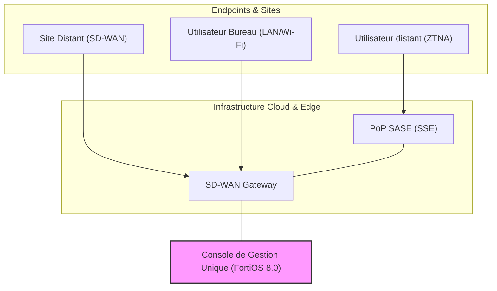
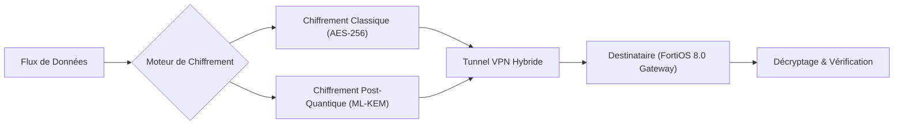

Les annonces du premier trimestre 2026 marquent un tournant décisif pour les infrastructures réseau d'entreprise. Fortinet, l'un des leaders mondiaux de la cybersécurité, vient de lever le voile sur FortiOS 8.0 lors de sa conférence Accelerate 2026. Cette nouvelle version de son système d'exploitation ne se contente pas d'ajouter des fonctionnalités ; elle incarne la convergence ultime entre le réseau et la sécurité à travers le concept de SASE Unifié (Secure Access Service Edge) et l'intégration massive de l'IA générative opérationnelle.

Pour les opérateurs de réseaux gérés comme Wifirst, ces évolutions sont cruciales. Elles permettent de répondre aux deux défis majeurs de 2026 : la sécurisation d'un périmètre devenu totalement fluide (télétravail, multi-cloud, IoT) et la nécessité d'automatiser la gestion opérationnelle pour faire face à la complexité croissante des infrastructures.

### Le SASE Unifié : Consolidation et Simplification

Jusqu'à présent, le SASE était souvent perçu comme un assemblage de solutions disparates : SD-WAN d'un côté, SSE (Security Service Edge) de l'autre, avec parfois des passerelles ZTNA (Zero Trust Network Access) additionnelles. FortiOS 8.0 change la donne en proposant une architecture véritablement unifiée.

Cette unification repose sur un agent unique (FortiClient) et une console de gestion commune, permettant d'appliquer des politiques de sécurité cohérentes, que l'utilisateur soit au bureau, dans un café ou en déplacement. L'un des apports majeurs de cette version est l'intégration native de capacités de "Digital Experience Monitoring" (DEM). Le réseau ne se contente plus d'être sécurisé ; il devient auto-analysé. Si un utilisateur se plaint de lenteurs sur Microsoft 365, le système est capable d'identifier instantanément si le goulot d'étranglement se situe sur le Wi-Fi local, le lien WAN ou directement chez le fournisseur SaaS.

*Architecture de convergence SASE Unifié sous FortiOS 8.0*

### L'IA Générative au service du NetOps : FortiAI

L'IA n'est plus un simple mot-clé marketing dans FortiOS 8.0. Elle devient un assistant opérationnel concret via l'interface FortiAI. Basée sur des modèles de langage (LLM) entraînés spécifiquement sur des téraoctets de données de télémétrie réseau et de menaces de cybersécurité, FortiAI transforme la manière dont les administrateurs interagissent avec leur infrastructure.

Au lieu de naviguer dans des menus complexes ou de scripter des requêtes CLI, l'opérateur peut désormais interroger son réseau en langage naturel : "Identifie les anomalies de trafic sur le segment IoT au cours des 2 heures passées et propose une règle de micro-segmentation pour isoler les dispositifs suspects." FortiAI ne se contente pas de répondre ; il génère la configuration prête à être déployée, réduisant ainsi drastiquement le "Mean Time To Resolution" (MTTR).

### La Sécurité Quantum-Safe : Anticiper la Menace de Demain

Une surprise majeure de FortiOS 8.0 est l'introduction de capacités "Quantum-Safe". Alors que la menace du "Harvest Now, Decrypt Later" (HNDL) devient une préoccupation réelle pour les entreprises traitant des données sensibles à long terme, Fortinet intègre des algorithmes de cryptographie post-quantique (PQC) dans ses tunnels VPN et ses protocoles de gestion.

Cette anticipation est vitale. En 2026, préparer l'infrastructure à résister aux futurs ordinateurs quantiques n'est plus une option de recherche, mais une nécessité de conception pour les réseaux critiques. L'implémentation dans FortiOS 8.0 permet une transition progressive, en supportant des modes hybrides qui combinent le chiffrement classique (ECC/RSA) avec les nouveaux standards du NIST (comme ML-KEM).

*Mécanisme de tunnel hybride Quantum-Safe dans FortiOS 8.0*

### Conclusion : Vers des Réseaux Auto-Adaptatifs

Avec FortiOS 8.0, nous entrons dans l'ère des réseaux auto-adaptatifs. La convergence entre SD-WAN, SASE et IA permet de passer d'une gestion réactive ("réparer ce qui est cassé") à une gestion prédictive. Pour les clients de Wifirst, cela se traduit par une disponibilité accrue et une posture de sécurité qui évolue en temps réel face aux menaces.

L'enjeu n'est plus seulement de connecter des points A et B, mais de créer une "structure d'exécution" sécurisée et intelligente capable de soutenir la transformation numérique accélérée des entreprises. Fortinet, avec cette version 8.0, pose les jalons de ce que sera l'infrastructure réseau standard de la fin de la décennie.
